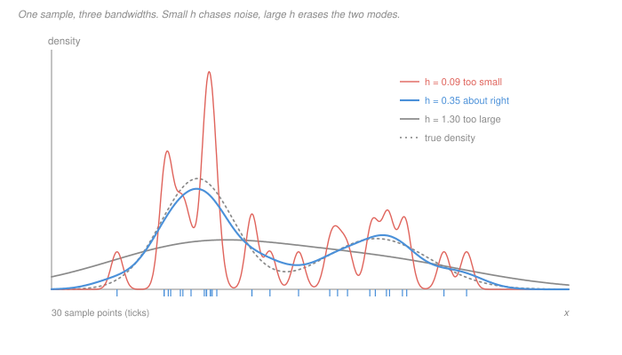

# Statistical Learning Theory · Lesson 6.4: Density estimation

> ⏱ ~15 min · Module 6: Unsupervised learning · Builds on: [1.2 (bias–variance)](01-02-the-bias-variance-decomposition.md), [6.3 (mixtures and EM)](06-03-mixture-models-and-em.md) · Unlocks: the last object in the course — and a way to re-read all of it through the dimension $d$

## Why this matters

In [1.2](01-02-the-bias-variance-decomposition.md), Example 2, you balanced a squared bias against a variance for $k$-nearest neighbours on a grid and got a convergence rate: the reducible error fell like $n^{-4/5}$, with the optimal neighbourhood growing as the data arrived. That was one dimension, and $n^{-4/5}$ looked like a mild tax — slower than the $1/n$ a correctly specified parametric model earns, but nothing to lose sleep over.

This lesson runs the identical balancing act on the hardest unsupervised question — estimate the *whole distribution* $p$, not a conditional mean — and carries the dimension along for the ride. The exponent comes out $4/(4+d)$. At $d = 1$ that is $4/5$: your $k$-NN rate, recovered exactly, which is the sign you are looking at the same phenomenon twice. At $d = 10$ it is $0.286$, and the tax is no longer mild.

Nothing else in this library estimates a density — the sibling [`machine-learning`](../../machine-learning/syllabus.md) explicitly does not cover it — so this is also the one place where the **curse of dimensionality**, alluded to for five modules, finally gets stated with numbers attached.

## The idea

There are exactly two ways to answer "what distribution produced this data?", and [1.1](01-01-what-is-learning-loss-risk-and-erm.md)'s [split of excess risk](../reference.md#excess-risk-decomposition) into approximation plus estimation error tells you what each is buying.

**Parametric.** Name a family — a Gaussian, or a $K$-component mixture ([6.3](06-03-mixture-models-and-em.md)) — and estimate its handful of parameters. Approximation error is however far the truth sits from the family, and **it does not shrink with $n$**: infinite data leaves it exactly where it was. Estimation error falls like $1/n$, the parametric rate. You are betting the family contains something close to the truth, and if the bet is good the payoff is fast.

**Nonparametric.** Refuse to name a family. Let the sample carry the shape: drop a small bump of mass $1/n$ on each observation and add them up. Now approximation error vanishes as $n$ grows — any smooth density is reachable — and the entire bill arrives as estimation error, which falls far more slowly.

The knob is the **bandwidth** $h$, the width of the bump, and it is [1.2](01-02-the-bias-variance-decomposition.md)'s knob wearing a hat. Send $h \to 0$ and you get $n$ spikes at the data and zero everywhere else: no bias, absurd variance. Send $h \to \infty$ and you get one wide blur: almost no variance, all bias. In between there is a U, and $h$ sets how many neighbours effectively vote — which is precisely what $k$ did for $k$-NN.

## The formal version

**Setup.** $x_1,\dots,x_n$ are i.i.d. draws from an unknown density $p$ on $\mathbb R^d$. A **kernel** $K:\mathbb R^d \to \mathbb R$ satisfies $K \ge 0$, $\int K = 1$, $K(-u) = K(u)$, and

$$\int u\,u^{\top} K(u)\,du = \mu_2 I, \qquad R(K) = \int K(u)^2\,du < \infty,$$

with $\mu_2$ the kernel's second moment and $R(K)$ its *roughness*. (The Gaussian and the uniform bump on the unit ball both qualify.)

**Definition ([kernel density estimator](../reference.md#kernel-density-estimator)).**

$$\hat p(x) \;=\; \frac{1}{n h^{d}} \sum_{i=1}^{n} K\!\left(\frac{x - x_i}{h}\right).$$

*In words:* every data point contributes one copy of $K$, recentred at $x_i$ and squashed to width $h$; the $1/(nh^d)$ is exactly what makes the total integrate to 1, whatever $h$ is.

**Theorem (pointwise bias and variance).** If $p$ is twice continuously differentiable near $x$, then as $h \to 0$ and $nh^d \to \infty$,

$$\mathbb E[\hat p(x)] - p(x) \;=\; \frac{h^{2}}{2}\,\mu_2\,\nabla^{2} p(x) \;+\; o(h^{2}) \;=\; O(h^2),$$

$$\operatorname{Var}\bigl(\hat p(x)\bigr) \;=\; \frac{p(x)\,R(K)}{n h^{d}} \;+\; o\!\left(\tfrac{1}{nh^{d}}\right) \;=\; O\!\left(\tfrac{1}{nh^{d}}\right),$$

where $\nabla^2 p$ is the Laplacian, the sum of the second derivatives.

*In words:* the estimate aims off by an amount set by the **curvature** of the truth times the square of the window width, and it wobbles by an amount set by how many points actually land in the window.

*Why it works, before the algebra.* The bias half is the [1.2](01-02-the-bias-variance-decomposition.md) argument verbatim: $\hat p(x)$ is a weighted average of $p$ over a ball of radius about $h$, the window is symmetric so the linear part of $p$ cancels, and what survives is the curvature — the same reason the symmetric $k$-NN window overshot $x^2$ by $m(m+1)/3$ at every point. The variance half is a counting argument: of your $n$ points, only about $nh^d$ fall in the window, and you are averaging that many roughly independent contributions. **The effective sample size at $x$ is not $n$; it is $nh^d$.** That single quantity is where the dimension gets in.

*Bias in one line ($d = 1$).* Substituting $u = (x-t)/h$,

$$\mathbb E[\hat p(x)] = \int \frac1h K\!\left(\tfrac{x-t}{h}\right) p(t)\,dt = \int K(u)\,p(x - hu)\,du,$$

and Taylor-expanding inside the integral,

$$p(x-hu) = p(x) - hu\,p'(x) + \tfrac{h^2u^2}{2}p''(x) + \cdots,$$

kills the middle term by symmetry ($\int uK(u)du = 0$) and leaves $p(x) + \tfrac{h^2}{2}\mu_2 p''(x)$.

**Balancing them.** Integrate squared bias plus variance over $x$ — that is the mean integrated squared error — and the two theorem terms give

$$\mathrm{MISE}(h) \;\approx\; C_1 h^{4} \;+\; \frac{C_2}{n h^{d}},$$

with $C_1$ built from $\mu_2$ and the curvature of $p$, and $C_2$ from $R(K)$. Set the derivative to zero: $4C_1h^3 = dC_2 n^{-1} h^{-d-1}$, so

$$h^{*} = \left(\frac{d\,C_2}{4\,C_1\,n}\right)^{1/(4+d)} \;\propto\; n^{-1/(4+d)}, \qquad \mathrm{MISE}(h^{*}) \;\propto\; n^{-4/(4+d)}.$$

*In words:* the right bandwidth shrinks as data arrives, but slowly, and more slowly the higher the dimension — and the accuracy it buys improves at the exponent $4/(4+d)$.

Two checks worth making. At the optimum the squared bias is exactly $d/4$ times the variance (Problem 2), so neither term is negligible — the mark of a properly balanced rate. And at $d = 1$ the rate is $n^{-4/5}$ with $h^* \propto n^{-1/5}$: **the same exponent 1.2 got for $k$-NN**, because both estimators are local averages over a window chosen by trading a squared-curvature bias against a one-over-effective-count variance. The $4$ upstairs is "two derivatives, then squared". The $d$ downstairs is what the window costs.

**And it is not the estimator's fault.** Stone's minimax theorem says no estimator whatsoever — not a cleverer kernel, not a wavelet, not a neural network — beats $n^{-4/(4+d)}$ uniformly over densities with two bounded derivatives. The rate is a property of the *problem*, not of the KDE.

**The [curse of dimensionality](../reference.md#curse-of-dimensionality), in numbers.**

*(1) A "local" neighbourhood is not local.* To capture a fraction $0.01$ of the volume of the unit cube, a sub-cube needs side $0.01^{1/d}$:

| $d$ | 1 | 10 | 100 |
|---|---|---|---|
| side capturing 1 percent of the volume | $0.010$ | $0.631$ | $0.955$ |

In 100 dimensions, the neighbourhood holding the nearest 1 percent of your data spans **95 percent of the range of every single variable**. Every method in this course that whispered "nearby points behave alike" — $k$-NN in [1.2](01-02-the-bias-variance-decomposition.md), the RBF kernel's width in [4.1](04-01-feature-maps-and-the-kernel-trick.md), the Voronoi cells of [6.2](06-02-clustering-and-k-means.md) — was assuming that this table stays in its first column.

*(2) Almost every point is on the edge.* The fraction of the unit cube within $0.05$ of its boundary is $1 - 0.9^{d}$: that is $0.10$ at $d=1$, $0.651$ at $d=10$, and $0.9999$ at $d=100$. So almost every prediction is an **extrapolation** — and a kernel bump sitting on a boundary has data on one side only, which is where a KDE's bias is worst.

*(3) The rate is the killer.* Ask how many points you need at dimension $d$ to match the accuracy that $n = 100$ buys at $d = 1$. Setting $n_d^{-4/(4+d)} = 100^{-4/5}$ gives $n_d = 100^{(4+d)/5}$:

| $d$ | 1 | 2 | 5 | 10 | 20 |
|---|---|---|---|---|---|
| $n$ required | $100$ | $251$ | $3{,}981$ | $4.0 \times 10^{5}$ | $4.0 \times 10^{9}$ |

One hundred points in one dimension; four billion in twenty. Nothing in the estimator changed — only the volume it has to cover.

## Picture

One sample, one truth, three bandwidths, each a factor of about four apart. The coral curve invents a mode wherever two observations happen to sit close and drops to zero in the gaps between them; the grey curve has almost no wobble left and has also erased the only interesting fact about this density, that it has two modes. The blue curve tracks the dashed truth. The two failures are of different kinds — too-small $h$ would give a visibly different picture on a fresh sample, while too-large $h$ would give one that looks almost identical and is just as wrong.

## Worked examples

**Example 1 (mechanical): the knob, by hand.** Take the uniform kernel in $d = 1$, $K(u) = \tfrac12$ for $|u| \le 1$ and $0$ otherwise. Then the formula collapses to counting:

$$\hat p(x) = \frac{\#\{i : |x - x_i| \le h\}}{2nh}.$$

Data: $0.1,\ 0.4,\ 0.5,\ 0.6,\ 1.4$, so $n = 5$.

| | $h = 0.05$ | $h = 0.2$ | $h = 1.0$ |
|---|---|---|---|
| $\hat p(0.5)$ | $1/(2\cdot5\cdot0.05) = 2.0$ | $3/(2\cdot5\cdot0.2) = 1.5$ | $5/(2\cdot5\cdot1) = 0.5$ |
| $\hat p(1.0)$ | $0$ | $0$ | $0.5$ |

Read the two rows against each other. At $h = 0.05$ the estimate at the cluster is $2.0$ and the estimate in the gap is $0$ — from five points, the estimator is asserting that a value near $1.0$ is *impossible*. At $h = 1.0$ the two locations have become indistinguishable, and the one real feature in the data (a tight clump near $0.5$, a straggler at $1.4$) is gone. Only $h = 0.2$ says something defensible in both places. All three integrate to exactly 1 — normalisation is not the issue; resolution is.

**Example 2 (why you'd care): reading a sample size honestly.** You have $n = 4{,}000$ observations in $d = 10$ dimensions and want a density. The rate says your accuracy behaves like $4000^{-4/14} = 0.0935$. Now ask what one-dimensional sample size $m$ delivers the same thing: solve $m^{-4/5} = 0.0935$, giving

$$m = 0.0935^{-5/4} \approx 19.3.$$

**Four thousand points in ten dimensions buy the density accuracy of about nineteen points in one.** This is the number to have in your head the next time a dataset is described as large: "large" is a statement about $n$, and the thing that decides whether you have enough data is $n$ against $d$ — through an exponent, not a ratio.

## Watch out

- **You might think** the curse is a computational problem — storage, or the cost of searching a big space — **but actually** it is purely statistical. Volume grows exponentially in $d$ while your sample does not, so a fixed $n$ is spread arbitrarily thin and every window is either empty or enormous. A faster machine changes nothing, and by Stone's lower bound neither does a cleverer estimator.
- **You might think** standardising your features fixes it — **but actually** the volume argument is scale-free: $0.01^{1/d}$ is a fraction of the *range of each variable*, whatever units that range is measured in. What genuinely helps is reducing $d$. Notice the sharp consequence: a feature carrying no information at all still costs you volume, so adding it makes the estimate strictly worse. That is a much harsher regime than supervised learning, where an irrelevant feature is merely a variance cost a regulariser can absorb ([2.3](02-03-ridge-regression-and-shrinkage.md)).
- **You might think** $\hat p(x)$ is a probability — **but actually** it is a density, so it can exceed 1 (it hits $2.0$ above), and $\hat p(x) = 0$ in a gap is an artefact of $h$, not evidence that $x$ is impossible. Relatedly, $h^*$ depends on $C_1$, which contains the curvature of the density you are trying to estimate, so it is never directly computable — in practice $h$ is chosen by cross-validation ([`machine-learning` 4.1](../../machine-learning/lessons/04-01-model-selection-and-cross-validation.md)) on a likelihood or integrated-squared-error criterion.

## One-liner

> A density estimate is one bump per data point and the bandwidth is 1.2's bias–variance knob wearing a new hat — but write the rate as $n^{-4/(4+d)}$ and you can watch the dimension turn a mild tax into an impossible one.

## Problems

**P1 (🟢)** Volume in the unit cube, at $d = 2$, $d = 10$, $d = 50$.

(a) Give the side length of a sub-cube capturing 1 percent of the volume, and in one sentence per dimension say what it means for a method that predicts using "the nearest few points".
(b) Give the fraction of the cube lying within $0.05$ of the boundary, and in one sentence say what it means for a kernel bump centred at a typical data point.

**P2 (🟡)** Take $\mathrm{MISE}(h) = C_1 h^{4} + C_2 n^{-1} h^{-d}$ with $C_1, C_2 > 0$.

(a) Minimise over $h > 0$ and confirm you have a minimum, not a maximum.
(b) Substitute back and read off the exponent of $n$ in $\mathrm{MISE}(h^*)$.
(c) At the optimum, compute the ratio of the squared-bias term to the variance term. Say what your answer implies about a rule of thumb like "tune $h$ until bias and variance are equal".

**P3 (🔴)** You can estimate a density well from $n = 500$ points in one dimension.

(a) How many points would the rate $n^{-4/(4+d)}$ demand at $d = 10$ for the same accuracy? Give the number and its order of magnitude.
(b) People nevertheless fit generative models to 4,096-dimensional image data and get something useful. State the assumption about the data that makes this possible, say what the rate becomes under it, and name the two earlier lessons in this course that exploit it.

Solutions

**P1**

(a) Side $= 0.01^{1/d}$:

| $d$ | 2 | 10 | 50 |
|---|---|---|---|
| side | $0.100$ | $0.631$ | $0.912$ |

At $d = 2$, a 1 percent neighbourhood spans a tenth of each axis — genuinely local, and "the nearest few points" really are nearby in every coordinate. At $d = 10$ it spans 63 percent of each axis, so two points can be "neighbours" while differing enormously in most variables; the label similarity a local method assumes has become a much weaker assumption than it sounds. At $d = 50$ it spans 91 percent of each axis, so the neighbourhood is essentially the whole cube: the method is a global average pretending to be a local one, and shrinking the neighbourhood to restore locality empties it of data.

(b) Fraction $= 1 - 0.9^{d}$: $0.190$ at $d = 2$, $0.651$ at $d = 10$, $0.995$ at $d = 50$. At $d = 2$ an interior point is the typical case. At $d = 10$ two points in three sit in the boundary shell, and at $d = 50$ essentially all of them do — so the bump around a typical data point hangs off the edge of the support, with data on one side and nothing on the other. The symmetric-window cancellation that produced the $O(h^2)$ bias fails there, and the boundary bias is $O(h)$ instead: the *rate* proved above is an interior statement, and in high dimension there is barely any interior.

**P2**

(a) $\mathrm{MISE}'(h) = 4C_1h^{3} - dC_2n^{-1}h^{-d-1}$. Setting it to zero gives $4C_1 h^{4+d} = dC_2/n$, so

$$h^{*} = \left(\frac{dC_2}{4C_1 n}\right)^{1/(4+d)}.$$

It is a minimum: the first term is increasing in $h$ and the second decreasing, so the derivative goes from negative to positive exactly once; equivalently $\mathrm{MISE}''(h) = 12C_1h^2 + d(d+1)C_2n^{-1}h^{-d-2} > 0$ everywhere on $h > 0$, so MISE is strictly convex there.

(b) Write $h^* = A n^{-1/(4+d)}$ with $A = (dC_2/4C_1)^{1/(4+d)}$. Then

$$C_1 (h^*)^4 = C_1A^4\,n^{-4/(4+d)}, \qquad \frac{C_2}{n (h^*)^{d}} = \frac{C_2}{A^{d}}\,n^{-1 + d/(4+d)} = \frac{C_2}{A^{d}}\,n^{-4/(4+d)}.$$

Both terms carry the same power, so $\mathrm{MISE}(h^*) \propto n^{-4/(4+d)}$. (The $-1 + d/(4+d) = -4/(4+d)$ step is the whole computation.)

(c) Divide the two displayed terms and use $4C_1 (h^*)^{4+d} = dC_2/n$:

$$\frac{\text{bias}^2}{\text{variance}} = \frac{C_1 (h^*)^{4} \, n (h^*)^{d}}{C_2} = \frac{n\,C_1 (h^*)^{4+d}}{C_2} = \frac{n}{C_2}\cdot\frac{dC_2}{4n} = \frac{d}{4}.$$

So at the optimum the squared bias is $d/4$ times the variance — checked numerically at $d = 1, 3, 7, 10$, where the ratio comes out $0.25,\ 0.75,\ 1.75,\ 2.5$ exactly. The rule of thumb is therefore right only at $d = 4$. In one dimension the optimal estimator is deliberately variance-heavy (four parts variance to one part squared bias); in ten it is bias-heavy. The general principle is not "equalise the two terms" but "equalise their *derivatives*" — which is what setting $\mathrm{MISE}'(h) = 0$ does, and it only coincides with equal magnitudes when the two terms happen to have equal and opposite exponents.

**P3**

(a) Match the rates: $500^{-4/5} = n^{-4/14}$, so $n = 500^{14/5} = 500^{2.8}$. Taking logs, $2.8\log_{10}500 = 2.8 \times 2.699 = 7.557$, so

$$n \approx 3.6 \times 10^{7},$$

about 36 million points — five orders of magnitude more than the 500 you started with, for the same quality of answer in ten dimensions.

(b) The assumption is that the data does not actually fill $\mathbb R^{d}$: it **concentrates near a low-dimensional manifold** of intrinsic dimension $d_0 \ll d$. Images of faces are not arbitrary vectors of 4,096 numbers; they occupy a thin curved sheet inside that space, parameterised by a much smaller number of real degrees of freedom (pose, lighting, identity). Under that assumption the same balancing argument runs with $d_0$ in place of $d$ and the rate becomes $n^{-4/(4+d_0)}$ — so what matters is intrinsic, not ambient, dimension. With $d_0 = 10$ inside $d = 4096$, the estimation problem is the $d=10$ problem, which is hard but not impossible; with $d_0 = 4096$ it would be hopeless, and no amount of data collection would rescue it.

Two earlier lessons exploit exactly this. [6.1](06-01-principal-component-analysis.md) is the linear version: PCA asserts the data lies near a $k$-dimensional *subspace* and hands you coordinates on it, which is the crudest possible manifold assumption and often good enough. [5.5](05-05-why-does-deep-learning-generalize.md) is the version nobody can yet make rigorous: an overparameterised network fitting high-dimensional data without the sample size the ambient dimension demands is, on the leading explanation, finding low-dimensional structure that the classical counting argument cannot see. Notice what this does to the no-free-lunch result of [1.4](01-04-no-free-lunch-and-inductive-bias.md): "the data lies near a low-dimensional manifold" is not a theorem, it is an *inductive bias* — a restriction on the world you are betting on, and the reason anything works at all in high dimension.

## Flashback

**From Lesson 6.2 (Clustering and k-means):** Six points in the plane: $(0,0)$, $(2,0)$, $(1,3)$, $(7,0)$, $(9,0)$, $(8,3)$.

(a) Compute the k-means objective

$$\sum_k \sum_{i \in C_k} \lVert x_i - \mu_k\rVert^2$$

for the left/right partition $\{(0,0),(2,0),(1,3)\}$ against $\{(7,0),(9,0),(8,3)\}$, and for the bottom/top partition $\{(0,0),(2,0),(7,0),(9,0)\}$ against $\{(1,3),(8,3)\}$, taking each centre to be its cluster's mean.
(b) k-means partitions space into Voronoi cells. Using this lesson's volume argument, say what happens to those cells when the points live in $d = 100$ dimensions with $k = 2$.

Solution

(a) For fixed assignments the optimal centre is the cluster mean, so read the centres off directly.

*Left/right.* Left centroid $\bigl(\tfrac{0+2+1}{3}, \tfrac{0+0+3}{3}\bigr) = (1,1)$, and the within-cluster sum is $(1+1) + (1+1) + (0+4) = 8$. The right cluster is a translate by $(8,0)$, so its centroid is $(8,1)$ and its sum is also $8$. **Total $= 16$.**

*Bottom/top.* Bottom centroid $(4.5, 0)$, with sum

$$4.5^2 + 2.5^2 + 2.5^2 + 4.5^2 = 20.25+6.25+6.25+20.25 = 53.$$

Top centroid $(4.5, 3)$, sum $= 3.5^2 + 3.5^2 = 24.5$. **Total $= 77.5$.**

The left/right split wins by a factor of nearly five, which is the objective doing its job: it is total within-cluster variance, and the left/right split is the one that leaves the least variance unexplained.

(b) With $k = 2$ each Voronoi cell must hold roughly half the occupied volume, and a sub-cube holding half the volume of the unit cube in $d = 100$ has side $0.5^{1/100} = 0.993$. So each "cluster" spans over 99 percent of the range of **every one of the hundred coordinates** — the cells are not compact regions of similar points but two nearly-identical slabs cut by a hyperplane. Membership is then decided by a hair: every point is nearly equidistant from both centres (in a simulation of uniform points, the standard deviation of pairwise distance falls to 6 percent of the mean by $d = 100$, against 72 percent at $d = 1$), so the partition is unstable under tiny perturbations and carries almost no information. Whatever else k-means does in high dimension, "grouping nearby points" is not a fair description of it — which is why it is usually run *after* a dimension reduction like [6.1](06-01-principal-component-analysis.md), not before.

## Connections

- **Backward:** this is [1.2](01-02-the-bias-variance-decomposition.md)'s U-curve with $h$ in place of $k$, and Example 2 there is literally the $d = 1$ case of the rate derived here — the $n^{-4/5}$ you already computed for $k$-NN. [1.1](01-01-what-is-learning-loss-risk-and-erm.md)'s approximation/estimation split is what makes "parametric versus nonparametric" a precise statement rather than a taste: the parametric bet is a floor on approximation error in exchange for the $1/n$ estimation rate. And [6.3](06-03-mixture-models-and-em.md) sits on the same axis — a $K$-component mixture and a KDE are both sums of bumps, but the mixture *fits* $K$ of them while the KDE *fixes* $n$ of them at the data and fits nothing, so the mixture is the parametric end and the KDE the nonparametric one of a single family of estimators.
- **Forward:** the escape from the curse is the manifold assumption, and this course has already used it twice without naming it — [6.1](06-01-principal-component-analysis.md) as a linear subspace, [5.5](05-05-why-does-deep-learning-generalize.md) as whatever it is that lets overparameterised networks generalise. [4.1](04-01-feature-maps-and-the-kernel-trick.md)'s RBF width is the same bandwidth $h$ and inherits the same sensitivity; the reason kernel methods survive in high dimension is that they are estimating a *decision boundary*, not a density, and a boundary can be simple where the density is not.
- **Sideways:** [`machine-learning`](../../machine-learning/syllabus.md) has no density-estimation lesson to cite — this is the library's only treatment, so the bandwidth-by-cross-validation machinery in [`machine-learning` 4.1](../../machine-learning/lessons/04-01-model-selection-and-cross-validation.md) is the closest practical companion, and [`machine-learning` 3.5](../../machine-learning/lessons/03-05-gaussian-mixture-models.md) is the parametric alternative in running order. For the densities themselves see [`prob-stat-refresher` 2.3](../../prob-stat-refresher/lessons/02-03-continuous-distributions.md); and plugging $\hat p$ into $-\int p\log p$ is the standard estimator of differential entropy ([`information-theory` 1.1](../../information-theory/lessons/01-01-entropy-uncertainty-surprise.md)), which inherits every rate on this page.

## Where this leaves you

The course opened by splitting excess risk into what your hypothesis class cannot express and what your finite sample cannot pin down, and every module since has been an attack on one half or the other — regularisation, VC and Rademacher bounds, margins, ensembles, and now bandwidths. This last lesson names the variable that governs the whole ledger and that none of those tools can beat: dimension. What actually rescues high-dimensional learning is not a better estimator but a true assumption about the data, which is the [no-free-lunch](01-04-no-free-lunch-and-inductive-bias.md) theorem collecting its bill one final time. Take the [boss problem](../syllabus.md) next; it is the one place all of Module 6 has to answer at once.
