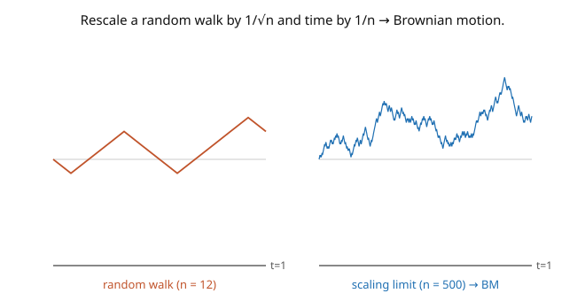

# Stochastic Calculus · Lesson 1.1: Random walks to Brownian motion

> ⏱ ~15 min · Module 1: Brownian motion · Builds on: [`probability-theory`](../../probability-theory/syllabus.md) (CLT, sums of independent variables) · Unlocks: [1.2 The Gaussian structure of BM](01-02-gaussian-structure-of-bm.md)

## Why this matters

Brownian motion is the single object at the center of this entire course — the noise you integrate against, the driver of every SDE, the continuous-time limit of "pure randomness accumulating." It models a pollen grain jittered by water molecules, a stock price buffeted by trades, the thermal wiggle of a voltage. Before we can build a calculus on it (Modules 2–4), we need to know precisely what it *is* and why it must exist. The cleanest route is to watch it *emerge*: take an ordinary random walk, zoom out just right, and a universal continuous process appears — independent of the coin you flipped. That universality is why Brownian motion shows up everywhere.

## The idea

Flip a fair coin each second; step $+1$ or $-1$. That's a **random walk** $S_n = X_1 + \cdots + X_n$. Now zoom out. If you shrink the step size and speed up the clock in the *right proportion*, the jagged walk stops looking like discrete jumps and starts looking like a continuous — but infinitely wiggly — curve. The magic proportion comes straight from the Central Limit Theorem: after $n$ steps the walk has wandered a typical distance $\sqrt{n}$ (its standard deviation), so to see a finite picture over a finite time you must scale **space by $1/\sqrt{n}$ while scaling time by $1/n$**. Space like the square root of time — that's the Brownian scaling, and it's forced on us.

Do this and define $W^{(n)}_t = S_{\lfloor nt\rfloor}/\sqrt{n}$. As $n \to \infty$ the whole *path* converges to a limiting random process $W_t$ — **Brownian motion** (the picture). The CLT guarantees each snapshot $W_t$ is Gaussian; the independence of coin flips becomes independence of increments; and — remarkably — the limit doesn't care whether you flipped coins or drew from any other finite-variance distribution. Same limit every time. That's **Donsker's invariance principle**, the functional CLT.

## The formal version

**Standard Brownian motion** (Wiener process) is a stochastic process $\{W_t\}_{t\geq 0}$ with:

1. $W_0 = 0$;
2. **independent increments:** for $0 \leq t_0 < t_1 < \cdots < t_k$, the increments $W_{t_1}-W_{t_0}, \ldots, W_{t_k}-W_{t_{k-1}}$ are independent;
3. **Gaussian, stationary increments:** $W_t - W_s \sim \mathcal{N}(0,\, t-s)$ for $s < t$ (mean $0$, variance equal to the elapsed time);
4. **continuous paths:** $t \mapsto W_t$ is continuous almost surely.

*In words:* start at $0$; disjoint time-intervals move independently; the displacement over a window is normal with variance equal to the window's length; and the trajectory has no jumps.

**Donsker's invariance principle.** Let $X_i$ be i.i.d. with mean $0$, variance $1$, and $S_n = \sum_{i\leq n}X_i$. The rescaled process $W^{(n)}_t = \dfrac{1}{\sqrt{n}}\,S_{\lfloor nt\rfloor}$ converges in distribution (on path space) to standard Brownian motion $W_t$. *In words:* every finite-variance random walk, rescaled, becomes the *same* Brownian motion — the coin doesn't matter, only mean $0$ and finite variance.

**Existence** is not obvious (we are asserting an uncountable family of consistent Gaussians with continuous paths). It is guaranteed by the **Kolmogorov extension theorem** (the finite-dimensional Gaussian distributions are consistent, so a process exists) together with the **Kolmogorov continuity theorem** (the increment bound $\mathbb{E}|W_t - W_s|^2 = |t-s|$, indeed $\mathbb{E}|W_t-W_s|^4 = 3|t-s|^2$, forces a continuous version). *In words:* the pieces fit, and the path can be taken continuous — Brownian motion genuinely exists.

## Picture

## Worked examples

**Example 1 (the marginal distribution from the CLT).** What is the law of $W^{(n)}_1 = S_n/\sqrt{n}$ in the limit? By the Central Limit Theorem ([`probability-theory`](../../probability-theory/syllabus.md)), $S_n/\sqrt{n} \xrightarrow{d} \mathcal{N}(0, 1)$ since the steps have mean $0$ and variance $1$. So $W_1 \sim \mathcal{N}(0,1)$ — matching property 3 with $s=0, t=1$. More generally $W_t = \lim S_{\lfloor nt\rfloor}/\sqrt n$, and $S_{\lfloor nt\rfloor}/\sqrt{n} = \sqrt{\tfrac{\lfloor nt\rfloor}{n}}\cdot\tfrac{S_{\lfloor nt\rfloor}}{\sqrt{\lfloor nt\rfloor}} \to \sqrt{t}\cdot\mathcal{N}(0,1) = \mathcal{N}(0, t)$. The variance grows linearly in time — the signature $\text{Var}(W_t) = t$.

**Example 2 (Brownian scaling — space is the square root of time).** Fix $c > 0$ and consider the rescaled process $\widetilde W_t := \frac{1}{\sqrt{c}}\,W_{ct}$. Check it is again a standard Brownian motion: it starts at $0$; increments are independent (they come from disjoint windows of $W$); and $\widetilde W_t - \widetilde W_s = \frac{1}{\sqrt c}(W_{ct} - W_{cs}) \sim \mathcal{N}\!\big(0, \tfrac{1}{c}(ct - cs)\big) = \mathcal{N}(0, t-s)$, with continuous paths. So

$$W_{ct} \;\overset{d}{=}\; \sqrt{c}\,W_t \qquad(\text{self-similarity}).$$

Speeding up time by $c$ is the same as stretching space by $\sqrt c$. This is the exact statement of "space $\sim \sqrt{\text{time}}$," and it's why a Brownian path looks statistically identical at every zoom level (a fact we exploit in [1.4](01-04-pathological-paths.md)).

## Watch out

- **You might scale space and time the same way.** If you shrink steps by $1/n$ *and* time by $1/n$, the walk collapses to a flat line (the wiggles vanish); scale space by $1$ and it blows up. Only the CLT proportion — space $1/\sqrt n$, time $1/n$ — gives a nondegenerate limit. The square root is not a choice; it's forced by $\text{Var}(S_n) = n$.
- **You might think the increments are independent *and* identically located.** Increments are independent and *stationary in length* (variance $=$ window length), but $W_t$ and $W_s$ themselves are **not** independent — they overlap. Only *disjoint* increments are independent (we compute $\text{Cov}(W_s, W_t)$ next lesson).
- **You might expect the limit to remember the coin.** It doesn't. A $\pm 1$ walk, a Gaussian walk, a walk with any mean-$0$, finite-variance step — all rescale to the *same* Brownian motion. That's the "invariance" in the invariance principle, and the reason BM is universal.

## One-liner

> Brownian motion is what any finite-variance random walk becomes when you rescale space by $\sqrt{\text{time}}$ — a continuous process with independent, stationary Gaussian increments of variance equal to elapsed time.

## Problems

**P1 (🟢)** Using the defining properties, compute $\mathbb{E}[W_t]$, $\text{Var}(W_t)$, and $\mathbb{E}[W_t^2]$ for standard Brownian motion. Then find the distribution of $W_5 - W_2$.

**P2 (🟡)** Show that $\mathbb{E}[W_t^4] = 3t^2$. *Hint:* $W_t \sim \mathcal{N}(0,t)$, and for $Z \sim \mathcal{N}(0,1)$ the fourth moment is $\mathbb{E}[Z^4] = 3$. (This moment bound is exactly what Kolmogorov's continuity theorem needs to guarantee continuous paths.)

**P3 (🔴, optional)** Let $W$ be standard Brownian motion. Define $\widetilde W_t = t\,W_{1/t}$ for $t > 0$ and $\widetilde W_0 = 0$. Show $\text{Var}(\widetilde W_t) = t$ and $\text{Cov}(\widetilde W_s, \widetilde W_t) = \min(s,t)$, which (with Gaussianity) makes $\widetilde W$ another Brownian motion — the **time-inversion** symmetry. *Hint:* use $\text{Cov}(W_a, W_b) = \min(a,b)$, proved next lesson, and take $s < t$ so $1/s > 1/t$.

Solutions

**P1** From $W_t \sim \mathcal{N}(0, t)$: $\mathbb{E}[W_t] = 0$, $\text{Var}(W_t) = t$, and $\mathbb{E}[W_t^2] = \text{Var}(W_t) + (\mathbb{E}[W_t])^2 = t + 0 = t$. For the increment, property 3 gives $W_5 - W_2 \sim \mathcal{N}(0,\, 5-2) = \mathcal{N}(0, 3)$.

**P2** Since $W_t \sim \mathcal{N}(0,t)$, write $W_t = \sqrt{t}\,Z$ with $Z \sim \mathcal{N}(0,1)$. Then $\mathbb{E}[W_t^4] = \mathbb{E}[(\sqrt t\,Z)^4] = t^2\,\mathbb{E}[Z^4] = t^2\cdot 3 = 3t^2$. (So $\mathbb{E}|W_t - W_s|^4 = 3|t-s|^2$, a bound of the form $\mathbb{E}|W_t-W_s|^{\alpha} \leq C|t-s|^{1+\beta}$ with $\alpha=4,\beta=1$ — precisely Kolmogorov's continuity criterion, which is why BM has a continuous version.)

**P3** For $s < t$: $\text{Var}(\widetilde W_t) = t^2\,\text{Var}(W_{1/t}) = t^2\cdot\tfrac1t = t$. ✓ Covariance ($s<t$, so $1/s > 1/t$, and $\min(1/s,1/t)=1/t$): $\text{Cov}(\widetilde W_s, \widetilde W_t) = st\,\text{Cov}(W_{1/s}, W_{1/t}) = st\cdot\min\!\big(\tfrac1s,\tfrac1t\big) = st\cdot\tfrac1t = s = \min(s,t)$. ✓ Being a mean-zero Gaussian process with covariance $\min(s,t)$ and (one checks) continuous paths, $\widetilde W$ is a Brownian motion. Time-inversion swaps the behavior near $0$ with the behavior near $\infty$ — a symmetry we'll reuse.

## Connections

- **Forward:** [1.2](01-02-gaussian-structure-of-bm.md) extracts the covariance $\text{Cov}(W_s, W_t) = \min(s,t)$ that makes BM a Gaussian process; [1.4](01-04-pathological-paths.md) exploits the self-similarity found here to show the paths are nowhere differentiable.
- **Backward:** this is the Central Limit Theorem ([`probability-theory`](../../probability-theory/syllabus.md)) upgraded from "one snapshot is Gaussian" to "the whole path is Brownian" — Donsker is the functional CLT.
- **Sideways (physics/finance):** the same scaling limit is the diffusion of a Brownian particle (Einstein 1905) in [`stat-mech`](../../stat-mech/syllabus.md) and the driver of asset-price models in [`mathematical-finance`](../../mathematical-finance/syllabus.md) — the universality here is why one process serves both.
