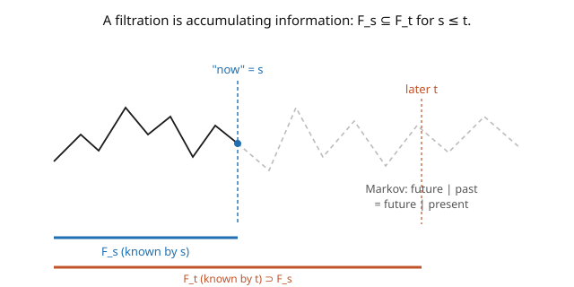

# Stochastic Calculus · Lesson 1.3: Filtrations, adaptedness, and the Markov property

> ⏱ ~15 min · Module 1: Brownian motion · Builds on: [1.2 The Gaussian structure of BM](01-02-gaussian-structure-of-bm.md) · Unlocks: [1.4 The pathological paths](01-04-pathological-paths.md)

## Why this matters

Everything in stochastic calculus is about **decisions made with only the information available so far** — you can't peek into the future. A trading strategy uses today's prices, not tomorrow's; the Itô integral fixes its integrand at the *left* endpoint precisely so it never looks ahead. To make "information available so far" mathematically precise we need **filtrations** (a growing record of what's known) and **adaptedness** (a process that doesn't cheat by peeking). This framework is the stage on which the entire course plays out: the Itô integral, martingales, and stopping times all live or die on the no-peeking rule. The **Markov property** then says Brownian motion travels light — to predict its future, the present value is all you need.

## The idea

Imagine watching a Brownian path unfold in real time. At time $s$ you've seen the trajectory up to $s$ and nothing more (the picture). Bundle *all* the questions you could answer from that observed history into a σ-algebra $\mathcal{F}_s$ — the **information known by time $s$**. As time passes you learn more, never less, so these grow: $\mathcal{F}_s \subseteq \mathcal{F}_t$ for $s \leq t$. That increasing family is a **filtration** — the mathematical clock of accumulating knowledge.

A process $X_t$ is **adapted** if its value at time $t$ is knowable from $\mathcal{F}_t$ — it uses only the past and present, never the future. "$W_t$ itself" is adapted; "$W_{t+1}$" is not (it peeks a second ahead). Adaptedness is the honesty condition, and it's exactly what a legitimate integrand or trading strategy must satisfy.

The **Markov property** is a statement about how much of the past matters. For Brownian motion, given the *entire* history up to $s$, the future depends only on the current value $W_s$ — the path took to get there is irrelevant. "The future, given the past, equals the future given the present." BM has no memory beyond where it stands right now; that amnesia is what makes it tractable. The **strong Markov property** upgrades this: BM restarts fresh not just at fixed times but at random times chosen by a rule that doesn't peek ahead (stopping times, [1.6](01-06-stopping-times-optional-stopping.md)).

## The formal version

A **filtration** on $(\Omega, \mathcal{F}, \mathbb{P})$ is a family $\{\mathcal{F}_t\}_{t\geq 0}$ of sub-σ-algebras with $\mathcal{F}_s \subseteq \mathcal{F}_t$ whenever $s \leq t$. The **natural filtration** of Brownian motion is $\mathcal{F}_t = \sigma(W_u : u \leq t)$ — everything determinable from the path up to $t$. *In words:* $\mathcal{F}_t$ is the collection of events whose occurrence you can decide by observing the process through time $t$. (For technical smoothness one usually assumes the **usual conditions**: the filtration is right-continuous, $\mathcal{F}_t = \bigcap_{u>t}\mathcal{F}_u$, and complete, containing all null sets. We assume these throughout without fuss.)

A process $X = \{X_t\}$ is **adapted** to $\{\mathcal{F}_t\}$ if $X_t$ is $\mathcal{F}_t$-measurable for every $t$. *In words:* $X_t$'s value is fully determined by information available at time $t$ — no clairvoyance.

Brownian motion has the **Markov property**: for a bounded measurable $f$ and $s < t$,

$$\mathbb{E}\big[f(W_t) \mid \mathcal{F}_s\big] = \mathbb{E}\big[f(W_t) \mid W_s\big].$$

*In words:* conditioning on the whole past $\mathcal{F}_s$ gives the same answer as conditioning on just the present value $W_s$ — the extra history is useless for prediction. The **strong Markov property** says the same holds with the fixed time $s$ replaced by a stopping time $\tau$: after $\tau$, the process $W_{\tau + u} - W_\tau$ is a fresh Brownian motion independent of $\mathcal{F}_\tau$.

## Picture

## Worked examples

**Example 1 (BM is Markov — the memoryless computation).** Compute $\mathbb{E}[W_t \mid \mathcal{F}_s]$ for $s < t$. Decompose $W_t = W_s + (W_t - W_s)$. Now $W_s$ is $\mathcal{F}_s$-measurable (known by time $s$), and the increment $W_t - W_s$ is independent of $\mathcal{F}_s$ (independent increments, [1.1](01-01-random-walks-to-brownian-motion.md)) with mean $0$. So

$$\mathbb{E}[W_t \mid \mathcal{F}_s] = \mathbb{E}[W_s \mid \mathcal{F}_s] + \mathbb{E}[W_t - W_s \mid \mathcal{F}_s] = W_s + 0 = W_s.$$

The answer depends on the past *only through $W_s$* — that's the Markov property in action. Notice it matches $\mathbb{E}[W_t \mid W_s] = W_s$ from [1.2](01-02-gaussian-structure-of-bm.md): conditioning on all of $\mathcal{F}_s$ gave nothing beyond conditioning on $W_s$ alone. Similarly $\mathbb{E}[W_t^2 \mid \mathcal{F}_s] = \mathbb{E}[(W_s + (W_t-W_s))^2 \mid \mathcal{F}_s] = W_s^2 + 0 + (t-s)$.

**Example 2 (adapted or not?).** Fix the natural filtration $\mathcal{F}_t = \sigma(W_u: u \leq t)$.

- $X_t = W_t$: **adapted** — its value is read directly off the observed path.
- $M_t = \max_{u \leq t} W_u$ (running maximum): **adapted** — computed from the history $[0,t]$, no future needed.
- $Y_t = W_{t+1}$: **not adapted** — it requires the path one time-unit into the future, unknowable at $t$.
- $Z_t = \mathbb{E}[W_T \mid \mathcal{F}_t]$ for a fixed horizon $T > t$: **adapted** — it's a conditional expectation given $\mathcal{F}_t$, hence $\mathcal{F}_t$-measurable by construction (and by Example 1 it equals $W_t$).

The adapted ones are exactly the processes you're allowed to use as Itô integrands ([2.2](02-02-ito-integral-simple-integrands.md)) — the no-peeking rule is what keeps the integral a martingale.

## Watch out

- **You might think adapted means continuous or smooth.** Adaptedness is *only* about information (measurability with respect to $\mathcal{F}_t$), not regularity. The running maximum has kinks; a step process jumps; both can be adapted. Conversely a perfectly smooth process like $t \mapsto W_{t+1}$ can fail to be adapted.
- **You might read the Markov property as "the past doesn't matter."** The past matters — it determined $W_s$. Markov says the past doesn't matter *beyond* $W_s$: given the present value, the earlier trajectory adds no predictive power. History is summarized by the present, not erased.
- **You might use a fixed-time Markov statement at a random time.** Ordinary (weak) Markov holds at *deterministic* times. Restarting BM at a *random* time (like "the first time it hits $1$") requires the **strong** Markov property and that the time be a stopping time ([1.6](01-06-stopping-times-optional-stopping.md)) — a random time that also obeys the no-peeking rule.

## One-liner

> A filtration is the growing record of what's known, an adapted process never peeks ahead, and Brownian motion is Markov — its future given the whole past depends only on where it stands now.

## Problems

**P1 (🟢)** With $\mathcal{F}_t = \sigma(W_u : u \leq t)$, classify each as adapted or not: (a) $A_t = W_t^2 - t$; (b) $B_t = \int_0^t W_u\,du$; (c) $C_t = W_{2t}$; (d) $D_t = \tfrac12(W_{t} + W_{t+2})$. Give a one-line reason each.

**P2 (🟡)** Compute $\mathbb{E}[W_t^2 \mid \mathcal{F}_s]$ for $s < t$, and use it to find $\mathbb{E}[W_t^2 - t \mid \mathcal{F}_s]$. What do you notice about the second answer? (You've just shown $W_t^2 - t$ is a martingale — the topic of [1.5](01-05-quadratic-variation-martingale-property.md).)

**P3 (🔴, optional)** Using the Markov property, show that for $s < t$, the conditional distribution of $W_t$ given $\mathcal{F}_s$ is $\mathcal{N}(W_s,\, t-s)$ — a normal centered at the current value with variance equal to the remaining time. Explain why this single fact makes BM's future completely predictable *in distribution* from the present.

Solutions

**P1** (a) $A_t = W_t^2 - t$: **adapted** — a function of $W_t$ and $t$, both known by time $t$. (b) $B_t = \int_0^t W_u\,du$: **adapted** — built from the path on $[0,t]$ only. (c) $C_t = W_{2t}$: **not adapted** — at time $t$ it needs the path out to time $2t > t$, the future. (d) $D_t = \tfrac12(W_t + W_{t+2})$: **not adapted** — the term $W_{t+2}$ lies in the future.

**P2** From Example 1's method, $\mathbb{E}[W_t^2 \mid \mathcal{F}_s] = W_s^2 + (t - s)$. Then $\mathbb{E}[W_t^2 - t \mid \mathcal{F}_s] = W_s^2 + (t-s) - t = W_s^2 - s$. The conditional expectation of $W_t^2 - t$ given $\mathcal{F}_s$ equals its own value at time $s$, $W_s^2 - s$ — i.e. $M_t = W_t^2 - t$ satisfies $\mathbb{E}[M_t \mid \mathcal{F}_s] = M_s$. That's the **martingale** property.

**P3** By the Markov property, the conditional law of $W_t$ given $\mathcal{F}_s$ depends only on $W_s$. Write $W_t = W_s + (W_t - W_s)$: given $\mathcal{F}_s$, $W_s$ is a known constant and $W_t - W_s \sim \mathcal{N}(0, t-s)$ is independent of $\mathcal{F}_s$. Adding a constant to a normal shifts its mean, so $W_t \mid \mathcal{F}_s \sim \mathcal{N}(W_s,\, t-s)$. This makes the future distribution completely determined by the present value $W_s$ and the elapsed time $t-s$: you never need the trajectory's history, only its current position — the essence of a Markov (memoryless) process, and the reason BM is the building block for tractable continuous-time models. ∎

## Flashback

**From Lesson 1.2 (The Gaussian structure of BM):** Compute $\text{Cov}(W_2, W_5)$ and the best linear prediction $\mathbb{E}[W_2 \mid W_5]$.

Solution

$\text{Cov}(W_2, W_5) = \min(2, 5) = 2$. Using the Gaussian regression formula with $\text{Var}(W_5) = 5$: $\mathbb{E}[W_2 \mid W_5] = \frac{\text{Cov}(W_2, W_5)}{\text{Var}(W_5)}\,W_5 = \frac{2}{5}\,W_5$. (Predicting the earlier value from the later one scales it back by the ratio of times — a straight line toward the origin.) ✓

## Connections

- **Backward:** $\mathbb{E}[W_t \mid \mathcal{F}_s] = W_s$ is the filtration-level version of [1.2](01-02-gaussian-structure-of-bm.md)'s $\mathbb{E}[W_t\mid W_s] = W_s$; conditional expectation is the projection built in [`probability-theory`](../../probability-theory/syllabus.md).
- **Forward:** adaptedness is the admissibility condition for Itô integrands ([2.2](02-02-ito-integral-simple-integrands.md)); the martingale property glimpsed here is developed in [1.5](01-05-quadratic-variation-martingale-property.md); stopping times and the strong Markov property get their own lesson ([1.6](01-06-stopping-times-optional-stopping.md)).
- **Sideways (finance):** an adapted trading strategy is one that only uses information available at each moment — the mathematical statement of "no insider trading / no clairvoyance," foundational to arbitrage-free pricing in [`mathematical-finance`](../../mathematical-finance/syllabus.md).
