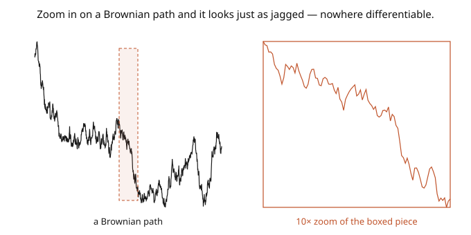

# Stochastic Calculus · Lesson 1.4: The pathological paths

> ⏱ ~15 min · Module 1: Brownian motion · Builds on: [1.3 Filtrations, adaptedness, and the Markov property](01-03-filtrations-adaptedness-markov.md) · Unlocks: [1.5 Quadratic variation and the martingale property](01-05-quadratic-variation-martingale-property.md)

## Why this matters

Here is the crisis that *creates* stochastic calculus. A Brownian path is continuous — you can draw it without lifting your pen — yet it is **nowhere differentiable** and has **infinite total variation** on every interval. That means the two pillars of ordinary calculus collapse: you cannot write $dW/dt$ (no derivative exists anywhere), and you cannot define $\int f\,dW$ as a Riemann–Stieltjes integral (that construction *requires* finite variation). If we want to integrate against noise — which is the whole point — we need a genuinely new integral. This lesson is the diagnosis; Module 2 is the cure. Understanding *why* the ordinary rules die tells you exactly what the Itô integral must fix.

## The idea

The trouble traces to one fact from [1.1](01-01-random-walks-to-brownian-motion.md): over a small time $h$, Brownian motion moves a typical distance $\sqrt{h}$, not $h$. Space scales like the *square root* of time. Now watch what that does to the two calculus operations:

**Derivative.** The difference quotient is $\frac{W_{t+h} - W_t}{h}$. The numerator is of size $\sqrt{h}$, so the quotient is of size $\frac{\sqrt h}{h} = \frac{1}{\sqrt h}$, which **blows up** as $h \to 0$. There's no finite slope — the path is too jagged at every scale. And it's jagged at *every* scale identically, by self-similarity: zoom in on any piece and it looks statistically the same as the whole (the picture). It's a fractal.

**Total variation.** Total variation adds up $\sum |W_{t_{k+1}} - W_{t_k}|$, the total up-and-down distance traveled. Chop $[0,T]$ into $n$ equal pieces: each increment is of size $\sqrt{T/n}$, and there are $n$ of them, so the sum is about $n \cdot \sqrt{T/n} = \sqrt{nT} \to \infty$. The path wiggles so much it travels *infinitely far* in finite time. This is exactly the condition that makes Riemann–Stieltjes integration impossible.

But — and this is the seed of everything — while the sum of $|{\Delta W}|$ diverges, the sum of $(\Delta W)^2$ *converges*, to $T$. Squaring the small increments tames them just enough. That finite survivor is **quadratic variation**, and it's the reason a stochastic integral can exist at all ([1.5](01-05-quadratic-variation-martingale-property.md)).

## The formal version

Almost every Brownian path has these properties on any interval:

**Continuous but nowhere differentiable.** With probability $1$, $t \mapsto W_t$ is continuous but the derivative $W_t' = \lim_{h\to 0}\frac{W_{t+h}-W_t}{h}$ **fails to exist at every $t$** (Paley–Wiener–Zygmund). *In words:* you can draw the path, but it has a corner at every point — no tangent line anywhere.

**Hölder regularity.** BM is $\alpha$-Hölder continuous for every $\alpha < \tfrac12$ but not for $\alpha = \tfrac12$: $|W_t - W_s| \leq C|t-s|^\alpha$ locally holds iff $\alpha < \tfrac12$. *In words:* the path is "almost half-smooth" — the $\sqrt{h}$ scaling exactly, no better.

**Infinite total variation.** On $[0,T]$, $\displaystyle \sup_{\text{partitions}} \sum_k |W_{t_{k+1}} - W_{t_k}| = \infty$ almost surely. *In words:* the path's total arc-length is infinite on every interval, so it is **not of bounded variation** — the death certificate for Riemann–Stieltjes integration, which needs a bounded-variation integrator.

**Self-similarity.** $W_{ct} \overset{d}{=} \sqrt{c}\,W_t$ ([1.1](01-01-random-walks-to-brownian-motion.md)), so every zoom-in is a rescaled copy — a random fractal of dimension $\tfrac32$ (graph).

## Picture

## Worked examples

**Example 1 (why there's no derivative — the difference quotient explodes).** Fix $t$ and look at the difference quotient's *size*. The increment $W_{t+h} - W_t \sim \mathcal{N}(0, h)$, so it has standard deviation $\sqrt{h}$. Therefore

$$\frac{W_{t+h} - W_t}{h} \quad\text{has standard deviation}\quad \frac{\sqrt h}{h} = \frac{1}{\sqrt h} \xrightarrow[h\to 0]{} \infty.$$

The difference quotient doesn't settle to a finite limit — it spreads out without bound as $h \to 0$. So $W_t'$ cannot exist (a limit that has ever-growing spread has no limit). The $\sqrt h$ scaling — the defining feature of BM — is *precisely* what forbids differentiability. Ordinary calculus is dead on arrival.

**Example 2 (total variation diverges in expectation).** For $\Delta W \sim \mathcal{N}(0, \Delta t)$, the mean absolute increment is $\mathbb{E}|\Delta W| = \sqrt{\tfrac{2}{\pi}}\sqrt{\Delta t}$. Partition $[0,T]$ into $n$ equal pieces of size $\Delta t = T/n$; the expected total variation over the partition is

$$\mathbb{E}\sum_{k=1}^n |W_{t_k} - W_{t_{k-1}}| = n\cdot\sqrt{\tfrac{2}{\pi}}\sqrt{\tfrac{T}{n}} = \sqrt{\tfrac{2}{\pi}}\,\sqrt{nT} \xrightarrow[n\to\infty]{} \infty.$$

The finer you partition, the *larger* the total travel — it diverges. Contrast the sum of **squared** increments: $\mathbb{E}\sum (W_{t_k}-W_{t_{k-1}})^2 = n\cdot\tfrac{T}{n} = T$, dead constant. Absolute increments (power $1$) blow up; squared increments (power $2$) stay finite. That crossover at power $2$ is the entire reason the Itô integral works — squaring is exactly the right dose.

## Watch out

- **You might think "continuous" implies "differentiable somewhere."** For ordinary functions, continuity plus a little regularity gives differentiability almost everywhere — but Brownian motion is a counterexample of the most extreme kind: continuous *everywhere*, differentiable *nowhere*. Continuity buys you much less than intuition suggests.
- **You might try to write $dW = W'(t)\,dt$.** There is no $W'(t)$ — "white noise" $\dot W$ is not a function, only a distribution. Never manipulate $dW$ as if it were a derivative times $dt$; treat $dW$ as its own object with the multiplication rules of [2.5](02-05-quadratic-variation-dwdw-rules.md).
- **You might expect finer partitions to help the integral converge.** For ordinary (finite-variation) integrators, refining the partition converges regardless of sample points. For BM, refining makes total variation *diverge*, and — crucially — the limit of Riemann sums *depends on where you sample* (left vs. right endpoint). That sample-point sensitivity is what forces a *choice* (Itô picks the left endpoint), covered in [2.1](02-01-why-riemann-stieltjes-fails.md).

## One-liner

> A Brownian path is continuous but nowhere differentiable with infinite total variation — because it moves like $\sqrt{h}$, not $h$ — so ordinary calculus dies, and only the finite *quadratic* variation survives to build a new integral on.

## Problems

**P1 (🟢)** For $\Delta W \sim \mathcal{N}(0, \Delta t)$, compute $\mathbb{E}[(\Delta W)^2]$ and $\text{Var}((\Delta W)^2)$. *Hint:* $\mathbb{E}[(\Delta W)^4] = 3(\Delta t)^2$ from [1.1](01-01-random-walks-to-brownian-motion.md) P2. Comment on why the variance of each squared increment is what makes the *sum* of squares concentrate at $T$.

**P2 (🟡)** Sharpen the "no derivative" heuristic: show that for any fixed slope $m$, $\mathbb{P}\big(\big|\frac{W_{t+h}-W_t}{h} - m\big| < 1\big) \to 0$ as $h \to 0$. *Hint:* the quotient is $\mathcal{N}(0, 1/h)$; as $h \to 0$ its variance blows up, so it escapes any fixed bounded window.

**P3 (🔴, optional)** Using self-similarity $W_{ct} \overset{d}{=} \sqrt c\,W_t$, argue that the *expected total variation of BM on $[0,\varepsilon]$* is infinite for every $\varepsilon > 0$ — so the pathology is *local*, present in every arbitrarily short interval, not just over long times.

Solutions

**P1** $\mathbb{E}[(\Delta W)^2] = \text{Var}(\Delta W) = \Delta t$. For the variance: $\text{Var}((\Delta W)^2) = \mathbb{E}[(\Delta W)^4] - (\mathbb{E}[(\Delta W)^2])^2 = 3(\Delta t)^2 - (\Delta t)^2 = 2(\Delta t)^2$. Over $n$ pieces with $\Delta t = T/n$, the sum of squares has mean $n\cdot\frac Tn = T$ and variance $n\cdot 2(\frac Tn)^2 = \frac{2T^2}{n} \to 0$. So the sum of squared increments concentrates at $T$ (its variance vanishes as $n\to\infty$) — that's why quadratic variation is a deterministic constant, unlike total variation.

**P2** The difference quotient $\frac{W_{t+h}-W_t}{h}$ is normal with mean $0$ and variance $\frac{\text{Var}(W_{t+h}-W_t)}{h^2} = \frac{h}{h^2} = \frac1h$. As $h \to 0$ this variance $\to \infty$, so the distribution spreads out without bound. For any fixed window $(m-1, m+1)$, $\mathbb{P}(\frac{W_{t+h}-W_t}{h} \in (m-1,m+1)) = \mathbb{P}(\mathcal{N}(0,1/h) \in (m-1,m+1)) \to 0$ (a fixed-width window captures vanishing mass of a distribution whose spread $\to\infty$). So the quotient converges to no finite value — no derivative. ∎

**P3** By self-similarity, the path on $[0,\varepsilon]$ is a rescaled copy of the path on $[0,1]$: $W_{\varepsilon s} \overset{d}{=} \sqrt\varepsilon\,W_s$ for $s\in[0,1]$. Total variation is additive over the path and scales linearly in space, so $TV_{[0,\varepsilon]}(W) \overset{d}{=} \sqrt\varepsilon\,\, TV_{[0,1]}(W)$. Since $TV_{[0,1]}(W) = \infty$ a.s. (and in expectation, Example 2), multiplying by the finite constant $\sqrt\varepsilon > 0$ leaves it infinite: $TV_{[0,\varepsilon]}(W) = \infty$ for every $\varepsilon > 0$. The infinite-variation pathology lives in every interval, no matter how short — it's a local property of the noise, which is why it can't be "avoided" by working on small time steps. ∎

## Flashback

**From Lesson 1.3 (Filtrations, adaptedness, and the Markov property):** Is the running maximum $M_t = \max_{u\leq t}W_u$ adapted to the natural filtration? And compute $\mathbb{E}[W_7 \mid \mathcal{F}_3]$.

Solution

$M_t = \max_{u\leq t}W_u$ is **adapted**: it's computed entirely from the path on $[0,t]$, requiring no future information, so it's $\mathcal{F}_t$-measurable. For the conditional expectation, decompose $W_7 = W_3 + (W_7 - W_3)$; the increment is independent of $\mathcal{F}_3$ with mean $0$, so $\mathbb{E}[W_7 \mid \mathcal{F}_3] = W_3 + 0 = W_3$ (the Markov/martingale property). ✓

## Connections

- **Backward:** every pathology here is the $\sqrt h$ scaling of [1.1](01-01-random-walks-to-brownian-motion.md) turned against calculus; self-similarity is that lesson's $W_{ct}\overset{d}{=}\sqrt c\,W_t$.
- **Forward:** the surviving *quadratic* variation (sum of squares $\to T$) is developed in [1.5](01-05-quadratic-variation-martingale-property.md) and becomes the multiplication rule $dW\,dW = dt$ ([2.5](02-05-quadratic-variation-dwdw-rules.md)); the failure of Riemann–Stieltjes is the explicit subject of [2.1](02-01-why-riemann-stieltjes-fails.md).
- **Sideways (physics):** the fractal, nowhere-differentiable trajectory is the real path of a diffusing particle — the reason velocity is ill-defined for Brownian motion and one works with the Langevin/Fokker–Planck description instead ([`stat-mech`](../../stat-mech/syllabus.md), [4.6](04-06-fokker-planck-kolmogorov.md)).
