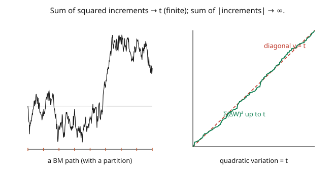

# Stochastic Calculus · Lesson 1.5: Quadratic variation and the martingale property

> ⏱ ~15 min · Module 1: Brownian motion · Builds on: [1.4 The pathological paths](01-04-pathological-paths.md) · Unlocks: [1.6 Stopping times, optional stopping, and martingale inequalities](01-06-stopping-times-optional-stopping.md)

## Why this matters

Last lesson delivered bad news (infinite variation, no derivative) but hinted at a survivor: while $\sum|\Delta W|$ diverges, $\sum(\Delta W)^2$ converges to a clean, *deterministic* number — the elapsed time. That number is the **quadratic variation** $[W]_t = t$, and it is the single most important quantity in the whole subject. It is the reason the Itô integral exists, the source of the famous correction term in Itô's lemma, and the meaning of the shorthand "$dW\,dW = dt$." Alongside it comes the **martingale property**: $W_t$ is a fair game, and so is $W_t^2 - t$. Together — quadratic variation and martingales — these two facts do essentially all the computational work in stochastic calculus.

## The idea

Take Brownian motion on $[0,t]$, chop the interval into many small pieces, and add up the *squares* of the increments: $\sum_k (W_{t_{k}} - W_{t_{k-1}})^2$. Each squared increment has mean $\Delta t$ (its variance), so the sum has mean $\sum \Delta t = t$. The remarkable part is that as the partition gets finer, the sum doesn't just *average* $t$ — it **converges to $t$ with no randomness left** (its fluctuations vanish). The wiggling of the path conspires to make the total squared movement *exactly* the elapsed time, every time (the picture). That deterministic limit is the **quadratic variation** $[W]_t = t$.

This is the finite quantity that ordinary calculus never sees: for a smooth function, squared increments are of size $(\Delta t)^2$ and sum to $0$. Brownian increments are of size $\sqrt{\Delta t}$, so their squares are of size $\Delta t$ and sum to something finite and nonzero. Quadratic variation is what distinguishes a genuinely rough noise from a smooth signal — and it's exactly the "extra" that Itô calculus must account for.

The second pillar is the **martingale property**. A martingale is a "fair game": your best forecast of its future value is its current value. Brownian motion is a martingale ($\mathbb{E}[W_t\mid\mathcal{F}_s] = W_s$, from [1.3](01-03-filtrations-adaptedness-markov.md)), and — beautifully — so is $W_t^2 - t$: the process $W_t^2$ has a built-in upward drift of exactly $t$ (its variance), and subtracting off the quadratic variation $t$ makes it fair again. That $W_t^2 - [W]_t$ is a martingale is no coincidence; it's the fingerprint of quadratic variation.

## The formal version

The **quadratic variation** of Brownian motion on $[0,t]$ is the limit (in $L^2$, and along refining partitions almost surely) of the sum of squared increments:

$$[W]_t = \lim_{\|\Pi\|\to 0}\sum_{k}\big(W_{t_k} - W_{t_{k-1}}\big)^2 = t,$$

where $\Pi = \{0 = t_0 < \cdots < t_n = t\}$ is a partition and $\|\Pi\|$ its mesh. *In words:* total squared movement equals elapsed time — a deterministic constant, in stark contrast to the infinite (and random) total variation. The differential shorthand is $d[W]_t = dt$, i.e. "$dW\,dW = dt$" ([2.5](02-05-quadratic-variation-dwdw-rules.md)).

A process $\{M_t\}$ adapted to $\{\mathcal{F}_t\}$ with $\mathbb{E}|M_t| < \infty$ is a **martingale** if

$$\mathbb{E}[M_t \mid \mathcal{F}_s] = M_s \quad\text{for all } s \leq t.$$

*In words:* given everything up to $s$, the expected future value is the current value — a fair game with no predictable drift. Three canonical Brownian martingales:

- $W_t$ itself;
- $W_t^2 - t$ (subtracting the quadratic variation removes the drift in $W_t^2$);
- the **exponential martingale** $\mathcal{E}_t = \exp\!\big(\theta W_t - \tfrac12\theta^2 t\big)$ for any constant $\theta$ (the drift correction $-\tfrac12\theta^2 t$ makes it a martingale — the engine of Girsanov, [4.2](04-02-girsanov-theorem.md)).

## Picture

## Worked examples

**Example 1 (quadratic variation converges to $t$).** Partition $[0,t]$ into $n$ equal pieces, $\Delta t = t/n$, and let $Q_n = \sum_{k=1}^n (\Delta W_k)^2$ where $\Delta W_k = W_{t_k} - W_{t_{k-1}}$. The increments are independent with $\mathbb{E}[(\Delta W_k)^2] = \Delta t$ and (from [1.4](01-04-pathological-paths.md) P1) $\text{Var}((\Delta W_k)^2) = 2(\Delta t)^2$. So

$$\mathbb{E}[Q_n] = n\,\Delta t = t, \qquad \text{Var}(Q_n) = n\cdot 2(\Delta t)^2 = 2n\Big(\frac tn\Big)^2 = \frac{2t^2}{n} \xrightarrow[n\to\infty]{} 0.$$

Mean exactly $t$, variance vanishing: $Q_n \to t$ in $L^2$. The sum of squared increments concentrates on the deterministic value $t$ — that's $[W]_t = t$. (Compare total variation, whose expectation *diverged* — squaring is the precise cure.)

**Example 2 ($W_t^2 - t$ is a martingale).** Check the defining identity for $s < t$. Using $W_t = W_s + (W_t - W_s)$ with the increment independent of $\mathcal{F}_s$, mean $0$, variance $t-s$:

$$\mathbb{E}[W_t^2 \mid \mathcal{F}_s] = \mathbb{E}\big[(W_s + (W_t - W_s))^2 \mid \mathcal{F}_s\big] = W_s^2 + 2W_s\underbrace{\mathbb{E}[W_t - W_s\mid\mathcal F_s]}_{0} + \underbrace{\mathbb{E}[(W_t-W_s)^2\mid\mathcal F_s]}_{t-s} = W_s^2 + (t-s).$$

Therefore $\mathbb{E}[W_t^2 - t \mid \mathcal{F}_s] = W_s^2 + (t-s) - t = W_s^2 - s$. The conditional expectation of $M_t = W_t^2 - t$ equals $M_s$ — it's a **martingale**. The $-t$ is precisely the quadratic variation: $W_t^2$ drifts up by $t$ (its own variance), and subtracting $[W]_t = t$ cancels the drift. This is the pattern behind Itô's lemma's correction term.

## Watch out

- **You might expect quadratic variation to be random.** It isn't — $[W]_t = t$ is a *deterministic* constant, the same on (almost) every path. This is special to Brownian motion (and continuous martingales generally): the path is random, but its accumulated squared movement is not. Total variation, by contrast, is random *and* infinite.
- **You might think every function has zero quadratic variation.** Smooth (finite-variation) functions do: $\sum(\Delta f)^2 \approx \sum (f')^2(\Delta t)^2 \to 0$. Nonzero quadratic variation is the signature of genuine roughness. A process with $[X]_t \neq 0$ cannot be differentiable.
- **You might think "$W_t^2$ is a martingale."** It is *not* — it drifts upward ($\mathbb{E}[W_t^2] = t$ increases). You must subtract the quadratic variation: $W_t^2 - t$ is the martingale. Forgetting the compensator $-t$ is the single most common early error, and it's exactly the term Itô's lemma will reinstate.

## One-liner

> Brownian motion's total squared movement over $[0,t]$ is exactly the elapsed time — quadratic variation $[W]_t = t$ — and subtracting it turns $W_t^2$ into a martingale, the two facts that power all of Itô calculus.

## Problems

**P1 (🟢)** Compute the quadratic variation $[W]_t$ over $[0, 5]$, and separately $\mathbb{E}\big[\sum_{k=1}^n (\Delta W_k)^2\big]$ for a partition of $[0,5]$ into $n = 10$ equal pieces. Are they equal? Why is the *variance* of the sum small?

**P2 (🟡)** Show the exponential process $\mathcal{E}_t = \exp(\theta W_t - \tfrac12\theta^2 t)$ is a martingale, i.e. $\mathbb{E}[\mathcal{E}_t \mid \mathcal{F}_s] = \mathcal{E}_s$. *Hint:* factor $\mathcal{E}_t = \mathcal{E}_s\cdot\exp(\theta(W_t - W_s) - \tfrac12\theta^2(t-s))$ and use the Gaussian MGF $\mathbb{E}[e^{\theta Z}] = e^{\theta^2\sigma^2/2}$ for $Z \sim \mathcal{N}(0,\sigma^2)$, with the increment independent of $\mathcal{F}_s$.

**P3 (🔴, optional)** Use the martingale $W_t^2 - t$ to compute $\text{Var}(W_t^2)$... actually compute $\mathbb{E}[W_t^4]$ two ways and reconcile: (a) directly via $W_t \sim \mathcal{N}(0,t)$; (b) by noting $W_t^2 - t$ is a mean-zero martingale so $\mathbb{E}[(W_t^2 - t)^2]$ can be found, then solving for $\mathbb{E}[W_t^4]$. Confirm both give $3t^2$.

Solutions

**P1** $[W]_t = t$, so on $[0,5]$ the quadratic variation is $[W]_5 = 5$. For the finite partition ($n=10$, $\Delta t = 0.5$): $\mathbb{E}\big[\sum_{k=1}^{10}(\Delta W_k)^2\big] = \sum 10\cdot\Delta t = 10\cdot 0.5 = 5$. They're equal in expectation (the expectation is exact for any partition). The variance is $\text{Var} = n\cdot 2(\Delta t)^2 = 10\cdot 2(0.5)^2 = 5$... wait, that's for finite $n$; here $\text{Var} = \frac{2t^2}{n} = \frac{2\cdot 25}{10} = 5$, not yet tiny at $n=10$ — it shrinks as $n\to\infty$ (at $n=1000$ it's $0.05$). The *limit* $[W]_5 = 5$ is deterministic; a coarse partition only approximates it. ✓

**P2** Factor $\mathcal{E}_t = \mathcal{E}_s\cdot\exp\big(\theta(W_t - W_s) - \tfrac12\theta^2(t-s)\big)$. Since $\mathcal{E}_s$ is $\mathcal{F}_s$-measurable and the increment $W_t - W_s \sim \mathcal{N}(0, t-s)$ is independent of $\mathcal{F}_s$,

$$\mathbb{E}[\mathcal{E}_t \mid \mathcal{F}_s] = \mathcal{E}_s\cdot e^{-\frac12\theta^2(t-s)}\,\mathbb{E}\big[e^{\theta(W_t-W_s)}\big] = \mathcal{E}_s\cdot e^{-\frac12\theta^2(t-s)}\cdot e^{\frac12\theta^2(t-s)} = \mathcal{E}_s,$$

using the Gaussian MGF $\mathbb{E}[e^{\theta Z}] = e^{\theta^2(t-s)/2}$. So $\mathcal{E}_t$ is a martingale — the drift correction $-\tfrac12\theta^2 t$ is exactly what cancels the MGF's growth. ✓

**P3** (a) $\mathbb{E}[W_t^4] = 3t^2$ directly ($W_t = \sqrt t\,Z$, $\mathbb{E}[Z^4]=3$). (b) $M_t = W_t^2 - t$ is a mean-zero martingale, and $\mathbb{E}[M_t^2] = \text{Var}(M_t) = \text{Var}(W_t^2)$. Expand $\mathbb{E}[(W_t^2 - t)^2] = \mathbb{E}[W_t^4] - 2t\,\mathbb{E}[W_t^2] + t^2 = \mathbb{E}[W_t^4] - 2t\cdot t + t^2 = \mathbb{E}[W_t^4] - t^2$. We also know $\text{Var}(W_t^2) = \mathbb{E}[W_t^4] - (\mathbb{E}[W_t^2])^2 = \mathbb{E}[W_t^4] - t^2$ — consistent, and both routes need the value of $\mathbb{E}[W_t^4]$. Pinning it via (a): $\mathbb{E}[W_t^4] = 3t^2$, giving $\text{Var}(W_t^2) = 3t^2 - t^2 = 2t^2$. Both methods agree: $\mathbb{E}[W_t^4] = 3t^2$. ∎

## Flashback

**From Lesson 1.4 (The pathological paths):** For a partition of $[0,1]$ into $n = 4$ equal pieces, compute the expected total variation $\mathbb{E}\sum_{k}|\Delta W_k|$ (use $\mathbb{E}|\Delta W| = \sqrt{2/\pi}\sqrt{\Delta t}$), and say what happens as $n \to \infty$.

Solution

With $n = 4$, $\Delta t = 1/4$, so $\mathbb{E}|\Delta W_k| = \sqrt{2/\pi}\sqrt{1/4} = \tfrac12\sqrt{2/\pi}$. Summing four of them: $\mathbb{E}\sum_k|\Delta W_k| = 4\cdot\tfrac12\sqrt{2/\pi} = 2\sqrt{2/\pi} \approx 1.60$. In general it's $\sqrt{2/\pi}\sqrt{n}\cdot\sqrt{1} = \sqrt{2n/\pi}$, which **diverges** as $n\to\infty$ — total variation is infinite, while (this lesson) the sum of *squares* stays put at $1$. ✓

## Connections

- **Backward:** quadratic variation is the finite survivor promised in [1.4](01-04-pathological-paths.md); the martingale computations reuse the independent-increment decomposition from [1.3](01-03-filtrations-adaptedness-markov.md).
- **Forward:** [1.6](01-06-stopping-times-optional-stopping.md) develops the martingale toolkit (optional stopping, Doob's inequalities); $[W]_t = t$ becomes the rule $dW\,dW = dt$ ([2.5](02-05-quadratic-variation-dwdw-rules.md)) and the correction term in Itô's lemma ([3.1](03-01-itos-lemma-for-bm.md)); the Itô integral will itself be a martingale ([2.4](02-04-ito-integral-as-martingale.md)).
- **Sideways (finance):** the exponential martingale $\mathcal{E}_t$ is the change-of-measure density for risk-neutral pricing ([`mathematical-finance`](../../mathematical-finance/syllabus.md)); realized quadratic variation is what "realized volatility" estimates from high-frequency price data.

*Module 1 capstone (Boss Problem 1): partition $[0,T]$ and show $\sum(\Delta W)^2 \to T$ in $L^2$ while $\sum|\Delta W| \to \infty$ — Examples 1 and 2 of [1.4](01-04-pathological-paths.md) and this lesson assemble exactly that contrast, and it is *why* the Itô integral exists.*
