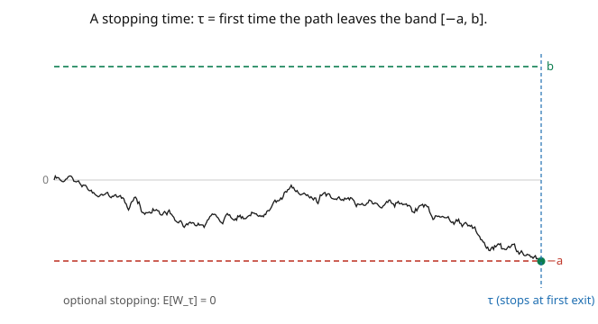

# Stochastic Calculus · Lesson 1.6: Stopping times, optional stopping, and martingale inequalities

> ⏱ ~15 min · Module 1: Brownian motion · Builds on: [1.5 Quadratic variation and the martingale property](01-05-quadratic-variation-martingale-property.md), [`probability-theory`](../../probability-theory/syllabus.md) (discrete martingales, optional stopping) · Unlocks: [2.1 Why Riemann–Stieltjes fails](02-01-why-riemann-stieltjes-fails.md)

## Why this matters

[`probability-theory`](../../probability-theory/syllabus.md) built the martingale toolkit in **discrete time** — stopping times, optional stopping, the convergence theorem. Stochastic calculus needs the **continuous-time** version, and it's the quiet workhorse behind almost every argument that follows: the Itô integral is defined as a martingale, its variance is controlled by **Doob's inequality**, and countless expectations are computed by **optional stopping** ("a fair game stopped at a smart time is still fair"). This lesson makes that continuous-time theory explicit rather than assumed — the "stochastic theory" the rest of the course leans on. As a bonus, it delivers two beautiful closed-form results: the exit probabilities and expected exit time of Brownian motion, computed in three lines each.

## The idea

A **stopping time** $\tau$ is a random time whose arrival you can recognize *the moment it happens*, using only information up to now — no peeking ahead. "The first time the price hits 100 dollars" is a stopping time (you know when it happens as it happens); "the time of the maximum over the next hour" is **not** (you can't know it's the max until the hour is over). This no-peeking condition is the same honesty rule as adaptedness ([1.3](01-03-filtrations-adaptedness-markov.md)), now applied to *when* you act (the picture).

Two results make stopping times powerful:

**Optional stopping.** If $M_t$ is a martingale (a fair game) and $\tau$ is a stopping time — under mild conditions — then $\mathbb{E}[M_\tau] = \mathbb{E}[M_0]$. You cannot beat a fair game by any non-clairvoyant stopping rule: your expected fortune when you quit equals what you started with. This single fact solves gambler's ruin and computes exit times almost for free.

**Doob's inequalities.** These control the *maximum* of a martingale, not just its endpoint. The maximal inequality bounds the probability the path ever gets large; the $L^2$ inequality bounds the expected squared maximum by (four times) the expected squared endpoint. Controlling suprema is essential: to build the Itô integral we approximate and must ensure the *whole path* of the approximation stays close, not just the final value — Doob is what guarantees that.

A final foundational result, the **martingale convergence theorem**, says a martingale that stays bounded (in $L^1$) must settle down to a limit almost surely — fair games that can't run away must converge.

## The formal version

A random time $\tau: \Omega \to [0,\infty]$ is a **stopping time** for $\{\mathcal{F}_t\}$ if

$$\{\tau \leq t\} \in \mathcal{F}_t \quad\text{for every } t.$$

*In words:* whether $\tau$ has occurred by time $t$ is decidable from the information $\mathcal{F}_t$ — no future needed. First-hitting times $\tau_a = \inf\{t : W_t = a\}$ are stopping times. The **stopped process** $M_t^\tau := M_{t\wedge\tau}$ (frozen at value $M_\tau$ once $\tau$ occurs) is again a martingale — *stopping preserves fairness*.

**Optional stopping (optional sampling) theorem.** If $M$ is a martingale and $\tau$ a stopping time, then $\mathbb{E}[M_\tau] = \mathbb{E}[M_0]$ provided *any* of: (i) $\tau$ is bounded; (ii) $M$ is bounded and $\tau < \infty$ a.s.; (iii) $\mathbb{E}[\tau] < \infty$ and $M$ has bounded increments; or (iv) $\{M_{t\wedge\tau}\}$ is uniformly integrable. *In words:* stop a fair game at a non-anticipating time and its expected value is unchanged — as long as a regularity condition rules out "doubling strategies."

**Doob's inequalities.** For a continuous martingale $M$ (or nonnegative submartingale) on $[0,t]$ and $\lambda > 0$:

$$\mathbb{P}\Big(\sup_{s\leq t}|M_s| \geq \lambda\Big) \leq \frac{\mathbb{E}[|M_t|]}{\lambda} \quad(\text{maximal}), \qquad \mathbb{E}\Big[\sup_{s\leq t}|M_s|^2\Big] \leq 4\,\mathbb{E}[|M_t|^2] \quad(L^2).$$

*In words:* a martingale rarely wanders far from $0$ (probability of a big excursion $\leq$ endpoint size over $\lambda$), and its expected squared *maximum* is at most four times its expected squared *endpoint* — the sup is controlled by the tip.

**Martingale convergence theorem.** If $\sup_t \mathbb{E}|M_t| < \infty$, then $M_t \to M_\infty$ almost surely for some integrable $M_\infty$. *In words:* an $L^1$-bounded martingale converges.

## Picture

## Worked examples

**Example 1 (gambler's ruin — exit probabilities via optional stopping).** Start Brownian motion at $0$ and let $\tau$ be the first time it exits the band $(-a, b)$ (with $a, b > 0$) — a stopping time. Assume the regularity conditions hold (they do: $\tau < \infty$ a.s. and $M_{t\wedge\tau}$ is bounded by $\max(a,b)$). Since $W_t$ is a martingale, optional stopping gives $\mathbb{E}[W_\tau] = \mathbb{E}[W_0] = 0$. At $\tau$ the path sits at either $b$ or $-a$; write $p = \mathbb{P}(\text{hit } b \text{ first})$. Then

$$\mathbb{E}[W_\tau] = b\cdot p + (-a)(1 - p) = 0 \;\Longrightarrow\; p = \frac{a}{a+b}.$$

So Brownian motion started at $0$ hits level $b$ before $-a$ with probability $\frac{a}{a+b}$ — the closer boundary is more likely, in exact proportion. (This is continuous-time gambler's ruin; the discrete random-walk version from [`probability-theory`](../../probability-theory/syllabus.md) has the identical answer.)

**Example 2 (expected exit time via $W_t^2 - t$).** Use the *other* martingale, $M_t = W_t^2 - t$ ([1.5](01-05-quadratic-variation-martingale-property.md)). Optional stopping gives $\mathbb{E}[W_\tau^2 - \tau] = \mathbb{E}[W_0^2 - 0] = 0$, so $\mathbb{E}[\tau] = \mathbb{E}[W_\tau^2]$. Now $W_\tau^2$ is $b^2$ with probability $p = \frac{a}{a+b}$ and $a^2$ with probability $1-p = \frac{b}{a+b}$:

$$\mathbb{E}[\tau] = \mathbb{E}[W_\tau^2] = b^2\cdot\frac{a}{a+b} + a^2\cdot\frac{b}{a+b} = \frac{ab(a+b)}{a+b} = ab.$$

The expected time to exit the band $(-a, b)$ is exactly $ab$. For a symmetric band $(-a, a)$ it's $a^2$ — the exit time scales as distance *squared*, the $\sqrt{\text{time}}$ scaling of [1.1](01-01-random-walks-to-brownian-motion.md) read backwards. Two martingales, two exact answers, no differential equations.

## Watch out

- **You might drop the regularity condition in optional stopping.** $\mathbb{E}[M_\tau] = \mathbb{E}[M_0]$ can *fail* without it: for BM and $\tau = \tau_1$ (first hit of level $1$), $\tau < \infty$ a.s. but $\mathbb{E}[W_\tau] = 1 \neq 0$ — because $\tau$ is unbounded and $\mathbb{E}[\tau] = \infty$, and $W_{t\wedge\tau}$ isn't uniformly integrable. A one-sided hitting time is the classic trap; always check a hypothesis holds.
- **You might think any random time is a stopping time.** "The last time before $T$ that $W = 0$" needs the future (you can't know it's the *last* zero until $T$) — not a stopping time. First-hitting and exit times look only backward; "last-exit" and "argmax" times look forward.
- **You might bound the max by the endpoint naively.** $\sup_{s\leq t}M_s$ can far exceed $M_t$ on any single path. Doob's inequality controls it only *in expectation/probability* ($\mathbb{E}[\sup M^2] \leq 4\mathbb{E}[M_t^2]$), not pathwise. Use the inequalities, not a false pointwise bound.

## One-liner

> A stopping time is a random alarm you can't set using the future; optional stopping says a fair game stopped at one is still fair ($\mathbb{E}[M_\tau] = \mathbb{E}[M_0]$), and Doob's inequalities bound a martingale's whole path by its endpoint — the theory the Itô integral runs on.

## Problems

**P1 (🟢)** Brownian motion starts at $0$. Using optional stopping on $W_t$, find the probability it hits $3$ before $-1$. Then find the expected time to exit the band $(-1, 3)$ using $W_t^2 - t$.

**P2 (🟡)** Which of these are stopping times for the natural filtration of $W$? (a) $\tau_1 = \inf\{t : W_t = 5\}$; (b) $\tau_2 = \sup\{t \leq 3 : W_t = 0\}$ (last zero before time 3); (c) $\tau_3 = \inf\{t : W_t^2 \geq 4\}$; (d) $\tau_4 = \tau_1 + 2$. One line each.

**P3 (🔴, optional)** Let $\tau = \inf\{t : W_t \notin (-a, a)\}$ (symmetric exit) and use the exponential martingale $\mathcal{E}_t = e^{\theta W_t - \theta^2 t/2}$ with optional stopping to find $\mathbb{E}[e^{-\lambda\tau}]$ for $\lambda > 0$ (the Laplace transform of the exit time). *Hint:* set $\theta = \sqrt{2\lambda}$ so the exponent's time-part becomes $-\lambda t$; by symmetry $W_\tau = \pm a$ each with probability $\tfrac12$, and combine $\pm\theta$ to isolate the $\cosh$.

Solutions

**P1** Exit probability: with $a = 1$, $b = 3$, $\mathbb{P}(\text{hit } 3 \text{ before } -1) = \frac{a}{a+b} = \frac{1}{1+3} = \frac14$. Expected exit time: $\mathbb{E}[\tau] = ab = 1\cdot 3 = 3$.

**P2** (a) $\tau_1$: **stopping time** — first hitting time, decidable from the past. (b) $\tau_2$: **not** — the last zero before $3$ can't be identified until you've seen up to time $3$ (you never know a zero is the *last* one when it happens). (c) $\tau_3 = \inf\{t: |W_t| \geq 2\}$: **stopping time** — a first-exit time. (d) $\tau_4 = \tau_1 + 2$: **stopping time** — $\{\tau_1 + 2 \leq t\} = \{\tau_1 \leq t-2\} \in \mathcal{F}_{t-2} \subseteq \mathcal{F}_t$; adding a constant to a stopping time keeps it one.

**P3** Take $\theta = \sqrt{2\lambda}$ so $\mathcal{E}_t = e^{\theta W_t - \lambda t}$. Optional stopping (valid here — bounded spatial part, $\mathbb{E}[\tau]<\infty$): $\mathbb{E}[\mathcal{E}_\tau] = \mathcal{E}_0 = 1$, i.e. $\mathbb{E}[e^{\theta W_\tau - \lambda\tau}] = 1$. By symmetry $W_\tau = a$ or $-a$ with probability $\tfrac12$ each, *independently of $\tau$* by symmetry of the problem (the $\pm$ sign and the time are symmetric), so averaging the $\pm\theta$ versions: $\mathbb{E}[e^{-\lambda\tau}]\cdot\tfrac12(e^{\theta a} + e^{-\theta a}) = 1$. Hence

$$\mathbb{E}[e^{-\lambda\tau}] = \frac{1}{\cosh(\theta a)} = \frac{1}{\cosh(a\sqrt{2\lambda})}.$$

(Check: as $\lambda \to 0$, $\cosh \to 1$ so $\mathbb{E}[e^{-\lambda\tau}] \to 1$; and $-\frac{d}{d\lambda}\big|_{0}$ recovers $\mathbb{E}[\tau] = a^2$, matching Example 2 with $b=a$.) ∎

## Flashback

**From Lesson 1.5 (Quadratic variation and the martingale property):** Show that the exponential process $\mathcal{E}_t = \exp(\theta W_t - \tfrac12\theta^2 t)$ satisfies $\mathbb{E}[\mathcal{E}_t] = 1$ for every $t$.

Solution

Since $\mathcal{E}_t$ is a martingale, $\mathbb{E}[\mathcal{E}_t] = \mathbb{E}[\mathcal{E}_0] = \mathbb{E}[e^{\theta\cdot 0 - 0}] = e^0 = 1$. Directly: $\mathbb{E}[e^{\theta W_t}] = e^{\theta^2 t/2}$ (Gaussian MGF with $W_t \sim \mathcal{N}(0,t)$), so $\mathbb{E}[\mathcal{E}_t] = e^{-\theta^2 t/2}\,\mathbb{E}[e^{\theta W_t}] = e^{-\theta^2 t/2}\cdot e^{\theta^2 t/2} = 1$. The $-\tfrac12\theta^2 t$ drift correction is exactly tuned to hold the mean at $1$. ✓

## Connections

- **Backward:** this is the continuous-time upgrade of discrete-time optional stopping from [`probability-theory`](../../probability-theory/syllabus.md); it uses the two martingales $W_t$ and $W_t^2 - t$ from [1.5](01-05-quadratic-variation-martingale-property.md), and stopping times formalize the "no-peeking" rule of [1.3](01-03-filtrations-adaptedness-markov.md).
- **Forward:** Doob's $L^2$ inequality is what makes the Itô integral's $L^2$ construction ([2.3](02-03-ito-isometry-general-integral.md)) control the whole path, not just endpoints; the Itô integral is a martingale ([2.4](02-04-ito-integral-as-martingale.md)) to which optional stopping applies.
- **Sideways (finance):** optional stopping is the mathematics of "no strategy beats a fair game," the martingale statement of no-arbitrage; American-option pricing is an *optimal stopping* problem built on this theory ([`mathematical-finance`](../../mathematical-finance/syllabus.md)).
