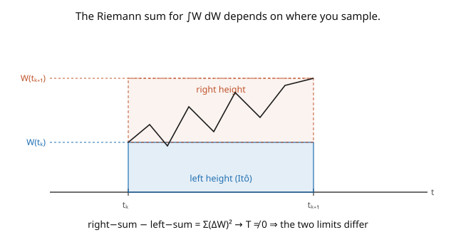

# Stochastic Calculus · Lesson 2.1: Why Riemann–Stieltjes fails

> ⏱ ~15 min · Module 2: The Itô integral · Builds on: [1.6 Stopping times, optional stopping, and martingale inequalities](01-06-stopping-times-optional-stopping.md), [1.4 The pathological paths](01-04-pathological-paths.md) · Unlocks: [2.2 The integral for simple integrands](02-02-ito-integral-simple-integrands.md)

## Why this matters

We want to make sense of $\int_0^T H_t\,dW_t$ — integrating a strategy $H$ against Brownian noise $W$. This is the central object of the whole subject: it's the gain of a trading strategy, the accumulated effect of random forcing, the thing Itô's lemma differentiates. But the ordinary Riemann–Stieltjes integral $\int f\,dg$ — the one that handles $\int f\,dg$ for nice $g$ — **flatly does not work** when $g = W$, and it fails for a subtle, instructive reason: the answer *depends on where within each subinterval you sample the integrand*. That ambiguity forces a **choice**, and Itô's choice (sample at the left) is what makes the resulting integral a martingale. Understanding the failure tells you exactly why the Itô integral is defined the peculiar way it is.

## The idea

To integrate $\int_0^T H\,dW$, the natural move is a Riemann-type sum: partition $[0,T]$, and on each piece multiply the integrand by the increment of $W$:

$$\sum_k H_{t_k^*}\,\big(W_{t_{k+1}} - W_{t_k}\big),$$

where $t_k^* \in [t_k, t_{k+1}]$ is some **sample point**. For an ordinary smooth (bounded-variation) integrator, it doesn't matter where you put $t_k^*$ — left end, right end, middle — the sums all converge to the same limit as the partition refines. That robustness is what makes Riemann–Stieltjes well-defined.

For Brownian motion this **breaks**. Because $W$ has infinite variation and nonzero quadratic variation ([1.4](01-04-pathological-paths.md)–[1.5](01-05-quadratic-variation-martingale-property.md)), the sample point matters: left-endpoint sums and right-endpoint sums converge to *different* limits, differing by the quadratic variation $T$ (the picture). There is no single "the integral" — you must *choose* a convention.

Two choices dominate:

- **Itô:** sample at the **left** endpoint, $t_k^* = t_k$. The integrand is then "locked in" before the increment happens — it doesn't peek at the future. This makes the integrand adapted ([1.3](01-03-filtrations-adaptedness-markov.md)) and the integral a **martingale** (a fair game). This is the choice for finance and probability.
- **Stratonovich:** sample at the **midpoint**. This obeys the ordinary chain rule (no correction term) but is *not* a martingale and requires knowing the increment's endpoint. Favored in physics for coordinate-change invariance.

We build the **Itô** integral. The left-endpoint rule isn't arbitrary — it's the unique choice that keeps the integral non-anticipating and fair.

## The formal version

**Why Riemann–Stieltjes needs bounded variation.** The Riemann–Stieltjes integral $\int_0^T f\,dg$ is guaranteed to exist (independent of sample points) when $f$ is continuous and $g$ has **bounded variation**. Brownian motion has *infinite* total variation on every interval ([1.4](01-04-pathological-paths.md)), so the theorem does not apply — and indeed the sums fail to converge sample-point-independently.

**The sample-point dependence, precisely.** For the integrand $H = W$ itself, compare the right- and left-endpoint sums:

$$\underbrace{\sum_k W_{t_{k+1}}(W_{t_{k+1}} - W_{t_k})}_{\text{right}} - \underbrace{\sum_k W_{t_k}(W_{t_{k+1}} - W_{t_k})}_{\text{left}} = \sum_k (W_{t_{k+1}} - W_{t_k})^2 \xrightarrow{L^2} [W]_T = T.$$

*In words:* the two sampling conventions disagree by the quadratic variation $T \neq 0$ — a gap that does **not** vanish as the partition refines. So $\int W\,dW$ has no sampling-independent value; a convention is mandatory.

**The Itô convention.** The **Itô integral** takes the **left** endpoint:

$$\int_0^T H_t\,dW_t := \lim_{\|\Pi\|\to 0}\sum_k H_{t_k}\,\big(W_{t_{k+1}} - W_{t_k}\big) \quad(L^2\text{ limit}),$$

for $H$ **adapted** and square-integrable. *In words:* evaluate the integrand *before* each increment, so it never anticipates the noise — the property that makes the integral a martingale ([2.4](02-04-ito-integral-as-martingale.md)). (The **Stratonovich** integral, denoted $\int H\circ dW$, uses the midpoint and relates to Itô by $\int H\circ dW = \int H\,dW + \tfrac12\int d[H,W]$ — a half-quadratic-covariation correction.)

## Picture

## Worked examples

**Example 1 (left and right sums genuinely disagree).** Take $H = W$ and compute both sums for $\int_0^T W\,dW$. Use the algebraic identity $W_{t_{k+1}}^2 - W_{t_k}^2 = (W_{t_{k+1}} - W_{t_k})^2 + 2W_{t_k}(W_{t_{k+1}} - W_{t_k})$. Summing telescopes the left side to $W_T^2 - W_0^2 = W_T^2$:

$$W_T^2 = \sum_k (W_{t_{k+1}} - W_{t_k})^2 + 2\sum_k W_{t_k}(W_{t_{k+1}} - W_{t_k}).$$

As $\|\Pi\| \to 0$, the first sum $\to T$ (quadratic variation), so the **left-endpoint** (Itô) sum converges to

$$\sum_k W_{t_k}(W_{t_{k+1}} - W_{t_k}) \to \tfrac12\big(W_T^2 - T\big).$$

Repeating with the right endpoint gives $\tfrac12(W_T^2 + T)$, and the midpoint gives $\tfrac12 W_T^2$ (Stratonovich). Three different answers — the sample point is not a technicality, it's the whole story. The Itô answer $\frac12 W_T^2 - \frac12 T$ carries the now-famous $-\frac12 T$ correction (this is Boss Problem 2).

**Example 2 (why left is the right choice).** Consider a betting/hedging interpretation: $H_{t_k}$ is how many shares you hold going *into* the interval $[t_k, t_{k+1}]$, and $W_{t_{k+1}} - W_{t_k}$ is the price change over it. You must choose your position $H_{t_k}$ **before** seeing the price move — that's the left endpoint. Sampling at the right (or midpoint) would let your position depend on the very increment it multiplies, i.e. trading on future information. So the left endpoint is the only *non-anticipating* choice, and it's exactly what makes $\int_0^t H\,dW$ a martingale: each term $H_{t_k}(W_{t_{k+1}} - W_{t_k})$ has conditional mean zero given $\mathcal{F}_{t_k}$ (the increment is independent, mean zero, and $H_{t_k}$ is already known). Right-endpoint sampling destroys this — $H_{t_{k+1}}$ correlates with the increment, injecting a nonzero drift (the $+\frac12 T$).

## Watch out

- **You might think $\int_0^T W\,dW = \tfrac12 W_T^2$** by analogy with $\int x\,dx = \tfrac12 x^2$. That's the *Stratonovich* (midpoint) answer; the Itô integral gives $\tfrac12 W_T^2 - \tfrac12 T$. Ordinary calculus intuition drops the quadratic-variation correction — the recurring theme of Module 3.
- **You might think the choice of sample point is a minor convention.** It changes the answer by a finite, nonzero amount ($T$) and changes the *nature* of the object (martingale vs. not). Itô and Stratonovich are genuinely different integrals with different rules; you convert between them with a correction term, you don't ignore the difference.
- **You might expect any adapted integrand to work.** You also need square-integrability, $\mathbb{E}\int_0^T H_t^2\,dt < \infty$ (the condition that makes the $L^2$ limit exist, [2.3](02-03-ito-isometry-general-integral.md)). Adaptedness handles "non-anticipating"; integrability handles "finite variance."

## One-liner

> You can't Riemann–Stieltjes-integrate against Brownian motion because the sum depends on where you sample — left and right differ by the quadratic variation $T$ — so Itô *chooses* the left endpoint, the unique non-anticipating choice that makes the integral a martingale.

## Problems

**P1 (🟢)** Using the identity $b^2 - a^2 = (b-a)^2 + 2a(b-a)$ with $a = W_{t_k}$, $b = W_{t_{k+1}}$, confirm the left-endpoint (Itô) value of $\int_0^T W\,dW$ is $\tfrac12 W_T^2 - \tfrac12 T$, and state the right-endpoint and midpoint values.

**P2 (🟡)** For a *smooth* function $g$ with bounded variation (say $g(t) = t^2$), show the left- and right-endpoint Riemann–Stieltjes sums for $\int_0^T g\,dg$ converge to the *same* limit. *Hint:* their difference is $\sum (\Delta g)^2$; bound it by $\max_k|\Delta g|\cdot\sum|\Delta g|$ and let the mesh $\to 0$. Why does this argument fail for $W$?

**P3 (🔴, optional)** The Stratonovich integral $\int_0^T W\circ dW$ uses the midpoint $W_{(t_k + t_{k+1})/2}$. Argue heuristically that it equals $\tfrac12 W_T^2$ (the ordinary-calculus answer), and hence that $\int_0^T W\circ dW = \int_0^T W\,dW + \tfrac12 T$ — the Itô–Stratonovich conversion for this integrand.

Solutions

**P1** Summing $W_{t_{k+1}}^2 - W_{t_k}^2 = (\Delta W_k)^2 + 2W_{t_k}\Delta W_k$ telescopes the left side to $W_T^2$. So $W_T^2 = \sum(\Delta W_k)^2 + 2\sum W_{t_k}\Delta W_k$. As the mesh $\to 0$, $\sum(\Delta W_k)^2 \to T$, giving $\sum W_{t_k}\Delta W_k \to \tfrac12(W_T^2 - T)$ — the **left/Itô** value $\tfrac12 W_T^2 - \tfrac12 T$. The **right** endpoint adds back the full $\sum(\Delta W_k)^2$: $\tfrac12 W_T^2 + \tfrac12 T$. The **midpoint** splits the difference: $\tfrac12 W_T^2$.

**P2** The difference of right and left sums is $\sum_k (g(t_{k+1}) - g(t_k))^2 = \sum_k (\Delta g_k)^2 \leq \big(\max_k |\Delta g_k|\big)\sum_k |\Delta g_k|$. For $g$ of bounded variation, $\sum_k|\Delta g_k| \leq V < \infty$ (total variation), and $\max_k|\Delta g_k| \to 0$ as the mesh $\to 0$ (uniform continuity). So the difference $\to 0\cdot V = 0$: left and right agree. For $W$ the argument fails because $\sum_k|\Delta W_k| \to \infty$ (infinite variation) — the product $\max|\Delta W|\cdot\sum|\Delta W|$ is $\to 0\cdot\infty$, and it in fact converges to the nonzero quadratic variation $T$. Infinite variation is precisely what breaks sample-point independence.

**P3** The midpoint rule is designed to make the fundamental theorem of calculus hold: $\sum W_{m_k}(W_{t_{k+1}} - W_{t_k})$ with $m_k$ the midpoint telescopes (to leading order) like $\sum \tfrac12(W_{t_{k+1}}^2 - W_{t_k}^2) = \tfrac12 W_T^2$, because sampling at the midpoint symmetrizes the left/right discrepancy and cancels the quadratic-variation term. So $\int_0^T W\circ dW = \tfrac12 W_T^2$. Comparing with the Itô value $\int_0^T W\,dW = \tfrac12 W_T^2 - \tfrac12 T$ gives $\int W\circ dW = \int W\,dW + \tfrac12 T$ — Stratonovich exceeds Itô by half the quadratic variation, the general conversion rule specialized to $H = W$. ∎

## Flashback

**From Lesson 1.6 (Stopping times, optional stopping, and martingale inequalities):** Brownian motion starts at $0$. Find the probability it exits the band $(-2, 2)$ by hitting $2$ first, and the expected time to exit.

Solution

Symmetric band $(-a, b)$ with $a = b = 2$. Exit probability (optional stopping on $W_t$, $\mathbb{E}[W_\tau] = 0$): $\mathbb{P}(\text{hit } 2 \text{ first}) = \frac{a}{a+b} = \frac{2}{4} = \frac12$ (by symmetry). Expected exit time (optional stopping on $W_t^2 - t$): $\mathbb{E}[\tau] = ab = 2\cdot 2 = 4$. ✓

## Connections

- **Backward:** the failure is caused directly by [1.4](01-04-pathological-paths.md)'s infinite variation and [1.5](01-05-quadratic-variation-martingale-property.md)'s nonzero quadratic variation; the left-endpoint choice enforces the adaptedness of [1.3](01-03-filtrations-adaptedness-markov.md).
- **Forward:** [2.2](02-02-ito-integral-simple-integrands.md) builds the Itô integral rigorously from left-endpoint sums on simple integrands; the $-\tfrac12 T$ correction here becomes the correction term in Itô's lemma ([3.1](03-01-itos-lemma-for-bm.md)).
- **Sideways (physics):** the Itô–Stratonovich choice is a real modeling decision — Stratonovich for physical systems where noise has a small correlation time (Wong–Zakai), Itô for genuinely non-anticipating/financial settings; the Langevin equation of [`stat-mech`](../../stat-mech/syllabus.md) must specify which.
