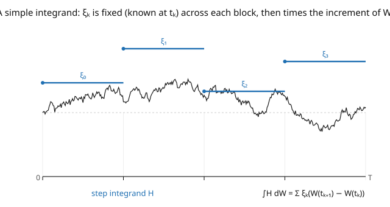

# Stochastic Calculus · Lesson 2.2: The integral for simple integrands

> ⏱ ~15 min · Module 2: The Itô integral · Builds on: [2.1 Why Riemann–Stieltjes fails](02-01-why-riemann-stieltjes-fails.md) · Unlocks: [2.3 The Itô isometry and the general integral](02-03-ito-isometry-general-integral.md)

## Why this matters

We build the Itô integral the way every integral gets built: define it first for the simplest possible integrands, then extend by a limit. The simplest integrands are **simple (step) processes** — hold a fixed position over each time block, then rebalance. For these, the "integral" is nothing more than a sum: (position) × (price change), block by block. This is exactly a trading strategy that only rebalances at discrete times, and its total gain is the sum of position-weighted increments. Two properties fall out immediately and for free — the integral has **mean zero** and is a **martingale** — and they're the properties that survive the limit to general integrands. Get the simple case right and the rest of the construction is just completing a space.

## The idea

A **simple process** $H$ is piecewise constant in time: pick partition times $0 = t_0 < t_1 < \cdots < t_n = T$ and hold the value $\xi_k$ throughout the block $(t_k, t_{k+1}]$ (the picture). The one non-negotiable rule: $\xi_k$ must be **known at time $t_k$** — it's chosen at the *start* of the block, before the block's noise is revealed ($\xi_k$ is $\mathcal{F}_{t_k}$-measurable). This is the left-endpoint / non-anticipating rule from [2.1](02-01-why-riemann-stieltjes-fails.md), now built into the definition of an admissible integrand.

The Itô integral of a simple process is then just the block-by-block sum:

$$\int_0^T H\,dW = \sum_k \xi_k\,\big(W_{t_{k+1}} - W_{t_k}\big) = \sum_k (\text{position in block } k)\times(\text{increment of } W).$$

No sampling ambiguity, no limit yet — it's a finite sum of random variables. And because each term is a *known* position times an *independent, mean-zero* future increment, each term has conditional mean zero. So the whole thing has mean zero, and as a process in the upper limit it's a martingale: your expected gain is always zero (a fair game). These two facts require nothing but the definition — and they're the load-bearing properties of the entire theory.

## The formal version

A process $H$ is **simple (elementary)** if there is a partition $0 = t_0 < \cdots < t_n = T$ and random variables $\xi_k$ with $\xi_k$ **$\mathcal{F}_{t_k}$-measurable** and $\mathbb{E}[\xi_k^2] < \infty$, such that

$$H_t = \sum_{k=0}^{n-1}\xi_k\,\mathbf{1}_{(t_k,\, t_{k+1}]}(t).$$

*In words:* $H$ holds the value $\xi_k$ over each block, decided at the block's left endpoint. Its **Itô integral** (as a process in $t$) is

$$I_t(H) := \int_0^t H\,dW = \sum_{k}\xi_k\,\big(W_{t_{k+1}\wedge t} - W_{t_k\wedge t}\big).$$

**Key properties** (all from the definition):

- **Linearity:** $I(aH + bG) = aI(H) + bI(G)$.
- **Mean zero:** $\mathbb{E}[I_T(H)] = 0$.
- **Martingale:** $\{I_t(H)\}$ is a martingale w.r.t. $\{\mathcal{F}_t\}$: $\mathbb{E}[I_t(H)\mid\mathcal{F}_s] = I_s(H)$.
- **Itô isometry (the variance formula):** $\displaystyle \mathbb{E}\big[I_T(H)^2\big] = \mathbb{E}\Big[\int_0^T H_t^2\,dt\Big] = \sum_k \mathbb{E}[\xi_k^2]\,(t_{k+1}-t_k).$

*In words:* the variance of the integral equals the expected time-integral of the squared integrand — the identity that will let us extend to all integrands by an $L^2$ limit ([2.3](02-03-ito-isometry-general-integral.md)).

## Picture

## Worked examples

**Example 1 (a deterministic step integrand).** Let $H_t = \mathbf{1}_{(1,3]}(t)$ on $[0,5]$ — hold $1$ unit during $(1,3]$, nothing otherwise. Then

$$\int_0^5 H\,dW = 1\cdot(W_3 - W_1) = W_3 - W_1 \sim \mathcal{N}(0,\, 3-1) = \mathcal{N}(0, 2).$$

Mean zero ✓. Variance $2$ ✓, and the isometry confirms it: $\mathbb{E}\big[\int_0^5 H_t^2\,dt\big] = \int_1^3 1\,dt = 2$. The integral of a step against BM is just a weighted increment — here a single $\mathcal{N}(0,2)$ increment.

**Example 2 (mean zero and the martingale property from the definition).** Take a general simple $H$ and show $\mathbb{E}[I_T(H)] = 0$. By the tower property, condition each term on the block's start:

$$\mathbb{E}\big[\xi_k(W_{t_{k+1}} - W_{t_k})\big] = \mathbb{E}\big[\,\xi_k\,\mathbb{E}[W_{t_{k+1}} - W_{t_k}\mid\mathcal{F}_{t_k}]\,\big] = \mathbb{E}[\xi_k\cdot 0] = 0,$$

using that $\xi_k$ is $\mathcal{F}_{t_k}$-measurable (pull it out) and the increment is independent of $\mathcal{F}_{t_k}$ with mean $0$. Summing, $\mathbb{E}[I_T(H)] = 0$. The *same* computation, applied to increments after time $s$, gives $\mathbb{E}[I_t(H)\mid\mathcal{F}_s] = I_s(H)$ — the martingale property. This is *precisely* where the left-endpoint rule pays off: if $\xi_k$ depended on the increment (right-endpoint), you couldn't pull it out of the conditional expectation and the mean-zero property would die. Non-anticipation $\Rightarrow$ fair game.

## Watch out

- **You might let $\xi_k$ depend on the block's increment.** Then $H$ is not adapted, the pull-out step fails, and $I(H)$ is no longer mean-zero or a martingale. The requirement "$\xi_k$ is $\mathcal{F}_{t_k}$-measurable" — decided *before* the block — is the entire content that distinguishes Itô from Stratonovich.
- **You might confuse the integral's variance with $\int H^2$.** The isometry says $\mathbb{E}[I_T^2] = \mathbb{E}[\int_0^T H^2\,dt]$ — an *expected time-integral of the square*, not $(\int H\,dt)^2$ or $\int H\,dt$. For deterministic $H$ it's just $\int_0^T H_t^2\,dt$.
- **You might expect $I_T(H)$ to be Gaussian in general.** It's Gaussian when $H$ is *deterministic* (a fixed linear combination of independent Gaussian increments). When $\xi_k$ is random (depends on the path), $I_T(H)$ need not be Gaussian — only mean-zero with the isometry variance.

## One-liner

> For a step integrand — a position $\xi_k$ locked in at the start of each block — the Itô integral is just $\sum \xi_k(W_{t_{k+1}} - W_{t_k})$, automatically mean-zero and a martingale, with variance $\mathbb{E}\int_0^T H^2\,dt$.

## Problems

**P1 (🟢)** Let $H_t = 2\cdot\mathbf{1}_{(0,1]}(t) - \mathbf{1}_{(1,4]}(t)$ on $[0,4]$. Write $\int_0^4 H\,dW$ as a combination of Brownian increments, and compute its mean and variance (check the variance against the isometry $\mathbb{E}\int_0^4 H^2\,dt$).

**P2 (🟡)** Let $H_t = W_1\cdot\mathbf{1}_{(1,2]}(t)$ — hold the (random) position $W_1$ during $(1,2]$. Is $H$ a valid (adapted) simple integrand? Compute $\int_0^2 H\,dW$, its mean, and its variance. *Hint:* the position $W_1$ is known at time $1$; use independence of $W_2 - W_1$ from $\mathcal{F}_1$.

**P3 (🔴, optional)** Prove the isometry for a two-block simple process $H = \xi_0\mathbf{1}_{(0,t_1]} + \xi_1\mathbf{1}_{(t_1,t_2]}$: expand $\mathbb{E}[I^2]$ and show the cross term vanishes. *Hint:* the cross term is $2\mathbb{E}[\xi_0\Delta W_0\,\xi_1\Delta W_1]$; condition on $\mathcal{F}_{t_1}$ and use that $\Delta W_1$ is independent with mean $0$.

Solutions

**P1** $\int_0^4 H\,dW = 2(W_1 - W_0) - (W_4 - W_1) = 2W_1 - (W_4 - W_1)$. Mean: $0$ (each increment mean zero). Variance: the two increments $W_1 - W_0$ and $W_4 - W_1$ are independent, so $\text{Var} = 2^2\cdot\text{Var}(W_1) + (-1)^2\cdot\text{Var}(W_4 - W_1) = 4\cdot 1 + 1\cdot 3 = 7$. Isometry check: $\mathbb{E}\int_0^4 H^2\,dt = \int_0^1 4\,dt + \int_1^4 1\,dt = 4 + 3 = 7$. ✓

**P2** Yes — the position $W_1$ is $\mathcal{F}_1$-measurable (known at the block's start $t=1$), so $H$ is a valid adapted simple integrand. $\int_0^2 H\,dW = W_1(W_2 - W_1)$. Mean: $\mathbb{E}[W_1(W_2 - W_1)] = \mathbb{E}[W_1\,\mathbb{E}[W_2 - W_1\mid\mathcal{F}_1]] = \mathbb{E}[W_1\cdot 0] = 0$. Variance: by the isometry, $\mathbb{E}\int_0^2 H^2\,dt = \mathbb{E}\int_1^2 W_1^2\,dt = \mathbb{E}[W_1^2]\cdot 1 = 1$. (Directly: $\mathbb{E}[W_1^2(W_2-W_1)^2] = \mathbb{E}[W_1^2]\,\mathbb{E}[(W_2-W_1)^2] = 1\cdot 1 = 1$ by independence.) ✓

**P3** $I = \xi_0\Delta W_0 + \xi_1\Delta W_1$ with $\Delta W_0 = W_{t_1}-W_0$, $\Delta W_1 = W_{t_2}-W_{t_1}$. Then $\mathbb{E}[I^2] = \mathbb{E}[\xi_0^2\Delta W_0^2] + 2\mathbb{E}[\xi_0\xi_1\Delta W_0\Delta W_1] + \mathbb{E}[\xi_1^2\Delta W_1^2]$. Cross term: condition on $\mathcal{F}_{t_1}$ (which contains $\xi_0, \Delta W_0, \xi_1$): $\mathbb{E}[\xi_0\xi_1\Delta W_0\,\mathbb{E}[\Delta W_1\mid\mathcal{F}_{t_1}]] = \mathbb{E}[\xi_0\xi_1\Delta W_0\cdot 0] = 0$. Diagonal terms: $\mathbb{E}[\xi_k^2\Delta W_k^2] = \mathbb{E}[\xi_k^2\,\mathbb{E}[\Delta W_k^2\mid\mathcal{F}_{t_k}]] = \mathbb{E}[\xi_k^2](t_{k+1}-t_k)$. So $\mathbb{E}[I^2] = \sum_k\mathbb{E}[\xi_k^2](t_{k+1}-t_k) = \mathbb{E}\int_0^{t_2}H^2\,dt$. ∎

## Flashback

**From Lesson 2.1 (Why Riemann–Stieltjes fails):** For $\int_0^T W\,dW$, compute (right-endpoint sum) − (left-endpoint sum) over a partition, and give its limit as the mesh $\to 0$.

Solution

$\sum_k W_{t_{k+1}}\Delta W_k - \sum_k W_{t_k}\Delta W_k = \sum_k(W_{t_{k+1}} - W_{t_k})\Delta W_k = \sum_k(\Delta W_k)^2 \xrightarrow{L^2} [W]_T = T$. The two sampling conventions differ by the quadratic variation $T \neq 0$, which is exactly why the integral needs a chosen convention — Itô picks the left endpoint. ✓

## Connections

- **Backward:** the $\mathcal{F}_{t_k}$-measurable requirement enforces the left-endpoint / adapted rule from [2.1](02-01-why-riemann-stieltjes-fails.md) and [1.3](01-03-filtrations-adaptedness-markov.md); mean-zero uses the independent increments of [1.1](01-01-random-walks-to-brownian-motion.md).
- **Forward:** [2.3](02-03-ito-isometry-general-integral.md) uses the isometry to extend from simple to all adapted $L^2$ integrands by completing the space; [2.4](02-04-ito-integral-as-martingale.md) makes the martingale property a computational tool.
- **Sideways (finance):** a simple integrand is a **discretely-rebalanced trading strategy**, and $\int H\,dW$ is its gain; the martingale property is "you can't make money in expectation trading a martingale" — the seed of no-arbitrage ([`mathematical-finance`](../../mathematical-finance/syllabus.md)).
