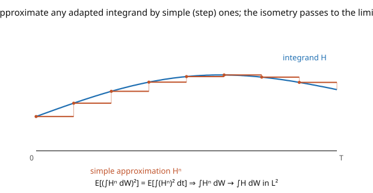

# Stochastic Calculus · Lesson 2.3: The Itô isometry and the general integral

> ⏱ ~15 min · Module 2: The Itô integral · Builds on: [2.2 The integral for simple integrands](02-02-ito-integral-simple-integrands.md) · Unlocks: [2.4 The Itô integral as a martingale](02-04-ito-integral-as-martingale.md)

## Why this matters

We have the Itô integral for step integrands ([2.2](02-02-ito-integral-simple-integrands.md)); now we extend it to *all* reasonable integrands — anything adapted and square-integrable, including $W_t$ itself, $\sin(W_t)$, or any strategy that responds continuously to the path. The extension hinges on one gorgeous identity, the **Itô isometry**: the variance of the integral equals the expected time-integral of the squared integrand. This turns a hard analytic limit into a routine one — approximating in the "$\int H^2\,dt$" sense automatically makes the integrals converge — and it is *the* computational tool for variances of stochastic integrals throughout the course. Every time you need $\text{Var}(\int H\,dW)$, you reach for the isometry.

## The idea

Here's the extension strategy, identical in spirit to how the Lebesgue integral extends from simple functions ([`probability-theory`](../../probability-theory/syllabus.md)):

1. Any adapted, square-integrable integrand $H$ can be **approximated by simple (step) integrands** $H^n$ — staircases closing in on the true integrand (the picture).
2. For each $H^n$ we already have $\int H^n\,dW$ ([2.2](02-02-ito-integral-simple-integrands.md)).
3. The **Itô isometry** says the *distance* between two integrals equals the *distance* between their integrands: $\mathbb{E}[(\int H^n\,dW - \int H^m\,dW)^2] = \mathbb{E}[\int (H^n - H^m)^2\,dt]$. So if the $H^n$ get close (in the $\int(\cdot)^2\,dt$ sense), their integrals get close in $L^2$ — a **Cauchy sequence** — hence converge to a limit.
4. **Define** $\int H\,dW$ as that limit. The isometry guarantees the answer doesn't depend on which approximating staircase you chose.

The isometry is called an *isometry* because it's a distance-preserving map: it sends the space of integrands (measured by $\int H^2\,dt$) into the space of random variables (measured by variance) without distorting distances. Distance-preserving maps send Cauchy sequences to Cauchy sequences, and that's the entire engine of the construction. The payoff you keep forever: $\text{Var}(\int H\,dW) = \mathbb{E}\int H^2\,dt$.

## The formal version

**The class of integrands.** Admit any $H$ that is (i) **adapted** (progressively measurable) and (ii) **square-integrable**, $\mathbb{E}\big[\int_0^T H_t^2\,dt\big] < \infty$. Call this space $\mathcal{L}^2$.

**Itô isometry.** For simple $H$ (hence, by extension, all $H \in \mathcal{L}^2$),

$$\mathbb{E}\left[\left(\int_0^T H_t\,dW_t\right)^2\right] = \mathbb{E}\left[\int_0^T H_t^2\,dt\right].$$

*In words:* the second moment of the Itô integral equals the expected time-integral of the squared integrand — a bridge between an $L^2(\Omega)$ norm (on random variables) and an $L^2(dt\times d\mathbb{P})$ norm (on integrands).

**The extension.** Given $H \in \mathcal{L}^2$, choose simple $H^n$ with $\mathbb{E}\int_0^T(H^n - H)^2\,dt \to 0$. By the isometry, $\{\int H^n\,dW\}$ is Cauchy in $L^2(\Omega)$; define

$$\int_0^T H_t\,dW_t := \lim_{n\to\infty}\int_0^T H^n_t\,dW_t \quad(L^2\text{ limit}).$$

The limit is independent of the approximating sequence (isometry again). The resulting integral inherits from the simple case: it is **linear**, **mean zero**, a **martingale** (in the upper limit, with a continuous version), and satisfies the isometry. *In words:* everything true for steps survives the limit — the isometry is the vehicle that carries it across.

## Picture

## Worked examples

**Example 1 (a deterministic integrand — $\int_0^T t\,dW_t$).** Here $H_t = t$ is deterministic, hence adapted, and square-integrable ($\int_0^T t^2\,dt = T^3/3 < \infty$). Approximating by step functions and taking the limit gives a well-defined Gaussian integral (a limit of linear combinations of independent Gaussian increments is Gaussian), with mean $0$ and, by the isometry,

$$\text{Var}\left(\int_0^T t\,dW_t\right) = \mathbb{E}\int_0^T t^2\,dt = \int_0^T t^2\,dt = \frac{T^3}{3}, \qquad \int_0^T t\,dW_t \sim \mathcal{N}\!\Big(0,\, \tfrac{T^3}{3}\Big).$$

For a *deterministic* integrand $f$, the same reasoning gives the clean rule $\int_0^T f\,dW \sim \mathcal{N}(0, \int_0^T f^2\,dt)$ — a **Wiener integral**, always Gaussian, variance read straight off the isometry.

**Example 2 (the isometry checks $\int_0^T W\,dW$).** We found $\int_0^T W\,dW = \tfrac12 W_T^2 - \tfrac12 T$ ([2.1](02-01-why-riemann-stieltjes-fails.md)). Verify its variance two ways. By the isometry:

$$\mathbb{E}\left[\left(\int_0^T W\,dW\right)^2\right] = \mathbb{E}\int_0^T W_t^2\,dt = \int_0^T \mathbb{E}[W_t^2]\,dt = \int_0^T t\,dt = \frac{T^2}{2}.$$

Directly, using $\text{Var}(W_T^2) = 2T^2$ (from [1.5](01-05-quadratic-variation-martingale-property.md) P3) and that $\tfrac12 W_T^2 - \tfrac12 T$ has mean $0$:

$$\mathbb{E}\left[\Big(\tfrac12 W_T^2 - \tfrac12 T\Big)^2\right] = \tfrac14\,\mathbb{E}\big[(W_T^2 - T)^2\big] = \tfrac14\,\text{Var}(W_T^2) = \tfrac14\cdot 2T^2 = \frac{T^2}{2}.$$

The two agree. ✓ Note the integrand $W_t$ is *random*, so this integral is **not** Gaussian (it's a shifted chi-square, $\tfrac12 W_T^2 - \tfrac12 T$) — the isometry gives its variance regardless.

## Watch out

- **You might think the isometry gives the full distribution.** It gives only the *second moment* (variance, since mean is $0$). The integral is Gaussian **only** when the integrand is deterministic. For random integrands (like $W_t$), you get the variance from the isometry but must work harder for the law.
- **You might forget to check square-integrability.** The construction needs $\mathbb{E}\int_0^T H^2\,dt < \infty$. An integrand like $1/W_t$ or $e^{W_t^2}$ can violate this and fall outside the basic theory (one then localizes, using stopping times, to a larger class of *local* martingales — a refinement).
- **You might write $\mathbb{E}[(\int H\,dW)^2] = (\mathbb{E}\int H\,dt)^2$ or $\int(\mathbb{E}H)^2 dt$.** The isometry is $\mathbb{E}\int_0^T H_t^2\,dt$ — expectation of the time-integral of the *square*, with the expectation on the outside. Squaring, then time-integrating, then expecting — order matters when $H$ is random.

## One-liner

> The Itô isometry $\mathbb{E}[(\int H\,dW)^2] = \mathbb{E}\int H^2\,dt$ is a distance-preserving map that extends the integral from step functions to all adapted square-integrable integrands — and hands you the variance of any stochastic integral for free.

## Problems

**P1 (🟢)** Compute the variance of $\int_0^2 (3 - t)\,dW_t$ using the isometry, and state its full distribution (the integrand is deterministic).

**P2 (🟡)** Compute $\text{Var}\big(\int_0^T W_t^2\,dW_t\big)$ using the isometry. *Hint:* you need $\mathbb{E}[W_t^4] = 3t^2$ ([1.1](01-01-random-walks-to-brownian-motion.md) P2); integrate over $t$.

**P3 (🔴, optional)** Show that for two integrands $H, G \in \mathcal{L}^2$, $\mathbb{E}\big[\big(\int_0^T H\,dW\big)\big(\int_0^T G\,dW\big)\big] = \mathbb{E}\int_0^T H_t G_t\,dt$ (the **polarized** isometry). *Hint:* apply the isometry to $H + G$ and to $H - G$, then subtract.

Solutions

**P1** By the isometry, $\text{Var} = \int_0^2 (3-t)^2\,dt = \int_0^2 (9 - 6t + t^2)\,dt = [9t - 3t^2 + \tfrac{t^3}{3}]_0^2 = 18 - 12 + \tfrac{8}{3} = 6 + \tfrac83 = \tfrac{26}{3}$. Since $3 - t$ is deterministic, the integral is Gaussian: $\int_0^2(3-t)\,dW_t \sim \mathcal{N}\big(0, \tfrac{26}{3}\big)$.

**P2** By the isometry, $\text{Var}\big(\int_0^T W_t^2\,dW_t\big) = \mathbb{E}\int_0^T (W_t^2)^2\,dt = \int_0^T \mathbb{E}[W_t^4]\,dt = \int_0^T 3t^2\,dt = T^3$. (The integrand $W_t^2$ is adapted and square-integrable since $\mathbb{E}\int_0^T W_t^4\,dt = T^3 < \infty$.)

**P3** Apply the isometry to $H \pm G$: $\mathbb{E}[(\int(H+G)dW)^2] = \mathbb{E}\int(H+G)^2\,dt$ and $\mathbb{E}[(\int(H-G)dW)^2] = \mathbb{E}\int(H-G)^2\,dt$. Subtract: the left side is $\mathbb{E}[(\int H\,dW + \int G\,dW)^2 - (\int H\,dW - \int G\,dW)^2] = 4\,\mathbb{E}[(\int H\,dW)(\int G\,dW)]$ (the algebraic identity $(a+b)^2 - (a-b)^2 = 4ab$). The right side is $\mathbb{E}\int[(H+G)^2 - (H-G)^2]\,dt = 4\,\mathbb{E}\int H G\,dt$. Divide by $4$: $\mathbb{E}[(\int H\,dW)(\int G\,dW)] = \mathbb{E}\int_0^T H_t G_t\,dt$. ∎

## Flashback

**From Lesson 2.2 (The integral for simple integrands):** For $H_t = 3\cdot\mathbf{1}_{(0,1]}(t) + \mathbf{1}_{(1,3]}(t)$ on $[0,3]$, write $\int_0^3 H\,dW$ as Brownian increments and compute its mean and variance (check against $\mathbb{E}\int_0^3 H^2\,dt$).

Solution

$\int_0^3 H\,dW = 3(W_1 - W_0) + (W_3 - W_1) = 3W_1 + (W_3 - W_1)$. Mean $0$. The increments $W_1$ and $W_3 - W_1$ are independent, so $\text{Var} = 9\cdot\text{Var}(W_1) + 1\cdot\text{Var}(W_3 - W_1) = 9\cdot 1 + 1\cdot 2 = 11$. Isometry: $\mathbb{E}\int_0^3 H^2\,dt = \int_0^1 9\,dt + \int_1^3 1\,dt = 9 + 2 = 11$. ✓

## Connections

- **Backward:** the isometry was proved for simple integrands in [2.2](02-02-ito-integral-simple-integrands.md); the $L^2$-completion mirrors how the Lebesgue integral is extended in [`probability-theory`](../../probability-theory/syllabus.md); the variance $\int_0^T \mathbb{E}[W_t^2]\,dt = \int_0^T t\,dt$ uses [1.2](01-02-gaussian-structure-of-bm.md).
- **Forward:** [2.4](02-04-ito-integral-as-martingale.md) exploits mean-zero and the martingale property as computational shortcuts; the isometry is the tool for every variance calculation in Modules 3–4, including pricing-error and hedging variances.
- **Sideways (Hilbert spaces):** the isometry is literally an isometric embedding of one $L^2$ Hilbert space into another ([`real-analysis`](../../real-analysis/syllabus.md) / functional analysis) — the abstract reason the construction works, and the same idea behind the Wiener chaos decomposition.
