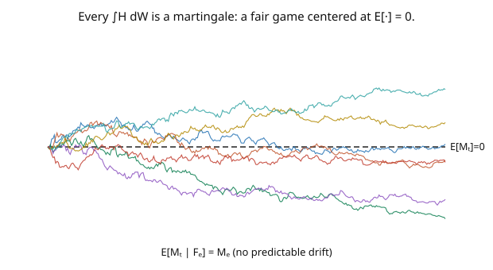

# Stochastic Calculus · Lesson 2.4: The Itô integral as a martingale

> ⏱ ~15 min · Module 2: The Itô integral · Builds on: [2.3 The Itô isometry and the general integral](02-03-ito-isometry-general-integral.md) · Unlocks: [2.5 Quadratic variation and the $dW\,dW=dt$ rules](02-05-quadratic-variation-dwdw-rules.md)

## Why this matters

The single most useful fact about the Itô integral is that it is a **martingale** — a fair game with no predictable drift — and in particular it has **mean zero**. This is not just structure; it's a computational superpower. Whenever an expression contains $\int H\,dW$, you can often *delete it in expectation*: $\mathbb{E}[\int H\,dW] = 0$. Whole calculations of $\mathbb{E}[\cdot]$ collapse to almost nothing. Combined with optional stopping ([1.6](01-06-stopping-times-optional-stopping.md)), the martingale property lets you compute hitting probabilities, expected values of functionals, and hedging errors — often in a line or two. In finance it *is* the statement that a fairly-priced game can't be beaten in expectation, the mathematical heart of no-arbitrage.

## The idea

We built $\int_0^t H\,dW$ so that each increment is a known position times an independent, mean-zero future increment ([2.2](02-02-ito-integral-simple-integrands.md)). That construction makes the running integral $M_t = \int_0^t H\,dW$ a **martingale**: your best forecast of its future value, given everything so far, is its current value. It drifts nowhere on average (the picture — many paths, all centered at zero).

Two consequences you'll use constantly:

- **Mean zero:** taking the martingale identity with $s = 0$ gives $\mathbb{E}[M_t] = M_0 = 0$. Any stochastic integral has expectation zero.
- **Compute by deletion:** to find $\mathbb{E}[\text{something}]$, isolate the stochastic-integral part, and it vanishes. For example, since $\int_0^t W\,dW = \tfrac12 W_t^2 - \tfrac12 t$ has mean zero, we instantly recover $\mathbb{E}[W_t^2] = t$ — no Gaussian integral needed.

And because it's a martingale, **optional stopping** applies: stopping the integral at a (nice) stopping time preserves the mean-zero property, $\mathbb{E}[M_\tau] = 0$. This is how you turn "the integral is fair" into concrete numbers about random times.

One caveat to file away: the integral is a *true* martingale when the integrand is genuinely square-integrable ($\mathbb{E}\int_0^T H^2\,dt < \infty$). For wilder integrands it's only a **local** martingale — still driftless in a localized sense, but $\mathbb{E}[M_t] = 0$ can fail without the integrability guarantee.

## The formal version

Let $H \in \mathcal{L}^2$ (adapted, $\mathbb{E}\int_0^T H^2\,dt < \infty$) and $M_t = \int_0^t H_u\,dW_u$. Then $\{M_t\}$ is a **continuous martingale**:

$$\mathbb{E}[M_t \mid \mathcal{F}_s] = M_s \quad(s \leq t), \qquad \text{hence} \qquad \mathbb{E}[M_t] = 0.$$

*In words:* the accumulated stochastic integral is a fair game; its expected future equals its present, and its overall mean is zero. Its variance is the isometry ([2.3](02-03-ito-isometry-general-integral.md)):

$$\text{Var}(M_t) = \mathbb{E}[M_t^2] = \mathbb{E}\int_0^t H_u^2\,du.$$

**Optional stopping** ([1.6](01-06-stopping-times-optional-stopping.md)): for a stopping time $\tau$ (with a regularity condition, e.g. $\tau$ bounded or $M_{t\wedge\tau}$ uniformly integrable), $\mathbb{E}[M_\tau] = 0$. **Doob's $L^2$ inequality** controls the whole path: $\mathbb{E}[\sup_{s\leq t}M_s^2] \leq 4\,\mathbb{E}[M_t^2] = 4\,\mathbb{E}\int_0^t H^2\,du$.

**Local martingale caveat:** if $H$ is only adapted with $\int_0^T H^2\,dt < \infty$ almost surely (but not in expectation), $M_t$ is a **local martingale** — there exist stopping times $\tau_n \uparrow \infty$ making each $M_{t\wedge\tau_n}$ a true martingale, but $\mathbb{E}[M_t] = 0$ may fail globally. *In words:* driftlessness always holds locally; the mean-zero shortcut needs the integrability hypothesis.

## Picture

## Worked examples

**Example 1 (recovering $\mathbb{E}[W_t^2] = t$ from mean-zero).** We know $\int_0^t W\,dW = \tfrac12 W_t^2 - \tfrac12 t$. Since the left side is a stochastic integral, it has mean zero:

$$0 = \mathbb{E}\left[\int_0^t W\,dW\right] = \mathbb{E}\left[\tfrac12 W_t^2 - \tfrac12 t\right] = \tfrac12\mathbb{E}[W_t^2] - \tfrac12 t \;\Longrightarrow\; \mathbb{E}[W_t^2] = t.$$

A fact we knew ([1.2](01-02-gaussian-structure-of-bm.md)), rederived in one line by "delete the stochastic integral." This is the paradigm: the martingale property converts a moment computation into a triviality.

**Example 2 (verifying the martingale property directly).** Let $M_t = \int_0^t W\,dW = \tfrac12 W_t^2 - \tfrac12 t$ and check $\mathbb{E}[M_t\mid\mathcal{F}_s] = M_s$ for $s < t$. Using $\mathbb{E}[W_t^2\mid\mathcal{F}_s] = W_s^2 + (t-s)$ ([1.3](01-03-filtrations-adaptedness-markov.md)):

$$\mathbb{E}[M_t\mid\mathcal{F}_s] = \tfrac12\mathbb{E}[W_t^2\mid\mathcal{F}_s] - \tfrac12 t = \tfrac12\big(W_s^2 + (t-s)\big) - \tfrac12 t = \tfrac12 W_s^2 - \tfrac12 s = M_s. \checkmark$$

The $-\tfrac12 t$ term (the quadratic-variation correction) is *exactly* what turns the non-martingale $\tfrac12 W_t^2$ into the martingale $M_t$ — the same compensation as $W_t^2 - t$ in [1.5](01-05-quadratic-variation-martingale-property.md). The Itô integral came out a martingale precisely because it carries its own correction.

## Watch out

- **You might apply "$\mathbb{E}[\int H\,dW] = 0$" to a non-integrable integrand.** The mean-zero shortcut needs $\mathbb{E}\int_0^T H^2\,dt < \infty$ (true martingale). For a mere local martingale it can fail — a famous cautionary example is the exponential $\int$ appearing in Girsanov when Novikov's condition is violated ([4.2](04-02-girsanov-theorem.md)). Always confirm integrability before deleting.
- **You might think a martingale must be constant or converge.** A martingale has zero *drift*, not zero movement — it fluctuates (its variance grows). $W_t$ is a martingale with variance $t \to \infty$; it does not converge. "Fair game" ≠ "settles down."
- **You might forget the martingale property needs the left endpoint.** It's a consequence of Itô's non-anticipating construction ([2.1](02-01-why-riemann-stieltjes-fails.md)). The Stratonovich integral is **not** a martingale — you cannot use mean-zero deletion with $\circ\,dW$. Reserve the shortcut for genuine Itô integrals.

## One-liner

> The Itô integral $\int_0^t H\,dW$ is a martingale with mean zero — so in any expectation you can simply delete it — and optional stopping extends the trick to random times.

## Problems

**P1 (🟢)** Use the mean-zero property to compute $\mathbb{E}\big[\int_0^T e^{W_t}\,dW_t\big]$ and $\mathbb{E}\big[\int_0^T (W_t^3 - 3t W_t)\,dW_t\big]$, assuming both integrands are square-integrable. (No computation of the integrals themselves is needed.)

**P2 (🟡)** Let $M_t = \int_0^t W_u^2\,dW_u$. Find $\mathbb{E}[M_t]$ and $\text{Var}(M_t)$. *Hint:* mean from the martingale property; variance from the isometry with $\mathbb{E}[W_u^4] = 3u^2$.

**P3 (🔴, optional)** Let $\tau = \inf\{t: W_t \notin (-a,a)\}$ and $M_t = \int_0^t W_u\,dW_u = \tfrac12(W_t^2 - t)$. Apply optional stopping ($\mathbb{E}[M_\tau] = 0$) to recover $\mathbb{E}[\tau] = a^2$ from [1.6](01-06-stopping-times-optional-stopping.md). Confirm it matches, and explain which martingale you effectively used.

Solutions

**P1** Both are Itô integrals of (assumed) square-integrable adapted integrands, hence martingales starting at $0$, hence mean zero: $\mathbb{E}\big[\int_0^T e^{W_t}\,dW_t\big] = 0$ and $\mathbb{E}\big[\int_0^T (W_t^3 - 3tW_t)\,dW_t\big] = 0$. (No need to evaluate the integrals — the martingale property does all the work.)

**P2** Mean: $M_t$ is a stochastic integral, so $\mathbb{E}[M_t] = 0$. Variance by the isometry: $\text{Var}(M_t) = \mathbb{E}\int_0^t (W_u^2)^2\,du = \int_0^t \mathbb{E}[W_u^4]\,du = \int_0^t 3u^2\,du = t^3$.

**P3** $M_t = \tfrac12(W_t^2 - t)$; optional stopping gives $\mathbb{E}[M_\tau] = 0$, i.e. $\tfrac12(\mathbb{E}[W_\tau^2] - \mathbb{E}[\tau]) = 0$, so $\mathbb{E}[\tau] = \mathbb{E}[W_\tau^2]$. At $\tau$, $W_\tau = \pm a$, so $W_\tau^2 = a^2$ deterministically, giving $\mathbb{E}[\tau] = a^2$. ✓ Matches [1.6](01-06-stopping-times-optional-stopping.md) (symmetric band, $\mathbb{E}[\tau] = a\cdot a = a^2$). The martingale used is effectively $W_t^2 - t$ (twice $M_t$) — the Itô integral $\int W\,dW$ *is* that compensated martingale, so applying mean-zero to the integral is the same as optional stopping on $W_t^2 - t$.

## Flashback

**From Lesson 2.3 (The Itô isometry and the general integral):** Compute $\text{Var}\big(\int_0^3 t\,dW_t\big)$ using the isometry, and state the full distribution.

Solution

By the isometry, $\text{Var}\big(\int_0^3 t\,dW_t\big) = \int_0^3 t^2\,dt = \big[\tfrac{t^3}{3}\big]_0^3 = 9$. The integrand $t$ is deterministic, so the integral is Gaussian: $\int_0^3 t\,dW_t \sim \mathcal{N}(0, 9)$. ✓

## Connections

- **Backward:** the martingale property descends from the simple-integrand construction ([2.2](02-02-ito-integral-simple-integrands.md)); the variance is the isometry ([2.3](02-03-ito-isometry-general-integral.md)); optional stopping is the toolkit from [1.6](01-06-stopping-times-optional-stopping.md).
- **Forward:** the martingale property is what makes Itô's lemma's output decompose into a "drift $dt$ part" (predictable) plus a "$dW$ part" (martingale) — reading off the drift is reading off what breaks the martingale ([3.1](03-01-itos-lemma-for-bm.md)–[3.2](03-02-ito-processes-general-formula.md)); the martingale representation theorem ([4.3](04-03-martingale-representation.md)) says *every* BM-martingale is such an integral.
- **Sideways (finance):** "a self-financing strategy's discounted gains form a martingale under the risk-neutral measure" is the mean-zero property in disguise, and it is the no-arbitrage engine of Black–Scholes pricing ([`mathematical-finance`](../../mathematical-finance/syllabus.md)).
