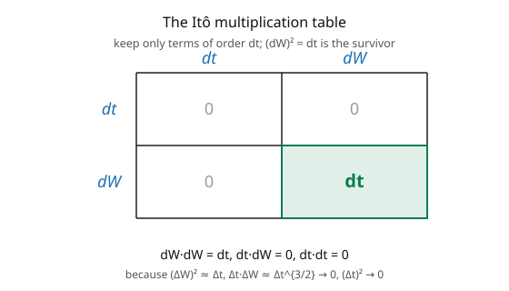

# Stochastic Calculus · Lesson 2.5: Quadratic variation and the $dW\,dW = dt$ rules

> ⏱ ~15 min · Module 2: The Itô integral · Builds on: [2.4 The Itô integral as a martingale](02-04-ito-integral-as-martingale.md) · Unlocks: [3.1 Itô's lemma for a function of BM](03-01-itos-lemma-for-bm.md)

## Why this matters

This lesson delivers the **multiplication table** of stochastic calculus — the compact rules $dW\,dW = dt$, $dt\,dW = 0$, $dt\,dt = 0$ — that make every computation in Module 3 mechanical. These three rules are the entire reason Itô's lemma has its famous extra term, the reason geometric Brownian motion has a $-\tfrac12\sigma^2$ drift correction, and the reason stochastic calculus differs from ordinary calculus at all. Once you internalize "$(dW)^2 = dt$," you can Taylor-expand any function of a diffusion, keep the second-order term, and read off the answer. It's the single most-used piece of machinery in the whole subject, and it comes straight from the quadratic variation $[W]_t = t$.

## The idea

In ordinary calculus, when you Taylor-expand $f(x + \Delta x)$ you keep the first-order term $f'\Delta x$ and throw away $(\Delta x)^2$ and higher — they're negligible. In stochastic calculus you **cannot** throw away the second-order term, because for Brownian motion $(\Delta W)^2 \approx \Delta t$ is *not* negligible — it's first-order in time (from quadratic variation, [1.5](01-05-quadratic-variation-martingale-property.md)). That one fact changes everything.

Bookkeeping it as differentials: over a small step, $\Delta W$ is of size $\sqrt{\Delta t}$, so

- $(\Delta W)^2 \approx \Delta t$ — **survives** (this is $[W]$),
- $\Delta t\,\Delta W \approx (\Delta t)(\sqrt{\Delta t}) = (\Delta t)^{3/2}$ — **vanishes** (higher order),
- $(\Delta t)^2$ — **vanishes**.

In differential shorthand (the picture): $dW\,dW = dt$, $dt\,dW = 0$, $dt\,dt = 0$. When you square a differential or multiply two, apply this table and keep only what's order $dt$. This is what makes "$\int_0^t H\,dW$ has quadratic variation $\int_0^t H^2\,dt$" and, next module, what generates Itô's correction term.

The quadratic variation of a stochastic integral follows the same logic: $\int H\,dW$ accumulates squared increments $H^2(\Delta W)^2 \approx H^2\,\Delta t$, so its quadratic variation is $\int H^2\,dt$ — the isometry, now as a *pathwise* statement, not just an expectation.

## The formal version

**Quadratic variation of a stochastic integral.** For $M_t = \int_0^t H_u\,dW_u$ with $H \in \mathcal{L}^2$,

$$[M]_t = \int_0^t H_u^2\,du, \qquad \text{i.e.} \qquad d[M]_t = H_t^2\,dt.$$

*In words:* the accumulated squared movement of $\int H\,dW$ is the time-integral of $H^2$ — the pathwise version of the isometry (which is its expectation, [2.3](02-03-ito-isometry-general-integral.md)). Specializing $H \equiv 1$ recovers $[W]_t = t$.

**The Itô multiplication rules.** Treating $dt, dW$ as formal differentials and keeping only terms of order $dt$:

$$dW\,dW = dt, \qquad dt\,dW = dW\,dt = 0, \qquad dt\,dt = 0.$$

*In words:* the product of two Brownian differentials is $dt$; any product involving a $dt$ is negligible. For **two** correlated Brownian motions $W^1, W^2$ with correlation $\rho$, $dW^1\,dW^2 = \rho\,dt$ (and $=0$ if independent); this is the **quadratic covariation** $d[W^1, W^2] = \rho\,dt$.

**Why (heuristic).** Over $[t, t+\Delta t]$: $\mathbb{E}[(\Delta W)^2] = \Delta t$ with variance $2(\Delta t)^2 \to 0$ ([1.5](01-05-quadratic-variation-martingale-property.md)), so $(\Delta W)^2 \to \Delta t$ in $L^2$ — deterministic. And $\Delta t\,\Delta W$ has size $(\Delta t)^{3/2}$, $(\Delta t)^2$ has size $(\Delta t)^2$; both are $o(\Delta t)$ and drop out when summed over $\sim 1/\Delta t$ intervals.

## Picture

## Worked examples

**Example 1 (quadratic variation of $\int t\,dW$ and $\int W\,dW$).** For $M_t = \int_0^t s\,dW_s$, the rule $d[M]_t = H_t^2\,dt$ with $H_s = s$ gives $[M]_t = \int_0^t s^2\,ds = \tfrac{t^3}{3}$. (Contrast its *variance* $\mathbb{E}[M_t^2] = \tfrac{t^3}{3}$ from the isometry — here they coincide because $H$ is deterministic, but in general $[M]_t$ is random and $\text{Var}(M_t) = \mathbb{E}[[M]_t]$.) For $N_t = \int_0^t W\,dW$, $d[N]_t = W_t^2\,dt$, so $[N]_t = \int_0^t W_s^2\,ds$ — a *random* quadratic variation, with $\mathbb{E}[[N]_t] = \int_0^t s\,ds = \tfrac{t^2}{2}$, matching the isometry.

**Example 2 (squaring a diffusion increment — the key Itô computation).** Let $dX = \mu\,dt + \sigma\,dW$ (an Itô process, [3.2](03-02-ito-processes-general-formula.md)). Compute $(dX)^2$ using the table:

$$(dX)^2 = (\mu\,dt + \sigma\,dW)^2 = \mu^2\,\underbrace{(dt)^2}_{0} + 2\mu\sigma\,\underbrace{dt\,dW}_{0} + \sigma^2\,\underbrace{(dW)^2}_{dt} = \sigma^2\,dt.$$

**Only the $(dW)^2 = dt$ term survives**, leaving $(dX)^2 = \sigma^2\,dt$. This single line is the engine of Itô's lemma: when you Taylor-expand $f(X)$ to second order, the $\tfrac12 f''(dX)^2$ term becomes $\tfrac12 f''\sigma^2\,dt$ — the celebrated correction term. Every Itô-calculus computation you'll do reduces to "expand to second order, apply $(dX)^2 = \sigma^2\,dt$."

## Watch out

- **You might keep $dt\,dW$ or $(dt)^2$ terms.** They are exactly zero in the Itô calculus (order $(\Delta t)^{3/2}$ and $(\Delta t)^2$). Dropping them is not an approximation — it's exact in the limit. Keeping them is the most common mechanical error.
- **You might treat $(dW)^2$ as random or as $0$.** It is neither: $(dW)^2 = dt$, a *deterministic* differential. Writing $(dW)^2 = 0$ (as ordinary calculus would) loses the entire correction term; writing it as a random quantity misses that quadratic variation is deterministic for BM.
- **You might forget the cross-rule for multiple noises.** With several Brownian drivers, $dW^i\,dW^j = \rho_{ij}\,dt$ (and $= dt$ if $i = j$, $= 0$ if independent). Multi-asset and multi-factor models live or die on getting these covariation terms right.

## One-liner

> The rule $(dW)^2 = dt$ — with $dt\,dW = 0$ and $(dt)^2 = 0$ — is quadratic variation in differential form, and it's the one fact that makes stochastic calculus differ from ordinary calculus: the second-order Taylor term never vanishes.

## Problems

**P1 (🟢)** Compute $(dX)^2$ for $dX = 3\,dt - 2\,dW$ using the multiplication table. Then compute the quadratic variation $[X]_t$.

**P2 (🟡)** For $M_t = \int_0^t W_u^2\,dW_u$, write $d[M]_t$ and find $[M]_t$ as a time-integral, then compute $\mathbb{E}[[M]_t]$ and confirm it equals $\text{Var}(M_t)$ from the isometry ($\mathbb{E}[W_u^4] = 3u^2$).

**P3 (🔴, optional)** Two correlated Brownian motions have $dW^1\,dW^2 = \rho\,dt$. For $dX = \sigma_1\,dW^1$ and $dY = \sigma_2\,dW^2$, compute the quadratic covariation $d[X,Y]$ and $d(XY)$'s "$dt$-content" $dX\,dY$. Why does this cross term appear in the product rule ([3.6](03-06-product-rule-integration-by-parts.md)) but not in ordinary calculus?

Solutions

**P1** $(dX)^2 = (3\,dt - 2\,dW)^2 = 9(dt)^2 - 12\,dt\,dW + 4(dW)^2 = 0 - 0 + 4\,dt = 4\,dt$. So $d[X]_t = 4\,dt$ and $[X]_t = \int_0^t 4\,du = 4t$. (Only the $dW$-coefficient matters: $[X]_t = (\text{diffusion coeff})^2\cdot t$; the drift $3\,dt$ contributes nothing to quadratic variation.)

**P2** With $H_u = W_u^2$: $d[M]_t = H_t^2\,dt = W_t^4\,dt$, so $[M]_t = \int_0^t W_u^4\,du$. Then $\mathbb{E}[[M]_t] = \int_0^t \mathbb{E}[W_u^4]\,du = \int_0^t 3u^2\,du = t^3$. By the isometry, $\text{Var}(M_t) = \mathbb{E}\int_0^t (W_u^2)^2\,du = \int_0^t 3u^2\,du = t^3$. They agree: $\text{Var}(M_t) = \mathbb{E}[[M]_t]$, the general relation between variance and (expected) quadratic variation. ✓

**P3** $dX\,dY = \sigma_1\sigma_2\,dW^1\,dW^2 = \sigma_1\sigma_2\rho\,dt$, so the quadratic covariation is $d[X,Y] = \sigma_1\sigma_2\rho\,dt$. This cross term appears in the Itô product rule $d(XY) = X\,dY + Y\,dX + dX\,dY$ because, when you expand $(X + \Delta X)(Y + \Delta Y) - XY = X\Delta Y + Y\Delta X + \Delta X\Delta Y$, the last term $\Delta X\,\Delta Y$ is of order $\Delta t$ (both increments are $\sim\sqrt{\Delta t}$, product $\sim\Delta t$) — *not* negligible. In ordinary calculus both increments are $\sim\Delta t$, so their product is $\sim(\Delta t)^2$ and vanishes, which is why the classical product rule has no cross term. Quadratic covariation is exactly this surviving second-order product. ∎

## Flashback

**From Lesson 2.4 (The Itô integral as a martingale):** For $M_t = \int_0^t W\,dW$, state $\mathbb{E}[M_t]$ and use it to recover $\mathbb{E}[W_t^2]$.

Solution

$M_t = \int_0^t W\,dW$ is a stochastic integral, hence a mean-zero martingale: $\mathbb{E}[M_t] = 0$. Since $M_t = \tfrac12 W_t^2 - \tfrac12 t$, taking expectations gives $0 = \tfrac12\mathbb{E}[W_t^2] - \tfrac12 t$, so $\mathbb{E}[W_t^2] = t$. ✓

## Connections

- **Backward:** the rules are quadratic variation $[W]_t = t$ ([1.5](01-05-quadratic-variation-martingale-property.md)) written differentially; $[M]_t = \int H^2\,dt$ is the pathwise face of the isometry ([2.3](02-03-ito-isometry-general-integral.md)).
- **Forward:** $(dX)^2 = \sigma^2\,dt$ generates the correction term in Itô's lemma ([3.1](03-01-itos-lemma-for-bm.md)–[3.2](03-02-ito-processes-general-formula.md)); the covariation cross-rule powers the product rule ([3.6](03-06-product-rule-integration-by-parts.md)).
- **Sideways (numerics/physics):** the $\sqrt{\Delta t}$ scaling dictates that Euler–Maruyama SDE simulation uses increments $\sqrt{\Delta t}\,Z$, and the same rule underlies how noise intensity enters the Fokker–Planck diffusion coefficient ([4.6](04-06-fokker-planck-kolmogorov.md), [`stat-mech`](../../stat-mech/syllabus.md)).

*Module 2 capstone (Boss Problem 2): computing $\int_0^T W\,dW = \tfrac12 W_T^2 - \tfrac12 T$ from left-endpoint sums — the $-\tfrac12 T$ is exactly the accumulated $(dW)^2 = dt$ of this lesson, and the martingale property ([2.4](02-04-ito-integral-as-martingale.md)) confirms its mean is zero.*
