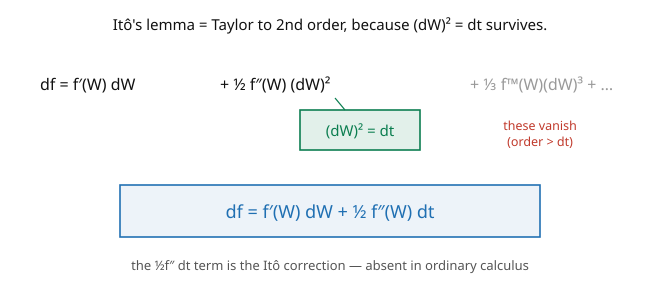

# Stochastic Calculus · Lesson 3.1: Itô's lemma for a function of BM

> ⏱ ~15 min · Module 3: Itô's lemma and stochastic differential equations · Builds on: [2.5 Quadratic variation and the $dW\,dW=dt$ rules](02-05-quadratic-variation-dwdw-rules.md) · Unlocks: [3.2 Itô processes and the general Itô formula](03-02-ito-processes-general-formula.md)

## Why this matters

**Itô's lemma is the chain rule of stochastic calculus**, and it is the workhorse of the entire subject — every SDE you solve, every option you price, every diffusion you analyze runs through it. It differs from the ordinary chain rule by one extra term, a second-order correction $\tfrac12 f''\,dt$, and that term is responsible for essentially every "surprise" in the field: why $\int W\,dW \neq \tfrac12 W_T^2$, why a stock with positive expected return can still have a *negative* drift in its log, why volatility drags down growth. Master this one formula and you can differentiate any function of Brownian motion on sight. It's the payoff of everything in Modules 1–2.

## The idea

In ordinary calculus, if $y = f(x(t))$ then $dy = f'(x)\,dx$ — the chain rule, first order. For $f(W_t)$ we Taylor-expand more carefully:

$$f(W_{t} + dW) - f(W_t) = f'(W_t)\,dW + \tfrac12 f''(W_t)\,(dW)^2 + \tfrac16 f'''(W_t)(dW)^3 + \cdots$$

In ordinary calculus we'd stop at first order, since $(dW)^2$ and beyond are negligible. But for Brownian motion $(dW)^2 = dt$ is **not** negligible — it's first-order in time ([2.5](02-05-quadratic-variation-dwdw-rules.md))! So we must keep the second-order term. Everything of order $(dW)^3 = (dt)^{3/2}$ or higher still vanishes (the picture). Replacing $(dW)^2$ with $dt$:

$$df(W_t) = f'(W_t)\,dW_t + \tfrac12 f''(W_t)\,dt.$$

That's **Itô's lemma**. The first term is the ordinary chain rule; the second, $\tfrac12 f''\,dt$, is the **Itô correction** — a drift that appears purely because Brownian motion is rough. Concave functions ($f'' < 0$) pick up negative drift, convex functions positive. The correction is the fingerprint of quadratic variation on every nonlinear function of $W$.

## The formal version

**Itô's lemma (function of Brownian motion).** For $f \in C^2$,

$$df(W_t) = f'(W_t)\,dW_t + \tfrac12 f''(W_t)\,dt,$$

equivalently in integrated form,

$$f(W_t) = f(W_0) + \int_0^t f'(W_s)\,dW_s + \tfrac12\int_0^t f''(W_s)\,ds.$$

*In words:* the change in $f(W_t)$ splits into a **martingale part** $\int f'\,dW$ (mean-zero, the "noise") and a **drift part** $\tfrac12\int f''\,ds$ (predictable, the "bias"). The drift is the correction ordinary calculus omits. **Reading off drift and volatility:** $f(W_t)$ is an Itô process with volatility $f'(W_t)$ (coefficient of $dW$) and drift $\tfrac12 f''(W_t)$ (coefficient of $dt$).

**Martingale corollary.** $f(W_t)$ is a martingale iff its drift vanishes, i.e. iff $f'' \equiv 0$ — so among functions of $W_t$ alone, only affine $f$ give martingales, *unless* you allow explicit time-dependence to cancel the drift (as in $W_t^2 - t$ and the exponential martingale, [3.2](03-02-ito-processes-general-formula.md)).

## Picture

## Worked examples

**Example 1 ($f(x) = x^2$ — rederiving $\int W\,dW$).** With $f' = 2x$, $f'' = 2$, Itô's lemma gives

$$d(W_t^2) = 2W_t\,dW_t + \tfrac12\cdot 2\,dt = 2W_t\,dW_t + dt.$$

Integrate from $0$ to $t$: $W_t^2 = 2\int_0^t W\,dW + t$, so $\int_0^t W\,dW = \tfrac12(W_t^2 - t)$ — the Module 2 result ([2.1](02-01-why-riemann-stieltjes-fails.md)), now in one line. The extra $dt$ (from $f'' = 2$) is exactly the $-\tfrac12 t$ correction. Notice $W_t^2 - t$ appears as the martingale part's antiderivative: $d(W_t^2 - t) = 2W_t\,dW_t$, confirming $W_t^2 - t$ is a martingale ([1.5](01-05-quadratic-variation-martingale-property.md)).

**Example 2 ($f(x) = e^{\sigma x}$ — the exponential and its drift).** With $f' = \sigma e^{\sigma x}$, $f'' = \sigma^2 e^{\sigma x}$:

$$d\big(e^{\sigma W_t}\big) = \sigma e^{\sigma W_t}\,dW_t + \tfrac12\sigma^2 e^{\sigma W_t}\,dt.$$

The exponential has a *positive* drift $\tfrac12\sigma^2 e^{\sigma W_t}\,dt$ purely from convexity. Taking expectations (the $dW$ term is mean-zero) gives $\frac{d}{dt}\mathbb{E}[e^{\sigma W_t}] = \tfrac12\sigma^2\mathbb{E}[e^{\sigma W_t}]$, so $\mathbb{E}[e^{\sigma W_t}] = e^{\sigma^2 t/2}$ — the Gaussian MGF, rederived via Itô. To make $e^{\sigma W_t}$ a *martingale* you must cancel this drift with a compensating $e^{-\sigma^2 t/2}$ factor: $d\big(e^{\sigma W_t - \sigma^2 t/2}\big) = \sigma e^{\sigma W_t - \sigma^2 t/2}\,dW_t$ (pure martingale) — exactly the exponential martingale of [1.5](01-05-quadratic-variation-martingale-property.md), now *derived* rather than guessed.

## Watch out

- **You might apply the ordinary chain rule and forget the $\tfrac12 f''\,dt$.** This is *the* error of the subject. $d(f(W)) = f'(W)\,dW$ is wrong; you always owe the correction $\tfrac12 f''(W)\,dt$. If your answer looks like ordinary calculus, you've dropped it.
- **You might think $\tfrac12 W_t^2$ is a martingale.** Its Itô differential is $W_t\,dW_t + \tfrac12\,dt$ — a nonzero drift. Only $\tfrac12(W_t^2 - t)$ is a martingale. The correction term is *why* naive antiderivatives fail to be martingales.
- **You might keep the $(dW)^3$ term.** It's $(dt)^{3/2}$, which vanishes. Itô's lemma stops at second order — exactly second, never third. (This is special to Brownian/continuous martingales; jump processes need more terms.)

## One-liner

> Itô's lemma is the chain rule with one extra term: $df(W) = f'(W)\,dW + \tfrac12 f''(W)\,dt$, where the $\tfrac12 f''\,dt$ correction comes from $(dW)^2 = dt$ and is the source of every stochastic-calculus surprise.

## Problems

**P1 (🟢)** Apply Itô's lemma to $f(x) = x^3$ to find $d(W_t^3)$. Write $W_t^3$ in integrated form, and use the martingale property to compute $\mathbb{E}[W_t^3]$.

**P2 (🟡)** Find $d(\cos W_t)$ and $d(\sin W_t)$. Then show $\mathbb{E}[\cos W_t] = e^{-t/2}$. *Hint:* take expectations of $d(\cos W_t)$; the $dW$ term drops, leaving an ODE for $\mathbb{E}[\cos W_t]$.

**P3 (🔴, optional)** For which functions $f$ is $f(W_t)$ a martingale with *explicit time-dependence allowed* — i.e. find all $g(t,x)$ with $g(t, W_t)$ a martingale, where $g$ solves the "backward heat equation" $\partial_t g + \tfrac12\partial_{xx}g = 0$. Verify $g(t,x) = x^2 - t$ and $g(t,x) = e^{\sigma x - \sigma^2 t/2}$ both satisfy it. *(This previews the general time-dependent Itô formula, [3.2](03-02-ito-processes-general-formula.md).)*

Solutions

**P1** $f' = 3x^2$, $f'' = 6x$, so $d(W_t^3) = 3W_t^2\,dW_t + \tfrac12\cdot 6W_t\,dt = 3W_t^2\,dW_t + 3W_t\,dt$. Integrated: $W_t^3 = \int_0^t 3W_s^2\,dW_s + \int_0^t 3W_s\,ds$. Taking expectations, the stochastic integral is mean-zero, and $\mathbb{E}\int_0^t 3W_s\,ds = \int_0^t 3\mathbb{E}[W_s]\,ds = 0$. So $\mathbb{E}[W_t^3] = 0$ (also immediate by symmetry — odd moment of a mean-zero Gaussian).

**P2** $\cos$: $f' = -\sin$, $f'' = -\cos$, so $d(\cos W_t) = -\sin W_t\,dW_t - \tfrac12\cos W_t\,dt$. $\sin$: $d(\sin W_t) = \cos W_t\,dW_t - \tfrac12\sin W_t\,dt$. Take expectations of the first (the $dW$ term vanishes): $\frac{d}{dt}\mathbb{E}[\cos W_t] = -\tfrac12\mathbb{E}[\cos W_t]$, an ODE with $\mathbb{E}[\cos W_0] = \cos 0 = 1$, giving $\mathbb{E}[\cos W_t] = e^{-t/2}$. (Consistent with $\mathbb{E}[\cos W_t] = \text{Re}\,\mathbb{E}[e^{iW_t}] = \text{Re}\,e^{-t/2} = e^{-t/2}$.) ✓

**P3** For $g(t,x)$, the time-dependent Itô formula (next lesson) gives $dg(t,W_t) = \partial_t g\,dt + \partial_x g\,dW_t + \tfrac12\partial_{xx}g\,dt = \partial_x g\,dW_t + (\partial_t g + \tfrac12\partial_{xx}g)\,dt$. This is a martingale iff the drift vanishes: $\partial_t g + \tfrac12\partial_{xx}g = 0$ (the backward heat equation). Check $g = x^2 - t$: $\partial_t g = -1$, $\partial_{xx}g = 2$, so $-1 + \tfrac12(2) = 0$ ✓. Check $g = e^{\sigma x - \sigma^2 t/2}$: $\partial_t g = -\tfrac12\sigma^2 g$, $\partial_{xx}g = \sigma^2 g$, so $-\tfrac12\sigma^2 g + \tfrac12\sigma^2 g = 0$ ✓. Both are martingales — recovering $W_t^2 - t$ and the exponential martingale as solutions of one PDE. ∎

## Flashback

**From Lesson 2.5 (Quadratic variation and the $dW\,dW = dt$ rules):** For $dX = \mu\,dt + \sigma\,dW$, compute $(dX)^2$ using the multiplication table.

Solution

$(dX)^2 = (\mu\,dt + \sigma\,dW)^2 = \mu^2(dt)^2 + 2\mu\sigma\,dt\,dW + \sigma^2(dW)^2 = 0 + 0 + \sigma^2\,dt = \sigma^2\,dt$, keeping only the $(dW)^2 = dt$ term. This $\sigma^2\,dt$ is exactly what becomes the correction term $\tfrac12 f''\sigma^2\,dt$ in the general Itô formula ([3.2](03-02-ito-processes-general-formula.md)). ✓

## Connections

- **Backward:** the correction term is $(dW)^2 = dt$ from [2.5](02-05-quadratic-variation-dwdw-rules.md); the martingale reading uses [2.4](02-04-ito-integral-as-martingale.md); Example 2 rederives the exponential martingale of [1.5](01-05-quadratic-variation-martingale-property.md).
- **Forward:** [3.2](03-02-ito-processes-general-formula.md) generalizes to $f(t, X_t)$ for a full Itô process $dX = \mu\,dt + \sigma\,dW$; [3.4](03-04-geometric-brownian-motion.md) applies it to $\log S_t$ to solve geometric Brownian motion, where the $-\tfrac12\sigma^2$ correction is the famous drift adjustment.
- **Sideways (finance):** the $\tfrac12 f''$ term is why an option's value has "gamma" ($\Gamma = \partial^2 V/\partial S^2$) driving its time-decay; in [`mathematical-finance`](../../mathematical-finance/syllabus.md), the Black–Scholes PDE is Itô's lemma applied to the option price plus a no-arbitrage hedging argument.
