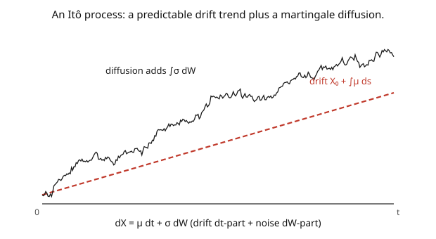

# Stochastic Calculus · Lesson 3.2: Itô processes and the general Itô formula

> ⏱ ~15 min · Module 3: Itô's lemma and stochastic differential equations · Builds on: [3.1 Itô's lemma for a function of BM](03-01-itos-lemma-for-bm.md) · Unlocks: [3.3 Stochastic differential equations](03-03-stochastic-differential-equations.md)

## Why this matters

Real models aren't functions of Brownian motion alone — they have their own **drift** (a predictable trend) and **diffusion** (a noise intensity that can depend on time and state). A stock drifts up while jittering; interest rates mean-revert while fluctuating; a particle feels a force plus thermal noise. The object that captures all of this is the **Itô process** $dX = \mu\,dt + \sigma\,dW$, and the **general Itô formula** tells you how any smooth function $f(t, X_t)$ of it evolves. This is the fully general chain rule of the subject — the tool you actually use to solve SDEs, derive the Black–Scholes PDE, and switch between a process and functions of it. Everything downstream is applications of this one formula.

## The idea

An **Itô process** is anything built from a drift piece and a diffusion piece (the picture):

$$dX_t = \underbrace{\mu_t\,dt}_{\text{drift}} + \underbrace{\sigma_t\,dW_t}_{\text{diffusion}}.$$

The **drift** $\mu_t$ is the predictable trend (where $X$ heads on average); the **diffusion** $\sigma_t$ is the volatility (how hard it's shaken). Both may depend on time and on $X$ itself (as long as they're adapted). The path is a smooth trend plus a martingale wiggle — trend from $\int\mu\,ds$, wiggle from $\int\sigma\,dW$.

Now apply Itô's lemma to $f(t, X_t)$. Taylor-expand in *both* arguments and keep everything up to order $dt$, using $(dX)^2 = \sigma^2\,dt$ ([2.5](02-05-quadratic-variation-dwdw-rules.md)):

$$df = \partial_t f\,dt + \partial_x f\,dX + \tfrac12\partial_{xx}f\,(dX)^2.$$

Substitute $dX = \mu\,dt + \sigma\,dW$ and $(dX)^2 = \sigma^2\,dt$, then collect the $dt$ and $dW$ terms. The result: $f(t, X_t)$ is *itself* an Itô process, with a new drift (three pieces: the explicit time-change $\partial_t f$, the transported drift $\mu\,\partial_x f$, and the Itô correction $\tfrac12\sigma^2\partial_{xx}f$) and a new diffusion ($\sigma\,\partial_x f$). Reading off the drift of $f$ is how you check whether $f(t,X_t)$ is a martingale (drift zero) — the trick behind Feynman–Kac and Black–Scholes.

## The formal version

An **Itô process** is $X_t = X_0 + \int_0^t \mu_s\,ds + \int_0^t \sigma_s\,dW_s$, written $dX_t = \mu_t\,dt + \sigma_t\,dW_t$, with $\mu, \sigma$ adapted (and suitably integrable). Its **quadratic variation** is $d[X]_t = \sigma_t^2\,dt$.

**General Itô formula.** For $f(t, x) \in C^{1,2}$ (once in $t$, twice in $x$), with $Y_t = f(t, X_t)$:

$$dY_t = \left(\partial_t f + \mu_t\,\partial_x f + \tfrac12\sigma_t^2\,\partial_{xx}f\right)dt \;+\; \sigma_t\,\partial_x f\;dW_t,$$

all partials evaluated at $(t, X_t)$. *In words:* the drift of $f$ is its explicit time-derivative **plus** the transported drift **plus** the Itô correction $\tfrac12\sigma^2\partial_{xx}f$; the diffusion of $f$ is $\sigma\,\partial_x f$. The combination

$$\mathcal{A}f := \mu\,\partial_x f + \tfrac12\sigma^2\,\partial_{xx}f$$

is the **generator** of the diffusion ([4.4](04-04-infinitesimal-generator.md)); the formula reads $dY = (\partial_t f + \mathcal{A}f)\,dt + \sigma\partial_x f\,dW$.

**Martingale criterion.** $f(t, X_t)$ is a (local) martingale iff its drift vanishes: $\partial_t f + \mu\,\partial_x f + \tfrac12\sigma^2\partial_{xx}f = 0$. *In words:* the martingale functions of a diffusion are exactly the solutions of a PDE — the seed of the SDE↔PDE bridge (Module 4).

## Picture

## Worked examples

**Example 1 (arithmetic Brownian motion and its square).** Let $dX = \mu\,dt + \sigma\,dW$ with $\mu, \sigma$ constant, so $X_t = X_0 + \mu t + \sigma W_t$ (a straight-line drift plus scaled BM). Immediately $\mathbb{E}[X_t] = X_0 + \mu t$ and $\text{Var}(X_t) = \sigma^2 t$. Now apply the Itô formula to $f(x) = x^2$ ($\partial_t f = 0$, $\partial_x f = 2x$, $\partial_{xx}f = 2$):

$$d(X_t^2) = \big(\mu\cdot 2X_t + \tfrac12\sigma^2\cdot 2\big)dt + \sigma\cdot 2X_t\,dW_t = (2\mu X_t + \sigma^2)\,dt + 2\sigma X_t\,dW_t.$$

The $\sigma^2\,dt$ is the Itô correction (from $\partial_{xx}f = 2$). Taking expectations ($dW$ drops): $\frac{d}{dt}\mathbb{E}[X_t^2] = 2\mu\,\mathbb{E}[X_t] + \sigma^2 = 2\mu(X_0 + \mu t) + \sigma^2$, which integrates to $\mathbb{E}[X_t^2] = (X_0 + \mu t)^2 + \sigma^2 t$ — consistent with mean$^2$ + variance.

**Example 2 (a time-dependent function — building a martingale).** Take $dX = \sigma\,dW$ (pure diffusion, $\mu = 0$) and $f(t,x) = e^{\theta x - \frac12\theta^2\sigma^2 t}$. Compute the partials: $\partial_t f = -\tfrac12\theta^2\sigma^2 f$, $\partial_x f = \theta f$, $\partial_{xx}f = \theta^2 f$. The Itô drift is

$$\partial_t f + \mu\partial_x f + \tfrac12\sigma^2\partial_{xx}f = -\tfrac12\theta^2\sigma^2 f + 0 + \tfrac12\sigma^2\theta^2 f = 0.$$

Drift zero, so $f(t, X_t) = e^{\theta X_t - \frac12\theta^2\sigma^2 t}$ is a **martingale**, with $df = \sigma\theta f\,dW$. The explicit $-\tfrac12\theta^2\sigma^2 t$ in the exponent was tuned precisely to cancel the Itô correction — this is the general exponential martingale, and it's the density that Girsanov uses to change measure ([4.2](04-02-girsanov-theorem.md)).

## Watch out

- **You might forget the $\partial_t f$ term for time-dependent $f$.** The full drift has *three* pieces: $\partial_t f + \mu\partial_x f + \tfrac12\sigma^2\partial_{xx}f$. Omitting the explicit-time term $\partial_t f$ breaks every discounted-price and PDE computation. If $f$ has a $t$ in it, differentiate it.
- **You might use $(dX)^2 = \mu^2\,dt$ or include the drift's square.** $(dX)^2 = \sigma^2\,dt$ — *only* the diffusion coefficient enters the correction. The drift contributes nothing to quadratic variation ([2.5](02-05-quadratic-variation-dwdw-rules.md)). The correction term is $\tfrac12\sigma^2\partial_{xx}f$, never $\tfrac12\mu^2\partial_{xx}f$.
- **You might think "drift of $X$ is $\mu$" means "drift of $f(X)$ is $\mu f'$."** No — the drift transforms nonlinearly through Itô: $\mu f'$ *plus* the correction $\tfrac12\sigma^2 f''$ (plus $\partial_t f$). A positive drift in $X$ can become a negative drift in $f(X)$ if $f$ is concave enough — the mechanism behind volatility drag ([3.4](03-04-geometric-brownian-motion.md)).

## One-liner

> An Itô process is drift plus diffusion, $dX = \mu\,dt + \sigma\,dW$, and the general Itô formula says $f(t,X_t)$ has drift $\partial_t f + \mu\partial_x f + \tfrac12\sigma^2\partial_{xx}f$ and diffusion $\sigma\partial_x f$ — the chain rule with the correction, in full generality.

## Problems

**P1 (🟢)** For $dX = \mu\,dt + \sigma\,dW$ (constants), apply the Itô formula to $f(x) = e^{x}$ to find $d(e^{X_t})$. Identify the drift and diffusion coefficients of $e^{X_t}$.

**P2 (🟡)** Let $dX = \sigma\,dW$ and $f(t,x) = x^2 - \sigma^2 t$. Show $f(t, X_t) = X_t^2 - \sigma^2 t$ is a martingale by computing its Itô drift. (This generalizes $W_t^2 - t$ to $\sigma$-scaled diffusion.)

**P3 (🔴, optional)** For a general Itô process $dX = \mu(t,X)\,dt + \sigma(t,X)\,dW$, show that $f(t, X_t)$ is a martingale for *all* choices of $X_0$ iff $f$ solves $\partial_t f + \mu\,\partial_x f + \tfrac12\sigma^2\partial_{xx}f = 0$. Explain in one sentence why this makes "find a martingale" equivalent to "solve a PDE" — the idea behind Feynman–Kac ([4.5](04-05-feynman-kac.md)).

Solutions

**P1** $f = e^x$, $\partial_x f = e^x$, $\partial_{xx}f = e^x$, $\partial_t f = 0$. So $d(e^{X_t}) = \big(\mu e^{X_t} + \tfrac12\sigma^2 e^{X_t}\big)dt + \sigma e^{X_t}\,dW_t = e^{X_t}\big[(\mu + \tfrac12\sigma^2)\,dt + \sigma\,dW_t\big]$. Drift coefficient: $(\mu + \tfrac12\sigma^2)e^{X_t}$; diffusion coefficient: $\sigma e^{X_t}$. (The $+\tfrac12\sigma^2$ is the convexity correction — key to geometric Brownian motion next.)

**P2** $f(t,x) = x^2 - \sigma^2 t$: $\partial_t f = -\sigma^2$, $\partial_x f = 2x$, $\partial_{xx}f = 2$. With $\mu = 0$: drift $= \partial_t f + 0 + \tfrac12\sigma^2\partial_{xx}f = -\sigma^2 + \tfrac12\sigma^2\cdot 2 = -\sigma^2 + \sigma^2 = 0$. Drift zero $\Rightarrow$ martingale, and $d(X_t^2 - \sigma^2 t) = 2\sigma X_t\,dW_t$. (For $\sigma = 1$, $X = W$, this is $W_t^2 - t$.) ✓

**P3** From the general Itô formula, $df(t,X_t) = (\partial_t f + \mu\partial_x f + \tfrac12\sigma^2\partial_{xx}f)\,dt + \sigma\partial_x f\,dW$. The process is a (local) martingale iff its $dt$-drift is identically zero along the path; requiring this for every starting point $X_0$ (so it must hold at every $(t,x)$ the process can reach) forces $\partial_t f + \mu\partial_x f + \tfrac12\sigma^2\partial_{xx}f = 0$ as a PDE. Conversely, if $f$ solves the PDE, the drift vanishes and $f(t,X_t) = f(0,X_0) + \int_0^t\sigma\partial_x f\,dW$ is a martingale. Hence "$f(t,X_t)$ is a martingale" $\iff$ "$f$ solves the drift-killing PDE" — finding martingale functions of a diffusion *is* solving a parabolic PDE, which is exactly the Feynman–Kac correspondence. ∎

## Flashback

**From Lesson 3.1 (Itô's lemma for a function of BM):** Compute $d(e^{W_t})$ and use it to find $\mathbb{E}[e^{W_t}]$.

Solution

With $f(x) = e^x$: $d(e^{W_t}) = e^{W_t}\,dW_t + \tfrac12 e^{W_t}\,dt$ (drift from $f'' = e^x$). Take expectations — the $dW$ term is mean-zero — to get $\frac{d}{dt}\mathbb{E}[e^{W_t}] = \tfrac12\mathbb{E}[e^{W_t}]$, with $\mathbb{E}[e^{W_0}] = 1$, so $\mathbb{E}[e^{W_t}] = e^{t/2}$. (The Gaussian MGF at $\theta = 1$.) ✓

## Connections

- **Backward:** the correction $\tfrac12\sigma^2\partial_{xx}f$ is $(dX)^2 = \sigma^2\,dt$ ([2.5](02-05-quadratic-variation-dwdw-rules.md)) fed into the Taylor expansion of [3.1](03-01-itos-lemma-for-bm.md); the drift/diffusion split is the martingale-plus-trend decomposition of [2.4](02-04-ito-integral-as-martingale.md).
- **Forward:** [3.3](03-03-stochastic-differential-equations.md) reads $dX = \mu\,dt + \sigma\,dW$ as an *equation* to solve; [3.4](03-04-geometric-brownian-motion.md)–[3.5](03-05-ornstein-uhlenbeck-process.md) solve GBM and OU with this formula; the generator $\mathcal{A}$ launches Module 4's PDE bridge.
- **Sideways (finance/physics):** applying the Itô formula to an option value $V(t, S_t)$ and demanding the hedged portfolio be riskless yields the Black–Scholes PDE ([`mathematical-finance`](../../mathematical-finance/syllabus.md)); the same formula turns the Langevin SDE into the Fokker–Planck equation ([4.6](04-06-fokker-planck-kolmogorov.md), [`stat-mech`](../../stat-mech/syllabus.md)).
