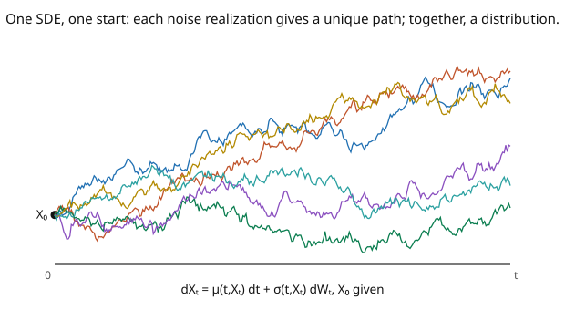

# Stochastic Calculus · Lesson 3.3: Stochastic differential equations

> ⏱ ~15 min · Module 3: Itô's lemma and stochastic differential equations · Builds on: [3.2 Itô processes and the general Itô formula](03-02-ito-processes-general-formula.md) · Unlocks: [3.4 Geometric Brownian motion](03-04-geometric-brownian-motion.md)

## Why this matters

A **stochastic differential equation (SDE)** is how you *write down a model of noisy dynamics*: specify the drift (deterministic tendency) and the diffusion (noise intensity), each possibly depending on the current state, and the SDE is the law of motion. Stock prices, interest rates, population sizes, a particle in a fluid, a noisy control system — all are SDEs. This lesson pins down what an SDE *means* (it's shorthand for an integral equation involving an Itô integral), when it has a solution (Lipschitz drift and diffusion), and how to verify a candidate solution (plug into Itô's lemma). The next two lessons solve the two most important SDEs in existence; this lesson is the grammar that makes them well-posed.

## The idea

An SDE looks like an ODE with a noise term bolted on:

$$dX_t = \mu(t, X_t)\,dt + \sigma(t, X_t)\,dW_t, \qquad X_0 \text{ given}.$$

Read it as: over each instant, $X$ moves by a **drift** $\mu\,dt$ (the deterministic push, as in an ODE) plus a **diffusion** $\sigma\,dW$ (a random kick of size $\sigma$). But "$dW$" isn't a derivative — it has no meaning as $\frac{dW}{dt}\,dt$ ([1.4](01-04-pathological-paths.md)). So the SDE is really **shorthand for an integral equation**:

$$X_t = X_0 + \int_0^t \mu(s, X_s)\,ds + \int_0^t \sigma(s, X_s)\,dW_s,$$

where the last integral is the Itô integral of Module 2. That's what "solving the SDE" means: finding an adapted process $X$ satisfying this identity.

Two questions follow. **Does a solution exist and is it unique?** Yes, under Lipschitz and linear-growth conditions on $\mu, \sigma$ — the stochastic analog of Picard–Lindelöf for ODEs. Without them, solutions can blow up in finite time or fail to be unique. **How do you check a candidate?** Apply Itô's lemma to your guess and see if its $dt$ and $dW$ coefficients match $\mu$ and $\sigma$. Each realization of the noise $W$ produces one path (uniqueness); across realizations you get a whole *distribution* of paths (the picture) — an SDE describes an ensemble.

## The formal version

A **strong solution** of the SDE $dX_t = \mu(t,X_t)\,dt + \sigma(t,X_t)\,dW_t$, $X_0 = x_0$, is an adapted, continuous process $\{X_t\}$ (on the given probability space, driven by the given $W$) satisfying the integral equation

$$X_t = x_0 + \int_0^t \mu(s, X_s)\,ds + \int_0^t \sigma(s, X_s)\,dW_s \quad\text{for all } t, \text{ a.s.}$$

*In words:* $X$ is built from the *same* Brownian motion you were handed, and it obeys the drift-plus-diffusion accounting exactly.

**Existence and uniqueness theorem.** If there is a constant $K$ with, for all $t, x, y$,

$$|\mu(t,x) - \mu(t,y)| + |\sigma(t,x) - \sigma(t,y)| \leq K|x - y| \quad(\textbf{Lipschitz}),$$
$$|\mu(t,x)| + |\sigma(t,x)| \leq K(1 + |x|) \quad(\textbf{linear growth}),$$

then the SDE has a **unique strong solution** with $\mathbb{E}[\sup_{t\leq T}X_t^2] < \infty$. *In words:* if the coefficients don't change too fast (Lipschitz) and don't grow faster than linearly (no explosion), there's exactly one solution — proved by Picard iteration using the Itô isometry to control the stochastic integral. (A **weak solution** asks only for *some* BM and process with the right law, a subtler notion used when strong solutions are hard to construct.)

## Picture

## Worked examples

**Example 1 (when solutions exist — and when they explode).** The SDE $dX = -X\,dt + dW$ (Ornstein–Uhlenbeck, [3.5](03-05-ornstein-uhlenbeck-process.md)) has $\mu(x) = -x$, $\sigma = 1$. Both are globally Lipschitz ($|{-x}-(-y)| = |x-y|$, $K = 1$) with linear growth, so a **unique strong solution exists** for all time. Contrast the deterministic-drift SDE $dX = X^2\,dt$ ($\sigma = 0$): here $\mu(x) = x^2$ is *not* globally Lipschitz (its slope $2x$ is unbounded) and violates linear growth. Solving the ODE $\dot x = x^2$ gives $x(t) = \frac{x_0}{1 - x_0 t}$, which **blows up at $t = 1/x_0$** — a finite-time explosion. The Lipschitz/growth conditions are exactly what rule this out; superlinear drift can send the solution to infinity before time runs out.

**Example 2 (verifying a solution via Itô's lemma).** Claim: $X_t = X_0\,e^{W_t}$ solves the SDE $dX = \tfrac12 X\,dt + X\,dW$. Check by applying Itô to $f(x) = X_0 e^x$ evaluated at $W_t$ (so $f' = f'' = X_0 e^x = X_t$):

$$dX_t = d\big(X_0 e^{W_t}\big) = X_0 e^{W_t}\,dW_t + \tfrac12 X_0 e^{W_t}\,dt = X_t\,dW_t + \tfrac12 X_t\,dt.$$

The $dW$-coefficient is $X_t$ and the $dt$-coefficient is $\tfrac12 X_t$ — exactly $\sigma(X) = X$ and $\mu(X) = \tfrac12 X$. ✓ So $X_0 e^{W_t}$ is (the unique) solution. Notice the drift $\tfrac12 X$ came *for free* from the Itô correction on $e^{W_t}$ — a preview of how geometric Brownian motion's drift and its log-drift differ by $\tfrac12\sigma^2$ ([3.4](03-04-geometric-brownian-motion.md)).

## Watch out

- **You might treat $dW$ as $\dot W\,dt$.** There is no $\dot W$ ([1.4](01-04-pathological-paths.md)); the SDE is *defined* by its integral form with an Itô integral, not by dividing through by $dt$. Never "solve for $\frac{dX}{dt}$."
- **You might skip the coefficient conditions.** An SDE with non-Lipschitz or superlinear coefficients can have *no* solution, a *non-unique* solution, or one that explodes. Before solving, glance at whether $\mu, \sigma$ are Lipschitz with linear growth — many finance/physics models are (or are made so by a change of variables).
- **You might confuse "the solution" with "a path."** The solution $X$ is a whole random process; a single simulated trajectory is one realization. "Solving" gives the law (or a closed form for $X_t$ in terms of $W$), not one curve. The SDE's content is the *distribution* over paths.

## One-liner

> An SDE $dX = \mu\,dt + \sigma\,dW$ is shorthand for an integral equation with an Itô integral; it has a unique strong solution when $\mu, \sigma$ are Lipschitz with linear growth, and you verify a candidate by plugging it into Itô's lemma.

## Problems

**P1 (🟢)** For each SDE, check whether the existence-uniqueness conditions (Lipschitz + linear growth) hold: (a) $dX = 3X\,dt + 2\,dW$; (b) $dX = \sqrt{|X|}\,dt + dW$; (c) $dX = \sin(X)\,dt + \cos(X)\,dW$. One line each.

**P2 (🟡)** Verify that $X_t = W_t + t$ solves $dX = dt + dW$, and that $Y_t = e^{2W_t - 2t}$ solves the SDE $dY = 2Y\,dW$ (a zero-drift geometric SDE — the exponential martingale). Use Itô's lemma for each.

**P3 (🔴, optional)** The SDE $dX = \tfrac13 X^{-1/3}\cdot(\ldots)$ is awkward; instead consider $dX = b\,X^{2/3}\,dW$ ($\sigma(x) = b x^{2/3}$, not Lipschitz at $0$). Show $\sigma$ fails the Lipschitz condition near $x = 0$, and explain why non-uniqueness can arise (multiple solutions can leave $0$). *Hint:* compare the slope of $x^{2/3}$ near $0$ to any linear bound.

Solutions

**P1** (a) $\mu = 3x$, $\sigma = 2$: both linear/constant, globally Lipschitz ($K = 3$) with linear growth — **conditions hold**, unique solution. (b) $\mu = \sqrt{|x|}$: **not Lipschitz** at $x = 0$ (slope $\to\infty$); existence-uniqueness theorem doesn't apply (and indeed such square-root drifts can have non-unique solutions). (c) $\mu = \sin x$, $\sigma = \cos x$: both have derivatives bounded by $1$, so globally Lipschitz ($K = 1$), and bounded (hence linear growth) — **conditions hold**, unique solution.

**P2** For $X_t = W_t + t$: since $f(t,x) = x + t$ has $f'' = 0$ (no Itô correction), $dX = \partial_t f\,dt + \partial_x f\,dW = dt + dW$, matching $dX = dt + dW$. ✓ For $Y_t = e^{2W_t - 2t}$, apply Itô to $f(t,x) = e^{2x - 2t}$ with $X = W$ ($\mu = 0, \sigma = 1$): $\partial_t f = -2f$, $\partial_x f = 2f$, $\partial_{xx}f = 4f$. Drift $= \partial_t f + \tfrac12\partial_{xx}f = -2f + \tfrac12\cdot 4f = -2f + 2f = 0$; diffusion $= \partial_x f = 2f$. So $dY = 0\cdot dt + 2Y\,dW = 2Y\,dW$. ✓ The exponent's time-coefficient $-2 = -\tfrac12\sigma_{\log}^2$ (with $\sigma_{\log} = 2$) is exactly tuned to kill the drift — $Y$ is the exponential martingale.

**P3** $\sigma(x) = b x^{2/3}$ has derivative $\sigma'(x) = \tfrac{2b}{3}x^{-1/3} \to \infty$ as $x \to 0^+$. A Lipschitz bound $|\sigma(x) - \sigma(0)| \leq K|x|$ would require $b x^{2/3} \leq Kx$, i.e. $b \leq K x^{1/3} \to 0$ as $x\to 0$ — impossible for fixed $K$. So $\sigma$ is **not Lipschitz** at $0$. This allows non-uniqueness: both $X \equiv 0$ and a solution that "leaves $0$" can satisfy the SDE from $X_0 = 0$, because the diffusion is too weak near $0$ to force a single behavior (analogous to the ODE $\dot x = x^{2/3}$ having multiple solutions from $0$). The Lipschitz condition is precisely what pins down a unique escape from each point. ∎

## Flashback

**From Lesson 3.2 (Itô processes and the general Itô formula):** For $dX = \mu\,dt + \sigma\,dW$ (constants), compute $d(X_t^2)$ using the Itô formula.

Solution

$f(x) = x^2$: $\partial_x f = 2x$, $\partial_{xx}f = 2$, $\partial_t f = 0$. So $d(X_t^2) = (\mu\cdot 2X_t + \tfrac12\sigma^2\cdot 2)\,dt + \sigma\cdot 2X_t\,dW = (2\mu X_t + \sigma^2)\,dt + 2\sigma X_t\,dW$. The $\sigma^2\,dt$ is the Itô correction. ✓

## Connections

- **Backward:** the integral form uses the Itô integral of Module 2; verifying solutions uses the general Itô formula ([3.2](03-02-ito-processes-general-formula.md)); existence-uniqueness parallels Picard–Lindelöf from [`real-analysis`](../../real-analysis/syllabus.md) / ODE theory.
- **Forward:** [3.4](03-04-geometric-brownian-motion.md) and [3.5](03-05-ornstein-uhlenbeck-process.md) solve the two canonical SDEs in closed form; the generator and Feynman–Kac ([4.4](04-04-infinitesimal-generator.md)–[4.5](04-05-feynman-kac.md)) turn an SDE into a PDE for expectations.
- **Sideways (physics/finance):** the Langevin equation $m\dot v = -\gamma v + \sqrt{2\gamma kT}\,\xi$ is an OU-type SDE ([`stat-mech`](../../stat-mech/syllabus.md)); asset-price and interest-rate models (Black–Scholes, Vasicek, CIR) are all SDEs whose well-posedness rests on this lesson ([`mathematical-finance`](../../mathematical-finance/syllabus.md)).
