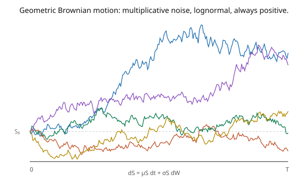

# Stochastic Calculus · Lesson 3.4: Geometric Brownian motion

> ⏱ ~15 min · Module 3: Itô's lemma and stochastic differential equations · Builds on: [3.3 Stochastic differential equations](03-03-stochastic-differential-equations.md) · Unlocks: [3.5 The Ornstein–Uhlenbeck process](03-05-ornstein-uhlenbeck-process.md)

## Why this matters

**Geometric Brownian motion (GBM) is the single most important SDE in finance** — it's the model of a stock price behind Black–Scholes, and the canonical example of *multiplicative* noise. It's the SDE you can actually solve in closed form, and solving it showcases the whole Module 3 toolkit: apply Itô's lemma to $\log S$, watch the correction term produce the famous $-\tfrac12\sigma^2$ **drift adjustment**, and read off a lognormal distribution. That $-\tfrac12\sigma^2$ is "volatility drag" — the reason a volatile asset's *typical* return lags its *average* return — and it's one of the most consequential facts in quantitative finance. GBM is where stochastic calculus stops being abstract and starts pricing options.

## The idea

A stock doesn't move by *absolute* amounts (a 1-dollar move) but by *proportional* ones (a 1% move). So the noise should scale with the price: **multiplicative** noise. That's geometric Brownian motion:

$$dS_t = \mu S_t\,dt + \sigma S_t\,dW_t,$$

drift and diffusion both proportional to $S$ (the picture — paths that stay positive and fan out multiplicatively). Here $\mu$ is the expected growth rate and $\sigma$ the volatility.

To solve it, use the trick that linearizes multiplicative noise: **take logs**. If the returns are multiplicative, the log-price should have additive increments. Apply Itô's lemma to $\log S_t$ — and here's the crucial point: because $\log$ is *concave* ($f'' = -1/x^2 < 0$), the Itô correction is *negative*, and the log-price drifts at rate $\mu - \tfrac12\sigma^2$, not $\mu$. That gap is the whole story:

$$d(\log S_t) = \Big(\mu - \tfrac12\sigma^2\Big)dt + \sigma\,dW_t.$$

Now the right side is an ordinary Itô process with constant coefficients — integrate it directly. Exponentiating back gives $S_t$ explicitly, and since $\log S_t$ is Gaussian, $S_t$ is **lognormal**. The subtlety that trips everyone: the *median* grows like $e^{(\mu - \frac12\sigma^2)t}$ (the log-drift), but the *mean* still grows like $e^{\mu t}$ — the $-\tfrac12\sigma^2$ that dragged down the log-drift reappears and cancels in the mean. Volatility lowers your typical outcome but not your average.

## The formal version

**Geometric Brownian motion** solves $dS_t = \mu S_t\,dt + \sigma S_t\,dW_t$, $S_0 > 0$ (constants $\mu, \sigma$). Apply Itô's lemma to $f(x) = \log x$ ($f' = 1/x$, $f'' = -1/x^2$) with $dS = \mu S\,dt + \sigma S\,dW$, so $(dS)^2 = \sigma^2 S^2\,dt$:

$$d(\log S_t) = \frac{1}{S_t}\,dS_t - \frac{1}{2S_t^2}(dS_t)^2 = \Big(\mu - \tfrac12\sigma^2\Big)dt + \sigma\,dW_t.$$

Integrating (constant coefficients) and exponentiating:

$$\boxed{\;S_t = S_0\,\exp\!\Big(\big(\mu - \tfrac12\sigma^2\big)t + \sigma W_t\Big).\;}$$

*In words:* the solution is the initial price times an exponential of a drifting Brownian motion — always positive, and **lognormal**, since $\log S_t \sim \mathcal{N}\big(\log S_0 + (\mu - \tfrac12\sigma^2)t,\ \sigma^2 t\big)$. Its moments:

$$\mathbb{E}[S_t] = S_0\,e^{\mu t}, \qquad \text{Var}(S_t) = S_0^2\,e^{2\mu t}\big(e^{\sigma^2 t} - 1\big).$$

*In words:* the **mean** grows at the full rate $\mu$ (the $-\tfrac12\sigma^2$ cancels via $\mathbb{E}[e^{\sigma W_t}] = e^{\sigma^2 t/2}$), while the **median** $S_0 e^{(\mu - \frac12\sigma^2)t}$ grows at the reduced rate — the **volatility drag** $\tfrac12\sigma^2$.

## Picture

## Worked examples

**Example 1 (solving via the log-transform).** Start from $dS = \mu S\,dt + \sigma S\,dW$. Applying Itô to $\log S$ term by term: $\frac{1}{S}dS = \mu\,dt + \sigma\,dW$ (the naive chain-rule part), and the correction $-\frac{1}{2S^2}(dS)^2 = -\frac{1}{2S^2}\sigma^2 S^2\,dt = -\tfrac12\sigma^2\,dt$. Sum: $d(\log S) = (\mu - \tfrac12\sigma^2)\,dt + \sigma\,dW$. Since the coefficients are constant, $\log S_t - \log S_0 = (\mu - \tfrac12\sigma^2)t + \sigma W_t$, giving $S_t = S_0 e^{(\mu - \frac12\sigma^2)t + \sigma W_t}$. **Verify** by differentiating back with Itô on $f(t,x) = S_0 e^{(\mu - \frac12\sigma^2)t + \sigma x}$: drift $= \partial_t f + \tfrac12\partial_{xx}f = (\mu - \tfrac12\sigma^2)f + \tfrac12\sigma^2 f = \mu f$, diffusion $= \sigma f$, so $dS = \mu S\,dt + \sigma S\,dW$. ✓

**Example 2 (mean, median, and volatility drag — Boss Problem 3).** Compute $\mathbb{E}[S_t]$: $S_t = S_0 e^{(\mu - \frac12\sigma^2)t}e^{\sigma W_t}$, and $\mathbb{E}[e^{\sigma W_t}] = e^{\sigma^2 t/2}$, so

$$\mathbb{E}[S_t] = S_0 e^{(\mu - \frac12\sigma^2)t}\cdot e^{\frac12\sigma^2 t} = S_0 e^{\mu t}.$$

The $-\tfrac12\sigma^2$ in the exponent is *exactly cancelled* by the $+\tfrac12\sigma^2$ from the MGF — the mean grows at the clean rate $\mu$. But the **median** (where $W_t = 0$, its median) is $S_0 e^{(\mu - \frac12\sigma^2)t} < \mathbb{E}[S_t]$. So a typical path grows slower than the average: with $\mu = 0.10$ and $\sigma = 0.40$, the median return rate is $0.10 - \tfrac12(0.16) = 0.02$, while the mean rate is $0.10$ — the lognormal is right-skewed, its mean pulled up by rare large outcomes. That $\tfrac12\sigma^2 = 0.08$ gap is volatility drag: **the reason to distinguish "expected wealth" from "wealth you'll typically see."** Variance: $\mathbb{E}[S_t^2] = S_0^2 e^{2\mu t + \sigma^2 t}$ (using $\mathbb{E}[e^{2\sigma W_t}] = e^{2\sigma^2 t}$), so $\text{Var}(S_t) = S_0^2 e^{2\mu t}(e^{\sigma^2 t} - 1)$.

## Watch out

- **You might expect $\log S$ to drift at rate $\mu$.** It drifts at $\mu - \tfrac12\sigma^2$ — the Itô correction from $\log$'s concavity. This is *the* signature computation of the subject; forgetting the $-\tfrac12\sigma^2$ gives wrong option prices and wrong long-run growth estimates.
- **You might think volatility drag lowers the mean.** It lowers the *median/typical* growth, not the mean ($\mathbb{E}[S_t] = S_0 e^{\mu t}$ regardless of $\sigma$). The distinction is the whole point: high volatility widens the lognormal and skews it, so the average is dominated by rare large values even as the typical path grows slowly.
- **You might apply GBM where noise is additive.** GBM's noise scales with the level ($\sigma S$), keeping $S > 0$ — right for prices. For quantities that can go negative or that mean-revert (interest rates, velocities), use additive or mean-reverting SDEs (Ornstein–Uhlenbeck, [3.5](03-05-ornstein-uhlenbeck-process.md)), not GBM.

## One-liner

> Geometric Brownian motion $dS = \mu S\,dt + \sigma S\,dW$ solves to $S_t = S_0 e^{(\mu - \frac12\sigma^2)t + \sigma W_t}$ (lognormal), with mean growing at $\mu$ but the typical path dragged to $\mu - \tfrac12\sigma^2$ by volatility.

## Problems

**P1 (🟢)** A stock follows GBM with $S_0 = 100$, $\mu = 0.08$, $\sigma = 0.30$. Write $S_t$ explicitly, and compute $\mathbb{E}[S_1]$ and the median of $S_1$. By how much (in return rate) does volatility drag reduce the typical growth?

**P2 (🟡)** Show that the *discounted* price $\tilde S_t = e^{-\mu t}S_t$ is a martingale when $S$ is GBM with drift $\mu$. *Hint:* apply Itô to $e^{-\mu t}S_t$ and check the drift vanishes. (This is why $\mu$ is the "right" discount rate to make GBM fair — a preview of risk-neutral pricing.)

**P3 (🔴, optional)** For GBM, find the SDE and solution for the *log-return over $[0,t]$*, $R_t = \log(S_t/S_0)$, and compute $\mathbb{P}(S_t > S_0)$ — the probability the stock is up at time $t$ — in terms of the normal CDF $\Phi$. When is this probability *less* than $\tfrac12$ despite $\mu > 0$?

Solutions

**P1** $S_t = 100\,e^{(0.08 - \frac12(0.09))t + 0.30 W_t} = 100\,e^{0.035 t + 0.30 W_t}$. $\mathbb{E}[S_1] = 100 e^{0.08} \approx 108.33$. Median of $S_1$ (set $W_1 = 0$): $100 e^{0.035} \approx 103.56$. Volatility drag reduces the typical (median) growth rate from $\mu = 0.08$ to $\mu - \tfrac12\sigma^2 = 0.035$ — a reduction of $\tfrac12\sigma^2 = 0.045$ (4.5 percentage points).

**P2** Apply Itô to $f(t, S) = e^{-\mu t}S$: $\partial_t f = -\mu e^{-\mu t}S$, $\partial_S f = e^{-\mu t}$, $\partial_{SS}f = 0$. With $dS = \mu S\,dt + \sigma S\,dW$: drift $= \partial_t f + \mu S\,\partial_S f + \tfrac12\sigma^2 S^2\cdot 0 = -\mu e^{-\mu t}S + \mu S e^{-\mu t} = 0$. Diffusion $= \sigma S\,e^{-\mu t} = \sigma\tilde S_t$. So $d\tilde S_t = \sigma\tilde S_t\,dW_t$ — zero drift, a martingale. ✓ Discounting at the growth rate $\mu$ exactly removes the trend, leaving a fair game.

**P3** $R_t = \log(S_t/S_0) = (\mu - \tfrac12\sigma^2)t + \sigma W_t \sim \mathcal{N}\big((\mu - \tfrac12\sigma^2)t,\ \sigma^2 t\big)$, with SDE $dR_t = (\mu - \tfrac12\sigma^2)\,dt + \sigma\,dW_t$. Then $\mathbb{P}(S_t > S_0) = \mathbb{P}(R_t > 0) = \mathbb{P}\big(\mathcal{N}(m, s^2) > 0\big)$ with $m = (\mu - \tfrac12\sigma^2)t$, $s = \sigma\sqrt t$:

$$\mathbb{P}(S_t > S_0) = \Phi\!\left(\frac{m}{s}\right) = \Phi\!\left(\frac{(\mu - \frac12\sigma^2)\sqrt t}{\sigma}\right).$$

This is $< \tfrac12$ exactly when the argument is negative, i.e. when $\mu < \tfrac12\sigma^2$ — a positive-drift stock is *more likely than not to be down* if its volatility is high enough ($\sigma^2 > 2\mu$). Volatility drag can make "up on average" coexist with "usually down" — the median falls below the start. ∎

## Flashback

**From Lesson 3.2 (Itô processes and the general Itô formula):** For $dX = \mu\,dt + \sigma\,dW$ (constants), compute $d(e^{X_t})$ and identify its drift and diffusion.

Solution

$f(x) = e^x$: $\partial_x f = \partial_{xx}f = e^x$. So $d(e^{X_t}) = (\mu e^{X_t} + \tfrac12\sigma^2 e^{X_t})\,dt + \sigma e^{X_t}\,dW = e^{X_t}[(\mu + \tfrac12\sigma^2)\,dt + \sigma\,dW]$. Setting $S = e^X$, this is GBM with growth rate $\mu + \tfrac12\sigma^2$ — the inverse of the log-transform: exponentiating an arithmetic BM *adds* $\tfrac12\sigma^2$, taking logs of GBM *subtracts* it. ✓

## Connections

- **Backward:** the solution is Itô's lemma ([3.1](03-01-itos-lemma-for-bm.md)–[3.2](03-02-ito-processes-general-formula.md)) applied to $\log S$; the mean uses $\mathbb{E}[e^{\sigma W_t}] = e^{\sigma^2 t/2}$ ([1.5](01-05-quadratic-variation-martingale-property.md)); existence-uniqueness holds since $\mu S, \sigma S$ are (locally) Lipschitz ([3.3](03-03-stochastic-differential-equations.md)).
- **Forward:** the discounted-martingale property (P2) is the risk-neutral pricing setup completed by Girsanov ([4.2](04-02-girsanov-theorem.md)) and Feynman–Kac ([4.5](04-05-feynman-kac.md)), yielding the Black–Scholes formula.
- **Sideways (finance):** GBM *is* the Black–Scholes stock model ([`mathematical-finance`](../../mathematical-finance/syllabus.md)); volatility drag explains why leveraged ETFs decay and why long-run growth uses the geometric (median) mean, not the arithmetic mean.

*Module 3 capstone (Boss Problem 3): applying Itô to $\log S$ to solve GBM and computing $\mathbb{E}[S_t] = S_0 e^{\mu t}$ and $\text{Var}(S_t)$ — Examples 1–2 above are exactly this, showing where the $-\tfrac12\sigma^2$ hides and why the mean is unaffected.*
