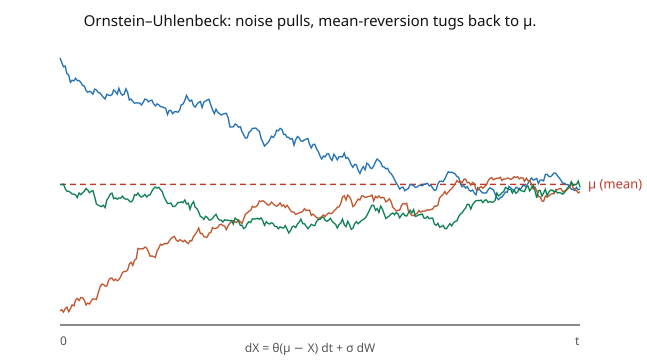

# Stochastic Calculus · Lesson 3.5: The Ornstein–Uhlenbeck process

> ⏱ ~15 min · Module 3: Itô's lemma and stochastic differential equations · Builds on: [3.4 Geometric Brownian motion](03-04-geometric-brownian-motion.md) · Unlocks: [3.6 The product rule and integration by parts](03-06-product-rule-integration-by-parts.md)

## Why this matters

Geometric Brownian motion runs away to infinity; many real quantities don't — they **mean-revert**. Interest rates, volatility, temperature, the velocity of a Brownian particle, a spring under thermal noise, the spread between two correlated assets: all fluctuate around an equilibrium and get pulled back when they stray. The **Ornstein–Uhlenbeck (OU) process** is the canonical mean-reverting SDE, and the second SDE (after GBM) that solves in closed form. Solving it introduces the **integrating factor** — the stochastic version of a standard ODE technique — and produces a process with a genuine *stationary distribution*, unlike Brownian motion. OU is the bridge to physics (it's the Langevin equation for velocity) and to fixed-income models (Vasicek interest rates).

## The idea

Add a restoring force to Brownian motion. Instead of drifting freely, let the drift **pull the process back toward a mean $\mu$**, with a strength proportional to how far it has strayed:

$$dX_t = \theta(\mu - X_t)\,dt + \sigma\,dW_t.$$

When $X > \mu$ the drift $\theta(\mu - X)$ is negative (pull down); when $X < \mu$ it's positive (pull up). The parameter $\theta > 0$ is the **reversion speed**, $\mu$ the **long-run mean**, $\sigma$ the noise intensity. The result is a process that jitters around $\mu$, tethered by the drift (the picture) — it never wanders off the way BM or GBM does.

To solve it, use the **integrating factor** $e^{\theta t}$, exactly as for the linear ODE $\dot x = \theta(\mu - x)$. Multiply through by $e^{\theta t}$ so the left side becomes a perfect differential $d(e^{\theta t}X_t)$; the drift-pull term is absorbed, leaving something you can integrate directly. Because the noise enters *additively* (just $\sigma\,dW$, not $\sigma X\,dW$), there's **no Itô correction** in this step — the transform $e^{\theta t}X$ is linear in $X$, so $f'' = 0$. Integrate, divide back by $e^{\theta t}$, and you get $X_t$ explicitly.

The payoff is a **stationary distribution**: as $t \to \infty$, the pull and the noise balance, and $X_t$ settles into a fixed Gaussian law $\mathcal{N}(\mu, \sigma^2/2\theta)$ — mean $\mu$, and a variance set by the tug-of-war between noise ($\sigma^2$) and reversion ($\theta$). Strong reversion (large $\theta$) or weak noise (small $\sigma$) keeps it tightly around $\mu$.

## The formal version

The **Ornstein–Uhlenbeck process** solves $dX_t = \theta(\mu - X_t)\,dt + \sigma\,dW_t$ ($\theta > 0$). Apply the integrating factor $e^{\theta t}$: since $d(e^{\theta t}X_t) = \theta e^{\theta t}X_t\,dt + e^{\theta t}\,dX_t$ (no correction, $f = e^{\theta t}x$ has $f_{xx} = 0$),

$$d\big(e^{\theta t}X_t\big) = e^{\theta t}\big[\theta X_t + \theta(\mu - X_t)\big]dt + e^{\theta t}\sigma\,dW_t = \theta\mu\,e^{\theta t}\,dt + \sigma e^{\theta t}\,dW_t.$$

Integrate from $0$ to $t$ and divide by $e^{\theta t}$:

$$\boxed{\;X_t = \mu + (X_0 - \mu)e^{-\theta t} + \sigma\int_0^t e^{-\theta(t-s)}\,dW_s.\;}$$

*In words:* the mean-reverting drift is a deterministic decay of the initial deviation toward $\mu$, plus a noise term that is an exponentially-weighted (recent-heavy) integral of the Brownian increments. Since the stochastic integral has a **deterministic** integrand, $X_t$ is **Gaussian**, with

$$\mathbb{E}[X_t] = \mu + (X_0 - \mu)e^{-\theta t}, \qquad \text{Var}(X_t) = \frac{\sigma^2}{2\theta}\big(1 - e^{-2\theta t}\big).$$

*In words:* the mean decays exponentially to $\mu$ (reversion), and the variance rises to the **stationary value** $\sigma^2/2\theta$. The **stationary distribution** is $\mathcal{N}\big(\mu,\ \sigma^2/2\theta\big)$, with stationary autocovariance $\text{Cov}(X_t, X_{t+h}) = \frac{\sigma^2}{2\theta}e^{-\theta|h|}$ — correlations decay exponentially with lag.

## Picture

## Worked examples

**Example 1 (solving via the integrating factor).** From $dX = \theta(\mu - X)\,dt + \sigma\,dW$, multiply by $e^{\theta t}$. The key cancellation: $d(e^{\theta t}X) = \theta e^{\theta t}X\,dt + e^{\theta t}dX = \theta e^{\theta t}X\,dt + e^{\theta t}[\theta\mu\,dt - \theta X\,dt + \sigma\,dW]$; the $\pm\theta e^{\theta t}X\,dt$ terms cancel, leaving $d(e^{\theta t}X) = \theta\mu e^{\theta t}\,dt + \sigma e^{\theta t}\,dW$. Integrate: $e^{\theta t}X_t - X_0 = \mu(e^{\theta t} - 1) + \sigma\int_0^t e^{\theta s}\,dW_s$. Divide by $e^{\theta t}$: $X_t = \mu + (X_0 - \mu)e^{-\theta t} + \sigma\int_0^t e^{-\theta(t-s)}\,dW_s$. The integrating factor turned a mean-reverting SDE into a direct integration — no Itô correction needed because the noise was additive.

**Example 2 (variance and the stationary law).** Compute the variance from the solution. Only the stochastic integral is random, and by the Itô isometry ([2.3](02-03-ito-isometry-general-integral.md)) with deterministic integrand $\sigma e^{-\theta(t-s)}$:

$$\text{Var}(X_t) = \sigma^2\int_0^t e^{-2\theta(t-s)}\,ds = \sigma^2\int_0^t e^{-2\theta u}\,du = \frac{\sigma^2}{2\theta}\big(1 - e^{-2\theta t}\big) \xrightarrow[t\to\infty]{} \frac{\sigma^2}{2\theta}.$$

So the stationary distribution is $\mathcal{N}(\mu, \sigma^2/2\theta)$. Concretely, with $\theta = 3$, $\mu = 1$, $\sigma = 0.6$: the process reverts with **half-life** $\ln 2/\theta = 0.231$ (time to close half the gap to $\mu$), and settles to $\mathcal{N}(1,\ 0.36/6) = \mathcal{N}(1, 0.06)$ — a tight cloud (standard deviation $\approx 0.245$) around $1$. Faster reversion ($\theta\uparrow$) shrinks the stationary variance; louder noise ($\sigma\uparrow$) widens it — the balance $\sigma^2/2\theta$ is the fluctuation–dissipation ratio.

## Watch out

- **You might insert an Itô correction into the integrating-factor step.** There is none: the noise is *additive* ($\sigma\,dW$, not $\sigma X\,dW$), so $e^{\theta t}X$ is linear in $X$ and its second $x$-derivative is zero. (GBM, with *multiplicative* noise, *did* need the correction — that's the key difference between the two solving methods.)
- **You might think OU has no stationary law like BM.** Brownian motion's variance $t \to \infty$ (no stationary distribution); OU's variance saturates at $\sigma^2/2\theta$ because the reversion drags it back. Mean reversion is exactly what creates a stationary state — the process forgets its start and settles.
- **You might read $\theta$ as the mean.** $\theta$ is the *reversion speed* (rate), $\mu$ is the mean. Large $\theta$ means fast return to $\mu$ (short memory, small stationary variance); small $\theta$ means slow, sluggish reversion (long memory). Don't swap their roles.

## One-liner

> The Ornstein–Uhlenbeck process $dX = \theta(\mu - X)\,dt + \sigma\,dW$ mean-reverts to $\mu$; solved by an integrating factor (no Itô correction — additive noise), it's Gaussian with stationary law $\mathcal{N}(\mu, \sigma^2/2\theta)$.

## Problems

**P1 (🟢)** An OU process has $\theta = 2$, $\mu = 5$, $\sigma = 1$, $X_0 = 8$. Write $\mathbb{E}[X_t]$ and $\text{Var}(X_t)$, and give the stationary distribution. What is $\mathbb{E}[X_t]$ at $t = \ln 2 / 2$ (one half-life)?

**P2 (🟡)** Show directly that $\mathcal{N}(\mu, \sigma^2/2\theta)$ is *stationary*: if $X_0 \sim \mathcal{N}(\mu, \sigma^2/2\theta)$ (independent of the future noise), then $X_t$ has the *same* distribution for all $t$. *Hint:* compute $\mathbb{E}[X_t]$ and $\text{Var}(X_t)$ using $\mathbb{E}[X_0] = \mu$, $\text{Var}(X_0) = \sigma^2/2\theta$, and independence of $X_0$ from the stochastic integral.

**P3 (🔴, optional)** The velocity of a Brownian particle obeys the **Langevin equation** $m\,dV = -\gamma V\,dt + \sqrt{2\gamma k_B T}\,dW$. Identify this as an OU process (find $\theta, \mu, \sigma$), and show its stationary distribution is $\mathcal{N}(0, k_B T/m)$ — the Maxwell–Boltzmann law $\tfrac12 m\langle V^2\rangle = \tfrac12 k_B T$. *(This is the fluctuation–dissipation theorem.)*

Solutions

**P1** $\mathbb{E}[X_t] = 5 + (8 - 5)e^{-2t} = 5 + 3e^{-2t}$; $\text{Var}(X_t) = \frac{1}{4}(1 - e^{-4t})$; stationary distribution $\mathcal{N}(5, \frac{\sigma^2}{2\theta}) = \mathcal{N}(5, \tfrac14)$. At one half-life $t = \ln 2/2$: $e^{-2t} = e^{-\ln 2} = \tfrac12$, so $\mathbb{E}[X_t] = 5 + 3\cdot\tfrac12 = 6.5$ — halfway from $X_0 = 8$ to $\mu = 5$, as "half-life" promises.

**P2** With $X_0 \sim \mathcal{N}(\mu, \sigma^2/2\theta)$ independent of the noise: $\mathbb{E}[X_t] = \mu + (\mathbb{E}[X_0] - \mu)e^{-\theta t} = \mu + 0 = \mu$ (the deviation has mean $0$). For the variance, $X_t = \mu + (X_0 - \mu)e^{-\theta t} + \sigma\int_0^t e^{-\theta(t-s)}dW_s$, and the two random pieces are independent, so $\text{Var}(X_t) = e^{-2\theta t}\text{Var}(X_0) + \frac{\sigma^2}{2\theta}(1 - e^{-2\theta t}) = e^{-2\theta t}\frac{\sigma^2}{2\theta} + \frac{\sigma^2}{2\theta}(1 - e^{-2\theta t}) = \frac{\sigma^2}{2\theta}$. Both mean and variance are constant in $t$, and (Gaussian) $X_t \sim \mathcal{N}(\mu, \sigma^2/2\theta)$ for all $t$ — stationary. ✓

**P3** Divide by $m$: $dV = -\frac{\gamma}{m}V\,dt + \frac{\sqrt{2\gamma k_B T}}{m}\,dW$. This is OU with reversion speed $\theta = \gamma/m$, mean $\mu = 0$, and noise $\sigma = \sqrt{2\gamma k_B T}/m$. Stationary variance: $\frac{\sigma^2}{2\theta} = \frac{2\gamma k_B T/m^2}{2\gamma/m} = \frac{k_B T}{m}$. So $V_\infty \sim \mathcal{N}(0, k_B T/m)$, giving $\mathbb{E}[V^2] = k_B T/m$, i.e. $\tfrac12 m\mathbb{E}[V^2] = \tfrac12 k_B T$ — equipartition / Maxwell–Boltzmann. The stationary variance being $\sigma^2/2\theta = k_B T/m$ is the fluctuation–dissipation theorem: the noise amplitude $\sqrt{2\gamma k_B T}$ and the friction $\gamma$ are locked together so that thermal equilibrium comes out right. ∎

## Flashback

**From Lesson 3.4 (Geometric Brownian motion):** A stock follows GBM with $S_0 = 50$, $\mu = 0.06$, $\sigma = 0.20$. Compute $\mathbb{E}[S_2]$ and the median of $S_2$.

Solution

$S_t = 50\,e^{(0.06 - \frac12(0.04))t + 0.20 W_t} = 50\,e^{0.04t + 0.20 W_t}$. Mean: $\mathbb{E}[S_2] = 50\,e^{\mu\cdot 2} = 50\,e^{0.12} \approx 56.37$. Median (set $W_2 = 0$): $50\,e^{0.04\cdot 2} = 50\,e^{0.08} \approx 54.16$. The median trails the mean by the volatility drag $\tfrac12\sigma^2 = 0.02$ per unit time. ✓

## Connections

- **Backward:** the integrating factor is the stochastic version of the linear-ODE method; the variance uses the Itô isometry ([2.3](02-03-ito-isometry-general-integral.md)); the additive-noise structure (no correction) contrasts with GBM's multiplicative noise ([3.4](03-04-geometric-brownian-motion.md)).
- **Forward:** the stationary distribution is the equilibrium of the Fokker–Planck equation ([4.6](04-06-fokker-planck-kolmogorov.md)); OU's generator and mean-reversion feed the Feynman–Kac and generator machinery ([4.4](04-04-infinitesimal-generator.md)–[4.5](04-05-feynman-kac.md)).
- **Sideways (physics/finance):** OU *is* the Langevin velocity equation ([`stat-mech`](../../stat-mech/syllabus.md)) and the Vasicek interest-rate model; mean-reverting spreads are the basis of pairs-trading strategies ([`mathematical-finance`](../../mathematical-finance/syllabus.md)).
