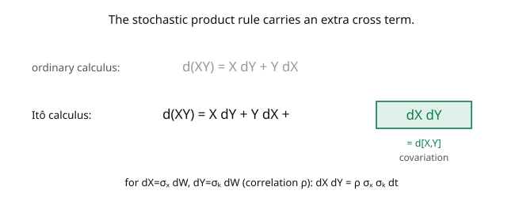

# Stochastic Calculus · Lesson 3.6: The product rule and integration by parts

> ⏱ ~15 min · Module 3: Itô's lemma and stochastic differential equations · Builds on: [3.5 The Ornstein–Uhlenbeck process](03-05-ornstein-uhlenbeck-process.md) · Unlocks: [4.1 Radon–Nikodym derivatives and equivalent measures](04-01-radon-nikodym-equivalent-measures.md)

## Why this matters

To differentiate a *product* of two random processes — a discounted price (bond × stock), a portfolio (holdings × values), a hedged position — you need the **stochastic product rule**, and like Itô's lemma it carries an extra term the ordinary product rule lacks: the **quadratic covariation** $dX\,dY$. This cross term is what couples two noise sources, and getting it right is essential for multi-asset models, discounting, and the change-of-numéraire tricks that make pricing tractable. The flip side, **stochastic integration by parts**, is a workhorse for evaluating integrals like $\int t\,dW$ and for the manipulations behind Girsanov and Feynman–Kac in Module 4. This lesson closes Module 3 by completing the differential toolkit.

## The idea

In ordinary calculus, $d(XY) = X\,dY + Y\,dX$ — two terms. For Itô processes there's a third (the picture):

$$d(X_t Y_t) = X_t\,dY_t + Y_t\,dX_t + dX_t\,dY_t.$$

The extra $dX\,dY$ is the **quadratic covariation** — the same second-order product that survives in Itô's lemma. Why does it appear? Expand $(X + \Delta X)(Y + \Delta Y) - XY = X\Delta Y + Y\Delta X + \Delta X\,\Delta Y$. In ordinary calculus both increments are of size $\Delta t$, so $\Delta X\,\Delta Y \sim (\Delta t)^2$ is negligible. But for diffusions both increments are of size $\sqrt{\Delta t}$, so their product $\Delta X\,\Delta Y \sim \Delta t$ **survives** ([2.5](02-05-quadratic-variation-dwdw-rules.md)). If $X$ and $Y$ are driven by the same Brownian motion (or correlated ones), the cross term is nonzero.

Compute the cross term with the multiplication table: for $dX = \mu_X\,dt + \sigma_X\,dW$ and $dY = \mu_Y\,dt + \sigma_Y\,dW$ (same $W$), $dX\,dY = \sigma_X\sigma_Y\,dt$ (only the $(dW)^2 = dt$ term survives). For *independent* Brownian drivers the cross term vanishes; for correlation $\rho$ it's $\rho\sigma_X\sigma_Y\,dt$.

Rearranging the product rule gives **integration by parts**: $\int X\,dY = XY\big|_0^T - \int Y\,dX - [X,Y]_T$. The extra covariation term $[X,Y]_T$ is the only difference from the classical formula, and it's exactly what makes stochastic IBP a computational tool — sometimes the covariation term is easy while the original integral is hard.

## The formal version

**Stochastic product rule.** For Itô processes $X, Y$,

$$d(X_t Y_t) = X_t\,dY_t + Y_t\,dX_t + d[X, Y]_t,$$

where the **quadratic covariation** $[X,Y]$ satisfies $d[X,Y]_t = dX_t\,dY_t$, computed by the multiplication table. If $dX = \mu_X\,dt + \sigma_X\,dW$ and $dY = \mu_Y\,dt + \sigma_Y\,dW'$ with $dW\,dW' = \rho\,dt$:

$$d[X,Y]_t = \sigma_X\sigma_Y\,\rho\,dt \qquad(\rho = 1 \text{ for the same } W,\ \rho = 0 \text{ if independent}).$$

*In words:* the covariation accumulates the product of the two diffusion coefficients times their correlation — the drifts contribute nothing.

**Integration by parts.** Integrating the product rule from $0$ to $T$:

$$\int_0^T X_t\,dY_t = X_T Y_T - X_0 Y_0 - \int_0^T Y_t\,dX_t - [X, Y]_T.$$

*In words:* the classical IBP formula plus the covariation correction $[X,Y]_T$. (When one of the processes has finite variation — e.g. $Y_t = t$ — the covariation term vanishes and it reduces to the ordinary formula.)

## Picture

## Worked examples

**Example 1 (integration by parts computes $\int_0^t s\,dW_s$).** Let $X_t = t$ (finite variation, $dX = dt$) and $Y_t = W_t$ ($dY = dW$). The cross term $dX\,dY = dt\,dW = 0$, so the product rule is just $d(tW_t) = W_t\,dt + t\,dW_t$. Integrate:

$$tW_t = \int_0^t W_s\,ds + \int_0^t s\,dW_s \;\Longrightarrow\; \int_0^t s\,dW_s = tW_t - \int_0^t W_s\,ds.$$

So the stochastic integral $\int_0^t s\,dW_s$ equals $tW_t$ minus an *ordinary* (pathwise) integral $\int_0^t W_s\,ds$ — a useful reduction (e.g. it makes clear the integral is Gaussian with mean $0$, and its variance is $\int_0^t s^2\,ds = t^3/3$ by the isometry, [2.3](02-03-ito-isometry-general-integral.md)). Here the covariation vanished because $t$ has finite variation; IBP against a *smooth* function is classical.

**Example 2 (the cross term matters — reproducing Itô on $W^2$).** Take $X = Y = W$, both driven by the same $W$ with $\sigma_X = \sigma_Y = 1$. The product rule:

$$d(W_t\cdot W_t) = W_t\,dW_t + W_t\,dW_t + dW_t\,dW_t = 2W_t\,dW_t + dt,$$

since $dW\,dW = dt$. This is exactly Itô's lemma for $f(x) = x^2$ ([3.1](03-01-itos-lemma-for-bm.md)) — the product rule's cross term $dW\,dW = dt$ *is* the $\tfrac12 f''\,(dW)^2$ correction. Drop it (as ordinary calculus would) and you'd wrongly get $d(W^2) = 2W\,dW$, missing the $dt$. The covariation term is not optional bookkeeping; it's the entire difference between right and wrong.

## Watch out

- **You might forget the $dX\,dY$ term when both are diffusions.** If $X$ and $Y$ each have a $dW$ part (correlated or the same $W$), the cross term is nonzero and *must* be included. Omitting it is the product-rule version of forgetting Itô's correction.
- **You might include a cross term when one factor is deterministic/finite-variation.** If $Y_t = t$ or any smooth function, $[X, Y] = 0$ (finite-variation processes have zero covariation with anything), and stochastic IBP reduces to the classical formula. Check whether a covariation actually exists before adding a term.
- **You might use the wrong sign or drop the $\rho$ for correlated noises.** With two distinct Brownian drivers of correlation $\rho$, $dX\,dY = \rho\sigma_X\sigma_Y\,dt$. Independent drivers give $\rho = 0$ (no cross term); perfectly correlated (same $W$) give $\rho = 1$. Multi-factor models hinge on the right $\rho$.

## One-liner

> The stochastic product rule is $d(XY) = X\,dY + Y\,dX + dX\,dY$, with the covariation cross term $dX\,dY = \rho\sigma_X\sigma_Y\,dt$ — nonzero whenever both factors carry correlated noise — and rearranging gives integration by parts with that same extra term.

## Problems

**P1 (🟢)** Use the product rule to compute $d(W_t^1 W_t^2)$ for two **independent** Brownian motions $W^1, W^2$. Then repeat for two Brownian motions with correlation $\rho$ ($dW^1\,dW^2 = \rho\,dt$). What's the difference?

**P2 (🟡)** Use integration by parts to evaluate $\int_0^T e^{-t}\,dW_t$ in terms of $e^{-T}W_T$ and an ordinary integral. *Hint:* let $X_t = e^{-t}$ (finite variation), $Y_t = W_t$; the cross term vanishes.

**P3 (🔴, optional)** For two Itô processes $dX = \sigma_X\,dW$, $dY = \sigma_Y\,dW$ (same $W$, so perfectly correlated), verify the product rule reproduces Itô's lemma applied to $f(x,y) = xy$ — i.e. show the two-dimensional Itô formula's cross term $\partial_{xy}f\,dX\,dY = dX\,dY$ matches the product rule's covariation. What is $d[X,Y]_t$ here?

Solutions

**P1** Independent: $dW^1\,dW^2 = 0$, so $d(W^1 W^2) = W^1\,dW^2 + W^2\,dW^1$ — no cross term; the product $W^1_t W^2_t$ is a martingale (both terms are stochastic integrals). Correlated ($dW^1\,dW^2 = \rho\,dt$): $d(W^1 W^2) = W^1\,dW^2 + W^2\,dW^1 + \rho\,dt$ — the extra $\rho\,dt$ drift means $W^1_t W^2_t - \rho t$ is the martingale. The difference is precisely the covariation $\rho\,dt$: correlated noises accumulate a deterministic product drift, independent ones don't.

**P2** With $X_t = e^{-t}$ ($dX = -e^{-t}\,dt$, finite variation) and $Y_t = W_t$, the cross term $dX\,dY = 0$. Product rule: $d(e^{-t}W_t) = e^{-t}\,dW_t + W_t(-e^{-t})\,dt$. Integrate: $e^{-T}W_T = \int_0^T e^{-t}\,dW_t - \int_0^T e^{-t}W_t\,dt$, so

$$\int_0^T e^{-t}\,dW_t = e^{-T}W_T + \int_0^T e^{-t}W_t\,dt.$$

(This is the noise term of an OU process, [3.5](03-05-ornstein-uhlenbeck-process.md), written via IBP.)

**P3** The 2D Itô formula for $f(x,y) = xy$: $d f = \partial_x f\,dX + \partial_y f\,dY + \tfrac12\partial_{xx}f\,(dX)^2 + \partial_{xy}f\,dX\,dY + \tfrac12\partial_{yy}f\,(dY)^2$. Here $\partial_x f = y$, $\partial_y f = x$, $\partial_{xx}f = \partial_{yy}f = 0$, $\partial_{xy}f = 1$. So $d(XY) = Y\,dX + X\,dY + dX\,dY$ — exactly the product rule. The covariation: $d[X,Y]_t = dX\,dY = \sigma_X\sigma_Y\,(dW)^2 = \sigma_X\sigma_Y\,dt$. ∎

## Flashback

**From Lesson 3.5 (The Ornstein–Uhlenbeck process):** An OU process has $\theta = 1$, $\mu = 0$, $\sigma = \sqrt{2}$. Give its stationary distribution.

Solution

The stationary distribution is $\mathcal{N}(\mu, \sigma^2/2\theta) = \mathcal{N}\big(0, \frac{2}{2\cdot 1}\big) = \mathcal{N}(0, 1)$ — the standard normal. (With $\theta = 1$ and $\sigma^2 = 2$, the noise and reversion balance to give unit stationary variance; this is the standard OU normalization.) ✓

## Connections

- **Backward:** the cross term $dX\,dY$ is the covariation of [2.5](02-05-quadratic-variation-dwdw-rules.md); Example 2 reproduces Itô's lemma for $x^2$ ([3.1](03-01-itos-lemma-for-bm.md)); IBP against $t$ uses that $t$ has zero quadratic variation.
- **Forward:** the product rule is essential for discounting (bond × asset) and change-of-numéraire in Girsanov ([4.2](04-02-girsanov-theorem.md)); it generalizes to the multidimensional Itô formula used throughout Module 4.
- **Sideways (finance):** a self-financing portfolio's value uses $d(\text{holdings}\times\text{price})$, and the covariation term is where hedging correlations enter; multi-asset option pricing ([`mathematical-finance`](../../mathematical-finance/syllabus.md)) lives on getting the $\rho\sigma_X\sigma_Y\,dt$ terms right.
