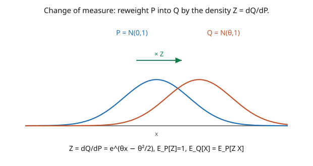

# Stochastic Calculus · Lesson 4.1: Radon–Nikodym derivatives and equivalent measures

> ⏱ ~15 min · Module 4: Change of measure and the PDE bridge · Builds on: [3.6 The product rule and integration by parts](03-06-product-rule-integration-by-parts.md), [`probability-theory`](../../probability-theory/syllabus.md) (Radon–Nikodym, conditional expectation) · Unlocks: [4.2 Girsanov's theorem](04-02-girsanov-theorem.md)

## Why this matters

One of the most powerful ideas in stochastic calculus is that you can **change the probabilities** — reweight how likely each path is — to make a hard problem easy. Under the real-world measure a stock drifts up; switch to a cleverly reweighted measure and the drift *disappears*, turning the discounted price into a martingale where pricing is trivial. That reweighting is a **Radon–Nikodym derivative** $Z = dQ/dP$, and this lesson sets it up: what it means for two measures to be **equivalent**, how $Z$ converts expectations between them, and — crucially — that changing a Gaussian's *mean* is exactly the reweighting Girsanov will use to change a drift. It's the algebraic engine behind risk-neutral pricing.

## The idea

Two probability measures $P$ and $Q$ on the same space are **equivalent** ($Q \sim P$) if they agree on what's *possible*: the same events have probability zero under both. They may disagree wildly on *how likely* things are, but neither declares impossible what the other allows. Equivalence is what lets you translate between them without losing any paths.

When $Q \sim P$, there's a single function $Z$ — the **Radon–Nikodym derivative** $dQ/dP$ — that records the reweighting: to get a $Q$-probability, integrate $Z$ against $P$ over the event (the picture). It's a likelihood ratio, path by path: $Z(\omega)$ says "how much more (or less) likely is outcome $\omega$ under $Q$ than under $P$." It's nonnegative and averages to $1$ under $P$ (probabilities must still total $1$).

The one formula you use constantly: **expectations transfer by multiplying by $Z$**,

$$\mathbb{E}_Q[X] = \mathbb{E}_P[Z\,X].$$

To compute an average under the new measure, average $Z\cdot X$ under the old one. And the archetype — the reason this matters for us — is shifting a Gaussian's mean: reweighting $\mathcal{N}(0, 1)$ into $\mathcal{N}(\theta, 1)$ has $Z = e^{\theta x - \theta^2/2}$, the **exponential martingale** from [1.5](01-05-quadratic-variation-martingale-property.md). Adding a mean (a drift) *is* an exponential reweighting. Girsanov ([4.2](04-02-girsanov-theorem.md)) is this fact, promoted from one Gaussian to a whole Brownian path.

## The formal version

Let $P, Q$ be probability measures on $(\Omega, \mathcal{F})$. $Q$ is **absolutely continuous** w.r.t. $P$ ($Q \ll P$) if $P(A) = 0 \Rightarrow Q(A) = 0$; they are **equivalent** ($Q \sim P$) if $Q \ll P$ and $P \ll Q$ (same null sets).

**Radon–Nikodym theorem** ([`probability-theory`](../../probability-theory/syllabus.md)). If $Q \ll P$, there is a nonnegative $\mathcal{F}$-measurable $Z = \dfrac{dQ}{dP}$ with

$$Q(A) = \int_A Z\,dP = \mathbb{E}_P[Z\,\mathbf{1}_A] \quad \text{for all } A \in \mathcal{F}, \qquad \mathbb{E}_P[Z] = 1.$$

*In words:* $Z$ is the density of $Q$ relative to $P$; averaging it over an event gives that event's $Q$-probability, and it integrates to $1$. **Change of expectation:** for any $Q$-integrable $X$,

$$\mathbb{E}_Q[X] = \mathbb{E}_P[Z\,X], \qquad \text{and if } Z > 0,\quad \mathbb{E}_P[X] = \mathbb{E}_Q\big[Z^{-1}X\big].$$

**Density process.** For a filtration $\{\mathcal{F}_t\}$, define $Z_t = \mathbb{E}_P[Z \mid \mathcal{F}_t]$ — the **density process**, a $P$-martingale with $Z_0 = 1$. Then for $\mathcal{F}_t$-measurable $X$, $\mathbb{E}_Q[X] = \mathbb{E}_P[Z_t X]$, and conditional expectations transfer by the **Bayes rule for conditional expectation**: $\mathbb{E}_Q[X\mid\mathcal{F}_s] = \dfrac{\mathbb{E}_P[Z_t X\mid\mathcal{F}_s]}{Z_s}$. *In words:* the reweighting is itself a martingale unfolding in time — the object Girsanov builds from a drift.

## Picture

## Worked examples

**Example 1 (the density between two normals is the exponential martingale).** Let $P$ make $X \sim \mathcal{N}(0, 1)$ and $Q$ make $X \sim \mathcal{N}(\theta, 1)$. Both have the same null sets (a Gaussian density is positive everywhere), so $Q \sim P$. The density is the ratio of the two normal densities:

$$Z = \frac{dQ}{dP} = \frac{\varphi(x - \theta)}{\varphi(x)} = \frac{e^{-(x-\theta)^2/2}}{e^{-x^2/2}} = e^{\theta x - \theta^2/2}.$$

Check $\mathbb{E}_P[Z] = \mathbb{E}_P[e^{\theta X - \theta^2/2}] = e^{-\theta^2/2}\cdot e^{\theta^2/2} = 1$ ✓ (Gaussian MGF). This $Z = e^{\theta X - \theta^2/2}$ is *exactly* the exponential martingale — shifting a standard normal's mean by $\theta$ is the same as reweighting by $e^{\theta X - \theta^2/2}$. Hold this: on a Brownian path, "shift the mean of every increment" will become "add a drift," and the density will be the exponential *martingale process*.

**Example 2 (the mean shifts under the new measure).** Verify that $X$, which was mean-zero under $P$, has mean $\theta$ under $Q$. Use the change-of-expectation formula:

$$\mathbb{E}_Q[X] = \mathbb{E}_P[Z\,X] = \mathbb{E}_P\big[X\,e^{\theta X - \theta^2/2}\big] = e^{-\theta^2/2}\,\mathbb{E}_P\big[X e^{\theta X}\big].$$

Now $\mathbb{E}_P[X e^{\theta X}] = \frac{d}{d\theta}\mathbb{E}_P[e^{\theta X}] = \frac{d}{d\theta}e^{\theta^2/2} = \theta e^{\theta^2/2}$. So $\mathbb{E}_Q[X] = e^{-\theta^2/2}\cdot\theta e^{\theta^2/2} = \theta$. The reweighting moved the mean from $0$ to $\theta$ — **without changing the variance** (one checks $\text{Var}_Q(X) = 1$ still). Changing the measure changed the drift and nothing else. This single fact, extended to paths, is Girsanov's theorem.

## Watch out

- **You might confuse absolute continuity with equivalence.** $Q \ll P$ (one-directional) allows $Q$ to declare some $P$-possible events impossible; **equivalence** ($Q \sim P$) requires the *same* null sets both ways. Girsanov needs equivalence (so you can go back and forth) — it comes from $Z > 0$ a.s.
- **You might change the variance when you meant to change the mean.** The Gaussian reweighting $e^{\theta x - \theta^2/2}$ shifts only the *mean*; it cannot change the variance. On Brownian paths this is why Girsanov changes **drift** but leaves **volatility** ($\sigma$, the quadratic variation) untouched — volatility is measure-invariant.
- **You might forget $Z$ must average to $1$ and be nonnegative.** A valid density has $\mathbb{E}_P[Z] = 1$ and $Z \geq 0$. If your candidate density doesn't integrate to $1$, it doesn't define a probability measure — a check that catches errors (and, for Girsanov, is guaranteed by Novikov's condition, [4.2](04-02-girsanov-theorem.md)).

## One-liner

> Equivalent measures share null sets and are related by a density $Z = dQ/dP$ that transfers expectations via $\mathbb{E}_Q[X] = \mathbb{E}_P[ZX]$ — and reweighting a Gaussian's mean by $\theta$ uses exactly $Z = e^{\theta X - \theta^2/2}$, the seed of Girsanov.

## Problems

**P1 (🟢)** Under $P$, $X \sim \mathcal{N}(0, 1)$. Define $Q$ by $\frac{dQ}{dP} = Z = e^{2X - 2}$. Identify the distribution of $X$ under $Q$ (mean and variance), and verify $\mathbb{E}_P[Z] = 1$.

**P2 (🟡)** Under $P$, $X \sim \mathcal{N}(0,1)$ and $Q$ shifts the mean to $\theta$ via $Z = e^{\theta X - \theta^2/2}$. Compute $\mathbb{E}_Q[X^2]$ using $\mathbb{E}_Q[\cdot] = \mathbb{E}_P[Z\,\cdot]$, and confirm it equals $1 + \theta^2$ (consistent with $X \sim \mathcal{N}(\theta,1)$ under $Q$).

**P3 (🔴, optional)** Let $Z_t = e^{\theta W_t - \frac12\theta^2 t}$ be the density process (a $P$-martingale, [1.5](01-05-quadratic-variation-martingale-property.md)) defining a measure $Q$ on $\mathcal{F}_T$ via $\frac{dQ}{dP} = Z_T$. Using the Bayes rule $\mathbb{E}_Q[W_t\mid\mathcal{F}_s] = \frac{\mathbb{E}_P[Z_t W_t\mid\mathcal{F}_s]}{Z_s}$, compute $\mathbb{E}_Q[W_t\mid\mathcal{F}_s] - W_s$ and show it equals $\theta(t - s)$ — i.e. under $Q$, $W_t$ has acquired drift $\theta$. *(This is Girsanov in miniature.)*

Solutions

**P1** $Z = e^{2X - 2} = e^{2X - \frac12(2)^2}$, the Gaussian-shift density with $\theta = 2$. So under $Q$, $X \sim \mathcal{N}(2, 1)$ — mean $2$, variance $1$. Check: $\mathbb{E}_P[Z] = \mathbb{E}_P[e^{2X}]e^{-2} = e^{2}\cdot e^{-2} = 1$ ✓ (MGF $\mathbb{E}[e^{2X}] = e^{2}$ for $X \sim \mathcal{N}(0,1)$).

**P2** $\mathbb{E}_Q[X^2] = \mathbb{E}_P[X^2 e^{\theta X - \theta^2/2}] = e^{-\theta^2/2}\mathbb{E}_P[X^2 e^{\theta X}]$. Use $\mathbb{E}_P[X^2 e^{\theta X}] = \frac{d^2}{d\theta^2}\mathbb{E}_P[e^{\theta X}] = \frac{d^2}{d\theta^2}e^{\theta^2/2} = \frac{d}{d\theta}(\theta e^{\theta^2/2}) = (1 + \theta^2)e^{\theta^2/2}$. So $\mathbb{E}_Q[X^2] = e^{-\theta^2/2}(1+\theta^2)e^{\theta^2/2} = 1 + \theta^2$. Consistent with $\mathcal{N}(\theta,1)$: $\mathbb{E}[X^2] = \text{Var} + \text{mean}^2 = 1 + \theta^2$. ✓

**P3** By the Bayes rule and factoring $Z_t = Z_s\,e^{\theta(W_t - W_s) - \frac12\theta^2(t-s)}$: $\mathbb{E}_Q[W_t\mid\mathcal{F}_s] = \frac{1}{Z_s}\mathbb{E}_P[Z_t W_t\mid\mathcal{F}_s] = \mathbb{E}_P\big[e^{\theta(W_t - W_s) - \frac12\theta^2(t-s)}W_t\mid\mathcal{F}_s\big]$. Write $W_t = W_s + \Delta$ with $\Delta = W_t - W_s \sim \mathcal{N}(0, t-s)$ independent of $\mathcal{F}_s$: the expression is $e^{-\frac12\theta^2(t-s)}\mathbb{E}_P[(W_s + \Delta)e^{\theta\Delta}] = e^{-\frac12\theta^2(t-s)}\big(W_s\,\mathbb{E}[e^{\theta\Delta}] + \mathbb{E}[\Delta e^{\theta\Delta}]\big)$. With $\mathbb{E}[e^{\theta\Delta}] = e^{\frac12\theta^2(t-s)}$ and $\mathbb{E}[\Delta e^{\theta\Delta}] = \theta(t-s)e^{\frac12\theta^2(t-s)}$: $= e^{-\frac12\theta^2(t-s)}\cdot e^{\frac12\theta^2(t-s)}(W_s + \theta(t-s)) = W_s + \theta(t-s)$. So $\mathbb{E}_Q[W_t\mid\mathcal{F}_s] - W_s = \theta(t-s)$ — under $Q$, $W$ drifts at rate $\theta$. ∎

## Flashback

**From Lesson 3.6 (The product rule and integration by parts):** Compute $d(t W_t)$ using the product rule, and rearrange to express $\int_0^t s\,dW_s$.

Solution

With $X_t = t$ ($dX = dt$, finite variation) and $Y_t = W_t$ ($dY = dW$), the cross term $dt\,dW = 0$, so $d(tW_t) = W_t\,dt + t\,dW_t$. Integrating: $tW_t = \int_0^t W_s\,ds + \int_0^t s\,dW_s$, hence $\int_0^t s\,dW_s = tW_t - \int_0^t W_s\,ds$. ✓

## Connections

- **Backward:** the Radon–Nikodym theorem and conditional-expectation Bayes rule come from [`probability-theory`](../../probability-theory/syllabus.md); the density $e^{\theta X - \theta^2/2}$ is the exponential martingale of [1.5](01-05-quadratic-variation-martingale-property.md).
- **Forward:** [4.2](04-02-girsanov-theorem.md) extends the Gaussian mean-shift to a Brownian path, turning "reweight by $e^{\theta W_T - \frac12\theta^2 T}$" into "remove a drift and get a new Brownian motion"; the martingale representation theorem ([4.3](04-03-martingale-representation.md)) then guarantees hedging.
- **Sideways (finance/statistics):** the change to the **risk-neutral measure** is exactly this reweighting, making discounted prices martingales for arbitrage-free pricing ([`mathematical-finance`](../../mathematical-finance/syllabus.md)); in statistics, $dQ/dP$ is the likelihood ratio behind hypothesis testing and importance sampling.
