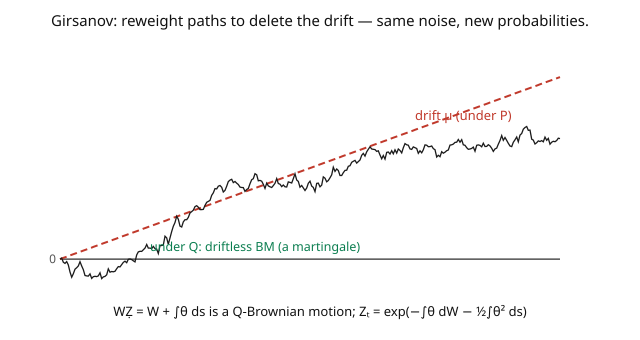

# Stochastic Calculus · Lesson 4.2: Girsanov's theorem

> ⏱ ~15 min · Module 4: Change of measure and the PDE bridge · Builds on: [4.1 Radon–Nikodym derivatives and equivalent measures](04-01-radon-nikodym-equivalent-measures.md) · Unlocks: [4.3 The martingale representation theorem](04-03-martingale-representation.md)

## Why this matters

**Girsanov's theorem is the engine of arbitrage-free pricing.** It says you can *remove a drift* from a diffusion by switching to an equivalent measure — the process that was trending becomes a driftless Brownian motion (hence a martingale) under the new probabilities. This is the whole trick behind the **risk-neutral measure**: reweight so that every asset's discounted price is a fair game, and prices become expectations. Beyond finance, it's how you handle SDEs with inconvenient drifts (make them vanish, solve, translate back) and it underlies importance sampling, filtering, and large-deviations estimates. It is the path-space version of "shifting a Gaussian's mean by reweighting" from [4.1](04-01-radon-nikodym-equivalent-measures.md).

## The idea

In [4.1](04-01-radon-nikodym-equivalent-measures.md) we saw that reweighting $\mathcal{N}(0,1)$ into $\mathcal{N}(\theta, 1)$ — shifting the mean — uses the density $e^{\theta x - \theta^2/2}$. Girsanov does this to *every Brownian increment at once*. A Brownian motion with drift is just a Brownian motion whose increments each have a shifted mean; so reweighting all those means back to zero, using the exponential-martingale density accumulated over the whole path, turns the drifted process into a genuine Brownian motion (the picture).

Concretely: start with Brownian motion $W$ under $P$ and a drift you want to install or remove, encoded by an adapted process $\theta_t$. Build the **density process** $Z_t = \exp\!\big(-\int_0^t\theta\,dW - \tfrac12\int_0^t\theta^2\,ds\big)$ — the exponential martingale ([3.2](03-02-ito-processes-general-formula.md)). Use $Z_T$ as $dQ/dP$ to define the new measure $Q$. Then

$$\widetilde W_t = W_t + \int_0^t \theta_s\,ds \quad\text{is a Brownian motion under } Q.$$

The drift $\int\theta\,ds$ got *absorbed into the definition of Brownian motion* under the new measure. Read it either way: adding a drift $\theta$ to $W$ and reweighting makes it driftless; or, an SDE $dX = \mu\,dt + \sigma\,dW^P$ becomes driftless under $Q$ when you choose $\theta = \mu/\sigma$. **Crucially, the volatility $\sigma$ is unchanged** — quadratic variation is the same under equivalent measures, so Girsanov moves drift but never touches diffusion.

One safety condition: the density $Z_t$ must be a *true* martingale (so $\mathbb{E}_P[Z_T] = 1$ and $Q$ is a probability). **Novikov's condition** $\mathbb{E}_P[e^{\frac12\int_0^T\theta^2\,dt}] < \infty$ guarantees this.

## The formal version

**Girsanov's theorem.** Let $W$ be a $P$-Brownian motion and $\theta_t$ an adapted process satisfying **Novikov's condition** $\mathbb{E}_P\big[\exp(\tfrac12\int_0^T\theta_t^2\,dt)\big] < \infty$. Define the **exponential density process**

$$Z_t = \exp\!\left(-\int_0^t \theta_s\,dW_s - \tfrac12\int_0^t \theta_s^2\,ds\right),$$

a $P$-martingale with $Z_0 = 1$, and the measure $Q$ on $\mathcal{F}_T$ by $\dfrac{dQ}{dP} = Z_T$. Then $Q \sim P$ and

$$\widetilde W_t := W_t + \int_0^t \theta_s\,ds \quad\text{is a standard Brownian motion under } Q.$$

*In words:* under the reweighted measure, the drifted process $\widetilde W$ is a driftless Brownian motion. **Drift-removal form:** if $dX_t = \mu_t\,dt + \sigma_t\,dW_t^P$, choose $\theta_t = \mu_t/\sigma_t$; then $dX_t = \sigma_t\,dW_t^Q$ with $W^Q = W^P + \int(\mu/\sigma)\,ds$ a $Q$-Brownian motion — $X$ is a $Q$-**martingale**. **What is invariant:** the diffusion coefficient $\sigma$ and the quadratic variation $[X]$ are unchanged; only the drift moves. *In words:* changing measure changes the trend, never the noise size.

## Picture

## Worked examples

**Example 1 (removing a constant drift).** Let $dX_t = \mu\,dt + \sigma\,dW_t^P$ (arithmetic BM, constants). To make $X$ driftless, take $\theta = \mu/\sigma$ and define $Q$ via $Z_T = e^{-\frac{\mu}{\sigma}W_T^P - \frac12\frac{\mu^2}{\sigma^2}T}$. By Girsanov, $W_t^Q = W_t^P + \frac{\mu}{\sigma}t$ is a $Q$-Brownian motion. Substitute $dW^P = dW^Q - \frac{\mu}{\sigma}\,dt$:

$$dX_t = \mu\,dt + \sigma\Big(dW_t^Q - \tfrac{\mu}{\sigma}\,dt\Big) = \mu\,dt - \mu\,dt + \sigma\,dW_t^Q = \sigma\,dW_t^Q.$$

Under $Q$, $X$ is a driftless martingale $dX = \sigma\,dW^Q$ — the drift is gone, the volatility $\sigma$ intact. Novikov holds trivially ($\theta$ constant). This is the prototype: pick $\theta = \mu/\sigma$ (the "market price of risk"), reweight, drift vanishes.

**Example 2 (the risk-neutral measure for GBM — Black–Scholes setup).** Let $dS_t = \mu S_t\,dt + \sigma S_t\,dW_t^P$ (GBM, [3.4](03-04-geometric-brownian-motion.md)) with risk-free rate $r$. We want the *discounted* price $e^{-rt}S_t$ to be a martingale. Choose $\theta = \frac{\mu - r}{\sigma}$; then $W_t^Q = W_t^P + \frac{\mu - r}{\sigma}t$ is a $Q$-BM, and

$$dS_t = \mu S_t\,dt + \sigma S_t\Big(dW_t^Q - \tfrac{\mu - r}{\sigma}\,dt\Big) = \big(\mu - (\mu - r)\big)S_t\,dt + \sigma S_t\,dW_t^Q = r S_t\,dt + \sigma S_t\,dW_t^Q.$$

Under $Q$, the stock drifts at the **risk-free rate $r$**, not $\mu$ — the real-world growth rate is reweighted away. Then $d(e^{-rt}S_t) = e^{-rt}(dS_t - rS_t\,dt) = e^{-rt}\sigma S_t\,dW_t^Q$, a martingale. So under the **risk-neutral measure $Q$**, the discounted price is a martingale, and any derivative's price is $e^{-rT}\mathbb{E}_Q[\text{payoff}]$. This is the foundation of the entire Black–Scholes edifice — Girsanov is what makes "price = discounted expected payoff" rigorous.

## Watch out

- **You might think Girsanov changes the volatility.** It cannot — the diffusion coefficient and quadratic variation are measure-invariant (equivalent measures agree on null sets, and $[X]$ is a pathwise limit). Only the *drift* changes. If your change of measure altered $\sigma$, you've made an error.
- **You might skip Novikov's condition.** Without $\mathbb{E}_P[e^{\frac12\int\theta^2\,dt}] < \infty$, the density $Z_t$ can be a strict *local* martingale with $\mathbb{E}_P[Z_T] < 1$, so $Q$ isn't a probability measure and Girsanov fails. For unbounded or fast-growing $\theta$, check Novikov (or a weaker sufficient condition).
- **You might lose track of which measure a Brownian motion belongs to.** $W^P$ is Brownian under $P$; $W^Q = W^P + \int\theta\,ds$ is Brownian under $Q$ (and has drift $\theta$ under $P$!). Always tag your Brownian motion with its measure — computations of drift depend entirely on which measure you're in.

## One-liner

> Girsanov reweights path probabilities by the exponential martingale $Z_t = e^{-\int\theta\,dW - \frac12\int\theta^2\,ds}$ so that $\widetilde W = W + \int\theta\,ds$ is Brownian under the new measure — removing drift while leaving volatility untouched, the engine of risk-neutral pricing.

## Problems

**P1 (🟢)** For $dX = 3\,dt + 2\,dW^P$, find the $\theta$ that makes $X$ a driftless martingale under $Q$, write the density $Z_T$, and state the SDE for $X$ under $Q$.

**P2 (🟡)** A stock has $dS = 0.10\,S\,dt + 0.25\,S\,dW^P$ and the risk-free rate is $r = 0.04$. Find the market price of risk $\theta$, and write the SDE for $S$ under the risk-neutral measure $Q$. Confirm $e^{-rt}S_t$ is a $Q$-martingale.

**P3 (🔴, optional)** Under $Q$ (from Girsanov with constant $\theta$), the process $\widetilde W_t = W_t^P + \theta t$ is a $Q$-BM. Use this to compute $\mathbb{E}_Q[W_T^P]$ — the $Q$-expectation of the *original* ($P$-)Brownian motion — and interpret the sign. *Hint:* $W_T^P = \widetilde W_T - \theta T$, and $\widetilde W_T$ is mean-zero under $Q$.

Solutions

**P1** Set $\theta = \mu/\sigma = 3/2$. Density: $Z_T = \exp(-\tfrac32 W_T^P - \tfrac12(\tfrac32)^2 T) = \exp(-\tfrac32 W_T^P - \tfrac98 T)$. Under $Q$, $W^Q = W^P + \tfrac32 t$ is a BM and $dX = 2\,dW^Q$ — driftless.

**P2** Market price of risk $\theta = \frac{\mu - r}{\sigma} = \frac{0.10 - 0.04}{0.25} = \frac{0.06}{0.25} = 0.24$. Under $Q$, $dS = rS\,dt + \sigma S\,dW^Q = 0.04\,S\,dt + 0.25\,S\,dW^Q$ — the drift becomes the risk-free rate. Then $d(e^{-rt}S_t) = e^{-rt}(dS - rS\,dt) = e^{-rt}(0.04 S\,dt + 0.25 S\,dW^Q - 0.04 S\,dt) = 0.25\,e^{-rt}S_t\,dW^Q$, a stochastic integral, hence a $Q$-martingale. ✓

**P3** $W_T^P = \widetilde W_T - \theta T$. Under $Q$, $\widetilde W_T$ is a standard Brownian motion at time $T$, so $\mathbb{E}_Q[\widetilde W_T] = 0$. Thus $\mathbb{E}_Q[W_T^P] = \mathbb{E}_Q[\widetilde W_T] - \theta T = -\theta T$. Interpretation: the original $P$-Brownian motion has acquired a drift of $-\theta$ under $Q$ (it trends *down* at rate $\theta$), the mirror image of $\widetilde W$ acquiring drift $+\theta$ under $P$. The reweighting that removes drift from one process installs the opposite drift in the other — measure changes are relative. ∎

## Flashback

**From Lesson 4.1 (Radon–Nikodym derivatives and equivalent measures):** Under $P$, $X \sim \mathcal{N}(0,1)$, and $Q$ has density $Z = e^{1.5X - 1.125}$. What is the distribution of $X$ under $Q$?

Solution

Recognize $Z = e^{\theta X - \theta^2/2}$ with $\theta = 1.5$ (since $\theta^2/2 = 2.25/2 = 1.125$). This Gaussian-shift density moves the mean to $\theta$ and leaves the variance at $1$, so under $Q$, $X \sim \mathcal{N}(1.5, 1)$. ✓ (Girsanov is this fact applied to every increment of a Brownian path.)

## Connections

- **Backward:** Girsanov is [4.1](04-01-radon-nikodym-equivalent-measures.md)'s Gaussian mean-shift applied path-wise; the density $Z_t$ is the exponential martingale of [3.2](03-02-ito-processes-general-formula.md)/[1.5](01-05-quadratic-variation-martingale-property.md); Novikov ensures it's a true (not local) martingale ([2.4](02-04-ito-integral-as-martingale.md)).
- **Forward:** [4.3](04-03-martingale-representation.md) guarantees the martingale you create can be *represented* as a stochastic integral (the hedging strategy); together they complete the pricing/hedging picture that Feynman–Kac ([4.5](04-05-feynman-kac.md)) turns into a PDE.
- **Sideways (finance/physics):** the risk-neutral measure is Girsanov applied to make discounted prices martingales — the cornerstone of [`mathematical-finance`](../../mathematical-finance/syllabus.md); in physics and statistics, the same reweighting is importance sampling and the Cameron–Martin theorem for shifting Gaussian measures.
