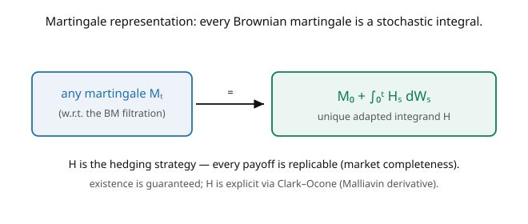

# Stochastic Calculus · Lesson 4.3: The martingale representation theorem

> ⏱ ~15 min · Module 4: Change of measure and the PDE bridge · Builds on: [4.2 Girsanov's theorem](04-02-girsanov-theorem.md), [2.4 The Itô integral as a martingale](02-04-ito-integral-as-martingale.md) · Unlocks: [4.4 The infinitesimal generator](04-04-infinitesimal-generator.md)

## Why this matters

We know every Itô integral $\int H\,dW$ is a martingale ([2.4](02-04-ito-integral-as-martingale.md)). The **martingale representation theorem** is the stunning converse: relative to a Brownian filtration, *every* martingale is a stochastic integral. There are no other Brownian martingales — the Itô integral captures all of them. In finance this is the theorem that guarantees **market completeness**: any payoff can be perfectly replicated (hedged) by trading the underlying, and the required trading strategy is exactly the integrand $H$. Together with Girsanov, it completes the pricing-and-hedging story: Girsanov gives you the martingale, representation gives you the hedge. It's also the structural backbone behind backward SDEs and stochastic control.

## The idea

A Brownian filtration $\{\mathcal{F}_t^W\}$ carries *only* the information generated by the Brownian path — no other source of randomness. So any martingale adapted to it must be built entirely out of Brownian increments. The theorem makes this precise: every such martingale $M_t$ can be written as its starting value plus an accumulated stochastic integral (the picture),

$$M_t = M_0 + \int_0^t H_s\,dW_s,$$

for a unique adapted integrand $H$. In words: **the Itô integral is not just one example of a martingale — it is the *only* kind** (relative to the Brownian filtration). Martingale $\Leftrightarrow$ stochastic integral.

The financial reading is the payoff. A **contingent claim** is any $\mathcal{F}_T$-measurable payoff (an option, say). Consider its fair-value process $M_t = \mathbb{E}_Q[\text{discounted payoff}\mid\mathcal{F}_t]$ — a $Q$-martingale by the tower property. Representation says $M_t = M_0 + \int_0^t H_s\,dW_s^Q$: the payoff can be reproduced by starting with capital $M_0$ (its price!) and trading $H_s$ units of the risky asset. The integrand $H$ **is the hedging strategy** — the option's "delta." So every claim is *replicable*, the market is *complete*, and the price is unique. Existence is guaranteed abstractly; when you need $H$ explicitly, the **Clark–Ocone formula** gives it as (a conditional expectation of) the Malliavin derivative of the payoff.

## The formal version

**Martingale representation theorem.** Let $\{\mathcal{F}_t^W\}$ be the (augmented) filtration generated by a Brownian motion $W$, and let $M_t$ be a martingale w.r.t. it with $M_T \in L^2$. Then there exists a **unique** adapted process $H$ with $\mathbb{E}\int_0^T H_s^2\,ds < \infty$ such that

$$M_t = M_0 + \int_0^t H_s\,dW_s \quad\text{for all } t \in [0,T], \text{ a.s.}$$

*In words:* every square-integrable Brownian martingale is an Itô integral of a unique integrand — the converse of "Itô integrals are martingales." Equivalently, every $\mathcal{F}_T$-measurable $X \in L^2$ has the representation $X = \mathbb{E}[X] + \int_0^T H_s\,dW_s$.

**Completeness corollary.** In a Black–Scholes-type market with one Brownian driver and the risk-neutral measure $Q$, every contingent claim $X$ (an $\mathcal{F}_T$-measurable payoff) is **replicable**: its discounted price process $M_t = \mathbb{E}_Q[e^{-rT}X\mid\mathcal{F}_t]$ satisfies $M_t = M_0 + \int_0^t H_s\,dW_s^Q$, and $H$ is the self-financing hedge. *In words:* the payoff can be manufactured by trading, so its price $M_0 = \mathbb{E}_Q[e^{-rT}X]$ is the unique arbitrage-free price. **Clark–Ocone formula** (when explicitness is needed): $H_t = \mathbb{E}[D_t X\mid\mathcal{F}_t]$, with $D_t$ the Malliavin derivative — a constructive handle on the hedge.

## Picture

## Worked examples

**Example 1 (representing $W_t^2 - t$).** The martingale $M_t = W_t^2 - t$ ([1.5](01-05-quadratic-variation-martingale-property.md)) — what's its representation? Itô's lemma already gave $d(W_t^2 - t) = 2W_t\,dW_t$ (the $dt$ terms cancelled, [3.1](03-01-itos-lemma-for-bm.md)). Integrating from $0$:

$$W_t^2 - t = 0 + \int_0^t 2W_s\,dW_s,$$

so $M_0 = 0$ and the integrand is $H_s = 2W_s$. The theorem promised such an $H$ exists and is unique; here Itô's lemma hands it to us explicitly. Every martingale we've met is secretly a stochastic integral — Itô's lemma is often how you find the integrand.

**Example 2 (pricing/hedging a claim on $W_T^2$).** Suppose a claim pays $X = W_T^2$ at time $T$ (ignore discounting, $r = 0$). Its value process is $M_t = \mathbb{E}[W_T^2\mid\mathcal{F}_t]$. By the Markov property ([1.3](01-03-filtrations-adaptedness-markov.md)), $\mathbb{E}[W_T^2\mid\mathcal{F}_t] = W_t^2 + (T - t)$. Differentiate with Itô: $dM_t = d(W_t^2) - dt = (2W_t\,dW_t + dt) - dt = 2W_t\,dW_t$. So

$$M_t = M_0 + \int_0^t 2W_s\,dW_s, \qquad M_0 = \mathbb{E}[W_T^2] = T.$$

The **price** of the claim is $M_0 = T$, and the **hedge** is $H_t = 2W_t$ (hold $2W_t$ units of the "$W$-asset" at time $t$). Starting with capital $T$ and trading $2W_t$, you exactly reproduce $W_T^2$ at maturity — replication in action. Girsanov would supply the measure; representation supplies this hedge.

## Watch out

- **You might expect the theorem to hand you $H$ explicitly.** It's an *existence and uniqueness* result — $H$ exists and is unique, but the abstract statement doesn't compute it. In practice you find $H$ by applying Itô's lemma to the value process (Example 2) or via the Clark–Ocone formula. Existence ≠ formula.
- **You might apply it to a non-Brownian filtration.** Representation holds for the filtration generated *by the Brownian motion itself*. Add an independent source of randomness (a jump, a second uncorrelated noise) and the market becomes **incomplete** — not every claim is replicable, and the representation fails. One driver, one hedge; extra noise breaks it.
- **You might conflate "martingale" with "constant."** The theorem says martingales are integrals $\int H\,dW$, which fluctuate. It does *not* say they're trivial — $W_t$, $W_t^2 - t$, and every option value are non-constant martingales with rich dynamics, all representable.

## One-liner

> Relative to a Brownian filtration, every martingale is a stochastic integral $M_0 + \int H\,dW$ — the converse of "Itô integrals are martingales" — and that integrand $H$ is the hedging strategy that makes markets complete.

## Problems

**P1 (🟢)** Find the martingale representation $M_t = M_0 + \int_0^t H_s\,dW_s$ for $M_t = W_t^3 - 3\int_0^t W_s\,ds$. *Hint:* apply Itô to $W_t^3$ ([3.1](03-01-itos-lemma-for-bm.md) P1) and rearrange so the $ds$-term is absorbed.

**P2 (🟡)** A claim pays $X = e^{\sigma W_T}$ at time $T$. Show its (undiscounted) value process is $M_t = e^{\sigma W_t + \frac12\sigma^2(T - t)}$, verify it's a martingale, and find the hedge $H_t$ by applying Itô. *Hint:* $\mathbb{E}[e^{\sigma W_T}\mid\mathcal{F}_t] = e^{\sigma W_t}\mathbb{E}[e^{\sigma(W_T - W_t)}] = e^{\sigma W_t + \frac12\sigma^2(T-t)}$.

**P3 (🔴, optional)** Explain why adding a second, independent Brownian motion $B$ (an extra risk not traded) makes the market **incomplete**: give a claim on $B_T$ that cannot be written as $\int H\,dW$ for any $W$-adapted $H$. Why does this break the uniqueness of the price?

Solutions

**P1** From Itô, $d(W_t^3) = 3W_t^2\,dW_t + 3W_t\,dt$ ([3.1](03-01-itos-lemma-for-bm.md) P1), so $d\big(W_t^3 - 3\int_0^t W_s\,ds\big) = 3W_t^2\,dW_t + 3W_t\,dt - 3W_t\,dt = 3W_t^2\,dW_t$. Integrating from $0$: $M_t = 0 + \int_0^t 3W_s^2\,dW_s$, i.e. $M_0 = 0$, $H_s = 3W_s^2$. (So $W_t^3 - 3\int_0^t W_s\,ds$ is a martingale — the compensated cube.)

**P2** Value process $M_t = \mathbb{E}[e^{\sigma W_T}\mid\mathcal{F}_t] = e^{\sigma W_t}\,\mathbb{E}[e^{\sigma(W_T - W_t)}\mid\mathcal{F}_t] = e^{\sigma W_t}\,e^{\frac12\sigma^2(T-t)}$ (increment independent, Gaussian MGF). Apply Itô to $f(t,x) = e^{\sigma x + \frac12\sigma^2(T-t)}$: $\partial_t f = -\tfrac12\sigma^2 f$, $\partial_x f = \sigma f$, $\partial_{xx}f = \sigma^2 f$; drift $= \partial_t f + \tfrac12\partial_{xx}f = -\tfrac12\sigma^2 f + \tfrac12\sigma^2 f = 0$ (martingale ✓), diffusion $= \sigma f = \sigma M_t$. So $dM_t = \sigma M_t\,dW_t$, giving $H_t = \sigma M_t = \sigma e^{\sigma W_t + \frac12\sigma^2(T-t)}$. Price $M_0 = e^{\frac12\sigma^2 T}$, hedge $H_t$.

**P3** With an independent BM $B$, the filtration is generated by both $W$ and $B$. A claim like $X = B_T$ is a martingale ($M_t = \mathbb{E}[B_T\mid\mathcal{F}_t] = B_t$) but its representation is $M_t = \int_0^t 1\,dB_s$ — a $dB$ integral, **not** a $dW$ integral. Since $B \perp W$, there is *no* $W$-adapted $H$ with $B_t = \int_0^t H\,dW$ (the right side is $W$-measurable and independent of $B$, so can't equal $B_t$). Thus the claim on $B$ can't be hedged by trading the $W$-asset alone — the market is **incomplete**. Uniqueness of price breaks because there are many equivalent martingale measures (Girsanov can reweight the untraded $B$-drift freely), each giving a different price $\mathbb{E}_Q[X]$ — with no replication to pin down the "right" one. ∎

## Flashback

**From Lesson 4.2 (Girsanov's theorem):** A stock has $dS = 0.08\,S\,dt + 0.20\,S\,dW^P$ and risk-free rate $r = 0.03$. Find the market price of risk and the SDE for $S$ under the risk-neutral measure.

Solution

Market price of risk $\theta = \frac{\mu - r}{\sigma} = \frac{0.08 - 0.03}{0.20} = \frac{0.05}{0.20} = 0.25$. Under the risk-neutral measure $Q$ (with $W^Q = W^P + \theta t$), the drift becomes $r$: $dS = 0.03\,S\,dt + 0.20\,S\,dW^Q$. ✓ (Then representation guarantees any claim on $S$ is hedgeable, and Feynman–Kac turns its price into a PDE.)

## Connections

- **Backward:** this is the converse of [2.4](02-04-ito-integral-as-martingale.md) (Itô integrals are martingales); finding $H$ uses Itô's lemma ([3.1](03-01-itos-lemma-for-bm.md)–[3.2](03-02-ito-processes-general-formula.md)); Girsanov ([4.2](04-02-girsanov-theorem.md)) supplies the martingale measure under which value processes are martingales.
- **Forward:** the generator and Feynman–Kac ([4.4](04-04-infinitesimal-generator.md)–[4.5](04-05-feynman-kac.md)) turn the value process $M_t = \mathbb{E}_Q[\text{payoff}\mid\mathcal{F}_t]$ into a PDE, and the hedge $H = \partial_S V$ (the "delta") emerges from that PDE's gradient.
- **Sideways (finance):** completeness and replication are the theoretical guarantee behind delta-hedging and the uniqueness of the Black–Scholes price ([`mathematical-finance`](../../mathematical-finance/syllabus.md)); market incompleteness (stochastic volatility, jumps) is exactly the failure mode in P3.
