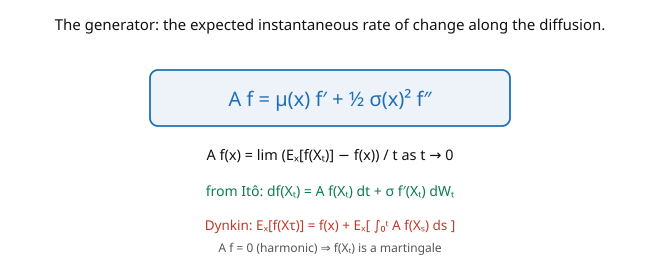

# Stochastic Calculus · Lesson 4.4: The infinitesimal generator

> ⏱ ~15 min · Module 4: Change of measure and the PDE bridge · Builds on: [4.3 The martingale representation theorem](04-03-martingale-representation.md), [3.2 Itô processes and the general Itô formula](03-02-ito-processes-general-formula.md) · Unlocks: [4.5 The Feynman–Kac formula](04-05-feynman-kac.md)

## Why this matters

The **infinitesimal generator** is a single differential operator that encodes everything about a diffusion's local behavior — its drift and its diffusion rolled into one $\mathcal{A} = \mu\partial_x + \tfrac12\sigma^2\partial_{xx}$. It's the object that translates *probability* (expectations of a random process) into *analysis* (a PDE), and it's the exact half of Itô's formula that isn't noise. With it, computing $\mathbb{E}[f(X_t)]$ becomes solving an ODE/PDE, checking whether $f(X_t)$ is a martingale becomes checking $\mathcal{A}f = 0$, and — next lesson — expectations of diffusion functionals become solutions of parabolic PDEs (Feynman–Kac). The generator is the linchpin of the entire SDE↔PDE bridge, and it's where stochastic calculus shakes hands with the theory of PDEs and with statistical mechanics.

## The idea

Itô's formula ([3.2](03-02-ito-processes-general-formula.md)) split $df(X_t)$ into a predictable **drift** part and a mean-zero **martingale** part:

$$df(X_t) = \underbrace{\Big(\mu\,f' + \tfrac12\sigma^2 f''\Big)}_{\mathcal{A}f}\,dt \;+\; \sigma f'\,dW.$$

The drift part is the **generator** $\mathcal{A}f = \mu f' + \tfrac12\sigma^2 f''$ applied to $f$ (the picture). It answers: "on average, how fast does $f$ change per unit time as the process moves?" — because when you take expectations, the $dW$ term vanishes and only $\mathcal{A}f$ survives:

$$\frac{d}{dt}\mathbb{E}[f(X_t)] = \mathbb{E}[\mathcal{A}f(X_t)].$$

That's the generator's defining meaning: the **expected instantaneous rate of change** of $f$ along the diffusion, $\mathcal{A}f(x) = \lim_{t\to 0}\frac{\mathbb{E}_x[f(X_t)] - f(x)}{t}$.

Two payoffs. First, **Dynkin's formula**: integrating the expectation relation up to a stopping time turns "expected value at a random time" into an integral of $\mathcal{A}f$ — a computational workhorse for hitting problems. Second, the **martingale connection**: $f(X_t)$ is a martingale exactly when its drift $\mathcal{A}f = 0$ (a "harmonic" function of the generator). This is the bridge: martingale functions of a diffusion are solutions of the differential equation $\mathcal{A}f = 0$, and adding time-dependence gives the parabolic PDE of Feynman–Kac.

## The formal version

For a diffusion $dX_t = \mu(X_t)\,dt + \sigma(X_t)\,dW_t$, the **infinitesimal generator** is the second-order differential operator

$$\mathcal{A}f(x) = \mu(x)\,f'(x) + \tfrac12\sigma(x)^2\,f''(x), \qquad \mathcal{A}f(x) = \lim_{t\to 0}\frac{\mathbb{E}_x[f(X_t)] - f(x)}{t},$$

for $f \in C^2$ (suitably bounded), where $\mathbb{E}_x$ conditions on $X_0 = x$. *In words:* $\mathcal{A}$ is the drift-part of Itô's formula, and it computes the expected instantaneous rate of change of $f$.

**Consequences.**

- From Itô, $f(X_t) = f(X_0) + \int_0^t \mathcal{A}f(X_s)\,ds + \int_0^t \sigma f'(X_s)\,dW_s$, so **$M_t^f := f(X_t) - \int_0^t \mathcal{A}f(X_s)\,ds$ is a martingale** (the "Dynkin martingale").
- **Dynkin's formula:** for a stopping time $\tau$ with $\mathbb{E}_x[\tau] < \infty$,

$$\mathbb{E}_x[f(X_\tau)] = f(x) + \mathbb{E}_x\!\left[\int_0^\tau \mathcal{A}f(X_s)\,ds\right].$$

- **Martingale criterion:** $f(X_t)$ is a (local) martingale iff $\mathcal{A}f \equiv 0$; such $f$ are **harmonic** for $\mathcal{A}$.

*In words:* the generator packages the process into an operator, and Dynkin turns expectations at random times into integrals of that operator — the tool for hitting probabilities and expected exit times, now systematized.

## Picture

## Worked examples

**Example 1 (generator of Brownian motion — harmonic = linear).** For BM ($\mu = 0$, $\sigma = 1$), the generator is $\mathcal{A}f = \tfrac12 f''$ — half the Laplacian. A function gives a martingale $f(W_t)$ iff $\mathcal{A}f = \tfrac12 f'' = 0$, i.e. $f'' = 0$, i.e. **$f$ is affine** ($f(x) = ax + b$). This matches everything we've seen: $W_t$ (affine) is a martingale, but $W_t^2$ (not affine) is not — its generator value $\mathcal{A}(x^2) = \tfrac12\cdot 2 = 1 \neq 0$ is exactly the drift rate, so $W_t^2 - \int_0^t 1\,ds = W_t^2 - t$ *is* the martingale (Dynkin martingale). The "$-t$" compensator is literally $\int_0^t\mathcal{A}f\,ds$.

**Example 2 (OU mean via the generator).** The Ornstein–Uhlenbeck process $dX = \theta(\mu - X)\,dt + \sigma\,dW$ has generator $\mathcal{A}f = \theta(\mu - x)f' + \tfrac12\sigma^2 f''$. Take $f(x) = x$ ($f' = 1$, $f'' = 0$): $\mathcal{A}f(x) = \theta(\mu - x)$. Then the expectation relation gives an ODE for the mean $m(t) = \mathbb{E}[X_t]$:

$$\frac{d}{dt}\mathbb{E}[X_t] = \mathbb{E}[\mathcal{A}f(X_t)] = \mathbb{E}[\theta(\mu - X_t)] = \theta(\mu - m(t)).$$

Solving $\dot m = \theta(\mu - m)$ with $m(0) = X_0$: $m(t) = \mu + (X_0 - \mu)e^{-\theta t}$ — the OU mean from [3.5](03-05-ornstein-uhlenbeck-process.md), now derived purely from the generator, no explicit solution of the SDE needed. Take $f(x) = x^2$ and you similarly get an ODE for the second moment. **The generator computes moments by turning them into ODEs.**

## Watch out

- **You might forget the $\tfrac12$ on the second-derivative term.** The generator is $\mu f' + \tfrac12\sigma^2 f''$ — the $\tfrac12$ (from $(dW)^2 = dt$) is essential; dropping it doubles the diffusion and wrecks every expectation. It's the same $\tfrac12$ as Itô's correction.
- **You might use $\sigma$ instead of $\sigma^2$ in the generator.** The second-order coefficient is $\tfrac12\sigma^2$ (the *variance* rate), not $\tfrac12\sigma$. Quadratic variation contributes $\sigma^2\,dt$, so the diffusion term of $\mathcal{A}$ carries $\sigma^2$.
- **You might apply Dynkin without checking $\mathbb{E}[\tau] < \infty$.** Like optional stopping ([1.6](01-06-stopping-times-optional-stopping.md)), Dynkin's formula needs an integrability condition on the stopping time (and on $\mathcal{A}f$ along the path). For an unbounded $\tau$, verify finiteness or localize with $\tau\wedge n$.

## One-liner

> The generator $\mathcal{A}f = \mu f' + \tfrac12\sigma^2 f''$ is the drift-part of Itô's formula — the expected instantaneous rate of change of $f$ — so expectations solve ODEs/PDEs, $\mathcal{A}f = 0$ means $f(X_t)$ is a martingale, and Dynkin turns exit problems into integrals of $\mathcal{A}f$.

## Problems

**P1 (🟢)** Write the generator of geometric Brownian motion $dS = \mu S\,dt + \sigma S\,dW$. Apply it to $f(x) = x$ and to $f(x) = \log x$, and use the expectation relation to find $\frac{d}{dt}\mathbb{E}[S_t]$ and $\frac{d}{dt}\mathbb{E}[\log S_t]$.

**P2 (🟡)** For Brownian motion, use Dynkin's formula with $f(x) = x^2$ and $\tau = $ first exit from $(-a, a)$ to recover $\mathbb{E}[\tau] = a^2$. *Hint:* $\mathcal{A}(x^2) = 1$, so Dynkin gives $\mathbb{E}[W_\tau^2] = 0 + \mathbb{E}[\int_0^\tau 1\,ds] = \mathbb{E}[\tau]$, and $W_\tau^2 = a^2$.

**P3 (🔴, optional)** For BM, find the harmonic function (solving $\mathcal{A}f = \tfrac12 f'' = 0$) and use it with Dynkin/optional stopping to compute the exit probability $\mathbb{P}(\text{hit } b \text{ before } -a)$ for BM from $0$, recovering $\frac{a}{a+b}$ from [1.6](01-06-stopping-times-optional-stopping.md). *Hint:* the harmonic (affine) function $f(x) = x$ gives $\mathbb{E}[W_\tau] = 0$.

Solutions

**P1** Generator: $\mathcal{A}f = \mu x\,f'(x) + \tfrac12\sigma^2 x^2\,f''(x)$. For $f(x) = x$: $\mathcal{A}f = \mu x$, so $\frac{d}{dt}\mathbb{E}[S_t] = \mathbb{E}[\mu S_t] = \mu\,\mathbb{E}[S_t]$, giving $\mathbb{E}[S_t] = S_0 e^{\mu t}$ ✓. For $f(x) = \log x$ ($f' = 1/x$, $f'' = -1/x^2$): $\mathcal{A}f = \mu x\cdot\tfrac1x + \tfrac12\sigma^2 x^2\cdot(-\tfrac1{x^2}) = \mu - \tfrac12\sigma^2$, so $\frac{d}{dt}\mathbb{E}[\log S_t] = \mu - \tfrac12\sigma^2$, i.e. $\mathbb{E}[\log S_t] = \log S_0 + (\mu - \tfrac12\sigma^2)t$ — the log-drift with its volatility correction ([3.4](03-04-geometric-brownian-motion.md)).

**P2** $\mathcal{A}(x^2) = \tfrac12\cdot 2 = 1$ for BM. Dynkin: $\mathbb{E}[W_\tau^2] = 0^2 + \mathbb{E}[\int_0^\tau 1\,ds] = \mathbb{E}[\tau]$. At exit, $W_\tau = \pm a$, so $W_\tau^2 = a^2$; hence $\mathbb{E}[\tau] = a^2$. ✓ (Same answer as optional stopping on $W_t^2 - t$, since $W_t^2 - t$ is precisely the Dynkin martingale for $f = x^2$.)

**P3** The harmonic function for BM solves $\tfrac12 f'' = 0$, so $f(x) = x$ (affine). By Dynkin/optional stopping, $\mathbb{E}[W_\tau] = f(0) + \mathbb{E}\int_0^\tau \mathcal{A}f\,ds = 0 + 0 = 0$ (since $\mathcal{A}f = 0$). Writing $p = \mathbb{P}(\text{hit } b)$: $\mathbb{E}[W_\tau] = b\cdot p + (-a)(1-p) = 0$, giving $p = \frac{a}{a+b}$. ✓ Harmonic functions of the generator are exactly the martingales that make optional stopping yield hitting probabilities — the generator systematizes [1.6](01-06-stopping-times-optional-stopping.md). ∎

## Flashback

**From Lesson 4.3 (The martingale representation theorem):** The process $M_t = W_t^2 - t$ is a martingale. Find its representation $M_t = M_0 + \int_0^t H_s\,dW_s$ (i.e. identify $H_s$).

Solution

By Itô, $d(W_t^2 - t) = 2W_t\,dW_t$ (the $dt$ terms cancel). Integrating: $W_t^2 - t = 0 + \int_0^t 2W_s\,dW_s$, so $M_0 = 0$ and $H_s = 2W_s$. ✓ (Equivalently, $W_t^2 - t$ is the Dynkin martingale $f(W_t) - \int_0^t\mathcal{A}f\,ds$ for $f = x^2$, $\mathcal{A}f = 1$.)

## Connections

- **Backward:** $\mathcal{A}$ is the drift-part of the general Itô formula ([3.2](03-02-ito-processes-general-formula.md)); Dynkin systematizes the optional-stopping computations of [1.6](01-06-stopping-times-optional-stopping.md); the Dynkin martingale is the martingale representation ([4.3](04-03-martingale-representation.md)) of $f(X_t)$'s martingale part.
- **Forward:** [4.5](04-05-feynman-kac.md) adds time-dependence to $\mathcal{A}f = 0$ to get the parabolic PDE $\partial_t u + \mathcal{A}u = 0$ solved by diffusion expectations; [4.6](04-06-fokker-planck-kolmogorov.md) uses the *adjoint* $\mathcal{A}^*$ for the density's forward equation.
- **Sideways (physics):** the generator of Brownian motion is $\tfrac12\Delta$ (the Laplacian) — the operator of the heat equation, linking diffusion to potential theory and to the Schrödinger operator's structure; in [`stat-mech`](../../stat-mech/syllabus.md) the OU generator governs relaxation to equilibrium.
