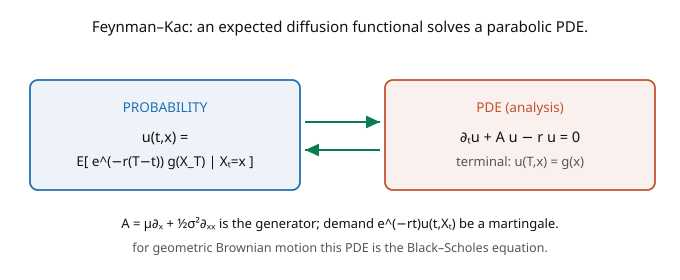

# Stochastic Calculus · Lesson 4.5: The Feynman–Kac formula

> ⏱ ~15 min · Module 4: Change of measure and the PDE bridge · Builds on: [4.4 The infinitesimal generator](04-04-infinitesimal-generator.md) · Unlocks: [4.6 Fokker–Planck and the Kolmogorov equations](04-06-fokker-planck-kolmogorov.md)

## Why this matters

**Feynman–Kac is the bridge between two worlds**: it says an *expectation* of a functional of a diffusion (a probability object) is exactly the *solution of a parabolic PDE* (an analysis object). This two-way street is one of the most useful facts in applied mathematics. It lets you **price options by solving a PDE** (or, conversely, solve PDEs by Monte-Carlo simulation of diffusions). It's how the Black–Scholes PDE arises, how heat equations get probabilistic solutions, and how physics problems (quantum path integrals, diffusion) connect to random processes. This lesson is the culmination of the course's second half: everything — Itô's lemma, the generator, martingales — assembles into a single formula linking SDEs and PDEs.

## The idea

Suppose you want $u(t, x) = \mathbb{E}\big[e^{-r(T-t)}g(X_T)\mid X_t = x\big]$ — the expected, discounted value of some payoff $g(X_T)$, given the diffusion sits at $x$ at time $t$. This is an option price, a survival probability, an expected reward. Feynman–Kac says $u$ solves a PDE.

The mechanism is pure Module 4. Consider the discounted process $e^{-rt}u(t, X_t)$. Apply Itô's lemma; the drift is $e^{-rt}(\partial_t u + \mathcal{A}u - ru)$, where $\mathcal{A}$ is the generator ([4.4](04-04-infinitesimal-generator.md)). Now here's the trick: $u$ is *defined* as a conditional expectation of a fixed terminal payoff, which makes $e^{-rt}u(t, X_t)$ a **martingale** (by the tower property). A martingale has zero drift. So the drift must vanish:

$$\partial_t u + \mathcal{A}u - ru = 0,$$

a backward parabolic PDE, with terminal condition $u(T, x) = g(x)$ (at $t = T$ the expectation is just $g(x)$). The picture: probability on one side, PDE on the other, Feynman–Kac the bridge. Read left-to-right, it turns an expectation into a PDE to solve; read right-to-left, it gives any such PDE a probabilistic (simulatable) solution. For geometric Brownian motion, this PDE is precisely the **Black–Scholes equation**.

## The formal version

**Feynman–Kac formula.** Let $dX_s = \mu(X_s)\,ds + \sigma(X_s)\,dW_s$ with generator $\mathcal{A} = \mu\partial_x + \tfrac12\sigma^2\partial_{xx}$, and define

$$u(t, x) = \mathbb{E}\big[e^{-r(T - t)}\,g(X_T) \,\big|\, X_t = x\big].$$

Then (under suitable growth conditions) $u \in C^{1,2}$ solves the **backward parabolic PDE**

$$\boxed{\;\partial_t u + \mu(x)\,\partial_x u + \tfrac12\sigma(x)^2\,\partial_{xx}u - r\,u = 0,\qquad u(T, x) = g(x).\;}$$

*In words:* the discounted expected payoff, as a function of current time and state, satisfies "$\partial_t u + \mathcal{A}u = ru$" with terminal data $g$. Conversely, if $v$ solves this PDE with terminal condition $g$, then $v(t,x) = \mathbb{E}[e^{-r(T-t)}g(X_T)\mid X_t = x]$ — the PDE's solution *is* the expectation (uniqueness gives the two-way equivalence).

**Special cases.** With $r = 0$: $\partial_t u + \mathcal{A}u = 0$ (the **backward Kolmogorov equation**), $u(t,x) = \mathbb{E}[g(X_T)\mid X_t = x]$. For Brownian motion ($\mathcal{A} = \tfrac12\partial_{xx}$): $\partial_t u + \tfrac12\partial_{xx}u = 0$ — the **backward heat equation**, so heat diffuses according to Brownian expectations. A **running-cost** version adds a source term $\int$: $u = \mathbb{E}[\int_t^T e^{-r(s-t)}f(X_s)\,ds + e^{-r(T-t)}g(X_T)]$ solves the PDE with $-f$ on the right.

## Picture

## Worked examples

**Example 1 (deriving the PDE from the martingale condition).** Let $u(t,x) = \mathbb{E}[e^{-r(T-t)}g(X_T)\mid X_t = x]$ and set $Y_t = e^{-rt}u(t, X_t)$. Apply Itô's lemma:

$$dY_t = -re^{-rt}u\,dt + e^{-rt}\,du(t,X_t) = e^{-rt}\Big[\underbrace{\partial_t u + \mu\partial_x u + \tfrac12\sigma^2\partial_{xx}u - ru}_{\text{drift}}\Big]dt + e^{-rt}\sigma\partial_x u\,dW_t.$$

Now $Y_t = \mathbb{E}[e^{-rT}g(X_T)\mid\mathcal{F}_t]$ is a martingale (a conditional expectation of a fixed random variable — the tower property makes it one). A martingale has **zero drift**, so the bracket vanishes: $\partial_t u + \mu\partial_x u + \tfrac12\sigma^2\partial_{xx}u - ru = 0$. The terminal condition is immediate: $u(T, x) = \mathbb{E}[g(X_T)\mid X_T = x] = g(x)$. That's Feynman–Kac — it falls out of "discounted price is a martingale" plus Itô.

**Example 2 (the Black–Scholes PDE — Boss Problem 4).** Specialize to geometric Brownian motion under the risk-neutral measure, $dS = rS\,dt + \sigma S\,dW^Q$ ([4.2](04-02-girsanov-theorem.md)), whose generator is $\mathcal{A} = rS\partial_S + \tfrac12\sigma^2 S^2\partial_{SS}$. An option paying $g(S_T)$ has price $V(t, S) = \mathbb{E}_Q[e^{-r(T-t)}g(S_T)\mid S_t = S]$. Feynman–Kac gives

$$\partial_t V + rS\,\partial_S V + \tfrac12\sigma^2 S^2\,\partial_{SS}V - rV = 0, \qquad V(T, S) = g(S).$$

This is the **Black–Scholes PDE** — the equation whose solution (for a call, $g(S) = (S - K)^+$) is the Black–Scholes formula. Every piece has a meaning: $\tfrac12\sigma^2 S^2\partial_{SS}V$ is "gamma" (the Itô correction), $rS\partial_S V$ is the risk-neutral drift, $-rV$ is discounting. The entire option-pricing edifice is one Feynman–Kac PDE for a GBM — probability (expected payoff) and analysis (PDE) are the same object.

## Watch out

- **You might use the real-world drift $\mu$ instead of the risk-neutral $r$.** For pricing, the expectation must be under the *risk-neutral* measure $Q$, where the drift is $r$ (Girsanov, [4.2](04-02-girsanov-theorem.md)) — using $\mu$ gives the wrong PDE and wrong price. Feynman–Kac uses whatever measure the expectation is taken under; match them.
- **You might forget the terminal (not initial) condition.** Feynman–Kac PDEs run *backward* in time from a **terminal** condition $u(T, x) = g(x)$ — you know the payoff at maturity and solve back to today. A substitution $\tau = T - t$ flips it to a forward heat-type equation with an initial condition.
- **You might omit the $-ru$ discount term.** With discounting at rate $r$, the PDE carries $-ru$; with $r = 0$ it's the pure Kolmogorov/heat equation. Dropping $-ru$ (or adding it when $r=0$) misprices — the discount term is the difference between "expected payoff" and "expected *discounted* payoff."

## One-liner

> Feynman–Kac says $u(t,x) = \mathbb{E}[e^{-r(T-t)}g(X_T)\mid X_t = x]$ solves $\partial_t u + \mathcal{A}u - ru = 0$ with $u(T,\cdot) = g$ — because the discounted process is a martingale (zero drift) — turning expectations into PDEs and back, and yielding Black–Scholes for GBM.

## Problems

**P1 (🟢)** Write the Feynman–Kac PDE (with terminal condition) for $u(t,x) = \mathbb{E}[g(W_T)\mid W_t = x]$ where $X = W$ is Brownian motion and $r = 0$. What classical PDE is this (after $\tau = T - t$)?

**P2 (🟡)** For an Ornstein–Uhlenbeck process $dX = \theta(\mu - X)\,dt + \sigma\,dW$, write the Feynman–Kac PDE (with $r = 0$) for $u(t,x) = \mathbb{E}[g(X_T)\mid X_t = x]$. Then verify that $u(t,x) = \mathbb{E}[X_T\mid X_t = x] = \mu + (x - \mu)e^{-\theta(T-t)}$ solves it when $g(x) = x$. *Hint:* plug this $u$ into $\partial_t u + \mathcal{A}u = 0$.

**P3 (🔴, optional)** Solve the Black–Scholes PDE for a **forward contract** $g(S) = S - K$ (payoff linear in $S_T$). *Hint:* guess $V(t, S) = S - Ke^{-r(T-t)}$ and verify it satisfies the PDE and terminal condition; interpret the two terms.

Solutions

**P1** BM has $\mathcal{A} = \tfrac12\partial_{xx}$, $r = 0$, so the PDE is $\partial_t u + \tfrac12\partial_{xx}u = 0$, $u(T, x) = g(x)$ — the **backward heat equation**. Substituting $\tau = T - t$ (so $\partial_t = -\partial_\tau$) gives $\partial_\tau u = \tfrac12\partial_{xx}u$, the standard (forward) **heat/diffusion equation** with initial condition $u(0, x) = g(x)$. So Brownian expectations *are* heat-equation solutions — the probabilistic solution of the heat equation.

**P2** Generator $\mathcal{A} = \theta(\mu - x)\partial_x + \tfrac12\sigma^2\partial_{xx}$; PDE: $\partial_t u + \theta(\mu - x)\partial_x u + \tfrac12\sigma^2\partial_{xx}u = 0$, $u(T,x) = g(x)$. Check $u = \mu + (x - \mu)e^{-\theta(T-t)}$ for $g(x) = x$: $\partial_t u = (x-\mu)\cdot\theta e^{-\theta(T-t)}$ (derivative of $-\theta(T-t)$ w.r.t. $t$ is $+\theta$), $\partial_x u = e^{-\theta(T-t)}$, $\partial_{xx}u = 0$. Then $\partial_t u + \theta(\mu - x)\partial_x u = \theta(x-\mu)e^{-\theta(T-t)} + \theta(\mu - x)e^{-\theta(T-t)} = 0$ ✓, and $u(T,x) = \mu + (x-\mu) = x = g(x)$ ✓. (This is the OU conditional mean, [3.5](03-05-ornstein-uhlenbeck-process.md), confirmed as the Feynman–Kac solution.)

**P3** Try $V(t,S) = S - Ke^{-r(T-t)}$. Partials: $\partial_t V = -Kr e^{-r(T-t)}$ (derivative of $-r(T-t)$ w.r.t. $t$ is $+r$, times the $-K$ gives... let me be careful: $\frac{\partial}{\partial t}[-Ke^{-r(T-t)}] = -Ke^{-r(T-t)}\cdot r = -Kre^{-r(T-t)}$), $\partial_S V = 1$, $\partial_{SS}V = 0$. Plug into Black–Scholes: $\partial_t V + rS\partial_S V + \tfrac12\sigma^2 S^2\partial_{SS}V - rV = -Kre^{-r(T-t)} + rS\cdot 1 + 0 - r(S - Ke^{-r(T-t)}) = -Kre^{-r(T-t)} + rS - rS + rKe^{-r(T-t)} = 0$ ✓. Terminal: $V(T,S) = S - K$ ✓. Interpretation: $S$ is the current stock (hold one share), $-Ke^{-r(T-t)}$ is the present value of paying the strike $K$ at maturity — the forward's value is "own the stock, owe the discounted strike," with **no volatility dependence** (the payoff is linear, so gamma $\partial_{SS}V = 0$ and $\sigma$ drops out). ∎

## Flashback

**From Lesson 4.4 (The infinitesimal generator):** Write the generator of Brownian motion, and find all functions $f$ for which $f(W_t)$ is a martingale.

Solution

The generator of BM is $\mathcal{A}f = \tfrac12 f''$. $f(W_t)$ is a martingale iff $\mathcal{A}f = 0$, i.e. $f'' = 0$, i.e. $f$ is **affine**: $f(x) = ax + b$. (So $W_t$ and constants are the only martingale functions of $W_t$ alone; nonlinear $f$ acquire a drift $\tfrac12 f''$, which is exactly the running term in Feynman–Kac.) ✓

## Connections

- **Backward:** the derivation is Itô's lemma ([3.2](03-02-ito-processes-general-formula.md)) plus "conditional expectation is a martingale" ([2.4](02-04-ito-integral-as-martingale.md)) plus the generator ([4.4](04-04-infinitesimal-generator.md)); the risk-neutral drift comes from Girsanov ([4.2](04-02-girsanov-theorem.md)).
- **Forward:** [4.6](04-06-fokker-planck-kolmogorov.md) is the *forward* companion — Feynman–Kac evolves an observable *backward*; Fokker–Planck evolves the *density forward* using the adjoint generator.
- **Sideways (finance/physics/PDE):** Feynman–Kac *is* Black–Scholes ([`mathematical-finance`](../../mathematical-finance/syllabus.md)); it gives probabilistic (Monte-Carlo) solutions to parabolic PDEs ([`pdes`](../../pdes/syllabus.md)); and it's the imaginary-time cousin of the Feynman path integral in quantum mechanics, linking diffusion to the Schrödinger equation.

*Module 4 capstone (Boss Problem 4): writing the Feynman–Kac PDE for $u(t,x) = \mathbb{E}[e^{-r(T-t)}g(X_T)\mid X_t = x]$ and specializing to GBM to recognize Black–Scholes — Examples 1–2 above are exactly this derivation.*
