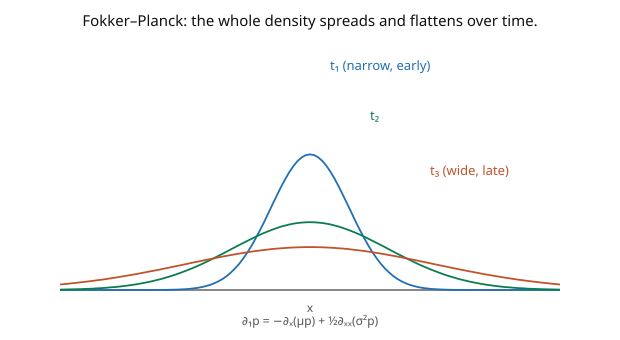

# Stochastic Calculus · Lesson 4.6: Fokker–Planck and the Kolmogorov equations

> ⏱ ~15 min · Module 4: Change of measure and the PDE bridge · Builds on: [4.5 The Feynman–Kac formula](04-05-feynman-kac.md) · Unlocks: [`stat-mech`](../../stat-mech/syllabus.md) (Langevin & diffusion), [`mathematical-finance`](../../mathematical-finance/syllabus.md)

## Why this matters

Feynman–Kac ([4.5](04-05-feynman-kac.md)) evolved an *observable* backward in time. This lesson does the complementary thing: it evolves the **whole probability density forward**. The **Fokker–Planck equation** (a.k.a. the forward Kolmogorov equation) tracks how the distribution of a diffusing particle spreads, drifts, and settles over time — it's the "ensemble" view that statistical mechanics runs on. This is the shared boundary between stochastic calculus and physics: the Langevin SDE for a particle *is* an OU process, and its Fokker–Planck equation's stationary state *is* the Maxwell–Boltzmann distribution. It closes the course by revealing diffusion as one idea wearing two hats — a finance hat (price densities, risk) and a physics hat (heat, Brownian particles, relaxation to equilibrium).

## The idea

Two dual questions about a diffusion $dX = \mu\,dt + \sigma\,dW$:

- **Backward (Feynman–Kac, [4.5](04-05-feynman-kac.md)):** given a payoff at time $T$, what's its expected value as a function of *where you start*? Evolves an observable *backward* using the generator $\mathcal{A}$.
- **Forward (Fokker–Planck):** given where you start now, how does the *probability density* $p(t, x)$ of the particle's position evolve *forward* in time? Uses the **adjoint** generator $\mathcal{A}^*$.

The Fokker–Planck equation is a conservation law for probability: density flows via a **drift current** (the $\mu$ pushes probability along) and a **diffusion current** (the $\sigma^2$ spreads it out). The picture shows the canonical case — Brownian motion, whose density is a Gaussian $\mathcal{N}(0, t)$ that widens as $\sqrt{t}$, flattening over time. That's the heat equation: probability diffuses exactly as heat does.

Two payoffs. First, the transition density solves an explicit PDE you can analyze or simulate. Second, setting $\partial_t p = 0$ gives the **stationary distribution** — the equilibrium the process relaxes to. For an Ornstein–Uhlenbeck process (mean reversion + noise) that stationary density is Gaussian, and in the physical Langevin case it's precisely Maxwell–Boltzmann. Fokker–Planck is how "the noise and the restoring force balance" becomes "the system sits in thermal equilibrium."

## The formal version

For $dX_t = \mu(X_t)\,dt + \sigma(X_t)\,dW_t$, let $p(t, x)$ be the probability density of $X_t$. The **Fokker–Planck (forward Kolmogorov) equation** is

$$\boxed{\;\partial_t\, p(t,x) = -\partial_x\big[\mu(x)\,p(t,x)\big] + \tfrac12\partial_{xx}\big[\sigma(x)^2\,p(t,x)\big] = \mathcal{A}^* p,\;}$$

where $\mathcal{A}^*$ is the **adjoint** of the generator $\mathcal{A} = \mu\partial_x + \tfrac12\sigma^2\partial_{xx}$. *In words:* the density changes by a drift-transport term $-\partial_x(\mu p)$ (probability carried by the drift) plus a diffusion-spreading term $\tfrac12\partial_{xx}(\sigma^2 p)$. It can be written as a **continuity equation** $\partial_t p + \partial_x J = 0$ with probability current $J = \mu p - \tfrac12\partial_x(\sigma^2 p)$ — probability is conserved, only redistributed.

**Backward vs forward duality.** The backward Kolmogorov equation ([4.5](04-05-feynman-kac.md)) is $\partial_t u + \mathcal{A}u = 0$ (acts on the *starting* variable, evolves observables backward); Fokker–Planck is $\partial_t p = \mathcal{A}^* p$ (acts on the *current* variable, evolves densities forward). They are adjoint: $\int (\mathcal{A}f)\,p\,dx = \int f\,(\mathcal{A}^*p)\,dx$.

**Stationary distribution.** A density $p_\infty$ with $\mathcal{A}^* p_\infty = 0$ is **stationary** (invariant): if $X_0 \sim p_\infty$ then $X_t \sim p_\infty$ for all $t$. *In words:* the equilibrium distribution the diffusion relaxes to — the balance point of drift and diffusion.

## Picture

## Worked examples

**Example 1 (Brownian motion is the heat equation).** For BM ($\mu = 0$, $\sigma = 1$), Fokker–Planck becomes

$$\partial_t p = \tfrac12\partial_{xx}p,$$

the **heat/diffusion equation**. Its solution from a point start ($X_0 = 0$) is the Gaussian transition density $p(t, x) = \frac{1}{\sqrt{2\pi t}}e^{-x^2/2t}$ — exactly $\mathcal{N}(0, t)$, the law of $W_t$ ([1.1](01-01-random-walks-to-brownian-motion.md)). **Verify:** $\partial_t p = \big(-\tfrac{1}{2t} + \tfrac{x^2}{2t^2}\big)p$ and $\partial_{xx}p = \big(-\tfrac1t + \tfrac{x^2}{t^2}\big)p$, so $\tfrac12\partial_{xx}p = \big(-\tfrac1{2t} + \tfrac{x^2}{2t^2}\big)p = \partial_t p$. ✓ The density spreads with variance $t$ (width $\sqrt t$) and flattens — heat diffusing from a point source *is* the probability of a Brownian particle. This is the physical origin of the whole subject (Einstein 1905).

**Example 2 (OU relaxes to Maxwell–Boltzmann).** For the Ornstein–Uhlenbeck process $dX = \theta(\mu - X)\,dt + \sigma\,dW$, the stationary density solves $\mathcal{A}^* p_\infty = 0$:

$$-\partial_x\big[\theta(\mu - x)p_\infty\big] + \tfrac12\sigma^2\partial_{xx}p_\infty = 0.$$

The solution is the Gaussian $p_\infty(x) \propto \exp\!\big(-\frac{\theta(x - \mu)^2}{\sigma^2}\big)$ — i.e. $\mathcal{N}\big(\mu, \frac{\sigma^2}{2\theta}\big)$, the stationary law from [3.5](03-05-ornstein-uhlenbeck-process.md), now derived from the *density* equation rather than the solution. In the physical Langevin case ($dV = -\frac{\gamma}{m}V\,dt + \frac{\sqrt{2\gamma k_B T}}{m}\,dW$), this is $\mathcal{N}(0, k_B T/m)$ — the **Maxwell–Boltzmann velocity distribution**, with $\tfrac12 m\langle V^2\rangle = \tfrac12 k_B T$ (equipartition). Fokker–Planck turns "noise balances friction" into "the system thermalizes," and the stationary density is the equilibrium ensemble of statistical mechanics. Diffusion, one idea, two hats.

## Watch out

- **You might apply the generator $\mathcal{A}$ where the adjoint $\mathcal{A}^*$ belongs.** Densities evolve by $\mathcal{A}^*$ (derivatives hit $\mu p$ and $\sigma^2 p$, *inside*); observables evolve by $\mathcal{A}$ (derivatives hit $u$, coefficients outside). For state-*dependent* $\mu(x), \sigma(x)$ the two differ — $\mathcal{A}^*$ has the coefficients *inside* the derivatives. For constant coefficients they nearly coincide, hiding the distinction.
- **You might forget probability is conserved.** Fokker–Planck is a continuity equation: total probability $\int p\,dx = 1$ for all $t$ (no sources/sinks). If your solution's integral drifts from $1$, you've mishandled the boundary terms or the current.
- **You might expect a stationary distribution to always exist.** Brownian motion has *none* — its density $\mathcal{N}(0,t)$ spreads forever (no equilibrium). A stationary density requires a *confining* drift (like OU's mean reversion) to counteract the spreading. No restoring force, no equilibrium.

## One-liner

> The Fokker–Planck equation $\partial_t p = -\partial_x(\mu p) + \tfrac12\partial_{xx}(\sigma^2 p)$ evolves a diffusion's density forward (dual to Feynman–Kac's backward observables); for Brownian motion it's the heat equation, and its stationary state is the equilibrium distribution — Maxwell–Boltzmann for the Langevin particle.

## Problems

**P1 (🟢)** Write the Fokker–Planck equation for geometric Brownian motion $dS = \mu S\,dt + \sigma S\,dW$. (Just substitute $\mu(x) = \mu x$, $\sigma(x) = \sigma x$ into $\partial_t p = -\partial_x(\mu(x)p) + \tfrac12\partial_{xx}(\sigma(x)^2 p)$.)

**P2 (🟡)** Verify that the Gaussian $p(t,x) = \frac{1}{\sqrt{2\pi t}}e^{-x^2/2t}$ (the BM transition density) satisfies the heat equation $\partial_t p = \tfrac12\partial_{xx}p$, and confirm $\int_{-\infty}^\infty p(t,x)\,dx = 1$ for all $t$ (probability conservation).

**P3 (🔴, optional)** Show the OU stationary density $p_\infty(x) \propto e^{-\theta(x-\mu)^2/\sigma^2}$ satisfies $\mathcal{A}^* p_\infty = 0$. *Hint:* write the stationarity condition as zero probability current $J = \theta(\mu - x)p_\infty - \tfrac12\sigma^2 p_\infty' = 0$ and solve the resulting first-order ODE for $p_\infty$.

Solutions

**P1** With $\mu(x) = \mu x$ and $\sigma(x)^2 = \sigma^2 x^2$: $\partial_t p = -\partial_x(\mu x\,p) + \tfrac12\partial_{xx}(\sigma^2 x^2\,p)$. Expanding, $\partial_t p = -\mu\,\partial_x(x p) + \tfrac12\sigma^2\,\partial_{xx}(x^2 p)$. (This governs the lognormal density's evolution; note the coefficients $x, x^2$ sit *inside* the derivatives — the adjoint structure.)

**P2** Heat equation: computed in Example 1 — $\partial_t p = (-\tfrac1{2t} + \tfrac{x^2}{2t^2})p$ and $\tfrac12\partial_{xx}p = (-\tfrac1{2t} + \tfrac{x^2}{2t^2})p$, equal ✓. Conservation: $\int_{-\infty}^\infty \frac{1}{\sqrt{2\pi t}}e^{-x^2/2t}\,dx = 1$ (it's the total mass of a $\mathcal{N}(0,t)$ density, which is $1$ for every $t > 0$). So probability is conserved as the density spreads.

**P3** Stationarity $\mathcal{A}^* p_\infty = 0$ integrates to zero current: $J = \theta(\mu - x)p_\infty - \tfrac12\sigma^2 p_\infty' = 0$ (constant current $= 0$ by decay at $\pm\infty$). Rearrange: $\frac{p_\infty'}{p_\infty} = \frac{2\theta(\mu - x)}{\sigma^2}$. Integrate: $\log p_\infty = \frac{2\theta}{\sigma^2}\big(\mu x - \tfrac{x^2}{2}\big) + C = -\frac{\theta}{\sigma^2}(x - \mu)^2 + C'$. So $p_\infty(x) \propto e^{-\theta(x-\mu)^2/\sigma^2}$, a Gaussian with variance $\frac{\sigma^2}{2\theta}$ (matching $\mathcal{N}(\mu, \sigma^2/2\theta)$, since the exponent is $-\frac{(x-\mu)^2}{2\cdot\sigma^2/2\theta}$). ✓ The stationary density is where drift-transport and diffusion-spreading exactly cancel — equilibrium. ∎

## Flashback

**From Lesson 4.5 (The Feynman–Kac formula):** Write the Feynman–Kac PDE (with terminal condition) for $u(t,x) = \mathbb{E}[g(W_T)\mid W_t = x]$ (Brownian motion, $r = 0$), and name the classical equation it becomes after $\tau = T - t$.

Solution

BM generator $\mathcal{A} = \tfrac12\partial_{xx}$, $r = 0$: the PDE is $\partial_t u + \tfrac12\partial_{xx}u = 0$, $u(T,x) = g(x)$ — the **backward heat equation**. After $\tau = T - t$: $\partial_\tau u = \tfrac12\partial_{xx}u$, the forward **heat equation** with $u(0,x) = g(x)$. (Note: this is the same operator $\tfrac12\partial_{xx}$ as Brownian motion's Fokker–Planck — for BM the forward and backward equations coincide because the generator is self-adjoint, $\mathcal{A} = \mathcal{A}^*$; state-dependent drift breaks that symmetry.) ✓

## Connections

- **Backward:** Fokker–Planck is the forward/adjoint companion to Feynman–Kac's backward equation ([4.5](04-05-feynman-kac.md)); the stationary OU density recovers [3.5](03-05-ornstein-uhlenbeck-process.md)'s $\mathcal{N}(\mu, \sigma^2/2\theta)$; the BM density is the $\mathcal{N}(0,t)$ of [1.1](01-01-random-walks-to-brownian-motion.md)–[1.2](01-02-gaussian-structure-of-bm.md).
- **Forward (beyond this course):** the SDE↔PDE dictionary feeds [`pdes`](../../pdes/syllabus.md) (parabolic equations, probabilistic solutions); the whole toolkit powers [`mathematical-finance`](../../mathematical-finance/syllabus.md) (densities, risk, exotic pricing).
- **Sideways (physics):** this is the **shared boundary with statistical mechanics** ([`stat-mech`](../../stat-mech/syllabus.md)) — the Langevin equation is an OU-type SDE, its Fokker–Planck equation relaxes to Maxwell–Boltzmann, and the fluctuation–dissipation theorem ties the noise strength to temperature. Diffusion is one mathematics wearing a finance hat and a physics hat — the closing theme of the course.
