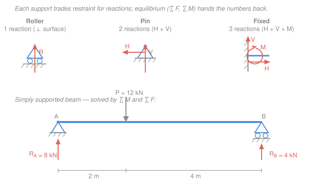

# Structural Analysis · Lesson 1.2: Supports, reactions & static determinacy

> ⏱ ~15 min · Module 1: Structural forms & analysis foundations · Builds on: [1.1 Structural forms, loads & idealization](01-01-structural-forms-loads-idealization.md), [`statics` 1.5 Rigid-body equilibrium & supports](../../statics/lessons/01-05-rigid-body-equilibrium-supports.md) · Unlocks: [1.3 Internal forces](01-03-internal-forces-shear-bending-moment.md), 1.4 (shear & moment diagrams), Module 3 (indeterminacy)

## Why this matters

Before you can find a single internal force, bending stress, or deflection, you need the **reactions** — the forces the ground and connections push back with. And before you spend effort solving for them, you must answer a prior question: *can* statics alone find them? Some structures hand you exactly enough equations (**determinate**); some have more unknowns than equations and need the deflection machinery of Modules 2–3 (**indeterminate**); and some, alarmingly, have enough reactions on paper but still collapse (**unstable**). This lesson is the triage step you run on *every* structure before touching it.

## The idea

A support is a promise: "I will stop the structure from moving in these directions." Each direction it blocks costs it a **reaction** — an unknown force (or moment) you'll have to solve for. A **roller** stops motion in one direction only (perpendicular to its surface), so it supplies **one** reaction. A **pin** stops sliding in both directions but lets the member spin freely about the pin, so it supplies **two** reactions (horizontal + vertical) and **no** moment. A **fixed** support clamps everything — no translation, no rotation — so it supplies **three** reactions (horizontal, vertical, and a moment). More restraint, more reactions.

Now the balance sheet. A rigid planar body has exactly **three** ways to move: slide horizontally, slide vertically, spin. Statics gives you one equilibrium equation to kill each motion — three equations, no more. So the whole game is counting: if the number of reaction unknowns equals the number of equations, statics closes the books exactly (**determinate**). More unknowns than equations, and statics alone can't finish (**indeterminate**) — the extra "redundant" supports share load in a way that depends on how the structure *stretches*, which is Module 3's job. Fewer unknowns than equations, and some motion is unstopped: it's a **mechanism** that moves. One subtlety saves lives: you can have the right *count* and still be unstable if the reactions are badly arranged — all parallel, or all aimed through one point.

## The formal version

**Support reactions (planar).** Reaction counts $r$ per support:

| Support | Blocks | Reactions $r$ |
|---|---|---|
| Roller | translation ⟂ to surface | 1 (normal force $N$) |
| Pin | translation (both directions) | 2 ($H$, $V$) |
| Fixed | translation + rotation | 3 ($H$, $V$, moment $M$) |

*In words: count the independent motions each support forbids — that's how many reactions it adds.*

**Equilibrium.** For a planar structure, three scalar equations must hold:

$$\sum F_x = 0, \qquad \sum F_y = 0, \qquad \sum M = 0.$$

*In words: no net horizontal push, no net vertical push, no net twist.* $F_x, F_y$ are force components (kN); $M$ is moment about any point (kN·m) — you may take moments about any point you like, and choosing one that a load passes through deletes it from the equation.

**Condition (release) equations.** An **internal hinge** connects two members but transmits *no moment* across the joint — like a door hinge. Each internal hinge adds one extra equation: the sum of moments of everything on **one side** of the hinge, taken **about the hinge**, is zero. Call the number of such extra equations $c$ (for *condition*). So a single connected body with $h$ internal hinges gives $3 + c$ usable equations, with $c = h$.

**Determinacy & stability — beams and frames.** Let $r$ = total reaction unknowns, $c$ = condition equations. For a single rigid body:

$$
\text{degree of indeterminacy} = r - (3 + c).
$$

- $r = 3 + c$ → **statically determinate** (statics alone finds every reaction).
- $r > 3 + c$ → **statically indeterminate**, to degree $r - (3+c)$ (needs compatibility — Module 3).
- $r < 3 + c$ → **unstable / mechanism** (not enough restraint; it moves).

*In words: compare reaction unknowns against available equations; equal is solvable, more is redundant, fewer collapses.* (The general multi-body form is $(3m + r) - (3n + c)$ for $m$ members, $n$ nodes; we'll use it when we reach frames. For one body it reduces to the boxed rule above.)

**Determinacy — trusses.** A pin-jointed truss with $m$ members, $r$ reactions, $j$ joints:

$$m + r = 2j \;\Rightarrow\; \text{determinate}, \qquad m + r > 2j \;\Rightarrow\; \text{indeterminate}, \qquad m + r < 2j \;\Rightarrow\; \text{unstable}.$$

*In words: each joint gives two equations ($\sum F_x=\sum F_y=0$); the unknowns are the $m$ member forces plus $r$ reactions.* This is the counting behind [`statics` 2.1 method of joints](../../statics/lessons/02-01-trusses-method-of-joints.md).

**Geometric instability.** Counting is necessary, not sufficient. Even with $r \ge 3 + c$, a structure is unstable if its reaction lines of action are **all parallel** (nothing resists motion across them) or **all concurrent** — meeting at one point (nothing resists rotation about that point). *In words: reactions must be enough **and** pointed in genuinely different, non-crossing directions.*

## Picture

## Worked examples

**Example 1 (find the reactions — simply supported beam).** A beam of span $L = 8\ \mathrm{m}$ has a pin at $A$ ($x=0$) and a roller at $B$ ($x=8\ \mathrm{m}$). A point load $P = 30\ \mathrm{kN}$ acts downward at $x = 3\ \mathrm{m}$. Find the reactions.

Unknowns: $A_x, A_y$ (pin) and $B_y$ (roller) — three unknowns, three equations, determinate ($r = 3 = 3 + 0$).

Horizontal first — no horizontal loads, so

$$\sum F_x = 0 \;\Rightarrow\; A_x = 0.$$

Take moments about $A$ (this deletes $A_x, A_y$, leaving one equation in $B_y$). Taking counterclockwise as positive, the load's moment is clockwise ($-$), the roller's is counterclockwise ($+$):

$$\sum M_A = 0 \;\Rightarrow\; B_y(8) - 30(3) = 0 \;\Rightarrow\; B_y = \frac{90}{8} = 11.25\ \mathrm{kN}\ (\uparrow).$$

Then vertical balance:

$$\sum F_y = 0 \;\Rightarrow\; A_y + B_y - 30 = 0 \;\Rightarrow\; A_y = 30 - 11.25 = 18.75\ \mathrm{kN}\ (\uparrow).$$

*Check.* Moments about $B$ (an independent check): $A_y(8) - 30(5) = 18.75(8) - 150 = 150 - 150 = 0$ ✓. Units: kN·m throughout ✓. Sanity: the load sits nearer $A$, so $A$ carries more ($18.75 > 11.25$) — as it should. The two reactions sum to $30\ \mathrm{kN}$, the total load ✓.

**Example 2 (classify before you solve).** Three beams, same span, different supports. For each, count $r$ and $c$, then apply $r - (3+c)$.

- **(a) Propped cantilever** — fixed at $A$, roller at $B$. Reactions: fixed gives 3, roller gives 1, so $r = 4$; no hinges, $c = 0$. Degree $= 4 - (3+0) = 1$. **Statically indeterminate, degree 1.** The roller is one support more than statics needs — the classic redundant prop (revisited in [`mechanics-of-materials` 3.3](../../mechanics-of-materials/lessons/03-03-statically-indeterminate-beams.md) and our Module 3).

- **(b) Simple beam** — pin at $A$, roller at $B$. $r = 2 + 1 = 3$, $c = 0$. Degree $= 3 - 3 = 0$. **Statically determinate** — exactly Example 1.

- **(c) Beam on three rollers** — three rollers, all vertical. $r = 3$, $c = 0$, so the *count* says $3 - 3 = 0$, "determinate." **But** all three reactions are vertical and parallel: nothing resists horizontal motion. $\sum F_x = 0$ becomes $0 = 0$ — it can't stop a horizontal nudge. **Geometrically unstable** (a mechanism in $x$), despite passing the count.

*Check.* Verdicts line up with intuition: clamping one end and propping the far one is clearly "extra" (indeterminate); pin-plus-roller is the textbook determinate beam; three parallel rollers obviously slide sideways. The count flags (a) and (b) correctly but *cannot* catch (c) — you must also look at reaction *directions*.

## Watch out

- **You might think a pin supplies three reactions like a fixed support.** It doesn't — a pin lets the member **rotate**, so it carries **no moment**: two reactions only ($H$, $V$). Only a *fixed* (clamped) support resists rotation and adds the third, a moment reaction.
- **You might think "enough reactions" guarantees stability.** Example 2(c) is the counterexample: $r = 3$ yet it slides. Parallel or concurrent reactions are geometrically unstable no matter the count. Always sanity-check that the reactions point in independent directions.
- **You might forget that an internal hinge *adds* an equation, not an unknown.** A hinge is a release: it lets you write one extra moment equation ($c$ goes up by 1), which is why a structure with more supports can still be determinate once you cut it with hinges. Miscounting $c$ flips your verdict.

## One-liner

> Reactions are what supports charge for restraint; a structure is determinate when those unknowns exactly equal your equations ($r = 3 + c$ for a body, $m + r = 2j$ for a truss) — provided the reactions don't all point parallel or through one point.

## Problems

**P1 (🟢)** A beam of span $6\ \mathrm{m}$ has a pin at $A$ ($x=0$) and a roller at $B$ ($x=6\ \mathrm{m}$). A downward point load of $18\ \mathrm{kN}$ acts at $x = 4\ \mathrm{m}$. Find $A_x$, $A_y$, and $B_y$.

**P2 (🟡)** Classify each as determinate, indeterminate (give the degree), or unstable:
(a) A beam fixed at $A$, roller at $B$, with **one internal hinge** between them.
(b) A truss with $m = 13$ members, $r = 3$ reactions, $j = 8$ joints.

**P3 (🔴)** A rigid beam is held by **three links** (each a two-force member, supplying one reaction along its own axis). The counting gives $r = 3$, $c = 0$, so $r - (3+c) = 0$ — "determinate." Yet the three link axes, when extended, all pass through a single point $O$. Is the beam stable? Justify with an equilibrium equation.

Solutions

**P1** Unknowns $A_x, A_y, B_y$; three equations, determinate.

No horizontal loads: $\sum F_x = 0 \Rightarrow A_x = 0$.

Moments about $A$ (counterclockwise positive; the load is clockwise, $B_y$ counterclockwise):

$$\sum M_A = 0 \;\Rightarrow\; B_y(6) - 18(4) = 0 \;\Rightarrow\; B_y = \frac{72}{6} = 12\ \mathrm{kN}\ (\uparrow).$$

Vertical balance:

$$\sum F_y = 0 \;\Rightarrow\; A_y = 18 - 12 = 6\ \mathrm{kN}\ (\uparrow).$$

*Check.* Moments about $B$: $A_y(6) - 18(2) = 36 - 36 = 0$ ✓. Load is nearer $B$, so $B$ carries more ($12 > 6$) ✓, and $6 + 12 = 18\ \mathrm{kN}$ = total load ✓.

**P2**
(a) Fixed (3) + roller (1) → $r = 4$. One internal hinge → $c = 1$. Degree $= r - (3+c) = 4 - (3+1) = 0$. **Statically determinate.** (The hinge's extra moment equation exactly absorbs the roller's extra reaction — remove the hinge and it would be indeterminate to degree 1, as in Example 2(a).)

(b) Truss test: $m + r = 13 + 3 = 16$, and $2j = 2(8) = 16$. Since $m + r = 2j$, it is **statically determinate** (assuming the members are arranged so it isn't a partial mechanism — the count is satisfied).

*Check.* Both verdicts hinge only on counting; (a) needed the hinge to bring $c$ from 0 to 1, which is the whole point of the condition equation.

**P3** **Not stable — it is geometrically unstable.** Take moments about the point $O$ where all three link axes meet. Each link's force acts *along its own axis*, and every axis passes through $O$, so each reaction has **zero moment arm about $O$**: every reaction contributes $0$ to $\sum M_O$. Then

$$\sum M_O = M_{\text{applied about }O} + 0 + 0 + 0,$$

so the reactions cannot balance any applied moment about $O$ — the beam is free to rotate infinitesimally about $O$. This is the **concurrent-reactions** instability: the count ($r = 3 + c$) is met, but because the reaction lines are concurrent they can't resist rotation about their common point.

*Check.* This is the rotational twin of Example 2(c)'s parallel case (which failed $\sum F_x$); here concurrency makes $\sum M_O$ powerless. Both show the count is necessary but not sufficient — reaction *geometry* matters.

## Connections

- **Backward:** this is [`statics` 1.5](../../statics/lessons/01-05-rigid-body-equilibrium-supports.md)'s support-and-equilibrium bookkeeping, now organized into a *determinacy test* you run before analyzing. The idealized members and loads you're supporting came from [1.1](01-01-structural-forms-loads-idealization.md).
- **Forward:** determinate reactions are the input to [1.3 internal forces](01-03-internal-forces-shear-bending-moment.md) and 1.4's shear & moment diagrams — you can't cut a section until you know what the supports push with. The truss count $m + r = 2j$ sets up [1.5 trusses & determinate frames](01-05-trusses-determinate-frames.md). Every *indeterminate* verdict here is a promissory note redeemed in Module 3 (force method, slope-deflection, moment distribution).
- **Sideways:** the "more unknowns than equations" situation is exactly [`mechanics-of-materials` 1.4 statically indeterminate axial](../../mechanics-of-materials/lessons/01-04-statically-indeterminate-axial.md) and [3.3 indeterminate beams](../../mechanics-of-materials/lessons/03-03-statically-indeterminate-beams.md) — that course solved single members by adding a compatibility (deformation) equation; this course scales the same idea to whole frames and trusses.
