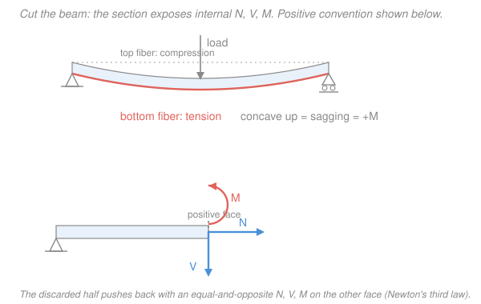

# Structural Analysis · Lesson 1.3: Internal Forces in Beams — Shear & Bending Moment

> ⏱ ~15 min · Module 1: Determinate Structures & Internal Forces · Builds on: [1.2 Supports, Reactions & Determinacy](01-02-supports-reactions-determinacy.md), [`statics` 4.1 Internal forces](../../statics/lessons/04-01-internal-forces-normal-shear-bending.md), [`mechanics-of-materials` 2.3 Shear & moment diagrams](../../mechanics-of-materials/lessons/02-03-shear-moment-diagrams.md) · Unlocks: [1.4 Shear & bending-moment diagrams](01-04-shear-bending-moment-diagrams.md)

## Why this matters

Reactions (Lesson 1.2) tell you what the supports push back with — but they say nothing about what's happening *inside* the beam at the point where it's about to crack. A beam fails at its most heavily loaded cross-section, and "most heavily loaded" means the section carrying the largest **bending moment**. Before you can size a beam, check a stress, or draw the diagrams that dominate the rest of this course, you need one skill: reach into the beam at any point $x$ and read off the internal **axial force $N$**, **shear $V$**, and **bending moment $M$**. That's what the method of sections does, and it rests on one idea you already own — equilibrium.

## The idea

A beam in equilibrium is in equilibrium *everywhere*, including any imaginary slice through it. So here's the trick: pick a point, **cut the beam there**, and throw one half away. The half you keep is now a free body — except the material you deleted used to hold it together, so you must replace that material with the forces it was transmitting across the cut. Those forces *are* the internal forces. Whatever it takes to keep your leftover chunk from flying apart or spinning — that's exactly what the beam was carrying internally at that spot.

At a planar cut there are exactly three of them: a pull-or-push along the beam's axis (**axial $N$**), a slide-across-the-face force (**shear $V$**), and a bend-the-beam couple (**bending moment $M$**). You already know how to find three unknowns from a free body — $\sum F_x = 0$, $\sum F_y = 0$, $\sum M = 0$. Method of sections is nothing more than that, applied to half a beam.

The one genuinely new thing is a **sign convention**. "$V = 5$" is meaningless until we agree which direction counts as positive, and — crucially — everyone agrees on the *same* one, so a positive moment always means the beam is smiling.

## The formal version

**Method of sections.** To find the internal forces at a section a distance $x$ along the beam:

1. Find the support reactions from a free body of the *whole* beam (Lesson 1.2).
2. Cut the beam at $x$ and keep one side. Draw its free-body diagram, replacing the removed side with unknowns $N$, $V$, $M$ drawn in their **positive** senses.
3. Solve $\sum F_x = 0,\ \sum F_y = 0,\ \sum M = 0$ for $N$, $V$, $M$.

*In words: slice the beam, keep half, and let equilibrium of that half tell you what the missing half was doing.* Keep whichever side has fewer loads — often the cantilever's free end — and you skip step 1 entirely.

**The sign convention (live by this one).** Define positive internal forces on the exposed face like so:

- **Axial $N$** (units: kN) is positive in **tension** — it pulls *away* from the cut face.
- **Shear $V$** (kN) is positive when it acts so as to rotate the kept segment **clockwise**: **down on a left segment's right face, up on a right segment's left face** ("left-up, right-down" describes the pair). *In words: positive shear is the sense that would spin a little chunk clockwise.*
- **Bending moment $M$** (kN·m) is positive in **sagging** — concave up, so the **bottom fibre is in tension** and the top is in compression. *In words: a positive moment makes the beam smile; a negative (hogging) moment makes it frown.*

$$N,\ V,\ M \ \text{are functions of } x,\quad\text{piecewise between load discontinuities.}$$

*In words: as you slide the cut along the beam, $N$, $V$, $M$ change; a point load or a support breaks the formula, so you write a separate expression on each interval between such events.* Every point load, reaction, or start/end of a distributed load begins a new region, and you must set up $V(x)$ and $M(x)$ region by region.

Two consistency checks you'll prove in [1.4](01-04-shear-bending-moment-diagrams.md) and can already use to sanity-check any result:

$$\frac{dV}{dx} = -w(x), \qquad \frac{dM}{dx} = V(x),$$

where $w$ (kN/m) is the downward distributed load. *In words: shear is the running tally of transverse load, and the moment's slope is the shear.* Where $V = 0$, $M$ is stationary — that's where $M_{\max}$ hides.

## Picture

The top shows the sagging (positive-$M$) convention — concave up, bottom fibre stretched. The bottom is an exploded left segment: its **positive face** carries $N$ pulling right (tension), $V$ pointing down, and $M$ curling counterclockwise (the sense that sags the beam). The half you deleted pushes back with an equal-and-opposite trio on the matching face.

## Worked examples

**Example 1 — simply supported beam, central point load.** Span $L$, a downward load $P$ at midspan, pin at $A$ ($x=0$), roller at $B$ ($x=L$). By symmetry the reactions are

$$R_A = R_B = \tfrac{P}{2}\ (\text{up}).$$

There are no axial loads, so $N(x) = 0$ everywhere. Two regions, split at the load.

*Region AC, $\ 0 < x < L/2$.* Cut at $x$, keep the left piece; it carries only $R_A$. Taking up as positive and $V$ down on the right (positive) face:

$$\sum F_y = 0:\quad R_A - V = 0 \ \Rightarrow\ V(x) = \tfrac{P}{2}.$$

$$\sum M_{\text{cut}} = 0:\quad M(x) - R_A\,x = 0 \ \Rightarrow\ M(x) = \tfrac{P}{2}\,x.$$

*Region CB, $\ L/2 < x < L$.* Now the left piece also carries the load $P$ at $x = L/2$:

$$V(x) = R_A - P = \tfrac{P}{2} - P = -\tfrac{P}{2}, \qquad M(x) = R_A\,x - P\!\left(x - \tfrac{L}{2}\right) = \tfrac{P}{2}(L - x).$$

The shear jumps from $+P/2$ to $-P/2$ across the load — it passes through zero *at* the load, so that's where the moment peaks:

$$M_{\max} = M\!\left(\tfrac{L}{2}\right) = \frac{P}{2}\cdot\frac{L}{2} = \boxed{\dfrac{PL}{4}}\ \ (\text{sagging}).$$

*Check.* $M$ is continuous at $x=L/2$ (both regions give $PL/4$) and zero at both supports, as it must be at a pin and a roller. $dM/dx = P/2 = V$ in region AC and $-P/2 = V$ in CB ✓. Units: $[P][L] = \mathrm{kN\cdot m}$ ✓.

**Example 2 — cantilever with a tip load.** Fixed at $A$ ($x=0$), free at $B$ ($x=L$), downward load $P$ at the tip. Here's the payoff of choosing your side: **keep the right (free-end) piece** and you never compute the wall reactions.

Cut at $x$; the kept piece runs from the section to $B$ and carries only $P$ down, a distance $(L-x)$ beyond the cut.

- *Shear.* That piece has net downward force $P$, so the section transmits a shear of magnitude $P$. With $x$ measured from the wall the convention gives $V(x) = +P$ — **constant** along the beam.
- *Moment.* The tip load, acting $(L-x)$ past the cut, bends this stretch **concave down** (hogging) — its magnitude is $P(L-x)$, and hogging is negative:

$$M(x) = -P\,(L - x) = -PL + Px.$$

At the wall, $M(0) = -PL$ (maximum hogging); at the tip, $M(L) = 0$, as a free end must be. So $M$ rises linearly from $-PL$ to $0$.

*Check.* $dM/dx = +P = V$ ✓, consistent with a constant shear. The sign is doing real work here: $M_A = -PL$ is *negative*, telling you the **top** fibre at the wall is in tension — which is exactly where a cantilever cracks, and the opposite face from Example 1's sagging beam. Units: $\mathrm{kN\cdot m}$ ✓.

## Watch out

- **You might think you can compute $M$ without ever finding the reactions.** Only if you keep the load-free side (like the cantilever's tip). If both sides carry applied loads — as in any simply supported beam — you must find the reactions first; there's no shortcut around Lesson 1.2.
- **You might carry the sign convention loosely and let "$M = -PL$" feel like a smaller number than "$M = +PL/4$".** It isn't about magnitude — the sign encodes *which fibre is in tension*. Positive/sagging stretches the bottom; negative/hogging stretches the top. Get the sign wrong and you'll reinforce the wrong face of a real beam.
- **You might write one $M(x)$ for the whole beam.** Every point load, reaction, and edge of a distributed load starts a **new region**. In Example 1 the single formula $M = \tfrac{P}{2}x$ is only valid up to midspan; past the load it's a different line. Always state the interval each expression covers.

## One-liner

> Cut the beam, keep half, and let $\sum F = 0,\ \sum M = 0$ hand you the internal $N$ (tension +), $V$ (left-up-right-down +), and $M$ (sagging +) — region by region between loads.

## Problems

**P1 (🟢)** A simply supported beam spans $L = 6\ \mathrm{m}$ with a downward point load $P = 12\ \mathrm{kN}$ at midspan. Find the reactions, the shear just left and just right of the centre, and the maximum bending moment.

**P2 (🟡)** A simply supported beam $AB$ spans $L = 8\ \mathrm{m}$ (pin at $A$, roller at $B$) and carries a downward point load $P = 10\ \mathrm{kN}$ at $x = 2\ \mathrm{m}$ from $A$. Find the reactions, write $V(x)$ and $M(x)$ in **both** regions, and give the moment under the load.

**P3 (🔴, optional)** A simply supported beam of span $L$ carries a single downward point load $P$ a distance $a$ from the left support ($b = L - a$ from the right). Show that the bending moment is maximum *under the load* and equals $M_{\max} = \dfrac{P\,a\,b}{L}$. (This is the number the flexure formula in [`mechanics-of-materials` 2.4](../../mechanics-of-materials/lessons/02-04-flexure-formula.md) turns into a peak stress.)

Solutions

**P1** Symmetry gives $R_A = R_B = P/2 = 6\ \mathrm{kN}$ up. In the left half a cut sees only $R_A$:

$$V = R_A = +6\ \mathrm{kN}\ \ (\text{just left of centre}).$$

Just right of centre the load $P$ has been passed: $V = R_A - P = 6 - 12 = -6\ \mathrm{kN}$. The shear passes through zero at the load, so

$$M_{\max} = \frac{PL}{4} = \frac{12 \times 6}{4} = 18\ \mathrm{kN\cdot m}\ \ (\text{sagging}).$$

*Check.* $V$ jumps by $-P = -12\ \mathrm{kN}$ across the load ($+6 \to -6$) ✓. $M_{\max} = R_A \cdot \tfrac{L}{2} = 6 \times 3 = 18\ \mathrm{kN\cdot m}$ ✓. Units $\mathrm{kN\cdot m}$ ✓.

**P2** Reactions by moments about $B$ (counterclockwise +), with $P$ a distance $6\ \mathrm{m}$ from $B$:

$$\sum M_B = 0:\quad R_A(8) - 10(6) = 0 \ \Rightarrow\ R_A = \tfrac{60}{8} = 7.5\ \mathrm{kN}, \qquad R_B = 10 - 7.5 = 2.5\ \mathrm{kN}.$$

*Region $0 < x < 2$* (left piece carries only $R_A$):

$$V(x) = R_A = +7.5\ \mathrm{kN}, \qquad M(x) = R_A\,x = 7.5\,x\ \ (\mathrm{kN\cdot m}).$$

*Region $2 < x < 8$* (left piece also carries $P$ at $x = 2$):

$$V(x) = R_A - P = 7.5 - 10 = -2.5\ \mathrm{kN}, \qquad M(x) = 7.5\,x - 10(x - 2) = -2.5\,x + 20\ \ (\mathrm{kN\cdot m}).$$

Moment under the load ($x = 2$): $M = 7.5 \times 2 = 15\ \mathrm{kN\cdot m}$.

*Check.* Continuity at $x = 2$: region 1 gives $7.5(2) = 15$; region 2 gives $-2.5(2) + 20 = 15$ ✓. Ends: $M(0) = 0$, $M(8) = -2.5(8) + 20 = 0$ ✓ (pin and roller). $dM/dx = 7.5 = V$ then $-2.5 = V$ ✓. Shear jump at the load $= -10\ \mathrm{kN} = -P$ ✓.

**P3** Reactions by moments about $B$: $R_A = \dfrac{Pb}{L}$, $R_B = \dfrac{Pa}{L}$. In the left region $0 < x < a$ the cut sees only $R_A$, so $V(x) = R_A = Pb/L > 0$; in the right region $a < x < L$, $V = R_A - P = \dfrac{Pb}{L} - P = -\dfrac{Pa}{L} < 0$. The shear is positive left of the load and negative right of it, so it crosses zero **at the load** — and since $dM/dx = V$, that's where $M$ is stationary and maximal. Evaluate $M$ there using the left region:

$$M_{\max} = R_A\,a = \frac{Pb}{L}\cdot a = \boxed{\dfrac{P\,a\,b}{L}}.$$

*Check.* Set $a = b = L/2$ (central load): $M_{\max} = P\cdot\tfrac{L}{2}\cdot\tfrac{L}{2} / L = PL/4$, matching Example 1 ✓. Dimensions: $[P]\,[a]\,[b]/[L] = \mathrm{kN\cdot m}$ ✓. Symmetry: swapping $a \leftrightarrow b$ leaves $M_{\max}$ unchanged, as it must for a mirror-image beam ✓.

## Flashback

**From Lesson 1.2 (Supports, Reactions & Determinacy):** A horizontal beam has a **pin** at $A$ and a **roller** at $B$. (a) Is it statically determinate, and is it stable? (b) A second **roller** is now added at an interior point $C$. Reclassify the beam and state its degree of static indeterminacy.

Solution

**(a)** A pin supplies $2$ reaction components, a roller supplies $1$, so $r = 3$. A single rigid planar body has $3$ equilibrium equations, so with $r = 3$ the beam is **statically determinate** — reactions are found from equilibrium alone. It is **stable** provided the reactions are neither all parallel nor all concurrent; here the pin's two components and the roller's line of action are not parallel and don't meet at a single point, so it is stable.

**(b)** Adding a roller raises the reactions to $r = 2 + 1 + 1 = 4$, still against $3$ equations. Degree of indeterminacy:

$$\text{degree} = r - (3 + c) = 4 - (3 + 0) = 1.$$

The beam is **statically indeterminate to the first degree** — one reaction too many for equilibrium to resolve. (That extra unknown is what Module 3's force and slope-deflection methods exist to handle; Modules 1–2 stay in determinate territory.)

*Check.* Reaction count vs. equations: $4 > 3$ by exactly $1$, matching degree $= 1$ ✓.

## Connections

- **Backward:** step 1 of the method of sections *is* Lesson 1.2 — you need the reactions before you can cut. And the internal $N$, $V$, $M$ are the same three quantities introduced abstractly in [`statics` 4.1](../../statics/lessons/04-01-internal-forces-normal-shear-bending.md); this lesson pins down the structural-engineering sign convention (sagging-positive) you'll use for the rest of the course.
- **Forward:** [1.4 Shear & bending-moment diagrams](01-04-shear-bending-moment-diagrams.md) plots $V(x)$ and $M(x)$ over the whole beam and proves the relations $\frac{dV}{dx} = -w$, $\frac{dM}{dx} = V$ that let you draw diagrams without cutting at every point. Those diagrams then feed everything downstream: Module 2 integrates $M(x)$ to get deflections ([2.1](02-01-elastic-curve-double-integration.md)).
- **Sideways (mechanics of materials):** the peak $M$ you extract here is the input to the flexure formula $\sigma = Mc/I$ in [`mechanics-of-materials` 2.4](../../mechanics-of-materials/lessons/02-04-flexure-formula.md) — the bridge from "how much moment" to "how much stress," and ultimately to whether the beam survives. That course drew the same diagrams for single members ([2.3](../../mechanics-of-materials/lessons/02-03-shear-moment-diagrams.md)); here they become the routine first move on every structure, including the frames and continuous beams to come.
