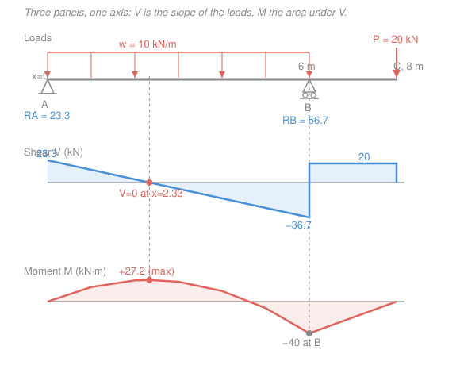

# Structural Analysis · Lesson 1.4: Shear & Bending-Moment Diagrams

> ⏱ ~15 min · Module 1: Statics of Structures · Builds on: [1.3 Internal forces: shear & bending moment](01-03-internal-forces-shear-bending-moment.md), [`mechanics-of-materials` 2.3 Shear & moment diagrams](../../mechanics-of-materials/lessons/02-03-shear-moment-diagrams.md) · Unlocks: Module 2 (deflection needs $M(x)$), Boss problem 1

## Why this matters

In [1.3](01-03-internal-forces-shear-bending-moment.md) you learned to cut a beam at one section and read off the internal shear $V$ and bending moment $M$ there. But a beam doesn't fail at "one section" — it fails at the *worst* section, and you rarely know in advance where that is. The **shear and bending-moment diagrams** are $V(x)$ and $M(x)$ plotted along the whole beam, so the peaks jump out at a glance. Every downstream tool needs them: the flexure stress is $\sigma = Mc/I$, so the largest $M$ sets the required beam size; the deflection in Module 2 integrates $M(x)$ twice. Draw these two curves well and the rest of the course is bookkeeping.

## The idea

You *could* re-cut the beam at fifty different $x$ values and plot the results. Don't. There's a shortcut hiding in the equilibrium equations: the loads, the shear, and the moment are linked by calculus, each the slope of the next.

Picture walking left-to-right along the beam carrying a running total. The **shear** is a running total of vertical load: start at the left reaction, and every bit of downward load you pass *subtracts* from it. So a downward distributed load makes $V$ slope *down*; a point load makes $V$ *drop off a cliff*. The **moment** is a running total of the shear: wherever shear is positive, $M$ climbs; wherever shear is negative, $M$ falls. So $M$ peaks exactly where $V$ passes through zero — the moment stops climbing the instant the shear that fed it runs out.

That's the whole method. You almost never plug numbers into a formula; you *draw* $V$ straight from the loads, then draw $M$ as the accumulating area under $V$.

## The formal version

Take a beam element of width $dx$ carrying a distributed load $w$ (kN/m, positive **downward**), with shear $V$ (kN) and bending moment $M$ (kN·m) using the sagging-positive convention from [1.3](01-03-internal-forces-shear-bending-moment.md). Vertical and moment equilibrium of that sliver give the two **load–shear–moment relations**:

$$\frac{dV}{dx} = -w, \qquad \frac{dM}{dx} = V.$$

*In words: the slope of the shear diagram at any point is minus the distributed load there; the slope of the moment diagram is the shear there.* Two consequences fall right out:

- **$M$ is extreme where $V = 0$.** Setting $dM/dx = V = 0$ locates every interior maximum or minimum of $M$ — the number you're usually hunting for.
- **Curvature of $M$ follows the load.** Since $d^2M/dx^2 = dV/dx = -w$, a downward UDL bends the moment curve into a *downward* (sagging) parabola.

Integrating between two points $x_1$ and $x_2$ turns slopes into the **area rule**:

$$\Delta V = V_2 - V_1 = -\int_{x_1}^{x_2} w\,dx, \qquad \Delta M = M_2 - M_1 = \int_{x_1}^{x_2} V\,dx.$$

*In words: the change in shear across a stretch equals minus the load area on it; the change in moment equals the area under the shear diagram on it.* Concentrated actions are the exceptions the integrals can't see:

- A **downward point load** $P$ makes $V$ **jump down** by $P$ (an upward reaction jumps it up). No area, just a step.
- An **applied couple** $M_0$ makes $M$ **jump** by $M_0$. It leaves $V$ untouched.

A useful sign-shape table for the common load cases:

| On a segment | $w$ | $V$ slope $dV/dx=-w$ | $M$ shape ($dM/dx=V$) |
|---|---|---|---|
| No load | $0$ | flat ($V$ constant) | straight line |
| Uniform load (down) | const $>0$ | constant negative (line down) | parabola, sagging |
| Under a point load | — | vertical jump | slope kink |
| Under a couple | — | no change | vertical jump |

## Picture

Read it top-down: the loads set the *slope* of $V$ (the UDL tilts it down, the roller reaction snaps it back up, the tip load drops it to zero at the free end); the *area* under $V$ builds $M$. The sagging peak sits under the $V=0$ crossing; the hogging dip at $B$ comes from the overhang.

## Worked examples

**Example 1 — Boss problem 1: the overhang beam (do this one slowly).**
A beam has a pin at $A$ ($x=0$) and a roller at $B$ ($x=6\ \mathrm{m}$), then cantilevers out to a free end $C$ at $x=8\ \mathrm{m}$. A uniform load $w=10\ \mathrm{kN/m}$ (down) covers $AB$; a point load $P=20\ \mathrm{kN}$ (down) hangs at $C$.

**Step 1 — reactions.** The UDL resultant is $10\times 6 = 60\ \mathrm{kN}$ acting at its centroid $x=3\ \mathrm{m}$. Take moments about $A$ (counterclockwise positive):

$$\sum M_A = R_B(6) - 60(3) - 20(8) = 0 \;\Rightarrow\; 6R_B = 180 + 160 = 340 \;\Rightarrow\; R_B = 56.67\ \mathrm{kN}.$$

Vertical equilibrium: $R_A + R_B = 60 + 20 = 80$, so $R_A = 80 - 56.67 = 23.33\ \mathrm{kN}$. Both up. ✓

**Step 2 — shear diagram, left to right.** Start at $A$: the reaction lifts $V$ to $+23.33$. Over $AB$, $w=10$ gives slope $dV/dx=-10$, a straight line down:

$$V(x) = 23.33 - 10x \quad (0 \le x \le 6).$$

It hits zero at $x = 23.33/10 = 2.33\ \mathrm{m}$ — mark this, it's where $M$ peaks. At $B^-$, $V = 23.33 - 60 = -36.67\ \mathrm{kN}$. The roller reaction jumps $V$ up by $56.67$: $V(B^+) = -36.67 + 56.67 = +20\ \mathrm{kN}$. Over the overhang $BC$ there's no load, so $V$ stays flat at $+20$ until the tip load $P=20$ drops it to $0$ at $C$ — exactly closing the diagram, as a free end must. ✓

**Step 3 — moment diagram as area under $V$.** $M=0$ at the pin. Accumulate:

- $A$ to $x=2.33$: area of the positive shear triangle, $\tfrac12(2.33)(23.33) = 27.2$. So $M_{\max}^+ = +27.2\ \mathrm{kN\cdot m}$ at $x=2.33\ \mathrm{m}$.
- $x=2.33$ to $B$: negative triangle, $\tfrac12(6-2.33)(-36.67) = \tfrac12(3.67)(-36.67) = -67.2$. So $M_B = 27.2 - 67.2 = -40\ \mathrm{kN\cdot m}$ (hogging — the overhang pries the beam up over the support).
- $B$ to $C$: rectangle $\ 20 \times 2 = +40$, bringing $M$ from $-40$ back to $0$ at the free end. ✓

Over $AB$ the curve is a sagging parabola (since $w>0$); over $BC$ it's a straight line (since $V$ is constant). You can check $M_B$ independently by cutting at $B$ and looking right: only $P$ acts on segment $BC$, giving $M_B = -P(2) = -40\ \mathrm{kN\cdot m}$. ✓

**Sanity check.** Units: shear areas are $\mathrm{kN}\times\mathrm{m}=\mathrm{kN\cdot m}$ ✓. The diagram opens and closes at zero moment at both a pin and a free end, as required. The largest magnitude is $|M_B|=40$, *bigger* than the span sag of $27.2$ — the overhang, not the main span, governs the design. That's the payoff of drawing the whole diagram instead of guessing midspan.

**Example 2 — the clean baseline: simply supported beam under a UDL.**
Span $L$, simple supports at both ends, uniform load $w$ (down) over the whole length. By symmetry each reaction is $R = wL/2$. Shear:

$$V(x) = \frac{wL}{2} - wx,$$

a straight line from $+wL/2$ down to $-wL/2$, crossing zero at midspan $x = L/2$. Moment is the area under $V$ up to $x$:

$$M(x) = \frac{wL}{2}x - \frac{w x^2}{2}, \qquad M_{\max} = M\!\left(\tfrac{L}{2}\right) = \frac{wL}{2}\cdot\frac{L}{2} - \frac{w}{2}\cdot\frac{L^2}{4} = \frac{wL^2}{8}.$$

*In words: the moment is a symmetric sagging parabola peaking at $wL^2/8$ dead center* — the single most-quoted number in beam design, worth memorizing. Notice it dropped straight out of "$M$ peaks where $V=0$," no calculus tables required.

## Watch out

- **You might think $M$ is largest where the load is largest.** Actually $M$ is largest (or smallest) where **$V=0$**, which can sit far from any load peak — and on the overhang beam the governing moment is at a *support*, not under a load. Always locate the $V=0$ crossings first.
- **You might think a point load makes the moment diagram jump.** It doesn't — a point load jumps *$V$* and merely puts a *kink* (slope change) in $M$. Only an applied **couple** makes $M$ itself jump. Keep the two "concentrated" rules straight.
- **You might drop the sign convention mid-diagram.** $dV/dx=-w$ with $w$ **positive downward**: forget the minus and your UDL will slope $V$ the wrong way. Sagging-positive $M$ means a positive area under $V$ builds sag; a stretch of negative $V$ carves the curve back toward hogging.

## One-liner

> Draw $V$ as the running load total ($dV/dx=-w$, point loads jump it), draw $M$ as the running area under $V$ ($dM/dx=V$), and read $M_{\max}$ off wherever $V$ crosses zero.

## Problems

**P1 (🟢)** A simply supported beam spans $L=8\ \mathrm{m}$ with a single point load $P=12\ \mathrm{kN}$ (down) at midspan. Find the reactions, sketch $V(x)$, and give $M_{\max}$ and where it occurs.

**P2 (🟡)** A cantilever is fixed at $A$ ($x=0$) and free at $B$ ($x=4\ \mathrm{m}$), carrying a UDL $w=6\ \mathrm{kN/m}$ over its whole length. Using the area rule (no cutting), draw $V(x)$ and $M(x)$ and give the fixed-end shear and moment. Where is $|M|$ largest?

**P3 (🔴)** On the Example-1 overhang beam, suppose you could slide the roller $B$ left or right. Qualitatively, which way should $B$ move to make the largest *magnitude* moment on the beam as small as possible, and what balance are you trying to strike? (No exact number needed — reason from the two competing peaks.)

Solutions

**P1** Symmetric point load: each reaction carries half, $R_A = R_B = P/2 = 6\ \mathrm{kN}$ up. No distributed load, so $V$ is piecewise constant: $V = +6\ \mathrm{kN}$ from $A$ to midspan, then the $12\ \mathrm{kN}$ load drops it to $V=-6\ \mathrm{kN}$ from midspan to $B$. It crosses zero *at* the load, $x=4\ \mathrm{m}$, so $M$ peaks there. Area under $V$ from $A$ to midspan: $6 \times 4 = 24$.

$$M_{\max} = \frac{PL}{4} = \frac{12\times 8}{4} = 24\ \mathrm{kN\cdot m} \ \text{(sagging), at midspan}.$$

*Check.* $M$ is a triangle (straight lines, since $V$ is constant on each half), returning to $0$ at $B$: $24 - 6\times4 = 0$ ✓. Units $\mathrm{kN\cdot m}$ ✓.

**P2** No reactions needed if you sweep from the *free* end $B$ toward the fixed end — but sweeping from $A$ works too. Fixed-end reactions first: total load $= 6\times4 = 24\ \mathrm{kN}$ at $x=2\ \mathrm{m}$, so the wall provides an up force $R_A = 24\ \mathrm{kN}$ and a moment $M_A = -24\times2 = -48\ \mathrm{kN\cdot m}$ (hogging).

Shear: start at $A^+$ with $V=+24$, slope $-w=-6$, straight down to $V=24-6(4)=0$ at the free end $B$ ✓ (a free end must close at zero shear). So $V(x)=24-6x$.

Moment: $M_A = -48$ at the wall. Area under $V$ from $A$ to $B$ is $\tfrac12(4)(24)=48$, bringing $M$ from $-48$ up to $0$ at $B$ ✓ (free end, zero moment). The curve $M(x) = -48 + 24x - 3x^2$ is a sagging parabola. Largest $|M|$ is at the **fixed end**, $|M_A|=48\ \mathrm{kN\cdot m}$ $=wL^2/2$.

*Check.* $wL^2/2 = 6(16)/2 = 48$ ✓, the standard cantilever-UDL result. Peak moment at the support, where a cantilever always fails first.

**P3** Two peaks compete. Push $B$ **outward (right, toward $C$)** and the overhang shortens, so the hogging moment at $B$ (driven by the tip load's lever arm past the support) *shrinks*; but the main span $AB$ lengthens, so its sagging peak $\sim wL^2/8$ *grows*. Push $B$ inward and the trade reverses. The magnitude of the worst moment is minimized near the position where the sagging peak in the span and the hogging peak at the support are **equal in magnitude** — beyond that point, whichever you were shrinking starts to dominate again. (This "balance the positive and negative peaks" idea is exactly how overhang lengths on cantilevered bridges and balconies are chosen.)

## Flashback

**From Lesson 1.3 (Internal forces):** A simply supported beam spans $L=6\ \mathrm{m}$ with supports at $A$ ($x=0$) and $B$ ($x=6$). A single point load $P=15\ \mathrm{kN}$ (down) sits at $x=2\ \mathrm{m}$. By cutting the beam, find the internal shear $V$ and bending moment $M$ at the section $x=4\ \mathrm{m}$ (i.e. to the *right* of the load).

Solution

Reactions from moments about $A$: $R_B(6) = 15(2)$, so $R_B = 5\ \mathrm{kN}$; then $R_A = 15 - 5 = 10\ \mathrm{kN}$. Cut at $x=4$ and analyze the **right** segment (cleaner — only $R_B$ acts on it), which runs from $x=4$ to $B$ at $x=6$, length $2\ \mathrm{m}$.

- Shear: for the right segment, $V$ equals (up forces to the right) taken with the sign convention, $V = -R_B = -5\ \mathrm{kN}$. (Consistent with the left view: $V = R_A - P = 10 - 15 = -5\ \mathrm{kN}$.) ✓
- Moment: $M = R_B \times (6-4) = 5 \times 2 = +10\ \mathrm{kN\cdot m}$ (sagging).

*Check.* Cutting from the left gives the same moment: $M = R_A(4) - P(4-2) = 40 - 30 = 10\ \mathrm{kN\cdot m}$ ✓. The negative shear to the right of the load is precisely why, in a full diagram, $M$ would be *descending* here past its peak under the load — a preview of exactly the machinery this lesson turned into a picture.

## Connections

- **Backward:** this is [1.3](01-03-internal-forces-shear-bending-moment.md)'s single-cut $V$ and $M$ promoted to functions of $x$ over the entire beam; the sagging-positive convention and the reaction-finding from [1.2](01-02-supports-reactions-determinacy.md) are the inputs. It mirrors [`mechanics-of-materials` 2.3](../../mechanics-of-materials/lessons/02-03-shear-moment-diagrams.md) and [`statics` 4.2](../../statics/lessons/04-02-shear-bending-moment-diagrams.md) — same relations, now our standing tool.
- **Forward:** Module 2 opens with the elastic curve $EI\,y'' = M(x)$ ([2.1](02-01-elastic-curve-double-integration.md)); you literally integrate the $M(x)$ you just drew to get slopes and deflections. Boss problem 1 is this overhang beam.
- **Sideways (calculus):** $dV/dx=-w$ and $dM/dx=V$ are the fundamental theorem of calculus in structural clothing — the area rule *is* $\int$, and "$M$ peaks where $V=0$" is the first-derivative test from [`calc-refresher`](../../calc-refresher/syllabus.md).
