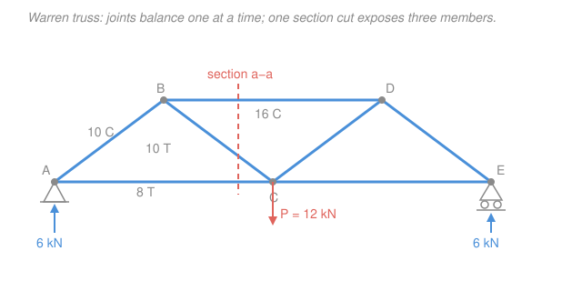

# Structural Analysis · Lesson 1.5: Trusses & Determinate Frames

> ⏱ ~15 min · Module 1: Determinate Structures & Internal Forces · Builds on: [1.2 Supports, Reactions & Determinacy](01-02-supports-reactions-determinacy.md), [1.4 Shear & Bending-Moment Diagrams](01-04-shear-bending-moment-diagrams.md), [`statics` 2.1 Method of Joints](../../statics/lessons/02-01-trusses-method-of-joints.md), [`statics` 2.2 Method of Sections](../../statics/lessons/02-02-method-of-sections.md) · Unlocks: [2.5 Truss Deflections](02-05-truss-deflections-castigliano.md), Module 3

## Why this matters

A beam bends; a truss doesn't. Point a load at a well-triangulated frame — a roof, a bridge, a crane boom, a transmission tower — and it routes that load to the supports through pure push and pull, no bending at all. That's why trusses span farther per kilogram of steel than any beam: material in tension or compression works at full strength, while material in bending wastes most of its cross-section. This lesson gives you the two hand tools that crack every determinate truss — **method of joints** and **method of sections** — plus the recipe for **determinate frames**, where rigid corners *do* carry moment. These forces are the input to everything downstream: you can't find how far a truss deflects ([2.5](02-05-truss-deflections-castigliano.md)) until you know the force in every bar.

## The idea

A truss is a triangle factory. Every member is a **two-force member**: a straight bar pinned at both ends with loads applied *only* at the joints, never along its length. Squeeze the free-body of one bar and only two forces act on it — one at each pin — so for equilibrium they must be equal, opposite, and *along the bar*. No shear, no bending, just a single number: how hard the bar pulls in (**tension**, $+$) or pushes out (**compression**, $-$).

That's the whole simplification. At every joint the bars meet at a point, so there's no moment to balance — only two force equations, $\sum F_x = 0$ and $\sum F_y = 0$. **Method of joints** walks the truss pin by pin: start where only two members are unknown, solve them, carry those known forces to the next joint, repeat. It's bookkeeping, and it's total — you get *every* member.

But sometimes you want *one* bar deep inside a big truss without grinding through ten joints first. **Method of sections** slices clean through the truss, throws away one side, and treats the exposed member forces as external loads on the remaining chunk. Because that chunk is a rigid body, you now have *three* equations ($\sum F_x, \sum F_y, \sum M$) — and the moment equation is the sniper rifle: take moments about the point where two of your three unknowns cross, and they vanish, leaving the third alone.

A **frame** breaks the truss rules — loads land mid-member, joints are welded rigid — so members carry $N$, $V$, *and* $M$ just like the beams of [1.3](01-03-internal-forces-shear-bending-moment.md)–[1.4](01-04-shear-bending-moment-diagrams.md). But the strategy is the same skeleton: reactions first, then disassemble at the joints and section each member.

## The formal version

**Two-force member.** A straight member loaded only at its two end pins carries force purely along its axis. *In words: it can only pull or push, never bend.* Sign convention: **tension positive** (member pulls the joints toward each other), **compression negative** (member pushes them apart). Draw every unknown force as tension (arrow pulling away from the joint); a negative answer then just means compression — the algebra tracks the sign for you.

**Method of joints.** At each pin, the members and applied loads form a concurrent force system, so
$$\sum F_x = 0, \qquad \sum F_y = 0.$$
*In words: two equations per joint — so start at a joint with at most two unknown members.* For a member at angle $\theta$ to the horizontal, its force $F$ contributes $F\cos\theta$ horizontally and $F\sin\theta$ vertically.

**Method of sections.** Cut a plane through the truss slicing **at most three members with unknown forces** (three unknowns, three equilibrium equations for the isolated part):
$$\sum F_x = 0, \qquad \sum F_y = 0, \qquad \sum M_O = 0.$$
*In words: replace the cut bars with their axial forces and treat one side as a rigid body.* Choose $O$ at the intersection of two unknowns to solve the third in a single moment equation.

**Zero-force members** carry no load but hold geometry (and brace against buckling). Two quick rules, checkable by eye:
- **Two non-collinear members, no external load at the joint** → both are zero-force. (Nothing balances the component perpendicular to either bar.)
- **Three members, two collinear, no external load at the joint** → the odd (non-collinear) member is zero-force.

**Determinacy (recap of [1.2](01-02-supports-reactions-determinacy.md)).** For a planar truss with $m$ members, $r$ reaction components, $j$ joints:
$$m + r = 2j \ \Rightarrow\ \text{determinate}, \qquad m + r > 2j \ \Rightarrow\ \text{indeterminate}, \qquad m + r < 2j \ \Rightarrow\ \text{unstable (mechanism)}.$$
*In words: unknowns ($m$ bar forces $+ r$ reactions) versus equations ($2$ per joint) — they must match.* Being determinate isn't enough; the reactions must also be non-concurrent and non-parallel, or the structure is unstable however the count works out.

**Determinate frames.** Rigid joints transmit moment, so each member is a little beam carrying axial $N$, shear $V$, and bending moment $M$. Procedure:
1. **Reactions first** — treat the whole frame as one rigid body, apply $\sum F_x=\sum F_y=\sum M=0$ (a determinate planar frame has exactly the reactions these three equations can find, adjusted for internal hinges).
2. **Disassemble at the joints** — draw each member's free body; a rigid joint passes $N$, $V$, and $M$ across, while an internal hinge passes force but *not* moment (an extra equation $\sum M_{\text{hinge}}=0$, the condition $c$ in the general count $\,3m + r = 3n + c$).
3. **Section each member** to get $N(x)$, $V(x)$, $M(x)$ exactly as in [1.3](01-03-internal-forces-shear-bending-moment.md)–[1.4](01-04-shear-bending-moment-diagrams.md), respecting the corner geometry (a vertical column carries a vertical load as *axial* force, not shear).

## Picture

The truss: bottom-chord joints $A(0,0)$, $C(8,0)$, $E(16,0)$ in metres; top-chord joints $B(4,3)$, $D(12,3)$. Every diagonal runs a $3$–$4$–$5$ triangle, so a bar at that angle has $\cos\theta = \tfrac{4}{5}=0.8$, $\sin\theta = \tfrac{3}{5}=0.6$. A single $P=12$ kN load hangs at $C$; pin at $A$, roller at $E$.

## Worked examples

**Example 1 (method of joints — the whole left half).** First reactions. The load sits at mid-span $C$, so by symmetry $R_A = R_E = \tfrac{12}{2} = 6$ kN up, and with no horizontal loads $A_x = 0$.

*Joint $A$* (only two unknown members, $AB$ and $AC$). Draw both as tension. Member $AB$ points up-right toward $B$: direction $(0.8, 0.6)$. Member $AC$ points right toward $C$: direction $(1, 0)$.
$$\sum F_y = 0:\quad 6 + 0.6\,F_{AB} = 0 \ \Rightarrow\ F_{AB} = -10\ \mathrm{kN} \ \Rightarrow\ 10\ \mathrm{kN\ compression}.$$
$$\sum F_x = 0:\quad 0.8\,F_{AB} + F_{AC} = 0 \ \Rightarrow\ F_{AC} = -0.8(-10) = 8\ \mathrm{kN\ tension}.$$
The bottom chord pulls (tension), the diagonal pushes (compression) — exactly what a load hanging between the supports should do.

*Joint $B$* (now only $BC$ and $BD$ unknown; $BA$ is known). At $B$, member $BA$ points down-left $(-0.8,-0.6)$ with $F_{BA}=-10$; member $BC$ points down-right $(0.8,-0.6)$; top chord $BD$ points right $(1,0)$. No load at $B$.
$$\sum F_y = 0:\ -0.6\,F_{BA} - 0.6\,F_{BC} = 0 \ \Rightarrow\ F_{BC} = -F_{BA} = 10\ \mathrm{kN\ tension}.$$
$$\sum F_x = 0:\ -0.8\,F_{BA} + 0.8\,F_{BC} + F_{BD} = 0 \ \Rightarrow\ F_{BD} = -0.8(-10) - 0.8(10) = -16\ \mathrm{kN} \ \Rightarrow\ 16\ \mathrm{kN\ compression}.$$
The right half mirrors it: $F_{CD}=10$ T, $F_{CE}=8$ T, $F_{DE}=-16$ C. *Sanity:* top chords compress, bottom chords tension — the classic signature of a simply-supported truss sagging under gravity, just like a beam's top fibres compress and bottom fibres stretch ([1.4](01-04-shear-bending-moment-diagrams.md)). Units: forces in kN throughout. ✓

**Example 2 (method of sections — one chord, one cut).** Suppose you only want the top chord force $F_{BD}$. Slice **section a–a** vertically through the left panel, cutting three members: $BD$, $BC$, $AC$ (see the coral line). Keep the left side (it carries $R_A = 6$ kN up at $A$).

The trick: members $BC$ and $AC$ both pass through joint $C(8,0)$, so take moments about $C$ and they disappear, leaving only $F_{BD}$ (horizontal, acting along the line $y=3$, moment arm $3$ m) and $R_A$ (arm $8$ m). Taking counter-clockwise as positive, with $F_{BD}$ drawn as tension:
$$\sum M_C = 0:\quad \underbrace{-(6)(8)}_{R_A\ \text{at } A} \; \underbrace{-\,3\,F_{BD}}_{\text{top chord}} = 0 \ \Rightarrow\ F_{BD} = \frac{-48}{3} = -16\ \mathrm{kN} \ \Rightarrow\ 16\ \mathrm{kN\ compression}.$$
One equation, no joint-walking — and it matches Example 1 exactly. Want the diagonal instead? Same cut, use vertical equilibrium (only $F_{BC}$ has a vertical component on this side):
$$\sum F_y = 0:\quad 6 - 0.6\,F_{BC} = 0 \ \Rightarrow\ F_{BC} = 10\ \mathrm{kN\ tension}. \checkmark$$
*Sanity:* both results agree with the joint method, and the cut touched exactly three unknowns — the most a single section can resolve. Units: $\mathrm{kN\cdot m}$ in the moment equation, kN in the force equation. ✓

## Watch out

- **You might think a diagonal that "looks like it's leaning" must carry load.** Not necessarily — check the zero-force rules first. At a joint with three members where two are collinear and no load acts, the odd member is *zero-force*, regardless of how important it looks. Spotting these first can gut a scary-looking truss down to a few real unknowns.
- **You might carry a compression as a negative number and then re-subtract the sign.** Pick one discipline: draw *every* unknown as tension, plug in with its own sign, and read the final sign as the answer (−16 kN *is* 16 kN compression). Don't also flip the arrow — you'll double-negate.
- **You might cut four members and stall.** A section gives only three equations, so a cut through four unknowns can't be solved alone. Re-route the cut (curved cuts are legal) or grab one member from a nearby joint first, then cut.
- **You might treat a frame joint like a truss joint and drop the moment.** Truss joints are pins (no moment); frame joints are welded rigid and *transmit* moment. In a frame, a vertical column under a vertical load carries it as *axial compression*, and the beam above carries *shear and bending* — never lump them together.

## One-liner

> A truss routes loads through pure tension and compression — walk the joints for every bar, or snipe one bar with a single section cut and a well-aimed moment; a frame is the same recipe, but its rigid corners also pass bending.

## Problems

**P1 (🟢)** A truss joint connects exactly three members and carries no external load. Two of the members are collinear (both horizontal, one running left, one running right); the third rises at $45^\circ$. What is the force in the diagonal member, and why?

**P2 (🟡)** Using the truss in the Picture, find the bottom-chord force $F_{CE}$ and the diagonal force $F_{CD}$ by a **single section cut** through the right panel (cutting $BD$, $CD$, $CE$). Take moments about $D$ for the chord, and use vertical equilibrium for the diagonal. State each as tension or compression.

**P3 (🔴)** A determinate frame is fixed at base $A(0,0)$; a column rises to $B(0,3)$ m, then a horizontal beam runs to a free end $C(4,3)$ m carrying a downward point load $P = 10$ kN at $C$. Find the three reaction components at $A$, then the internal axial force $N$, shear $V$, and bending moment $M$ at the **base of the column** (just above $A$). (Cross-links to [`statics` 2.3 Frames & Machines](../../statics/lessons/02-03-frames-and-machines.md).)

Solutions

**P1** By the zero-force rule for **three members with two collinear and no applied load**: the two collinear (horizontal) members balance each other along the horizontal, and there is nothing to balance the diagonal's *vertical* component except the diagonal itself — so it must be zero.
$$\sum F_\perp = 0:\quad F_{\text{diag}}\sin 45^\circ = 0 \ \Rightarrow\ F_{\text{diag}} = 0.$$
The diagonal is a **zero-force member**. (It still earns its keep — it holds geometry and braces the collinear members against buckling — but under this load it carries nothing.) *Check:* resolving perpendicular to the collinear pair isolates exactly one unknown, confirming the rule. ✓

**P2** Cut through $BD$, $CD$, $CE$ and keep the **right** side, which carries $R_E = 6$ kN up at $E(16,0)$. Geometry: diagonal $CD$ runs the $3$–$4$–$5$ triangle ($\cos\theta=0.8$, $\sin\theta=0.6$).

*Chord $F_{CE}$ — moments about $D(12,3)$* (both $BD$ and $CD$ pass through $D$, so they drop out). $R_E$ acts up at $E$, horizontal distance $16-12=4$ m from $D$; $F_{CE}$ is horizontal along $y=0$, moment arm $3$ m. Drawing $F_{CE}$ as tension and taking CCW positive:
$$\sum M_D = 0:\quad (6)(4) - 3\,F_{CE} = 0 \ \Rightarrow\ F_{CE} = \frac{24}{3} = 8\ \mathrm{kN\ tension}.$$

*Diagonal $F_{CD}$ — vertical equilibrium* (chords $BD$, $CE$ are horizontal, no vertical component):
$$\sum F_y = 0:\quad 6 - 0.6\,F_{CD} = 0 \ \Rightarrow\ F_{CD} = 10\ \mathrm{kN\ tension}.$$
*Check:* by the truss's left–right symmetry these must mirror Example 1's $F_{AC}=8$ T and $F_{BC}=10$ T — they do. Units: kN·m in the moment equation, kN in the force balance. ✓

**P3** *Reactions at the fixed base $A$.* Treat the whole bent as one rigid body. No horizontal loads:
$$\sum F_x = 0 \Rightarrow A_x = 0, \qquad \sum F_y = 0 \Rightarrow A_y = P = 10\ \mathrm{kN\ (up)}.$$
The $10$ kN at $C$ is $4$ m horizontally from $A$, so it makes a moment $10 \times 4 = 40$ kN·m about $A$; the fixed support supplies the reacting couple:
$$\sum M_A = 0 \Rightarrow M_A = P \cdot (4\ \mathrm{m}) = 40\ \mathrm{kN\cdot m}.$$

*Internal forces just above $A$.* Cut the column and take the piece below (the support). The column is **vertical** and the transmitted load is **vertical**, so it rides down the column as **axial force**:
$$N = 10\ \mathrm{kN\ compression}, \qquad V = 0 \ (\text{no horizontal load}), \qquad M = 40\ \mathrm{kN\cdot m}.$$
*Check:* the bending moment at the base equals the load times its horizontal offset — the same $P\!\cdot\!(\text{lever arm})$ you'd get for the cantilever beam $BC$ at corner $B$ ($10 \times 4 = 40$ kN·m), then carried unchanged down the rigid corner into the column. Units consistent (kN, kN·m). Contrast with a truss: here the column carries $N$, $V$, *and* $M$ because the joint at $B$ is rigid. ✓

## Flashback

**From Lesson 1.4 (Shear & Bending-Moment Diagrams):** A simply-supported beam of span $L = 6$ m (pin at $A$, roller at $B$) carries a uniform distributed load $w = 4$ kN/m over its whole length. Find the reactions, the location of zero shear, and the maximum bending moment.

Solution

Total load $= wL = 4 \times 6 = 24$ kN; by symmetry each reaction takes half:
$$R_A = R_B = \tfrac{wL}{2} = 12\ \mathrm{kN\ (up)}.$$
Shear starts at $+12$ kN and drops linearly at rate $\tfrac{dV}{dx} = -w = -4$ kN/m, so $V(x) = 12 - 4x$. It hits zero at
$$x = \frac{12}{4} = 3\ \mathrm{m}\ (\text{mid-span}),$$
and since $\tfrac{dM}{dx}=V$, the moment peaks there. Integrating (area under $V$ from $0$ to $3$ = triangle of height 12, base 3):
$$M_{\max} = \tfrac12 (3)(12) = 18\ \mathrm{kN\cdot m} \quad\left(= \tfrac{wL^2}{8} = \tfrac{4\cdot 36}{8} = 18\ \mathrm{kN\cdot m}\right).$$
*Check:* $M_{\max}$ sits at the point of zero shear, sagging-positive, and the closed form $wL^2/8$ agrees. Units: kN, kN·m. ✓

## Connections

- **Backward:** the reaction step reuses the equilibrium and determinacy machinery of [1.2](01-02-supports-reactions-determinacy.md); the frame internal forces are the $N$/$V$/$M$ sectioning of [1.3](01-03-internal-forces-shear-bending-moment.md)–[1.4](01-04-shear-bending-moment-diagrams.md) applied member by member. Both hand methods are the truss half of [`statics` 2.1](../../statics/lessons/02-01-trusses-method-of-joints.md)–[2.2](../../statics/lessons/02-02-method-of-sections.md), now with a structural-analysis eye on sign conventions and downstream use.
- **Forward:** these member forces $N$ are the raw material for [2.5 Truss Deflections & Castigliano](02-05-truss-deflections-castigliano.md), where $1\cdot\Delta = \sum \tfrac{nNL}{AE}$ turns bar forces into joint displacements; frame internal forces feed the unit-load method of [2.4](02-04-unit-load-method-beams-frames.md). Module 3 revisits any truss or frame whose count gives $m+r>2j$ — the indeterminate case this lesson deliberately dodged.
- **Sideways:** the zero-force / section idea — isolate the one unknown you want by killing the others with a smart choice of pivot — is the same instinct as taking moments about a point to eliminate an unwanted reaction in [`statics` 2.3 Frames & Machines](../../statics/lessons/02-03-frames-and-machines.md).
