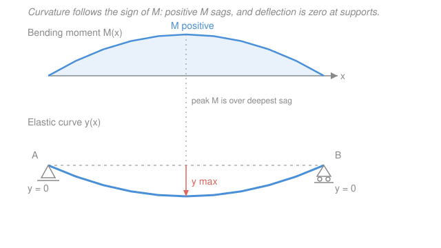

# Structural Analysis · Lesson 2.1: The Elastic Curve & Double Integration

> ⏱ ~15 min · Module 2: Deflections & Energy Methods · Builds on: [1.4 Shear & Bending-Moment Diagrams](01-04-shear-bending-moment-diagrams.md), [`mechanics-of-materials` 3.1 Deflection by Integration](../../mechanics-of-materials/lessons/03-01-deflection-by-integration.md) · Unlocks: [2.2 The Moment-Area Theorems](02-02-moment-area-theorems.md), Module 3 (indeterminate structures)

## Why this matters

You can find every reaction and draw a perfect moment diagram — and still not know the one number a client actually cares about: *how far does the beam sag?* A floor joist that's plenty strong can still bounce enough to crack plaster or feel alarming underfoot. Codes limit deflection (often to $L/360$) precisely because stiffness, not just strength, decides whether a structure is usable. This lesson turns the moment diagram $M(x)$ you already know how to draw into the actual shape the beam bends into — and it's the foundation the slicker methods (moment-area, virtual work) all rest on.

## The idea

A loaded beam bends into a smooth curve — the **elastic curve**. Here's the whole insight in one line: *the more bending moment you pile on a spot, the more sharply the beam curves there.* Where the moment is big, the curve is tight; where the moment is zero, the beam is momentarily straight.

And the *direction* of the curve follows the *sign* of the moment. Recall the sagging-positive convention from [1.3](01-03-internal-forces-shear-bending-moment.md): positive $M$ means the beam is smiling (concave up), negative $M$ means it's frowning (concave down). So if you can read a moment diagram, you can already sketch the deflected shape by eye — sag where $M>0$, hog where $M<0$, and inflection points wherever $M$ crosses zero.

To get *numbers* instead of a sketch, we lean on calculus. Curvature is the second derivative of the shape. So "curvature is proportional to moment" becomes a differential equation, $EI\,y'' = M(x)$. Integrate it once and you have the **slope** everywhere; integrate again and you have the **deflection** everywhere. The two leftover constants of integration get pinned down by what you know at the supports — a pin can't move, a wall can't move *or* rotate. That's the entire method.

## The formal version

The governing equation of the elastic curve, for a beam with small deflections, is

$$EI\,y'' = M(x).$$

*In words: the beam's curvature at each point is set by the bending moment there, softened by how stiff the beam is.* The symbols:

- $y = y(x)$ — the **deflection** (m), how far the beam has moved from its unloaded line at position $x$ (m) along it. We take $y$ **positive upward**; a sagging beam has $y<0$.
- $y' = \dfrac{dy}{dx}$ — the **slope** $\theta$ (rad) of the elastic curve (small, so $\theta \approx \tan\theta = y'$).
- $y'' = \dfrac{d^2y}{dx^2}$ — the **curvature** (1/m, for small slopes).
- $M(x)$ — the **bending moment** (kN·m), sagging-positive, exactly the function you plotted in [1.4](01-04-shear-bending-moment-diagrams.md).
- $EI$ — the **flexural rigidity** (kN·m²): $E$ the material's Young's modulus (kPa) times $I$ the cross-section's second moment of area (m⁴). It's the beam's resistance to bending — big $EI$, stiff beam, small deflection.

Integrate once for slope, twice for deflection (taking $EI$ constant):

$$EI\,y'(x) = \int M(x)\,dx + C_1, \qquad EI\,y(x) = \iint M(x)\,dx\,dx + C_1 x + C_2.$$

*In words: antidifferentiate the moment twice; each integration spits out one unknown constant.* You fix $C_1, C_2$ with two facts about the supports:

**Boundary conditions** — what a support forbids:
- Pin or roller: it holds the beam down but lets it rotate, so $y = 0$ there ($y'$ is free).
- Fixed (wall/cantilever): it holds *and* clamps, so $y = 0$ **and** $y' = 0$ there.

**Continuity conditions** — where the load pattern breaks (a point load, or the start/end of a distributed load), $M(x)$ is a different formula on each side, so you integrate each piece separately. At the break the beam is one smooth curve, so you demand the two pieces agree: $y_{\text{left}} = y_{\text{right}}$ and $y'_{\text{left}} = y'_{\text{right}}$. Each break adds two constants and two matching equations — a bookkeeping headache, which is exactly why Module 2's later methods exist.

The **maximum deflection** sits where the elastic curve is momentarily flat: solve $y'(x) = 0$, then evaluate $y$ there.

## Picture

The moment is positive across the whole span, so the beam is concave-up everywhere and sags into a single bowl — deepest right under the peak moment, pinned to zero at both supports.

## Worked examples

**Example 1 (simply supported beam under a uniform load — the workhorse).** A beam of span $L$ carries a uniform load $w$ (kN/m) downward, on a pin at $A$ ($x=0$) and a roller at $B$ ($x=L$). By symmetry each reaction is $wL/2$, and the moment (sagging-positive) is

$$M(x) = \frac{wL}{2}x - \frac{w}{2}x^2.$$

Sanity: $M(0)=0$, $M(L)=\frac{wL^2}{2}-\frac{wL^2}{2}=0$ ✓ (no moment at the pinned/rollered ends). Now double-integrate $EI\,y'' = M(x)$:

$$EI\,y' = \frac{wL}{4}x^2 - \frac{w}{6}x^3 + C_1,$$

$$EI\,y = \frac{wL}{12}x^3 - \frac{w}{24}x^4 + C_1 x + C_2.$$

Boundary conditions are both "no deflection at a support": $y(0)=0$ and $y(L)=0$.

- $y(0)=0 \Rightarrow C_2 = 0$.
- $y(L)=0 \Rightarrow \dfrac{wL}{12}L^3 - \dfrac{w}{24}L^4 + C_1 L = 0 \Rightarrow \dfrac{wL^4}{12} - \dfrac{wL^4}{24} + C_1 L = 0.$

Combine the two terms: $\frac{wL^4}{12}-\frac{wL^4}{24}=\frac{2wL^4-wL^4}{24}=\frac{wL^4}{24}$, so $C_1 L = -\frac{wL^4}{24}$, giving $C_1 = -\dfrac{wL^3}{24}$. The deflection curve is

$$EI\,y(x) = \frac{wL}{12}x^3 - \frac{w}{24}x^4 - \frac{wL^3}{24}x = -\frac{w}{24}\left(x^4 - 2Lx^3 + L^3 x\right).$$

By symmetry the low point is midspan, but let's *earn* it: set $y'=0$. At $x=L/2$, $EI\,y' = \frac{wL}{4}\cdot\frac{L^2}{4} - \frac{w}{6}\cdot\frac{L^3}{8} - \frac{wL^3}{24} = \frac{wL^3}{16}-\frac{wL^3}{48}-\frac{wL^3}{24}$. Over 48: $\frac{3-1-2}{48}wL^3 = 0$ ✓. Evaluate $y$ at $x=L/2$:

$$EI\,y\!\left(\tfrac{L}{2}\right) = -\frac{w}{24}\left(\frac{L^4}{16} - 2L\cdot\frac{L^3}{8} + L^3\cdot\frac{L}{2}\right) = -\frac{w}{24}\left(\frac{L^4}{16} - \frac{L^4}{4} + \frac{L^4}{2}\right).$$

Over 16: $\frac{1-4+8}{16}L^4 = \frac{5L^4}{16}$, so $EI\,y = -\frac{w}{24}\cdot\frac{5L^4}{16} = -\frac{5wL^4}{384}$. The magnitude is

$$\boxed{\,y_{\max} = \frac{5wL^4}{384\,EI}\ \text{(downward), at midspan.}\,}$$

*Check.* Units: $\dfrac{(\mathrm{kN/m})\,\mathrm{m^4}}{\mathrm{kN\cdot m^2}} = \dfrac{\mathrm{kN\cdot m^3}}{\mathrm{kN\cdot m^2}} = \mathrm{m}$ ✓. The negative sign says *down*, matching the sagging moment. And the brutal $L^4$ dependence is why span, more than anything, drives sag — double the span, sixteen times the deflection.

**Example 2 (cantilever with a tip load — boundary conditions at the wall).** A cantilever of length $L$ is fixed at $A$ ($x=0$) and free at $B$ ($x=L$), carrying a downward load $P$ at the tip. Measuring $x$ from the wall, cut at $x$ and look at the free length $(L-x)$ to the right: the tip load $P$ a distance $(L-x)$ away hogs the beam (concave down), so $M$ is negative:

$$M(x) = -P(L-x) = -PL + Px.$$

Sanity: $M(L)=0$ (nothing beyond the free tip) ✓, and $M(0)=-PL$, the largest hogging moment, at the wall — right where a cantilever cracks. Double-integrate:

$$EI\,y' = -PLx + \frac{P}{2}x^2 + C_1, \qquad EI\,y = -\frac{PL}{2}x^2 + \frac{P}{6}x^3 + C_1 x + C_2.$$

The fixed end clamps both position and slope: $y(0)=0$ and $y'(0)=0$.

- $y'(0)=0 \Rightarrow C_1 = 0$.
- $y(0)=0 \Rightarrow C_2 = 0$.

Both constants vanish — that's the payoff of putting the origin at a fixed end. The tip deflection is $y(L)$:

$$EI\,y(L) = -\frac{PL}{2}L^2 + \frac{P}{6}L^3 = -\frac{PL^3}{2} + \frac{PL^3}{6} = \frac{-3PL^3 + PL^3}{6} = -\frac{2PL^3}{6} = -\frac{PL^3}{3}.$$

$$\boxed{\,y_{\text{tip}} = \frac{PL^3}{3\,EI}\ \text{(downward).}\,}$$

*Check.* Units: $\dfrac{\mathrm{kN}\cdot\mathrm{m^3}}{\mathrm{kN\cdot m^2}} = \mathrm{m}$ ✓. Negative, i.e. down, matching a hogging cantilever. This $PL^3/3EI$ is one of the two or three beam results worth memorizing cold — it's the reference deflection the superposition and unit-load methods reuse constantly.

## Watch out

- **You might think $EI\,y''=M$ needs the fanciest form of the elasticity equation.** For the constant-$EI$, small-deflection beams in this course, $EI\,y''=M(x)$ is all you need. The full chain — $EI\,y''''=w$, $EI\,y'''=V$, $EI\,y''=M$ — exists (differentiate using $\frac{dM}{dx}=V$, $\frac{dV}{dx}=-w$ from [1.4](01-04-shear-bending-moment-diagrams.md)), and you'd start from $EI\,y''''=w$ only if you'd rather integrate the load four times than write $M(x)$ first. Same beam, two entry points.
- **You might drop the sign of $M$ and get the curve upside down.** The sagging-positive convention is load-bearing here: a positive $M$ *must* produce concave-up ($y''>0$), a negative $M$ concave-down. If your computed elastic curve bulges the wrong way versus the physical picture, you flipped a moment sign — go back to the FBD, don't fudge the constant.
- **You might apply boundary conditions on the wrong side of a break.** Constants are per-segment. If a point load splits the beam into two pieces, "$y=0$ at the left pin" only constrains the *left* segment's constants; the right segment's constants come from *its* support plus the two continuity equations at the break. Mixing them is the classic double-integration error.

## One-liner

> Curvature tracks moment — so integrate $EI\,y''=M(x)$ twice and let the supports ($y=0$ at a pin, $y=0,\,y'=0$ at a wall) nail down the two constants.

## Problems

**P1 (🟢)** A cantilever of length $L$, fixed at $A$ ($x=0$) and free at $B$, carries a *uniform* load $w$ (kN/m) over its whole span. Set up $M(x)$ (sagging-positive), integrate $EI\,y''=M(x)$ twice, apply the fixed-end conditions, and show the tip deflection is $y_B = \dfrac{wL^4}{8EI}$ downward.

**P2 (🟡)** Without doing any new integration, sketch (in words) the elastic curve of the Module-1 overhanging beam: pin at $A$ ($x=0$), roller at $B$ ($x=6$ m), free overhang to $C$ ($x=8$ m); the moment is positive on most of $AB$ but goes negative near $B$ and at $B$ itself ($M_B=-40$ kN·m). Where does the beam sag, where does it hog, and where is the inflection point? What does the tip $C$ do?

**P3 (🔴, optional)** A simply supported beam of span $L$ (pin at $x=0$, roller at $x=L$) carries a single downward point load $P$ at midspan. Using symmetry, work with the left half only ($0\le x\le L/2$), where $M(x)=\frac{P}{2}x$. Integrate twice, apply $y(0)=0$ and the symmetry condition $y'(L/2)=0$, and find the midspan deflection.

Solutions

**P1** Put the origin at the wall. At a cut $x$, the load to the right is $w(L-x)$ acting at its own centroid, a distance $(L-x)/2$ from the cut; a downward load hogs the cantilever, so

$$M(x) = -w(L-x)\cdot\frac{(L-x)}{2} = -\frac{w}{2}(L-x)^2 = -\frac{w}{2}\left(L^2 - 2Lx + x^2\right).$$

Sanity: $M(L)=0$ ✓, $M(0)=-\frac{wL^2}{2}$ (max hogging at the wall) ✓. Integrate:

$$EI\,y' = -\frac{w}{2}\left(L^2 x - Lx^2 + \tfrac{1}{3}x^3\right) + C_1,$$
$$EI\,y = -\frac{w}{2}\left(\tfrac{1}{2}L^2 x^2 - \tfrac{1}{3}Lx^3 + \tfrac{1}{12}x^4\right) + C_1 x + C_2.$$

Fixed end: $y'(0)=0 \Rightarrow C_1=0$; $y(0)=0 \Rightarrow C_2=0$. Tip deflection at $x=L$:

$$EI\,y(L) = -\frac{w}{2}\left(\tfrac{1}{2}L^4 - \tfrac{1}{3}L^4 + \tfrac{1}{12}L^4\right) = -\frac{w}{2}\cdot L^4\cdot\frac{6-4+1}{12} = -\frac{w}{2}\cdot\frac{3L^4}{12} = -\frac{wL^4}{8}.$$

So $y_B = \dfrac{wL^4}{8EI}$ downward. *Check.* Units $\frac{(\mathrm{kN/m})\mathrm{m^4}}{\mathrm{kN\cdot m^2}}=\mathrm{m}$ ✓. Compare a tip point load $P=wL$ (same total weight) on the same cantilever: that gives $\frac{PL^3}{3EI}=\frac{wL^4}{3EI}$, larger than $\frac{wL^4}{8EI}$ — spreading the load out sags it less than dumping it all at the tip, as intuition demands. This $wL^4/8EI$ is exactly the uniform-load term in Boss Problem 2. ✓

**P2** Read the shape straight off the moment signs (curvature follows $M$):

- On $AB$ where $M>0$: the beam is **concave up — it sags** below the $A$–$B$ line, a downward bow, deepest somewhere left of center (nearer $A$, since the reactions are lopsided).
- Approaching $B$, $M$ turns negative and $M_B=-40$ kN·m: the beam is **concave down — hogging** there. So somewhere between the sag and $B$, $M$ passes through zero — that's the **inflection point**, where the curve changes from concave-up to concave-down (the beam is instantaneously straight).
- The overhang $BC$ carries the tip load $P$ down at $C$, so it hogs too and the free tip $C$ **kicks downward** (the cantilevered end deflects below the support line). Both $A$ and $B$ stay pinned at $y=0$.

*Check.* The number of inflection points equals the number of sign changes in $M$ (one here), a good consistency test between the $M$ diagram and the sketched curve. ✓

**P3** Left half, $M(x)=\frac{P}{2}x$ for $0\le x\le L/2$:

$$EI\,y' = \frac{P}{4}x^2 + C_1, \qquad EI\,y = \frac{P}{12}x^3 + C_1 x + C_2.$$

By symmetry the slope is zero at midspan: $y'(L/2)=0 \Rightarrow \frac{P}{4}\cdot\frac{L^2}{4} + C_1 = 0 \Rightarrow C_1 = -\frac{PL^2}{16}$. Pin at the left: $y(0)=0 \Rightarrow C_2=0$. Midspan deflection at $x=L/2$:

$$EI\,y\!\left(\tfrac{L}{2}\right) = \frac{P}{12}\cdot\frac{L^3}{8} - \frac{PL^2}{16}\cdot\frac{L}{2} = \frac{PL^3}{96} - \frac{PL^3}{32} = \frac{PL^3 - 3PL^3}{96} = -\frac{2PL^3}{96} = -\frac{PL^3}{48}.$$

$$y_{\text{center}} = \frac{PL^3}{48EI}\ \text{(downward).}$$

*Check.* Units $\frac{\mathrm{kN\cdot m^3}}{\mathrm{kN\cdot m^2}}=\mathrm{m}$ ✓. The famous trio for a central point load, UDL, and cantilever tip load — $\frac{PL^3}{48EI}$, $\frac{5wL^4}{384EI}$, $\frac{PL^3}{3EI}$ — are worth carrying in your head; the superposition method in [`mechanics-of-materials` 3.2](../../mechanics-of-materials/lessons/03-02-deflection-by-superposition.md) adds them like Lego. ✓

## Flashback

**From Lesson 1.4 (Shear & Bending-Moment Diagrams):** A simply supported beam of span $L=8$ m (pin at $A$, roller at $B$) carries a single downward point load $P=12$ kN at $x=3$ m from $A$. Find the reactions, then locate and evaluate the maximum bending moment. (Fresh variant — an off-center point load.)

Solution

Reactions by moment balance about $A$ (taking counterclockwise positive, $R_B$ up at $x=8$):

$$\sum M_A = 0:\quad R_B(8) - 12(3) = 0 \Rightarrow R_B = \frac{36}{8} = 4.5\ \mathrm{kN}.$$
$$\sum F_y = 0:\quad R_A + R_B - 12 = 0 \Rightarrow R_A = 12 - 4.5 = 7.5\ \mathrm{kN}.$$

For a single point load, the shear is constant on each side and the moment peaks *under the load* (where $V$ passes through zero). Evaluate $M$ at $x=3$ m from the left, using only the reaction to its left:

$$M_{\max} = R_A(3) = 7.5 \times 3 = 22.5\ \mathrm{kN\cdot m}.$$

*Check.* From the right: $M = R_B(8-3) = 4.5\times 5 = 22.5$ kN·m ✓ — both sides of the cut agree, and the moment is positive (sagging) as expected for a simply supported beam under a downward load. This is exactly the $M(x)$ you would feed into $EI\,y''=M(x)$ to get *this* beam's elastic curve — reactions and diagrams from Module 1 are the raw material for every deflection in Module 2. ✓

## Connections

- **Backward:** this is [1.4](01-04-shear-bending-moment-diagrams.md)'s moment diagram put to work — $M(x)$ is the *input* to $EI\,y''=M(x)$, and the sagging-positive sign convention from [1.3](01-03-internal-forces-shear-bending-moment.md) is what makes the curvature come out the right way. It also directly reprises [`mechanics-of-materials` 3.1](../../mechanics-of-materials/lessons/03-01-deflection-by-integration.md), where you first met double integration for a single beam.
- **Forward:** [2.2 The Moment-Area Theorems](02-02-moment-area-theorems.md) does the same job *geometrically* — reading slopes and deflections off the $M/EI$ diagram's area instead of grinding through integrals — and both feed the virtual-work machinery of [2.3](02-03-strain-energy-virtual-work.md)–[2.4](02-04-unit-load-method-beams-frames.md) that scales to whole frames. The tip and midspan results here are also the building blocks for superposition in [`mechanics-of-materials` 3.2](../../mechanics-of-materials/lessons/03-02-deflection-by-superposition.md), and the compatibility conditions of Module 3 ([3.1](03-01-indeterminacy-redundancy-compatibility.md)) are just "make the deflections match" — the very deflections you now know how to compute.
- **Sideways (calculus):** this is antidifferentiation with a purpose — the two constants of integration are not nuisances but *physical facts* about the supports, exactly the initial/boundary-value setup from [`calc-refresher`](../../calc-refresher/syllabus.md). The same "integrate twice, fix constants from endpoint data" pattern is how you solved $\ddot x = a$ for projectile motion in kinematics.
