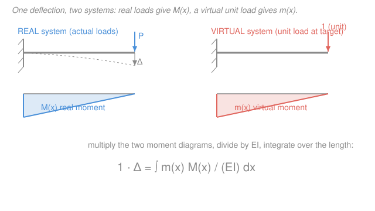

# Structural Analysis · Lesson 2.3: Strain Energy & the Principle of Virtual Work

> ⏱ ~15 min · Module 2: Deflections & Energy Methods · Builds on: [2.1 Elastic curve by double integration](02-01-elastic-curve-double-integration.md), [2.2 Moment-area theorems](02-02-moment-area-theorems.md), [`mechanics-of-materials` 1.3 Axial deformation](../../mechanics-of-materials/lessons/01-03-axial-deformation.md) · Unlocks: [2.4 Unit-load method for beams & frames](02-04-unit-load-method-beams-frames.md), [2.5 Truss deflections & Castigliano](02-05-truss-deflections-castigliano.md)

## Why this matters

Double integration (2.1) and moment-area (2.2) each find deflections, but both are fussy: integration wants the full moment function and boundary conditions; moment-area wants you to sketch and sub-divide the $M/EI$ diagram. Neither scales cleanly to a frame with a dozen members or a truss with thirty bars, and neither gives you *one specific displacement* — the sag at a single point, the swing of a joint — without solving for the whole deflected shape. This lesson builds the tool that does exactly that. The **principle of virtual work** (the unit-load method) hands you *one* deflection at *one* point in *one* direction, straight from an integral, and it works identically for beams, frames, and trusses under any loading. It's the workhorse for the rest of Module 2 and the engine inside the force method in Module 3.

## The idea

Load a member and it stores energy, exactly like compressing a spring. Push a spring in slowly and the work your hand does doesn't vanish — it's banked as elastic energy, ready to spring back. A stretched bar or a bent beam banks the same way: the work the external loads do getting the structure into its deformed shape is stored as **strain energy** $U$. No friction, no heat — for a linear-elastic structure, *external work in $=$ strain energy stored*. That single bookkeeping identity is the seed of every energy method.

Now the clever part. Suppose I want just the vertical sag $\Delta$ at one point of a beam. I run **two** systems side by side. First the **real** system: the actual loads, producing real internal moments $M(x)$ and the real deformation I care about. Second a **virtual** system: I strip the real loads off and instead hang a single imaginary **unit load** — a "1" — at precisely the point and direction where I want the deflection. That unit load produces its own internal moments $m(x)$; it doesn't have to be realistic, it's a probe.

Here's the trick that makes it pay off. The virtual unit load, riding along as the structure undergoes its *real* deformation, does external work $1 \cdot \Delta$ — the load times the distance it moves. By conservation, that external virtual work must equal the internal virtual work: the virtual internal forces $m$ acting through the real internal deformations. Equate the two and $\Delta$ pops out, alone, multiplied by a clean "1". The unit load is a question you pose ("how much does *this* point move?") and the equation answers it directly.

## The formal version

**Strain energy stored in a member.** For a linear-elastic member the strain energy is the area under its force–deformation line, $U = \tfrac12(\text{force})(\text{deformation})$, accumulated over the member. In the three standard actions:

$$
U_{\text{axial}} = \frac{N^2 L}{2AE}, \qquad
U_{\text{bending}} = \int_0^L \frac{M^2}{2EI}\,dx, \qquad
U_{\text{torsion}} = \int_0^L \frac{T^2}{2GJ}\,dx .
$$

*In words: energy piles up wherever an internal force acts through the deformation it causes.* Symbols, with units: $N$ = internal axial force (kN); $M$ = internal bending moment (kN·m); $T$ = internal torque (kN·m); $L$ = length (m); $A$ = cross-sectional area (m²); $E$ = Young's modulus (kN/m²); $I$ = second moment of area (m⁴), so $EI$ = flexural rigidity (kN·m²); $G$ = shear modulus, $J$ = polar moment. Transverse-shear energy $\int f_s V^2/(2GA)\,dx$ exists too but is almost always negligible for slender beams, so we drop it. The axial form is the discrete cousin of the bending integral: uniform $N$ over a prismatic bar needs no integral.

**Conservation of energy.** For loads applied gradually (zero to full) to a linear-elastic structure with no energy lost,

$$
\boxed{\,W_{\text{ext}} = U\,}
$$

*In words: the work the external loads do equals the strain energy banked.* For a **single** load $P$ moving its own point through $\Delta$, the work is the triangle area $W_{\text{ext}} = \tfrac12 P\Delta$ (the $\tfrac12$ because the load builds up linearly as the deflection grows). Setting $\tfrac12 P\Delta = U$ gives $\Delta$ — but *only* the deflection under that one load, in that load's direction. That limitation is what virtual work removes.

**The principle of virtual work (unit-load method).** Apply a virtual unit load at the target point/direction. Then

$$
\boxed{\,1 \cdot \Delta = \int_0^L \frac{m\,M}{EI}\,dx \quad(\text{beams/frames}), \qquad 1 \cdot \Delta = \sum \frac{n\,N\,L}{AE}\quad(\text{trusses})\,}
$$

*In words: external virtual work (the unit load times the real deflection) equals internal virtual work (virtual internal forces acting through real deformations).* Here $M, N$ are the **real** internal moment/axial force (from the actual loads); $m, n$ are the **virtual** internal moment/axial force (from the unit load alone). To get a **rotation** $\theta$ instead of a deflection, apply a virtual unit *couple* at the point and use its $m_\theta$: $1 \cdot \theta = \int m_\theta M/(EI)\,dx$. The result carries a sign: **positive** means the point moves in the *same* direction as your unit load; negative means opposite.

Why is it exact and not an approximation? Because it's a work balance, not a Taylor truncation — the virtual load is arbitrary, so we're free to pick the simplest probe (a unit) and the "1" makes $\Delta$ fall out with no leftover factors.

## Picture

## Worked examples

**Example 1 (mechanical — strain energy gives a deflection).** A horizontal steel bar, fixed at the wall, carries a single axial pull $P = 40$ kN at its free end. It's **stepped**: the first 1.0 m (near the wall) has area $A_1 = 800\ \mathrm{mm^2}$, the last 1.0 m has $A_2 = 400\ \mathrm{mm^2}$; $E = 200\ \mathrm{GPa}$. Find the end deflection $\Delta$ by energy.

The whole bar carries the same internal force $N = P = 40$ kN (series, single load). Convert to consistent units: $E = 200\ \mathrm{GPa} = 200\times 10^{6}\ \mathrm{kN/m^2}$, $A_1 = 800\times10^{-6}\ \mathrm{m^2}$, $A_2 = 400\times10^{-6}\ \mathrm{m^2}$, so

$$
A_1E = 1.6\times10^{5}\ \mathrm{kN}, \qquad A_2E = 0.8\times10^{5}\ \mathrm{kN}.
$$

Strain energy is the sum over the two prismatic segments:

$$
U = \frac{N^2 L_1}{2A_1E} + \frac{N^2 L_2}{2A_2E}
= \frac{40^2(1.0)}{2(1.6\times10^5)} + \frac{40^2(1.0)}{2(0.8\times10^5)}
= 0.005 + 0.010 = 0.015\ \mathrm{kN\cdot m}.
$$

One external load moves its own point, so $W_{\text{ext}} = \tfrac12 P\Delta$. Set it equal to $U$:

$$
\tfrac12 P\Delta = U \;\Longrightarrow\; \Delta = \frac{2U}{P} = \frac{2(0.015)}{40} = 7.5\times10^{-4}\ \mathrm{m} = 0.75\ \mathrm{mm}.
$$

*Check.* The direct axial-deformation formula from [`mechanics-of-materials` 1.3](../../mechanics-of-materials/lessons/01-03-axial-deformation.md), $\Delta = \sum NL/(AE)$, gives $\frac{40(1)}{1.6\times10^5} + \frac{40(1)}{0.8\times10^5} = 2.5\times10^{-4} + 5.0\times10^{-4} = 7.5\times10^{-4}$ m — identical. ✓ Units: $\mathrm{kN\cdot m}/\mathrm{kN} = \mathrm{m}$ ✓. The thinner segment stores twice the energy of the thicker one and deflects twice as much, as it should.

**Example 2 (why you'd care — set up the virtual-work integral).** Find the vertical tip deflection $\Delta_B$ of a cantilever of length $L$, fixed at $A$, carrying a downward point load $P$ at the free tip $B$. We won't evaluate — we set up the integral and hand it to [2.4](02-04-unit-load-method-beams-frames.md).

*Real system.* Measure $x$ from the free tip $B$. The internal moment at a cut a distance $x$ from $B$ carries only the load $P$ over the length $x$:

$$
M(x) = -P x \qquad (\text{hogging, hence negative in the sagging-positive convention}).
$$

*Virtual system.* Strip $P$ off. Hang a virtual **unit** downward load at $B$ — the point and direction we're probing. Its internal moment, same measurement, is

$$
m(x) = -1\cdot x = -x .
$$

*Assemble.* Plug both into the beam formula:

$$
1 \cdot \Delta_B = \int_0^L \frac{m\,M}{EI}\,dx = \int_0^L \frac{(-x)(-Px)}{EI}\,dx = \int_0^L \frac{P x^2}{EI}\,dx .
$$

The product $mM = Px^2$ is **positive** everywhere — both moments hog together — so $\Delta_B$ comes out positive, i.e. $B$ deflects *downward*, in the direction of the unit load, exactly as physical sense demands. [Lesson 2.4](02-04-unit-load-method-beams-frames.md) evaluates this integral (it's $PL^3/3EI$) and reuses the identical two-system setup for UDLs, frames, and multiple probe points. The whole method is: *find $M$, find $m$, multiply, integrate.*

## Watch out

- **You might think you can always use $\tfrac12 P\Delta = U$ to get any deflection.** You can't. That shortcut needs a *single* load and gives *only* the deflection under it, in its own direction — because with several loads each does work through its own displacement and $U$ lumps them all together, so you can't isolate the one you want. Virtual work sidesteps this entirely: the unit-load system is separate, so it isolates any point you like.
- **You might drop the factor of $\tfrac12$ in the real external work.** The $\tfrac12$ appears in $W_{\text{ext}} = \tfrac12 P\Delta$ because a *real* load grows from zero as the structure deflects (triangle area). But in the virtual-work statement $1\cdot\Delta$ has **no** $\tfrac12$: the virtual unit load is already at full value before the real deformation is imposed, so it does work through the *full* $\Delta$ (rectangle area). Different loadings, different factors — don't cross them.
- **You might mix up which system owns $M$ and which owns $m$.** $M$ (capital) is always from the *real* loads; $m$ (lower-case) is always from the lone *virtual* unit load. Swap them and you'll compute the deflection of the wrong system. A good habit: draw the two moment diagrams separately, label one "real $M$" and one "virtual $m$", then multiply.

## One-liner

> Bank the work as strain energy, then probe any single deflection by riding a virtual unit load through the real deformation: $1\cdot\Delta = \int mM/EI\,dx$.

## Problems

**P1 (🟢)** A prismatic steel tie rod has length $L = 2$ m, area $A = 500\ \mathrm{mm^2}$, and $E = 200$ GPa. It carries an axial tension $P = 50$ kN. Find (a) the strain energy $U$ stored, and (b) the elongation $\Delta$ by equating $\tfrac12 P\Delta = U$.

**P2 (🟡)** A cantilever of length $L$, fixed at $A$, carries a *uniform distributed load* $w$ (kN/m) over its whole span. Set up the virtual-work integral for the vertical tip deflection $\Delta_B$: measuring $x$ from the free tip, identify the real moment $M(x)$ and the virtual moment $m(x)$ for a unit tip load, write $1\cdot\Delta_B = \int_0^L mM/EI\,dx$, and evaluate it.

**P3 (🔴, optional)** A cantilever carries *both* a tip point load $P$ and a UDL $w$ over its span. A classmate proposes finding the tip deflection from $\tfrac12 P\Delta = U$, computing $U$ from both loads. Explain why this fails, and state what the virtual-work method does differently to get the tip deflection correctly.

Solutions

**P1** Consistent units: $E = 200\times10^{6}\ \mathrm{kN/m^2}$, $A = 500\times10^{-6}\ \mathrm{m^2}$, so $AE = 1.0\times10^{5}\ \mathrm{kN}$. Uniform internal force $N = P = 50$ kN.

(a) $\displaystyle U = \frac{N^2 L}{2AE} = \frac{50^2(2)}{2(1.0\times10^5)} = \frac{5000}{2\times10^5} = 0.025\ \mathrm{kN\cdot m}$ (= 25 J).

(b) $\displaystyle \Delta = \frac{2U}{P} = \frac{2(0.025)}{50} = 1.0\times10^{-3}\ \mathrm{m} = 1.0\ \mathrm{mm}$.

*Check.* Direct: $\Delta = NL/(AE) = 50(2)/(1.0\times10^5) = 1.0\times10^{-3}$ m ✓. Units $\mathrm{kN\cdot m}/\mathrm{kN} = \mathrm{m}$ ✓.

**P2** *Real system.* Measure $x$ from the free tip. The UDL over the length $x$ has resultant $wx$ acting at its centroid $x/2$ from the cut, so

$$
M(x) = -(wx)\left(\tfrac{x}{2}\right) = -\frac{wx^2}{2}\quad(\text{hogging}).
$$

*Virtual system.* Unit downward load at the tip: $m(x) = -x$ (same as Example 2).

*Assemble and evaluate:*

$$
1\cdot\Delta_B = \int_0^L \frac{(-x)\left(-\tfrac{wx^2}{2}\right)}{EI}\,dx = \frac{w}{2EI}\int_0^L x^3\,dx = \frac{w}{2EI}\cdot\frac{L^4}{4} = \frac{wL^4}{8EI}\ (\text{down}).
$$

*Check.* This is the standard cantilever-UDL tip deflection, and it matches the moment-area result from [2.2](02-02-moment-area-theorems.md) and Boss Problem 2's UDL term. Units: $\dfrac{(\mathrm{kN/m})\,\mathrm{m^4}}{\mathrm{kN\cdot m^2}} = \mathrm{m}$ ✓. Positive $\Rightarrow$ down, same as the unit load ✓.

**P3** The identity $\tfrac12 P\Delta = U$ equates *one* load's work, $\tfrac12 P\Delta_P$, to the total strain energy. With two loads present the true external work is $\tfrac12 P\Delta_P + \tfrac12(\text{UDL work})$ — the UDL also does work through *its* deflection — so setting $\tfrac12 P\Delta = U$ silently ignores that second term and would give a wrong $\Delta$. Worse, even with the correct energy balance you'd only ever recover a *weighted combination* of the two displacements, never the tip deflection cleanly, because $U$ can't be sorted back into "how much did the tip move."

Virtual work fixes both problems by decoupling the probe from the loads: keep the *real* $M(x)$ (from $P$ **and** $w$ together, superposed) but apply a *separate virtual unit load at the tip only*, giving $m(x) = -x$. Then $1\cdot\Delta_B = \int mM/EI\,dx$ isolates the tip deflection regardless of how many real loads act — because the "1" out front is a single unit load at a single point. (By linearity the answer is just the sum of P1-style and P2-style results, $PL^3/3EI + wL^4/8EI$ — Boss Problem 2.)

## Flashback

**From Lesson 2.2 (Moment-area theorems):** A cantilever of length $L = 3$ m is fixed at $A$ and carries a downward point load $P = 10$ kN at its free tip $B$. Using the first moment-area theorem, find the slope $\theta_B$ at the tip. Take $EI = 20{,}000\ \mathrm{kN\cdot m^2}$.

Solution

The first moment-area theorem: the change in slope between two points equals the area of the $M/EI$ diagram between them, $\theta_{B/A} = \int_A^B M/(EI)\,dx$. The tangent at the fixed end $A$ is horizontal ($\theta_A = 0$), so $\theta_B = \theta_{B/A}$.

The real moment diagram is a triangle: zero at the tip, magnitude $PL = 10(3) = 30$ kN·m at the wall. Its area divided by $EI$:

$$
\theta_B = \frac{1}{EI}\left[\tfrac12\,L\,(PL)\right] = \frac{PL^2}{2EI} = \frac{10(3)^2}{2(20{,}000)} = \frac{90}{40{,}000} = 2.25\times10^{-3}\ \mathrm{rad}.
$$

*Check.* Units: $\dfrac{\mathrm{kN}\cdot\mathrm{m^2}}{\mathrm{kN\cdot m^2}} = $ dimensionless (radian) ✓. This is the same triangular $M$ diagram you'd feed into the virtual-work integral of Example 2 — moment-area and virtual work are two readings of one diagram. ✓

## Connections

- **Backward:** strain energy is the [`mechanics-of-materials` 1.3](../../mechanics-of-materials/lessons/01-03-axial-deformation.md) axial-deformation law $\Delta = NL/(AE)$ turned into an energy statement, and the $M/EI$ diagram that virtual work multiplies is the very same one that [2.1](02-01-elastic-curve-double-integration.md) integrates and [2.2](02-02-moment-area-theorems.md) takes areas/moments of. Three tools, one diagram.
- **Forward:** [2.4](02-04-unit-load-method-beams-frames.md) evaluates the $\int mM/EI\,dx$ integrals set up here for beams and frames (including with unit couples for rotations); [2.5](02-05-truss-deflections-castigliano.md) runs the truss form $\sum nNL/AE$ and derives Castigliano's theorem, $\Delta = \partial U/\partial P$, directly from the strain energy above. In Module 3, virtual work becomes the machine that computes the compatibility coefficients $\Delta_{i0}$ and $f_{ij}$ of the [force method](03-02-force-method-beams.md).
- **Sideways (calculus & indeterminate analysis):** the whole method rests on the polynomial integration from `calc-refresher` — every deflection here is $\int x^n\,dx$ in disguise. And this is the same energy principle that [`mechanics-of-materials` 3.3](../../mechanics-of-materials/lessons/03-03-statically-indeterminate-beams.md) used to crack a single indeterminate beam; here it generalizes to whole frames and trusses.
</content>
</invoke>
