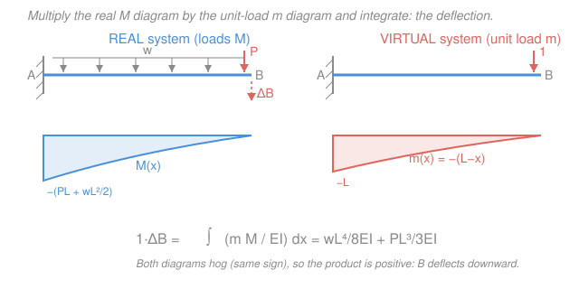

# Structural Analysis · Lesson 2.4: Unit-Load Method for Beams & Frames

> ⏱ ~15 min · Module 2: Deflections · Builds on: [2.3 Strain energy & virtual work](02-03-strain-energy-virtual-work.md), [`mechanics-of-materials` 3.1](../../mechanics-of-materials/lessons/03-01-deflection-by-integration.md) · Unlocks: [2.5 Truss deflections & Castigliano](02-05-truss-deflections-castigliano.md), Module 3 (the flexibility method — its coefficients *are* unit-load deflections)

## Why this matters

You already know two ways to get a beam's deflection: double-integrate the elastic curve ([2.1](02-01-elastic-curve-double-integration.md)) or chase the moment-area diagram ([2.2](02-02-moment-area-theorems.md)). Both are fine for one clean span. But ask for the horizontal sway at the corner of a bent frame, or the drop at one specific joint of a messy structure, and those methods start fighting you — you'd integrate the whole elastic curve just to read off one number.

The **unit-load method** (virtual work applied to bending) is the surgical tool: it hands you the deflection *at one chosen point, in one chosen direction*, and nothing else. Put a fictitious unit load exactly where you want the answer, multiply its moment diagram by the real one, integrate, done. It scales from a cantilever to a whole frame with the *same* three steps, and — the reason Module 3 leans on it entirely — the flexibility coefficients that solve indeterminate structures are nothing but unit-load deflections computed on a released structure.

## The idea

In [2.3](02-03-strain-energy-virtual-work.md) we set external virtual work equal to internal virtual work: a phantom load riding along the real displacement stores exactly the strain energy the real bending builds up. For beams and frames, essentially all of that strain energy lives in **bending** — the $\int M^2/2EI$ term dwarfs shear and axial contributions in ordinary members. So the whole bookkeeping collapses to one product.

Here's the picture. Apply a **unit load** at the point where you want the deflection, pointing in the direction you want. Call the bending moment it produces $m(x)$ — a purely geometric diagram, since a "1" carries no units of force to speak of. Now the *real* loads bend the beam, curving each slice by $M(x)/EI$. The unit load's own moment $m(x)$ does virtual work riding along that real curvature, slice by slice. Add up every slice and you've summed the internal virtual work — which, by 2.3, equals the external virtual work $1\cdot\Delta$. That sum is an integral: $\int mM/EI\,dx$. The "1" out front means the integral *is* the deflection.

The trick's whole power is that **you choose where the unit load goes**. Want the tip drop? Unit force at the tip. Want the rotation at a support? Unit *couple* there instead. The real diagram $M$ never changes; only the virtual diagram $m$ moves to interrogate a different point.

## The formal version

**Unit-load (virtual-work) deflection for beams and frames.** For a linearly elastic member of flexural rigidity $EI$ (units $\mathrm{kN\cdot m^2}$),

$$\boxed{\,1\cdot\Delta \;=\; \int_0^L \frac{m\,M}{EI}\,dx\,}$$

- $\Delta$ — the deflection (m) at the chosen point, in the chosen direction.
- $M = M(x)$ — bending moment (kN·m) from the **real** applied loads, sagging-positive.
- $m = m(x)$ — bending moment (kN·m per unit of the virtual load, effectively kN·m) from a **unit load** placed *at the point and along the direction* of the wanted deflection, on the *same* structure.
- $x$ — position (m) along the member; $L$ — member length (m).

*In words: lay the two bending-moment diagrams on top of each other, multiply them point-by-point, divide by $EI$, and add up along the beam — that total is the deflection under the spot you probed.*

**For a rotation, use a unit couple.** Want the slope $\theta$ (rad) at a point? Apply a unit *moment* (a couple) there instead of a force, get its moment diagram $m_\theta(x)$, and

$$1\cdot\theta \;=\; \int_0^L \frac{m_\theta\,M}{EI}\,dx .$$

*In words: a unit force probes a translation; a unit couple probes a rotation — the machinery is identical.*

**Frames: sum over members.** A frame is just several members rigidly joined. Write $M$ and $m$ on each member using its own local coordinate, integrate each, and add:

$$1\cdot\Delta \;=\; \sum_{\text{members}} \int_0^{L_i} \frac{m\,M}{EI}\,dx .$$

*In words: do the beam integral once per member and total them — columns and beams alike.*

**Reading the sign.** The answer carries a sign relative to your unit load. **Positive** means $\Delta$ points the *same way* as the unit load; **negative** means opposite. So if $m$ and $M$ have the same sign everywhere, the product is positive and the point moves *with* your probe — no guessing the direction.

**The product-integral shortcut.** Because $m(x)$ is almost always straight (a unit load on a determinate span gives a linear or piecewise-linear diagram), $\int mM\,dx$ over a segment depends only on the *shapes* of the two diagrams. Standard **"volume-integral" tables** (Hibbeler's front cover, Kassimali's appendix) list these products — e.g. a triangle of peak $m$ against a triangle of peak $M$ over length $L$ gives $\tfrac13 mML$; a triangle against a parabola gives $\tfrac14 mML$. Handy for fast hand checks, but doing the integral directly, as below, always works.

## Picture

## Worked examples

**Example 1 — Boss Problem 2(a): cantilever tip deflection under UDL + tip load.** A cantilever of length $L$, fixed at $A$ ($x=0$) and free at $B$ ($x=L$), carries a uniform load $w$ (kN/m) over its whole length plus a downward point load $P$ (kN) at the tip $B$. Find the vertical tip deflection $\delta_B$.

*Step 1 — real moments $M(x)$.* Cut at distance $x$ from the wall; take the free-end side, of length $(L-x)$. It carries the tip load $P$ at distance $(L-x)$ and the UDL resultant $w(L-x)$ acting at its centroid $(L-x)/2$. Both hog the cantilever, so (sagging-positive)

$$M(x) = -\Big[\,P(L-x) + \tfrac{w}{2}(L-x)^2\,\Big].$$

*Step 2 — virtual moments $m(x)$.* Remove the real loads; apply a **unit downward load at $B$** (the point and direction we want). By the same cut,

$$m(x) = -(L-x).$$

*Step 3 — integrate the product.* Both diagrams are negative, so their product is positive:

$$1\cdot\delta_B = \int_0^L \frac{m\,M}{EI}\,dx = \frac{1}{EI}\int_0^L (L-x)\Big[P(L-x) + \tfrac{w}{2}(L-x)^2\Big]dx.$$

Split it and substitute $u = L-x$ (so $du=-dx$, and $x:0\to L$ becomes $u:L\to 0$):

$$\int_0^L P(L-x)^2\,dx = P\int_0^L u^2\,du = \frac{PL^3}{3}, \qquad \int_0^L \frac{w}{2}(L-x)^3\,dx = \frac{w}{2}\int_0^L u^3\,du = \frac{wL^4}{8}.$$

Therefore

$$\boxed{\;\delta_B = \frac{PL^3}{3EI} + \frac{wL^4}{8EI}\quad(\text{downward}).\;}$$

*Check.* Units: $\dfrac{\mathrm{kN}\cdot\mathrm{m^3}}{\mathrm{kN\cdot m^2}} = \mathrm{m}$ ✓. Superposition sense: the two terms are exactly the textbook standalone results — $PL^3/3EI$ for a tip load and $wL^4/8EI$ for a UDL — because the linear method just adds them. The UDL term matches the moment-area result of [2.2](02-02-moment-area-theorems.md) (area of $M/EI$ about the tip). Sign is positive, so $B$ moves *with* the unit load, i.e. down — physically obvious. ✓

**Example 2 — a bent frame: horizontal sway of the free end.** An L-frame is fixed at $A$. A horizontal member $AB$ of length $L$ runs right from the support to the knee $B$; a vertical member $BC$ of height $h$ rises from $B$ to the free end $C$. A horizontal load $H$ (kN) pushes $C$ to the right. Find the horizontal deflection of $C$. Take $EI$ constant throughout.

*Step 1 — real moments.* Because we want a horizontal deflection at $C$, and $H$ is already horizontal at $C$, the real and virtual systems share the same shape (with $H\to 1$). Work member by member.

- **Column $BC$** (measure $s$ downward from $C$, $0\le s\le h$): the load $H$ acts a distance $s$ from the cut, so $M = Hs$ — zero at $C$, growing to $Hh$ at the knee $B$.
- **Beam $AB$** (measure $x$ from $A$, $0\le x\le L$): $H$ acts at $C$, a height $h$ above this member, so its moment arm is the constant $h$: $M = Hh$ everywhere along $AB$.

*Step 2 — virtual moments.* Unit horizontal load at $C$, same direction: identical diagrams with $H$ replaced by $1$: $m = s$ on $BC$, $m = h$ on $AB$.

*Step 3 — integrate and sum over the two members:*

$$1\cdot\Delta_C = \frac{1}{EI}\underbrace{\int_0^h (s)(Hs)\,ds}_{\text{column }BC} + \frac{1}{EI}\underbrace{\int_0^L (h)(Hh)\,dx}_{\text{beam }AB} = \frac{1}{EI}\left[\frac{Hh^3}{3} + Hh^2L\right].$$

$$\boxed{\;\Delta_C = \frac{Hh^3}{3EI} + \frac{Hh^2 L}{EI}\quad(\text{in the direction of }H).\;}$$

Both members pull in the same direction — a frame deflection is *not* just its beam bending; the column carries a hefty constant moment $Hh$ and contributes the larger $Hh^2L$ term here.

*Check.* Units: $\dfrac{\mathrm{kN}\cdot\mathrm{m^3}}{\mathrm{kN\cdot m^2}}=\mathrm{m}$ ✓. Plug in $H=10$ kN, $h=3$ m, $L=4$ m: $\Delta_C EI = \tfrac{10\cdot27}{3} + 10\cdot 9\cdot 4 = 90 + 360 = 450\ \mathrm{kN\cdot m^3}$, so with $EI = 20{,}000\ \mathrm{kN\cdot m^2}$, $\Delta_C = 0.0225\ \mathrm{m} = 22.5$ mm to the right. A tall column ($h$) matters cubically in its own bending and quadratically through the beam — sway is dominated by column height, as any structural engineer feels in their bones. ✓

## Watch out

- **You might think the unit load is a real 1 kN force with units to track.** It's a *dimensionless bookkeeping device* — the "1" on the left of $1\cdot\Delta=\int mM/EI\,dx$ cancels the load units so the right side comes out in pure length. Never scale your answer by a load; the unit load has already done its job.
- **You might apply the unit load in the wrong slot for what you're after.** A unit **force** gives a translation *along that force*; a unit **couple** gives a rotation. Want the slope? You need $m_\theta$ from a unit moment, not a unit force — mixing them answers a different question.
- **You might drop a member's integral in a frame, or forget a sign.** Every member that bends under *either* the real *or* the virtual load contributes; a member with $m=0$ (its virtual diagram vanishes) drops out, but check, don't assume. And keep $M$ and $m$ in one consistent sign convention on each member — a flipped sign silently turns a deflection into its negative.

## One-liner

> To get the deflection at one point, put a unit load there, then integrate its moment diagram against the real one over every member: $\Delta = \sum\int mM/EI\,dx$.

## Problems

**P1 (🟢)** A cantilever of length $L$ carries a single downward tip load $P$ (no UDL). Using the unit-load method, show the tip deflection is $PL^3/3EI$. Then, without re-integrating, write the tip *slope* setup: what virtual load do you apply, and what is $m_\theta(x)$?

**P2 (🟡)** A simply supported beam of span $L$ carries a central point load $P$. Find the deflection under the load by the unit-load method. (Hint: by symmetry both the real $M$ and the virtual $m$ are triangles peaking at midspan; integrate over the left half and double.)

**P3 (🔴)** In the Example-2 frame ($AB$ horizontal length $L$, $BC$ vertical height $h$, fixed at $A$), remove the horizontal load. Now a **downward** load $P$ acts at the free end $C$. Find the **vertical** deflection of $C$. Which member(s) contribute, and why is the column's contribution different from Example 2?

Solutions

**P1** Real: cut at $x$ from the wall, free-end side length $(L-x)$ carries $P$, so $M(x) = -P(L-x)$. Virtual: unit downward load at the tip gives $m(x) = -(L-x)$. Then

$$1\cdot\delta_B = \frac{1}{EI}\int_0^L (L-x)\,P(L-x)\,dx = \frac{P}{EI}\int_0^L u^2\,du = \frac{PL^3}{3EI}.$$

For the tip **slope**, apply a **unit couple** at the tip. Its moment is constant along the beam: $m_\theta(x) = -1$ (a unit couple carried to any cut). Then $\theta_B = \frac{1}{EI}\int_0^L(-1)\big[-P(L-x)\big]dx = \frac{P}{EI}\cdot\frac{L^2}{2} = \frac{PL^2}{2EI}$.

*Check.* Units of $\delta$: m ✓; of $\theta$: $\mathrm{kN\cdot m^2/(kN\cdot m^2)}$ = dimensionless (rad) ✓. Both are the standard cantilever results.

**P2** Place the origin at the left support $A$, span $L$, load $P$ at midspan. Reactions $P/2$ each. On the left half ($0\le x\le L/2$), real moment $M(x) = \tfrac{P}{2}x$ (sagging-positive). Unit load at midspan gives reactions $1/2$ each, so on the left half $m(x) = \tfrac12 x$. By symmetry integrate the left half and double:

$$1\cdot\Delta = 2\cdot\frac{1}{EI}\int_0^{L/2}\Big(\tfrac12 x\Big)\Big(\tfrac{P}{2}x\Big)dx = \frac{2}{EI}\cdot\frac{P}{4}\int_0^{L/2}x^2\,dx = \frac{P}{2EI}\cdot\frac{(L/2)^3}{3} = \frac{PL^3}{48EI}.$$

*Check.* Units: m ✓. $PL^3/48EI$ is the textbook central-deflection formula for a simply supported beam ✓. It's stiffer than a cantilever of the same span (48 vs 3 in the denominator) — supports at both ends, as expected.

**P3** Vertical deflection at $C$ under a downward $P$ at $C$. Real loads first.
- **Beam $AB$** (measure $x$ from $A$): $C$ sits directly above $B$ at horizontal position $L$, so the downward $P$ has moment arm $(L-x)$ about a cut in $AB$ — arm $L$ at $A$, arm $0$ at $B$. Thus $M(x) = -P(L-x)$ (hogging).
- **Column $BC$**: a *vertical* load passing straight down through $C$ and along the column line produces **no** bending moment in the vertical member (the force is axial to $BC$): $M = 0$ on $BC$.

Virtual: unit **downward** load at $C$ (matching the wanted vertical deflection) — same shapes with $P\to 1$: $m = -(L-x)$ on $AB$, $m = 0$ on $BC$.

$$\Delta_C = \frac{1}{EI}\int_0^L (L-x)\,P(L-x)\,dx + 0 = \frac{P}{EI}\int_0^L u^2\,du = \frac{PL^3}{3EI}\quad(\text{down}).$$

Only the **beam** $AB$ contributes: it bends like a cantilever of span $L$. The **column carries no bending** because the vertical load runs axially down its length — the opposite of Example 2, where a *horizontal* load put the column in bending and made it the dominant term. The lesson: which member bends depends on the load's direction relative to each member's axis.

*Check.* Units: m ✓. The answer is exactly a cantilever-tip deflection $PL^3/3EI$, sensible since $AB$ acts as a cantilever and $BC$ just rides along rigidly. ✓

## Flashback

**From Lesson 2.3 (Strain energy & virtual work):** A cantilever of length $L$ carries only a downward tip load $P$. Compute the bending **strain energy** $U = \displaystyle\int_0^L \frac{M^2}{2EI}\,dx$ stored in the beam. Then differentiate it with respect to $P$ and state what you get.

Solution

With $M(x) = -P(L-x)$, we have $M^2 = P^2(L-x)^2$, so

$$U = \int_0^L \frac{P^2(L-x)^2}{2EI}\,dx = \frac{P^2}{2EI}\int_0^L u^2\,du = \frac{P^2}{2EI}\cdot\frac{L^3}{3} = \frac{P^2 L^3}{6EI}.$$

Differentiating: $\dfrac{\partial U}{\partial P} = \dfrac{PL^3}{3EI}$ — exactly the tip deflection. This is **Castigliano's second theorem** ($\Delta = \partial U/\partial P$), the energy sibling of the unit-load method and the star of [2.5](02-05-truss-deflections-castigliano.md); both fall out of the same virtual-work principle from 2.3.

*Check.* Units of $U$: $\dfrac{\mathrm{kN^2\cdot m^3}}{\mathrm{kN\cdot m^2}} = \mathrm{kN\cdot m}$ = energy ✓. Units of $\partial U/\partial P$: $\mathrm{kN\cdot m/kN} = \mathrm{m}$ ✓, a length as a deflection must be.

## Connections

- **Backward:** this is [2.3](02-03-strain-energy-virtual-work.md)'s virtual-work principle specialized to bending — the internal virtual work $\int mM/EI\,dx$ set equal to the external $1\cdot\Delta$. The results agree with the elastic-curve integration of [2.1](02-01-elastic-curve-double-integration.md) and the moment-area areas of [2.2](02-02-moment-area-theorems.md), and with the single-member deflections derived in [`mechanics-of-materials` 3.1–3.2](../../mechanics-of-materials/lessons/03-02-deflection-by-superposition.md) — but now it extends cleanly to whole frames.
- **Forward:** [2.5](02-05-truss-deflections-castigliano.md) swaps $\int mM/EI\,dx$ for the truss sum $\sum nNL/AE$ (axial instead of bending) and introduces Castigliano's theorem. Then **Module 3** ([3.1](03-01-indeterminacy-redundancy-compatibility.md)–[3.2](03-02-force-method-beams.md)) is built on this method: a flexibility coefficient $f_{ij}$ is *literally* the unit-load deflection at $i$ due to a unit redundant at $j$, computed on the released structure — you'll run this integral over and over there.
- **Sideways (calculus & the released-structure idea):** the whole method is one definite integral of a product ([`calc-refresher`](../../calc-refresher/syllabus.md)), and the substitution $u=L-x$ that keeps recurring is why the product-integral tables exist. The "probe one quantity with a dual unit load" idea reappears as Müller-Breslau's influence lines in [4.2](04-02-influence-lines-indeterminate-muller-breslau.md) — release the restraint you're measuring and read the deflected shape.
