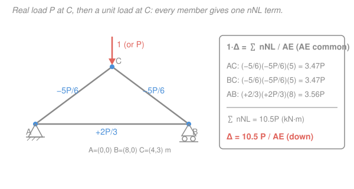

# Structural Analysis · Lesson 2.5: Truss Deflections & Castigliano's Theorem

> ⏱ ~15 min · Module 2: Deflections & Energy Methods · Builds on: [2.4 Unit-Load Method for Beams & Frames](02-04-unit-load-method-beams-frames.md), [1.5 Trusses & Determinate Frames](01-05-trusses-determinate-frames.md) · Unlocks: [3.3 Force Method for Frames, Trusses & Support Effects](03-03-force-method-frames-trusses-support-effects.md)

## Why this matters

A truss doesn't bend — it *stretches and shortens*, one straight member at a time. So the elegant integral machinery from [2.4](02-04-unit-load-method-beams-frames.md) collapses into something even friendlier: no $M(x)$ to integrate, just a sum over members. This is how you find how far a roof node sags, how much a bridge panel point drops under a truck, or whether two halves of a structure will actually meet up at assembly. It's also the exact tool you'll need in [3.3](03-03-force-method-frames-trusses-support-effects.md) to crack indeterminate trusses — because compatibility there is just "this deflection equals that one," and *this* lesson is how you compute each one.

## The idea

A truss member is a spring. Pull an axial member with force $N$ and it lengthens by $\delta = NL/(AE)$ — force times length over stiffness, straight out of $\sigma = E\varepsilon$. That's the only deformation a truss has.

Now the virtual-work trick from [2.4](02-04-unit-load-method-beams-frames.md), transplanted: to find the displacement of one joint in one direction, put a **unit load** there and ask, "if every member stretches by its real amount $\delta = NL/(AE)$, how much external work does my unit load do riding along?" Work in equals work stored, and the answer pops out as a sum. The unit load's job is to *interrogate* the structure — its member forces $n$ are exactly the weighting factors that say how much each member's stretch contributes to the joint you care about.

So the whole method is two truss analyses you already know how to do (method of joints, [1.5](01-05-trusses-determinate-frames.md)), stitched together by a multiplication table. No calculus.

## The formal version

**Unit-load (virtual work) for trusses.** To get the displacement $\Delta$ of a chosen joint in a chosen direction,

$$1\cdot\Delta \;=\; \sum_{\text{members}} \frac{n\,N\,L}{AE},$$

where, member by member,

- $N$ = **real** axial force from the actual loads (kN; tension $+$, compression $-$),
- $n$ = **virtual** axial force from a *single unit load* ($1$, dimensionless) applied at the target joint in the target direction, with all real loads removed,
- $L$ = member length (m), $A$ = cross-sectional area (m²), $E$ = modulus (kN/m²), so $AE$ is axial stiffness (kN).

*In words: each member's real stretch $NL/(AE)$ is weighted by how hard the unit load leans on that member ($n$), and summed.* The left side is $1\cdot\Delta$ because the unit load ($=1$) moves through the very displacement $\Delta$ you're solving for; the "1" carries the units so $\Delta$ comes out in metres. A **positive** answer means the joint moves *in the direction of your unit load*; negative means opposite.

**The procedure (memorize this rhythm):**

1. Solve the **real** system for every $N$ (method of joints).
2. Remove the real loads; apply **one unit load** at the target joint/direction; solve every $n$.
3. Tabulate $n$, $N$, $L$ (and $A$, $E$ if they vary) per member; compute each $nNL/AE$; **sum**.

**Castigliano's second theorem.** The strain energy stored in the truss is $U=\sum \dfrac{N^2 L}{2AE}$ (each member's spring energy $\tfrac12 N\delta$). The theorem says the deflection at a load equals the partial derivative of $U$ with respect to that load:

$$\Delta_i=\frac{\partial U}{\partial P_i}\;=\;\sum \frac{N L}{AE}\,\frac{\partial N}{\partial P_i}.$$

*In words: how fast the stored energy grows as you nudge the load $P_i$ tells you how far its point of application moves.* Here's the punchline — differentiating the axial forces gives $\dfrac{\partial N}{\partial P_i}=n$, because doubling $P_i$ doubles every $N$ linearly, so $\partial N/\partial P_i$ is just the force from a *unit* $P_i$. **Castigliano and the unit-load method are the same sum**, arrived at from energy instead of virtual work.

**The dummy-load trick.** Castigliano needs a load *at* the joint whose deflection you want. What if none acts there? Invent one: add a fictitious load $Q$ at that joint in the wanted direction, carry it through the force analysis so each $N=N(P,Q)$, differentiate, then set $Q=0$:

$$\Delta \;=\;\left.\sum \frac{N L}{AE}\,\frac{\partial N}{\partial Q}\right|_{Q=0}.$$

*In words: put an imaginary load where you want the answer, do the calculus, then delete it.* Note $\partial N/\partial Q\big|_{Q=0}$ is exactly the virtual force $n$ from a unit load at that joint — so this is the unit-load method wearing a disguise.

## Picture

## Worked examples

**Example 1 (unit-load method — tabulate and sum).** The truss above: pin at $A=(0,0)$, roller at $B=(8,0)$, apex $C=(4,3)$ (metres), members $AC=BC=5$ m and $AB=8$ m, all sharing the same $A$ and $E$. A downward load $P=30$ kN acts at $C$. Find the **vertical** deflection of $C$. Take $A=2000\ \mathrm{mm^2}=0.002\ \mathrm{m^2}$, $E=200\ \mathrm{GPa}=200\times10^{6}\ \mathrm{kN/m^2}$.

*Step 1 — real forces $N$.* By symmetry the reactions are $A_y=B_y=P/2$, $A_x=0$. Joint $C$: the two diagonals share the vertical load, giving $N_{AC}=N_{BC}=-\tfrac{5}{6}P$ (compression). Joint $A$: horizontal equilibrium gives the bottom chord $N_{AB}=+\tfrac{2}{3}P$ (tension). (This is exactly the joint-method drill from [1.5](01-05-trusses-determinate-frames.md).)

*Step 2 — virtual forces $n$.* The unit load is a downward $1$ at $C$ — the *same* load pattern as the real one but with $P\to1$. So $n_i=N_i/P$ directly: $n_{AC}=n_{BC}=-\tfrac{5}{6}$, $n_{AB}=+\tfrac{2}{3}$.

*Step 3 — tabulate $nNL/AE$.* With $AE$ common, factor it out and sum $nNL$:

| Member | $L$ (m) | $N$ (kN) | $n$ | $nNL$ (kN·m) |
|---|---|---|---|---|
| $AC$ | 5 | $-\tfrac{5}{6}P$ | $-\tfrac{5}{6}$ | $+\tfrac{125}{36}P = 3.47P$ |
| $BC$ | 5 | $-\tfrac{5}{6}P$ | $-\tfrac{5}{6}$ | $+\tfrac{125}{36}P = 3.47P$ |
| $AB$ | 8 | $+\tfrac{2}{3}P$ | $+\tfrac{2}{3}$ | $+\tfrac{32}{9}P = 3.56P$ |
| | | | **$\sum$** | $10.5\,P$ |

$$\Delta_{Cv}=\frac{\sum nNL}{AE}=\frac{10.5\,P}{AE}=\frac{10.5\times 30}{0.002\times200\times10^{6}}=\frac{315}{4\times10^{5}}=7.9\times10^{-4}\ \mathrm{m}=0.79\ \mathrm{mm}\ \text{(down).}$$

*Check.* Every $nNL$ term is positive (each product of like signs), so the joint moves *with* the unit load — down — as physics demands under a downward load. Units: $\dfrac{(\text{kN})(\text{m})}{\text{kN}}=\text{m}$ ✓. Magnitude sub-millimetre for a stiff steel truss ✓.

**Example 2 (Castigliano — same sum, plus the dummy-load trick).**

*(a) Castigliano reproduces Example 1.* The member forces are linear in $P$: $N_{AC}=-\tfrac56 P$, so $\dfrac{\partial N_{AC}}{\partial P}=-\tfrac56=n_{AC}$, and likewise for every member. Therefore

$$\Delta_{Cv}=\sum\frac{NL}{AE}\frac{\partial N}{\partial P}=\sum\frac{n\,N\,L}{AE}=\frac{10.5\,P}{AE},$$

*identical* to the unit-load answer — the theorem is the same table, keyed by $\partial N/\partial P=n$.

*(b) Dummy load for a deflection with no load there.* Now find the **horizontal** deflection of $C$. No horizontal load acts at $C$, so add a fictitious rightward load $Q$ there and recompute the forces as functions of $(P,Q)$. Redoing joint $C$ and joint $A$ with $Q$ present:

$$N_{AC}=-\tfrac56 P+\tfrac58 Q,\quad N_{BC}=-\tfrac56 P-\tfrac58 Q,\quad N_{AB}=\tfrac23 P+\tfrac12 Q.$$

Differentiate and set $Q=0$ (so the $N$'s revert to their real values):

$$\frac{\partial N_{AC}}{\partial Q}=+\tfrac58,\quad \frac{\partial N_{BC}}{\partial Q}=-\tfrac58,\quad \frac{\partial N_{AB}}{\partial Q}=+\tfrac12.$$

These are exactly the $n$'s from a unit *horizontal* load at $C$. Sum $\dfrac{NL}{AE}\dfrac{\partial N}{\partial Q}$:

$$\Delta_{Ch}=\frac{1}{AE}\Big[\underbrace{(-\tfrac56P)(\tfrac58)(5)}_{-125P/48}+\underbrace{(-\tfrac56P)(-\tfrac58)(5)}_{+125P/48}+\underbrace{(\tfrac23P)(\tfrac12)(8)}_{+8P/3}\Big]=\frac{8P/3}{AE}=\frac{2.67\,P}{AE}.$$

Numerically $\Delta_{Ch}=\dfrac{8\times30/3}{4\times10^{5}}=2.0\times10^{-4}\ \mathrm{m}=0.20\ \mathrm{mm}$ to the right.

*Check.* The two diagonal terms cancel (equal real forces, opposite virtual signs), leaving only the bottom chord — sensible, since a horizontal drift of $C$ is driven by $AB$ stretching. Positive $\Rightarrow$ moves in the $Q$ direction (right): the pin at $A$ is fixed while the tension chord elongates and shoves the roller $B$ (and with it $C$) rightward. The truss is *not* mirror-symmetric — pin at $A$, roller at $B$ — so a nonzero horizontal deflection is exactly right. Units metres ✓.

## Watch out

- **You might think you need calculus like the beam case.** You don't — a truss has no $M(x)$, only constant axial force per member, so the [2.4](02-04-unit-load-method-beams-frames.md) integral $\int \frac{mM}{EI}dx$ degenerates to the algebraic sum $\sum \frac{nNL}{AE}$. Trade the integral for a table.
- **You might drop a sign and get the deflection backwards.** Keep tension $+$ / compression $-$ consistent in *both* the $N$ column and the $n$ column. A compression member with a compressive virtual force gives $(-)(-)=+$, a real contribution to the deflection — the double negative is not a cancellation, it's a positive term.
- **You might set $Q=0$ too early.** In the dummy-load trick you must carry $Q$ through the equilibrium *and* the differentiation, and only substitute $Q=0$ at the very end. Zero it before differentiating and $\partial N/\partial Q$ vanishes with it.
- **You might forget the unit load's direction defines the answer's direction.** $\Delta$ is the displacement component *along* your unit load. Want horizontal? Apply a horizontal unit load. Want the movement of joint $D$? Put the unit load at $D$, not at the loaded joint.

## One-liner

> A truss deflection is one multiplication table — real force $N$ times virtual force $n$ times $L/(AE)$, summed over members — and Castigliano is the same table with $\partial N/\partial P$ standing in for $n$.

## Problems

**P1 (🟢)** For the Example-1 truss, suppose the bottom chord $AB$ is built with **twice** the area of the diagonals: $A_{AB}=2A$, $A_{AC}=A_{BC}=A$ (same $E$ throughout). Recompute the vertical deflection of $C$ under $P=30$ kN. Use $A=0.002\ \mathrm{m^2}$, $E=200\times10^{6}\ \mathrm{kN/m^2}$. (The forces $N,n$ are unchanged — only the $AB$ stiffness changes.)

**P2 (🟡)** A two-bar truss: joint $C=(0,0)$ hangs from a wall by member $CA$ running up-left to $A=(-3,4)$ m and member $CB$ running up-right to $B=(3,4)$ m (both pinned to the wall). A downward load $P=40$ kN hangs at $C$. Each bar has $AE=5\times10^{5}$ kN. Find the vertical deflection of $C$ by the unit-load method. (Both bars have length 5 m; by symmetry each carries the same force.)

**P3 (🔴)** In the P2 two-bar truss, use the **dummy-load trick** to find the *horizontal* deflection of $C$ under the same $P=40$ kN. Predict the answer *before* computing, using symmetry — then confirm it with the algebra.

Solutions

**P1** Forces are as in Example 1: $N_{AC}=N_{BC}=-\tfrac56 P$, $N_{AB}=+\tfrac23 P$, and $n$ equal to $N/P$. Now the stiffness differs by member, so keep $AE$ inside each term. Write each contribution as $nNL/(A_iE)$:

- Diagonals ($A_i=A$): each $\dfrac{(-\tfrac56)(-\tfrac56 P)(5)}{AE}=\dfrac{125P/36}{AE}=\dfrac{3.472P}{AE}$; two of them $=\dfrac{6.944P}{AE}$.
- Chord ($A_i=2A$): $\dfrac{(\tfrac23)(\tfrac23 P)(8)}{2AE}=\dfrac{32P/9}{2AE}=\dfrac{1.778P}{AE}$.

$$\Delta_{Cv}=\frac{6.944P+1.778P}{AE}=\frac{8.72\,P}{AE}=\frac{8.72\times30}{0.002\times200\times10^{6}}=\frac{261.7}{4\times10^{5}}=6.5\times10^{-4}\ \mathrm{m}=0.65\ \mathrm{mm}.$$

*Check.* Fattening the chord (its term nearly halves, $3.56P\to1.78P$) reduces the deflection from $0.79$ mm to $0.65$ mm — stiffer member, less movement ✓. Units metres ✓.

**P2** *Real forces.* At $C$, the two bars rise symmetrically at slope $4/3$ (each direction from $C$: $(\mp3,4)/5$). Vertical equilibrium: $2\,N\cdot\tfrac45 = P$ upward must balance $P$ down, but the bars are in tension pulling $C$ up, so $N_{CA}=N_{CB}=+\tfrac{5P}{8}$ (tension). *Virtual:* unit load down at $C$ is the same pattern with $P\to1$, so $n=+\tfrac58$ each.

$$\Delta_{Cv}=\sum\frac{nNL}{AE}=2\cdot\frac{(\tfrac58)(\tfrac58 P)(5)}{AE}=\frac{2\cdot\tfrac{125}{64}P}{AE}=\frac{3.906\,P}{AE}=\frac{3.906\times40}{5\times10^{5}}=3.1\times10^{-4}\ \mathrm{m}=0.31\ \mathrm{mm (down).}$$

*Check.* $\tfrac58$ from $\tfrac{1}{2}\cdot\tfrac{1}{4/5}=\tfrac{5}{8}$; both bars tension under a hanging load ✓; positive $\Rightarrow$ downward ✓. Units metres ✓.

**P3** *Prediction.* The structure and load are perfectly mirror-symmetric about the vertical through $C$, so $C$ can only move straight down — the horizontal deflection must be **zero**.

*Confirm.* Add a rightward dummy $Q$ at $C$. Horizontal equilibrium now unbalances the two bars: solving joint $C$ with loads $(Q,-P)$ gives $N_{CA}=\tfrac58 P-\tfrac58 Q$ and $N_{CB}=\tfrac58 P+\tfrac58 Q$ (the windward bar sheds force, the leeward gains it). Then $\dfrac{\partial N_{CA}}{\partial Q}=-\tfrac58$, $\dfrac{\partial N_{CB}}{\partial Q}=+\tfrac58$. At $Q=0$ both real forces equal $\tfrac58 P$, so

$$\Delta_{Ch}=\frac{1}{AE}\Big[(\tfrac58 P)(-\tfrac58)(5)+(\tfrac58 P)(+\tfrac58)(5)\Big]=0.\quad\checkmark$$

*Check.* Equal-and-opposite virtual forces on equal real forces cancel term-by-term — the symmetry prediction confirmed by the algebra ✓.

## Flashback

**From Lesson 1.5 (Trusses & Determinate Frames):** In the Example-1 truss (pin $A=(0,0)$, roller $B=(8,0)$, apex $C=(4,3)$, load $P=30$ kN down at $C$), verify the diagonal force $N_{AC}$ by the **method of joints** at $A$, working from the reactions. Give magnitude and state tension or compression.

Solution

Reactions by symmetry: $A_y=B_y=P/2=15$ kN up, $A_x=0$. Isolate joint $A$. Two members meet there: $AB$ (horizontal, toward $B$) and $AC$ (up-right toward $C=(4,3)$, unit direction $(4,3)/5$).

Vertical equilibrium at $A$: the only vertical contribution is from $AC$,
$$N_{AC}\cdot\tfrac35 + A_y = 0 \;\Rightarrow\; N_{AC}=-\tfrac53 A_y=-\tfrac53(15)=-25\ \mathrm{kN}.$$
Magnitude $25$ kN, **compression** (negative). This matches $-\tfrac56 P=-\tfrac56(30)=-25$ kN.

*Check.* The diagonal must push back against the upward reaction, hence compression; $\tfrac35$ is the vertical direction cosine of the 3-4-5 member ✓. Horizontal equilibrium then gives $N_{AB}=-\tfrac45 N_{AC}=+20$ kN $=+\tfrac23 P$ (tension), consistent with Example 1 ✓.

## Connections

- **Backward:** the real forces $N$ come straight from the method of joints in [1.5](01-05-trusses-determinate-frames.md) (and [`statics` 02-01](../../statics/lessons/02-01-trusses-method-of-joints.md)); the virtual-work principle behind $1\cdot\Delta=\sum nNL/AE$ is the truss specialization of [2.3](02-03-strain-energy-virtual-work.md)'s unit-load principle and [2.4](02-04-unit-load-method-beams-frames.md)'s $\int mM/EI\,dx$ — integral for beams, sum for trusses. The single-member stretch $NL/(AE)$ is the axial-deformation result from [`mechanics-of-materials` 01-04](../../mechanics-of-materials/lessons/01-04-statically-indeterminate-axial.md).
- **Forward:** [3.3 Force Method for Frames, Trusses & Support Effects](03-03-force-method-frames-trusses-support-effects.md) makes this the engine of indeterminate truss analysis — the flexibility coefficients $f_{ij}$ are $\sum n_i n_j L/(AE)$ and the load term $\Delta_{i0}$ is $\sum n_i N L/(AE)$, both computed by exactly today's table.
- **Sideways (energy / calculus):** Castigliano's $\Delta=\partial U/\partial P$ is the same "differentiate the stored energy to get the conjugate displacement" move you'll meet as a general variational principle; the linearity that makes $\partial N/\partial P=n$ is just superposition. The dummy-load trick — introduce a parameter, differentiate, then set it to zero — is the same device used to evaluate awkward integrals by [`calc-refresher`](../../calc-refresher/syllabus.md)'s differentiation-under-the-integral.
