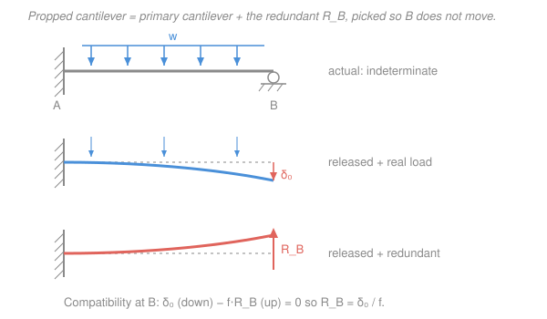

# Structural Analysis · Lesson 3.1: Indeterminacy, Redundancy & Compatibility

> ⏱ ~15 min · Module 3: Statically Indeterminate Structures · Builds on: [1.2 Supports, Reactions & Static Determinacy](01-02-supports-reactions-determinacy.md), [2.4 Unit-Load Method for Beams & Frames](02-04-unit-load-method-beams-frames.md), [`mechanics-of-materials` 3.3 Statically indeterminate beams](../../mechanics-of-materials/lessons/03-03-statically-indeterminate-beams.md) · Unlocks: [3.2 The Force (Flexibility) Method for Beams](03-02-force-method-beams.md)

## Why this matters

Almost every real structure has *more supports or members than it strictly needs to stand up*. A bridge girder runs continuously over four piers; a building frame is rigidly welded at every joint and bolted to its footings; a roof truss gets an extra diagonal for stiffness. That redundancy is the whole point — it makes the structure stiffer, safer, and less sensitive to one support failing. But it comes at a price for the analyst: **equilibrium alone can no longer find the forces.** You write down every force-balance equation you have and you *still* have unknowns left over. This lesson is the fork in the road for the second half of the course. It names exactly how many unknowns you're short (the **degree of indeterminacy**), and it introduces the one new physical principle that closes the gap — **compatibility**, the demand that the deflected structure still fit its supports. Everything in Module 3 (force method, slope-deflection, moment distribution) is a different way of cashing in that one idea.

## The idea

Back in [1.2](01-02-supports-reactions-determinacy.md) a structure was **determinate** when equilibrium had exactly as many equations as reaction unknowns — three per rigid body in a plane ($\sum F_x = \sum F_y = \sum M = 0$). Add one more support than that, and you have a **redundant**: an unknown that equilibrium can't pin down. Any set of reactions that merely *balances forces* is now possible on paper — so what selects the real one?

Geometry does. A real support doesn't just push; it also *holds a point in place*. The roller under a propped cantilever doesn't only supply an upward force — it forbids that point from moving down. That's a fact equilibrium never knew about. Here's the move that turns it into an equation: **imagine deleting the redundant support.** What's left is a determinate structure you already know how to solve — the **primary (released) structure**. Under the real load it deflects freely at the spot you released. But in reality that spot *can't* move — the deleted support was holding it still. So the redundant is precisely the unknown force that, re-applied to the released structure, cancels that deflection. "The deflection at the release must equal its true value" is the **compatibility condition**, and it is exactly the equation you were missing. One redundant, one compatibility equation; two redundants, two equations. Solve them, and equilibrium mops up the rest.

You've seen this once already, for a single beam, in [`mechanics-of-materials` 3.3](../../mechanics-of-materials/lessons/03-03-statically-indeterminate-beams.md). This module scales the same idea up to whole frames and trusses, and gives you deflection tools ([2.4](02-04-unit-load-method-beams-frames.md)'s unit-load method) powerful enough to feed it.

## The formal version

### Degree of static indeterminacy (DSI)

Count the unknown forces, subtract the equations you can write. What's left over is the DSI.

**Trusses** (pin-jointed, members carry axial force only):

$$\text{DSI} = m + r - 2j,$$

where $m$ = number of members, $r$ = number of reaction components, $j$ = number of joints. *In words: each joint gives 2 equilibrium equations ($\sum F_x=\sum F_y=0$); the unknowns are the $m$ member forces plus the $r$ reactions.* DSI $=0$ is determinate, DSI $>0$ indeterminate, DSI $<0$ (too few) unstable.

**Beams & frames** (members carry axial force, shear, and moment). For a single continuous member:

$$\text{DSI} = r - (3 + c),$$

and for a general planar frame of several members and rigid joints:

$$\text{DSI} = (3m + r) - (3n + c),$$

where $n$ = number of nodes (joints, including supports and free ends), $c$ = number of **condition (release) equations** — one for each internal hinge that relaxes moment, since it adds the extra equation "moment $=0$ there." *In words: a rigid planar member gives 3 equilibrium equations per node; internal hinges hand you bonus equations, so they subtract from the indeterminacy.*

**External vs. internal.** Split the redundancy by where it lives:

- **External indeterminacy** $= r - (3 + c)$ — excess *reactions* beyond what whole-structure equilibrium needs.
- **Internal indeterminacy** $= \text{DSI} - \text{(external)}$ — excess *members* (a truss's extra diagonal, a frame's closed loop).

A structure can be externally determinate yet internally indeterminate (an extra truss diagonal) or vice versa (an ordinary beam with one too many props).

### Primary structure & compatibility

1. **Pick $\text{DSI}$ redundants** $X_1, \dots, X_n$ — any mix of excess reactions or internal forces whose removal leaves a **stable, determinate primary (released) structure**.
2. **Release** them: delete those supports/restraints. Now the redundants are treated as *unknown applied loads* on the primary structure.
3. **Compatibility:** for each release $i$, the actual displacement there is known (usually $0$ at a support). By superposition on the released structure,

$$\Delta_{i0} + \sum_{j=1}^{n} f_{ij}\,X_j = \Delta_i^{\text{true}},$$

where $\Delta_{i0}$ = displacement at $i$ from the real loads on the released structure, and $f_{ij}$ = displacement at $i$ from a *unit* value of redundant $X_j$ (a **flexibility coefficient**, computed by the unit-load method of [2.4](02-04-unit-load-method-beams-frames.md)). *In words: real-load deflection plus the redundants' own deflections must add up to what the support actually permits.* For a rigid support $\Delta_i^{\text{true}}=0$; support settlement or thermal misfit puts a known nonzero value on the right (that's [3.3](03-03-force-method-frames-trusses-support-effects.md)).

That linear system is the whole plan for the **force method** ([3.2](03-02-force-method-beams.md)). Note the unknowns are *forces* and the equations are *geometric*.

### Two families, one map

There are two grand strategies for indeterminate structures, and it's worth seeing the split now:

- **Force (flexibility) method** — unknowns are **redundant forces**; you *release* restraints to a determinate primary structure and enforce **compatibility** (geometry). Best by hand when DSI is small. Lessons [3.2](03-02-force-method-beams.md)–[3.3](03-03-force-method-frames-trusses-support-effects.md).
- **Displacement (stiffness) method** — unknowns are **joint displacements/rotations**; you *lock* the joints, then enforce **equilibrium** at each one. Its bookkeeping is uniform no matter how indeterminate the structure, which is exactly why computers use it. Slope-deflection ([3.4](03-04-slope-deflection-method.md)) and moment distribution ([3.5](03-05-moment-distribution-method.md)) are hand versions; the matrix stiffness method ([4.3](04-03-matrix-stiffness-method.md)) is the industrial one. The two families are duals: release-and-fit-geometry versus lock-and-balance-forces.

## Picture

## Worked examples

### Example 1 — count the degree of indeterminacy

Apply the formulas to four structures. Watch the external/internal split.

| Structure | Reactions $r$ | Count | DSI | Where it lives |
|---|---|---|---|---|
| Propped cantilever (fixed $A$ + roller $B$) | $3+1=4$ | $r-(3+c)=4-3$ | **1** | external |
| Fixed–fixed beam | $3+3=6$ | $6-3$ | **3** | external |
| Continuous 3-span beam (4 supports: pin + 3 rollers) | $2+1+1+1=5$ | $5-3$ | **2** | external |
| Square-panel truss with a *second* diagonal | $r=3$ | $m+r-2j=6+3-8$ | **1** | internal |

**Propped cantilever.** Fixed end supplies $H,V,M$ (3), roller supplies one vertical (1), no internal hinges ($c=0$): $\text{DSI}=4-3=1$. One redundant — this is the beam from the Picture.

**Fixed–fixed beam.** Both ends fully fixed: $r=6$, $\text{DSI}=6-3=3$. Careful here: that's the *full* planar count (it includes axial force). If the loading is **purely transverse** so no axial force develops, the two horizontal reactions and $\sum F_x$ drop out together — leaving 4 reactions and 2 useful equations, $\text{DSI}=4-2=\mathbf{2}$. State which model you mean; textbooks quote **3** in general and **2** for the transverse-only case (as we used in [`mechanics-of-materials` 3.3](../../mechanics-of-materials/lessons/03-03-statically-indeterminate-beams.md)).

**Continuous 3-span beam.** Three spans need four supports. Say a pin ($2$) plus three rollers ($3\times1$): $r=5$, $\text{DSI}=5-3=2$. (For transverse loads only, count 4 vertical reactions minus 2 equations $=2$ — same answer.) A continuous beam over $N$ supports carrying transverse load is indeterminate to degree $N-2$.

**Truss with an extra diagonal.** Take one square panel: $j=4$ joints, sides + one diagonal $=5$ members would give $m+r-2j = 5+3-8 = 0$ (determinate). Add a **second diagonal** so $m=6$: $\text{DSI}=6+3-8=\mathbf{1}$. It's *internally* indeterminate — the reactions are still fine ($r-3=0$ external), but the two crossed diagonals share the panel's shear in a proportion equilibrium can't resolve. The redundant here is a **member force**, not a reaction.

**Sanity check.** Every count is (unknowns) $-$ (equations) $\ge 0$, so all four are stable and standing; each DSI equals the number of releases you'd need to make it determinate. ✓

### Example 2 — two legal choices of redundant for the propped cantilever

Same propped cantilever (fixed $A$, roller $B$, span $L$, uniform load $w$, constant $EI$), DSI $=1$, so you release **one** restraint. There's no unique "right" redundant — any choice that leaves a stable determinate primary structure works, and all give the same final answer. Here are two.

**Choice (a): the roller reaction $R_B$ is the redundant.** Delete the roller. The primary structure is a plain **cantilever** fixed at $A$, free at $B$ — determinate, and one whose deflections you know cold. Compatibility enforces the roller's true condition, *zero vertical deflection at $B$*:

$$\underbrace{\frac{wL^4}{8EI}}_{\Delta_{B0}\ (\downarrow)} \;-\; \underbrace{\frac{R_B L^3}{3EI}}_{R_B\text{'s lift }(\uparrow)} = 0 \quad\Longrightarrow\quad R_B = \frac{3wL}{8}.$$

This is the Picture, and matches Boss problem 3. Then $R_A = wL - R_B = \tfrac{5wL}{8}$ and (moments about $A$) $M_A = \tfrac{wL^2}{8}$ hogging.

**Choice (b): the wall moment $M_A$ is the redundant.** Instead of deleting a support, *relax the rotational restraint* at $A$ — replace the fixed end by a pin. The primary structure is now a **simply supported beam** (pin $A$, roller $B$), and the redundant $M_A$ becomes an unknown couple applied at end $A$. The fixed wall's true condition is *zero rotation at $A$*, so compatibility enforces zero net slope there:

$$\underbrace{\frac{wL^3}{24EI}}_{\text{UDL end slope}} \;-\; \underbrace{\frac{M_A L}{3EI}}_{\text{slope from end couple }M_A} = 0 \quad\Longrightarrow\quad M_A = \frac{wL^2}{8}\ \text{(hogging)}.$$

Identical $M_A$, reached through a different released structure and a *rotational* compatibility equation. From here $R_B$ follows by taking moments on the released span.

**The lesson.** Redundant $=R_B$ releases a *cantilever* and enforces a *deflection* $=0$; redundant $=M_A$ releases a *simply supported beam* and enforces a *slope* $=0$. Pick whichever primary structure has deflections you find easiest — the physics doesn't care, and a good choice can halve the algebra.

**Sanity check.** Both routes reproduce the textbook propped-cantilever results $R_B=\tfrac38 wL$, $M_A=\tfrac18 wL^2$; releasing to two *different* determinate structures gives the *same* forces, exactly as superposition promises. ✓

## Watch out

- **You might think enough reactions guarantees a solvable, stable structure — but arrangement matters.** The count $\text{DSI}=r-(3+c)$ assumes the restraints are *properly arranged*. Three reactions that are all **parallel** (nothing resists sideways sway) or all **concurrent** (nothing resists rotation about their meeting point) leave the structure **geometrically unstable** even though the number is right. Always check that the reactions are non-parallel and non-concurrent before trusting the DSI, exactly as in [1.2](01-02-supports-reactions-determinacy.md).
- **You might think the redundant has to be a support reaction — it doesn't.** A redundant is *any* excess unknown whose release leaves a stable determinate structure: a reaction, an internal moment at a cut, or a truss member's axial force (Example 1's extra diagonal). Choosing an internal force as the redundant is what makes frames and trusses tractable in [3.3](03-03-force-method-frames-trusses-support-effects.md).
- **You might think compatibility always reads "deflection $=0$" — only for a rigid support that blocks translation.** Match the condition to what you released. Release a *moment* and the condition is *relative rotation $=0$*, not deflection. Release a support that *settles* or a member that's *fabricated too short*, and the right-hand side is the known movement, not zero. The compatibility equation always says "displacement at the release $=$ its true value," and that value isn't automatically nought.

## One-liner

> Indeterminacy counts the unknowns equilibrium can't reach; release exactly that many redundants to a determinate primary structure, and let compatibility — the deflected shape must still fit its supports — supply the missing equations.

## Problems

**P1 (🟢)** State the degree of static indeterminacy of each, and say whether it is external or internal:
(a) a continuous beam on **five** supports (a pin at one end, rollers at the other four), transverse loads only;
(b) a portal frame — two columns rigidly joined to a beam across the top — with **both column bases fixed** and no internal hinges.

**P2 (🟡)** A two-span continuous beam $ABC$ has a pin at $A$, a roller at the interior support $B$, and a roller at $C$, with equal spans $L$ and a uniform load. (i) Find the DSI. (ii) Describe **two different** valid choices of redundant, the released (primary) structure each produces, and the compatibility condition each one enforces.

**P3 (🔴)** For a propped cantilever (fixed $A$, roller $B$, span $L$, constant $EI$) carrying a single point load $P$ at **midspan**, take the **wall moment $M_A$** as the redundant (release to a simply supported beam). Using the simply-supported end slopes — from a central load $P$, the end slope is $\dfrac{PL^2}{16EI}$; from an end couple $M_A$, the same-end slope is $\dfrac{M_A L}{3EI}$ — write the compatibility equation and solve for $M_A$.

Solutions

**P1**
(a) Five supports carrying transverse load give 5 vertical reactions and 2 useful equations ($\sum F_y=0,\ \sum M=0$): $\text{DSI}=5-2=\mathbf{3}$ (equivalently, a continuous beam over $N=5$ supports is indeterminate to degree $N-2=3$). It is **external** — the excess is all in the supports. *Check:* releasing the three interior rollers leaves a single simply supported span, which is determinate. ✓
(b) Use the frame formula $(3m+r)-(3n+c)$. Members: two columns + one beam, $m=3$. Nodes: two fixed bases + two rigid corners, $n=4$. Reactions: each fixed base gives 3, so $r=6$. No internal hinges, $c=0$:

$$\text{DSI}=(3\cdot3+6)-(3\cdot4+0)=15-12=\mathbf{3}.$$

External part $=r-3=6-3=3$, so all **external**; the frame has no closed loop, hence no internal indeterminacy. *Check:* $15$ unknowns (9 member end-actions' worth via the count, plus 6 reactions) against $12$ node equations leaves 3 — a fixed-base portal frame is famously 3 indeterminate. ✓

**P2**
(i) Three supports (pin $A$, rollers $B,C$) under transverse load: 4 vertical/horizontal reaction components, but for transverse loading count 3 vertical reactions and 2 equations: $\text{DSI}=3-2=\mathbf{1}$. (Full planar: $r=2+1+1=4$, $\text{DSI}=4-3=1$ — same.)

(ii) Two valid single-redundant choices:
- **Redundant $=R_B$ (interior reaction).** Delete the middle roller. Primary structure: a **simply supported beam spanning the full $2L$** from $A$ to $C$ — determinate. Compatibility: the deleted roller held $B$ still, so *vertical deflection at $B=0$*.
- **Redundant $=M_B$ (internal bending moment over the support $B$).** Cut in a hinge at $B$. Primary structure: **two independent simply supported spans** $AB$ and $BC$ — determinate. Compatibility: the beam is actually continuous through $B$, so the *relative rotation of the two spans at $B=0$* (the slopes must match). This second choice — internal moments at the supports as redundants — is the classic setup that leads to the three-moment equation.

*Check:* each release removes exactly one restraint (DSI $=1$) and yields a stable determinate structure; one enforces a deflection, the other a rotation — both legal. ✓

**P3** The primary structure is the simply supported beam $A$–$B$; the redundant couple $M_A$ acts at $A$. The real fixed support permits no rotation there, so the load's end slope and the couple's end slope must cancel:

$$\frac{PL^2}{16EI} - \frac{M_A L}{3EI} = 0 \quad\Longrightarrow\quad M_A = \frac{3}{16}PL\ \text{(hogging).}$$

(Algebra: multiply through by $3EI/L$: $\dfrac{3PL}{16} = M_A$.)

*Check.* $EI$ cancels — a uniform indeterminate beam's forces don't depend on stiffness. And $M_A=\tfrac{3}{16}PL=0.1875\,PL$ is the standard propped-cantilever central-load fixed-end moment; had we instead released $R_B$ we'd have found $R_B=\tfrac{5P}{16}$ and, by moments, this same $M_A$ — consistent across redundant choices. Units: (force)(length) $=$ kN·m ✓. ✓

## Flashback

**From Lesson 2.4 (Unit-Load Method for Beams & Frames):** A simply supported beam of span $L=6$ m carries a single point load $P=12$ kN at **midspan**, with $EI = 20{,}000$ kN·m$^2$ constant. Using the unit-load (virtual-work) method, find the midspan deflection. *(Fresh variant — a determinate deflection, the exact ingredient the force method will consume.)*

Solution

Put a virtual unit load ($1$ kN) at midspan. Both the real moment $M(x)$ and the virtual moment $m(x)$ are triangular and symmetric, so integrate over the left half and double. Measuring $x$ from the left support, for $0\le x\le L/2$:

$$M(x)=\frac{P}{2}x, \qquad m(x)=\frac{1}{2}x.$$

$$1\cdot\Delta = \int_0^L \frac{mM}{EI}\,dx = \frac{2}{EI}\int_0^{L/2}\left(\frac{x}{2}\right)\!\left(\frac{Px}{2}\right)dx = \frac{P}{2EI}\int_0^{L/2}x^2\,dx = \frac{P}{2EI}\cdot\frac{(L/2)^3}{3} = \frac{PL^3}{48EI}.$$

Numerically, with $P=12$ kN, $L=6$ m, $EI=20{,}000$ kN·m$^2$:

$$\Delta = \frac{12\,(6)^3}{48\,(20{,}000)} = \frac{12\cdot 216}{960{,}000} = \frac{2592}{960{,}000} \approx 2.7\times10^{-3}\ \mathrm{m} = 2.7\ \mathrm{mm}\ (\downarrow).$$

*Check.* Units: $\dfrac{\mathrm{kN}\cdot\mathrm{m^3}}{\mathrm{kN\cdot m^2}}=\mathrm{m}$ ✓. The famous $\tfrac{PL^3}{48EI}$ midspan result, and $2.7$ mm over $6$ m is $\approx L/2200$ — a stiff, sensible service deflection. ✓

## Connections

- **Backward:** this is [1.2](01-02-supports-reactions-determinacy.md)'s determinacy count continued past zero — when reactions outnumber equilibrium equations, the leftover is the DSI. The compatibility equations are built from the deflections of [2.1](02-01-elastic-curve-double-integration.md)–[2.4](02-04-unit-load-method-beams-frames.md); the flexibility coefficients $f_{ij}$ are literally unit-load integrals $\int \tfrac{mM}{EI}dx$ from [2.4](02-04-unit-load-method-beams-frames.md). And it generalizes the single-beam case of [`mechanics-of-materials` 3.3](../../mechanics-of-materials/lessons/03-03-statically-indeterminate-beams.md) — same release-and-compatibility recipe, now aimed at frames and trusses. The idea traces all the way back to two rods sharing a load in [`mechanics-of-materials` 1.4](../../mechanics-of-materials/lessons/01-04-statically-indeterminate-axial.md).
- **Forward:** [3.2 The Force (Flexibility) Method](03-02-force-method-beams.md) turns the compatibility equation into a routine you can crank; [3.3](03-03-force-method-frames-trusses-support-effects.md) adds multiple redundants, support settlement, and temperature terms on the right-hand side. The *other* family — [3.4 slope-deflection](03-04-slope-deflection-method.md), [3.5 moment distribution](03-05-moment-distribution-method.md), and [4.3 the matrix stiffness method](04-03-matrix-stiffness-method.md) — attacks the same structures with displacements as unknowns instead.
- **Sideways (linear algebra):** with several redundants the compatibility conditions become a linear system $\mathbf{f}\,\mathbf{X} = -\boldsymbol{\Delta}_0$ in the flexibility matrix $\mathbf{f}=[f_{ij}]$ — the same $\mathbf{A}\mathbf{x}=\mathbf{b}$ machinery you solve in [`linalg-refresher`](../../linalg-refresher/syllabus.md). The stiffness method in [4.3](04-03-matrix-stiffness-method.md) is the dual system $\mathbf{K}\mathbf{d}=\mathbf{F}$; flexibility and stiffness matrices are, fittingly, inverses of one another.
