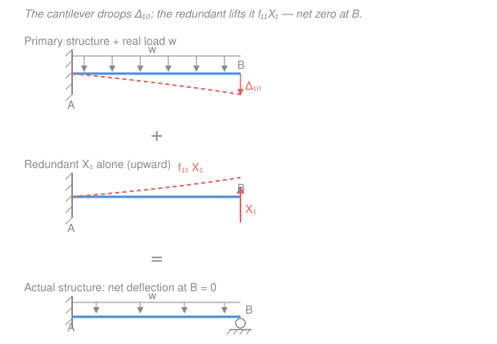

# Structural Analysis · Lesson 3.2: The Force (Flexibility) Method for Beams

> ⏱ ~15 min · Module 3: Statically Indeterminate Structures · Builds on: [3.1 Indeterminacy, redundancy, compatibility](03-01-indeterminacy-redundancy-compatibility.md), [2.4 Unit-load deflections of beams](02-04-unit-load-method-beams-frames.md) · Unlocks: [3.3 Force method for frames & trusses](03-03-force-method-frames-trusses-support-effects.md), Boss Problem 3

## Why this matters

In [3.1](03-01-indeterminacy-redundancy-compatibility.md) you learned to *count* redundants — the extra reactions that equilibrium alone can't pin down. This lesson gives you the first machine that actually *solves* an indeterminate beam. The trick is beautifully cheap: temporarily throw away a redundant support so the structure becomes determinate (which you already know how to analyze), then ask "how much did I move the point I un-supported?" — and put exactly enough force back to undo that motion. That single idea, the **force method**, was the workhorse of structural analysis for a century, and it's the conceptual seed of the stiffness matrices you'll assemble in [4.3](04-03-matrix-stiffness-method.md). `mechanics-of-materials` [3.3](../../mechanics-of-materials/lessons/03-03-statically-indeterminate-beams.md) did this for a single propped beam; here it becomes a repeatable recipe that scales.

## The idea

A propped cantilever — fixed at $A$, roller at $B$ — has one reaction too many. Equilibrium (three equations) can't find all four reaction components. So we make a deal with the structure.

**Step 1: fire a support.** Remove the roller at $B$. Now it's a plain cantilever — determinate, easy. Call this the **primary** (or **released**) structure, and call the reaction you removed the **redundant** $X_1$.

**Step 2: watch it sag.** Under the real load, the tip $B$ droops down by some amount $\Delta_{10}$. But in the *real* structure the roller was there holding $B$ at zero — so this sag is illegal. It's the "error" we introduced by firing the support.

**Step 3: push it back.** Apply the redundant force $X_1$ at $B$ on that same cantilever. It lifts the tip. If $X_1$ is just the right size, the lift exactly cancels the droop and $B$ ends up where it belongs: back at zero.

That last sentence is the whole method. "The tip must not move" is a **compatibility** condition — a geometric fact the real structure obeys — and it's the extra equation that equilibrium was missing. One redundant, one leftover geometric condition, one unknown. They match.

## The formal version

Fix a **positive direction** for the redundant $X_1$ (say, upward at $B$) and measure every deflection at $B$ in that same direction. Two ingredients, both computed on the **primary** structure by the unit-load method of [2.4](02-04-unit-load-method-beams-frames.md):

- $\Delta_{10}$ — the deflection at $B$ (in the $X_1$ direction) caused by the **real loads** on the primary structure. Units: m. The second subscript $0$ means "from the applied loads."
- $f_{11}$ — the deflection at $B$ caused by a **unit value** ($X_1 = 1$) of the redundant, on the primary structure. This is a **flexibility coefficient**: how far $B$ moves per unit of force. Units: m per unit force (m/kN).

Because the primary structure is *linear elastic*, the deflection at $B$ from an actual force $X_1$ is just $f_{11}X_1$ (scale the unit case). Superposing the two contributions and demanding the total be zero:

$$\boxed{\ \Delta_{10} + f_{11}\,X_1 = 0\ }\qquad\Longrightarrow\qquad X_1 = -\frac{\Delta_{10}}{f_{11}}.$$

*In words: (movement from the loads) + (movement from the redundant) = (the movement the real support permits, here zero). Solve for the one force that makes it true.* Once $X_1$ is known it's just another applied load: superpose it with the real loads on the primary structure to recover **all** remaining reactions, then the shear $V$, moment $M$, and deflections by the determinate tools you already own.

**If the support settles or a gap exists,** the right-hand side isn't zero — it's the *prescribed* movement $\Delta_B$ (positive in the $X_1$ direction): $\Delta_{10} + f_{11}X_1 = \Delta_B$. We use that in P2.

**Several redundants.** Fire $n$ supports to get a determinate primary structure. Now moving support $j$ affects the deflection at $i$, so each compatibility equation collects contributions from every redundant:

$$\Delta_{i0} + \sum_{j=1}^{n} f_{ij}\,X_j = 0,\qquad i = 1,\dots,n,$$

where $f_{ij}$ = deflection at location $i$ from a unit value of $X_j$. Stacked up, this is a linear system

$$[\,f\,]\{X\} = -\{\Delta_0\},$$

with $[f]$ the **flexibility matrix**. *In words: n leftover geometric conditions give n equations in the n redundant forces* — exactly the $\mathbf{Kd}=\mathbf{F}$ shape you'll solve in [`linalg-refresher`](../../linalg-refresher/syllabus.md). A gift falls out of the unit-load integral $f_{ij}=\int \frac{m_i m_j}{EI}\,dx$: swapping $i$ and $j$ doesn't change it, so

$$f_{ij}=f_{ji}\qquad(\textbf{Maxwell's reciprocal theorem}),$$

the flexibility matrix is **symmetric**. That halves the work and is your arithmetic sanity check. We build a $2\times 2$ preview in P3 and scale it to frames and trusses in [3.3](03-03-force-method-frames-trusses-support-effects.md).

## Picture

## Worked examples

**Example 1 — Boss Problem 3(a): propped cantilever under a UDL.** Fixed at $A$ ($x=0$), roller at $B$ ($x=L$), uniform load $w$ (kN/m) over the whole span. Bending stiffness $EI$ (kN·m²) is constant. Find all reactions.

*Choose the redundant.* Remove the roller at $B$; take $X_1 = R_B$, positive **upward**. The primary structure is a cantilever fixed at $A$, free at $B$.

*Deflection from the real load.* A cantilever under a full UDL droops at the free end by (standard result, or [2.4](02-04-unit-load-method-beams-frames.md) unit-load integral)

$$\Delta_{10} = -\frac{wL^4}{8EI}\quad(\text{downward, so negative in the upward }X_1\text{ direction}).$$

*Deflection from the unit redundant.* A cantilever with a unit upward tip load deflects the tip up by

$$f_{11} = +\frac{L^3}{3EI}\quad(\text{upward, per unit force}).$$

*Compatibility — the roller keeps $B$ at zero:*

$$\Delta_{10} + f_{11}X_1 = 0 \;\Longrightarrow\; -\frac{wL^4}{8EI} + \frac{L^3}{3EI}\,X_1 = 0 \;\Longrightarrow\; X_1 = \frac{wL^4/8EI}{L^3/3EI} = \frac{3wL}{8}.$$

So $R_B = \dfrac{3wL}{8}$ (upward). Now it's determinate — finish with statics on the *actual* beam:

$$\sum F_y = 0:\quad R_A = wL - R_B = wL - \tfrac{3wL}{8} = \frac{5wL}{8}\ (\uparrow).$$

$$\sum M_A = 0:\quad M_A + R_B L - (wL)\tfrac{L}{2} = 0 \;\Longrightarrow\; M_A = \frac{wL^2}{2} - \frac{3wL}{8}L = \frac{wL^2}{8}\ \text{(hogging, tension on top).}$$

*Sanity check.* Reactions carry the whole load: $\tfrac{5wL}{8}+\tfrac{3wL}{8}=wL$ ✓. Units: $M_A = (\mathrm{kN/m})(\mathrm{m^2}) = \mathrm{kN\cdot m}$ ✓. Limiting sense: if the prop $B$ were absent it's a pure cantilever with $M_A=\tfrac{wL^2}{2}$; the prop relieves the fixed end down to $\tfrac{wL^2}{8}$, a quarter as much — props help, as they should ✓. (You'll re-derive this same $M_A=\tfrac{wL^2}{8}$ by slope-deflection in [3.4](03-04-slope-deflection-method.md) as Boss 3's second confirmation.)

**Example 2 — two-span continuous beam.** Equal spans: $A$ pinned ($x=0$), interior support $B$ ($x=L$), $C$ roller ($x=2L$); uniform load $w$ over both spans. Find the interior reaction.

*Choose the redundant.* Remove the **interior** support and take $X_1 = R_B$, positive upward. The primary structure is now a single simply supported beam of span $2L$ from $A$ to $C$ — determinate.

*Deflection from the real load.* Midspan sag of a simply supported beam of span $\ell$ under UDL is $\tfrac{5w\ell^4}{384EI}$. With $\ell = 2L$:

$$\Delta_{10} = -\frac{5w(2L)^4}{384EI} = -\frac{80wL^4}{384EI} = -\frac{5wL^4}{24EI}\quad(\text{down}).$$

*Deflection from the unit redundant.* A central unit load on that span-$2L$ beam gives midspan deflection $\tfrac{(2L)^3}{48EI}$:

$$f_{11} = +\frac{8L^3}{48EI} = \frac{L^3}{6EI}\quad(\text{up, per unit force}).$$

*Compatibility — support $B$ holds midspan at zero:*

$$-\frac{5wL^4}{24EI} + \frac{L^3}{6EI}\,X_1 = 0 \;\Longrightarrow\; X_1 = \frac{5wL^4/24EI}{L^3/6EI} = \frac{5wL^4}{24}\cdot\frac{6}{L^3} = \frac{5wL}{4}.$$

So $R_B = \dfrac{5wL}{4} = 1.25\,wL$ upward. By symmetry the ends split the rest:

$$R_A = R_C = \frac{w(2L) - \tfrac{5wL}{4}}{2} = \frac{2wL - 1.25wL}{2} = \frac{3wL}{8}.$$

*Sanity check.* Vertical total: $2\!\cdot\!\tfrac{3wL}{8} + \tfrac{5wL}{4} = \tfrac{3wL}{4}+\tfrac{5wL}{4} = 2wL$ = applied load ✓. The interior support carries the lion's share ($1.25wL$ vs. $0.375wL$ each end) — exactly what you'd expect where two loaded spans lean on one prop ✓. (These are the textbook two-span numbers: interior reaction $\tfrac{10}{8}wL$, end reactions $\tfrac{3}{8}wL$, hogging moment $M_B = -\tfrac{wL^2}{8}$.)

## Watch out

- **You might think you can pick a redundant that makes the structure fall apart.** You can't — the primary structure must stay **stable and determinate**. Removing the fixed end's *moment* from a propped cantilever is fine (leaves a simply supported beam), but removing the vertical reaction at a fixed end that has no other vertical support turns it into a mechanism. Fire supports, never structure.
- **You might drop a sign because "the load and the redundant obviously oppose."** Don't lean on intuition — commit to one positive direction and let the algebra carry the signs. Here $\Delta_{10}$ came out *negative* (downward) and $f_{11}$ *positive* (upward); the compatibility equation handled the cancellation for you. Mislabel a direction and you'll get $R_B$ pushing the wrong way.
- **You might expect the flexibility matrix to be lopsided.** It never is — $f_{ij}=f_{ji}$ by Maxwell's theorem. If your hand-computed $f_{12}$ and $f_{21}$ disagree, you have an arithmetic error, not a special structure. Use the symmetry as a free check.

## One-liner

> Fire a redundant to get a structure you can solve, measure the illegal movement $\Delta_{10}$, then put back exactly the force $X_1=-\Delta_{10}/f_{11}$ that restores compatibility.

## Problems

**P1 (🟢)** A propped cantilever (fixed $A$ at $x=0$, roller $B$ at $x=L$) carries a single point load $P$ at midspan. On the released cantilever the load deflects the tip down by $\Delta_{10}=\dfrac{5PL^3}{48EI}$ and a unit tip load lifts it by $f_{11}=\dfrac{L^3}{3EI}$. Take $X_1=R_B$ (up) and find $R_B$, $R_A$, and $M_A$.

**P2 (🟡)** Reuse Example 1's propped cantilever under UDL $w$, but now the roller at $B$ **settles downward** by a known amount $\delta$. Set up the compatibility equation with the correct right-hand side and solve for the new $R_B$. Does the reaction go up or down compared with the no-settlement case, and does that make physical sense?

**P3 (🔴)** *Different redundant, same answer — plus a Maxwell check.* Re-solve Example 1's propped-cantilever UDL problem, but this time release the **fixed-end moment** at $A$ instead of the roller: the primary structure becomes a simply supported beam $A$–$B$ of span $L$, and the redundant is $X_1=M_A$. Use: rotation at $A$ of a simply supported beam under UDL $w$ is $\theta = \dfrac{wL^3}{24EI}$; rotation at $A$ from a unit moment applied at $A$ is $f_{11}=\dfrac{L}{3EI}$. Show you recover $M_A=\dfrac{wL^2}{8}$. Then state, without new computation, the rotation a unit moment at $A$ produces at the *far* end $B$, and name the theorem that lets you write it down.

Solutions

**P1** Compatibility (tip must return to zero, upward positive):

$$-\frac{5PL^3}{48EI} + \frac{L^3}{3EI}\,R_B = 0 \;\Longrightarrow\; R_B = \frac{5PL^3/48EI}{L^3/3EI} = \frac{5P}{48}\cdot 3 = \frac{5P}{16}\ (\uparrow).$$

Then statics on the actual beam:

$$R_A = P - R_B = P - \frac{5P}{16} = \frac{11P}{16}\ (\uparrow),$$
$$\sum M_A = 0:\quad M_A + R_B L - P\cdot\tfrac{L}{2} = 0 \;\Longrightarrow\; M_A = \frac{PL}{2} - \frac{5P}{16}L = \frac{8PL - 5PL}{16} = \frac{3PL}{16}\ \text{(hogging).}$$

*Check.* Vertical: $\tfrac{11P}{16}+\tfrac{5P}{16}=P$ ✓. These ($R_B=\tfrac{5P}{16}$, $M_A=\tfrac{3PL}{16}$) are the standard propped-cantilever/central-load values ✓. Units of $M_A$: kN·m ✓.

**P2** The support no longer holds $B$ at zero — it prescribes a downward movement $\delta$. With upward positive, the deflection at $B$ must equal $-\delta$:

$$\Delta_{10} + f_{11}R_B = -\delta \;\Longrightarrow\; -\frac{wL^4}{8EI} + \frac{L^3}{3EI}R_B = -\delta.$$

Solve:

$$\frac{L^3}{3EI}R_B = \frac{wL^4}{8EI} - \delta \;\Longrightarrow\; R_B = \frac{3EI}{L^3}\left(\frac{wL^4}{8EI} - \delta\right) = \frac{3wL}{8} - \frac{3EI\,\delta}{L^3}.$$

The reaction **decreases** by $\dfrac{3EI\delta}{L^3}$. Physical sense: if the prop drops away from the beam, it can't push as hard — some of the load it was carrying shifts back to the fixed end $A$. In the limit $\delta \to \tfrac{wL^4}{8EI}$ (the prop settles by the full free sag), $R_B\to 0$: the prop stops doing anything and you're back to a bare cantilever ✓.

*Check.* Set $\delta=0$ and recover $R_B=\tfrac{3wL}{8}$, Example 1 ✓. Units of the correction: $\tfrac{(\mathrm{kN\cdot m^2})(\mathrm m)}{\mathrm{m^3}}=\mathrm{kN}$ ✓ — settlement stiffness has force units, good.

**P3** Compatibility here says the rotation at $A$ must be zero (the real support is fixed = no rotation). The applied UDL rotates $A$ by $+\tfrac{wL^3}{24EI}$; the redundant moment $X_1=M_A$ rotates it by $f_{11}X_1$. These must cancel:

$$\frac{wL^3}{24EI} + \frac{L}{3EI}\big(\!-M_A\big)= 0.$$

Here the hogging moment rotates $A$ opposite to the load, hence the minus; solving for the magnitude,

$$M_A = \frac{wL^3/24EI}{L/3EI} = \frac{wL^3}{24}\cdot\frac{3}{L} = \frac{wL^2}{8}.$$

Identical to Example 1 — **the choice of redundant is free; the structure's answer is not.** The far-end rotation from a unit moment at $A$ is $\dfrac{L}{6EI}$ (half the near-end value — the "carry-over"), and we may write it down without computing because **Maxwell's reciprocal theorem** guarantees $f_{ij}=f_{ji}$: the rotation at $B$ per unit moment at $A$ equals the rotation at $A$ per unit moment at $B$.

*Check.* Both redundant choices give $M_A=\tfrac{wL^2}{8}$ ✓, confirming the method doesn't depend on which support you fire.

## Flashback

**From Lesson 3.1 (Indeterminacy, redundancy, compatibility):** A continuous beam is **fixed at $A$** and carries **roller supports at $B$ and $C$** (two spans, no internal hinges). Determine its degree of static indeterminacy — and hence how many redundants the force method would need.

Solution

Count the reaction components: a fixed support supplies $3$ (horizontal, vertical, moment); each roller supplies $1$ (vertical). So $r = 3 + 1 + 1 = 5$. It's a single rigid body (one beam, no internal releases, $c=0$), giving $3$ equilibrium equations. The degree of static indeterminacy is

$$\text{DSI} = r - (3 + c) = 5 - 3 = 2.$$

*Check.* Two redundants means you'd fire two supports (e.g. the rollers at $B$ and $C$) to reach a determinate cantilever, then write a $2\times 2$ symmetric flexibility system $[f]\{X\}=-\{\Delta_0\}$ — exactly the multi-redundant setup previewed above and built out in [3.3](03-03-force-method-frames-trusses-support-effects.md) ✓.

## Connections

- **Backward:** every deflection here — $\Delta_{10}$ and each $f_{ij}$ — is a unit-load integral $\int \frac{mM}{EI}dx$ from [2.4](02-04-unit-load-method-beams-frames.md), evaluated on the determinate primary structure. And the "how many redundants?" count is the DSI machinery of [3.1](03-01-indeterminacy-redundancy-compatibility.md). `mechanics-of-materials` [3.3](../../mechanics-of-materials/lessons/03-03-statically-indeterminate-beams.md) solved single propped beams this way; this lesson turns it into a general recipe.
- **Forward:** [3.3](03-03-force-method-frames-trusses-support-effects.md) applies the same $[f]\{X\}=-\{\Delta_0\}$ system to frames and trusses (using the $\sum\frac{nNL}{AE}$ truss form) and folds in support settlement and temperature on the right-hand side. [3.4 slope-deflection](03-04-slope-deflection-method.md) attacks the *same* indeterminate beams from the opposite end — treating displacements, not forces, as unknowns — and will re-confirm Boss 3's $M_A=\tfrac{wL^2}{8}$.
- **Sideways (linear algebra):** the flexibility matrix $[f]$ is a symmetric positive-definite matrix, and solving $[f]\{X\}=-\{\Delta_0\}$ is the linear-system solve of [`linalg-refresher`](../../linalg-refresher/syllabus.md). Its symmetry (Maxwell reciprocity) is the same structural fact that makes the global stiffness matrix $\mathbf{K}$ symmetric in [4.3](04-03-matrix-stiffness-method.md) — force method and stiffness method are two faces of one linear-elastic coin.
