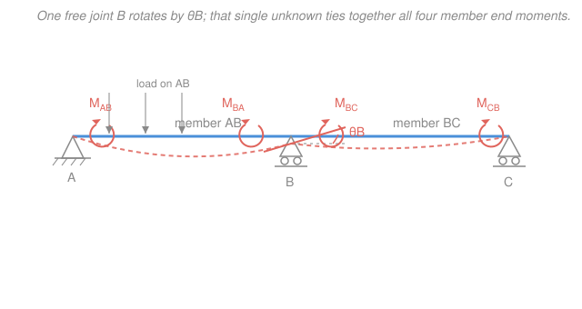

# Structural Analysis · Lesson 3.4: The Slope-Deflection Method

> ⏱ ~15 min · Module 3: Statically Indeterminate Structures · Builds on: [3.1 Indeterminacy, redundancy & compatibility](03-01-indeterminacy-redundancy-compatibility.md), [2.1 The elastic curve & double integration](02-01-elastic-curve-double-integration.md) · Unlocks: [3.5 Moment distribution](03-05-moment-distribution-method.md), [4.3 Matrix stiffness method](04-03-matrix-stiffness-method.md), Boss problem 3(b)

## Why this matters

The force method you just learned ([3.2](03-02-force-method-beams.md), [3.3](03-03-force-method-frames-trusses-support-effects.md)) treats redundant **forces** as the unknowns — great for one or two redundants, but a continuous beam with six spans has five redundant reactions and a nasty flexibility matrix. The slope-deflection method flips the whole game: instead of asking "what redundant forces make the structure fit together?", it asks "how much does each **joint rotate**?" Real frames have far fewer joints that can rotate than they have redundant forces, so the unknowns shrink dramatically. This is the first **displacement method** — and it is the direct ancestor of moment distribution ([3.5](03-05-moment-distribution-method.md), an iterative way to solve the very same equations) and of the matrix stiffness method ([4.3](04-03-matrix-stiffness-method.md)) that every structural-analysis program runs today.

## The idea

Picture a continuous beam bending over its supports. Where a support lets the beam rotate, the beam's tangent line tips through some angle — that angle is the joint's **rotation** $\theta$. Here's the key physical fact: *if you knew every joint rotation, you could compute the moment at every member end directly.* A member is just a beam whose two ends are twisted by known amounts; the bending moment it develops at each end is a fixed, calculable function of those twists.

So the plan is: (1) write each member end moment as a formula in the unknown joint rotations, then (2) demand that the moments meeting at each free joint **balance** — they must sum to zero, because a joint in a beam carries no leftover moment. Step 2 gives you exactly as many equations as you have unknown rotations. Solve the little linear system, feed the rotations back into the formulas, and you have every moment. No compatibility integrals, no released structure — just "twist the joints until they're in equilibrium."

The one wrinkle: even before any joint rotates, a loaded member wants to push moment into its ends. Clamp both ends of a loaded beam rigidly and it still develops end moments — the **fixed-end moments**. Those are the baseline; the joint rotations are corrections on top of them.

## The formal version

**Sign convention (carry it religiously).** All member end moments and all joint rotations are **positive clockwise**. Note this is *not* the sagging-positive convention of bending-moment diagrams — we reconcile them at the end.

**The slope-deflection equation.** For a member spanning from a "near" end $n$ to a "far" end $f$, length $L$ (m), bending stiffness $EI$ (kN·m²), the moment at the near end is

$$M_{nf} = \frac{2EI}{L}\big(2\theta_n + \theta_f - 3\psi\big) + \text{FEM}_{nf}.$$

- $M_{nf}$ (kN·m): moment the joint exerts on the member at end $n$, clockwise-positive.
- $\theta_n,\ \theta_f$ (rad): rotations of the near and far joints, clockwise-positive.
- $\psi = \Delta/L$ (rad): the **chord rotation**, where $\Delta$ (m) is the relative transverse displacement of the two ends (support *sway*/settlement). If the supports don't move, $\psi = 0$.
- $\text{FEM}_{nf}$ (kN·m): the **fixed-end moment** at end $n$ — the moment there if *both* ends were fully clamped against rotation.

*In words: a member's end moment is its clamped-end baseline, plus a stiffness term that grows with how much its own end twists (weight $2$), how much the far end twists (weight $1$), and how much the member tilts bodily.* The $2\!:\!1$ ratio is the carry-over signature you'll meet again in [3.5](03-05-moment-distribution-method.md).

**Fixed-end moments (memorize this table).** For a single member $AB$, downward loads, clockwise-positive:

| Load on span $AB$ | $\text{FEM}_{AB}$ (left end) | $\text{FEM}_{BA}$ (right end) |
|---|---|---|
| Uniform load $w$ over the whole span | $-\dfrac{wL^2}{12}$ | $+\dfrac{wL^2}{12}$ |
| Point load $P$ at midspan | $-\dfrac{PL}{8}$ | $+\dfrac{PL}{8}$ |
| Point load $P$ at $a$ from $A$, $b$ from $B$ | $-\dfrac{Pab^2}{L^2}$ | $+\dfrac{Pa^2 b}{L^2}$ |

*In words: with both ends clamped, a load pushes a counterclockwise (negative) moment into the left end and a clockwise (positive) moment into the right end.* The point-load-at-midspan row is just the $a=b=L/2$ case of the last row.

**The procedure.**
1. Identify the unknown joint rotations (a fixed support has $\theta = 0$; a support that can't move gives $\psi = 0$).
2. Write the slope-deflection equation for **every** member end.
3. At each free joint, impose **joint equilibrium**: $\sum M = 0$ over the member ends meeting there (equal to any applied joint couple). A simply-supported *exterior* pin end carries no moment, so its end moment is set to zero directly.
4. Solve the resulting linear system for the $\theta$'s.
5. Back-substitute to get every member end moment; convert signs and draw the $M$ diagram.

## Picture

The interior joint $B$ is the only one free to rotate here, so $\theta_B$ is the lone unknown. Equilibrium at $B$ — moments from member $AB$ and member $BC$ cancelling — is the single equation that pins it down.

## Worked examples

**Example 1 — Boss problem 3(b): propped cantilever by slope-deflection.** Fixed support at $A$, roller at $B$, span $L$, constant $EI$, uniform load $w$ (kN/m) down. One member, $AB$. Confirm the force-method answer $M_A = \tfrac18 wL^2$ hogging.

*Setup.* $A$ is fixed so $\theta_A = 0$. Supports don't move, so $\psi = 0$. The only unknown is $\theta_B$. Fixed-end moments for the UDL: $\text{FEM}_{AB} = -\tfrac{wL^2}{12}$, $\text{FEM}_{BA} = +\tfrac{wL^2}{12}$.

*Slope-deflection equations* (drop the $\psi$ and $\theta_A$ terms, both zero):

$$M_{AB} = \frac{2EI}{L}\big(2\theta_A + \theta_B\big) - \frac{wL^2}{12} = \frac{2EI}{L}\,\theta_B - \frac{wL^2}{12},$$

$$M_{BA} = \frac{2EI}{L}\big(2\theta_B + \theta_A\big) + \frac{wL^2}{12} = \frac{4EI}{L}\,\theta_B + \frac{wL^2}{12}.$$

*Joint equilibrium at $B$.* $B$ is an exterior roller — a pin end with no applied couple — so the moment there must vanish:

$$M_{BA} = 0 \;\Longrightarrow\; \frac{4EI}{L}\,\theta_B + \frac{wL^2}{12} = 0 \;\Longrightarrow\; \theta_B = -\frac{wL^3}{48EI}.$$

*Back-substitute* into $M_{AB}$:

$$M_{AB} = \frac{2EI}{L}\left(-\frac{wL^3}{48EI}\right) - \frac{wL^2}{12} = -\frac{wL^2}{24} - \frac{2wL^2}{24} = -\frac{3wL^2}{24} = -\frac{wL^2}{8}.$$

The magnitude is $\tfrac18 wL^2$. The negative sign (counterclockwise on the member at $A$) is exactly a **hogging** moment at the fixed end — the top fibers in tension. Statics then gives the roller reaction $R_B = \tfrac38 wL$ (and $R_A = \tfrac58 wL$).

*Check.* Units: $\tfrac{EI}{L}\cdot\theta = \mathrm{kN\cdot m^2 / m \cdot rad} = \mathrm{kN\cdot m}$ ✓; and $wL^2 = \mathrm{(kN/m)\,m^2} = \mathrm{kN\cdot m}$ ✓. Sign sense: a downward load hogs a propped cantilever over its clamped end — correct. And $M_A = \tfrac18 wL^2$, $R_B = \tfrac38 wL$ match the force-method boss answer exactly. ✓ The displacement method reproduces the force-method result — as it must.

**Example 2 — two-span continuous beam (no sway).** Supports: $A$ fixed, $B$ interior roller, $C$ fixed. Spans $AB = BC = L$, constant $EI$. A single point load $P$ (kN) sits at the **midspan of $AB$ only**; span $BC$ is unloaded. Find the moment over the interior support $B$.

*Setup.* $\theta_A = \theta_C = 0$ (both ends fixed); $\psi = 0$ (no support movement). One unknown: $\theta_B$. Fixed-end moments — span $AB$ has a central point load, span $BC$ carries nothing:

$$\text{FEM}_{AB} = -\frac{PL}{8}, \quad \text{FEM}_{BA} = +\frac{PL}{8}, \quad \text{FEM}_{BC} = \text{FEM}_{CB} = 0.$$

*Slope-deflection equations* (each far/near fixed rotation is zero):

$$M_{BA} = \frac{4EI}{L}\theta_B + \frac{PL}{8}, \qquad M_{BC} = \frac{4EI}{L}\theta_B,$$

$$M_{AB} = \frac{2EI}{L}\theta_B - \frac{PL}{8}, \qquad M_{CB} = \frac{2EI}{L}\theta_B.$$

*Joint equilibrium at $B$.* No applied couple, two members meet: $M_{BA} + M_{BC} = 0$.

$$\frac{4EI}{L}\theta_B + \frac{PL}{8} + \frac{4EI}{L}\theta_B = 0 \;\Longrightarrow\; \frac{8EI}{L}\theta_B = -\frac{PL}{8} \;\Longrightarrow\; \theta_B = -\frac{PL^2}{64EI}.$$

*Back-substitute:*

$$M_{BA} = \frac{4EI}{L}\left(-\frac{PL^2}{64EI}\right) + \frac{PL}{8} = -\frac{PL}{16} + \frac{2PL}{16} = +\frac{PL}{16},$$

$$M_{BC} = \frac{4EI}{L}\left(-\frac{PL^2}{64EI}\right) = -\frac{PL}{16}, \qquad M_{AB} = \frac{2EI}{L}\theta_B - \frac{PL}{8} = -\frac{5PL}{32}, \qquad M_{CB} = -\frac{PL}{32}.$$

The moment over $B$ has magnitude $\tfrac{PL}{16}$ (hogging).

*Check.* Equilibrium at $B$: $M_{BA} + M_{BC} = \tfrac{PL}{16} - \tfrac{PL}{16} = 0$ ✓. Bracketing test on $M_{AB}$: if $B$ were a *pin* (no restraint from $BC$), span $AB$ would be a propped cantilever with a central load, giving $M_A = \tfrac{3PL}{16} = \tfrac{6PL}{32}$; if $B$ were *fully fixed*, $M_A = \tfrac{PL}{8} = \tfrac{4PL}{32}$. Our $\tfrac{5PL}{32}$ lands squarely between — span $BC$ supplies partial rotational restraint, exactly as physics demands. ✓ Notice the unloaded span $BC$ still picks up moment: joint $B$ rotates and drags $BC$ along. That coupling is what makes indeterminate structures share load.

## Watch out

- **You might think the member-end-moment sign is the bending-moment-diagram sign — they're different conventions.** Slope-deflection uses *clockwise-positive on the member end*; the $M$ diagram uses *sagging-positive*. A clockwise moment on a member's **left** end and a counterclockwise moment on its **right** end together make a *sagging* (positive-diagram) internal moment. Translate deliberately, member by member, before plotting; in Example 1, $M_{AB} = -\tfrac{wL^2}{8}$ (counterclockwise) is a *hogging* diagram value at $A$.
- **You might drop the chord-rotation term when a support settles or a frame sways.** $\psi = \Delta/L$ is only zero when the member's ends stay level with each other. Any support settlement, or any frame free to translate sideways, makes $\psi \ne 0$ — and then you need an extra *shear/story equilibrium* equation to match the extra unknown. (Settlement here is the same effect you added on the RHS of the force method in [3.3](03-03-force-method-frames-trusses-support-effects.md).)
- **You might forget the fixed-end moment on an unloaded member — it's genuinely zero, but the stiffness term is not.** Even with $\text{FEM} = 0$, member $BC$ in Example 2 carried moment because $\theta_B \ne 0$. "No load" kills the FEM, never the $\tfrac{2EI}{L}$ coupling to a rotating joint.

## One-liner

> Make joint rotations the unknowns: write each end moment as $\tfrac{2EI}{L}(2\theta_n+\theta_f-3\psi)+\text{FEM}$, then set the moments at every free joint to balance — a small linear system in the $\theta$'s replaces the whole tangle of redundant forces.

## Problems

**P1 (🟢)** A propped cantilever $AB$ (fixed at $A$, roller at $B$, span $L$, constant $EI$) carries a **central point load** $P$ instead of a UDL. Using slope-deflection, find $\theta_B$ and the fixed-end moment $M_{AB}$ at the clamped support. *(FEMs: $\text{FEM}_{AB} = -\tfrac{PL}{8}$, $\text{FEM}_{BA} = +\tfrac{PL}{8}$.)*

**P2 (🟡)** A two-span continuous beam has $A$ fixed, $B$ interior roller, $C$ fixed, spans $AB = BC = L$, constant $EI$. Now a **uniform load $w$ covers both spans**. By symmetry, argue what $\theta_B$ must be, then confirm it from joint equilibrium at $B$ and give the moment $M_{BA}$ over the interior support.

**P3 (🔴)** In Example 2, suppose support $B$ **settles downward by $\Delta$** (spans stay $L$; load $P$ still on $AB$ at midspan). Write the chord rotations $\psi_{AB}$ and $\psi_{BC}$ (mind their signs), and set up — you need not fully solve — the single joint-equilibrium equation for $\theta_B$. *(Hint: with $B$ dropping, member $AB$'s far end goes down and member $BC$'s far end goes up relative to $B$.)*

Solutions

**P1** One unknown $\theta_B$; $\theta_A = 0$, $\psi = 0$. Equations:

$$M_{BA} = \frac{4EI}{L}\theta_B + \frac{PL}{8}, \qquad M_{AB} = \frac{2EI}{L}\theta_B - \frac{PL}{8}.$$

Exterior roller at $B$: $M_{BA} = 0 \Rightarrow \dfrac{4EI}{L}\theta_B = -\dfrac{PL}{8} \Rightarrow \boxed{\theta_B = -\dfrac{PL^2}{32EI}}$.

Back-substitute:

$$M_{AB} = \frac{2EI}{L}\left(-\frac{PL^2}{32EI}\right) - \frac{PL}{8} = -\frac{PL}{16} - \frac{2PL}{16} = -\frac{3PL}{16}.$$

So $M_{AB} = \tfrac{3PL}{16}$ hogging. *Check.* This is the textbook propped-cantilever result for a central load, and $R_B = \tfrac{5P}{16}$ follows from statics — matching the Flashback below by the force method. Units: $\tfrac{EI}{L}\theta = \mathrm{kN\cdot m}$, $PL = \mathrm{kN\cdot m}$ ✓.

**P2** *Symmetry argument.* The structure and the load are mirror-symmetric about $B$. A rotation of $B$ would have to look the same in a mirror, but rotation reverses sign under reflection — the only value equal to its own negative is $\theta_B = 0$. So the interior joint does **not** rotate.

*Confirm.* FEMs: span $AB$ gives $\text{FEM}_{BA} = +\tfrac{wL^2}{12}$; span $BC$ gives $\text{FEM}_{BC} = -\tfrac{wL^2}{12}$. Then

$$M_{BA} = \frac{4EI}{L}\theta_B + \frac{wL^2}{12}, \qquad M_{BC} = \frac{4EI}{L}\theta_B - \frac{wL^2}{12}.$$

Equilibrium $M_{BA} + M_{BC} = 0$: $\;\dfrac{8EI}{L}\theta_B + \left(\tfrac{wL^2}{12} - \tfrac{wL^2}{12}\right) = 0 \Rightarrow \theta_B = 0$ ✓. Then $M_{BA} = +\tfrac{wL^2}{12}$, i.e. $\tfrac{wL^2}{12}$ hogging over $B$. *Check.* With $B$ locked (no rotation), each span behaves like a fixed-fixed beam, whose end moment is $\tfrac{wL^2}{12}$ — exactly what we got. ✓

**P3** Chord rotation is $\psi = \Delta_{\text{rel}}/L$, clockwise-positive, where $\Delta_{\text{rel}}$ is the far end's downward displacement relative to the near end. $B$ drops by $\Delta$:

- Member $AB$ (near $A$ fixed at level, far $B$ drops $\Delta$): the chord tips clockwise, $\psi_{AB} = +\dfrac{\Delta}{L}$.
- Member $BC$ (near $B$ drops $\Delta$, far $C$ fixed at level, so far end is *higher* than near): the chord tips counterclockwise, $\psi_{BC} = -\dfrac{\Delta}{L}$.

End moments meeting at $B$ (keep the $-3\psi$ terms, $\theta_A = \theta_C = 0$):

$$M_{BA} = \frac{2EI}{L}\big(2\theta_B - 3\psi_{AB}\big) + \frac{PL}{8}, \qquad M_{BC} = \frac{2EI}{L}\big(2\theta_B - 3\psi_{BC}\big) + 0.$$

Joint equilibrium $M_{BA} + M_{BC} = 0$:

$$\frac{8EI}{L}\theta_B - \frac{6EI}{L}\big(\psi_{AB} + \psi_{BC}\big) + \frac{PL}{8} = 0.$$

Here $\psi_{AB} + \psi_{BC} = \tfrac{\Delta}{L} - \tfrac{\Delta}{L} = 0$, so the settlement of an interior support (equal spans) drops out of this particular equation and $\theta_B = -\tfrac{PL^2}{64EI}$ as before — but the individual end moments still shift, because each equation keeps its own $-3\psi$ term (e.g. $M_{AB} = \tfrac{2EI}{L}(\theta_B - 3\tfrac{\Delta}{L}) - \tfrac{PL}{8}$). *Check.* $\psi$ has units $\mathrm{m/m} = \mathrm{rad}$ ✓, and a symmetric settlement not disturbing $\theta_B$ makes sense — both spans sag toward $B$ equally. ✓

## Flashback

**From Lesson 3.2 (The force method for beams):** A propped cantilever — fixed at $A$, roller at $B$, span $L$, constant $EI$ — carries a **central point load $P$** at midspan. Take the roller reaction $R_B$ as the redundant and find it by the force (flexibility) method. *(Fresh variant: point load instead of the UDL you released in 3.2.)*

Solution

Release the roller at $B$ → the primary structure is a cantilever fixed at $A$, free at $B$. Two deflections at $B$, both computed on that cantilever:

- $\Delta_{B0}$ = downward deflection at the tip $B$ from the real load $P$ at midspan ($a = L/2$ from the fixed end). Using the standard cantilever formula for a point load at distance $a$, tip deflection $= \dfrac{Pa^2}{6EI}(3L - a)$:

$$\Delta_{B0} = \frac{P(L/2)^2}{6EI}\left(3L - \tfrac{L}{2}\right) = \frac{PL^2/4}{6EI}\cdot\frac{5L}{2} = \frac{5PL^3}{48EI}.$$

- $f_{BB}$ = deflection at $B$ from a unit upward load at $B$ (a tip-loaded cantilever): $f_{BB} = \dfrac{L^3}{3EI}$.

Compatibility — the real roller allows no net deflection at $B$: $\;\Delta_{B0} - f_{BB}R_B = 0$, so

$$R_B = \frac{\Delta_{B0}}{f_{BB}} = \frac{5PL^3/48EI}{L^3/3EI} = \frac{5}{48}\cdot 3 = \frac{5P}{16}.$$

*Check.* $R_B = \tfrac{5P}{16} = 0.3125P$, leaving $R_A = \tfrac{11P}{16}$ and (by statics) $M_A = \tfrac{3PL}{16}$ hogging — the exact same $M_A$ that P1 got by slope-deflection. Two methods, one structure, one answer. Units: $\tfrac{PL^3/EI}{L^3/EI} = P$ (a force) ✓. ✓

## Connections

- **Backward:** the fixed-end moments are just the double-integration / elastic-curve results of [2.1](02-01-elastic-curve-double-integration.md) evaluated for a fully clamped span, and the whole method rests on the degree-of-indeterminacy bookkeeping from [3.1](03-01-indeterminacy-redundancy-compatibility.md) — except now the count that matters is the number of unknown *displacements* (joint rotations + sways), not redundant forces. It reproduces the force-method answers of [3.2](03-02-force-method-beams.md)/[3.3](03-03-force-method-frames-trusses-support-effects.md) — see the Boss 3(b) match — and generalizes [`mechanics-of-materials` 3.3](../../mechanics-of-materials/lessons/03-03-statically-indeterminate-beams.md), which handled a single indeterminate beam, to whole continuous beams and frames.
- **Forward:** [3.5 Moment distribution](03-05-moment-distribution-method.md) is *nothing but* an iterative, hand-friendly way to solve these same joint-equilibrium equations — lock all joints (apply the FEMs), then release and rebalance them one at a time, the "carry-over" being the $2\!:\!1$ ratio you saw here. [4.3 The matrix stiffness method](04-03-matrix-stiffness-method.md) packages the slope-deflection equations into a stiffness matrix $\mathbf{K}$ and solves $\mathbf{K}\mathbf{d}=\mathbf{F}$ in one shot — the $\tfrac{2EI}{L}$ coefficients become entries of $\mathbf{K}$.
- **Sideways (linear algebra):** step 3 is exactly a small linear system $\mathbf{A}\boldsymbol{\theta} = \mathbf{b}$ in the unknown rotations — the same Gaussian-elimination machinery as [`linalg-refresher`](../../linalg-refresher/syllabus.md). With one unknown it's a single division; with many joints it's a genuine matrix solve, which is precisely why [4.3](04-03-matrix-stiffness-method.md) hands the whole thing to a computer.
