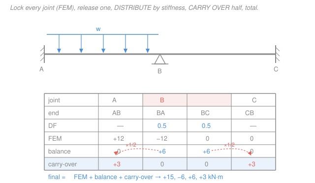

# Structural Analysis · Lesson 3.5: The moment distribution method

> ⏱ ~15 min · Module 3: Statically Indeterminate Structures · Builds on: [3.4 The slope-deflection method](03-04-slope-deflection-method.md) · Unlocks: [4.3 The matrix stiffness method](04-03-matrix-stiffness-method.md)

## Why this matters

Slope-deflection ([3.4](03-04-slope-deflection-method.md)) is exact but hands you a system of simultaneous equations — one per unknown joint rotation. For a continuous beam with five interior supports that's a 5×5 system to solve by hand, and nobody enjoyed that in 1930. Hardy Cross's **moment distribution method** gets the *same* end moments without ever writing those equations: you relax the structure one joint at a time and let the moments trickle around until they settle. It's the same slope-deflection physics, reorganized into a tidy repeating arithmetic loop you can run on a napkin. It ruled structural design for forty years, it's still the fastest hand-check for frames, and its "assemble locally, balance globally" logic is exactly what the [matrix stiffness method](04-03-matrix-stiffness-method.md) automates in [4.3](04-03-matrix-stiffness-method.md).

## The idea

Picture every joint of the beam clamped shut so nothing can rotate. With the joints locked, each span behaves like a fixed-fixed beam, and its loads produce **fixed-end moments (FEMs)** — the wall moments you already met in [3.4](03-04-slope-deflection-method.md). At a real interior joint those clamped-in moments from the two adjoining spans usually *don't* cancel; there's a leftover, an **unbalanced moment**, that a free joint would never tolerate (a joint in equilibrium carries zero net moment).

So you release that one joint and let it rotate. As it turns, the two members resist — and the stiffer, shorter member resists more, so it grabs a bigger share of the correction. The joint rotates just enough to swallow the whole unbalance, splitting it between the members in proportion to their stiffness. That's **distribution**. But twisting the near end of a member also bends its *far* end: exactly half of the balancing moment you applied here shows up there. That's the **carry-over**. Those carried-over moments now unbalance the *neighbouring* joints, so you clamp this one again, move next door, and repeat. Each pass the leftovers shrink (carry-over only ever sends *half*), and after a few sweeps they're negligible. Add up each member end's column — FEM plus every correction it received — and you have the final moments. No simultaneous equations, just lock, balance, carry, repeat.

## The formal version

Member-end sign convention: **a counterclockwise moment on a member end is positive** — the mirror of [3.4](03-04-slope-deflection-method.md), which takes clockwise as positive, so every fixed-end moment below carries the opposite sign to the one you saw there. Magnitudes, and every hogging/sagging conclusion, are unaffected. Three numbers run the whole method.

**Member (rotational) stiffness $K$** — the moment needed at the near end to rotate it one radian:

$$K = \frac{4EI}{L}\ \text{(far end fixed)}, \qquad K = \frac{3EI}{L}\ \text{(far end pinned)},$$

with $E$ the elastic modulus (kPa), $I$ the second moment of area (m$^4$) so $EI$ is the flexural rigidity (kN·m$^2$), and $L$ the span (m); $K$ is in kN·m per radian. *In words: a short, stiff member is hard to rotate, so it fights harder for its share of the correction. If the far end is a pin it offers less resistance, hence $3EI/L$ instead of $4EI/L$.*

**Distribution factor $DF$** — the fraction of a joint's unbalanced moment that a given member takes:

$$DF_i = \frac{K_i}{\sum_j K_j},$$

the member's stiffness over the total stiffness meeting at that joint. *In words: each member takes a slice of the correction proportional to its stiffness; the slices at a joint sum to 1.* (A fixed support gets $DF=0$ — it never rotates, so it absorbs whatever arrives. A simply-supported free end gets $DF=1$ — it can hold no moment, so it hands back everything.)

**Carry-over factor $=\tfrac12$** — when you apply a balancing moment $m$ at the near end of a prismatic member whose far end is fixed, a moment $\tfrac12 m$ (same sign) appears at the far end. Nothing carries over to a *pinned* far end (there's nothing there to hold it), which is why the $3EI/L$ stiffness already bakes the release in.

**The cycle.**
1. Lock all joints; compute each span's FEMs (UDL: $\text{FEM}=\pm\tfrac{wL^2}{12}$; central point load: $\pm\tfrac{PL}{8}$).
2. At a joint, sum the end moments — that's the unbalanced moment $M_u$. Apply $-M_u$, split by the $DF$s: each member end gets $-DF_i\,M_u$ (this is the **balance**).
3. **Carry over** half of each balancing moment to the member's far end.
4. Move to the next joint and repeat. Sweep the structure until the carry-overs are smaller than you care about.
5. Sum each column: $M_{\text{final}} = \text{FEM} + \sum(\text{balances} + \text{carry-overs})$.

This is provably just Gauss–Seidel iteration on the slope-deflection equations — so it converges to the exact answer, and converges fast whenever fixed ends (which absorb rather than reflect) are present.

## Picture

## Worked examples

**Example 1 — a continuous beam, showing the iteration.** Three equal spans $A\!-\!B\!-\!C\!-\!D$, each $L$, ends $A$ and $D$ **fixed**, interior supports at $B$ and $C$. A UDL $w$ sits on the **middle span $BC$ only**. Take $w = 9$ kN/m and $L = 4$ m, constant $EI$.

*Fixed-end moments.* Only $BC$ is loaded, so with $\tfrac{wL^2}{12} = \tfrac{9\cdot 16}{12} = 12$ kN·m:

$$\text{FEM}_{BC} = +12,\quad \text{FEM}_{CB} = -12,\qquad \text{all others } = 0\ \text{(kN·m)}.$$

*Distribution factors.* Every member has $K = 4EI/L$ (far ends are either fixed walls or continuous joints, so use $4EI/L$). At joint $B$ the two members $BA$ and $BC$ have equal $K$, so $DF_{BA} = DF_{BC} = 0.5$; likewise $DF_{CB} = DF_{CD} = 0.5$ at $C$. Fixed $A$ and $D$ take $DF = 0$.

*Run the sweeps.* At $B$ the unbalance is $0 + 12 = 12$, so balance with $-12$ split $-6/-6$; at $C$ it's $-12+0$, balance $+6/+6$. Carry over half of each to the far end. The neighbours are now unbalanced by the carried-over moments, so sweep again — each round the corrections quarter.

| end | $AB$ | $BA$ | $BC$ | $CB$ | $CD$ | $DC$ |
|---|---|---|---|---|---|---|
| **DF** | — | 0.5 | 0.5 | 0.5 | 0.5 | — |
| FEM | 0 | 0 | $+12$ | $-12$ | 0 | 0 |
| bal 1 | | $-6$ | $-6$ | $+6$ | $+6$ | |
| C.O. 1 | $-3$ | | $+3$ | $-3$ | | $+3$ |
| bal 2 | | $-1.5$ | $-1.5$ | $+1.5$ | $+1.5$ | |
| C.O. 2 | $-0.75$ | | $+0.75$ | $-0.75$ | | $+0.75$ |
| bal 3 | | $-0.375$ | $-0.375$ | $+0.375$ | $+0.375$ | |
| **total** | $\mathbf{-4.0}$ | $\mathbf{-8.0}$ | $\mathbf{+8.0}$ | $\mathbf{-8.0}$ | $\mathbf{+8.0}$ | $\mathbf{+4.0}$ |

Each column is a geometric series with ratio $\tfrac14$; three cycles already pin $M_{BA}$ at $-6-1.5-0.375=-7.875$, marching to its limit $-8$. The totals give the support moment $M_B = 8$ kN·m **hogging** (tension on top), and equal $M_C$.

*Check against the exact value.* By symmetry $\theta_C = -\theta_B$, and slope-deflection gives $\tfrac{6EI}{L}\theta_B = -\text{FEM} = -12$, so $M_{BA} = \tfrac{4EI}{L}\theta_B = -\tfrac{2}{3}(12) = -8$ kN·m and $M_{BC} = \tfrac{2EI}{L}\theta_B + 12 = +8$ — i.e. $M_B = \tfrac{wL^2}{18} = 8$ kN·m, matching the tableau exactly. Joint $B$ balances ($M_{BA}+M_{BC} = -8+8 = 0$ ✓), and the hogging moment sits sensibly between the simply-supported value $0$ and the fully-fixed value $\tfrac{wL^2}{12} = 12$. ✓

*The pinned-end shortcut.* Had $A$ (or $C$) been a **pin** instead of fixed, its carry-overs would bounce back and forth and convergence would crawl — that's the price of a $DF=1$ end. The cure is the $3EI/L$ stiffness: model the outer member with $K = 3EI/L$, adjust its near-end FEM once (add half the released FEM), and **skip all carry-over to the pin**. The pin is pre-released, so the whole beam settles in a single balance instead of a dozen sweeps.

**Example 2 — a propped cantilever, showing the carry-over.** Fixed at $A$, roller (pin) at $B$, span $L$, UDL $w$; take $w = 10$ kN/m, $L = 4$ m. This is a one-joint problem: only the roller $B$ can rotate.

$$\text{FEM}_{AB} = +\frac{wL^2}{12} = +13.33,\qquad \text{FEM}_{BA} = -\frac{wL^2}{12} = -13.33\ \text{(kN·m)}.$$

Member $BA$ has its far end $A$ fixed, so at $B$ use $K = 4EI/L$; $B$ is a lone pin support, so $DF_{BA} = 1$ — it must shed its entire moment. Balance $B$ by adding $+13.33$, driving $M_{BA}$ to $0$ (a roller carries no moment ✓). Half of that balancing moment **carries over** to the fixed end $A$:

$$M_{AB} = \underbrace{+13.33}_{\text{FEM}} + \underbrace{\tfrac12(+13.33)}_{\text{carry-over}} = +13.33 + 6.67 = +20\ \text{kN·m}.$$

In closed form $M_A = \tfrac{wL^2}{12} + \tfrac12\cdot\tfrac{wL^2}{12} = \tfrac{wL^2}{8}$ **hogging** — exactly the propped-cantilever result from [`mechanics-of-materials` 03-03](../../mechanics-of-materials/lessons/03-03-statically-indeterminate-beams.md) and boss problem 3. *Check:* $\tfrac{wL^2}{8} = \tfrac{10\cdot 16}{8} = 20$ kN·m ✓; units kN/m · m$^2$ = kN·m ✓. (The $3EI/L$ shortcut gives it in one line too: adjusted $\text{FEM}_{AB} = 13.33 - \tfrac12(-13.33) = 20$, no distribution needed.)

## Watch out

- **You might think a member's share depends on its $EI$ directly.** It depends on **relative** stiffness $K = 4EI/L$: at a joint the $DF$s are ratios, so a common $E$ (or even $EI$) cancels — a *short* span of the same section grabs more of the correction than a long one, because $K \propto 1/L$. Only ratios matter, so you can work in units of $EI/L$ and never plug in a number for $E$.
- **You might carry over the whole balancing moment, or carry it to a pin.** Only **half** carries, and only to a **fixed/continuous** far end. A pinned far end receives nothing — which is exactly why you switch that member to $K = 3EI/L$ and stop carrying over to it. Forgetting this double-counts the release.
- **You might stop after balancing one joint.** Balancing $B$ carries moment into $A$, $C$, … and re-unbalances them; you must keep sweeping until the carry-overs fall below tolerance. Fixed ends are the exception — they have $DF=0$, so they *absorb* every carry-over and are never re-balanced (that's why fixed-ended beams converge fastest).

## One-liner

> Moment distribution is slope-deflection done by relaxation: lock every joint with its fixed-end moments, then release joints one at a time — hand out each unbalance by stiffness ($DF$), send half across each member (carry-over), and sweep until the leftovers vanish.

## Problems

**P1 (🟢)** At an interior joint $B$ of a continuous beam, three members meet: $BA$ with $K = 4EI/L$ (far end fixed), $BC$ with $K = 3EI/L$ (far end pinned), and $BD$ with $K = 2EI/L$. Compute the three distribution factors. If the unbalanced moment at $B$ is $+18$ kN·m, how much balancing moment does each member receive, and how much carries over to the fixed end $A$?

**P2 (🟡)** Two-span continuous beam, simple supports at $A$, $B$, $C$; equal spans $L$; UDL $w$ over span $AB$ only. Using the $3EI/L$ shortcut at both pinned ends $A$ and $C$ (so joint $B$ balances in one pass, no carry-over), find the moment at the interior support $B$. Express it as a multiple of $wL^2$ and state hogging or sagging.

**P3 (🔴)** A fixed-fixed beam of span $L$ carries a central point load $P$. Do the moment distribution. What are the fixed-end moments, and how much distribution actually happens at the (locked, non-rotating) supports? Reconcile your answer with the fact that a fixed-fixed beam's end moments are $\pm PL/8$.

Solutions

**P1** Total stiffness at $B$: $\sum K = 4 + 3 + 2 = 9$ (in units of $EI/L$). Then

$$DF_{BA} = \tfrac{4}{9} \approx 0.444,\quad DF_{BC} = \tfrac{3}{9} \approx 0.333,\quad DF_{BD} = \tfrac{2}{9} \approx 0.222,$$

and they sum to $1$ ✓. Balancing $+18$ means distributing $-18$:

$$\Delta M_{BA} = -\tfrac{4}{9}(18) = -8,\quad \Delta M_{BC} = -\tfrac{3}{9}(18) = -6,\quad \Delta M_{BD} = -\tfrac{2}{9}(18) = -4\ \text{(kN·m)}.$$

These sum to $-18$, cancelling the unbalance ✓. Carry-over to fixed end $A$: half of $\Delta M_{BA}$, so $\tfrac12(-8) = -4$ kN·m. (Nothing carries to $C$ — its member uses $3EI/L$, the pinned-end form.)

**P2** With the shortcut, member $BA$ (far end $A$ pinned) and $BC$ (far end $C$ pinned) each get $K = 3EI/L$, so $DF_{BA} = DF_{BC} = 0.5$. Adjust the FEM at $B$ for the released pin: the fixed-fixed value is $\text{FEM}_{BA} = -\tfrac{wL^2}{12}$ (far-end $\text{FEM}_{AB} = +\tfrac{wL^2}{12}$), and releasing the pin adds half the far-end FEM:

$$\text{FEM}'_{BA} = -\tfrac{wL^2}{12} - \tfrac12\!\left(+\tfrac{wL^2}{12}\right) = -\tfrac{wL^2}{8};\qquad \text{FEM}'_{BC} = 0\ (\text{span } BC \text{ unloaded}).$$

Unbalance at $B$: $-\tfrac{wL^2}{8} + 0$. Balance with $+\tfrac{wL^2}{8}$, split $0.5/0.5$: $\Delta M_{BA} = \Delta M_{BC} = +\tfrac{wL^2}{16}$. No carry-over (both far ends pinned). Final:

$$M_{BA} = -\tfrac{wL^2}{8} + \tfrac{wL^2}{16} = -\tfrac{wL^2}{16},\qquad M_{BC} = +\tfrac{wL^2}{16}.$$

So $M_B = \tfrac{wL^2}{16}$ **hogging**. *Check:* the three-moment equation for one loaded span of two equal simple spans gives $4L\,M_B = -\tfrac{wL^3}{4}$, i.e. $M_B = -\tfrac{wL^2}{16}$ — same magnitude, hogging ✓.

**P3** Central point load on a single span: $\text{FEM}_{AB} = +\tfrac{PL}{8}$, $\text{FEM}_{BA} = -\tfrac{PL}{8}$. Both supports are **fixed**, so $DF = 0$ at each — the joints never rotate and **no distribution occurs**. The FEMs *are* the final moments: $M_A = \tfrac{PL}{8}$, $M_B = \tfrac{PL}{8}$ (both hogging). This is the whole point of a fixed-fixed member — with no rotation allowed there is nothing to relax, so moment distribution returns the fixed-end moments untouched. Distribution only bites once at least one joint is free to turn.

## Flashback

**From Lesson 3.4 (slope-deflection method):** A propped cantilever — fixed at $A$, pinned at $B$, span $L$ — carries a **central point load $P$** (not a UDL). Using slope-deflection, find the moment $M_A$ at the fixed support. *(Fresh variant: point load instead of the UDL you distributed in Example 2.)*

Solution

Unknown: $\theta_B$ (with $\theta_A = 0$, no settlement so $\psi = 0$). Central-point-load FEMs: $\text{FEM}_{AB} = +\tfrac{PL}{8}$, $\text{FEM}_{BA} = -\tfrac{PL}{8}$. Slope-deflection ends:

$$M_{BA} = \frac{2EI}{L}(2\theta_B) - \frac{PL}{8} = \frac{4EI}{L}\theta_B - \frac{PL}{8}.$$

The pin at $B$ carries no moment, so $M_{BA} = 0 \Rightarrow \theta_B = \dfrac{PL^2}{32EI}$. Then

$$M_{AB} = \frac{2EI}{L}\theta_B + \frac{PL}{8} = \frac{2EI}{L}\cdot\frac{PL^2}{32EI} + \frac{PL}{8} = \frac{PL}{16} + \frac{PL}{8} = \frac{3PL}{16}.$$

So $M_A = \tfrac{3PL}{16}$ **hogging**. *Check:* this is the standard propped-cantilever point-load result, and it exceeds the UDL case's $\tfrac{wL^2}{8}$-style value because a concentrated load at midspan bends the fixed end harder than the same total load spread out. Moment distribution reproduces it in one step: balance the roller ($+\tfrac{PL}{8}$), carry over half to $A$: $M_A = \tfrac{PL}{8} + \tfrac12\cdot\tfrac{PL}{8} = \tfrac{3PL}{16}$ ✓. 

## Connections

- **Backward:** every ingredient is from [3.4](03-04-slope-deflection-method.md) — the fixed-end moments, the $2EI/L$ stiffness, the joint-equilibrium condition. Moment distribution just *solves* the slope-deflection system by iterative relaxation instead of by elimination, so the two always agree (Example 1 checks this). The propped-cantilever result reuses the indeterminate-beam analysis of [`mechanics-of-materials` 03-03](../../mechanics-of-materials/lessons/03-03-statically-indeterminate-beams.md).
- **Forward:** [4.3 the matrix stiffness method](04-03-matrix-stiffness-method.md) generalizes the same "member stiffness → assemble at joints → solve" idea into $\mathbf{K}\mathbf{d} = \mathbf{F}$, where the $4EI/L$ and carry-over $2EI/L$ terms reappear literally as entries of the beam element matrix — and the computer does the sweeping for you (linking to the linear-systems machinery of [`linalg-refresher`](../../linalg-refresher/syllabus.md)).
- **Sideways:** the lock-release-relax loop is **Gauss–Seidel iteration** on the equilibrium equations — the same relaxation idea used to solve Laplace's equation on a grid and to iterate fixed points in numerical analysis. Cross's insight was that structural moments happen to relax in a way an engineer can bookkeep by hand.
