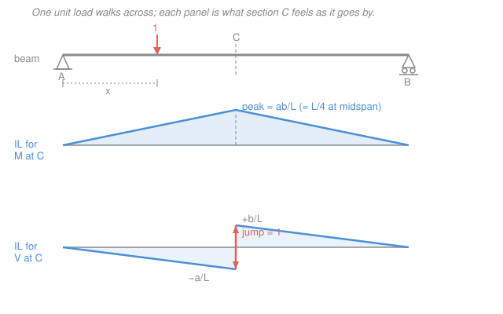

# Structural Analysis · Lesson 4.1: Influence Lines for Determinate Structures

> ⏱ ~15 min · Module 4: Influence Lines & the Matrix Stiffness Method · Builds on: [1.4 Shear & Bending-Moment Diagrams](01-04-shear-bending-moment-diagrams.md), [1.2 Supports, Reactions & Static Determinacy](01-02-supports-reactions-determinacy.md) · Unlocks: [4.2 Influence Lines for Indeterminate Structures](04-02-influence-lines-indeterminate-muller-breslau.md), bridge design for moving loads

## Why this matters

Every diagram you've drawn so far assumed the load sits still. But a bridge girder doesn't experience a fixed load — a truck **drives across** it, and the worst bending moment at midspan happens at one particular instant, when the axles are in one particular spot. Where do you put the truck to hurt the beam most? That's not a shear-and-moment-diagram question; it's an **influence line** question. Influence lines are the tool every bridge, crane rail, and gantry designer reaches for, and they're the whole reason design codes talk about "live load placement." Get this and you can answer: *of all the ways this moving load could sit, which one governs?*

## The idea

Here's the mental flip. A bending-moment diagram fixes the **load** and asks "what does every section feel?" An influence line fixes the **section** and asks "what does this one spot feel as a single unit load walks across the whole structure?"

Picture a bathroom scale sitting at midspan of a beam, wired to report the bending moment right there. Now roll a 1-unit weight slowly from the left support to the right. At each position of the weight, the scale reads a number. Plot that reading against *where the weight is* — not where the scale is — and you have the influence line for moment at midspan. The horizontal axis is the **load's position**; the vertical axis is **this one response**, per unit load.

Once you have that curve, moving-load design is almost free. A point load does the most damage when it stands on the **peak** of the influence line. A distributed load does the most damage when it blankets every stretch where the curve has the **same sign** as the effect you want. The influence line turns "try every position" into "read the graph."

## The formal version

**Definition.** The *influence line* for a response $R$ (a reaction, or the shear $V$ or moment $M$ at a **fixed** section) is the graph of $R$ as a function of the position $x$ (m) of a single downward **unit load** ($1$, dimensionless) travelling across the structure. *In words: freeze the section, move a unit load, plot the answer.*

**Construction (determinate case).** Place the unit load at a general position $x$, solve the response by statics, and you get a **piecewise-linear** function — determinate structures give straight-line influence lines, because reactions and internal forces depend linearly on load position. Take a simply supported beam, pin at $A$ ($x=0$), roller at $B$ ($x=L$), with a section $C$ at distance $a$ from $A$ (so $b = L-a$ from $B$).

*Reactions.* Sum moments about $B$: $R_A\,L - 1\cdot(L-x) = 0$, so

$$R_A(x) = 1 - \frac{x}{L}, \qquad R_B(x) = \frac{x}{L}.$$

*In words: the reaction influence line is a straight ramp — $1$ at its own support, $0$ at the far one.*

*Moment at $C$.* With the load right of $C$, use the left piece: $M_C = R_A\,a$. With the load left of $C$, use the right piece: $M_C = R_B\,b$. Both hit the same peak at $x=a$:

$$M_C^{\text{IL}}(x) = \begin{cases} \dfrac{b}{L}\,x, & 0 \le x \le a \\[2mm] \dfrac{a}{L}\,(L-x), & a \le x \le L \end{cases} \qquad \text{peak} = \frac{ab}{L}\ \text{at } x=a.$$

*In words: a triangle peaking under the section itself, with peak ordinate $ab/L$* (which at midspan, $a=b=L/2$, equals $L/4$). Note the units: this ordinate is moment **per unit load**, so it carries units of length (m).

*Shear at $C$.* Load right of $C$: $V_C = R_A$. Load left of $C$: $V_C = R_A - 1 = -R_B$. The two parallel segments are separated by a **unit jump** exactly at $C$:

$$V_C^{\text{IL}}(x) = \begin{cases} -\dfrac{x}{L}, & 0 \le x < a \\[2mm] 1 - \dfrac{x}{L}, & a < x \le L \end{cases} \qquad \text{ordinates } -\frac{a}{L}\ \text{and}\ +\frac{b}{L}\ \text{at } C.$$

*In words: a sawtooth that drops to $-a/L$ just left of $C$, jumps up by exactly $1$, then slides back to $0$* — the jump is the signature of a shear influence line. This ordinate is force per unit force, so it's **dimensionless**.

**Using an influence line.** For a response with influence-line ordinate $y(x)$:

- A point load $P$ (kN) at position $x$ contributes $P\,y(x)$. A set of loads contributes $\sum_i P_i\,y(x_i)$. Maximum effect: slide the group so a load lands on the **peak**.
- A uniform load $w$ (kN/m) over a region contributes $w\times(\text{area under the influence line over that region})$. Maximum effect: load **only** the stretch where $y$ has the sign you want.

## Picture

## Worked examples

**Example 1 (build them — reaction and midspan moment).** Simply supported beam, span $L$, pin $A$ at $x=0$, roller $B$ at $x=L$.

*Reaction $R_A$.* Put the unit load at $x$, take moments about $B$: $R_A = (L-x)/L = 1 - x/L$. That's a straight line from $R_A = 1$ at $A$ down to $R_A = 0$ at $B$ — read it as "a load parked over $A$ is carried entirely by $A$; a load over $B$ gives $A$ nothing."

*Moment at midspan* ($a = b = L/2$). From the formula the influence line is a triangle from $0$ at $A$, up to peak $ab/L = (L/2)(L/2)/L = L/4$ at midspan, back to $0$ at $B$. Concretely with $L = 12$ m the peak ordinate is $3$ m, and the two slopes are $b/L = +1/2$ (rising) and $a/L = -1/2$ (falling). Sanity: ordinate units are metres, so multiplying by a kN load will give kN·m. ✓

**Example 2 (use them — position a truck for max moment at midspan).** Same $L = 12$ m beam; want the maximum moment at midspan $C$. The $M_C$ influence line is the triangle above: peak $3$ m at $C$, slopes $\pm 1/2$.

*Two axle loads.* A truck has a front axle $P_1 = 30$ kN and a rear axle $P_2 = 50$ kN, spaced $d = 4$ m apart. To maximize $\sum P_i y_i$ on a triangular influence line, one axle should sit on the peak — test which.

- Heavy axle on peak: $P_2$ at $C$ ($y = 3$ m); $P_1$ then $4$ m to the left, at $x = 2$ m, ordinate $y = \tfrac12(2) = 1$ m.
$$M_C = 50(3) + 30(1) = 150 + 30 = 180\ \mathrm{kN\cdot m}.$$
- Light axle on peak: $P_1$ at $C$ ($y=3$); $P_2$ 4 m off at ordinate $3 - \tfrac12(4) = 1$ m.
$$M_C = 30(3) + 50(1) = 90 + 50 = 140\ \mathrm{kN\cdot m}.$$

The **heavy axle on the peak** governs: $M_C^{\max} = 180$ kN·m. *Check.* Units kN × m = kN·m ✓; the winning placement is the one that keeps the bigger load nearest the apex, as intuition demands.

*Moving uniform load.* Instead a lane load $w = 8$ kN/m can occupy any stretch. The whole $M_C$ triangle is positive, so load the **entire span**; the response is $w$ times the triangle's area:

$$\text{area} = \tfrac12 (L)(\text{peak}) = \tfrac12 (12)(3) = 18\ \mathrm{m^2}, \qquad M_C = w \times \text{area} = 8(18) = 144\ \mathrm{kN\cdot m}.$$

*Check.* Units (kN/m)(m²) = kN·m ✓. Contrast shear: the $V_C$ influence line changes sign, so to maximize positive shear at $C$ you'd load **only** the right-of-$C$ triangle (area $\tfrac12 b\cdot \tfrac{b}{L} = \tfrac12(6)(0.5) = 1.5$ m, giving $8(1.5) = 12$ kN) — loading the left region would only cancel it.

## Watch out

- **You might think an influence line and a bending-moment diagram are the same triangle.** They aren't. The $M$-diagram of a central point load is also a triangle — but its horizontal axis is *section position* with the load fixed. The influence line's horizontal axis is *load position* with the section fixed. Same shape here, opposite meaning; for off-centre sections they don't even look alike.
- **You might load the whole span to maximize everything.** Only for a single-sign influence line (like $M_C$). When the influence line has positive and negative regions (shear at an interior section, or any continuous-beam response in [4.2](04-02-influence-lines-indeterminate-muller-breslau.md)), a uniform load over the *opposite*-sign region subtracts. Load same-sign regions only.
- **You might read the peak ordinate as the moment.** The ordinate is a response **per unit load** — for $M_C$ it has units of length. You still multiply by the actual load(s) to get kN·m. Skipping that step is a units error, not a small one.

## One-liner

> An influence line freezes one section and walks a unit load across; then a moving point load bites hardest at the peak, and a moving uniform load bites hardest when it covers every same-sign inch.

## Problems

**P1 (🟢)** For a simply supported beam of span $L = 10$ m (pin at $A$, roller at $B$), sketch the influence line for the reaction $R_B$ and for the moment $M_C$ at $C$, located $a = 4$ m from $A$. Give the peak ordinate of the $M_C$ influence line and its units.

**P2 (🟡)** On the beam of P1 ($L=10$ m, $C$ at $a=4$ m), a single moving point load $P = 60$ kN crosses. (a) Where do you place it for maximum $M_C$, and what is that maximum? (b) A uniform lane load $w = 12$ kN/m of unlimited length crosses instead — what maximum $M_C$ can it produce, and over what region is it placed?

**P3 (🔴)** For the same beam and section $C$ at $a = 4$ m, sketch the influence line for shear $V_C$ and find the **maximum positive** shear at $C$ produced by the uniform load $w = 12$ kN/m. (Hint: load only the region where the $V_C$ influence line is positive.)

Solutions

**P1** $R_B$ influence line: a straight line $R_B(x) = x/L$, from $0$ at $A$ to $1$ at $B$ (dimensionless). $M_C$ influence line: a triangle from $0$ at $A$, peak at $C$, back to $0$ at $B$, with

$$\text{peak} = \frac{ab}{L} = \frac{(4)(6)}{10} = 2.4\ \mathrm{m}.$$

Peak ordinate $= 2.4$ m (moment per unit load, hence units of length). *Check.* $a + b = 4 + 6 = 10 = L$ ✓; peak below its own section $C$ ✓.

**P2** (a) A single point load maxes the response at the influence line's peak, i.e. park it **at $C$** ($x = 4$ m). Then
$$M_C^{\max} = P \cdot (\text{peak}) = 60 \times 2.4 = 144\ \mathrm{kN\cdot m}.$$
(b) The $M_C$ triangle is entirely positive, so load the **whole span**; response = $w \times$ triangle area:
$$\text{area} = \tfrac12 (L)(\text{peak}) = \tfrac12(10)(2.4) = 12\ \mathrm{m^2}, \qquad M_C = 12 \times 12 = 144\ \mathrm{kN\cdot m}.$$
*Check.* Units: kN × m and (kN/m)(m²) both give kN·m ✓. (The two happening to match at 144 is a coincidence of these numbers, not a rule.)

**P3** Shear influence line at $C$: from $0$ at $A$ down to $-a/L = -0.4$ just left of $C$, a unit jump up to $+b/L = +0.6$ just right of $C$, then down to $0$ at $B$. The positive region is the segment from $C$ to $B$, a triangle of base $b = 6$ m and height $0.6$:
$$\text{area}^{+} = \tfrac12 (6)(0.6) = 1.8\ \mathrm{m}, \qquad V_C^{\max,+} = w \times \text{area}^{+} = 12 \times 1.8 = 21.6\ \mathrm{kN}.$$
Load only the stretch $C$ to $B$; loading $A$ to $C$ (negative ordinates) would reduce $V_C$. *Check.* Units (kN/m)(m) = kN ✓; the jump of $0.6 - (-0.4) = 1.0$ confirms the unit-jump property. ✓

## Flashback

**From Lesson 3.2 (The Force Method for Beams):** A propped cantilever — fixed at $A$, roller at $B$, span $L$, constant $EI$ — carries a downward point load $P$ at **midspan**. Taking the roller reaction $R_B$ as the redundant, find $R_B$ and the fixed-end moment $M_A$. (Fresh variant: the boss problem used a uniform load; this one uses a central point load.)

Solution

Release the roller: the primary structure is a cantilever fixed at $A$, free at $B$. Two ingredients (both from Module 2 deflection results):

- Downward deflection at $B$ from the real load $P$ at midspan ($a = L/2$) of a cantilever:
$$\Delta_{B0} = \frac{P a^2}{6EI}(3L - a) = \frac{P (L/2)^2}{6EI}\left(3L - \tfrac{L}{2}\right) = \frac{PL^2/4}{6EI}\cdot\frac{5L}{2} = \frac{5PL^3}{48EI}\ (\downarrow).$$
- Deflection at $B$ from a unit upward load at $B$ (the flexibility coefficient):
$$f_{BB} = \frac{L^3}{3EI}\ (\uparrow).$$

Compatibility — the real roller allows no net deflection at $B$:
$$-\Delta_{B0} + f_{BB}\,R_B = 0 \;\Longrightarrow\; R_B = \frac{\Delta_{B0}}{f_{BB}} = \frac{5PL^3/48EI}{L^3/3EI} = \frac{5P}{16}.$$

Then $R_A = P - R_B = \tfrac{11P}{16}$, and summing moments about $A$ (with $M_A$ the wall's hogging reaction moment):
$$M_A = P\cdot\tfrac{L}{2} - R_B L = \frac{PL}{2} - \frac{5P}{16}L = \frac{3PL}{16}\ \text{(hogging)}.$$

*Check.* Both $EI$'s cancel, so $R_B$ is a pure fraction of $P$ — right, since a linear-elastic reaction can't depend on the (uniform) stiffness. $R_B = 5P/16 = 0.3125P$ sits sensibly below the simply supported $P/2$, because the fixed end steals load. Units of $M_A$: kN·m ✓. These are the standard textbook values for a propped cantilever under a central point load. ✓

## Connections

- **Backward:** every ordinate came from the reactions of [1.2](01-02-supports-reactions-determinacy.md) and the section-cut shear/moment machinery of [1.4](01-04-shear-bending-moment-diagrams.md) — an influence line is just those quantities computed once for every load position instead of once for a fixed load. The determinacy check from 1.2 is what guarantees the straight-line pieces.
- **Forward:** [4.2 Influence Lines for Indeterminate Structures](04-02-influence-lines-indeterminate-muller-breslau.md) drops the equilibrium-only construction for the **Müller-Breslau principle** — release the restraint, impose a unit displacement, and the *deflected shape* is the influence line — which is the only practical route once the structure is indeterminate and the pieces stop being straight.
- **Sideways (bridge design):** this is the analysis behind live-load models in bridge codes. A design truck or lane load is *positioned* by exactly the peak-and-same-sign rules here, and sweeping the governing placement across many sections produces the **envelope** of maximum moments and shears that a girder is actually sized for.
