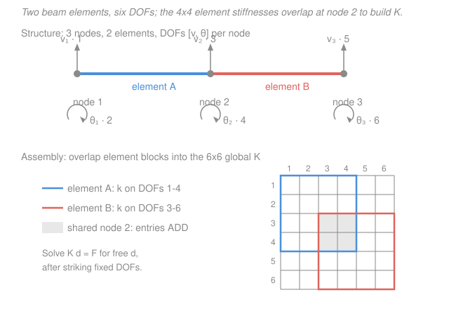

# Structural Analysis · Lesson 4.3: Introduction to the Matrix Stiffness Method

> ⏱ ~15 min · Module 4: Influence Lines & Matrix Methods · Builds on: [3.4 Slope-deflection method](03-04-slope-deflection-method.md), [`linalg-refresher` syllabus](../../linalg-refresher/syllabus.md) ([solving linear systems](../../linalg-refresher/lessons/01-03-linear-systems-elimination-rank.md)) · Unlocks: the bridge to finite-element (FEA) software — and the end of this course

## Why this matters

Every structural-analysis program you will ever touch — SAP2000, RISA, STAAD, an in-house Python solver — is doing one thing at its core: building a big matrix $\mathbf{K}$, a load vector $\mathbf{F}$, and solving $\mathbf{K}\mathbf{d}=\mathbf{F}$ for the displacements $\mathbf{d}$. That is not a new theory. It is [slope-deflection (3.4)](03-04-slope-deflection-method.md) — end moments written in terms of nodal rotations and translations — repackaged so a computer can assemble and solve it for a structure with a thousand joints instead of two. This lesson is the hinge between everything you have done by hand and the software that scales it, and it is the natural close of the course: your hand methods and the machine are the *same idea*.

## The idea

Slope-deflection had a simple engine: pick the joint displacements as your unknowns, write each member's end forces as (stiffness) $\times$ (those displacements), then enforce equilibrium at every joint. The matrix stiffness method keeps that engine and just organizes it as linear algebra.

Think of each beam element as a little machine with four "handles" at its ends: at each end you can push the node **sideways** (a transverse displacement $v$) or **twist** it (a rotation $\theta$). Grab a handle, move it a unit amount while holding the others fixed, and the element pushes back with a definite set of end forces and moments. Collect those responses and you have the element's $4\times4$ **stiffness matrix** $\mathbf{k}$ — a complete price list for "what force does it take to impose each unit of motion."

Now build a structure by snapping elements together at shared nodes. Where two elements meet, their handles are the *same* handle, so their stiffnesses **add** there. Overlapping the element price lists into one master price list $\mathbf{K}$ is called **assembly**. Nail down the supports (those displacements are known to be zero — cross them out), and you are left with a plain linear system $\mathbf{K}\mathbf{d}=\mathbf{F}$: master stiffness times unknown displacements equals the applied nodal loads. Solve it, and every reaction and member force falls out. That is the whole method — and, literally, what FEA does.

## The formal version

**Degrees of freedom (DOFs).** For a 2-node beam element (bending only, no axial), each node has two DOFs: a transverse displacement $v$ (m, positive up) and a rotation $\theta$ (rad, positive counterclockwise). Order them $[\,v_1,\ \theta_1,\ v_2,\ \theta_2\,]$ for ends 1 and 2. The matching end actions are the shear forces and bending moments at those ends.

**Element stiffness matrix.** For a prismatic element of length $L$ (m) and flexural rigidity $EI$ (kN·m²),

$$\mathbf{k}=\frac{EI}{L^3}\begin{bmatrix}12&6L&-12&6L\\6L&4L^2&-6L&2L^2\\-12&-6L&12&-6L\\6L&2L^2&-6L&4L^2\end{bmatrix}.$$

*In words: column $j$ of $\mathbf{k}$ is the set of four end forces/moments you must apply to hold the element in the shape "DOF $j$ = 1, all other DOFs = 0."* Read the first column: to push end 1 up by a unit while pinning everything else, you need an upward shear $\tfrac{12EI}{L^3}$ at end 1, a moment $\tfrac{6EI}{L^2}$ at each end to keep the ends from rotating, and a downward shear $\tfrac{12EI}{L^3}$ at end 2 (the $-12$). The second column is the same story for a *unit rotation* of end 1.

The two diagonal terms carry all the intuition:

- $\dfrac{12EI}{L^3}$ — the transverse **stiffness** of the element: the force to shove a node one unit sideways. Note the $L^3$: a beam twice as long is $8\times$ floppier, exactly the $\delta \propto L^3$ scaling you saw in cantilever deflection.
- $\dfrac{4EI}{L}$ — the rotational stiffness: the moment to twist a fixed-far-end member's end by one unit. This is precisely the $\tfrac{4EI}{L}$ member stiffness from [slope-deflection and moment distribution (3.5)](03-05-moment-distribution-method.md). Same number, same meaning.

**Symmetry and positive-definiteness.** $\mathbf{k}$ (and the assembled $\mathbf{K}$) is **symmetric** — entry $(i,j)$ equals $(j,i)$, a consequence of Betti/Maxwell reciprocity (the force at $i$ due to a unit motion at $j$ equals the force at $j$ due to a unit motion at $i$). After supports are applied, $\mathbf{K}$ is **positive-definite**: $\mathbf{d}^\top\mathbf{K}\mathbf{d}=2U>0$ for any nonzero $\mathbf{d}$, since that quantity is twice the stored strain energy. Positive-definite means the reduced system has a unique solution — the structure has exactly one equilibrium shape under a given load.

**Assembly and solution.** For a structure with $n$ global DOFs:

1. **Number** the global DOFs and map each element's local $[v_1,\theta_1,v_2,\theta_2]$ to its global DOF numbers.
2. **Scatter-add** every element's $\mathbf{k}$ into the $n\times n$ global $\mathbf{K}$ at the rows/columns of its global DOFs. Shared-node entries land on the same spot and sum.
3. **Apply boundary conditions:** strike out the rows and columns of any DOF that a support fixes to zero. This leaves a smaller *reduced* system on the free DOFs.
4. **Solve** the reduced $\mathbf{K}\mathbf{d}=\mathbf{F}$ (Gaussian elimination — [linalg 1.3](../../linalg-refresher/lessons/01-03-linear-systems-elimination-rank.md)) for the free displacements $\mathbf{d}$.
5. **Recover** reactions (multiply the struck-out rows of the *full* $\mathbf{K}$ by the now-known $\mathbf{d}$) and member end forces (each element's $\mathbf{k}$ times its own end displacements, plus any fixed-end forces from loads applied between nodes).

## Picture

## Worked examples

**Example 1 — Boss Problem 4(b): the element matrix and its diagonals.** Write the $4\times4$ beam-element stiffness matrix with DOF ordering $[\,v_1,\theta_1,v_2,\theta_2\,]$ and name the two diagonal terms.

$$\mathbf{k}=\frac{EI}{L^3}\begin{bmatrix}12&6L&-12&6L\\6L&4L^2&-6L&2L^2\\-12&-6L&12&-6L\\6L&2L^2&-6L&4L^2\end{bmatrix}.$$

The **translational** diagonal entries — rows/columns 1 and 3 (the $v$ DOFs) — are

$$\frac{EI}{L^3}\cdot 12=\frac{12EI}{L^3}\quad(\text{force per unit transverse displacement, kN/m}).$$

The **rotational** diagonal entries — rows/columns 2 and 4 (the $\theta$ DOFs) — are

$$\frac{EI}{L^3}\cdot 4L^2=\frac{4EI}{L}\quad(\text{moment per unit rotation, kN·m/rad}).$$

*Check.* Each diagonal entry is a *self*-stiffness — "resist your own motion" — so both must be **positive**, and they are. Units: $\tfrac{EI}{L^3}=\tfrac{\mathrm{kN\cdot m^2}}{\mathrm{m^3}}=\mathrm{kN/m}$, times the dimensionless $12$, gives kN/m ✓; times $4L^2$ ($\mathrm{m^2}$) gives $\mathrm{kN\cdot m}$ per radian ✓. And $\tfrac{4EI}{L}$ is exactly the far-end-fixed member stiffness $K=\tfrac{4EI}{L}$ from moment distribution — the methods agree.

**Example 2 — one element, solved: the cantilever, recovered from $\mathbf{K}\mathbf{d}=\mathbf{F}$.** A single fixed–free element of length $L$, rigidity $EI$, carries a transverse tip load $P$ (kN) at the free end. Node 1 is fixed; node 2 is free. Find the tip displacement $v_2$ and rotation $\theta_2$.

*Apply BCs.* Node 1 is fixed, so $v_1=\theta_1=0$: strike DOFs 1 and 2. The free DOFs are $v_2,\theta_2$ (local DOFs 3 and 4), so keep the lower-right $2\times2$ block:

$$\frac{EI}{L^3}\begin{bmatrix}12&-6L\\-6L&4L^2\end{bmatrix}\begin{bmatrix}v_2\\\theta_2\end{bmatrix}=\begin{bmatrix}P\\0\end{bmatrix}.$$

The load is a downward force $P$ at node 2 and *no* applied couple there, so $\mathbf{F}=[\,P,\ 0\,]^\top$ (taking the load's direction as positive for $v_2$).

*Solve.* The second row gives $-6L\,v_2+4L^2\,\theta_2=0\Rightarrow \theta_2=\dfrac{3v_2}{2L}$. Substitute into the first row:

$$12v_2-6L\!\left(\frac{3v_2}{2L}\right)=12v_2-9v_2=3v_2=\frac{PL^3}{EI}\;\Longrightarrow\; \boxed{v_2=\frac{PL^3}{3EI}},\qquad \theta_2=\frac{3}{2L}\cdot\frac{PL^3}{3EI}=\frac{PL^2}{2EI}.$$

*Check.* $v_2=\dfrac{PL^3}{3EI}$ and $\theta_2=\dfrac{PL^2}{2EI}$ are the textbook tip deflection and slope of a cantilever under a point load — the very result you got by [double integration in mechanics of materials (3.1)](../../mechanics-of-materials/lessons/03-01-deflection-by-integration.md). Units: $\tfrac{PL^3}{EI}=\tfrac{\mathrm{kN\cdot m^3}}{\mathrm{kN\cdot m^2}}=\mathrm{m}$ ✓, and $\tfrac{PL^2}{EI}$ is dimensionless (radians) ✓. A whole classical result popped straight out of a $2\times2$ solve — a satisfying way to end the course.

## Watch out

- **You might think you invert the full $\mathbf{K}$.** You do not — the *unreduced* global $\mathbf{K}$ is **singular** (the free structure can float away as a rigid body, so it has zero-stiffness modes). Only after you strike out the fixed DOFs does the reduced $\mathbf{K}$ become invertible/positive-definite. Applying boundary conditions is what makes the problem solvable, not an afterthought.
- **You might mix up the DOF ordering.** The matrix entries are pinned to the order $[\,v_1,\theta_1,v_2,\theta_2\,]$. If you list them $[\,v_1,v_2,\theta_1,\theta_2\,]$ instead, the $12$'s and $4L^2$'s land in the wrong cells and assembly silently corrupts. Fix an ordering and map every element to global DOFs *consistently*.
- **You might forget loads applied between nodes.** The clean $\mathbf{K}\mathbf{d}=\mathbf{F}$ assumes loads act *at nodes*. A distributed load or a mid-span point load is handled exactly as in slope-deflection: compute **fixed-end forces/moments** (the $\pm wL^2/12$, $\pm PL/8$ terms), apply their negatives as **equivalent nodal loads** in $\mathbf{F}$, solve, then add the fixed-end actions back when recovering member forces.

## One-liner

> The matrix stiffness method *is* slope-deflection as linear algebra: assemble element price-lists $\mathbf{k}=\tfrac{EI}{L^3}[\dots]$ into a global $\mathbf{K}$, strike the fixed DOFs, and solve $\mathbf{K}\mathbf{d}=\mathbf{F}$ — exactly what FEA software does.

## Problems

**P1 (🟢)** For a beam element with $E=200\ \mathrm{GPa}$, $I=1.2\times10^{-4}\ \mathrm{m^4}$, and $L=4\ \mathrm{m}$, compute the numerical values of the two diagonal stiffness terms $\tfrac{12EI}{L^3}$ (kN/m) and $\tfrac{4EI}{L}$ (kN·m/rad). (Note $EI=200\times10^{6}\ \mathrm{kN/m^2}\times1.2\times10^{-4}\ \mathrm{m^4}$.)

**P2 (🟡)** A single fixed–free element of length $L$ and rigidity $EI$ carries a **couple** $M_0$ (kN·m, no transverse force) applied at its free end 2. Fix node 1, reduce to the $2\times2$ system, and solve for the tip rotation $\theta_2$ and displacement $v_2$.

**P3 (🔴)** Why is the *unreduced* $4\times4$ element matrix $\mathbf{k}$ singular? Exhibit a nonzero displacement vector $\mathbf{d}$ with $\mathbf{k}\mathbf{d}=\mathbf{0}$ and explain it physically. (Hint: a rigid-body translation moves both nodes the same amount with no rotation.)

Solutions

**P1** First $EI=200\times10^{6}\times1.2\times10^{-4}=2.4\times10^{4}\ \mathrm{kN\cdot m^2}=24{,}000\ \mathrm{kN\cdot m^2}$.

$$\frac{12EI}{L^3}=\frac{12\times24{,}000}{4^3}=\frac{288{,}000}{64}=4{,}500\ \mathrm{kN/m},\qquad \frac{4EI}{L}=\frac{4\times24{,}000}{4}=24{,}000\ \mathrm{kN\cdot m/rad}.$$

*Check.* Units: $\tfrac{\mathrm{kN\cdot m^2}}{\mathrm{m^3}}=\mathrm{kN/m}$ ✓ and $\tfrac{\mathrm{kN\cdot m^2}}{\mathrm{m}}=\mathrm{kN\cdot m}$ ✓. Both positive, as self-stiffnesses must be.

**P2** With node 1 fixed, keep the $2\times2$ block on $[v_2,\theta_2]$, but now the load is a couple at node 2, so $\mathbf{F}=[\,0,\ M_0\,]^\top$:

$$\frac{EI}{L^3}\begin{bmatrix}12&-6L\\-6L&4L^2\end{bmatrix}\begin{bmatrix}v_2\\\theta_2\end{bmatrix}=\begin{bmatrix}0\\M_0\end{bmatrix}.$$

The determinant of the bracket is $12\cdot4L^2-(-6L)(-6L)=48L^2-36L^2=12L^2$, so

$$\begin{bmatrix}v_2\\\theta_2\end{bmatrix}=\frac{L^3}{EI}\cdot\frac{1}{12L^2}\begin{bmatrix}4L^2&6L\\6L&12\end{bmatrix}\begin{bmatrix}0\\M_0\end{bmatrix}=\frac{L^3}{12L^2\,EI}\begin{bmatrix}6L\,M_0\\12M_0\end{bmatrix}=\begin{bmatrix}\dfrac{M_0L^2}{2EI}\\[2mm]\dfrac{M_0L}{EI}\end{bmatrix}.$$

So $\theta_2=\dfrac{M_0L}{EI}$ and $v_2=\dfrac{M_0L^2}{2EI}$.

*Check.* These are the classic cantilever-under-tip-moment results: end rotation $M_0L/EI$ and tip deflection $M_0L^2/2EI$. Units: $\tfrac{M_0L}{EI}=\tfrac{\mathrm{kN\cdot m\cdot m}}{\mathrm{kN\cdot m^2}}$ = dimensionless (rad) ✓; $\tfrac{M_0L^2}{EI}=\mathrm{m}$ ✓. Notice the off-diagonal $-6L$ coupling makes the tip *translate* even though only a moment was applied — bending couples $v$ and $\theta$.

**P3** Take the pure rigid-body translation $\mathbf{d}=[\,1,\,0,\,1,\,0\,]^\top$ (both nodes move up one unit, neither rotates). Multiplying column-wise, $\mathbf{k}\mathbf{d}$ sums columns 1 and 3 of $\mathbf{k}$:

$$\frac{EI}{L^3}\left(\begin{bmatrix}12\\6L\\-12\\6L\end{bmatrix}+\begin{bmatrix}-12\\-6L\\12\\-6L\end{bmatrix}\right)=\frac{EI}{L^3}\begin{bmatrix}0\\0\\0\\0\end{bmatrix}=\mathbf{0}.$$

Physically, sliding the whole element sideways without bending it stores no strain energy, so it generates no end forces — the element has zero stiffness against that motion. Hence $\mathbf{k}$ has a nontrivial null space and is singular. (A rigid-body rotation $\mathbf{d}=[\,0,1,L,1\,]^\top$ is a second null vector.) This is exactly why you must fix enough DOFs — remove the rigid-body modes — before the system can be solved.

## Flashback

**From Lesson 3.4 (Slope-deflection method):** A propped cantilever spans $L$: fixed at $A$, pinned (roller) at $B$, carrying a uniform load $w$ (kN/m). Using slope-deflection, find the moment $M_A$ at the fixed end. (Take FEMs for a UDL as $\mathrm{FEM}_{AB}=-\tfrac{wL^2}{12}$, $\mathrm{FEM}_{BA}=+\tfrac{wL^2}{12}$; no support settlement, so $\psi=0$, and $\theta_A=0$.)

Solution

The only unknown is $\theta_B$. Write both end moments with $\theta_A=0,\ \psi=0$:

$$M_{AB}=\frac{2EI}{L}\big(2\theta_A+\theta_B\big)+\mathrm{FEM}_{AB}=\frac{2EI}{L}\theta_B-\frac{wL^2}{12},$$
$$M_{BA}=\frac{2EI}{L}\big(2\theta_B+\theta_A\big)+\mathrm{FEM}_{BA}=\frac{4EI}{L}\theta_B+\frac{wL^2}{12}.$$

The roller at $B$ carries no moment, so $M_{BA}=0$:

$$\frac{4EI}{L}\theta_B=-\frac{wL^2}{12}\;\Longrightarrow\;\theta_B=-\frac{wL^3}{48EI}.$$

Substitute into $M_{AB}$:

$$M_{AB}=\frac{2EI}{L}\!\left(-\frac{wL^3}{48EI}\right)-\frac{wL^2}{12}=-\frac{wL^2}{24}-\frac{wL^2}{12}=-\frac{wL^2}{24}-\frac{2wL^2}{24}=-\frac{3wL^2}{24}=-\frac{wL^2}{8}.$$

So $M_A=\dfrac{wL^2}{8}$, **hogging** (the minus sign = tension on top at the fixed end).

*Check.* This matches the standard propped-cantilever result $M_A=\tfrac18wL^2$ (and, with $\sum M_A=0$, gives the prop reaction $R_B=\tfrac38wL$). Units: $wL^2=\mathrm{(kN/m)\,m^2}=\mathrm{kN\cdot m}$ ✓. Reassuringly, the same structure appears in the force method — one problem, three tools, one answer.

## Connections

- **Backward:** this *is* [slope-deflection (3.4)](03-04-slope-deflection-method.md) in matrix clothing — the $\tfrac{4EI}{L}$ member stiffness and the $\pm\tfrac{wL^2}{12}$ fixed-end moments reappear here as the $\mathbf{k}$ diagonal and the equivalent nodal loads. Example 2 re-derives the cantilever deflection you first met by [double integration (MoM 3.1)](../../mechanics-of-materials/lessons/03-01-deflection-by-integration.md), now as a two-line linear solve.
- **Sideways (linear algebra):** assembly is a scatter-add into a sparse symmetric positive-definite matrix, and the solve is Gaussian elimination on $\mathbf{K}\mathbf{d}=\mathbf{F}$ — see [`linalg-refresher`](../../linalg-refresher/syllabus.md), especially [elimination and rank (1.3)](../../linalg-refresher/lessons/01-03-linear-systems-elimination-rank.md). The singular unreduced $\mathbf{K}$ (P3) is a rank-deficiency: its null space is the rigid-body modes.
- **Forward (course end → FEA):** everything past this point is *more of the same idea*. Add axial DOFs and you get a plane-frame element; rotate $\mathbf{k}$ from local to global axes with a transformation $\mathbf{T}^\top\mathbf{k}\,\mathbf{T}$ and you can assemble any 2-D frame; swap the beam element for a triangle or brick and you have the **finite-element method**. You now know, in miniature, exactly what commercial structural software does — a fitting place to close [Structural Analysis](../syllabus.md).
