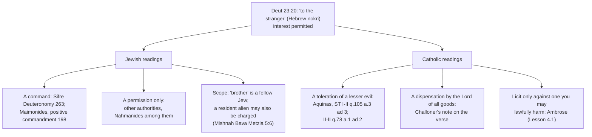

# Theology of Debt · Lesson 1.1: Lending in the covenant: interest, pledge and the poor brother

> ⏱ ~15 min · Module 1: Lending, release and judgment in the Old Testament · Builds on: [`old-testament` 2.6 Covenant and law](../../old-testament/lessons/02-06-covenant-and-law.md), [`history-of-debt` 1.3 Release laws in ancient Israel](../../history-of-debt/lessons/01-03-release-laws-in-ancient-israel.md) · Unlocks: [1.2 The seventh year](01-02-the-seventh-year-deuteronomy-15.md)

## Why this matters

This course reads debt the way the Catholic tradition has read it, in six steps. First the Old Testament's lending and release laws (Module 1). Then the New Testament's "forgive us our debts" and the debt parables (2). Then sin spoken of as a debt, from the Second Temple period to Anselm, Aquinas and Trent (3). Then the prohibition of usury (4) and its development down to the nineteenth century (5). Last, modern teaching on international and personal debt (6). It is one of four courses in the debt thread. [`history-of-debt`](../../history-of-debt/syllabus.md) tells what lenders and states actually did. [`philosophy-of-debt`](../../philosophy-of-debt/syllabus.md) asks whether interest is just. [`economics-of-debt`](../../economics-of-debt/syllabus.md) builds the models.

Everything later in the course leans on a handful of verses in the Torah about lending to a poor neighbour. The Fathers cited them against usurers. Aquinas had to explain why one of them lets Israel charge a foreigner interest. Every medieval argument about usury had to get past that exception. So before any theology of debt, read the texts that make a loan an act of mercy.

## The idea

In the Torah a loan to a poor Israelite is **not a business transaction**. It is help given to a "brother" who has fallen, and the law surrounds it with three kinds of limit:

- **No increase.** You may not get back more than you gave.
- **No hard security.** You may take a pledge, but not one he needs to live, and you may not go into his house to choose it.
- **No hard collection.** Do not act toward him as a creditor who presses.

Each limit comes with a reason. Some reasons are about God: "I am compassionate", "I brought you out of Egypt." Others are about the neighbour: "that thy brother may live with thee." One clause cuts the other way. From a *foreigner* you may take interest (Deuteronomy 23:20). That exception is the hinge later ages argue over.

## Source

Exodus 22:25–27 (Douay–Rheims; Hebrew 22:24–26), from the Covenant Code:

> If thou lend money to any of my people that is poor, that dwelleth with thee, thou shalt not be hard upon them as an extortioner, nor oppress them with usuries. If thou take of thy neighbour a garment in pledge, thou shalt give it him again before sunset. For that same is the only thing, wherewith he is covered, the clothing of his body, neither hath he any other to sleep in: if he cry to me, I will hear him, because I am compassionate.

Read it word by word. The borrower is "my people", God's own, and "poor". The Hebrew for "extortioner" is *nosheh*, simply "creditor": *do not be to him as a creditor*. The law forbids the creditor's *role*, not only a high rate. "Usuries" renders *neshek*. The pledge is lawful, but the cloak must come back each night. That makes it close to worthless as security, and so its point is presumably to keep the debt in view, not to protect the lender. The motive clause is God's: the poor man's cry goes over the creditor's head to a Judge who hears it.

## The argument

The lending law of the three codes, read together. Dating and composition belong to [`old-testament` 2.6](../../old-testament/lessons/02-06-covenant-and-law.md). The Near Eastern setting is [`history-of-debt` 1.3](../../history-of-debt/lessons/01-03-release-laws-in-ancient-israel.md), not retold here.

1. **To a poor brother you lend without increase** (Exodus 22:25; Leviticus 25:35–37; Deuteronomy 23:19). Leviticus names two things: *neshek*, from the verb "to bite", and *tarbit* or *marbit*, "increase". What each meant is [disputed](../reference.md#neshek-and-tarbit). One view: *neshek* is interest taken out in advance and *tarbit* interest added at repayment. Another says money against food, following Leviticus 25:37's pairing. The Talmud (Bava Metzia 60b) concludes that by Torah law they are one prohibition under two names, the "bite" to the borrower and the "increase" to the lender. *In words:* the lender may take back what he lent and nothing more.
2. **The ground is theological, not commercial.** Leviticus 25:36 says "Fear thy God, that thy brother may live with thee". Verse 38 adds that the Lord brought you out of Egypt. Israel was itself redeemed from bondage, so it may not make a brother's need into income.
3. **Security is limited by the debtor's life** ([the pledge laws](../reference.md#the-pledge-laws)). No millstone is taken (Deuteronomy 24:6): in the Hebrew, the creditor who takes it "takes a life in pledge". The poor man's cloak goes back by sunset. And the creditor stands outside while the debtor brings the pledge out (24:10–13). Aquinas read these rules as the Law making lending easier *and* kinder together (ST I-II q.105 a.2 ad 4):

   > the Law does not allow the creditor to take away whatever he likes in security, but rather permits the debtor to give what he needs least

   *In words:* the debtor chooses the pledge, and his house and livelihood are off limits.
4. **Lending itself is praised.** "He that hath mercy on the poor, lendeth to the Lord: and he will repay him" (Proverbs 19:17). The just man of Psalm 14 (Hebrew 15):5 "hath not put out his money to usury". Psalm 36 (Hebrew 37):21 sets the sinner who borrows and does not repay against the just man who "sheweth mercy and shall give". Sirach 29 opens by calling lending mercy and repayment a duty (29:1–2). It admits that bad debtors make people afraid to lend (Douay 29:10), and it praises the surety who stands for his neighbour (Douay 29:18). Douay's verse numbers in this chapter run ahead of modern Bibles.
5. **Wisdom also sees the danger.** "The borrower is servant to him that lendeth" (Proverbs 22:7). That is a description, not a command, and it is the slide into bondage the release laws of [1.2](01-02-the-seventh-year-deuteronomy-15.md) exist to stop.
6. **One exception:** interest may be taken from the *nokri*, the foreigner (Deuteronomy 23:20). The resident alien, the *ger*, is a different word and is protected elsewhere (Exodus 22:21).

∴ **Inside the covenant a loan is mercy shown to a brother, and God stands as its guarantor.** The creditor's gain is God's repayment and blessing, not the debtor's increase.

**Mark the levels.** That these books are inspired Scripture is **defined** (Vatican I, *Dei Filius*). That the texts forbid interest to the poor brother is simply what they say. How the Church reads them is another matter. Aquinas's division of the Old Law into moral, ceremonial and judicial precepts ([`old-testament` 2.6](../../old-testament/lessons/02-06-covenant-and-law.md)) is **common teaching**, not defined. So is his verdict that the pledge rules are judicial determinations that no longer bind as such, while the wrong of usury itself rests on natural justice (II-II q.78 a.1, read in [4.3](04-03-aquinas-on-usury-ii-ii-q78.md)). The meanings of *neshek* and *tarbit* are **not a doctrinal question at all**: they are lexical and exegetical opinions. Whether a charity these verses command becomes a precept of justice binding everyone is interpretation that no reading of the verses has settled ([`fundamental-theology` 5.5](../../fundamental-theology/lessons/05-05-the-loci-theologici.md)). The Church's own acts on usury come later (Modules 4–5), with [their levels](../reference.md#the-levels-in-this-course).

## Map of positions

Who may be charged interest under Deuteronomy 23:20, and why? The [foreigner exception](../reference.md#the-foreigner-exception) as each tradition reads it:

Challoner's note gives the dispensation reading plainly:

> This was a dispensation granted by God to his people, who being the Lord of all things, can give a right and title to one upon the goods of another.

Aquinas gives the toleration reading. On his account the Law did not approve such interest. It tolerated it for fear that Israel would otherwise charge fellow Israelites. His stated reason includes a charge of avarice against the Jews. That charge belongs to the medieval polemic [4.2](04-02-from-canon-to-council.md) has to face ([`church-history` 5.3](../../church-history/lessons/05-03-heresy-inquisition-and-the-jews.md)), and it should be read as such. Aquinas then universalizes "brother": since every man is our neighbour, "especially in the state of the Gospel", usury is wrong toward anyone (q.78 a.1 ad 2). All the Catholic readings on the map are **theologians' readings**, at the level of common teaching or freely disputed.

## Worked examples

**Example 1 (clean).** In spring a poor neighbour borrows 10 measures of seed barley. The lender asks for 12 at harvest, and as security his only cloak and a hand-mill stone. Run the rules. The extra 2 measures are *tarbit*, increase in kind, and are forbidden by Leviticus 25:37 whatever the rate. The millstone may not be taken at all (Deuteronomy 24:6). The cloak may be taken but must go back every evening (Exodus 22:26; Deuteronomy 24:12–13). And the lender may not walk in to collect either one (24:10–11). What the law leaves him is the return of his 10 measures, a pledge the debtor chose, and Proverbs 19:17's promise that God repays.

**Example 2 (hard: the resident alien).** The same lender makes the same loan to a poor *ger*, a non-Israelite settled in the village. Which rule governs? The texts pull three ways.

- Exodus 22:21 forbids afflicting the *ger*.
- Leviticus 25:35 speaks of the poor brother living with you "as a stranger and sojourner" (*ger* and *toshav*). The Hebrew is compressed, and translations divide over whether it compares the brother to a resident alien or extends the protection to him.
- The exception in Deuteronomy 23:20 names only the *nokri*.

The Mishnah rules that interest may be taken from a resident alien (Bava Metzia 5:6), reading "brother" as a fellow Jew. A Douay reader meets "stranger" in both Exodus 22:21 and Deuteronomy 23:20 and cannot even see the distinction. Aquinas answers from outside the text: every man is now a brother. The verses by themselves stop short of a verdict. What they give is a principle (mercy to the poor who live among you) and a boundary word whose reach later readers have to decide. That decision, in Ambrose and the medieval canonists, is where [4.1](04-01-the-fathers-against-usury.md) begins.

## Watch out

- **You might think the Torah bans only high interest.** *Neshek* is a "bite" of any size. In Example 1 the increase is 2 measures on 10, and it is still forbidden. "Usury" as an excessive rate is a modern sense of the word, and reading it back is an anachronism.
- **You might think the biblical ban is a rule about commerce.** Its object is the loan to a poor brother. Whether it reaches a merchant's business loan is exactly what later centuries argued about. Do not settle it from these verses.
- **Overstating a level:** "The Church has defined that the foreigner exception was a mere toleration." That is Aquinas's reading, common teaching at most. Challoner's note offers another. **Understating:** "Whether the Old Testament's lending laws are Scripture is a matter of opinion." Their inspiration is defined. Only their *reading* is open.
- **You might think Proverbs 22:7 approves the lender's power.** It observes it. The rest of the law is built to limit it.

## One-liner

> In the covenant a loan to the poor brother is mercy with God as guarantor: no bite, no increase, no pledge of his life, and the one exception, the foreigner, became the question every later age had to answer.

## Problems

**P1 (🟢) *(Exegetical.)*** Deuteronomy 24:10–13 (Douay–Rheims):

> When thou shalt demand of thy neighbour any thing that he oweth thee, thou shalt not go into his house to take away a pledge: But thou shalt stand without, and he shall bring out to thee what he hath. But if he be poor, the pledge shall not lodge with thee that night, But thou shalt restore it to him presently before the going down of the sun: that he may sleep in his own raiment and bless thee, and thou mayst have justice before the Lord thy God.

(a) Name three restrictions on the creditor and say whose good each one protects. (b) Which words make keeping these rules an act of mercy rather than a term of contract? What is the creditor's reward, and from whom does it come? 120 words or fewer in all.

**P2 (🟡) *(Exegetical.)*** An invented village case. Asaph, an Israelite farmer, makes four loans. (i) To his poor neighbour Micah he lends 20 measures of barley, 22 to be returned at harvest. (ii) He lends Micah 5 silver shekels and walks into Micah's house to pick out a bronze pot as the pledge. (iii) He lends a Phoenician merchant passing through with a caravan 50 shekels at 20% a year. (iv) He lends a poor Aramean who has lived in the village for ten years 5 shekels, 6 to be returned. For each loan, say whether the Torah as read in this lesson permits it, cite the verse, and name the one loan on which the texts stop giving a clear verdict, with the word the question turns on. One line per loan, then two sentences.

**P3 (🔴) *(Exegetical: level assignment.)*** An invented parish bulletin:

> "The Church has infallibly defined Aquinas's teaching that the Old Law's judicial precepts are dead. The lending laws of Exodus and Deuteronomy are judicial precepts. So the biblical ban on interest has no force for Christians, which is why the Church teaches that *neshek* only ever meant excessive interest."

Find three errors. For each, say what the claim overstates or misreads, and give the correct level or reading. 150 words or fewer.

Solutions

**P1** *(Exegetical, strict.)*

**Must hit, strict (a):** any three of: (1) the creditor may not **enter the house** to take a pledge, which protects the debtor's home and dignity; (2) he must **stand without** while the debtor **brings out what he hath**, so the debtor, not the creditor, chooses the security (Aquinas: "what he needs least"); (3) if the debtor is **poor**, the pledge may not stay overnight and is **restored before the going down of the sun**, so the poor man has his covering to sleep in.
**Must hit, strict (b):** the purpose clauses "that he may sleep in his own raiment and bless thee" and "thou mayst have justice before the Lord thy God". The reward is the debtor's blessing and standing righteous before *God*, not anything paid by the debtor. The Hebrew word is *tsedaqah*, righteousness: keeping the rule is counted to the creditor before God.
**Wrong turns:** treating the overnight return as protecting the *creditor* (it destroys his security); saying the creditor's reward is repayment of the loan; missing that the poor-debtor clause (24:12) is narrower than the no-entry rule (24:10), which covers any debtor.

**Model answer:** (a) He may not enter the house for a pledge, which guards the debtor's home. He stands outside and takes what the debtor brings, so the debtor chooses the security. And if the debtor is poor, the pledge goes back before sunset so that he can sleep in it. (b) "That he may sleep in his own raiment and bless thee, and thou mayst have justice before the Lord." The creditor gains nothing from the debtor except a blessing. His reward is righteousness counted to him by God. That is mercy, not contract.

---

**P2** *(Exegetical, strict.)*

**Must hit, strict:**
- (i) **Forbidden.** The 2 extra measures are *tarbit* / *marbit*, increase in kind, whatever the rate (Leviticus 25:37; Deuteronomy 23:19, "nor corn").
- (ii) The loan without interest is lawful, but **entering the house is forbidden** (Deuteronomy 24:10–11). Micah brings out the pledge. A pot is not a millstone, so 24:6 does not bar it.
- (iii) **Permitted** by the text. A Phoenician passing through is a *nokri*, a foreigner (Deuteronomy 23:20).
- (iv) **The open case.** The Aramean has settled in the village, so he is a *ger*, a resident alien. The exception names only the *nokri*. The *ger* is protected by Exodus 22:21, and Leviticus 25:35 mentions "stranger and sojourner" in the poor-brother law. The Mishnah (Bava Metzia 5:6) permits interest from a resident alien, while the verses alone leave it open. The word is ***ger*** (against *nokri*).

**Wrong turns:** calling (i) lawful because 10% is "moderate" (the Torah has no rate threshold); treating (ii) as usury (no increase is charged; the fault is the entry); treating the Douay "stranger" as one category, which merges (iii) and (iv).

**Model answer:** (i) Forbidden: increase in kind (Leviticus 25:37). (ii) The loan is lawful, but going into the house is forbidden (Deuteronomy 24:10–11). (iii) Permitted: a *nokri* (Deuteronomy 23:20). (iv) Unclear. The Aramean is settled among Israel, a *ger*, not a *nokri*. The exception names only the *nokri*, and the *ger* is protected elsewhere (Exodus 22:21; Leviticus 25:35), so the question turns on *ger*. The Mishnah allows interest from him, but the verses themselves do not decide.

---

**P3** *(Exegetical, strict.)*

**Must hit, strict:**
1. **Overstatement of level.** The moral/ceremonial/judicial division, and the judicial precepts' losing their binding force, are Aquinas's theology and **common teaching**. No infallible definition exists.
2. **Misreading Aquinas.** He puts the pledge and loan rules among the judicial precepts (I-II q.105 a.2 ad 4), but he holds usury unjust *in itself* (II-II q.78 a.1) and wrong toward every man (a.1 ad 2). The end of the judicial precepts does not end the ban on usury in his account.
3. **Exegetical opinion given doctrinal weight.** No Church teaching defines what *neshek* meant. It is a lexical question. The claim is also doubtful on the evidence: "bite" names any increase, and the Talmud treats *neshek* and *tarbit* as one prohibition.

**Wrong turns:** answering "the Church has always forbidden interest" (that states the later doctrine at a level this lesson does not assign); treating *Dei Filius* as the error (inspiration is defined, but the bulletin does not dispute it).

**Model answer:** First, nothing about the Old Law's three kinds of precept is infallibly defined. The division and the claim that the judicial precepts are "dead" are Aquinas's, and they are common teaching. Second, the bulletin misreads Aquinas. He does count the pledge rules as judicial, but he grounds the wrong of usury in natural justice (q.78 a.1) and extends it to every man (ad 2), so on his account the ban outlives the judicial law. Third, what *neshek* means is a lexical question that the Church has never taught on. The word means "bite", and the Talmud treats it and *tarbit* as one prohibition, so "only excessive interest" also misreads the text.

## Connections

- **Backward:** [`old-testament` 2.6](../../old-testament/lessons/02-06-covenant-and-law.md) sets out the codes and Aquinas's three kinds of precept, which the "Mark the levels" paragraph applies to lending. [`history-of-debt` 1.3](../../history-of-debt/lessons/01-03-release-laws-in-ancient-israel.md) and [1.2](../../history-of-debt/lessons/01-02-debt-bondage-and-the-royal-clean-slate.md) give the Near Eastern slide from debt into bondage that these limits resist.
- **Forward:** [1.2](01-02-the-seventh-year-deuteronomy-15.md) adds the release that Proverbs 22:7's servitude calls for. [1.4](01-04-creditors-under-judgment.md) has the prophets and Nehemiah judging creditors who broke these rules. Proverbs 19:17's "lendeth to the Lord", with God as the debtor who repays mercy, feeds the Second Temple theology of alms as treasure with God ([3.1](03-01-from-burden-to-debt.md)). The foreigner exception returns in Ambrose ([4.1](04-01-the-fathers-against-usury.md)) and in Aquinas's "every man our neighbour" ([4.3](04-03-aquinas-on-usury-ii-ii-q78.md)).
- **Sideways:** the debt thread. [`history-of-debt`](../../history-of-debt/syllabus.md) 2.1–2.2 shows how lenders worked around the ban these verses began. [`philosophy-of-debt`](../../philosophy-of-debt/syllabus.md) asks whether interest is unjust apart from revelation. [`economics-of-debt`](../../economics-of-debt/syllabus.md) explains why a lender who can take no increase and no hard pledge makes fewer loans: Sirach's "many have refused to lend", written as credit rationing. Justice as a virtue is [`moral-theology` 3.3](../../moral-theology/lessons/03-03-the-cardinal-virtues-and-the-gifts.md).
