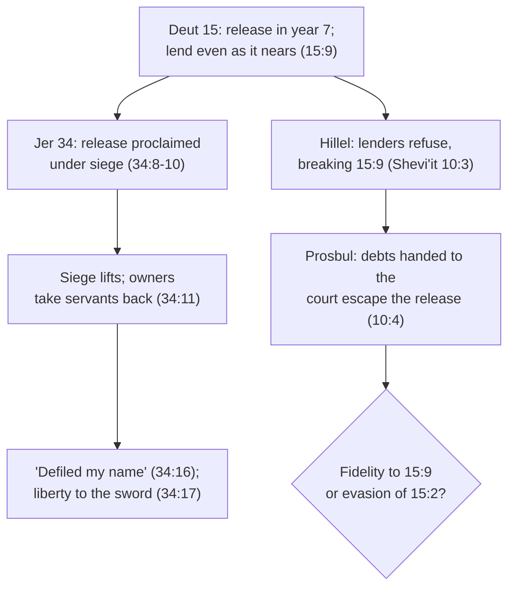

# Theology of Debt · Lesson 1.2: The seventh year: Deuteronomy 15

> ⏱ ~15 min · Module 1: Lending, release and judgment in the Old Testament · Builds on: [1.1 Lending in the covenant](01-01-lending-in-the-covenant.md), [`history-of-debt` 1.3](../../history-of-debt/lessons/01-03-release-laws-in-ancient-israel.md), [`old-testament` 2.6](../../old-testament/lessons/02-06-covenant-and-law.md) · Unlocks: [1.3 The Jubilee](01-03-the-jubilee-the-land-is-mine.md), [1.4 Creditors under judgment](01-04-creditors-under-judgment.md)

## Why this matters

[1.1](01-01-lending-in-the-covenant.md) made the loan to a poor brother an act of mercy with no interest. Deuteronomy 15 goes further: every seventh year the creditor must let the debt drop, and every Hebrew servant goes free with provisions. Then the chapter does something few laws do. It predicts how creditors will try to get around it and calls that sin. Two later episodes test the law under pressure. Under siege, Jerusalem's owners released their slaves and then took them back (Jeremiah 34). Centuries later, Hillel's *prosbul* kept loans flowing by routing them around the release. This lesson asks what the release is *for*, and so what counts as keeping it.

## The idea

A release law is a promise about the future made by people who will be tempted to break it. Deuteronomy knows two temptations. The first comes **before** the release: the creditor sees year 7 coming and stops lending. The second comes **after**: the master who has let his servant go wants him back. Deuteronomy 15 answers the first. Jeremiah 34 shows the second, and God's verdict on it.

The ground of the whole chapter is one sentence: you were slaves, and the Lord set you free. A people released by God releases others. Debt relief here is not bookkeeping. It is a liturgical act, "the year of remission of the Lord" (15:2), and in that year the whole law is read aloud at the feast of Tabernacles (31:10–11).

## Source

Deuteronomy 15:4, 9 and 11 (Douay–Rheims):

> And there shall be no poor nor beggar among you: that the Lord thy God may bless thee in the land which he will give thee in possession. …
> Beware lest perhaps a wicked thought steal in upon thee, and thou say in thy heart: The seventh year of remission draweth nigh; and thou turn away thy eyes from thy poor brother, denying to lend him that which he asketh: lest he cry against thee to the Lord, and it become a sin unto thee. …
> There will not be wanting poor in the land of thy habitation: therefore I command thee to open thy hand to thy needy and poor brother, that liveth in the land.

Three readings of the tension between 15:4 and 15:11:

- **Rabbinic.** Rashi, following the Sifre, makes 15:4 conditional. If Israel does God's will, the needy will be found among others and not among you. If it does not, they will be among you.
- **Challoner's note on 15:4.** The verse is not a promise that Israel will have no poor, as 15:11 shows. It is a command that everyone work to keep his brethren out of want.
- **Plain sense.** The goal is stated in 15:4 and the fact in 15:11, and the command (open thy hand) holds in both.

Now read 15:9 closely. The sin sits in the creditor's *heart* ("a wicked thought", "say in thy heart"), before any act. The victim's remedy is a *cry to the Lord*. No court appears. The law punishes a calculation that is perfectly rational.

## The argument

1. **The release is the Lord's.** "It is the year of remission of the Lord" (15:2). The Hebrew [*shemittah*](../reference.md#shemittah) means "a letting drop". Its verb is the one Exodus 23:11 uses for leaving the land fallow in the seventh year. The creditor does not forgive as a private favor. He yields a claim to its true owner. *In words:* the release is an act of worship as much as of justice.
2. **It binds among brothers, not with outsiders.** The foreigner may still be pressed (15:3), just as he may be charged interest (23:20; see [1.1](01-01-lending-in-the-covenant.md)). *In words:* the release belongs to covenant kinship, not to a universal law of contracts.
3. **Hard-heartedness is forbidden before the release** (15:7–10). The lender must lend, "that which thou perceivest he hath need of" (15:8), even when the year is near. 15:10 then drops the vocabulary of lending: "thou shalt give to him." *In words:* a loan made just before the release is really a gift, and the law asks for it anyway.
4. **Release comes with provision** (15:12–15). A freed servant does not leave empty-handed but is supplied "out of thy flocks, and out of thy barnfloor, and thy winepress". The motive clause: "Remember that thou also wast a bondservant in the land of Egypt, and the Lord thy God made thee free." *In words:* Israel releases because it was released, and generously, because God was generous.
5. **Breaking a release profanes God's name** (Jeremiah 34:8–22; below).

∴ **Keeping the release means more than not collecting in year 7.** It also forbids refusing to lend before it and re-enslaving after it. Both defeat what the release is for.

**Cancel or suspend?** Whether *shemittah* extinguishes the debt or only stops collection for that year is disputed. For **suspension**: the fallow-land verb, since the land is farmed again in year 8; and "cannot demand" (15:2) restrains collecting without saying the debt is gone. For **cancellation**: 15:9 hardly makes sense if the loss were only a year's delay; the Mishnah says flatly that the seventh year releases loans (*Shevi'it* 10:1), and it praises a debtor who repays anyway (10:9), which presupposes nothing is legally owed. Aquinas reads it as cancellation too (below).

**The formal point, once** ([the seventh-year incentive](../reference.md#the-seventh-year-incentive)). Let $P$ be the principal and $p$ the lender's probability of being repaid before the release. His expected recovery is $pP$, and the expected loss $(1-p)P$ is the part of the loan that is really a gift. Take a loan of 100 measures made in year 6 with $p = 0.3$. Expected recovery is $0.3 \times 100 = 30$ measures, and expected loss is 70. With interest forbidden, nothing in the contract can offset that 70. Deuteronomy 15:9 asks him to lend anyway. [`economics-of-debt` 8.2](../../economics-of-debt/lessons/08-02-the-scheduled-release.md) generalizes this to pricing under any known release date.

Aquinas asks why the law allowed something so damaging to credit (ST I-II q.105 a.2 obj. 4), and he answers:

> Fourthly, the Law prescribed that debts should cease together after the lapse of seven years. … But if they were altogether insolvent, there was the same reason for remitting the debt from love for them, as there was for renewing the loan on account of their need.

His omitted middle sentence supplies the other half: those able to pay would probably have paid before the seventh year. So the release costs little against solvent debtors, and against the insolvent it is the same charity that made the loan in the first place.

**Mark the levels** ([the levels in this course](../reference.md#the-levels-in-this-course)). That Deuteronomy and Jeremiah are inspired Scripture is **defined** (Trent, Session IV, on the canon). That these are [**judicial precepts**](../reference.md#judicial-precepts), which lost their binding force with Christ though they are not sinful to imitate, is Aquinas's scheme and **common teaching**, not defined ([`old-testament` 2.6](../../old-testament/lessons/02-06-covenant-and-law.md)). The Catechism (CCC 2449) lists the Old Testament's juridical measures for the poor (among them the jubilee year of forgiveness of debts and the ban on interest) as answering 15:11's command to open the hand, and it notes that Jesus makes the verse his own. This is **authentic magisterium** on the moral core, the duty to the poor. It says nothing about how the calendar worked. Cancel or suspend, whether the release was kept, and the verdict on the *prosbul* are **freely disputed**. The *prosbul* is also a question inside Jewish law, which has its own answer, and no Catholic magisterial act addresses it.

## The case

**Jeremiah 34.** With the Babylonian army at the walls, Zedekiah made a covenant that every Hebrew servant be freed, and the owners complied (34:8–10). "But afterwards they turned" (34:11). The usual reading ties the reversal to Jeremiah 37:5 (DR 37:4): the Chaldeans withdrew when Pharaoh's army came out of Egypt. With the danger past, the owners took their servants back. The oracle calls the release "right in my eyes", made "in the house upon which my name is invocated" (34:15). Taking it back therefore "defiled my name" (34:16). The sentence repays in kind: "behold I proclaim a liberty for you, saith the Lord, to the sword, to the pestilence, and to the famine" (34:17). Jeremiah's word for liberty is [*deror*](../reference.md#deror), the release word of Leviticus 25:10 ([1.3](01-03-the-jubilee-the-land-is-mine.md)). Those who would not release their brothers are themselves released, into death and exile.

## Worked examples

**Ex 1 (clean): the prosbul as its tradition states it.** The Mishnah reports that Hillel saw people refraining from lending to one another and so transgressing Deuteronomy 15:9. He instituted the [*prosbul*](../reference.md#prosbul), a declaration before judges handing over one's debts so that one may collect whenever one wishes (*Shevi'it* 10:3–4). The same chapter already exempts debts delivered to a court (10:2), so Hillel used a rule the law already had. *Gittin* 4:3 counts it among the enactments made for *tikkun ha-olam*, the right ordering of the world. The Talmud also records the view that, once the Jubilee had lapsed, the debt release held only by rabbinic enactment, so that the sages could modify it (*Gittin* 36a–b; the practice is [`history-of-debt` 1.3](../../history-of-debt/lessons/01-03-release-laws-in-ancient-israel.md)'s). Stated this way, the *prosbul* obeys the verse that forbids the credit freeze.

**Ex 2 (hard): the prosbul as evasion.** The case against it deserves the same strength. The release is the gift the chapter gives the poor, and 15:2 addresses the creditor directly. A device any creditor can invoke turns a fixed release into a default he can waive, and the waiver goes to the stronger party. Lenders who bother with the formality keep their claims, and the borrowers who most needed the release lose it. On this reading 15:9 was never permission to cancel 15:2. It told the creditor to bear the loss. Everything turns on one premise: **which verse states the law's purpose when the two conflict**, credit for the poor (15:7–11) or release from debt (15:1–2). Note also what each side must grant. The fidelity reading admits the release is gone for *prosbul* loans. The evasion reading must say what it would have done about the freeze the Mishnah reports.

## Watch out

- **Overstating a level.** "The Church teaches that debts must be cancelled every seven years" is wrong. The calendar is a judicial precept without binding force after Christ (common teaching). What binds is the moral core, the open hand, as CCC 2449 teaches it. **Understating** is also an error: calling 15:11's command "just an old Jewish rule" drops teaching the Catechism explicitly takes up.
- **Reading 15:4 against 15:11 as a contradiction.** Both the rabbinic and the Challoner readings resolve it, and each harmonizes differently. Say which you use.
- **Using Mark 7:13 as a verdict on the prosbul.** Jesus's charge that tradition makes void the word of God concerns *corban*, not the *prosbul*. Borrowing it assumes the evasion reading without arguing it.
- **Merging the two releases.** Debts drop on the national seventh year. On the usual reading, a servant's six years run from his own purchase (15:12). Jeremiah 34 concerns servants, not loans.

## One-liner

> Deuteronomy 15 makes the release the Lord's and forbids both the credit freeze before it and the reclaiming after it; Jeremiah shows the reclaiming judged, and the *prosbul* leaves open whether keeping credit alive is fidelity or escape.

## Problems

**P1 (🟢) *(Exegetical.)*** Jeremiah 34:15–17 (Douay–Rheims):

> And you turned to day, and did that which was right in my eyes, in proclaiming liberty every one to his brother: and you made a covenant in my sight, in the house upon which my name is invocated. And you are fallen back, and have defiled my name: and you have brought back again every man his manservant, and every man his maidservant, whom you had let go free, and set at liberty: and you have brought them into subjection to be your servants and handmaids. Therefore thus saith the Lord: You have not hearkened to me, in proclaiming liberty every man to his brother and every man to his friend: behold I proclaim a liberty for you, saith the Lord, to the sword, to the pestilence, and to the famine…

(a) What exactly was revoked, and which words show the release had been complete before it was undone? (b) On the text's own terms, why is the revocation a profaning of God's name rather than only a breach of a slave law? (c) What does the repeated "liberty" do in 34:17? Two sentences per part.

**P2 (🟡) *(Exegetical.)*** Reader A: "The *prosbul* is fidelity: Deuteronomy 15 exists so that the poor can borrow, and Hillel restored lending that 15:9 demands." Reader B: "The *prosbul* is evasion: the release was the poor man's protection, and Hillel let every creditor opt out of it." Name the single premise one of them must deny, and say what would move each reader. 150 words or fewer.

**P3 (🔴) *(Exegetical.)*** Diagnose this invented bulletin paragraph. Name four errors and give the level of each claim it gets wrong. 150 words or fewer.

> "Deuteronomy 15 abolished debt among God's people forever: every debt, owed by anyone, was wiped out, and 'there shall be no poor among you' is God's promise that obedience ends poverty. Jeremiah shows Israel was punished for not cancelling loans. Since this is Scripture, the Church teaches as dogma that Christians must cancel every debt in the seventh year."

Solutions

**P1** *(Exegetical.)*

**Must hit, strict:**
- (a) A **release of Hebrew servants**, made by covenant, was revoked: the owners "brought back again" the men and maidservants "whom you had let go free, and set at liberty", "into subjection". The double "let go free, and set at liberty" (and 34:10, "they obeyed") shows the release had been carried out, not merely promised. It is not a debt release.
- (b) The covenant was made "in my sight, in the house upon which my name is invocated": God was party and witness, so breaking it "defiled my name". What they undid was "right in my eyes", an act of obedience to the covenant law of 34:13–14.
- (c) **Measure for measure.** The "liberty" they refused their brothers is "proclaimed" back to them as release to sword, pestilence and famine. The punishment has the same form as the sin.

**Wrong turns:** calling it a cancellation of loans (the text speaks only of servants). Explaining (b) from 34:18's calf rite alone and ignoring the words the passage itself gives ("in my sight", "my name is invocated"). Reading (c) as ordinary freedom.

**Model answer:** (a) The owners revoked the covenant release of their Hebrew servants, bringing back those "whom you had let go free, and set at liberty". The doubled phrase shows the release was complete before it was undone. (b) The covenant was sworn "in my sight, in the house upon which my name is invocated", so God was its witness and party. Undoing what was "right in my eyes" therefore dishonors his name, not just a statute. (c) The same word turns the sin into its sentence. Those who withheld liberty receive "a liberty … to the sword", released to destruction as they refused to release their brothers.

---

**P2** *(Exegetical, strict on naming one premise; any defensible wording passes.)*

**Must hit, strict:**
- The crux: **which provision states the law's controlling purpose when they conflict**, the duty to lend (15:7–11) or the creditor's release (15:1–2). A holds that 15:9's purpose governs and may reshape 15:2's mechanism. B holds that 15:2 is the protection itself and 15:9 only tells the creditor to bear the cost.
- What moves A: evidence that *prosbul* loans went mainly to borrowers able to bargain, so the release was lost where it mattered most. What moves B: the Mishnah's report that lending had actually stopped, or the rabbinic premise that the debt release then held only by rabbinic enactment, which a court may adjust.

**Wrong turns:** "whether Hillel had authority" (both can grant it and still disagree). Citing Mark 7 as settling it. Treating this as a Catholic doctrinal question; no magisterial act rules on it.

**Model answer:** Both readers accept that Deuteronomy 15 protects the poor. They split on which verse carries that protection when the two collide. A takes 15:9 as the purpose: a release that stops all lending defeats itself, so preserving credit keeps the law. B takes 15:2 as the protection itself: 15:9 asks the creditor to absorb the loss, not to escape it. A would be moved by evidence that *prosbul* loans went to borrowers who could have borrowed anyway, leaving the poorest without release. B would be moved by the Mishnah's picture of a real credit freeze, and by the rabbinic view that the release was by then rabbinic law, which a court could lawfully adjust.

---

**P3** *(Exegetical.)*

**Must hit, strict (four of):**
1. **"Forever … wiped out"**: the release recurs every seventh year. Whether it cancels or suspends is **freely disputed**, so "wiped out" states one side as settled.
2. **"Owed by anyone"**: 15:3 excludes the foreigner. The release binds among brothers.
3. **"God's promise that obedience ends poverty"** asserts one reading of 15:4 as the text. 15:11 says the poor will not be wanting. Rashi reads 15:4 conditionally and Challoner as a command. The reading is **freely disputed**.
4. **"Punished for not cancelling loans"**: Jeremiah 34 concerns re-enslaving freed **servants**, not loans.
5. **"The Church teaches as dogma"**: inspiration is defined, but the seventh-year calendar is a **judicial precept** without binding force after Christ (**common teaching**). What the Church teaches is the moral core (CCC 2449, **authentic magisterium**). Calling that dogma, or the calendar binding, **overstates**.

**Wrong turns:** "correcting" it by saying the chapter has nothing to say to Christians, which **understates** CCC 2449. Treating "inspired" as meaning "binding as law now".

**Model answer:** The release came every seventh year, and whether it cancelled or only suspended is disputed, so "forever, wiped out" is wrong on both counts. It excluded the foreigner (15:3), so not "owed by anyone". Taking 15:4 as a promise is one contested reading, answered by 15:11 and read otherwise by Rashi and Challoner. Jeremiah 34 punishes the re-enslaving of freed servants, not unpaid loans. Finally, the Bible's inspiration is defined, but the calendar is a judicial precept that lapsed with Christ (common teaching). What binds is the open hand to the poor, which CCC 2449 teaches as authentic magisterium, not as a dogma about debts.

## Connections

- **Backward:** [1.1](01-01-lending-in-the-covenant.md) made the loan to the poor brother mercy without interest, and 15:3's foreigner clause parallels 23:20's. The release as *law* in its Near Eastern setting, and the *prosbul* as practice, are [`history-of-debt` 1.3](../../history-of-debt/lessons/01-03-release-laws-in-ancient-israel.md). The moral/ceremonial/judicial scheme is [`old-testament` 2.6](../../old-testament/lessons/02-06-covenant-and-law.md), and the levels are [`fundamental-theology` 4.4](../../fundamental-theology/lessons/04-04-the-ladder-of-doctrinal-authority.md).
- **Forward:** [1.3](01-03-the-jubilee-the-land-is-mine.md) takes *deror* to the fiftieth year and the land. [1.4](01-04-creditors-under-judgment.md) returns to creditors under prophetic judgment. [2.1](02-01-the-acceptable-year-of-the-lord.md) hears Acts 4:34, "neither was there any one needy among them", as the fulfilment of 15:4.
- **Sideways:** in the debt thread, [`history-of-debt`](../../history-of-debt/syllabus.md) records what the release did, and [`economics-of-debt` 8.2](../../economics-of-debt/lessons/08-02-the-scheduled-release.md) prices it and treats the *prosbul* as an opt-out that destroys commitment. [`philosophy-of-debt`](../../philosophy-of-debt/syllabus.md) asks whether scheduled forgiveness is just. The *prosbul* dilemma, a rule's purpose against its mechanism, returns in [5.3](05-03-not-to-be-disturbed.md), when confessors were told to leave moderate-interest lenders undisturbed.
