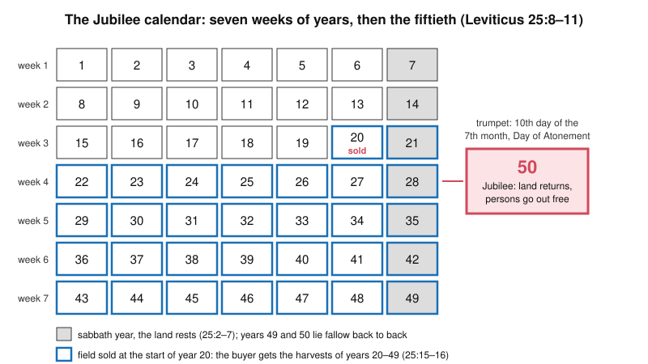

# Theology of Debt · Lesson 1.3: The Jubilee: "the land is mine"

> ⏱ ~15 min · Module 1: Lending, release and judgment in the Old Testament · Builds on: [1.1 Lending in the covenant](01-01-lending-in-the-covenant.md), [1.2 The seventh year](01-02-the-seventh-year-deuteronomy-15.md) · Unlocks: [1.4 Creditors under judgment](01-04-creditors-under-judgment.md), [2.1 "The acceptable year of the Lord"](02-01-the-acceptable-year-of-the-lord.md)

## Why this matters

Deuteronomy's seventh year ([1.2](01-02-the-seventh-year-deuteronomy-15.md)) stops a creditor's claim. Leviticus 25 goes further and says why no claim on an Israelite's land or person can be permanent: **the land is God's, and the people are God's.** Every later use of the Jubilee rests on that ground. Jesus reads Isaiah's "acceptable year" at Nazareth, popes proclaim Holy Years, and John Paul II called for debt relief in 2000. This lesson reads the chapter as theology and marks one honest gap: nobody can show that a Jubilee was ever held.

## The idea

Imagine your family farm can only ever be *leased*. When hard times come you sell it, but the deed says the buyer holds it only until a date fixed for the whole nation, and then it comes back to your family with no payment. Before that date a cousin can buy it back for you. The buyer knew all this. He paid for a set number of harvests, not for the soil.

Leviticus builds that deed into the calendar. Count seven sabbath years, forty-nine years in all. Then a trumpet sounds on the Day of Atonement, and the fiftieth year is proclaimed holy: land returns to the family that sold it, and Israelites who sold themselves go home. The reason is not economic. The Israelite never owned the land outright to begin with. He is a guest on God's estate, and a guest cannot sell the house.

## Source

Leviticus 25:23–24 (Douay–Rheims):

> The land also shall not be sold for ever: because it is mine, and you are strangers and sojourners with me. For which cause all the country of your possession shall be under the condition of redemption.

Three things to notice. **"Mine"** is the premise, and every rule in the chapter depends on it. **"Strangers and sojourners"** (Hebrew *gerim wetoshavim*) puts Israel in the legal position of the resident alien. That is the status the law elsewhere protects, and here it belongs to every landholder in relation to God. **"Under the condition of redemption"** turns the premise into law. Every sale carries a right of buying back, which 25:25 at once gives to the kinsman. The land is inalienable because the owner is someone other than the seller.

## The argument

1. **The land keeps sabbath** (25:2–7). Every seventh year it is not sown, and what grows of itself is food for owner, servants, hireling, stranger and beasts alike. *In words:* one year in seven, the owner cannot treat the field as his own.
2. **After seven sabbaths, the fiftieth year** (25:8–12). The trumpet sounds "in the seventh month, the tenth day of the month, in the time of the expiation" (25:9): the Day of Atonement. Release is proclaimed to all the inhabitants. The Hebrew is [*deror*](../reference.md#deror). The Douay has "remission" (from the Vulgate's *remissio*), and it is cognate with the Akkadian *andurārum* of the royal clean slates ([`history-of-debt` 1.2](../../history-of-debt/lessons/01-02-debt-bondage-and-the-royal-clean-slate.md)). *In words:* the year of release begins on the day of atonement.
3. **A sale is priced by the harvests left** (25:14–16): "he shall sell to thee the time of the fruits." *In words:* the buyer acquires a lease that runs to the Jubilee, not the land.
4. **The land is God's** (25:23), so every holding is redeemable (25:24). *In words:* God's ownership is the ground; the price rule and the reversion are consequences.
5. **The [go'el](../reference.md#goel) redeems** (25:25). The kinsman buys back what his poor brother sold. If there is none, the seller may redeem for himself, refunding the unused years (25:26–27). If no one redeems, the land returns in the Jubilee (25:28). The same rules apply to persons: an Israelite sold to a foreign resident may be redeemed by an uncle, a cousin or any kinsman, at a price reckoned by the years left (25:47–52). *In words:* first the family, then the debtor, then the calendar, and in the end the land always comes home.
6. **The people are God's** (25:39–43, 55). An Israelite who sells himself serves "as a hireling" and goes out at the Jubilee, "for they are my servants, and I brought them out of the land of Egypt" (25:42). *In words:* the Exodus made Israel God's own household, so no Israelite can become another man's property.

∴ **No debt can permanently alienate what God owns.** Land and persons return, because the one who holds the title is never the debtor.

Leviticus 25 cancels no money debt. It forbids interest to the poor brother in the middle of the chapter (25:35–37; see [1.1](01-01-lending-in-the-covenant.md)), and it reverses what debt had already taken, the field and the person.

**Mark the levels.** That Leviticus is inspired and canonical is **defined** (Trent, Session IV; [`fundamental-theology` 3.3](../../fundamental-theology/lessons/03-03-the-canon-as-defined.md)). What Leviticus 25 *asserts* is a law God gives. It does not assert that the law was kept, so inerrancy ([`fundamental-theology` 3.2](../../fundamental-theology/lessons/03-02-inerrancy.md)) is not at stake in the practice question. That the earth belongs to God, who destines its goods for all, so that owners are stewards, is taught at the level of the **authentic ordinary magisterium** (CCC 2402–2403; *Tertio Millennio Adveniente* 13, which cites 25:23 for God's *dominium altum*). Reading the Jubilee as a figure of Christ is the Church's settled typology (TMA 11–13); what it means at Nazareth is [2.1](02-01-the-acceptable-year-of-the-lord.md)'s question. **Whether a Jubilee was ever held is [freely disputed](../reference.md#the-levels-in-this-course).**

## The calendar

## Worked examples

**Example 1 (clean: pricing the lease).** A field yields 10 measures a year. It is sold at the start of year 20 of the cycle. The buyer gets the harvests of years 20 through 49:

$$n = 49 - 20 + 1 = 30 \text{ harvests}, \qquad P = n \times Y = 30 \times 10 = 300 \text{ measures}.$$

Twelve years later a kinsman redeems it (25:25–27). The buyer has had 12 harvests worth $12 \times 10 = 120$, so the "overplus" to be refunded is $300 - 120 = 180$, exactly the value of the 18 harvests he gives up. Sold instead in year 44, the field fetches $6 \times 10 = 60$. *In words:* the price is proportional to years left, and redemption refunds exactly the unused years. This example counts every year as a harvest. Netting out the fallow years is the next step, and it is Boss problem 1's. Leviticus also counts harvests without discounting them. Adding a discount rate and treating the reversion as a contract feature is [`economics-of-debt` 8.2](../../economics-of-debt/lessons/08-02-the-scheduled-release.md), which generalizes this arithmetic.

**Example 2 (hard: was it ever kept?).** Here is the case that it was not. No narrative in Scripture records a Jubilee held. The seventh year leaves traces. In Nehemiah 10:31 [DR 2 Esdras 10:31] the returned community pledges to "leave the seventh year, and the exaction of every hand." In 1 Maccabees 6:49, 53 Beth-zur and the besieged Temple run short of food "because it was the seventh year." Josephus reports tribute remitted and a siege broken off for it (*Antiquities* XI.8, XIII.8). He describes the Jubilee only as law (III.12). The Bible itself reads the exile as the land making up sabbaths it was denied (Leviticus 26:34–35; 2 Chronicles 36:21 [DR 2 Paralipomenon]). Many critical scholars therefore date the chapter late and read it as a priestly program for a restored Israel.

The case that it was: the *go'el* redemption of land was practiced, as Ruth 4 and Jeremiah 32 show. Periodic releases were real Near Eastern institutions, and *deror* is their word. Ezekiel 46:17 assumes a "year of release" when a prince's gift of land reverts. John Bergsma (2007), for one, argues the law's tribal, agrarian assumptions fit pre-exilic Israel better than the returnees' Judah (paraphrased).

Jewish tradition gives its own answer. The Talmud holds that the Jubilee applies only while all the tribes dwell in the land, so it lapsed when the tribes east of the Jordan went into exile (*Arakhin* 32b). The land's sabbath outlived it and is still kept in the land of Israel.

John Paul II judged that the Jubilee's prescriptions largely remained ideals, and so became a *prophetia futuri* of messianic freedom (TMA 13). That is a papal reading, not a ruling on a historical question. It is also a guide to what is at stake: the theology of 25:23 does not depend on the answer. Boss problem 1 asks you to argue it.

**Three readings.** The debt thread reads this chapter three ways. As **law** in its Near Eastern setting, in [`history-of-debt` 1.3](../../history-of-debt/lessons/01-03-release-laws-in-ancient-israel.md). As **theology** here and in [2.1](02-01-the-acceptable-year-of-the-lord.md): what the release rests on and what it points to. As a **credible relief device** in [`economics-of-debt` 8.2](../../economics-of-debt/lessons/08-02-the-scheduled-release.md): a release everyone can foresee changes lending before it arrives. The three readings answer different questions, and none of them settles the question another asks.

## Watch out

- **You might think the Jubilee is Leviticus's debt cancellation.** It returns land and persons. Debts are released in Deuteronomy 15 ([1.2](01-02-the-seventh-year-deuteronomy-15.md)). Challoner's note on 25:10, Josephus, and CCC 2449's list ("the jubilee year of forgiveness of debts") fold the two together. The Catechism's list illustrates Israel's care for the poor. It does not rule on which law released debts, so don't cite it as if it did.
- **You might overstate TMA 13.** It says the prescriptions *largely* remained ideals. That is neither "the Pope taught it was never kept" nor a judgment that binds anyone. Understating is also an error: the principle it draws from 25:23, God's lordship and the stewardship of owners, is ordinary magisterium (CCC 2402–2403), not one pope's opinion.
- **You might read "the land is mine" as abolishing property.** The chapter protects family holdings *against* permanent sale. Private tenure stays, held under God and subject to redemption, which is the shape of CCC 2403.
- **You might read the release as universal.** 25:44–46 lets Israelites hold bondmen from the nations permanently. The Exodus ground in 25:42 covers "my servants" whom God brought out of Egypt, and the chapter does not extend it further. Say so plainly.

## One-liner

> Because the land and the people are God's, Leviticus makes every sale a lease and every Israelite redeemable; whether Israel ever blew the fiftieth-year trumpet is disputed, and the theology does not wait on the answer.

## Problems

**P1 (🟢) *(Exegetical.)*** Leviticus 25:39–43 and 25:55 (Douay–Rheims):

> If thy brother constrained by poverty, sell himself to thee: thou shalt not oppress him with the service of bondservants. But he shall be as a hireling, and a sojourner: he shall work with thee until the year of the jubilee. And afterwards he shall go out with his children: and shall return to his kindred and to the possession of his fathers. For they are my servants, and I brought them out of the land of Egypt: let them not be sold as bondmen. Afflict him not by might: but fear thy God. … For the children of Israel are my servants, whom I brought forth out of the land of Egypt.

(a) What ground does the passage give for the man's release, and which words decide it? (b) Show that it has the same logical shape as the ground for returning land in 25:23. (c) Verses 44–46 then allow Israelites to hold bondmen "of the nations that are round about" for ever. What does that tell you about the scope of the ground in (a)? **100 words or fewer in total.**

**P2 (🟡) *(Exegetical.)*** Jeremiah 32:7–9, 14–15 (Douay–Rheims). Jerusalem is under Babylonian siege, and Jeremias is shut up in the court of the prison (32:2).

> Behold, Hanameel the son of Sellum thy cousin shall come to thee, saying: Buy thee my field, which is in Anathoth, for it is thy right to buy it, being next akin. And Hanameel my uncle's son came to me, according to the word of the Lord, to the entry of the prison, and said to me: Buy my field … for the right of inheritance is thine, and thou art next of kin to possess it. … And I bought the field … and I weighed him the money, seven staters, and ten pieces of silver. … Take these writings … and put them in an earthen vessel, that they may continue many days. For thus saith the Lord of hosts the God of Israel: Houses, and fields, and vineyards shall be possessed again in this land.

(a) What is redeemed, by whom, and under which provision of Leviticus 25? (b) Why is the purchase absurd as a commercial deal on that day, and what does 32:15 make it instead? (c) Name one way Boaz's redemption in Ruth 4 differs from Jeremias's. **120 words or fewer in total.**

**P3 (🔴) *(Exegetical (a) · Evaluative (b).)*** (a) Give each claim its level on the [ladder](../../fundamental-theology/lessons/04-04-the-ladder-of-doctrinal-authority.md) and **name the act** that fixes it, or say that none does. (1) "Leviticus 25 is the inspired word of God." (2) "Because the earth is God's, owners hold their goods as stewards, and those goods remain destined for all." (3) "The Jubilee was never actually kept in Israel; the Pope said so." **One or two sentences per claim.** (b) Suppose it were proved that no Jubilee was ever held. What, if anything, changes in how the Church reads Leviticus 25 as the word of God? **100 words or fewer.**

Solutions

**P1** *(Exegetical.)*

**Must hit, strict:** (a) The ground is **God's prior ownership by redemption**: "they are my servants, and I brought them out of the land of Egypt" (25:42, repeated 25:55). Because the Exodus made Israel God's servants, no Israelite may be "sold as bondmen." He serves "as a hireling, and a sojourner" and goes out at the Jubilee. (b) Same shape: *X belongs to God, therefore no human sale of X can be permanent.* In 25:23 the X is the land ("it is mine"), and here it is the person ("my servants"). (c) The ground covers those God brought out of Egypt, so the protection is limited to members of the covenant people. The text does not extend it to the nations.

**Wrong turns:** giving compassion or economic good sense as the ground, when the text gives a title; reading "hireling" as release *now*, when he works until the Jubilee; softening (c) into "the law abolished slavery."

**Model answer:** (a) The release rests on God's title: "they are my servants, and I brought them out of the land of Egypt" (25:42, 55). The Exodus made Israel God's household, so no Israelite can be sold as a bondman. He works as a hireling until the Jubilee. (b) The argument is the same as 25:23: what is God's cannot be sold for ever, with "my servants" in place of "it is mine." (c) The ground is tied to the Exodus, so it protects Israelites only. 25:44–46 leaves foreign bondmen outside it.

---

**P2** *(Exegetical.)*

**Must hit, strict:** (a) Family land, Hanameel's field in Anathoth, is redeemed by Jeremias as **next of kin**, the *go'el*, under 25:25 (the kinsman buys back what his impoverished brother sells), backed by 25:23–24's "condition of redemption." (b) The land is about to fall to Babylon (32:2–5), so as a deal it buys nothing. 32:15 makes it a **prophetic sign**: God will restore possession of houses, fields and vineyards after the exile. The sealed deeds are stored "that they may continue many days." (c) Any one of: in Ruth the nearer kinsman declines and cedes his right with the shoe (4:6–8); Boaz's redemption includes marrying Ruth "to raise up the name of the deceased in his inheritance" (4:10), so it redeems a line as well as a field; Boaz acts before elders at the gate, Jeremias before witnesses in the prison court.

**Wrong turns:** calling it an ordinary investment; saying the Jubilee returns the field, when this is a kinsman's redemption before any Jubilee; making Jeremias the seller.

**Model answer:** (a) Hanameel's inherited field is kept in the family: Jeremias, his next of kin, buys it back under Leviticus 25:25, the *go'el*'s right that follows from the land being God's (25:23–24). (b) The Babylonians are about to take the country, so the field is worthless as property. 32:15 turns the purchase into a pledge that Israel will own land again after exile, with the deed kept in a jar for that day. (c) In Ruth the first kinsman declines, and Boaz's redemption also raises up the dead man's name by marrying Ruth.

---

**P3** *(Exegetical (a) · Evaluative (b).)*

**Must hit, strict (a):** (1) **Defined:** Trent, Session IV, lists Leviticus in the canon it defines, and Vatican I confirms it. (2) **Authentic ordinary magisterium:** CCC 2402–2403 (universal destination of goods; property does not abolish the original gift of the earth to all) and TMA 13 (God's *dominium altum*, owners as stewards, citing Lev 25:23). It is not defined, and it is not mere opinion. (3) **Freely disputed**, and no act fixes it. TMA 13 says the prescriptions *largely* remained ideals. That is a historical judgment in an apostolic letter, not proposed as doctrine, and it does not say "never."

**Must hit, any verdict (b):** separate what Leviticus 25 **asserts** (a divine law and its grounds) from a claim that it was **kept**. Say whether inerrancy is touched, then name at least one thing that would or would not change: the typological reading (*prophetia futuri*), the social principle from 25:23, or the witness of the law as judgment on a people who failed to keep it (Leviticus 26:34–35).

**Wrong turns:** (a) calling (2) defined dogma, or dismissing it as a private papal view; treating TMA 13 as settling (3), or reporting "largely" as "never." (b) Arguing that non-observance would make the text false, when it asserts a command, not a practice. Grading only on the verdict.

**Model answer (b), one of several:** Very little changes at the level of doctrine. Leviticus 25 asserts a law and its grounds, God's ownership of land and people, not that Israel obeyed it, so its inerrancy is untouched. The social teaching drawn from 25:23 stands. What shifts is the law's role. It becomes, as TMA 13 already suggests, a prophecy of a release no king delivered, which Luke 4 claims is fulfilled. It is also a standing indictment, since Leviticus 26 itself foresees the land taking its sabbaths in exile. Someone who thinks it *was* kept could reply that practice would add a sign, not a doctrine.

## Flashback

**From Lesson [1.1](01-01-lending-in-the-covenant.md) (Lending in the covenant: interest, pledge and the poor brother):** *(Exegetical.)* An invented case. Joab, an Israelite, makes three loans. (i) He hands his poor neighbour Eliam 90 shekels and has him sign for 100, due in a year: "Nothing is added at repayment," Joab says. (ii) He lends Eliam's poor brother 10 shekels with no increase and takes his only cloak as the pledge. The brother brings it out to him at the door each morning, and Joab hands it back every evening. (iii) He lends a prosperous Israelite vintner 100 shekels at 10% a year to buy a second winepress. (a) For each loan, say whether the Torah as read in Lesson 1.1 permits it and cite the verse; for the one where the texts pull apart, name the pull. One line per loan. (b) Joab also lends to an Egyptian merchant passing through, at interest, and says: "Deuteronomy 23:20 *commands* me to charge him." Name one tradition that reads the verse as he does, one that reads it otherwise, and the level of the Catholic readings. Two sentences.

Solution

**Must hit, strict (a):**
- (i) **Forbidden.** The 10 shekels are increase taken out in advance. On one reading that is exactly *neshek*, and on the Talmud's view *neshek* and *tarbit* are one prohibition anyway (Exodus 22:25; Leviticus 25:36–37; Deuteronomy 23:19). Neither the form of the charge nor its size matters.
- (ii) **Permitted.** A cloak may be taken if it goes back before sunset (Exodus 22:26–27; Deuteronomy 24:12–13), and the debtor brings it out, so Joab never enters the house (24:10–11). As security it is nearly worthless, which is the law's point.
- (iii) **The case where the texts pull apart.** Exodus 22:25 and Leviticus 25:35–37 frame the ban around the *poor* brother. Deuteronomy 23:19 forbids usury to "thy brother" with no word about poverty, and 23:20 excepts only the stranger. So Deuteronomy's letter covers the vintner, while the mercy rationale of the other codes does not obviously reach a business loan. Lesson 1.1 leaves that question to later centuries (Module 4).

**Must hit, strict (b):** reading 23:20 as a **command**: the Sifre (Deuteronomy 263) and Maimonides (positive commandment 198). Reading it as a **permission** only: other Jewish authorities, Nahmanides among them. Catholic readings (Aquinas's toleration of a lesser evil; Challoner's dispensation from the Lord of all goods) are **theologians' readings, common teaching at most or freely disputed**. No magisterial act defines the verse's sense.

**Wrong turns:** calling (i) lawful because nothing is "added at repayment" or because 10% is modest. Faulting (ii) for taking a cloak at all. Settling (iii) flatly either way without noticing that the codes differ. In (b), stating Aquinas's toleration reading as Church teaching.

**Model answer:** (a) (i) Forbidden: increase deducted in advance is still increase (Leviticus 25:37; Deuteronomy 23:19). (ii) Permitted: the cloak goes back by sunset and the debtor brings it out (Exodus 22:26; Deuteronomy 24:10–13). (iii) Open: Deuteronomy 23:19 says only "thy brother", so its letter covers the vintner, but Exodus 22:25 and Leviticus 25:35 ground the ban in mercy to the poor, and a business loan is not that. (b) The Sifre and Maimonides read 23:20 as a command, as Joab does, while Nahmanides and others read a mere permission. Aquinas's "toleration" and Challoner's "dispensation" are theologians' readings, not defined teaching.

## Connections

- **Backward:** [1.1](01-01-lending-in-the-covenant.md)'s interest ban reappears inside this chapter (25:35–37), and [1.2](01-02-the-seventh-year-deuteronomy-15.md)'s seventh-year release of debts is the other half of the calendar. Deuteronomy releases the claim; Leviticus returns what the claim had taken.
- **Forward:** [1.4](01-04-creditors-under-judgment.md) hears the prophets and Nehemiah condemn creditors who took fields and children anyway. [2.1](02-01-the-acceptable-year-of-the-lord.md) follows *deror* into Isaiah 61, Daniel's seventy weeks and Luke 4. The *go'el* returns as the redemption vocabulary of [2.4](02-04-the-bond-and-the-ransom.md) (compare Job's *go'el* in [`old-testament` 5.3](../../old-testament/lessons/05-03-job.md)). The Church's Holy Year is [3.5](03-05-the-christian-jubilee-and-the-treasury.md), and the Jubilee call on international debt is [6.2](06-02-international-debt-and-the-jubilee-call.md).
- **Sideways:** the debt thread's showcase: law in [`history-of-debt` 1.3](../../history-of-debt/lessons/01-03-release-laws-in-ancient-israel.md), mechanism in [`economics-of-debt` 8.2](../../economics-of-debt/lessons/08-02-the-scheduled-release.md), and whether a scheduled forgiveness is *just* in [`philosophy-of-debt`](../../philosophy-of-debt/syllabus.md). The universal destination of goods as social doctrine belongs to [`catholic-social-teaching`](../../catholic-social-teaching/syllabus.md); where the covenant laws sit is [`old-testament` 2.6](../../old-testament/lessons/02-06-covenant-and-law.md).
