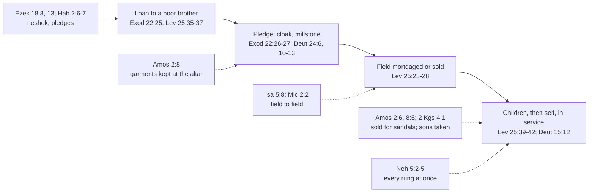

# Theology of Debt · Lesson 1.4: Creditors under judgment: the prophets and Nehemiah 5

> ⏱ ~15 min · Module 1: Lending, release and judgment in the Old Testament · Builds on: [1.1](01-01-lending-in-the-covenant.md), [1.2](01-02-the-seventh-year-deuteronomy-15.md), [1.3](01-03-the-jubilee-the-land-is-mine.md) · Unlocks: [2.1 "The acceptable year of the Lord"](02-01-the-acceptable-year-of-the-lord.md)

## Why this matters

Lessons 1.1–1.3 read the rules: no interest from a poor brother, the cloak back by sunset, a release every seventh year, the land back at the Jubilee. This lesson asks what happens when creditors ignore them. The answer is the prophets. They take the lender's side of the ledger into God's court and read out the charges, and Nehemiah, a governor rather than a prophet, makes one generation of creditors actually give back. These texts are where "usury" first becomes a mark of the wicked man rather than a clause in a code. Aquinas cites Ezekiel 18 against usury, and the Catechism cites Amos.

## The idea

Recall the slide that the Torah was built to stop ([`history-of-debt` 1.3](../../history-of-debt/lessons/01-03-release-laws-in-ancient-israel.md)): a loan, then a pledge, then the family field, then the children, then the debtor himself. Each rung has a law guarding it. The prophets are **covenant prosecutors** ([`old-testament` 4.1](../../old-testament/lessons/04-01-what-a-prophet-is-amos-and-hosea.md) sets out the lawsuit form). Their charges name the rung and assume the statute. So the method is simple: **for each oracle, find the law it presupposes, then ask what the prophet adds that the law could not say.**

What they add is theology. A statute can say "return the cloak." Only a prophet can say that the man sleeping on an unreturned cloak at the altar has made God's own house the scene of the crime.

## Source

Nehemiah 5:7–11 (Douay: 2 Esdras 5), Douay–Rheims. Judeans have mortgaged fields and given up children to pay for grain and the king's tribute (5:2–5). Nehemiah answers:

> I rebuked the nobles and magistrates, and said to them: Do you every one exact usury of your brethren? … We, as you know, have redeemed … our brethren the Jews, that were sold to the Gentiles: and will you then sell your brethren, for us to redeem them? … The thing you do is not good: why walk you not in the fear of our God, that we be not exposed to the reproaches of the Gentiles our enemies? Both I and my brethren, and my servants, have lent money and corn to many: let us all agree not to call for it again; let us forgive the debt that is owing to us. Restore ye to them this day their fields … and the hundredth part of the money, and of the corn, the wine, and the oil, which you were wont to exact of them

Three things to see. The Douay's "usury" renders Hebrew *maššāʾ*, a loan claim or the charge on it; the word is not *neshek*, and its exact sense is debated. Nehemiah gives three grounds: **brotherhood and redemption** (5:8: we buy Jews back as [*go'el*](../reference.md#goel), you sell them), **the fear of God**, and **the reproach of the nations** (both 5:9). And he starts with himself: "I and my brethren … have lent."

## The argument

1. **The Torah bounds the creditor at every rung.** No interest from the poor (Exod 22:25; Lev 25:35–37); [the pledge laws](../reference.md#the-pledge-laws) (the cloak back by sunset, Exod 22:26–27; no millstone, Deut 24:6; no entering the house, no widow's garment, Deut 24:10–13, 17); the land inalienable (Lev 25:23); a brother in service "as a hireling," not a bondman (Lev 25:39–42). *Reloaded from 1.1–1.3; not retaught.*
2. **Amos charges breach at the pledge and person rungs.** "Garments laid to pledge by every altar" (Amos 2:8) means pledged cloaks kept and lain on, at the shrine. "Wine of the condemned" is, in Hebrew, wine of those who have been *fined*. Selling "the poor man for a pair of shoes" (2:6; again 8:6) is read three ways: enslavement for a trivial debt, a bribed verdict (paired with "for silver"), or the sandal as a token of land transfer (Ruth 4:7). *In words:* the proceeds of broken pledge law are being consumed in worship.
3. **Isaiah and Micah charge breach at the land rung.** "Woe to you that join house to house and lay field to field" (Isa 5:8); "they have coveted fields … a man and his inheritance" (Mic 2:2). Behind both stands Leviticus 25:23: the land is the Lord's, and a family's *naḥălâ* (inheritance) is not a commodity to be accumulated.
4. **Habakkuk turns the creditor into the debtor.** His woe falls on the one who "doth load himself with thick clay" (Hab 2:6). The Hebrew *ʿabṭîṭ* is built on the root for taking a pledge (as in Deut 24:10): he loads himself with **pledges**. The Vulgate split the rare word into "thick" and "clay," and the Douay follows it. Then: "Shall they not rise up suddenly that shall bite thee" (2:7). "Bite" is *nōšĕkeykā*, from the root of [*neshek*](../reference.md#neshek-and-tarbit), so it also means "those who exact interest from you." *In words:* the lender will be dunned himself. The double sense is invisible in the Douay.
5. **Ezekiel moves usury from the code to the character.** In chapter 18 the just man has "not lent upon usury, nor taken any increase" (18:8: *neshek*, *tarbit*), and the wicked son "giveth upon usury" (18:13). The list sets usury beside idolatry, adultery, robbery and the unreturned pledge, and ends in a verdict: "he shall surely live" or "he shall not live." There is no "to thy brother" and no foreigner clause.
6. **The narratives show the law working, and failing.** Elisha's widow (2 Kings 4:1–7; Douay 4 Kings) meets a creditor coming "to take away my two sons to serve him," and the miracle pays him. Nehemiah 5 shows every rung at once (children in 5:2 and 5:5, fields in 5:3, the Persian tribute in 5:4), and ends it with restoration under oath and a curse (5:12–13). Nehemiah then refuses the governor's allowance for twelve years because "the people were very much impoverished" (5:14–18).

∴ **The creditor's rights in Israel are real but covenantal: bounded by God's ownership of the land and of the people, enforceable by God, and their abuse is sin against Him, not only a wrong to the neighbor.**

**Mark the levels.** That these books are inspired, with God as their author, is [rung 1](../../fundamental-theology/lessons/04-04-the-ladder-of-doctrinal-authority.md) (Trent, Vatican I; see [`fundamental-theology` 3.1](../../fundamental-theology/lessons/03-01-inspiration.md)); that the oracles condemn creditors who oppress the poor is their plain literal sense. The Catechism applies Amos 8:4–10 to "usurious and avaricious dealings" that cause famine, calling them indirect homicide (CCC 2269): **authentic ordinary magisterium** on that application, not a definition of what usury is. Everything else here is exegesis with no magisterial standing and is **freely disputed**: which reading of the sandals is right, the pledge sense of *ʿabṭîṭ*, what *maššāʾ* denotes, and what period "the hundredth" runs over. When later teaching cites Ezekiel 18, it is using a text, not defining its scope ([the levels in this course](../reference.md#the-levels-in-this-course)).

## The case

Solid arrows are the slide; dashed arrows are the prophet charging a breach at that rung.

## Worked examples

**Example 1 (clean): Amos 8:4–6.** "Hear this, you that crush the poor … Saying: When will the month be over, and we shall sell our wares: and the sabbath … that we may lessen the measure, and increase the sicle, and may convey in deceitful balances, That we may possess the needy for money." Run the method. *Laws presupposed:* the sabbath and new moon (the merchants keep them, grudgingly); honest weights (Lev 19:35–36; Deut 25:13–15); the brother in service not held as a bondman (Lev 25:39–42). *What the prophet adds:* the charge is that the same people keep the feast and cheat the scales, and the cheating ends in owning people. The sentence follows at 8:7: "surely I will never forget all their works." This is the passage the Catechism cites in 2269, and the chain it draws (sharp dealing, destitution, bondage) is already in Amos.

**Example 2 (hard): Nehemiah 5, where the method strains.** Three strains. *First*, Nehemiah names no statute. His grounds are brotherhood and redemption, fear of God, and what the Gentiles will say; the release laws are the background, but he cites none of them. *Second*, his remedy is not the seventh-year release. It is a one-time restoration imposed by a governor with an oath, closer to a royal clean slate ([`history-of-debt` 1.2](../../history-of-debt/lessons/01-02-debt-bondage-and-the-royal-clean-slate.md)) than to a calendar. The calendar comes later, in the community's pledge (Neh 10:31). *Third*, the text's one number does not interpret itself. The creditors must return "the hundredth part" (5:11, *mĕʾat*). Read as a monthly charge, [the hundredth part](../reference.md#the-hundredth-part) is the rate Roman law called the *centesima*, the rate the translator of Nicaea's canon 17 glosses in brackets as monthly:

$$12 \times 1\% = 12\% \text{ a year simple}, \qquad (1.01)^{12} - 1 = 12.68\% \text{ a year compounded monthly.}$$

But the text gives no period, and some commentators take the word as the loan charge itself. The 12% is an interpretation. What the text does settle is who must pay: the creditors, to "restore … this day." And Nehemiah pays first. He lends without pressing (5:10), buys no land (5:16) and waives his allowance "for the fear of God" (5:15). The judge submits to his own sentence.

## Watch out

- **Overstating a level.** Ezekiel 18 is inspired Scripture, not a conciliar definition of usury. Saying "Ezekiel defines that any charge on a loan is mortal sin" confuses a text with a magisterial act and settles by fiat the scope that Vienne left argued ([5.4](05-04-did-the-usury-doctrine-change.md)). Understating is also an error: CCC 2269's use of Amos is authentic teaching, not decoration.
- **Reading the prophets as against lending.** Lending to the poor is commanded (Deut 15:8). The charges are about pledges kept, land accumulated, people sold, and interest taken, never about the loan itself.
- **Treating "the hundredth part" as 12% per year in the text.** The period is an interpretation; show the arithmetic and label it.
- **Reading the Douay's "thick clay" as the Hebrew.** It follows the Vulgate's division of a rare word. The pledge sense and the "biters" pun live in the Hebrew only.
- **Assuming every creditor in the Bible is condemned.** The creditor in 2 Kings 4 is a *nōšeh*, "lender," and the prophet pays him.

## One-liner

> The prophets read the creditor's ledger as God's court record: every pledge kept, field joined and child taken is a count against the covenant, and Nehemiah shows what obeying the verdict costs.

## Problems

**P1 (🟢)** Amos 2:6–8 (Douay–Rheims):

> Thus saith the Lord: For three crimes of Israel, and for four I will not convert him: because he hath sold the just man for silver, and the poor man for a pair of shoes. They bruise the heads of the poor upon the dust of the earth, and turn aside the way of the humble … And they sat down upon garments laid to pledge by every altar: and drank the wine of the condemned in the house of their God.

(a) *(Exegetical)* Which law does "garments laid to pledge" charge Israel with breaking? Cite it, and name the words in Amos that show a breach rather than lawful pledge-taking. (b) *(Exegetical)* "Wine of the condemned" is, in Hebrew, wine of those who have been fined. What do "by every altar" and "in the house of their God" add to the charge? **Two sentences per part.**

**P2 (🟡)** Ezekiel 18:5, 7–9, 13 (Douay–Rheims):

> And if a man be just, and do judgment and justice, … And hath not wronged any man: but hath restored the pledge to the debtor, hath taken nothing away by violence: hath given his bread to the hungry, and hath covered the naked with a garment: Hath not lent upon usury, nor taken any increase … he is just, he shall surely live, saith the Lord God. … That giveth upon usury, and that taketh an increase: shall such a one live? he shall not live.

(a) *(Exegetical)* What kind of thing does the form of this list make taking usury: a breach of one statute, or something else? Name one feature of the list that decides it, and one qualifier present in Deuteronomy 23:19–20 that is absent here. (b) *(Exegetical, level assignment)* A study guide says: "Ezekiel 18 is the Church's defined teaching that any charge on any loan is a mortal sin." Name two distinct errors. **Two sentences per part.**

**P3 (🔴, optional)** 2 Kings 4:1, 7 (Douay: 4 Kings), Douay–Rheims:

> Thy servant, my husband, is dead, and thou knowest that thy servant was one that feared God, and behold the creditor is come to take away my two sons to serve him. … Go, sell the oil, and pay thy creditor: and thou and thy sons live of the rest.

(a) *(Exegetical)* What does the story assume about the creditor's legal right? Name two texts of the Torah or the prophets that make the assumption plausible. (b) *(Exegetical)* The narrator never calls the creditor unjust. Using Leviticus 25:39–43, say what would make his taking of the sons lawful yet unjust, and what the remedy Elisha chooses shows about how the story regards the claim. **100 words or fewer in total for (b).**

Solutions

**P1** *(Exegetical (a) · Exegetical (b))*

**Must hit, strict (a):** Exodus 22:26–27 (return the pledged garment "before sunset," because it is all he has to sleep in) and/or Deuteronomy 24:12–13, 17. The breach is in "sat down upon" and "laid … by every altar": the cloaks are kept and used at the shrine, not returned. Taking a pledge was itself lawful (Deut 24:10–11).
**Must hit, strict (b):** the fines and pledges, the takings of oppression, are consumed in worship, so the cult is being fed by breach of the covenant it celebrates. The wrong becomes a sin against God in His own house, not only a wrong to a neighbor (compare Amos 5:21–24).
**Wrong turns:** reading the verse as condemning all pledge-taking; finding interest here (no interest word appears in 2:6–8); treating (b) as a charge of idolatry. The altars are Israel's own.
**Model answer:** (a) Exodus 22:26–27 (with Deuteronomy 24:12–13) orders a pledged cloak returned before sunset; "sat down upon garments laid to pledge by every altar" shows the cloaks kept overnight and used, which is the breach, since taking the pledge was lawful. (b) The fines and pledges are consumed as offerings and feast-wine at the sanctuary, so worship itself is financed by the injustice. That makes the offense a profanation of God's house, not only a wrong to the poor man.

---

**P2** *(Exegetical (a) · Exegetical (b))*

**Must hit, strict (a):** the list describes a *person* (just or wicked) and ends in a verdict of life or death, and usury sits beside idolatry, adultery, violence and the unreturned pledge, so it is a mark of character, not a single breach. The feature: the verdict form ("he shall surely live" / "he shall not live") or the company usury keeps. Absent: the *brother* qualifier and the foreigner exception of Deut 23:19–20. Ezekiel states it without restriction, which is exactly how Aquinas reads it (ST II-II q.78 a.1 ad 2, "without any distinction"; a.2 *sed contra* cites 18:17 among "conditions requisite in a just man").
**Must hit, strict (b):** (1) *Category error:* a biblical text is not a Church definition. Its inspiration is rung 1, but its application is a reading, and conciliar teaching on usury came later (Module 4). (2) *Scope by fiat:* the text names *neshek* and *tarbit*; "any charge on any loan" settles what usury denotes, which is exactly what the course leaves argued (Vienne's scope; [5.4](05-04-did-the-usury-doctrine-change.md)). Also acceptable: "mortal sin" is a later theological category imposed on "he shall not live."
**Wrong turns:** answering (a) with "individual responsibility" alone. That is the chapter's frame ([`old-testament` 4.4](../../old-testament/lessons/04-04-jeremiah-and-ezekiel.md)), not what the list does to usury. Calling the guide's claim false because usury is permitted. The error is in the level and the scope, not the condemnation.
**Model answer:** (a) The list portrays a just or a wicked man and closes with "he shall surely live" or "he shall not live," so usury, set beside idolatry and robbery, marks the person as wicked rather than breaching a single rule. Unlike Deuteronomy 23:19–20 it has no "to thy brother" and no foreigner exception. (b) It calls an inspired text the Church's *definition*, when a definition is a magisterial act and later conciliar teaching is where the level has to be read. It also turns *neshek* and *tarbit* into "any charge on any loan," settling by fiat a scope the tradition still argues. (For comparison, the Talmud reads 18:13 as putting the interest-taker beside the shedder of blood, liable before Heaven rather than in court; Bava Metzia 61b, paraphrased.)

---

**P3** *(Exegetical (a) · Exegetical (b))*

**Must hit, strict (a):** it assumes that a creditor may lawfully take a dead debtor's children into service to work off the debt; the widow protests her plight, not his right. Supporting texts (any two): Exodus 21:2–7 (Hebrew servants; a daughter sold); Leviticus 25:39–41 (a brother who sells himself serves till the Jubilee, "with his children"); Deuteronomy 15:12; Isaiah 50:1 ("who is my creditor, to whom I sold you"); Nehemiah 5:5.
**Must hit, strict (b):** lawful: service as "a hireling," with release at the set time; unjust: treating them with "the service of bondservants" or "afflict[ing] him by might" (25:39, 43). The remedy is **payment** ("pay thy creditor"), not cancellation, so the story treats the claim as valid and puts the mercy in supplying the means, with provision left over ("live of the rest").
**Wrong turns:** reading the creditor as the villain of Amos 2:6; calling the miracle a release or a forgiveness of the debt; inferring approval from silence.
**Model answer (b):** Leviticus 25 lets a creditor hold a debtor's family as hired workers until release, but forbids working them as bondmen or ruling them "by might." So he could take the boys lawfully and still sin in how he held them, and the story does not tell us which. What it does show is its view of the claim: Elisha has the debt paid, not annulled. The creditor's right stands, and God's mercy meets it with enough oil to spare.

## Flashback

**From Lesson [1.2](01-02-the-seventh-year-deuteronomy-15.md) (The seventh year: Deuteronomy 15):** *(Exegetical.)* Deuteronomy 15:12–15 (Douay–Rheims):

> When thy brother a Hebrew man, or Hebrew woman is sold to thee, and hath served thee six years, in the seventh year thou shalt let him go free: And when thou sendest him out free, thou shalt not let him go away empty: But shall give him for his way out of thy flocks, and out of thy barnfloor, and thy winepress, wherewith the Lord thy God shall bless thee. Remember that thou also wast a bondservant in the land of Egypt, and the Lord thy God made thee free, and therefore I now command thee this.

(a) What does the master owe beyond letting the servant go, and which words say so? (b) Which clause grounds the command, and how does it make the provision more than a settling of accounts? (c) A master buys a Hebrew servant at the start of year 4 of the national seven-year cycle. On the usual reading, in which national year does the servant go free, and why is that not the "year of remission" of 15:1–2? **Two sentences per part.**

Solution

**Must hit, strict:**
- (a) **Provision**, not just release: "thou shalt not let him go away empty", but "give him … out of thy flocks, and out of thy barnfloor, and thy winepress". The gift is drawn from the goods "wherewith the Lord thy God shall bless thee".
- (b) The **Exodus motive clause**: "Remember that thou also wast a bondservant in the land of Egypt, and the Lord thy God made thee free". Israel releases because it was released, and gives generously because God gave to it first. The master hands on part of God's blessing; he is not paying off a wage claim.
- (c) Six years of service run through national years 4–9, so he goes free in the seventh year of *his own* service, **national year 10** (year 3 of the next cycle). The debt release of 15:1–2 falls on the fixed national seventh year and concerns loans. The servant's term runs from his own sale ("hath served thee six years").

**Wrong turns:** answering (c) "year 7", which merges the two releases. Reading the provision in (a) as back wages (15:18 says his six years were already worth "the wages of a hireling"; the gift comes on top). In (b), grounding the command in the servant's merit or in economic prudence rather than in the Exodus.

**Model answer:** (a) He must not send the servant away empty. He must stock him "out of thy flocks, and out of thy barnfloor, and thy winepress", from what God has blessed him with. (b) The ground is "thou also wast a bondservant in the land of Egypt, and the Lord thy God made thee free". A master who was himself freed and endowed by God passes that gift on, so the provision is gratitude made concrete, not settlement of a debt. (c) He serves national years 4 through 9 and goes free in year 10, the seventh year of his own service. The remission of 15:1–2 releases loans on the fixed national seventh year, while a servant's six years run from the day he was sold.

## Connections

- **Backward:** [1.1](01-01-lending-in-the-covenant.md) supplied *neshek*, *tarbit* and the pledge laws the prophets presuppose; [1.2](01-02-the-seventh-year-deuteronomy-15.md) the release that Nehemiah's one-time restoration is *not*; [1.3](01-03-the-jubilee-the-land-is-mine.md) "the land is mine" behind Isaiah 5:8 and Micah 2:2, and the *go'el* behind Nehemiah 5:8.
- **Forward:** [2.1](02-01-the-acceptable-year-of-the-lord.md) follows release from law into hope (Isaiah 61, Luke 4). The creditor who takes the family returns in the parable of Matthew 18:25 ([2.3](02-03-the-parables-of-debt.md)). Ezekiel 18 is a proof text in Aquinas ([4.3](04-03-aquinas-on-usury-ii-ii-q78.md)); Nicaea's canon 17 ([4.2](04-02-from-canon-to-council.md)) forbids clerics to charge "the hundredth." CCC 2269's use of Amos returns in [6.1](06-01-usury-and-finance-in-modern-teaching.md).
- **Sideways:** the prophets are located and dated in [`old-testament` 4.1](../../old-testament/lessons/04-01-what-a-prophet-is-amos-and-hosea.md) and [4.4](../../old-testament/lessons/04-04-jeremiah-and-ezekiel.md), and Nehemiah in [3.4](../../old-testament/lessons/03-04-exile-and-return.md). In the debt thread, [`history-of-debt` 1.3](../../history-of-debt/lessons/01-03-release-laws-in-ancient-israel.md) has the release laws as institutions and Nehemiah 10:31 as evidence of practice; [`economics-of-debt`](../../economics-of-debt/syllabus.md) models the land-concentration spiral Isaiah 5:8 describes; [`philosophy-of-debt`](../../philosophy-of-debt/syllabus.md) asks whether a lawful claim can still be unjust, which is P3's question.
