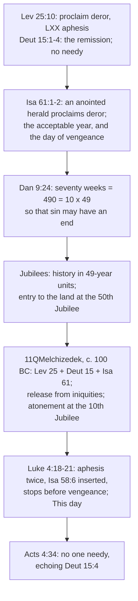

# Theology of Debt · Lesson 2.1: "The acceptable year of the Lord": from Isaiah 61 to Nazareth

> ⏱ ~15 min · Module 2: Debt and release in the New Testament · Builds on: [1.3 The Jubilee](01-03-the-jubilee-the-land-is-mine.md), [1.4 Creditors under judgment](01-04-creditors-under-judgment.md) · Unlocks: [2.2 "Forgive us our debts"](02-02-forgive-us-our-debts.md)

## Why this matters

Module 1 left [the Jubilee](../reference.md#the-jubilee) as a law with no record of ever being kept ([1.3](01-03-the-jubilee-the-land-is-mine.md)). This lesson follows what happened to it next: it stopped being a calendar and became a hope. The prophets and later Jewish writers pictured the final act of God as one great release. Then, in Luke's account of his first sermon, Jesus reads the release oracle of Isaiah 61 and says it is fulfilled "this day." The Lord's Prayer ([2.2](02-02-forgive-us-our-debts.md)) and the cancelled bond ([2.4](02-04-the-bond-and-the-ransom.md)) are spoken after that sermon. The live question is what kind of release he claimed to bring.

## The idea

Leviticus 25 fixed a date on which bondservants went home and land went back to its families. Isaiah 61 takes the same vocabulary and gives it to a single anointed messenger: *he* proclaims the release. Daniel 9 goes further and turns the whole of history into a Jubilee calendar. Seventy "weeks" of years add up to ten Jubilee periods, and at the end sin is finished. Writers at Qumran then read Leviticus, Deuteronomy and Isaiah together as one prophecy of a last Jubilee in which God's agent frees captives from their iniquities.

So by the first century "the year of release" could mean three things at once: an economic law, a political hope, and forgiveness of sin. Luke's Greek has a single word that carries all three, [*aphesis*](../reference.md#aphesis). The Nazareth sermon uses it twice. Readers have argued ever since over which sense leads.

## Source

Luke 4:17–21 (Douay–Rheims, Challoner):

> And the book of Isaias the prophet was delivered unto him. And as he unfolded the book, he found the place where it was written: The spirit of the Lord is upon me. Wherefore he hath anointed me to preach the gospel to the poor, he hath sent me to heal the contrite of heart, To preach deliverance to the captives and sight to the blind, to set at liberty them that are bruised, to preach the acceptable year of the Lord and the day of reward. And when he had folded the book, he restored it to the minister and sat down. [...] And he began to say to them: This day is fulfilled this scripture in your ears.

Set this beside Isaiah 61:1–2 and four features stand out.

1. **One line comes from a different chapter.** "To set at liberty them that are bruised" is not in Isaiah 61. It is Isaiah 58:6 in the Septuagint's wording, *aposteilai tethrausmenous en aphesei* (lesson's translation: "to send the crushed away in release"). Isaiah 58 attacks people who fast while pressing their debtors (58:3 in the Douay; the Hebrew has "workers"), and in the Greek the same verse orders every unjust contract torn up. The line is joined to 61:1 by a shared word. **Deliverance** to the captives (61:1) is *aphesis*, and **liberty** for the bruised is *en aphesei*. The Douay's two English words hide the fact that Luke's Greek says "release" twice.
2. **The word is the Jubilee's word.** The Septuagint translates the Jubilee of Leviticus 25:10–13 as *aphesis* and the seventh-year remission of Deuteronomy 15:1–2 the same way. The Hebrew of Isaiah 61:1 has [*deror*](../reference.md#deror), the exact term of Leviticus 25:10. Anyone who knew the Greek Bible heard the release laws in Luke's sentence.
3. **The reading stops mid-verse.** Isaiah 61:2 continues "and the day of vengeance of our God." In the Greek of Luke, whether critical or Byzantine, the reading ends at "the acceptable year of the Lord." The Douay's "and the day of reward" follows the Vulgate (*et diem retributionis*), which completes the verse along the lines of the Septuagint's "day of recompense." The argument that Jesus *stops before judgment* therefore rests on the Greek. In the Douay's text the reading does not stop there.
4. **"This day."** The oracle is not explained or put off to the future. It is declared fulfilled "in your ears," and Luke 4:25–27 at once points the release at a Sidonian widow and a Syrian leper.

A smaller textual note: "to heal the contrite of heart" is in the Vulgate and the Byzantine text, and modern critical editions omit it from Luke. That question belongs to [`new-testament` 2.3](../../new-testament/lessons/02-03-luke.md).

## The argument

How release law became eschatological hope, and what Luke claims:

1. **Isaiah 61 turns a legal date into a messenger's announcement.** Leviticus 25:10 says "proclaim *deror*." Isaiah 61:1 has an anointed speaker "proclaim *deror* to captives," and 61:2 calls the time "the acceptable year of the Lord." *In words:* the Jubilee is no longer something the community runs on schedule. God sends someone to announce it.
2. **Daniel 9 makes history a Jubilee calendar** ([the seventy weeks](../reference.md#the-seventy-weeks)). Jeremiah's seventy years (Dan 9:2) become "seventy weeks" of years (9:24), $70 \times 7 = 490 = 10 \times 49$: ten Jubilee periods. The goal is that "sin may have an end, and iniquity may be abolished." *In words:* the final release is from sin, and it comes on a fixed schedule.
3. **Second Temple writers built on that calendar.** The Book of Jubilees dates history from creation in units of 49 years. By its count (50:4, paraphrased) Israel enters the land after $49 \times 49 + 7 + 2 + 40 = 2{,}450 = 50 \times 49$ years, that is, at the fiftieth Jubilee. [11QMelchizedek](../reference.md#11qmelchizedek), a Qumran text of about 100 BC, reads Leviticus 25:13, Deuteronomy 15:2 and Isaiah 61:1 together (paraphrased). The heavenly Melchizedek proclaims liberty to the captives and releases them from their iniquities, and the Day of Atonement falls at the end of the *tenth* Jubilee, Daniel's figure. *In words:* before Jesus spoke, Isaiah 61 was already being read as the prophecy of a last Jubilee in which a divine agent releases people from sin.
4. **Luke 4:18–21 claims that release for Jesus, now.** The anointing points back to the Spirit's descent at his baptism (3:22). The *aphesis* is the Jubilee's. The day is "this day."
5. **Elsewhere Luke's *aphesis* means remission of sins** (1:77; 3:3; 24:47). *In words:* in Luke's own vocabulary the release word leans toward forgiveness.
6. **Luke's sequel keeps the economic sense alive.** Acts 4:34, "neither was there any one needy among them," uses *endeēs*, the Septuagint's word in Deuteronomy 15:4's promise of no poor among you. *In words:* the first community is described as the seventh-year promise kept.

∴ Luke presents Jesus as the anointed herald of the final Jubilee. What the Jubilee releases (sins, debts, captives, or all three) is what the readings dispute.

**Three readings** ([the Nazareth reading](../reference.md#the-nazareth-reading)), each as its defenders put it:

- **The Jubilee program.** Sharon Ringe (1985) reads the Jubilee images as the key to Jesus's whole ministry: forgiveness of sins and release of the poor and indebted belong together, and neither can be spiritualized away. John Howard Yoder (*The Politics of Jesus*, 1972, following André Trocmé) goes further and argues that Jesus proclaimed an actual Jubilee with social content: debts remitted, land redistributed, the poor relieved. (Both paraphrased.)
- **The Christological reading.** The point of "this day" is the person, not a policy. Isaiah's anointed messenger has arrived, and the release is whatever he brings: healing, exorcism, forgiveness, table fellowship with outcasts. No calendar year is being declared.
- **The spiritual reading.** The captives are captives of sin and the blind are spiritually blind. Luke 1:77, 3:3 and 24:47 set the meaning of *aphesis*, and the Jubilee is fulfilled in forgiveness, then in the Church's sacraments.

The readings are not exclusive, and Catholic commentary usually combines them. The dispute is over which one leads.

**The Jewish reading of Daniel 9**, as its tradition states it: the seventy weeks run from the destruction of the First Temple to the destruction of the Second, seventy years of exile plus 420 years of the Second Temple, $70 + 420 = 490$. This is the chronology of *Seder Olam* (ch. 28), and Rashi on 9:24 gives the same count. On this reading the passage concerns the Temple's two destructions, not a Messiah's death. Challoner's notes follow the Christian tradition instead: the seventy weeks end in Christ, with 483 years counted from Artaxerxes' decree to his baptism.

**Mark the levels** ([the levels](../reference.md#the-levels-in-this-course)). That Jesus is the Christ, the Anointed, is **defined dogma** (the creeds). That Luke 4 shows Christ taking Isaiah 61 as his own, the Spirit's anointing of the Messiah, is the Church's reading in the Catechism (CCC 714, 1286). That is **authentic ordinary magisterium**, and it concerns *who* fulfils the text, not whether the text carries a social program. *Tertio Millennio Adveniente* (1994, 11–13) reads the Nazareth sermon together with the Jubilee's social provisions and grounds its teaching on the universal destination of goods there. Its call for debt reduction (51) is a **prudential proposal** ([6.2](06-02-international-debt-and-the-jubilee-call.md)). **Whether Luke 4 announces a social program is freely disputed.** No act of the Magisterium settles it. The Christian messianic reading of Daniel 9 is the tradition's reading, and Challoner's arithmetic is commentary with no magisterial weight. The book's date is left open ([`old-testament` 6.3](../../old-testament/lessons/06-03-daniel-and-apocalyptic.md)).

## Timeline

## Worked examples

**Example 1 (clean): which sense of *aphesis*?** What does "deliverance to the captives" (Luke 4:18) mean? Run three checks. *Background:* in the Greek Old Testament the word names the Jubilee and seventh-year release, so the economic sense is live. *Luke's usage:* 1:77, 3:3 and 24:47 use it for remission of sins, so forgiveness is live too. *The Qumran precedent:* 11QMelchizedek had already joined the two, a Jubilee release from iniquity. The text supports "release" wide enough to cover both; a homily using one sense has chosen a reading and should say so.

**Example 2 (hard): "Jesus cancelled judgment."** A study guide claims that Jesus deliberately cut "the day of vengeance" because his Jubilee has no judgment in it. There is real evidence: the Greek reading ends at "acceptable year," and Luke 4:25–27 extends grace to Gentiles. It strains on two counts. The Douay/Vulgate text the tradition read for centuries has no cut, because it adds "the day of reward." And Luke's Jesus announces judgment elsewhere (e.g. 21:22, "the days of vengeance"). The defensible claim is smaller: in Luke's Greek, the Nazareth reading puts the release first and leaves judgment unannounced for now. Whether that stop is deliberate is an interpretive judgment, not something the text establishes.

## Watch out

- **You might think the Catechism settles Luke 4 as Christological only.** CCC 714 and 1286 teach *who* the anointed one is. They neither affirm nor exclude a social reading. Calling the program reading contrary to Church teaching overstates the level. Calling it Church teaching overstates it too.
- **You might build the "stops before vengeance" argument on the Douay.** It works only from the Greek. The Douay has "the day of reward."
- **You might hear "deliverance" and "liberty" as two ideas.** In the Greek they are one word used twice, and that repetition is why Isaiah 58:6 was inserted.
- **You might treat the Jewish count of Daniel 9 as a rival calculation of the same thing.** It counts from a different starting point to a different end, the two destructions, and it is a reading within its own tradition, not a failed attempt at the Christian one.

## One-liner

> Isaiah turned the Jubilee into a herald's proclamation, Daniel and Qumran into the calendar of the end, and at Nazareth Jesus read *aphesis* twice and said "this day." The Church teaches that he is the herald, and leaves open how far his release reaches into debts.

## Problems

**P1 (🟢) *(Exegetical.)*** Douay–Rheims:

> Isaias 61:1–2: The spirit of the Lord is upon me, because the Lord hath anointed me: he hath sent me to preach to the meek, to heal the contrite of heart, and to preach a release to the captives, and deliverance to them that are shut up. To proclaim the acceptable year of the Lord, and the day of vengeance of our God

> Isaias 58:6: loose the bands of wickedness, undo the bundles that oppress, let them that are broken go free

> Luke 4:18–19: he hath sent me to heal the contrite of heart, To preach deliverance to the captives and sight to the blind, to set at liberty them that are bruised, to preach the acceptable year of the Lord and the day of reward.

(a) Which line of Luke comes from Isaiah 58:6, and what single Greek word links it to the line before it? (b) A student says: "The Douay proves Jesus stopped before the day of vengeance." What is right and wrong in that? (c) In one sentence, what does the insertion add to the reading? 120 words or fewer in total.

**P2 (🟡) *(Formal (a) · Exegetical (b).)*** (a) Daniel 9:24 gives seventy weeks, and 9:25–27 divide them into 7, then 62, then 1. Show that the total is ten Jubilee periods of 49 years, and give the years in the first 7 + 62 weeks. Two lines. (b) Rashi and Challoner both count 490 years. State where each begins and ends, and say what the two counts agree on and what they disagree on. Three sentences.

**P3 (🔴, optional) *(Exegetical (a) · Evaluative (b).)*** Reader A: "Luke 4 announces a Jubilee with social content. Debt release is part of what 'this day' fulfils." Reader B: "Luke 4 announces a person. The release is forgiveness and healing, and no social program follows from the text." (a) Give the level of each claim: that Jesus is the anointed of Isaiah 61; that Luke 4 obliges Christians to press for debt cancellation. Name the act or its absence. (b) Argue for either A or B in 150 words or fewer. You must deal with the other side's strongest textual point.

Solutions

**P1** *(Exegetical, strict.)*

**Must hit, strict:**
- (a) "To set at liberty them that are bruised" is Isaiah 58:6 ("let them that are broken go free") in its Septuagint form. The link word is ***aphesis***: "deliverance to the captives" and "set at liberty" are both *aphesis* in Luke's Greek.
- (b) Wrong: the Douay's Luke ends with "and the day of reward," following the Vulgate, so on this text the reading does not stop before judgment. Right: the Greek of Luke ends at "the acceptable year of the Lord," so the argument can be made from the Greek.
- (c) It doubles the release word and brings in Isaiah 58's context: the oppressed set free, in a chapter against those who fast while pressing their debtors.

**Wrong turns:** naming "sight to the blind" as the insertion (it is from the Septuagint of 61:1); treating "to heal the contrite of heart" as Luke's addition (it is in Isaiah 61:1, and critical editions *omit* it from Luke).

**Model answer:** (a) "To set at liberty them that are bruised," from Isaiah 58:6, joined to "deliverance to the captives" because both render *aphesis*. (b) The student is wrong about the Douay, whose Luke continues "and the day of reward" (Vulgate). The point holds only for the Greek, which stops at "the acceptable year." (c) The insertion says release twice and brings in Isaiah 58's demand that the oppressed be freed, so the social sense is present in the sentence itself.

---

**P2** *(Formal (a) · Exegetical (b).)*

**(a)** $7 + 62 + 1 = 70$ weeks. $70 \times 7 = 490 = 10 \times 49$, so ten Jubilee periods. The first $7 + 62 = 69$ weeks give $69 \times 7 = 483$ years.

**(b) Must hit, strict:** Rashi (following *Seder Olam*) runs from the First Temple's destruction to the Second's: 70 years of exile + 420 years of the Second Temple = 490. Challoner runs from Artaxerxes' decree in Nehemiah's time, with 483 years to Christ's baptism and the last week covering his ministry and death. They agree on the arithmetic (seventy weeks of *years*, 490). They disagree on the starting point, the end point and the referent: the Temple's two destructions against Christ.

**Wrong turns:** reading the weeks as literal weeks; calling Challoner's count Church teaching (it is a note, i.e. commentary); calling Rashi's reading an "error" instead of stating it as its tradition states it.

**Model answer:** Both take seventy weeks as 490 years. Rashi counts from the first destruction to the second (70 + 420), so the prophecy concerns the Temple. Challoner counts 483 years from Artaxerxes to the baptism of Christ, so it concerns the Messiah. They share the arithmetic and differ on its terms and its subject.

---

**P3** *(Exegetical (a), strict · Evaluative (b), any verdict.)*

**Must hit, strict (a):** that Jesus is the Christ is **defined dogma** (the creeds). His taking of Isaiah 61 as his own is taught in the Catechism (CCC 714, 1286), which is **authentic ordinary magisterium**. That Luke 4 *obliges* pressing for debt cancellation is taught by **no act**. The program question is **freely disputed**. Papal calls for debt relief (*Tertio Millennio Adveniente* 51) are prudential proposals, not an exegesis of Luke 4 made binding.

**Must hit, any verdict (b):** (1) use at least one textual datum: *aphesis* as the Septuagint's Jubilee word, the Isaiah 58:6 insertion, Acts 4:34 echoing Deut 15:4, *or* Luke's *aphesis* = forgiveness (1:77, 3:3, 24:47) and "this day" pointing to the person; (2) meet the other side's strongest point directly; (3) state the conclusion at the right strength, without claiming Church teaching settles it.

**Wrong turns:** citing the Catechism as deciding the question; assuming the readings exclude each other when the verdict could be about which one *leads*; resting A on the Douay's "stop" (see P1).

**Model answer (one of several; this one argues B):** "This day" makes the person the fulfilment. Luke's own usage (1:77, 3:3, 24:47) makes *aphesis* forgiveness. And nothing in Luke 4:22–30 institutes a release of land or debts: what follows is healings and a rejected prophet. A's strongest point is real. Luke inserted Isaiah 58:6, a line about freeing the oppressed from a chapter against fasting creditors, so the Jubilee's social sense is in the sentence. Acts 4:34 then shows the community living out Deuteronomy 15:4. But those are consequences of the person's release, carried out by a community, not a program announced as the content of "this day." B, with A's data granted as effects.

## Flashback

**From Lesson [1.4](01-04-creditors-under-judgment.md) (Creditors under judgment: the prophets and Nehemiah 5):** *(Exegetical.)* An **invented** blog paragraph, written for this problem and not the words of any real person:

> "The prophets were against lending as such. Isaiah's 'woe to you that join house to house and lay field to field' (5:8) condemns owning property at all. Habakkuk warns *borrowers*: woe to the man who 'doth load himself with thick clay' (2:6), the Bible's picture of piling up debt. And the Catechism has defined usury once and for all as indirect homicide (CCC 2269)."

Name the error in each of its **four** claims, and give the correct reading or level. **150 words or fewer.**

Solution

**Must hit, strict:**
1. **Against lending as such:** no. Lending to the poor is commanded (Deuteronomy 15:8). The prophets' charges are about pledges kept, land accumulated, people sold and interest taken, never the loan itself; Elisha has the creditor of 2 Kings 4 paid.
2. **Isaiah 5:8:** the charge is *accumulation*, one household swallowing the family inheritances (*naḥălâ*) that Leviticus 25:23 makes inalienable. It presupposes family holdings; it does not abolish property.
3. **Habakkuk 2:6:** the woe falls on the one who "heapeth together that which is not his own", the **creditor**. The Hebrew *ʿabṭîṭ* is built on the pledge root, so he loads himself with pledges. "Thick clay" is the Vulgate's division of the rare word, followed by the Douay. The pledge sense is an exegetical reading, freely disputed, not a doctrine.
4. **CCC 2269:** it applies Amos 8 to usurious and avaricious dealings that lead to hunger and death, and calls *those* indirect homicide. That is **authentic ordinary magisterium** on an application, not a definition of what usury is.

**Wrong turns:** "correcting" claim 4 by dismissing CCC 2269 as a mere opinion (understating). Keeping "thick clay" and arguing only about who carries it. Answering claim 2 with "the land is God's, so there is no private property", which is the blog's error from the other side.

**Model answer:** The prophets never condemn lending, which Deuteronomy 15:8 commands. They condemn kept pledges, seized land, sold people and interest. Isaiah 5:8 attacks the man who absorbs other families' inheritances, the holdings Leviticus 25:23 protects, so it presupposes property rather than abolishing it. Habakkuk's woe is on the one heaping up "that which is not his own", the creditor. The Hebrew word probably means a load of pledges, and "thick clay" is the Vulgate's rendering. That pledge reading is exegesis, not doctrine. CCC 2269 is authentic ordinary teaching that usurious and avaricious dealings which starve people are indirect homicide. It condemns those dealings; it does not define usury.

## Connections

- **Backward:** [1.3](01-03-the-jubilee-the-land-is-mine.md) supplies the Jubilee and *deror*. [1.2](01-02-the-seventh-year-deuteronomy-15.md) supplies Deuteronomy 15, whose "no poor" returns in Acts 4:34. [1.4](01-04-creditors-under-judgment.md)'s prophets against creditors stand behind Isaiah 58. Isaiah's composition is [`old-testament` 4.2](../../old-testament/lessons/04-02-isaiah-and-immanuel.md), and Daniel's date is [`old-testament` 6.3](../../old-testament/lessons/06-03-daniel-and-apocalyptic.md).
- **Forward:** [2.2](02-02-forgive-us-our-debts.md) takes the *aphesis* of sins and debts into the Lord's Prayer. [2.4](02-04-the-bond-and-the-ransom.md) pairs *aphesis* with redemption. [3.5](03-05-the-christian-jubilee-and-the-treasury.md) follows the Jubilee into the Church's holy years, and [6.2](06-02-international-debt-and-the-jubilee-call.md) follows it into the papal debt call.
- **Sideways:** Luke's theology of the poor is [`new-testament` 2.3](../../new-testament/lessons/02-03-luke.md), and the Second Temple setting is [`new-testament` 1.2](../../new-testament/lessons/01-02-second-temple-judaism.md). In the debt thread, the Jubilee as law is [`history-of-debt` 1.3](../../history-of-debt/lessons/01-03-release-laws-in-ancient-israel.md), and the campaign that took its name is [`history-of-debt` 5.5](../../history-of-debt/lessons/05-05-jubilee-2000-and-hipc.md). Whether scheduled forgiveness is *just* is [`philosophy-of-debt`](../../philosophy-of-debt/syllabus.md)'s question, and whether it *works* as a relief mechanism is [`economics-of-debt`](../../economics-of-debt/syllabus.md)'s.
