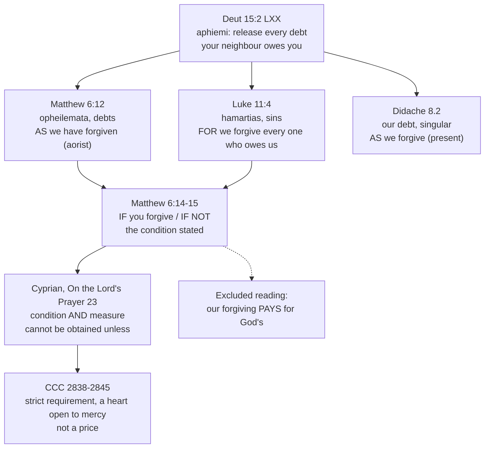

# Theology of Debt · Lesson 2.2: "Forgive us our debts"

> ⏱ ~15 min · Module 2: Debt and release in the New Testament · Builds on: [1.2 The seventh year](01-02-the-seventh-year-deuteronomy-15.md), [2.1 "The acceptable year of the Lord"](02-01-the-acceptable-year-of-the-lord.md), [`new-testament` 2.2](../../new-testament/lessons/02-02-matthew.md) · Unlocks: [2.3 The parables of debt](02-03-the-parables-of-debt.md), [2.4 The bond and the ransom](02-04-the-bond-and-the-ransom.md)

## Why this matters

Every Catholic prays it daily, and most never notice what it says: Jesus teaches his disciples to ask God for the seventh-year release. The fifth petition takes the vocabulary of [Deuteronomy 15](01-02-the-seventh-year-deuteronomy-15.md), the cancelling of a neighbour's loan, and makes it the name for God's forgiveness of sin. Then it adds a clause no other petition has: the release we ask for is tied to the release we give. This lesson reads the petition in its three earliest forms and answers the question that clause forces. Is our forgiving a **condition** of God's, a **measure** of it, or a **price** for it? The tradition's answer is exact, and it is not the one most people assume.

## The idea

Start with the word. In the Greek Old Testament, Deuteronomy 15:1–2 reads (lesson's translation): "you shall make a *release* (*aphesis*)... you shall *release* (*aphiēmi*) every private debt that your neighbour *owes* (*opheilei*) you." The same verb and the same debt root stand in the petition: *aphes hēmin ta opheilēmata hēmōn*, "release to us our debts." A Greek-speaking Jew hearing Matthew 6:12 heard the sabbatical year applied to sin. [2.1](02-01-the-acceptable-year-of-the-lord.md) showed Jesus claiming the Jubilee's *aphesis* at Nazareth. Here he puts it in his disciples' mouths.

Now the twist. In Deuteronomy the creditor releases because it is "the year of remission of the Lord" and because the Lord freed Israel from Egypt (15:2, 15:15). In the prayer the order runs both ways. The one praying is a debtor to God and a creditor of others at the same moment, and he names his own release of his debtors in the same breath as God's release of him. The prayer does not let you stand in only one of those places.

That is why the clause matters. "As we forgive" could mean *in proportion as*, *on condition that*, or *because we have paid*. The first two are in the texts. The third, forgiveness bought with forgiveness, is what the texts are built to exclude.

## Source

The petition in its three earliest forms, Douay-Rheims (Challoner) for the gospels, the *Ante-Nicene Fathers* for the Didache, with the Greek of the key words:

> **Matthew 6:12, 14–15.** And forgive us our debts, as we also forgive our debtors. ... For if you will forgive men their offences, your heavenly Father will forgive you also your offences. But if you will not forgive men, neither will your Father forgive you your offences.
>
> **Luke 11:4.** And forgive us our sins, for we also forgive every one that is indebted to us.
>
> **Didache 8.2.** ...and forgive us our debt as we also forgive our debtors.

Read the Greek under the English. **Matthew** has *opheilēmata*, "debts", and *opheiletais*, "debtors", so the image runs through both halves. His verb in the second half is the aorist *aphēkamen*, "as we too *have forgiven*", in the critical text. The later Byzantine manuscripts read the present *aphiemen*, which is what the Douay and the liturgical prayer render. The Lord's comment in 6:14–15 changes the noun to *paraptōmata*, "offences" or trespasses, and states the link as a bare conditional: *if* you forgive, *if* you do not. **Luke** turns the first half into plain *hamartias*, "sins", but keeps the ledger in the second: *panti opheilonti hēmin*, "every one who owes us." His connective is *kai gar*, "for we too". The **Didache**, a church manual usually dated between about 50 and 150 ([`patristics` 1.2](../../patristics/lessons/01-02-first-clement-and-the-didache.md)), has the singular *opheilēn*, "our debt", and the present *aphiemen*. It tells Christians to pray the prayer three times a day.

Three grammatical links, then: Matthew's *as* (comparison, a **measure**), Luke's *for* (a ground or pledge), and 6:14–15's *if* (a **condition**). Why the wording differs between Matthew and Luke is [`new-testament` 2.2](../../new-testament/lessons/02-02-matthew.md)'s question, not this lesson's.

## The argument

What the debt language teaches, step by step.

1. **"Debt" was already a name for sin.** In Aramaic, the language Jesus prayed in, the common word for a debt, *ḥôbāʾ*, also meant sin. So Matthew's "debts" is probably the older idiom, and Luke's "sins" explains it for Greek readers. How sin came to be spoken of as a debt in the Second Temple period is [3.1](03-01-from-burden-to-debt.md). *In words:* the metaphor was not invented for the prayer; it was already at hand, and the prayer uses it.
2. **The image stays commercial.** *Opheilēma* is the word the Greek Deuteronomy uses for an actual loan to a neighbour (Deuteronomy 24:10). And Luke, having dropped "debts" from the first half, still writes "every one who owes us" in the second. So the petition does not float free of money. It borrows the language of real loans and real release to speak about sin, and the language keeps its first sense. See [*opheilema*](../reference.md#opheilema) and [*aphesis*](../reference.md#aphesis).
3. **The clause joins the two releases, and the Lord states it as a condition.** Whatever Matthew's *as* and Luke's *for* mean alone, 6:14–15 is unambiguous: the Father's release of the one who will not release others does not happen.
4. **Cyprian reads it as law, condition and measure together.** In *On the Lord's Prayer* 22–23 (ANF 5), he calls the clause a law Christ has added to the prayer, binding us by "a certain condition and engagement". What we ask for our sins "cannot be obtained" unless we have done likewise to our debtors. He then cites "with what measure ye mete" (Matthew 7:2) and the servant of Matthew 18, who "lost the indulgence" his master had shown him. *In words:* for Cyprian our forgiving is a **necessary** condition and also the measure by which we are judged. He never says it is **sufficient**, and he never calls it a payment.
5. **The Catechism reads it as a condition of *reception*, not a price.** CCC 2838–2845, paraphrased. The petition "will not be heard" unless a strict requirement is met, and the response must come first (2838). Mercy cannot enter a heart closed by refusing to forgive (2840). The requirement is impossible for man and possible for God (2841). The "as" is not imitation from outside but a share, given by the Spirit, in God's own mercy (2842). Forgiveness lives in the heart offered to the Spirit, not in whether we still feel the hurt (2843). There is no limit to it, whether one says "sins" with Luke or "debts" with Matthew. "We are always debtors", says 2845, quoting Romans 13:8. 2845 closes on Cyprian's own sentence about the peace-maker's sacrifice (*On the Lord's Prayer* 23).
6. **So the condition is real, and it is not commerce.** A creditor who is owed ten thousand does not get paid by cancelling a hundred. Premises 3–5 make our forgiving the *form* of a heart able to receive release, not its *price*. *In words:* the debt image is turned inside out. God's release is not bought. It is received only by someone who has become, by grace, a releaser.

**Mark the levels.** The prayer is Scripture, and Scripture's inspiration is defined dogma (rung 1 of [the ladder](../../fundamental-theology/lessons/04-04-the-ladder-of-doctrinal-authority.md)). But no council has defined the petition's *exegesis*. The Church's reading reaches us here through the Catechism. The Catechism is a compendium: a paragraph carries the weight of what it summarizes ([`fundamental-theology` 4.5](../../fundamental-theology/lessons/04-05-reading-a-documents-weight.md)). Its core claim, that one who refuses to forgive closes himself to God's forgiveness, rests directly on the Lord's words in 6:14–15 and 18:35. It is taught constantly from Cyprian on. It is not a pious opinion, and it is **at least authentic ordinary teaching (rung 3)**. No defining act proposes it as a formula, so do not call it defined. What the aorist means, whether the clause is chiefly a measure or a condition, and what the Aramaic original said are **freely disputed** (rung 5): exegetes' questions, which the Catechism does not rest on. See [the levels in this course](../reference.md#the-levels-in-this-course).

## The case

Every arrow keeps both releases in view; the dashed edge is the reading the chain rules out.

## Worked examples

**Example 1: a clean case.** *"Is my forgiving my brother the price of God's forgiving me?"* Run the chain. Is it a **condition**? Yes: 6:14–15 says so outright, and Cyprian calls it a law bound to the prayer. Is it a **measure**? Matthew's "as" and Cyprian's use of Matthew 7:2 say so. Is it a **price**? No. Cyprian's "cannot be obtained unless" states necessity, not sufficiency. The Catechism places the requirement in the heart's openness (2840) and makes meeting it a gift (2841–2842). Verdict: a necessary condition and a measure, never a payment. The arithmetic of [2.3](02-03-the-parables-of-debt.md)'s parable makes the same point: no one pays off ten thousand talents by cancelling a hundred denarii.

**Example 2: where it strains.** *"As we have forgiven."* Take Matthew's aorist at face value. A parishioner still struggling to forgive a real wrong now seems to pray a falsehood every morning, claiming as finished what is not. Three readings answer this, and none is Church teaching.

- **Prior act.** The aorist means what it says: forgive first, then ask. Matthew 5:23–24 has the same order, reconciling with your brother before you bring your gift to the altar. The Catechism cites that passage for this petition (2841, 2845).
- **Declarative.** Some exegetes (Joachim Jeremias among them) take the aorist as rendering an Aramaic perfect of the kind used when an act is done in the very words that name it: "as we herewith forgive". On this reading the prayer is itself the act of forgiving.
- **Present.** The later manuscripts, the Didache and the liturgy all have the present "forgive". That is an ongoing practice, not a finished one.

The Catechism's contribution is not a verdict on the tense. It is 2843: not feeling the hurt is not in our power, and forgiveness is located in the will offered to the Spirit. On any of the three readings the struggling parishioner's prayer is honest if the will has been given, even while the memory still stings. The strain is real, the tense stays **freely disputed**, and the text alone does not decide it.

## Watch out

- **You might think "debts" is only Matthew's quaint word for sins.** The Greek word names real loans (Deuteronomy 24:10 LXX), and Luke keeps "every one who owes us" after dropping it. The image is doing theological work because it keeps its first sense. Whether the petition binds a creditor of money is a separate, open question.
- **You might think the petition is "only about money."** Luke's "sins", 6:14–15's "offences" and the Catechism's reading (2845) all make sin the first referent. The monetary sense is the image's ground, not its limit.
- **You might overstate the level.** "The Church has defined that God's forgiveness depends on ours" promotes a Catechism paragraph to a definition. The Catechism teaches it at rung 3 at least, on dominical authority; no council defined it.
- **You might understate it.** "Some Fathers thought forgiving others was required" makes constant teaching grounded in the Lord's words sound like one school's opinion. The condition is not freely disputed; only its exegetical fine print is.
- **You might think CCC 2838 settles the aorist.** "Our response must come first" is theology of the petition, not a ruling on Matthew's tense. The Catechism uses the present-tense English prayer throughout.

## One-liner

> The prayer borrows the sabbatical release for sin and binds the release we receive to the release we give: a condition and a measure, never a price.

## Problems

**P1 (🟢)** *(Exegetical.)* Assign each claim its rung on [the ladder](../../fundamental-theology/lessons/04-04-the-ladder-of-doctrinal-authority.md) and **name the act** that fixes it, or say that none does. **Two sentences per claim.**
(a) One who refuses to forgive his brother closes himself to the Father's forgiveness.
(b) Matthew's aorist *aphēkamen* means the disciple must have finished forgiving before he may pray the petition.
(c) The Didache's form of the prayer, "forgive us our debt", belongs to the canon of Scripture.

**P2 (🟡)** *(Exegetical.)* Cyprian, *On the Lord's Prayer* 23 (ANF 5, trans. Ernest Wallis):

> He has clearly joined herewith and added the law, and has bound us by a certain condition and engagement, that we should ask that our debts be forgiven us in such a manner as we ourselves forgive our debtors, knowing that that which we seek for our sins cannot be obtained unless we ourselves have acted in a similar way in respect of our debtors. Therefore also He says in another place, "With what measure ye mete, it shall be measured to you again." And the servant who, after having had all his debt forgiven him by his master, would not forgive his fellow-servant, is cast back into prison; because he would not forgive his fellow-servant, he lost the indulgence that had been shown to himself by his lord.

(a) Name the **two** jobs Cyprian gives the clause, with the words that decide each. (b) Does the passage make our forgiving *sufficient* for God's pardon, or only *necessary*? Name the words that decide it. (c) What does the servant of Matthew 18 add that the first sentence alone does not say? **Two sentences per part.**

**P3 (🔴)** *(Exegetical.)* An **invented** parish catechism handout, written for this problem and not the words of any real person:

> "'Debts' in the Our Father is just an old-fashioned word for sins, so the petition has nothing to do with lending or money. And notice the Greek: 'as we *have* forgiven.' God forgives us only after, and because, we have forgiven others. Our forgiveness pays for his. The Church has solemnly defined this reading."

Name the error in each of its **three** claims (the word "debts", the Greek, the level) and the text from this lesson that corrects each. **150 words or fewer.**

Solutions

**P1** *(Exegetical.)*

**Must hit, strict:** **(a)** Catholic teaching **at least at rung 3**, not freely disputed and not defined. The act is the Church's constant teaching, restated in the Catechism (CCC 2840, 2843). The Catechism is a compendium that carries the weight of its sources: here the Lord's own words in Matthew 6:14–15 and 18:35, read the same way since Cyprian. **(b)** **Rung 5, freely disputed; no act fixes it.** It is one exegetical reading of the tense beside the declarative and present-tense readings, and the Byzantine manuscripts read the present. **(c)** **False, not a level question at all.** The canon is defined dogma (Trent's decree on the canon), and the Didache is not in it. It is an early church manual, read as a witness to the prayer's use.

**Wrong turns:** calling (a) defined dogma because it is in Scripture; the inspiration of the text is defined, but a formula stating its sense is not. Calling (a) "just a Catechism opinion." Citing CCC 2838 ("our response must come first") as the act that fixes (b); the Catechism rules on the petition's theology, not on the tense.

**Model answer:** (a) Taught by the Church at least as authentic ordinary teaching, grounded directly on Matthew 6:14–15 and 18:35 and restated in CCC 2840 and 2843. No council defined it as a formula, and it is not freely disputed. (b) Freely disputed: no act of the Church settles the tense, and the prior-act, declarative and present-tense readings are all held. (c) False: the canon, defined at Trent, does not include the Didache. It is an early church manual and a witness to how the prayer was used.

**P2** *(Exegetical.)*

**Must hit, strict (a):** a **condition**: "bound us by a certain condition and engagement", "cannot be obtained unless". A **measure**: "in such a manner as", and "With what measure ye mete" (Matthew 7:2). Credit "law" ("added the law") as the frame for the condition.
**(b):** **necessary only.** "Cannot be obtained unless" states necessity. Nothing in the passage says that forgiving others obtains pardon by itself, and no word of payment or price appears.
**(c):** a forgiveness **already given can be lost**. The servant had "all his debt forgiven" and "lost the indulgence". So the condition governs keeping the release, not only obtaining it at the start.

**Wrong turns:** answering (b) "sufficient" because of "in such a manner as"; a measure fixes the proportion, not the sufficiency. Reading "indulgence" in (c) in the later technical sense of [3.5](03-05-the-christian-jubilee-and-the-treasury.md); here it just means the lord's leniency.

**Model answer:** (a) Cyprian makes the clause a condition: Christ has bound us by "a certain condition and engagement", and pardon "cannot be obtained unless" we have done likewise. He also makes it a measure: we ask to be forgiven "in such a manner as" we forgive, and "with what measure ye mete" is how it is measured back. (b) Only necessary: "cannot be obtained unless" names what is required and does not say it suffices. Nothing is called a payment. (c) The servant shows that a release already granted can be forfeited, since he "lost the indulgence" shown to him. The condition therefore governs keeping forgiveness, not only asking for it.

**P3** *(Exegetical.)*

**Must hit, strict:** **"debts"**: the word keeps its commercial sense. *Opheilēma* names a real loan in Deuteronomy 24:10 LXX, the verb is Deuteronomy 15:2's release, and Luke keeps "every one who owes us". Sin is the first referent, but the image is built on real lending. **The Greek**: the aorist's force is freely disputed (prior act, declarative, the present-tense variant). And "pays for" turns a condition into a price. Cyprian's "cannot be obtained unless" is necessity, not purchase, and CCC 2840–2842 locate the requirement in the heart's openness, made possible by grace. **The level**: nothing here is solemnly defined. The condition itself is taught at least at rung 3 through the Catechism on the Lord's words, and the aorist reading is rung 5.

**Wrong turns:** correcting the first claim by saying the petition is "really about money"; that swaps one error for the other. Denying that forgiveness is a condition at all; 6:14–15 states it.

**Model answer:** "Debts" is not just a quaint synonym. The Greek names real loans (Deuteronomy 24:10 LXX), echoes Deuteronomy 15's release, and Luke keeps "every one who owes us". Sin is what is asked about, and lending is the image that says it. The aorist's force is disputed, and in any case the texts make our forgiving a condition and a measure, not a payment. Cyprian's "cannot be obtained unless" states necessity, and the Catechism places the requirement in a heart open to mercy, which grace makes possible (2840–2842). Nothing here is solemnly defined. The condition is Catholic teaching on the Lord's words (rung 3 at least), and the tense is freely disputed.

## Flashback

**From Lesson [1.3](01-03-the-jubilee-the-land-is-mine.md) (The Jubilee: "the land is mine"):** *(Formal (a) · Exegetical (b).)* Leviticus 25:47–52 lets an impoverished Israelite who has sold himself to a wealthy resident foreigner be redeemed by a kinsman. The price is reckoned "counting only the years from the time of his selling unto the year of the jubilee … according to the number of the years and the reckoning of a hired servant" (25:50, Douay–Rheims). Nabal sells himself at the start of year 10 of the 49-year cycle for 200 shekels, serving through year 49. (a) After he has served 15 years, his cousin redeems him. Compute the yearly rate implied by the sale and the redemption price. Also say what happens, and what is paid, if no one ever redeems him. (b) What does "the reckoning of a hired servant" show about what Nabal actually sold? **Two sentences for (b).**

Solution

**(a)** Years sold: $49 - 10 + 1 = 40$. Rate: $200 / 40 = 5$ shekels a year, a hireling's yearly wage. Years served: 15, so years remaining are $40 - 15 = 25$, and the redemption price is $25 \times 5 = 125$ shekels. Equivalently $200 - 15 \times 5 = 125$: the buyer keeps the value of the 15 years he has had, "his wages being allowed for which he served before" (25:53). If no one redeems him, he goes out in the Jubilee with his children (25:54), and **nothing** is paid.

**Must hit, strict (b):** he sold a **term of labor**, years of work valued at a hired man's wage, not himself as property. That is why the price falls year by year and ends at the Jubilee. It fits 25:39–43 and 25:55: an Israelite is God's servant, so he can be hired out for a time but never owned.

**Wrong turns:** counting 39 years by leaving out the sale year, or 41 by counting year 50 (use the same convention as Lesson 1.3's field, years 10 through 49). Charging the full 200 because "the price is the price". Having anyone pay at the Jubilee, when that release is free. In (b), reading "hired servant" as a statement about how he must be treated only, and missing that it sets the *price*.

**Model answer (b):** The price is reckoned like a hireling's wages for the years left, so what changed hands was Nabal's labor until the Jubilee, not Nabal. Because the children of Israel are God's servants (25:55), a buyer can hold only their work for a time, and that is why a kinsman, or the Jubilee itself, can take it back.

## Connections

- **Backward:** [1.2](01-02-the-seventh-year-deuteronomy-15.md) supplied the release this petition borrows; its Greek is the verb here. [2.1](02-01-the-acceptable-year-of-the-lord.md) showed Jesus claiming the Jubilee's *aphesis*. The Matthew–Luke wording is [`new-testament` 2.2](../../new-testament/lessons/02-02-matthew.md) and [2.3](../../new-testament/lessons/02-03-luke.md); Cyprian as a Father is [`patristics` 2.4](../../patristics/lessons/02-04-cyprian-of-carthage.md).
- **Forward:** [2.3](02-03-the-parables-of-debt.md) reads Matthew 18, the parable both Cyprian and CCC 2843 hang this petition on. [2.4](02-04-the-bond-and-the-ransom.md) takes Romans 13:8, the verse behind "we are always debtors". [3.1](03-01-from-burden-to-debt.md) explains how sin became a debt, and [3.2](03-02-the-fathers-alms-satisfaction-and-ransom.md) returns to Cyprian on alms. [6.3](06-03-the-ethics-of-personal-debt.md) uses this petition as a creditor's examination of conscience. See [sin as debt](../reference.md#sin-as-debt).
- **Sideways:** the debt thread's siblings. The release laws as law and practice are [`history-of-debt` 1.3](../../history-of-debt/lessons/01-03-release-laws-in-ancient-israel.md). Forgiveness as a secular moral principle is [`philosophy-of-debt`](../../philosophy-of-debt/syllabus.md) 5.1. Why a scheduled release changes a lender's incentives is [`economics-of-debt`](../../economics-of-debt/syllabus.md). How forgiveness reaches the penitent sacramentally belongs to [`sacraments-and-liturgy`](../../sacraments-and-liturgy/syllabus.md).
