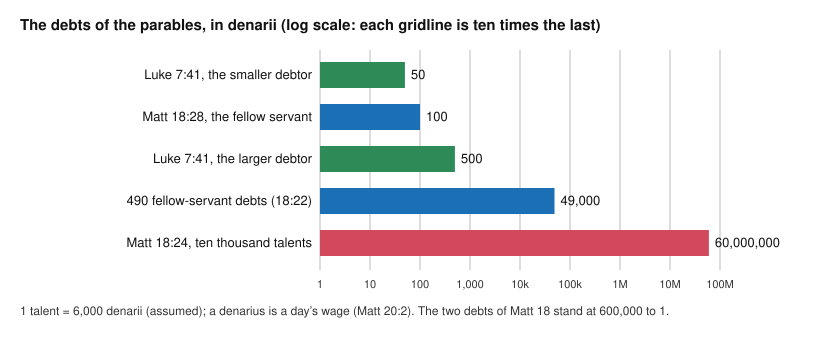

# Theology of Debt · Lesson 2.3: The parables of debt

> ⏱ ~15 min · Module 2: Debt and release in the New Testament · Builds on: [2.2 "Forgive us our debts"](02-02-forgive-us-our-debts.md), [2.1 "The acceptable year of the Lord"](02-01-the-acceptable-year-of-the-lord.md) · Unlocks: [2.4 The bond and the ransom](02-04-the-bond-and-the-ransom.md), [3.1 From burden to debt](03-01-from-burden-to-debt.md)

## Why this matters

[2.2](02-02-forgive-us-our-debts.md) gave you a prayer in the grammar of debt. Jesus also told stories in it, and each one uses the money literally before it means anything else: a sum you can compute, a bond you can rewrite, a prison you can be thrown into. Three parables carry the load. Matthew's unforgiving servant is the Catechism's own gloss on the fifth petition. Luke's two debtors hold the hardest single verse in the debt thread. Luke's unjust steward is the one place a gospel shows a debt bond being altered, and a respected reading says the alteration struck out usury.

## The idea

A parable about debt works like a scale model. The storyteller picks the numbers, so the numbers are the argument. In Matthew 18 the numbers are absurd on purpose: one debt no human being could repay against one a labourer could clear in a season. The point is that no debt anyone owes *you* can stand in the same measure as the one you have been let off.

Luke 7 runs the same scale model the other way. Two debtors, 500 and 50, both forgiven: which loves more? Simon answers correctly. Then Jesus says a sentence whose "because" can be read in two directions, and the whole theology of love and forgiveness hangs on which.

Luke 16 drops the scale model and gives you a real contract. A steward about to be fired rewrites his master's debtors' bonds downward, and is praised. Whether he cheated his master, gave up his own cut, or cancelled interest the Law forbade depends on facts the story does not state.

## Source

Matthew 18:24–34 (Douay–Rheims, Challoner), abridged:

> One was brought to him, that owed him ten thousand talents. And as he had not wherewith to pay it, his lord commanded that he should be sold, and his wife and children, and all that he had, and payment to be made. ... And the lord of that servant being moved with pity, let him go and forgave him the debt. But when that servant was gone out, he found one of his fellow-servants that owed him an hundred pence: and laying hold of him, he throttled him, saying: Pay what thou owest. ... Shouldst not thou then have had compassion also on thy fellow servant, even as I had compassion on thee? And his lord being angry, delivered him to the torturers until he paid all the debt.

Four things in the Greek. **"Forgave him the debt"** (18:27) is literally "released to him the *daneion*", *the loan*: the king treats a colossal embezzlement as a loan and writes it off with the Jubilee verb *aphiēmi* ([aphesis](../reference.md#aphesis), [2.1](02-01-the-acceptable-year-of-the-lord.md)). **The sale of wife and children** is the debt slavery Elisha's widow and Nehemiah's petitioners feared ([1.4](01-04-creditors-under-judgment.md); the Near Eastern practice is [`history-of-debt` 1.2](../../history-of-debt/lessons/01-02-debt-bondage-and-the-royal-clean-slate.md)). **"The torturers"** are *basanistai*, literally "torturers": the jailers of a debtors' prison. And **"until he paid all the debt"** (18:34) sets a condition that, at this size, cannot be met. The Challoner notes supply the conversion: a talent of 750 ounces of silver, a penny of one eighth of an ounce, which is 6,000 pence to the talent.

## The argument

**Matthew 18:21–35.**

1. Peter asks a counting question: forgive my brother "till seven times?" Jesus answers "till seventy times seven times" (18:21–22; the Greek *hebdomēkontakis hepta* can also mean seventy-seven, echoing Lamech's vengeance in Genesis 4:24). *In words:* stop counting.
2. The parable gives the reason by making the counting ridiculous. Take a talent as 6,000 denarii (the Attic convention, and the Challoner note's figure) and a denarius as a day's wage (Matthew 20:2). Then
$$\frac{10{,}000 \times 6{,}000}{100} = \frac{60{,}000{,}000}{100} = 600{,}000.$$
*In words:* the first debt is six hundred thousand times the second ([the Matthew 18 ratio](../reference.md#the-matthew-18-ratio)): some 200,000 years of labour at 300 working days a year, against about four months.
3. The fellow servant's plea repeats the first servant's almost word for word (18:26, 29). The creditor who refuses it has refused his own prayer.
4. The forgiveness is **revoked** (18:34), and the application is explicit: so will the Father do "if you forgive not every one his brother from your hearts" (18:35).
5. Therefore God's release of the great debt is received only by one who releases the small ones, and the release is of the **heart**, not a ledger entry.

**Luke 7:36–50.** A creditor (*danistēs*, the ordinary word for a moneylender) forgives two debtors of 500 and 50 denarii (7:41). Luke's verb is *echarisato*, "he graciously gave" (7:42): grace in the vocabulary of money. Simon rightly says the larger debtor will love more. Then 7:47:

> Wherefore, I say to thee: Many sins are forgiven her, because she hath loved much. But to whom less is forgiven, he loveth less.

Two readings of the *hoti* ("because"), both held by Catholic exegetes:

- **Love as cause.** Her love is why she is forgiven. The natural grammar of the first clause, and congenial to the teaching that contrition perfected by charity reconciles before the sacrament is received (Trent, Session XIV, ch. 4, which does not cite this verse).
- **Love as sign.** "I can say her sins are forgiven, *because* (as you see) she loves much": the love is the evidence. The parable in 7:41–43 runs this way, forgiveness first and love as its effect, and so does 7:47b, "to whom less is forgiven, he loveth less". And 7:50 credits her **faith**.

The Challoner note joins them: Scripture sometimes names one cause where several dispositions concur, so love, faith and sorrow all belong to a true conversion. See [Luke 7:47 love as cause or sign](../reference.md#luke-747-love-as-cause-or-sign).

**Luke 16:1–9.** An accused steward (*oikonomos*) tells one debtor to rewrite a bond of 100 baths of oil as 50 and another to rewrite 100 cors of wheat as 80. The Douay says "barrels" and "quarters"; the Greek has *batous* and *korous*, Hebrew liquid and dry measures. "The lord commended the unjust steward, forasmuch as he had done wisely" (16:8). Three readings of [the steward's reductions](../reference.md#the-unjust-stewards-reductions):

- **Shrewd fraud.** He cut his master's due to buy friends. The master (or Jesus) praises the foresight, not the fraud; "the unjust steward" (*ho oikonomos tēs adikias*) names him for what he is. This is the long-standing reading.
- **His own cut.** The bonds had a steward's markup built in, and he forwent it. That is M. D. Gibson's proposal (*Expository Times*, 1902–3), which later writers built on.
- **Hidden usury.** J. D. M. Derrett (1960–61), followed by Joseph Fitzmyer (*Theological Studies*, 1964), argues from Jewish law that agents wrote interest into commodity bonds so that no rate appeared, in evasion of the Torah's ban ([neshek and tarbit](../reference.md#neshek-and-tarbit), [1.1](01-01-lending-in-the-covenant.md)). On this reading the markup *was* the steward's profit, and in striking it out he renounced usury. The master could not claim what the Law forbade him, so he ratified the cut. Read that way, the implied markups are $50/50 = 100\%$ on oil and $20/80 = 25\%$ on wheat, figures Fitzmyer says should not be pressed.

Then Jesus draws the lesson in his own voice (16:9): "Make unto you friends of the mammon of iniquity: that when you shall fail, they may receive you into everlasting dwellings." Whatever the steward did, the command is to use money now to secure a future with God. The Challoner note reads it as almsgiving: the poor you have helped intercede for you. Alms as a deposit in heaven is [3.1](03-01-from-burden-to-debt.md)'s subject.

**Matthew 5:25–26.** Settle with your adversary on the way to court, or "thou shalt not go out from thence till thou repay the last farthing" (*kodrantēs*, the Roman *quadrans*). Cyprian already read the debtors' prison as post-mortem cleansing (Epistle 51 in the ANF numbering, §20; [`patristics` 2.4](../../patristics/lessons/02-04-cyprian-of-carthage.md)). That reception, and purgatory as doctrine, belong to [`creation-grace-last-things`](../../creation-grace-last-things/syllabus.md). Here it is only a debt image.

**Mark the levels.** That the Father's forgiveness cannot reach a heart that refuses to forgive is the Lord's own teaching (Matthew 6:14–15; 18:35). The Catechism reads Matthew 18 exactly so (CCC 2840, 2843), and it is authentic teaching of the Church, not one exegete's view. The parable's scenery has **no doctrinal weight**: the sale of a family, the torturers, the amounts. It neither endorses debt slavery nor teaches a doctrine of divine torment. The [levels](../reference.md#the-levels-in-this-course) of the Luke passages are lower. Whether 7:47's love is cause or sign is **freely disputed**; the Challoner note is a note in a Catholic Bible, not a magisterial act. The three readings of Luke 16 are **freely disputed** exegesis, and no Church act endorses Derrett's. The purgatorial reading of Matthew 5:26 is a patristic reception, and this lesson assigns it no level.

## The scale

Even Peter's "seventy times seven" offences, each as large as the fellow servant's debt, total $490 \times 100 = 49{,}000$ denarii, which is $49{,}000 / 60{,}000{,}000 \approx 0.08\%$ of what the king released. Luke's two debts differ only tenfold. Matthew's scale is not realism but theology.

## Worked examples

**Example 1: a clean case.** A homily says: "The parable teaches that God will forgive you only as much as you forgive others, debt for debt." Run it against the text. The measure is not proportion: the king released the whole debt before the servant had done anything (18:27), so forgiveness comes first and is not earned by forgiving. What 18:34–35 adds is that it can be **forfeited** by a heart that refuses to pass it on. CCC 2840 says the same: the mercy "cannot penetrate our hearts" while we refuse to forgive. So correct "only as much as" to "not at all, if we refuse", and correct "debt for debt" to "from the heart".

**Example 2: where the tools strain.** A student reads Luke 16 through Derrett and concludes: "Jesus praised a man for cancelling usury, so the Gospel condemns interest." Three problems. First, the usury reading is a reconstruction from rabbinic law, and the text never says the markup was interest (Fitzmyer himself has to argue that the rabbinic evidence reaches back to Jesus's day). Second, even granted, the praise is for acting "wisely" (*phronimōs*) in a crisis, and 16:9 generalizes to the use of wealth, not to lending terms. Third, the ban on interest in [usury](../reference.md#usury) doctrine rests on other texts (Exodus 22, Leviticus 25, Deuteronomy 23, Psalm 15 [DR 14]:5, Luke 6:35) and on argument (Module 4). The parable can illustrate the doctrine. It cannot carry it.

## Watch out

- **You might think the ten thousand talents are an exaggerated loan.** The king calls it a *daneion*, but no servant could borrow that much; it is an impossible sum by design. Treating it as a realistic loan loses the point of the ratio.
- **You might think 18:34 teaches that forgiveness is a loan you repay by forgiving.** The release was free (18:27). What 18:34 teaches is that it can be forfeited, not that it was bought.
- **Overstating a level.** "The Church teaches that the woman was forgiven because she loved" (or "only because she believed") promotes a freely disputed reading of Luke 7:47 to doctrine. **Understating** is also an error: calling the requirement to forgive from the heart "one reading of a parable" ignores the Lord's explicit application (18:35; Matthew 6:14–15) and the Catechism's teaching on it (CCC 2840, 2843).
- **You might think "the lord" of 16:8 must be Jesus.** Fitzmyer and many others take it as the master of the story; 16:9's "And I say to you" is where Jesus's own voice begins. Either reading is held, and neither makes Jesus praise fraud.

## One-liner

> The parables price the debt so you cannot miss the scale: released from six hundred thousand, you cannot throttle a man for one; and what the steward struck from the bond, whether his cut, his master's due or usury, the story leaves you to argue.

## Problems

**P1 (🟢)** *(Formal (a) · Exegetical (b).)* (a) Using 1 talent = 6,000 denarii and a denarius as a day's wage (Matthew 20:2), compute the ratio of the two debts in Matthew 18:24 and 18:28, and the number of years of labour the first represents at 300 working days a year. Show the arithmetic. (b) In two sentences: what does this ratio do to Peter's question in 18:21 ("till seven times?")? Name the verse where the parable turns the numbers into a rule.

**P2 (🟡)** *(Exegetical.)* Luke 16:5–8 (Douay–Rheims):

> Therefore, calling together every one of his lord's debtors, he said to the first: How much dost thou owe my lord? But he said: An hundred barrels of oil. And he said to him: Take thy bill and sit down quickly and write fifty. Then he said to another: And how much dost thou owe? Who said: An hundred quarters of wheat. He said to him: Take thy bill and write eighty. And the lord commended the unjust steward, forasmuch as he had done wisely: for the children of this world are wiser in their generation than the children of light.

(a) Which of the three readings (shrewd fraud, his own cut, hidden usury) does "the lord commended ... forasmuch as he had done wisely" support, and which words decide? (b) What would the hidden-usury reading need that this passage does not supply? **150 words or fewer in total.**

**P3 (🔴)** *(Exegetical.)* An invented case. A warehouse manager embezzled 80,000 dollars from his employer; when caught, he begged, and the owner wrote the loss off and kept him on. A month later the manager sues a coworker in small-claims court over a 300-dollar loan and has the coworker's wages garnished. The coworker's friends tell the owner. (a) Name three elements of Matthew 18:23–35 that map onto this case, and two that do not. (b) In one sentence, say what the parable, on its own terms, is judging, and so where it stops deciding this case. **100 words or fewer in total.**

Solutions

**P1** *(Formal (a) · Exegetical (b).)*

**Must hit, strict (a):** $10{,}000 \times 6{,}000 = 60{,}000{,}000$ denarii; $60{,}000{,}000 / 100 = 600{,}000$, so the ratio is 600,000 to 1. Years: $60{,}000{,}000 / 300 = 200{,}000$ years of labour. State the assumptions (the Attic talent of 6,000 drachmae with a drachma taken as a denarius; the Challoner note gives the same figure, 750 ounces at 8 pence to the ounce).

**Must hit, strict (b):** Counting offences becomes pointless: no number of small debts owed to you comes near the one you were released from (even 490 debts of 100 denarii are about 0.08% of it). The rule is 18:35 (or 18:33, "even as I had compassion on thee").

**Wrong turns:** dividing 10,000 by 100 and forgetting the conversion (answer 100 to 1). Reading (b) as "forgive exactly 490 times": 18:22 abolishes the count.

**Model answer:** (a) $10{,}000 \times 6{,}000 = 60{,}000{,}000$ denarii against 100: a ratio of $600{,}000 : 1$, or 200,000 years of labour at 300 days a year. (b) Peter wants a ceiling on forgiving, and the parable shows that any ceiling is absurd, since all the debts others could owe him are a rounding error beside what he has been released from. The rule comes in 18:33–35: forgive as you were forgiven, from the heart.

**P2** *(Exegetical.)*

**Must hit, strict (a):** The words fit **all three** readings. "Forasmuch as he had done wisely" (*phronimōs*) places the praise on his foresight, not on the justice of the reductions, and "unjust steward" can refer to the waste of 16:1–2. The passage by itself does not decide between the readings. An answer that says it supports only fraud has to explain the ratification; one that says it supports only usury is importing background.

**Must hit, strict (b):** It needs evidence from outside the text: that bonds were written in commodities with interest built in (Derrett's rabbinic evidence), and that such evidence applies to Jesus's time. Nothing in 16:5–7 mentions interest, a principal or a rate.

**Wrong turns:** taking "the lord" as certainly Jesus. Treating the 100% and 25% markups as data from the text; they are what the usury reading infers.

**Model answer:** "Commended ... forasmuch as he had done wisely" praises prudence, not honesty, so it fits all three readings: fraud praised for foresight, a cut forgone, or usury cancelled. "Unjust steward" does not settle it either, because it can label his earlier waste (16:1). The text tells us only that the bonds were rewritten at the steward's direction. The usury reading needs what the passage lacks: evidence that such bonds hid interest in the commodity amounts, and that the practice held in Jesus's day. Without that, 50 and 20 are simply reductions.

**P3** *(Exegetical.)*

**Must hit, strict (a):** Maps (any three): a large debt released by the superior after a plea; the forgiven man then pressing a far smaller debt against a peer; coercive collection (garnishment for throttling and prison); fellow servants reporting to the master. Does not map (any two): the ratio (about 267 to 1, not 600,000); the owner is not God, and the parable's king stands for the Father (18:35); a lawful court claim is not throttling; the story's revocation and torturers have no counterpart.

**Must hit, strict (b):** It judges the heart of one forgiven who will not forgive (18:35); it does not rule on whether a lawful small claim is itself unjust.

**Wrong turns:** treating the owner as God. Concluding that the parable forbids all lawsuits.

**Model answer:** (a) Maps: a huge debt forgiven on a plea; the forgiven man then exacting a small debt from a peer; peers reporting him. Doesn't map: the owner is not the Father of 18:35, and 80,000 to 300 is about 267 to 1, not 600,000 to 1. (b) The parable judges a heart that received mercy and refuses it to others; it does not say whether a lawful 300-dollar claim is unjust in itself.

## Flashback

**From Lesson [2.1](02-01-the-acceptable-year-of-the-lord.md) ("The acceptable year of the Lord": from Isaiah 61 to Nazareth):** *(Exegetical.)* An **invented** blog paragraph, written for this problem and not the words of any real person:

> "At Nazareth Jesus picked a prophecy about healing that has nothing to do with the old Jubilee laws; Isaiah never mentions them. And he announced a release to come at the end of history, as Daniel had calculated, not anything happening then. The Catechism settles the rest: Luke 4 is about who Jesus is, so anyone who reads debt relief into it contradicts Church teaching."

Name the error in each of its **three** claims and the text or fact that corrects it. **120 words or fewer.**

Solution

**Must hit, strict:** (1) **The Jubilee link.** Isaiah 61:1's Hebrew *deror* is the exact term of Leviticus 25:10, and the Septuagint renders the Jubilee and the Deuteronomy 15 remission with *aphesis*, the word Luke uses twice. (2) **The timing.** "This day is fulfilled this scripture in your ears" (Luke 4:21) declares the release fulfilled now, not postponed. Daniel 9's calendar stands behind the hope, but Luke's point is that its time has come. (3) **The level.** CCC 714 and 1286 teach *who* fulfils Isaiah 61 (authentic ordinary magisterium). They neither affirm nor exclude a social reading. Whether Luke 4 announces a social program is **freely disputed**, so calling that reading contrary to Church teaching overstates the level.

**Wrong turns:** correcting (3) by saying the Church *teaches* the social program, which overstates in the other direction (*Tertio Millennio Adveniente*'s debt call is a prudential proposal). Correcting (2) by denying any eschatological sense: the release is the last Jubilee, arrived.

**Model answer:** Isaiah 61 is Jubilee language: its *deror* is Leviticus 25:10's word, and Luke's *aphesis* is the Greek Bible's word for the Jubilee and the seventh-year release. The release is not deferred, because Jesus says "this day is fulfilled," so the last Jubilee is declared present. And the Catechism (714, 1286) teaches who the anointed one is. It does not rule on a social reading, which stays freely disputed, so no one contradicts Church teaching by holding it or by rejecting it.

## Connections

- **Backward:** [2.2](02-02-forgive-us-our-debts.md) gave the petition these parables illustrate; [2.1](02-01-the-acceptable-year-of-the-lord.md) gave *aphesis*, the release verb at work in 18:27 and 7:47. The debt slavery behind 18:25 is [1.4](01-04-creditors-under-judgment.md), and the interest ban the usury reading of Luke 16 presupposes is [1.1](01-01-lending-in-the-covenant.md). Matthew's and Luke's settings are [`new-testament` 2.2](../../new-testament/lessons/02-02-matthew.md) and [2.3](../../new-testament/lessons/02-03-luke.md).
- **Forward:** [2.4](02-04-the-bond-and-the-ransom.md) takes the written bond from Luke 16's "bill" to the *cheirographon* of Colossians 2:14. [3.1](03-01-from-burden-to-debt.md) explains why Jesus's hearers already heard sin as debt and alms as a deposit in heaven (Luke 16:9). The usury doctrine itself is Module 4.
- **Sideways:** in the debt thread, [`history-of-debt` 4.2](../../history-of-debt/lessons/04-02-debtors-prisons-and-the-invention-of-bankruptcy.md) is the institution Matthew 5:26 and 18:30 assume, the debtors' prison. [`philosophy-of-debt`](../../philosophy-of-debt/syllabus.md) asks whether forgiving debts creates moral hazard, the objection a creditor like the king would face. [`economics-of-debt`](../../economics-of-debt/syllabus.md) models the incentives of a creditor who forgives.
