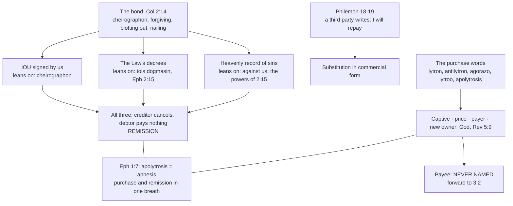

# Theology of Debt · Lesson 2.4: The bond and the ransom

> ⏱ ~15 min · Module 2: Debt and release in the New Testament · Builds on: [2.2 "Forgive us our debts"](02-02-forgive-us-our-debts.md), [2.3 The parables of debt](02-03-the-parables-of-debt.md), [`christology` 5.2 Ransom, Christus Victor, and sacrifice](../../christology/lessons/05-02-ransom-christus-victor-and-sacrifice.md) · Unlocks: [3.1 From burden to debt](03-01-from-burden-to-debt.md), [3.2 The Fathers: a ransom paid to whom?](03-02-the-fathers-alms-satisfaction-and-ransom.md)

## Why this matters

The gospels speak of debt in prayers and parables; the letters describe what the cross *did* in the language of the market. A bond is cancelled, a slave is bought, a price is paid. Every later theology of sin as debt, from the Fathers to Anselm and the treasury, builds on these verses, so you need to know exactly what each word asserts and where each one goes silent. `christology` 5.2 read *lytron* as a theory of the atonement. This lesson reads the same vocabulary as what it first was, the paperwork of creditors and slave owners.

## The idea

Two commercial documents stand behind the texts. The first is a **note of hand**: a debtor writes, in his own hand, "I owe you so much, and I will repay." The second is a **bill of sale**: someone pays money, and a person held by another passes out of that power.

The first picture is about *cancellation*. The creditor tears up the note and nobody pays. The second is about *purchase*: somebody pays. The New Testament uses both, and it never lets them merge into one tidy invoice. Keep them apart and most mistakes about this material disappear.

## Source

Colossians 2:13–14 (Douay–Rheims):

> And you, when you were dead in your sins and the uncircumcision of your flesh, he hath quickened together with him, forgiving you all offences: Blotting out the handwriting of the decree that was against us, which was contrary to us. And he hath taken the same out of the way, fastening it to the cross.

Philemon 18–19 (Douay–Rheims), Paul writing to the master of a runaway slave:

> And if he hath wronged thee in any thing or is in thy debt, put that to my account. I Paul have written it with my own hand: I will repay it ...

Read Colossians word by word (the glosses are the lesson's own):

- **"forgiving"**: *charisamenos*, "granting as a favour". It is the verb of Luke 7:42, where the creditor "forgave them both" two money debts ([2.3](02-03-the-parables-of-debt.md)).
- **"blotting out"**: *exaleipsas*, "wiping clean", the word for erasing writing.
- **"handwriting"**: [*cheirographon*](../reference.md#cheirographon), literally a "hand-written thing". In the papyri it is the technical term for a note of hand.
- **"of the decree"**: *tois dogmasin*, a dative plural, "with (or by) the decrees". The grammar of this phrase is the crux.
- **"fastening it to the cross"**: *prosēlōsas*, "nailing".

Now Philemon. "Put that to my account" is *elloga*, the bookkeeper's verb that Romans 5:13 uses when sin "was not imputed". "Written with my own hand" is exactly what a *cheirographon* is. And "I will repay" is *apotisō*. Adolf Deissmann, in *Light from the Ancient East* (English 1910), showed from the papyri that the stock formula of a note of hand was "I will repay". He noted that the usual verb was *apodōsō* and that Paul's *apotisō* is the stronger one. Paul writes Onesimus's creditor a bond in the proper legal form. It shows how the *cheirographon*'s own world used handwritten bonds.

## The argument

1. **Three readings of the bond.**
   - **A certificate of debt.** It is *our* IOU, signed by us, and it acknowledges what we owe God. This reading leans on *cheirographon* itself and on "against us". Deissmann added that cancelled papyrus bonds were often crossed through with a large X, the letter *chi*. He was careful to say this does not explain the nailing.
   - **The Law's decrees.** The bond *is* the Mosaic ordinances, or our obligation under them. This reading leans on *tois dogmasin*, on Ephesians 2:15 ("the law of commandments contained in decrees", the same word), and on Colossians 2:16, which turns at once to meats and sabbaths.
   - **A heavenly record of sins.** A ledger kept in heaven, like the manuscript an accusing angel unrolls in the *Apocalypse of Zephaniah*, where the seer finds his own sins written down. This reading leans on "against us, which was contrary to us" and on 2:15's hostile "principalities and powers".

   *In words:* the text shows a written obligation against us, wiped clean and nailed up. What the obligation is remains open.
2. **Every reading keeps one structure.** The creditor, God, acts. The debtor does nothing and pays nothing. The instrument of debt is destroyed "at the cross". *Charisamenos* is a free grant, so Colossians is a **remission** text and not a **payment** text. *In words:* in Colossians nobody pays; the note is torn up.
3. **Philemon supplies what Colossians lacks: a third party who pays.** Paul takes Onesimus's debt onto his own account in proper legal form. Then he adds that Philemon owes Paul "thy own self also". The debts are netted, and the one who pays is himself owed. *In words:* substitution for a debt was an ordinary commercial act, and Paul performs one.
4. **Debt against grace (Romans 4:4).** A wage is "reckoned ... not according to grace but according to debt" (*kata opheilēma*). Justification is not a wage, so God is not in the believer's debt. Trent keeps both sides. Eternal life is "a grace mercifully promised" and also a reward, because God wills that "His own gifts be their merits" (Session VI, ch. 16; canon 32). *In words:* if God owes anything, he owes it only because he promised, never because we earned it on our own.
5. **The one debt that stays open (Romans 13:7–8).** "Render ... to all men their dues" (*opheilas*), then "Owe no man any thing, but to love one another". *In words:* pay every debt you owe, and carry one debt you can never pay off.
6. **The purchase words.** The letters use five of them:
   - [*lytron*](../reference.md#lytron-and-redemption-words), the price of release (Mark 10:45; read in `christology` 5.2);
   - *antilytron* (1 Timothy 2:6), "a redemption for all", with *anti* sharpening the idea of exchange;
   - *agorazō*, "to buy in the market" (1 Corinthians 6:20 and 7:23, "bought with a price"), and *exagorazō*, "to buy out" (Galatians 3:13, "redeemed us from the curse of the law", and 4:5);
   - *lytroō* (1 Peter 1:18);
   - *apolytrōsis* joined to [*aphesis*](../reference.md#aphesis) in Ephesians 1:7, "redemption ... the remission of sins", where the Greek has "trespasses". Colossians 1:14 has the same pair, and Trent quotes it (Session VI, ch. 3).

   *In words:* Ephesians 1:7 puts the purchase picture and the release picture in one breath.
7. **Sacral manumission: Deissmann's case and its critics.** At Delphi, Deissmann showed, a slave paid his savings into the temple. The owner then "sold" him to Apollo and received that money, and the slave went free as the god's protégé. The inscriptions use "for a price" and "for freedom". Paul writes "bought with a price" and "for freedom" (Galatians 5:1, 13), and Deissmann read this as deliberate allusion. His critics, put at their strongest, make three points. At Delphi the slave pays his own price, while in Paul he has nothing and another pays. The Delphic purchase verbs are not *agorazō*; Deissmann himself had to find that verb in other slave sales. And Paul's freed man becomes "the bondman of Christ" (1 Corinthians 7:22), not a free protégé. Many prefer the Old Testament background: God "redeeming" Israel from Egypt, and the [*go'el*](../reference.md#goel) who buys back a kinsman. *In words:* the market vocabulary is certain; a particular Greek rite behind it is a hypothesis.
8. **The question the texts never ask.** Across all these verses, a purchase has a captive, a price, a payer and a new owner. Revelation 5:9 says "redeemed us *to God*", and there God is the new owner. No verse names a **payee**. *In words:* the market image is pressed exactly as far as it serves, and stops before "to whom?". The Fathers asked that question anyway ([3.2](03-02-the-fathers-alms-satisfaction-and-ransom.md)).

**Mark the levels** ([the levels in this course](../reference.md#the-levels-in-this-course); [ladder](../../fundamental-theology/lessons/04-04-the-ladder-of-doctrinal-authority.md)). That Christ **redeemed** us by his death is **of faith** (*de fide*). The Creed confesses it ("for us"). Trent teaches it (Session VI, chs. 2–3, 7), and so does the Catechism's reading of the ransom texts: the ransom that frees from the slavery of sin (CCC 601–602), for all without exception (CCC 605), and the redemption as a ransom given in love "to the end" (CCC 622). That the justified truly merit eternal life is **defined** (VI can. 32, with anathema). That this merit rests on God's promise and gifts, not on strict debt, is Trent's own teaching in ch. 16. What the *cheirographon* is, whether Delphi stands behind Paul, and how to apply Romans 13:8 to borrowing are **freely disputed**, or plain scholarship with no doctrinal weight at all. **No magisterial act names a payee.** A preacher who says the devil was paid, or the Father, is stating a theologoumenon, not doctrine. Calling either one heresy overstates the case as well.

## Map of positions

## Worked examples

**Example 1: a clean case, 1 Peter 1:18–19.** "You were not redeemed with corruptible things, as gold or silver ... But with the precious blood of Christ, as of a lamb unspotted and undefiled." Sort the words:

- **Market words:** "redeemed" (*elytrōthēte*), "gold or silver", and "precious" (*timios*, from the same root as *timē*, "price").
- **Cult words:** "lamb", "unspotted".
- **What the market words do:** they keep the transaction and change the currency. A price was paid, but not in any coin a creditor could bank.
- **What is named:** release *from* "your vain conversation of the tradition of your fathers". No payee is named.

The Catechism quotes it as a summary of the apostolic faith (CCC 602) and goes no further than the text.

**Example 2: a hard case, putting Philemon over Colossians.** A tidy synthesis: "Like Paul for Onesimus, Christ wrote 'I will repay' and paid our bond to the Father." Test it against the sources:

- **Colossians says the creditor *cancels*.** *Charisamenos* is a free grant. In a papyrus bond, a note torn up is not a note paid.
- **Philemon is about two humans.** Paul pays a third party, Philemon, whom he then reminds of his own debt to Paul.
- **Fused, the picture has God paying God.** That strain is exactly what Anselm had to face: only God *can* pay, and only man *ought* to ([3.3](03-03-anselm-cur-deus-homo.md)).

The synthesis is not heresy: satisfaction "unto God the Father" is Trent's language (Session VI, ch. 7). But neither text says it. The debt images are true one at a time, never drawn as one transaction.

## Watch out

- **You might think "ransom" implies the Father was paid.** No text says so. Revelation 5:9's "to God" names the new *owner*, not the payee. **Overstating** the payee theory into doctrine, whether the devil or the Father, is an error, and so is calling it heresy ([3.2](03-02-the-fathers-alms-satisfaction-and-ransom.md) sorts the Fathers' answers).
- **You might think redemption is "just one metaphor", and optional.** Which picture best explains it is open. **That** Christ redeemed us is of faith. Treating the fact as a disposable image **understates** its level.
- **You might think Romans 13:8 forbids borrowing.** Verse 7 commands paying what you owe. The verse condemns debts left unpaid, not the act of taking on a loan.
- **You might think Deissmann settled the background.** His papyri settle the *vocabulary*: bonds, "I will repay", "bought with a price". The Delphic rite is a contested hypothesis.

## One-liner

> Colossians tears up our bond and Philemon shows a third party paying one. The purchase words give a captive, a price and a new owner, and the New Testament never says who received the money.

## Problems

**P1 (🟢)** *(Exegetical)* Match each Greek word to its meaning **and** to one verse where it occurs. Words: (1) *lytron*, (2) *agorazō*, (3) *aphesis*, (4) *cheirographon*, (5) *antilytron*. Meanings: (a) release, remission of a debt; (b) a price paid for release; (c) a handwritten note acknowledging a debt; (d) to buy, as in the market; (e) a ransom given in exchange. Verses: Mark 10:45; 1 Corinthians 6:20; Ephesians 1:7; Colossians 2:14; 1 Timothy 2:6. Then, in **one sentence**, say which two of the five words Ephesians 1:7 joins and what the pairing teaches.

**P2 (🟡)** *(Exegetical)* Romans 13:7–8 (Douay–Rheims):

> Render therefore to all men their dues. Tribute, to whom tribute is due: custom, to whom custom: fear, to whom fear: honour, to whom honour. Owe no man any thing, but to love one another. For he that loveth his neighbour hath fulfilled the law.

"Dues" renders *opheilas*, "debts"; "owe" renders *opheilete*. (a) Which words are debt words, and how does verse 7 widen what counts as a debt? (b) A reader takes verse 8 to forbid Christians ever to borrow. Which words in the passage tell against that reading, and what does the passage command instead? (c) What is odd about love as a debt, compared with every item in verse 7? **Two sentences per part.**

**P3 (🔴)** *(Exegetical)* An **invented** homily paragraph, written for this problem and not the words of any real preacher:

> Scripture is plain about the price of our salvation. We had sold ourselves to Satan, so Christ paid Satan what we owed. That is why Colossians says our bond was nailed to the cross: the devil's receipt was hung up for all to see. Others say the ransom was paid to the Father, and Revelation 5:9 proves it: Christ "redeemed us to God". Either way, the Church has defined that a price was handed over to someone.

(a) Name the **two** claims the paragraph attributes to Scripture that Scripture does not make, and give the text that shows each is missing. (b) What does the paragraph do to the *cheirographon* that none of the three readings does? (c) Correct the last sentence so that it marks the levels accurately. **Two sentences per part.**

Solutions

**P1** *(Exegetical)*

**Must hit, strict:** (1) *lytron*: (b), Mark 10:45. (2) *agorazō*: (d), 1 Corinthians 6:20. (3) *aphesis*: (a), Ephesians 1:7. (4) *cheirographon*: (c), Colossians 2:14. (5) *antilytron*: (e), 1 Timothy 2:6. Ephesians 1:7 joins **apolytrōsis** (redemption, the *lytron* family) with **aphesis** (remission). It teaches that the purchase picture and the release picture describe one reality: to be redeemed "through his blood" *is* to have one's trespasses remitted.

**Wrong turns:** matching *aphesis* to "a price paid". It is the release word from the Jubilee and the Lord's Prayer ([2.2](02-02-forgive-us-our-debts.md)), and it names no price. Saying Ephesians 1:7 joins *lytron* itself. The word there is the compound *apolytrōsis*, and full credit goes to naming the family.

**Model answer:** 1-b-Mark 10:45; 2-d-1 Cor 6:20; 3-a-Eph 1:7; 4-c-Col 2:14; 5-e-1 Tim 2:6. Ephesians 1:7 puts *apolytrōsis* beside *aphesis*, so being bought free and having one's debts remitted are two descriptions of one gift, received "through his blood".

**P2** *(Exegetical)*

**Must hit, strict (a):** the debt words are "dues" (*opheilas*) and "owe" (*opheilete*), with "due" in verse 7. Verse 7 puts tribute and custom (money) in the same list as fear and honour (non-monetary), so a "debt" is **anything justly owed** to someone.

**Must hit, strict (b):** "Render ... to all men their dues" and "except to love one another" (the "but"). The passage commands **paying** what one owes, leaving no debt outstanding, which presupposes that debts exist. It does not forbid contracting them.

**Must hit, strict (c):** every item in verse 7 can be **discharged**: pay the tax and you owe no more. Love is the one debt that **stays owed** after every payment, and paying it *fulfils the law* (verse 8b).

**Wrong turns:** reading verse 8 as a ban on borrowing and ignoring verse 7's command to render dues. Treating "fear" and "honour" as metaphors outside the debt list, when the grammar makes them further *opheilas*. In (c), saying love is owed only to fellow Christians. "One another" and "his neighbour" do not stop there.

**Model answer:** (a) "Dues", "due" and "owe" are debt words, and verse 7 counts honour and fear as debts alongside tax and customs. So a debt is whatever is justly owed, not only money. (b) Verse 7 commands rendering every due and verse 8 excepts love, so the passage is about leaving no debt unpaid, not about never incurring one. What it commands is settling all accounts and keeping one account open. (c) Every other debt ends when it is paid, but love is still owed after it is paid. Paying it does not close the account; it fulfils the law.

**P3** *(Exegetical)*

**Must hit, strict (a):** (1) **That Christ paid Satan.** No New Testament text names the devil as payee. Colossians 2:15 has Christ *despoiling and triumphing over* the powers, not paying them. (2) **That Revelation 5:9 names the Father as payee.** "Redeemed us to God" names God as the new **owner** of the redeemed, the one they now belong to, not the one who received the price. More broadly, no verse anywhere names a payee (1 Peter 1:18–19 names the price and the "from", never the "to").

**Must hit, strict (b):** it turns the bond into the **devil's receipt**, a record of a payment made. All three readings (our IOU, the Law's decrees, a heavenly record of sins) make it the **instrument of debt against us**, which God *wipes out* (*exaleipsas*) and *forgives* (*charisamenos*). It is a remission, with no payment at all.

**Must hit, strict (c):** what is **of faith** is **that Christ redeemed us** by his death (the Creed; Trent VI chs. 2–3, 7). **To whom** any price went is **not defined**, and the payee theories are theologoumena, neither doctrine nor heresy.

**Wrong turns:** calling the devil-payee view heresy. Orthodox Fathers held it, and it was dropped, not condemned ([3.2](03-02-the-fathers-alms-satisfaction-and-ransom.md)). Fixing the paragraph by declaring the Father the payee "as the Church teaches", which moves the error rather than removing it. In (b), accepting "receipt" because Deissmann's papyri include receipts. The *cheirographon* is a note of *debt*, written by the one who owes.

**Model answer:** (a) Scripture never says Christ paid Satan; Colossians 2:15 has him despoil and triumph over the powers. Revelation 5:9's "to God" makes God the owner the redeemed now belong to, not the recipient of a price, and no verse anywhere names one. (b) The paragraph makes the bond a receipt for a payment, while every reading makes it a record of debt against us that God erases and forgives without payment. (c) It is of faith that Christ redeemed us by his death. To whom, if anyone, a price was paid is left undefined, a matter of theological opinion.

## Flashback

**From Lesson [2.2](02-02-forgive-us-our-debts.md) ("Forgive us our debts"):** *(Exegetical.)* Sirach 28:2–5 (Douay–Rheims, where the book is Ecclesiasticus):

> Forgive thy neighbour if he hath hurt thee: and then shall thy sins be forgiven to thee when thou prayest. Man to man reserveth anger, and doth he seek remedy of God? He hath no mercy on a man like himself, and doth he entreat for his own sins? He that is but flesh, nourisheth anger, and doth he ask forgiveness of God? who shall obtain pardon for his sins?

(a) Of the three links 2.2 distinguished in the Lord's Prayer (a **measure**, a **condition**, a **price**), which does verse 2 state, and which words decide? (b) What do the questions of verses 3–5 add, and do they turn forgiving into a price? (c) Name one thing Matthew 6:12 has that this passage lacks. **Two sentences per part.**

Solution

**Must hit, strict:** **(a)** A **condition**, with a sequence: "Forgive ... and then shall thy sins be forgiven". It is the same shape as Matthew 6:14–15's "if". **(b)** They argue from **incoherence**: someone who keeps anger against "a man like himself" cannot consistently ask God for mercy. That places the requirement in the state of the one praying, as CCC 2840 does (a heart closed by refusing to forgive), not in a payment. No word of price or purchase appears. Pardon is still sought, entreated and obtained from God. **(c)** The **debt vocabulary**. Matthew's *opheilēmata* and *aphiēmi* are Deuteronomy 15's release words, so the one praying is a debtor and a creditor at the same moment. Sirach speaks of anger and hurt, not of debts. (Also accept Matthew's "as", a measure, which Sirach lacks.)

**Wrong turns:** reading "and then" as making forgiveness sufficient, or as purchasing pardon. It states a necessary prior condition, as Cyprian's "cannot be obtained unless" does. Saying the passage is "only about anger" and has no bearing on the petition: the logic of the condition is identical.

**Model answer:** (a) Verse 2 states a condition: forgive, "and then" your sins will be forgiven when you pray. (b) The questions show that asking God for mercy while refusing it to an equal contradicts itself, so the refusal closes the one praying to pardon. Nothing is paid, and pardon stays God's to give. (c) Matthew puts the condition in the language of debt and release from Deuteronomy 15, so the one who prays stands as both debtor and creditor. Sirach keeps to anger and offence.

## Connections

- **Backward:** [2.2](02-02-forgive-us-our-debts.md) gave *opheilēma* and *aphesis* in the Lord's Prayer. [2.3](02-03-the-parables-of-debt.md) gave *charizomai* in the two debtors (Luke 7:42), the same verb as Colossians 2:13. [1.3](01-03-the-jubilee-the-land-is-mine.md) gave the *go'el*, the Old Testament redeemer behind "buying back".
- **Forward:** [3.1](03-01-from-burden-to-debt.md) asks how sin became a debt in the first place. [3.2](03-02-the-fathers-alms-satisfaction-and-ransom.md) takes up the question these texts never ask: paid to whom? [3.3](03-03-anselm-cur-deus-homo.md) inherits the strain of Example 2, God paying God. Colossians' authorship stays in [`new-testament` 6.1](../../new-testament/lessons/06-01-the-disputed-pauline-letters-and-the-pastorals.md). Romans 4 as justification stays in [`new-testament` 5.2](../../new-testament/lessons/05-02-romans-1-4-the-righteousness-of-god.md).
- **Sideways:** [`christology` 5.2](../../christology/lessons/05-02-ransom-christus-victor-and-sacrifice.md) reads *lytron* as a model of the atonement. [`history-of-debt` 1.2](../../history-of-debt/lessons/01-02-debt-bondage-and-the-royal-clean-slate.md) and [1.5](../../history-of-debt/lessons/01-05-nexum-and-the-roman-plebs.md) show the debt bondage that made "ransom" and "remission" one family of ideas. [`philosophy-of-debt`](../../philosophy-of-debt/syllabus.md) asks what a promise to repay, the "I will repay" of Philemon 19, obliges.
