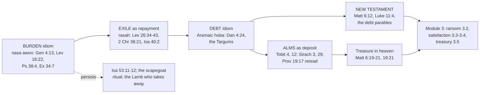

# Theology of Debt · Lesson 3.1: From burden to debt: the Second Temple shift

> ⏱ ~15 min · Module 3: Sin as debt · Builds on: [1.1 Lending in the covenant](01-01-lending-in-the-covenant.md), [2.2 "Forgive us our debts"](02-02-forgive-us-our-debts.md), [2.3 The parables of debt](02-03-the-parables-of-debt.md) · Unlocks: [3.2 The Fathers: alms, satisfaction and a ransom paid to whom?](03-02-the-fathers-alms-satisfaction-and-ransom.md)

## Why this matters

Module 2 read the Gospels' debt language. But why did Jesus's hearers find it natural to call a sin a debt at all? The oldest parts of the Hebrew Bible mostly speak of sin as a load you *carry*. Gary Anderson's *Sin: A History* (2009) argues that in the Second Temple period the dominant picture changed from burden to debt, and that the change had consequences. Once sin is a debt, it can be *paid down*, and almsgiving becomes a deposit in heaven. Everything in this module (ransom, satisfaction, the treasury of the Church) runs on that second picture. This lesson states the thesis, tests it, and marks what in it binds.

## The idea

Each metaphor invites different actions. If sin is a **weight**, the questions are who carries it and who can take it off you. The scapegoat carries Israel's iniquities into the desert, and God "takes away" iniquity by lifting it. If sin is a **debt**, the questions change: how much is owed, can it be paid in installments, can someone else pay it, and can the debtor build up credit against it?

Anderson's claim, [the Anderson thesis](../reference.md#the-anderson-thesis), has three steps:

1. **Burden first.** In earlier Hebrew the standard idiom is *nasa' 'awon*, "to bear iniquity". The sinner bears it as guilt and punishment; God bears it *away* in forgiving.
2. **Debt later.** In the Aramaic spoken after the exile, the ordinary word for sin became [*ḥôbāʾ*](../reference.md#hoba), a commercial word for **debt**. The Targums, the Aramaic paraphrases of Scripture read in the synagogues, often render Hebrew words for sin with it. Matthew's "debts" (*opheilēmata*, 6:12) is how that idiom sounds in Greek ([`new-testament` 2.2](../../new-testament/lessons/02-02-matthew.md) notes the same background).
3. **Consequences.** A debt can be repaid. So the exile is pictured as a term of repayment, and charity becomes a way of storing credit with God: [almsgiving as deposit](../reference.md#almsgiving-as-deposit).

## Source

Three texts that speak from or about the exile, in the Douay-Rheims (Challoner):

> Then shall the land enjoy her sabbaths all the days of her desolation. (Leviticus 26:34)
>
> ... that the word of the Lord by the mouth of Jeremias might be fulfilled, and the land might keep her sabbaths: for all the days of the desolation she kept a sabbath, till the seventy years were expired. (2 Paralipomenon [2 Chronicles] 36:21)
>
> Speak ye to the heart of Jerusalem, and call to her: for her evil is come to an end, her iniquity is forgiven: she hath received of the hand of the Lord double for all her sins. (Isaiah 40:2)

The Douay follows the Vulgate, and the Vulgate hides the word Anderson's argument turns on. Hebrew uses one verb, *rāṣāh*, in all three places. In Leviticus 26:34 the land *tirṣeh* its sabbaths, and the verb returns in 26:43. In 26:41 the exiles *yirṣû* their iniquity, which the Douay renders "pray for their sins". In 2 Chronicles 36:21 the land *rāṣtāh* its sabbaths. In Isaiah 40:2 Jerusalem's iniquity *nirṣāh*, which the Douay renders "is forgiven". The common meaning of the root is "to be pleased with, accept". The standard lexicons also list a second sense, "to pay off, make good (a debt)". Read that way (lesson's gloss), the land *makes up* the sabbath years Israel failed to keep, the exiles *pay off* their iniquity, and Jerusalem's iniquity *has been paid*. The exile is then a repayment schedule, with seventy years as its term. The land is repaid the fallow years it was owed ([1.3](01-03-the-jubilee-the-land-is-mine.md)), and "double" reads naturally as payment in full, or more.

## The argument

1. **The burden idiom is early and pervasive.** The scapegoat carries all their iniquities into the desert (Leviticus 16:22). Cain's cry (Genesis 4:13) is literally "my iniquity is too great to bear". The Douay's "greater than that I may deserve pardon" follows the Vulgate, which took *nasa'* in its other sense, "lift, forgive". The psalmist's iniquities weigh on him as a heavy burden (Psalm 38:4 [DR 37:5]). God is the one who takes away iniquity (Exodus 34:7).
2. **Around the exile, a repayment vocabulary appears.** This is *rāṣāh* in its second sense in Leviticus 26, 2 Chronicles 36 and Isaiah 40 (Source).
3. **In Second Temple Aramaic, *ḥôbāʾ* makes debt the default word for sin.** Daniel's advice to Nebuchadnezzar (Daniel 4:24 [Aramaic and DR 4:24; many English Bibles 4:27]) uses a verb that can mean "redeem" or "break off", and a noun, *ṣidqāh*, that shifts in late Aramaic and Hebrew from "righteousness" to "almsgiving". The Vulgate chose "redeem" and "alms".
4. **If sin is a debt, charity can count as credit.** In Tobit the angel says "alms delivereth from death, and the same is that which purgeth away sins" (Tobit 12:9). Tobit's father tells his son that alms store up a good reward against the day of necessity (4:10 DR). Sirach says alms resist sins as water quenches fire (3:30 [DR 3:33]), and tells the reader to lay up treasure in the commandments and to lock alms away in the heart of the poor, where they will fight for him (29:11–13 [DR 29:14–17]). Proverbs 19:17 had already made mercy to the poor a loan to the Lord, who repays ([1.1](01-01-lending-in-the-covenant.md)).
5. **The New Testament inherits the idiom.** Matthew 6:12 has "debts". Luke 11:4 has "sins", but then "every one that is indebted to us" ([2.2](02-02-forgive-us-our-debts.md)). The debt parables follow ([2.3](02-03-the-parables-of-debt.md)). And Jesus speaks of treasure in heaven, laid up where no thief breaks in (Matthew 6:19–21), gained by giving to the poor (19:21).

*In words:* the change of image is also a change of practice. A burden can only be lifted. A debt can be paid, by the debtor, by a surety, or by a store of credit.

**Testing it.** Take the thesis at the strength Anderson would recognize: it claims a shift in the **dominant** idiom, not the death of the older one. Three criticisms are still fair. First, the two images **coexist**. Isaiah 53:11–12, from the same section of Isaiah (chapters 40–55, commonly dated to the exile) as Isaiah 40:2, has the servant bear the iniquities of many, which is pure burden, and the Day of Atonement kept its scapegoat. Second, much of the **Aramaic evidence is late**. The Targums reached their final form centuries after Christ, so they show where the idiom ended up more securely than when it began. Third, a word is not a live metaphor. Speakers who said *ḥôbāʾ* for "sin" need not have pictured a ledger each time. This is James Barr's warning against reading theology off vocabulary. The thesis survives best as a claim about what the idiom **made available**: once "debt" was the normal word, repayment, credit and surety were ready to hand.

**The other readings.** Jewish tradition kept the almsgiving strand in its own canon. Proverbs 10:2, where *ṣedāqāh* (DR "justice") delivers from death, is read of charity in the Talmud (Bava Batra 10a). The Lutheran confessions read Daniel 4:24 differently. The Apology of the Augsburg Confession (Art. III in the *Triglot*) says "redeem thy sins" means *repent*: the "righteousness" in the verse is faith, and sins are redeemed when God removes their guilt for those who believe his promise, not on account of the alms. Luther's Bible, for its part, placed Tobit and Sirach among the Apocrypha.

**Mark the levels** ([the levels in this course](../reference.md#the-levels-in-this-course); rungs from [`fundamental-theology` 4.4](../../fundamental-theology/lessons/04-04-the-ladder-of-doctrinal-authority.md)).
- **Anderson's thesis** is a historical and philological claim, and it is freely disputed. No magisterial act touches it, and a Catholic may reject all three of its steps.
- **Sin as debt** is not itself a doctrine at any rung. The Church prays it daily in the Our Father, but it defines no metaphor as *the* account of sin, and the burden idiom (the Lamb who *takes away* the sin of the world) stands in its liturgy beside it.
- **Tobit and Sirach are sacred and canonical.** This is defined (rung 1): Trent, Session IV lists both books with an anathema ([`fundamental-theology` 3.3](../../fundamental-theology/lessons/03-03-the-canon-as-defined.md)). So "alms purge sins" is Scripture's teaching. How it is to be understood is a question of interpretation.
- **Almsgiving and satisfaction.** Trent, Session XIV, canon 13 anathematizes anyone who denies that satisfaction for sins, *as to their temporal punishment*, is made to God *through the merits of Jesus Christ* by works freely undertaken, among them "almsdeeds". That is defined (rung 1), and its scope is exact: temporal punishment, not guilt, and through Christ's merits, not apart from them ([3.6](03-06-luther-trent-and-the-reform-of-indulgences.md) reads the session). CCC 1434, at the authentic ordinary level, names fasting, prayer and almsgiving as the three forms of penance Scripture and the Fathers stress, and lists charity among the means of obtaining forgiveness.

## Map of the shift

The solid line is the thesis. The dashed line is its best objection, since the older idiom never disappears.

## Worked examples

**Example 1: a clean case, Matthew 19:21.** Jesus tells the rich young man to sell what he has and give to the poor, and he will have treasure in heaven. Run the thesis. The young man's wealth is transferred, not destroyed. Given to the poor, it reappears as a balance with God: Sirach's treasure, Tobit's reward. Without the deposit picture the saying only commands loss; with it, the money moves to a safer bank. The thesis explains *why* giving to the poor is described as *having* something. What it does not do is reduce discipleship to a transaction: the verse ends with the call to follow him, and the treasure is a consequence of following Jesus, not its price.

**Example 2: a hard case, "alms purge sins" (Tobit 12:9).** Read flatly, the verse sounds like buying forgiveness, and this is exactly the reading the Apology attacks. Here the thesis strains, because it explains the *image* but cannot settle what the image *means*. Three distinctions keep a Catholic reading exact. **First,** guilt and punishment. Trent's canon 13 defines that almsgiving makes satisfaction as to *temporal punishment* ([temporal punishment](../reference.md#temporal-punishment), taken up in 3.4). The forgiveness of guilt is by grace ([3.4](03-04-aquinas-satisfaction-and-the-debt-of-punishment.md)). **Second,** the source of the payment. Canon 13's "through the merits of Jesus Christ" makes alms a share in someone else's credit, not a private reserve. **Third,** the heart. Tobit's own chapter joins alms to prayer, fasting and justice (12:8), and CCC 1434 treats almsgiving as one form of *interior* penance. So the debt image is kept, but it is placed inside grace. The Lutheran reading places the same verse inside faith and the promise. The disagreement between them is real, and it is not a disagreement about the Aramaic.

## Watch out

- **You might think the Church invented "sin as debt" to sell indulgences.** The idiom is in Daniel, Tobit, Sirach and the Our Father, centuries before any indulgence existed. (The indulgence abuses were real, and Trent condemned them; see 3.6.)
- **You might think Anderson's thesis is Church teaching because Catholic writers use it.** It is a scholar's historical thesis and is freely disputed. Citing it as doctrine overstates its level.
- **You might understate the other way** and call "alms make satisfaction" a pious opinion. For temporal punishment, through Christ's merits, it is defined (Trent XIV, canon 13), and Tobit's canonicity is defined too.
- **You might read the Douay's "is forgiven" (Isaiah 40:2) or "pray for their sins" (Leviticus 26:41) as the evidence.** The Vulgate's choices hide *rāṣāh*. Quote the English, but reason from the Hebrew.

## One-liner

> After the exile, sin stopped being only a load to be lifted and became a debt to be paid, and once sin could be paid, alms could be banked.

## Problems

**P1 (🟢)** *(Exegetical.)* Daniel 4:24 (DR; Aramaic 4:24, many English Bibles 4:27):

> Wherefore, O king, let my counsel be acceptable to thee, and redeem thou thy sins with alms, and thy iniquities with works of mercy to the poor: perhaps he will forgive thy offences.

The Aramaic verb behind "redeem" is *peruq* ("break off" or "redeem, release"), and the noun behind "alms" is *ṣidqāh* ("righteousness", later "almsgiving"). (a) Give the two renderings of the clause the two words allow, say which the Douay prints, and say which of the two words the Apology of the Augsburg Confession's reading chiefly turns on. (b) Which pair supports step 3 of the Anderson thesis, and why? (c) Which word in the verse shows the prophet does *not* treat the alms as automatically cancelling the debt? **Two sentences per part.**

**P2 (🟡)** *(Exegetical (a) · Evaluative (b).)* Isaiah 53:12 (DR): "he hath delivered his soul unto death, and was reputed with the wicked: and he hath borne the sins of many, and hath prayed for the transgressors." (a) Which image of sin does "hath borne the sins of many" use, and why does its place in the book of Isaiah make it a test of the thesis? (b) Does this verse weaken Anderson's thesis? Take either side. **100 words for (b).**

**P3 (🔴)** *(Exegetical.)* An **invented** op-ed, written for this problem and not the words of any real person:

> "Jesus spoke of sin as a burden he came to lift. It was the medieval Church that turned sin into a debt, so that it could sell the payments; the idea that giving money wipes out sin was unknown before indulgences. Even Catholic scholars now concede that 'sin as debt' is a dogma borrowed from the Pharisees."

Name three errors of fact or of level, and correct each with a text or act from this lesson. **150 words or fewer.**

Solutions

**P1** *(Exegetical.)*

**Must hit, strict:** **(a)** The first rendering is "redeem your sins by almsgiving" (*peruq* as redeem, *ṣidqāh* as alms), which the Douay prints after the Vulgate. The second is "break off your sins by righteousness" (*peruq* as break off, *ṣidqāh* as righteousness). The Apology uses both verbs ("Break off" and "Redeem"), so its reading turns on the **noun**: it takes *ṣidqāh* as righteousness, meaning faith, and the redeeming as repentance by which God removes the guilt. **(b)** "Redeem ... with alms": a sin that can be *redeemed*, like a pledge or a debt, by a payment to the poor is a debt, and *ṣidqāh* narrowing to "alms" is exactly the Second Temple usage the thesis predicts. **(c)** "Perhaps": forgiveness stays God's free act. The alms are an appeal, not a payment that obliges him. (Credit, but do not require: in the Aramaic the "perhaps" governs the king's continued prosperity, and "forgive thy offences" is the Vulgate's; the Apology objects to the Vulgate's particle of doubt. The conditional stands either way.)

**Wrong turns:** treating "redeem" as the only possible sense, so that the verse settles the thesis by itself. Saying the Apology denies the verse any force: it reads it as a call to repentance with a promise attached. Naming the verb as the Apology's hinge: it prints "redeem" too.

**Model answer:** (a) Read *peruq* as "redeem" and *ṣidqāh* as "alms" and you get the Douay's (Vulgate's) "redeem thy sins with alms". Read them as "break off" and "righteousness" and you get a call to repentance; the Apology's reading hangs on the noun, since it takes righteousness to mean faith. (b) The first pair supports the thesis, because only a debt is *redeemed* by a payment, and because *ṣidqāh* meaning "alms" is the late usage Anderson points to. (c) "Perhaps" leaves forgiveness to God, so even on the debt reading the alms do not compel it.

**P2** *(Exegetical (a) · Evaluative (b).)*

**Must hit, strict (a):** It is the **burden** image: the servant *bears* (Hebrew *nasa'*) the sins of many. The verse sits in the same exilic collection (Isaiah 40–55) as Isaiah 40:2, the lesson's example of the *repayment* idiom, so both images appear within a few chapters of each other, in the very period the thesis dates the shift to.

**Must hit, any verdict (b):** state the thesis precisely, as a shift in the dominant idiom rather than the replacement of one idiom by another. Say whether a counterexample from the transitional period damages that claim or fits it. Name the kind of evidence that would decide the matter, such as how the Targum or later Jewish and Christian readers render the verse, or frequency counts across dated texts.

**Wrong turns:** answering (b) as if the thesis claimed the burden idiom disappeared, which is a straw man. Treating the verse's Christological reading as a reason to exempt it from the test.

**Model answer (b), one of several:** Not much. Anderson claims the debt idiom became dominant, not that the burden idiom vanished, and a transitional collection is where you would expect to find both. The verse would hurt only if later readers kept "bear" where they elsewhere switched to "debt". Whether they did is a question about the Targum and about frequency, not about this verse on its own. It does show that the burden image stayed available, which is why the Church can still pray to the Lamb who takes sins away.

**P3** *(Exegetical.)*

**Must hit, strict:** any three of the following. (1) **Jesus used the debt idiom.** "Forgive us our debts" (Matthew 6:12), Luke's "every one that is indebted to us", and the debt parables. (2) **The idiom is pre-Christian**, not medieval: *ḥôbāʾ* in Second Temple Aramaic, Daniel 4:24, Leviticus 26 and Isaiah 40:2 read with *rāṣāh*. (3) **"Giving wipes out sin" is in Tobit 12:9 and Sirach 3:30 [DR 3:33]**, more than a thousand years before indulgences. (4) **Level error.** A scholarly thesis about where the idiom came from is not a dogma. "Sin as debt" is defined at no rung, and Anderson's thesis is freely disputed. (5) Credit, but do not require: the Catholic teaching is not that money *wipes out* sin. Trent XIV canon 13 concerns temporal punishment, through Christ's merits.

**Wrong turns:** answering "Jesus used both images", which is true but leaves the medieval-invention claim uncorrected. Calling the op-ed anti-Catholic instead of naming the errors. Denying that indulgence abuses happened: Trent itself condemned them (3.6).

**Model answer:** First, Jesus himself used the debt idiom: "forgive us our debts" (Matthew 6:12) and the debt parables. Second, the idiom is not medieval. Second Temple Aramaic called sin *ḥôbāʾ*, and Daniel 4:24 and the repayment reading of Isaiah 40:2 come centuries before Christ. The claim that alms purge sin is Tobit 12:9, not an invention of the indulgence era. Third, the level is wrong. That sin became a debt is a historian's thesis, freely disputed, and "sin as debt" is not a dogma at any rung. What Trent does define (Session XIV, canon 13) is narrower: almsgiving makes satisfaction for temporal punishment, through Christ's merits.

## Flashback

**From Lesson [2.3](02-03-the-parables-of-debt.md) (The parables of debt):** *(Formal (a) · Exegetical (b–c).)* An **invented** bond in the style Derrett proposed for Luke 16: an agent advanced a farmer 60 baths of oil, and the bond the farmer signed reads "90 baths due at harvest." Facing dismissal, the agent tells the farmer to rewrite it as 60. (a) Compute the markup as a rate on the advance, and the share of the written bond that was struck. Show the arithmetic. (b) In one sentence each, say whose claim the struck 30 baths were on the three readings of the unjust steward: shrewd fraud, his own cut, hidden usury. (c) Could Luke 16:6's actual bond, "an hundred barrels of oil" rewritten as fifty, be computed the same way? What would you need that the text does not give? **Two sentences.**

Solution

**Must hit, strict (a):** markup $90 - 60 = 30$ baths. As a rate on the advance, $30/60 = 50\%$. As a share of the bond, $30/90 = 1/3 \approx 33\%$. State which base each figure uses.

**Must hit, strict (b):** **fraud:** the 30 were the master's lawful due, and the steward gave them away to buy friends. **His own cut:** the 30 were the steward's commission written into the bond, and he gave up his own profit. **Hidden usury:** the 30 were interest hidden in the commodity amount, which the Torah forbade, so the master had no lawful claim to them and could only ratify the cut.

**Must hit, strict (c):** No, not from the text. The calculation needs the **advance** (the principal), and Luke gives only the amount written in the bond and the rewritten one. The implied 100% on oil is what the usury reading *infers*, and which reading is right is **freely disputed**.

**Wrong turns:** dividing by the bond when asked for a rate on the advance (answer 33% instead of 50%). Treating the invented bond as evidence for Derrett's reading; it only shows what his reading claims.

**Model answer:** (a) $90 - 60 = 30$ baths: $30/60 = 50\%$ on the advance, $30/90 \approx 33\%$ of the bond. (b) Fraud: the master's due, given away. Own cut: the steward's commission, forgone. Hidden usury: interest the master could not lawfully claim, cancelled. (c) Only by assuming the principal was fifty, because Luke never states what was advanced. The 100% figure is the conclusion of the usury reading, not a datum of the text.

## Connections

- **Backward:** [1.1](01-01-lending-in-the-covenant.md) gave Proverbs 19:17's loan to the Lord. [1.3](01-03-the-jubilee-the-land-is-mine.md) gave the land's sabbaths, which Leviticus 26 now collects as a debt. [2.2](02-02-forgive-us-our-debts.md) and [2.3](02-03-the-parables-of-debt.md) read the Gospel texts this lesson supplies a background for. The books themselves are located in [`old-testament` 6.2](../../old-testament/lessons/06-02-tobit-judith-baruch-and-the-maccabees.md) (Tobit), [5.4](../../old-testament/lessons/05-04-sirach-and-the-wisdom-of-solomon.md) (Sirach) and [6.3](../../old-testament/lessons/06-03-daniel-and-apocalyptic.md) (Daniel), and Second Temple Judaism in [`new-testament` 1.2](../../new-testament/lessons/01-02-second-temple-judaism.md).
- **Forward:** [3.2](03-02-the-fathers-alms-satisfaction-and-ransom.md) follows alms-as-deposit into Cyprian and asks who is owed a ransom. [3.3](03-03-anselm-cur-deus-homo.md) makes the debt idiom a whole argument. [3.5](03-05-the-christian-jubilee-and-the-treasury.md) turns "treasure in heaven" into the treasury of the Church. Penance as a sacrament belongs to [`sacraments-and-liturgy`](../../sacraments-and-liturgy/syllabus.md).
- **Sideways:** the debt thread's other members take this lesson's question in their own ways. [`philosophy-of-debt`](../../philosophy-of-debt/syllabus.md) takes forgiveness and promising as secular moral questions, and [`economics-of-debt`](../../economics-of-debt/syllabus.md) models what this lesson only pictures: a debt paid down on a schedule. [`history-of-debt` 1.3](../../history-of-debt/lessons/01-03-release-laws-in-ancient-israel.md) shows the release laws whose unkept sabbaths Leviticus 26 now counts as arrears. [`christology` 5.3](../../christology/lessons/05-03-satisfaction-anselm-and-aquinas.md) is where the debt picture becomes a theory of the atonement.
