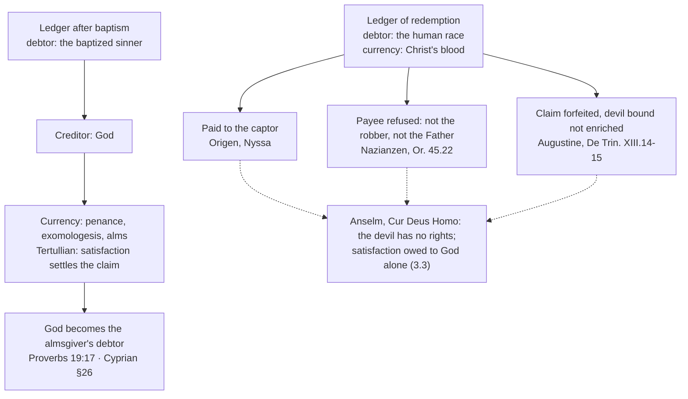

# Theology of Debt · Lesson 3.2: The Fathers: alms, satisfaction and a ransom paid to whom?

> ⏱ ~15 min · Module 3: Sin as debt · Builds on: [2.4 The bond and the ransom](02-04-the-bond-and-the-ransom.md), [3.1 From burden to debt](03-01-from-burden-to-debt.md) · Unlocks: [3.3 Anselm: *Cur Deus Homo*](03-03-anselm-cur-deus-homo.md), [3.4 Aquinas: satisfaction and the debt of punishment](03-04-aquinas-satisfaction-and-the-debt-of-punishment.md)

## Why this matters

[3.1](03-01-from-burden-to-debt.md) ended with sin as a debt and alms as a deposit in heaven. The Fathers inherited that ledger and had to run it inside a Church. They faced two practical problems. Baptism cancels every debt once, so what does a Christian do about the debts run up afterwards? And if Christ's death was a *lytron*, a ransom ([2.4](02-04-the-bond-and-the-ransom.md)), who was owed the price? Their answers gave the West the word **satisfaction** and gave everyone a question Anselm would have to close. Read the texts through one question, **who is owed?**, and most of their theology of redemption falls into place.

## The idea

A debt metaphor has three moving parts: a **debtor**, a **creditor**, and a **currency** that settles the account. Change any one and the theology changes.

The Fathers ran two ledgers at once.

- **The ledger after baptism.** The debtor is the baptized sinner and the creditor is God. The currency is repentance and works of mercy, with [alms](../reference.md#redemptive-almsgiving) first among them. That ledger has a surprise in it. Scripture says the one who pities the poor *lends to the Lord* (Proverbs 19:17), so almsgiving turns God into a debtor.
- **The ledger of redemption.** The debtor is the human race and the currency is Christ's blood. The creditor is the open question: the captor, the Father, or, strictly speaking, no one.

This lesson reads the Fathers on both ledgers for the **debt logic** only. Who they were, and the rest of their thought, is [`patristics`](../../patristics/syllabus.md)'s business.

## Source

Cyprian of Carthage, *On Works and Alms* (early 250s), §§2, 5 and 26; ANF vol. 5 (Wallis):

> Not assuredly those sins which had been previously contracted, for those are purged by the blood and sanctification of Christ. ...
> the divine instructions have taught what sinners ought to do, that by works of righteousness God is satisfied, that with the deserts of mercy sins are cleansed. ...
> ... assisted by which the Christian accomplishes spiritual grace, deserves well of Christ the Judge, accounts God his debtor.

The first sentence is about sins before baptism, the last about the labour of charity. Cyprian ([`patristics` 2.4](../../patristics/lessons/02-04-cyprian-of-carthage.md)) had just governed a church through mass apostasy under Decius, and he needed a remedy for sins committed *after* baptism. Three phrases carry the argument.

**"Purged by the blood ... of Christ."** Cyprian fences the remedy before he offers it. Alms do not compete with the cross. Christ's blood alone clears the debt that baptism cancels, and alms work only on what comes after.

**"God is satisfied."** Here is the verb that becomes a doctrine. Cyprian's proof texts are Daniel 4:24 ("redeem thou thy sins with alms") and Tobit 12:9, the exact passages [3.1](03-01-from-burden-to-debt.md) read as Second Temple debt language. The ledger crossed into the Church intact.

**"Accounts God his debtor."** Now the account runs the other way. From Proverbs 19:17 Cyprian concludes that the almsgiver is a creditor of God, repaid in heaven. It is a kind of lending the Fathers praise, a fact [4.1](04-01-the-fathers-against-usury.md) will need.

## The argument

The patristic debt logic, as a chain:

1. **Baptism cancels the whole debt, once.** Cyprian §2: in baptism "remission of sins is granted once for all". *In words:* the slate is wiped clean, but there is only one such wiping.
2. **Sin after baptism runs up new debt.** Nobody is without it (Cyprian §3, citing 1 John 1:8).
3. **So there must be a second currency.** Tertullian's *On Repentance* (written before his Montanist turn; ANF vol. 3, Thelwall) calls repentance "the price" at which the Lord awards pardon (ch. 6) and allows one public penance after baptism, the *exomologesis* (chs. 7 and 9). Its purpose he states in ch. 9:

   > ... by confession satisfaction is settled, of confession repentance is born; by repentance God is appeased. ... by temporal mortification (I will not say frustrate, but) expunge eternal punishments.

   *In words:* a short, self-imposed penalty takes the place of an endless one that would otherwise be owed.
4. **The currency is [satisfaction](../reference.md#satisfaction).** In Roman law *satisfacere* meant settling a creditor's claim by something he accepts in place of strict payment; scholars commonly credit Tertullian, a rhetorician at home in Roman legal language ([`patristics` 2.3](../../patristics/lessons/02-03-tertullian.md)), with bringing the word into theology. The claim is settled because the creditor *accepts* the offering, not because it equals the debt.
5. **It works only through Christ.** Cyprian's fence (§2) and his opening (§1: the Son "underwent death" to set captives free) make every alms a work of the redeemed, not a purchase of redemption.
6. **The ransom raises the payee question.** A *lytron* is paid *to* someone ([lytron](../reference.md#lytron-and-redemption-words)). Three answers came:
   - **To the captor.** Origen, *Commentary on Matthew* 16.8 (paraphrased here, no public-domain English), reasons that the ransom was not paid to God, so it must have gone to the evil one who held us until the price, Jesus's soul, was handed over. Gregory of Nyssa built this into the hook and bait of the *Great Catechism* (read closely in [`christology` 5.2](../../christology/lessons/05-02-ransom-christus-victor-and-sacrifice.md); not repeated here). This is [the devil's rights](../reference.md#the-devils-rights).
   - **To the Father: refused, and to the captor: refused.** Gregory of Nazianzus, *Oration* 45.22 (NPNF 2nd series, vol. 7), grants that a ransom belongs to the one who holds us, then recoils from the conclusion:

     > If the robber receives ransom, not only from God, but a ransom which consists of God Himself, and has such an illustrious payment for his tyranny ...

     He refuses the Father as creditor too: the Father "accepts" the offering but did not ask for it or demand it.
   - **To no one, and the claim lost.** Augustine, *De Trinitate* XIII.12–15 (NPNF 1st series, vol. 3, Haddan), grants the devil a hold over debtors "by the justice of God in some sense" (12.16). The devil forfeits it by killing the one man who owed nothing (14.18). The blood was given "as it were" as a price, but the devil was "not enriched, but bound" (15.19).

**Mark the levels** ([ladder](../../fundamental-theology/lessons/04-04-the-ladder-of-doctrinal-authority.md); [levels here](../reference.md#the-levels-in-this-course)). That Christ redeemed us by his death is **defined faith (rung 1)**, confessed in the Creed, which says he was crucified for us. Trent teaches in a doctrinal chapter that he "made satisfaction for us unto God the Father" (Session VI, ch. 7); read at its level in [3.4](03-04-aquinas-satisfaction-and-the-debt-of-punishment.md). **To whom** a ransom was paid has never been defined. The devil-as-payee and the devil's rights were opinions of orthodox Fathers (**rung 5**), never taught by any magisterial act and later abandoned. They are not heresy. That penances, including fasting, prayer and almsdeeds, make satisfaction to God for the **temporal punishment** of sin, **through the merits of Christ**, is **defined** (Trent, Session XIV, canon 13, with anathema; the text belongs to [3.6](03-06-luther-trent-and-the-reform-of-indulgences.md)). What is defined is Trent's qualified claim. Cyprian's own phrasing, that alms "wash away" sins and that God "can be appeased by almsgiving alone" (§4), is one bishop's preaching and is read by the definition, not the other way round. Tertullian's limit of one penance was a local discipline, later dropped, from a writer the tradition ranks below the Fathers.

## Map of positions

## Worked examples

**Example 1: the three moving parts on a clean case.** Take Tertullian ch. 2, which says a good deed "has God as its debtor", and set it beside Cyprian §26. Run the three parts. The *debtor* is God. The *creditor* is the one who does good. The *currency* is reward at the judgment. Now ask what makes such a debt possible, since nobody can put God in his debt by right. Both authors ground it in God's own promise, not in the value of the deed: Proverbs 19:17 for Cyprian, God as the just "rewarder" for Tertullian. This is the seed of the later doctrine of **merit**: a reward owed because God bound himself to give it. Aquinas makes that precise in [3.4](03-04-aquinas-satisfaction-and-the-debt-of-punishment.md). The metaphor is working, and it stays under control because the account was opened by a promise.

**Example 2: where the metaphor strains, the ransom.** Now run the three parts on redemption, and the ledger will not balance. If sin is a debt, the creditor is **God**. The Lord's Prayer says so ([2.2](02-02-forgive-us-our-debts.md)). If Christ's death is a ransom, the payee is **whoever holds the captive**, and Scripture says the devil holds the power of death (Hebrews 2:14). Origen follows the ransom and gets a payee who is not the creditor. Nazianzen sees the absurdity: God pays himself to a robber as the fee for robbery. So he keeps the vocabulary of price and offering and **refuses to name a payee**. Augustine splits the difference. There is a creditor (God, whose justice handed the race over), and there is a **jailer** (the devil, who held the debtors). The jailer is never paid. He loses his hold by overreaching, and he kills an innocent man over whom no debt ran.

That is the strain in one sentence: the Fathers ran a debt owed **to God** and a captivity held **by the devil**, and "ransom" hitched the two together. Anselm ([3.3](03-03-anselm-cur-deus-homo.md)) will cut the hitch. He denies that the devil ever had a claim and puts the whole debt, and the whole satisfaction, on the one ledger with God.

## Watch out

- **You might think the Fathers held "the ransom theory."** The same Father calls Christ's death a price, a sacrifice and a victory in one paragraph (Nazianzen 45.22 does all three). The payee question was a live disagreement among them, not a consensus.
- **Overstating a level:** calling the devil-payee view Church teaching, or calling Tertullian's satisfaction language "what the Church defined". **Understating one:** filing "alms and penance make satisfaction for temporal punishment" as pious opinion. Trent defined it, in its own qualified form (Session XIV, can. 13).
- **You might read Trent back into Tertullian.** His penance "expunges eternal punishments". The later distinction between guilt and eternal punishment, remitted by absolution, and [temporal punishment](../reference.md#temporal-punishment), which remains, is not yet his. Don't make him a scholastic.
- **You might hear "God is satisfied" as "God's anger is bought off."** Cyprian's fence (§2) and Tertullian's "One whom you may satisfy, and Him willing" (ch. 7) make the creditor the one who opens the way to settlement.

## One-liner

> The Fathers kept two ledgers: sins after baptism owed to God and settled by satisfaction and alms, and a captivity whose ransom nobody could agree how to address. The first became doctrine. The second left Anselm a question to close.

## Problems

**P1 (🟢)** *(Exegetical: level assignment)* For each claim give its level on the [`fundamental-theology` 4.4](../../fundamental-theology/lessons/04-04-the-ladder-of-doctrinal-authority.md) ladder and **name the act or fact that fixes it**. One line each.

1. "Christ redeemed us by his death on the cross."
2. "Christ's blood was paid as a ransom to the devil, who held a just claim on us."
3. "Fasting, prayer and almsdeeds make satisfaction to God for the temporal punishment of sins, through the merits of Christ."

**P2 (🟡)** *(Exegetical: apply)* Three **invented** Easter stanzas, written for this problem:

> **A.** He paid no fee to hell's dark lord, / Nor was the Father's wrath the cause; / Received, not asked, the offering poured / To hallow flesh by heaven's laws.
>
> **B.** Hell saw a man and seized its prey / And felt the hidden God within; / The baited hook tore it away, / The trickster tricked, the captives win.
>
> **C.** The tyrant held us as his due, / Then slew the One who owed him nought; / He lost the debtors that he knew, / Not paid, but bound, the jailer caught.

(a) Match each stanza to Origen and Gregory of Nyssa, Gregory of Nazianzus, or Augustine, naming the words that decide it. (b) Which stanza gives the devil a payment, and which grants him some claim without a payment? **Two sentences per part.**

**P3 (🔴)** *(Exegetical: close reading)* Augustine, *De Trinitate* XIII.14.18 (NPNF 1st series, vol. 3, Haddan):

> And how was he conquered? Because, when he found in Him nothing worthy of death, yet he slew Him. And certainly it is just, that we whom he held as debtors, should be dismissed free by believing in Him whom he slew without any debt. ... And hence He proceeds to His passion, that He might pay for us debtors that which He Himself did not owe. Would then the devil be conquered by this most just right, if Christ had willed to deal with him by power, not by righteousness? But He held back what was possible to Him, in order that He might first do what was fitting.

(a) Two debts are named: "without any debt" and "that which He Himself did not owe". Say what each is, and on what ground the debtors go free. (b) Does this passage make the devil the **payee** of what Christ pays? Which words decide it? (c) Which words anticipate the vocabulary Anselm and Aquinas will dispute? **Two sentences per part.**

Solutions

**P1** *(Exegetical)*

**Must hit, strict:**
1. **Rung 1, defined faith.** The Creed confesses Christ crucified for us and for our salvation, and Trent (Session VI, ch. 7) teaches that he made satisfaction for us to the Father. The faith fixes the *fact* of redemption; no *mechanism* is defined.
2. **Rung 5: a patristic opinion, never taught by any magisterial act and later abandoned.** No council or pope ever named a payee. It is **not heresy**: Origen and Nyssa held it inside the Church, and Nazianzen and Augustine disputed it without anyone condemning it.
3. **Rung 1, defined.** Trent, Session XIV, canon 13 anathematizes anyone who says satisfaction for temporal punishment is in no way made to God, through Christ's merits, by penances including "fastings, prayers, almsdeeds".

**Wrong turns:** filing 3 as "common teaching" or "Cyprian's opinion". The qualified claim is defined, and the qualifiers (temporal punishment, through Christ's merits) are the defined content. Calling 2 a condemned error. Answering 1 with "Anselm's satisfaction theory is dogma". The fact is defined, the theory is not.

**P2** *(Exegetical)*

**Must hit, strict (a):** **A = Nazianzen:** "paid no fee to hell's dark lord, / Nor was the Father's wrath the cause" refuses both payees, and "Received, not asked" is his "accepts ... neither asked for Him nor demanded Him", with "to hallow flesh" his purpose (humanity sanctified by the humanity of God). **B = Origen/Nyssa:** "baited hook", "hidden God within", "trickster tricked" is the fishhook. **C = Augustine:** "slew the One who owed him nought", "lost the debtors", "Not paid, but bound" (XIII.14.18, 15.19).

**Must hit, strict (b):** **B** gives the devil the payment: he "seized" the prey offered and swallowed the flesh as his price. **C** grants a claim ("held us as his due", Augustine's "by the justice of God in some sense") but denies the payment ("Not paid, but bound").

**Wrong turns:** assigning C to Nyssa because both have the devil caught; the deciding marks are the innocent victim and "not paid". Reading A's "Received" as the Father being paid; receiving is not demanding.

**Model answer:** (a) A is Nazianzen: it refuses both the devil and the Father's wrath and keeps an offering that is "received, not asked". B is the Origen–Nyssa hook ("baited hook", "trickster tricked"), and C is Augustine, whose devil loses the debtors by killing "the One who owed him nought" and is "not paid, but bound". (b) B pays the devil, since the hidden God is the prey he takes as his price. C grants him a hold "as his due" but withholds any payment, which is exactly Augustine's "not enriched, but bound".

**P3** *(Exegetical)*

**Must hit, strict (a):** "Without any debt" is **the debt of death** Christ did not owe because he had no sin ("nothing worthy of death"). "That which He did not owe" is **the death he pays** on our behalf. The debtors go free **by justice**: the devil slew one over whom he had no claim, so it is "just" that he lose those he held. The means of release is "believing in Him".

**Must hit, strict (b):** **No.** Christ pays "for us debtors", but nothing says the devil *receives* the payment. The devil is "conquered" "by righteousness" and loses his hold by overreaching. The deciding words are "conquered", "just" and "dismissed free", not any word of receipt. Credit a student who adds 15.19's "not enriched, but bound".

**Must hit, strict (c):** "**what was possible**" against "**what was fitting**". Christ could have acted by power but chose the fitting way. That is the vocabulary of *possible* and *fitting* that Aquinas uses against Anselm's *necessary* ([3.4](03-04-aquinas-satisfaction-and-the-debt-of-punishment.md)).

**Wrong turns:** reading "debtors" as debtors *to the devil* in his own right. Augustine's hold is by God's justice handing the race over, and the devil is the one who held them, not the one they owed. Taking "pay for us" as proof of a devil-payee. Missing "fitting" in (c).

**Model answer:** (a) Christ had no debt of death because the devil found nothing in him worthy of death, yet he pays death for us, the debt he did not owe. We go free because it is just for the devil to lose those he held once he has killed the one he had no claim on. (b) No: Christ pays for us, but the devil is conquered and loses his hold, and nothing in the passage says he receives the price. (c) "He held back what was possible to Him, in order that He might first do what was fitting" sets the possible against the fitting, which is the ground Aquinas will stand on against Anselm's necessity.

## Flashback

**From Lesson [2.4](02-04-the-bond-and-the-ransom.md) (The bond and the ransom):** *(Exegetical.)* Four **invented** documents from a first-century archive:

1. A creditor hands a debtor back his note of hand, crossed through, with "cancelled; nothing received" written under it.
2. A man pays a slave owner 300 drachmae, and the slave passes into the buyer's household as his servant.
3. A friend writes to a creditor in his own hand: "Whatever he owes you, charge it to me. I will repay."
4. A foreman's tally: "owed to the labourer for twelve days' work."

(a) Match each document to the New Testament text whose picture it matches: Colossians 2:13–14; 1 Corinthians 6:20 or 7:22–23; Philemon 18–19; Romans 4:4. Give the Greek word in the text that decides each. (b) Which document is a **remission** with no payment, and which one names a **payee**, something the New Testament's purchase texts never do? (c) Paul uses the picture in document 4 to deny something. What does he deny, and what does Trent define and teach about merit that keeps "reward" from becoming a wage? **Two sentences per part.**

Solution

**Must hit, strict (a):** 1 → Colossians 2:13–14: *charisamenos* ("forgiving", a free grant) or *exaleipsas* ("blotting out"). 2 → 1 Corinthians 6:20 / 7:22–23: *agorazō* ("bought with a price"), with the bought man becoming "the bondman of Christ". 3 → Philemon 18–19: *elloga* ("put that to my account") or *apotisō* ("I will repay"). 4 → Romans 4:4: *kata opheilēma*, "according to debt".

**Must hit, strict (b):** Document 1 is the remission: the creditor cancels and nobody pays. Document 2 names a payee, the slave owner. The purchase texts name a captive, a price and a new owner (God, Revelation 5:9) but never say who received the price.

**Must hit, strict (c):** Paul denies that justification is a wage God owes; it is "according to grace". That the justified truly merit eternal life is **defined** (Trent VI, canon 32). Trent's chapter 16 grounds that merit in God's promise and his own gifts ("His own gifts be their merits"), not in strict debt.

**Wrong turns:** matching document 2 to Delphi as though the parallel were established. In the Delphic rite the slave pays his own price, which is one of the critics' objections. Matching document 3 to Colossians because both involve a handwritten bond: in Colossians nobody pays, while document 3 has a third party paying. In (c), calling merit "only a pious opinion", which understates canon 32.

**Model answer:** (a) 1 is Colossians' *charisamenos*, a bond forgiven and wiped out. 2 is Paul's *agorazō*, bought with a price into a new master's service. 3 is Philemon's *elloga* and *apotisō*, a debt charged to a third party who will repay. 4 is Romans 4:4's *kata opheilēma*. (b) Document 1 is pure remission. Document 2 names who was paid, which no New Testament purchase text does. (c) Paul denies that justification is wages owed. Trent defines that the justified truly merit eternal life (VI, can. 32) but grounds that merit in God's promise and gifts (ch. 16), so God owes it only because he bound himself.

## Connections

- **Backward:** [2.4](02-04-the-bond-and-the-ransom.md) gave the *lytron* vocabulary with no payee named. [3.1](03-01-from-burden-to-debt.md) supplied the Second Temple ledger (Daniel 4:24, Tobit) that Cyprian quotes. [2.2](02-02-forgive-us-our-debts.md) made God the creditor of sin.
- **Forward:** [3.3](03-03-anselm-cur-deus-homo.md) rejects the devil's rights and puts the whole debt on God's ledger. [3.4](03-04-aquinas-satisfaction-and-the-debt-of-punishment.md) turns Augustine's "fitting" into a thesis and Tertullian's satisfaction into the debt of punishment. [3.5](03-05-the-christian-jubilee-and-the-treasury.md) and [3.6](03-06-luther-trent-and-the-reform-of-indulgences.md) follow satisfaction into the treasury and Trent. Cyprian's praise of "lending to God" returns in [4.1](04-01-the-fathers-against-usury.md), where the Fathers condemn lending to men at interest.
- **Sideways:** the ransom and sacrifice models as Christology are [`christology` 5.2](../../christology/lessons/05-02-ransom-christus-victor-and-sacrifice.md) and [5.3](../../christology/lessons/05-03-satisfaction-anselm-and-aquinas.md). The Fathers as authors are [`patristics`](../../patristics/syllabus.md) 2.3, 2.4, 2.5 and 3.3. In the debt thread, [`philosophy-of-debt`](../../philosophy-of-debt/syllabus.md) asks whether forgiveness without payment is just, and whether a promise can make someone a debtor. That is the question Example 1 answers for God. Roman debt law, the world Tertullian's legal vocabulary came from, is [`history-of-debt` 1.5](../../history-of-debt/lessons/01-05-nexum-and-the-roman-plebs.md). Penance as a sacrament belongs to [`sacraments-and-liturgy`](../../sacraments-and-liturgy/syllabus.md).
