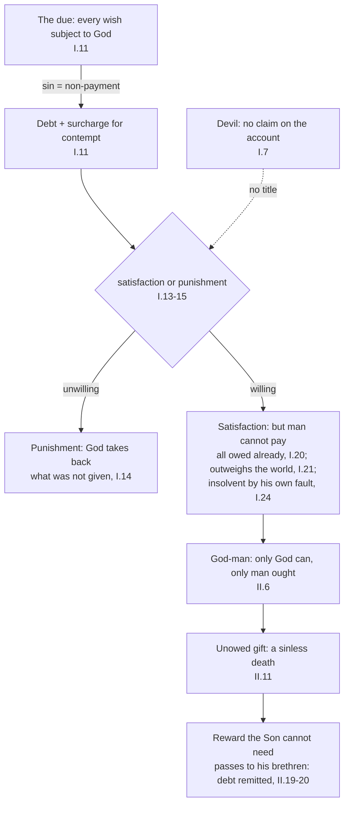

# Theology of Debt · Lesson 3.3: Anselm: *Cur Deus Homo*

> ⏱ ~15 min · Module 3: Sin as debt · Builds on: [3.1 From burden to debt](03-01-from-burden-to-debt.md), [3.2 The Fathers: alms, satisfaction and a ransom paid to whom?](03-02-the-fathers-alms-satisfaction-and-ransom.md) · Unlocks: [3.4 Aquinas: satisfaction, merit and the debt of punishment](03-04-aquinas-satisfaction-and-the-debt-of-punishment.md)

## Why this matters

By the end of [3.2](03-02-the-fathers-alms-satisfaction-and-ransom.md) the Church had a vocabulary (sin as debt, alms and penance as satisfaction, Christ's blood as ransom) and an unanswered question: a ransom paid to whom? Anselm of Canterbury, finishing [*Cur Deus Homo*](../reference.md#cur-deus-homo) ("Why God became man") around 1098, turned the vocabulary into an argument. He took the debt metaphor more literally than anyone before him, followed it like an auditor, and concluded that only a God-man could clear the account. Every later Western theology of redemption argues with this book. This lesson reads it as a *debt* argument. How it compares with the other theories of atonement is left to [`christology` 5.3](../../christology/lessons/05-03-satisfaction-anselm-and-aquinas.md).

## The idea

Run the ledger on an ordinary debtor. A steward owes his lord a whole year's faithful service. He embezzles instead, and publicly. Three facts follow.

First, paying back the stolen sum is not enough. The contempt shown is a further injury, so he owes **more** than he took. Second, he cannot pay out of next year's wages, because next year's service is **already owed**. Third, he spent the money on purpose, so his **insolvency** is his own doing, and being unable to pay does not excuse him.

Now make the lord God and the "service" a will wholly turned to God. The debt becomes infinite, every possible payment is already owed, and the debtor is broke by his own act. Only someone who owes God nothing could pay, and only a human being *ought* to. Anselm's conclusion is that this someone must be both.

## Source

*Cur Deus Homo* I.11, "What it is to sin, and to make satisfaction for sin" (Deane, 1903; Anselm is speaking except for Boso's one question):

> If man or angel always rendered to God his due, he would never sin. ... Therefore to sin is nothing else than not to render to God his due. [Boso:] What is the debt which we owe to God? ... Every wish of a rational creature should be subject to the will of God. ... He who does not render this honor which is due to God, robs God of his own and dishonors him; and this is sin. Moreover, so long as he does not restore what he has taken away, he remains in fault; and it will not suffice merely to restore what has been taken away, but, considering the contempt offered, he ought to restore more than he took away. ... So then, every one who sins ought to pay back the honor of which he has robbed God; and this is the satisfaction which every sinner owes to God.

Read the nouns. The **debt** is not a sum or a ritual but a will: "every wish" subject to God's. **Honour** is simply the name for paying that debt, so "dishonour" means non-payment, not wounded pride. And **[satisfaction](../reference.md#satisfaction)** is defined here as *restitution plus a surcharge*: what was taken, and more, "considering the contempt offered." That surcharge is what makes the rest of the book necessary. [Sin as debt](../reference.md#sin-as-debt), which [3.1](03-01-from-burden-to-debt.md) followed into the Second Temple period, is here worked out as a doctrine of restitution.

## The argument

*Cur Deus Homo* is a dialogue; the monk Boso objects. Anselm proceeds by reason alone, setting Christ aside as if he did not exist (recalled in I.20), to see whether the God-man turns out to be necessary. (His method as a philosopher is [`ancient-medieval-philosophy` 6.1](../../ancient-medieval-philosophy/lessons/06-01-anselm-and-the-proslogion-as-history.md).) The debt chain, with chapter numbers checked against Deane:

1. **Clear the devil off the books** (I.7). The devil and man both belong to God, so God has no case to "try" with his own creature, and [the devil's rights](../reference.md#the-devils-rights) are void. The devil torments man unjustly, even though God justly permits it. The "written decree" of Colossians 2:14 is God's decree, not a bond the devil holds. *In words:* the account is between man and God alone. Anselm retires the ransom-to-the-devil picture of [3.2](03-02-the-fathers-alms-satisfaction-and-ransom.md).
2. **Sin is non-payment of the due; satisfaction is restitution plus surcharge** (I.11, the Source).
3. **Mercy alone would leave the account "undischarged"** (I.12). To remit without payment or punishment is to make "injustice ... more free than justice". Boso objects that God commands *us* to forgive, and Anselm replies that vengeance belongs to God alone. The creditor analogy is being bent here, and Example 2 takes it up.
4. **Either [satisfaction or punishment](../reference.md#satisfaction-or-punishment)** (I.13–15). The honour "must be repaid, or punishment must follow" (I.13). Punishment is God taking back from the unwilling what they would not give (I.14). I.15 explains why the fork is inevitable:

   > these two things are not only unfitting, but consequently impossible; so that satisfaction or punishment must needs follow every sin.

   *In words:* what is unfitting in God is thereby impossible. This one step turns **fittingness into necessity**, and it is the step Aquinas will refuse.
5. **Man cannot pay** (I.20–24). Everything Boso offers (contrition, self-denial, alms, obedience) is already owed (I.20). The weight of one look against God's will exceeds the whole universe, and infinitely many worlds besides (I.21). And the insolvency is self-inflicted, so it does not excuse (I.24).
6. **So only the God-man can** (II.6). The payment must exceed "all the universe besides God", so only God can make it. Yet the debt is man's, and so it is a satisfaction "which none but God can make and none but man ought to make".
7. **His death is the one thing he does not owe** (II.11). His obedience is owed, as every creature's is. Death is not, because death is the wage of sin and in him "no sin will be found". So his freely accepted death is a gift given "not of debt but freely".
8. **The reward overflows to his brethren** (II.19). A gift so great must be rewarded, yet the Son needs nothing, so the reward passes to those "weighed down by so heavy a debt", and their debt is remitted. II.20 concludes that nothing is more just than to remit "all debt", since a reward "greater than all debt" has been earned.

∴ **The God-man pays, by an unowed death, a debt that only man owed and only God could pay, and the surplus clears ours.**

**The critics, at their strength.** Adolf von Harnack judged the whole scheme a juridical construction: God behaves like an offended private party, and redemption becomes the settling of an account. Gustaf Aulén, already met in [`christology` 5.2](../../christology/lessons/05-02-ransom-christus-victor-and-sacrifice.md), filed it as the "Latin" type, in which the offering is made by Christ *as man*, from below. On Aulén's account this breaks the continuity of God's own victorious action. R. W. Southern, Anselm's modern biographer, is the usual authority for reading the honour language against the lord-and-vassal society Anselm lived in, and for marking where that reading stops. Any such reading also has to reckon with I.15, where nothing "can be added to or taken from the honor of God": the honour at stake is the order of the universe, which no baron owned. Anselm has his own answer to the charge that God is compelled. The only "necessity" in God is the immutability of his goodness, which Anselm says is not properly called necessity at all (II.5).

**[Mark the levels](../reference.md#the-levels-in-this-course).** *That* Christ "made satisfaction for us unto God the Father" is taught by an ecumenical council: Trent, Session VI ch. 7 (Waterworth). It stands in a doctrinal chapter, and the manuals commonly rank it as of faith. Canon 10's anathema, though, names Christ's *merit*, not his satisfaction. Anselm's **mechanism** (honour, surcharge, the God-man's unowed death) is theology with no magisterial act behind it: the tradition's great classic, not its dogma. Anselm's **necessity** (step 4) is **freely disputed**, since Aquinas denied it ([3.4](03-04-aquinas-satisfaction-and-the-debt-of-punishment.md)). The **rejection of the devil's rights** (step 1) became common teaching, and no act defines it. The **feudal reading** is a historian's thesis, with no doctrinal level at all.

## The ledger

The devil sits off the ledger (the dashed edge). Every entry runs between man and God, and the only payment that is not already owed is the death at the bottom.

## Worked examples

**Example 1 (a clean case): Boso's payments.** In I.20 Boso offers repentance, contrition, self-denial, bodily hardship, giving and forgiving, and obedience. Run the ledger on each. Contrition, prayer and self-denial are owed anyway, because a creature owes God all its love and desire. Alms are owed too, since what you give was God's before it was yours. Forgiving others is not yours to withhold, because vengeance belongs to God. Obedience is the definition of the due (I.11). So every item is **current account**, and nothing is left over for **arrears**. A tenant cannot pay last year's back rent with this year's rent. The example also shows where Anselm leaves penance: penance is real, and it is how the believer enters Christ's satisfaction (II.19's "if he come aright"), but it cannot be the *price* of sin. That distinction is exactly where the medieval theology of satisfaction and indulgences begins ([3.5](03-05-the-christian-jubilee-and-the-treasury.md)).

**Example 2 (a hard case): the creditor who may not forgive.** The debt metaphor cuts both ways. The Gospels make forgiving debtors a duty for creditors: the king forgives ten thousand talents in Matthew 18 ([2.3](02-03-the-parables-of-debt.md)). Human law, too, has learned to discharge a bankrupt even when he is insolvent through his own fault ([`history-of-debt` 4.2](../../history-of-debt/lessons/04-02-debtors-prisons-and-the-invention-of-bankruptcy.md)). Anselm's I.24 goes the other way. His servant throws himself into the ditch he was warned about, cannot do his work, and is *doubly* guilty. And God, uniquely among creditors, may not write the debt off (I.12).

Anselm's way out is to deny that God is a creditor in the private sense. Forgiveness is commanded to us because vengeance is not ours (I.12). God, by contrast, is the guardian of the order itself (I.13, I.15), and a judge who waives the law does not forgive a debt: he abolishes the difference between guilty and innocent (I.12). That answer holds only if God stands to sin as a *judge* stands to a crime and not as a *creditor* stands to a debt, and only if an unfitting remission really is an impossible one. Aquinas will press on exactly that joint. A judge, he will say, cannot waive an offence against another, but God has no one above him ([3.4](03-04-aquinas-satisfaction-and-the-debt-of-punishment.md)).

## Watch out

- **You might think satisfaction is punishment by another name.** For Anselm they are the two branches of the fork (I.13–15): satisfaction is given freely, punishment is taken from the unwilling. Christ's death is on the satisfaction branch, a gift "not of debt" (II.11). Penal substitution is a different theory, and it is assessed in [`christology` 5.4](../../christology/lessons/05-04-penal-substitution-and-the-catholic-assessment.md).
- **You might think Anselm's argument is Church teaching because Anselm is a Doctor of the Church.** Being named a Doctor commends a writer's teaching as a whole. It does not raise any one of his theses up the ladder. Trent teaches *that* Christ made satisfaction; the necessity is freely disputed, and to call it dogma is an overstatement.
- **You might understate instead**, and call satisfaction "just Anselm's medieval theory." The fact is conciliar teaching (Trent VI ch. 7). Only the mechanism and the necessity are open.
- **You might think "honour" means God's injured pride.** I.15 says God's honour cannot be increased or diminished. What sin disturbs is the creature's own place in the order of the universe.

## One-liner

> Anselm audits the debt of sin and finds it unpayable by anyone who owes it, so it is paid by the one man who owed nothing, with the one thing he did not owe, and the surplus is credited to his brethren.

## Problems

**P1 (🟢)** *(Exegetical.)* *Cur Deus Homo* II.11 (Deane, 1903), Anselm speaking to Boso:

> Reason has also taught us that the gift which he presents to God, not of debt but freely, ought to be something greater than anything in the possession of God. ... Therefore must this gift be understood in this way, that he somehow gives up himself, or something of his, to the honor of God, which he did not owe as a debtor. ... If we say that he will give himself to God by obedience, so as, by steadily maintaining holiness, to render himself subject to his will, this will not be giving a thing not demanded of him by God as his due. For every reasonable being owes his obedience to God. ... Let us see whether, perchance, this may be to give up his life or to lay down his life, or to deliver himself up to death for God's honor. For God will not demand this of him as a debt; for, as no sin will be found, he ought not to die.

(a) Why can Christ's lifelong obedience *not* be the satisfying gift? Name the words that decide it. (b) What makes his death unowed, and which earlier link in the chain does that premise depend on? (c) Which chapter of Book I uses the same principle against Boso, and on what? **Two sentences per part.**

**P2 (🟡)** *(Exegetical.)* Find the crux. Two positions, paraphrased:

- **A.** By consenting to sin, man freely handed himself over to the devil, who therefore holds him by a just title, like a creditor holding a signed bond (the "handwriting" of Colossians 2:14). God, being just, could not simply seize him back. He had to win him by justice, and the devil forfeited his claim when he killed the sinless Christ, over whom he had no right.
- **B.** Anselm, *Cur Deus Homo* I.7.

(a) Name the single premise of A that Anselm denies, and his reason. (b) How does Anselm read the "handwriting", and what support does that remove from A? (c) Anselm grants something true in A. What is it, and what distinction lets him grant it without conceding a right? **Two sentences per part.**

**P3 (🔴)** *(Exegetical.)* An **invented** line from a parish study guide, written for this problem and not the words of any real person:

> "In *Cur Deus Homo* Anselm gave the Church its dogma of penal substitution: God's offended honour demanded that someone be punished, so the Father punished Christ in our place. Since Anselm is a Doctor of the Church, Catholics must hold that this was the only way God could save us."

Name every error, and say what Anselm's text or the Church's teaching says instead. **150 words or fewer.**

Solutions

**P1** *(Exegetical.)*

**Must hit, strict (a):** obedience is already **owed**: "this will not be giving a thing not demanded of him by God as his due. For every reasonable being owes his obedience to God." A payment for sin has to be something *not* owed ("which he did not owe as a debtor").

**Must hit, strict (b):** death is not owed because "no sin will be found" in him, so "he ought not to die". This rests on death being the penalty of sin, a debt incurred only by sinning. The premise that fixes the value of the gift is II.6: the payment must exceed everything besides God, which only God can give. Credit either link, provided the answer names the chapter.

**Must hit, strict (c):** **I.20**, where Boso offers contrition, self-denial, alms, forgiving and obedience, and Anselm answers that each is owed already, so none pays the debt for sin.

**Wrong turns:** saying the death satisfies because of how much it hurt. The passage measures the gift by its being *unowed* and by *who* gives it, not by pain. Answering (c) with I.21. That chapter concerns the *weight* of sin, not whether a payment was already owed.

**Model answer:** (a) Obedience cannot satisfy because every rational creature owes it to God anyway; the decisive words are "not giving a thing not demanded of him ... as his due." (b) His death is unowed because death is due only for sin and "no sin will be found" in him; that it is enough depends on II.6's demand for a payment greater than all besides God. (c) I.20 uses the same principle on Boso's offer of contrition, alms and obedience: all of it is owed already, so none of it pays for sin.

**P2** *(Exegetical.)*

**Must hit, strict (a):** the premise that the devil can hold a **right** (a just title) over man against God. Anselm denies it because "neither the devil nor man belong to any but God", so there is no third-party creditor. God has no cause to "try with his own creature", and the devil is a thief holding a fellow thief.

**Must hit, strict (b):** the "written decree" is **God's** decree, not the devil's bond. It records God's just judgment that sinful man cannot of himself escape sin and its punishment. So A loses its documentary title: there is no signed contract in the devil's favour.

**Must hit, strict (c):** it is true that man **justly suffers** the devil's tormenting. The distinction is that God *justly permits* it and man *justly deserves* it, while the devil inflicts it *unjustly*, from malice and not at God's command. Anselm's own analogy is the man who returns a blow: the same act can be just from one side and unjust from the other.

**Wrong turns:** saying Anselm denies that the Fathers ever used ransom language. He denies a *right* in the devil, not the scriptural *lytron* ([3.2](03-02-the-fathers-alms-satisfaction-and-ransom.md)). Settling the modern exegesis of Colossians 2:14 here. The question asks how *Anselm* reads it, and the verse's own readings belong to [2.4](02-04-the-bond-and-the-ransom.md).

**Model answer:** (a) Anselm denies that the devil holds any just title to man: since both belong to God alone, the devil is a thief holding a fellow thief, not a creditor. (b) He reads the handwriting as God's own decree that sinful man cannot escape sin and its penalty, so there is no bond in the devil's favour for God to honour. (c) Man really does suffer the devil justly, as a punishment he deserves; but that justice lies in God's permission and man's desert, while the devil himself acts unjustly.

**P3** *(Exegetical.)*

**Must hit, strict:** (1) **Satisfaction is not punishment.** Anselm's fork makes them alternatives (I.13–15), and Christ's death is a gift "not of debt" (II.11), not a penalty inflicted by the Father. (2) **"Offended honour" as injured pride** misreads I.15, where nothing can be added to or taken from God's honour. (3) **Level, overstated twice:** Trent (Session VI ch. 7) teaches *that* Christ made satisfaction and defines no mechanism, so there is no "dogma of penal substitution". The **necessity** ("the only way") is freely disputed, and Aquinas denied it. (4) The **Doctor of the Church** title does not raise a particular thesis to Church teaching.

**Wrong turns:** "correcting" the guide by calling satisfaction merely Anselm's opinion. That understates Trent. Missing that "only way" is a separate, second overstatement.

**Model answer:** The guide makes four errors. Anselm's fork sets satisfaction and punishment as alternatives, and Christ's death is a free gift "not of debt", not a penalty inflicted by the Father. God's honour, Anselm says, cannot be increased or diminished; sin disturbs the creature's order, not God's pride. The Church teaches, at Trent, *that* Christ made satisfaction for us; it has defined no theory of how, and certainly not penal substitution. Whether satisfaction was the only way is freely disputed, and Aquinas denied it. Being a Doctor of the Church commends Anselm's teaching as a whole but does not make any single argument of his binding.

## Flashback

**From Lesson [3.1](03-01-from-burden-to-debt.md) (From burden to debt: the Second Temple shift):** *(Exegetical.)* Three texts in the Douay-Rheims:

> **A.** If any one sin, and hear the voice of one swearing, and is a witness either because he himself hath seen, or is privy to it: if he do not utter it, he shall bear his iniquity. (Leviticus 5:1)
>
> **B.** According to the number of the forty days, wherein you viewed the land: a year shall be counted for a day. And forty years you shall receive your iniquities, and shall know my revenge. (Numbers 14:34)
>
> **C.** Sell what you possess and give alms. Make to yourselves bags which grow not old, a treasure in heaven which faileth not. (Luke 12:33)

In A and B the Hebrew verb is the same, *nasa'* ("bear, carry"); the Douay's "receive" in B follows the Vulgate. (a) Place each text under one of 3.1's pictures (burden; repayment on a term; alms as deposit), naming the deciding word. (b) Which of 3.1's three criticisms of the Anderson thesis does B illustrate best, and why? (c) A reader says: "Jesus uses the deposit idiom in C, so Anderson's thesis is Church teaching." Correct the level. **Two sentences per part.**

Solution

**Must hit, strict:** **(a)** A is **burden**: "bear his iniquity" is *nasa' 'awon*, the early idiom. B is also **burden** by its verb (*nasa'*), but it attaches a **counted term** ("a year shall be counted for a day ... forty years"), the feature that makes the exile a repayment schedule in 3.1's reading of 2 Chronicles 36:21. C is **deposit**: "treasure in heaven" and "bags which grow not old" move the alms into a balance with God, as in Matthew 6:19–21. **(b)** The first criticism, **coexistence**: a single verse joins the burden verb to a term of years, so the two pictures overlap rather than one replacing the other. Credit also the lexical point that the Douay's "receive" hides the verb, which is 3.1's warning to reason from the Hebrew. **(c)** Anderson's thesis is a historian's philological claim, **freely disputed**, with no magisterial act behind it, and "sin as debt" is itself defined at no rung. That Jesus speaks of treasure in heaven is Scripture; a scholar's account of where the idiom came from does not share its authority.

**Wrong turns:** filing B under repayment because the Douay says "receive", which sounds like receiving wages; the verb is the burden verb. Overcorrecting (c) into "the deposit idiom has no standing": it is Scripture, and Trent XIV canon 13 defines that almsdeeds make satisfaction for temporal punishment through Christ's merits.

**Model answer:** (a) A is burden ("bear his iniquity"), and C is deposit ("a treasure in heaven which faileth not"). B is burden by its verb, *nasa'*, but it counts the bearing out in years, the way 3.1 read the exile as a repayment term. (b) B shows coexistence: the burden verb and a counted term sit in one sentence, so the two pictures overlap rather than succeed each other. (c) The thesis is a freely disputed historical claim, and no act of the Church teaches it; Jesus's use of the idiom belongs to Scripture, not to Anderson's reconstruction of its history.

## Connections

- **Backward:** [3.1](03-01-from-burden-to-debt.md) made sin a debt; [3.2](03-02-the-fathers-alms-satisfaction-and-ransom.md) left the ransom's payee open. Anselm closes the question by striking the devil from the ledger. The "handwriting" of I.7 is the *cheirographon* of [2.4](02-04-the-bond-and-the-ransom.md).
- **Forward:** [3.4](03-04-aquinas-satisfaction-and-the-debt-of-punishment.md) keeps the debt and drops the necessity. [3.5](03-05-the-christian-jubilee-and-the-treasury.md) asks what happens to the "reward greater than all debt" (II.20) once it is described as a *treasury*.
- **Sideways:** [`christology` 5.3](../../christology/lessons/05-03-satisfaction-anselm-and-aquinas.md) and [5.4](../../christology/lessons/05-04-penal-substitution-and-the-catholic-assessment.md) rank the theories. In the debt thread, [`philosophy-of-debt`](../../philosophy-of-debt/syllabus.md) asks whether a debtor can owe what he cannot pay, which is I.24's question in secular form, and [`history-of-debt` 4.2](../../history-of-debt/lessons/04-02-debtors-prisons-and-the-invention-of-bankruptcy.md) shows the law learning to discharge exactly the debtor Anselm refuses to excuse.
