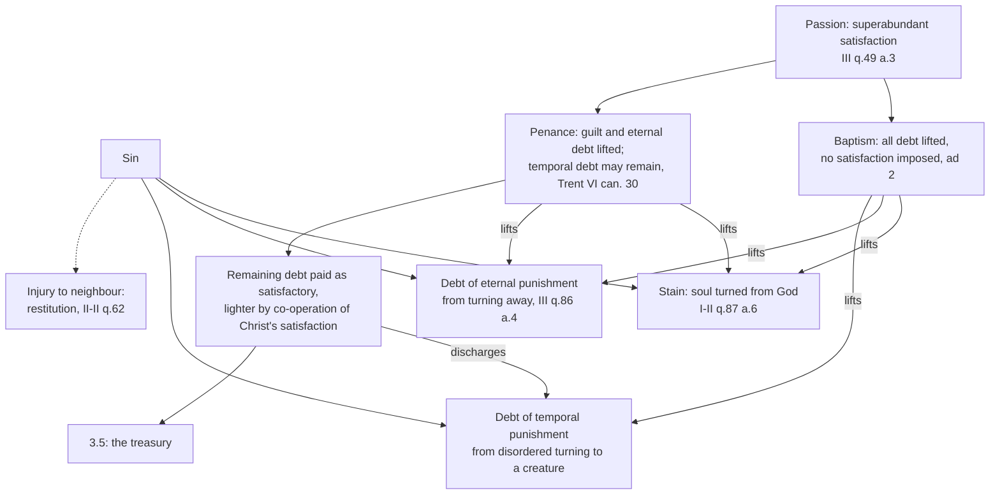

# Theology of Debt · Lesson 3.4: Aquinas: satisfaction, merit and the debt of punishment

> ⏱ ~15 min · Module 3: Sin as debt · Builds on: [3.3 Anselm: *Cur Deus Homo*](03-03-anselm-cur-deus-homo.md), [3.1 From burden to debt](03-01-from-burden-to-debt.md) · Unlocks: [3.5 The Christian Jubilee and the treasury](03-05-the-christian-jubilee-and-the-treasury.md), [3.6 Luther, Trent and the reform of indulgences](03-06-luther-trent-and-the-reform-of-indulgences.md)

## Why this matters

Anselm kept one ledger: God's honour, unpaid ([3.3](03-03-anselm-cur-deus-homo.md)). Aquinas opens the ledger and finds it has several columns. Sin leaves a **stain**, a **guilt**, and a [debt of punishment](../reference.md#reatus-poenae) (*reatus poenae*), and these are not cancelled together. That single distinction explains why a forgiven sinner can still owe something, why baptism and penance differ, and why the medieval Church could speak of remitting [temporal punishment](../reference.md#temporal-punishment) at all. Without it, [3.5](03-05-the-christian-jubilee-and-the-treasury.md)'s treasury is unintelligible and Trent's canon on temporal punishment ([3.6](03-06-luther-trent-and-the-reform-of-indulgences.md)) looks like a contradiction.

## The idea

A man drives drunk and smashes his neighbour's fence. Three things now stand between them. The friendship is broken. The law says he owes a penalty. And the fence is still lying in the road. The neighbour can forgive him over the fence the next morning: the friendship is restored. The penalty, though, is not thereby cancelled, and the fence is still owed. If the man pays the penalty *willingly*, as a way of setting things right, it stops feeling like a sentence and becomes part of his repentance.

Aquinas reads sin the same way. The **stain** (*macula*) is the lost friendship: the soul turned from God. The **debt of punishment** is the disorder still owed back to justice. Forgiveness heals the first at once; the second can remain, but it changes character: from penalty *suffered* to satisfaction *offered*. (The fence, what the driver owes his neighbour, is a third thing again, which no forgiveness of the friendship cancels: [restitution](../reference.md#restitution).)

Christ enters this picture as the one who pays a debt that was not his, in a currency God loves, so that ours can be paid in a lighter coin.

## Source

*Summa Theologiae* III q.49 a.3, "Whether men were freed from the punishment of sin through Christ's Passion?", the *respondeo* (English Dominican Province):

> Through Christ's Passion we have been delivered from the debt of punishment in two ways. First of all, directly ... when sufficient satisfaction has been paid, then the debt of punishment is abolished. In another way ... in so far as Christ's Passion is the cause of the forgiveness of sin, upon which the debt of punishment rests.

Read it as an accountant would. **Directly**: a debt is extinguished by payment, and the Passion is payment, "sufficient and superabundant" in the omitted clause ([`christology` 5.3](../../christology/lessons/05-03-satisfaction-anselm-and-aquinas.md) reads that superabundance from q.48 a.2). **Indirectly**: a debt "rests" on a cause, so removing the cause, the sin, removes what rests on it. Two routes to one release. The replies then explain why the release does not look complete: ad 2 says baptism imposes no satisfaction, "since they are fully delivered", while those who sin after baptism must be conformed to Christ's suffering by some penalty of their own, much lighter than the sin deserves, "by the co-operation of Christ's satisfaction". Ad 3 says death remains because the members are conformed to the head, passible first and glorified after.

## The argument

1. **Sin incurs a debt of punishment** (I-II q.87 a.1). Whatever rises against an order is put down by that order; sin is a disordered act, so the sinner is liable to repression, which is punishment. Three orders, three punishments: from conscience, from human authority, from God. *In words:* the debt is not a price God sets; it is what a disturbed order owes back to itself.
2. **The debt outlasts the act** (a.6). When the sinful act is over, the liability remains until some "penal compensation" restores "the equality of justice", the same logic as an injury to a neighbour.
3. **Stain and debt come apart** (a.6). The stain goes only when the will is reunited to God, and that happens when it accepts the order of justice, taking punishment on itself or bearing patiently what God sends. Punishment so accepted *is* [satisfactory](../reference.md#satisfaction): voluntary, and so "somewhat" less than punishment. When the stain is gone, a debt may remain, "not indeed of punishment simply, but of satisfactory punishment."
4. **Eternal and temporal debts separate** (III q.86 a.4). Mortal sin both turns away from God and turns disorderly toward a creature. The turning-away incurs the eternal debt, and it is lifted with the guilt when grace reunites the soul to God; the finite turning-toward can leave "a debt of some temporal punishment".
5. **Satisfactory punishment can be borne for another** (q.87 aa.7–8). Penal punishment is personal: each is punished for his own sin. But those who are one in will by love can bear another's satisfactory punishment, "thus even in human affairs we see men take the debts of another upon themselves." *In words:* the grammar of surety, not of a scapegoat. Here [sin as debt](../reference.md#sin-as-debt) becomes literal enough to transfer.
6. **God could have remitted the debt without payment** (III q.46 a.2 ad 3). A judge cannot waive an offence against another; God, offended against himself and with no one above him, would wrong no one by forgiving outright, as anyone may overlook a personal trespass. He chose satisfaction as "more copious mercy" (a.1 ad 3): man is freed by Christ's justice *and* by mercy, since God gave the Son to pay what man could not.
7. **Christ both merits and satisfies** (III q.48 aa.1–2). Merit earns a reward (salvation, for the head and all his members); satisfaction discharges a debt. Christ's Passion does both, and reaches us because head and members are one mystical person (a.2 ad 1).
8. **Redemption is payment to God** (q.48 a.4). Man was bound twice: to the devil by sin, and to God's justice by the debt of punishment. The Passion is "a price", as Daniel 4:24 speaks of redeeming sins with alms ([3.1](03-01-from-burden-to-debt.md)), and ad 3 says it was paid "not to the devil, but to God".

*In words:* Aquinas keeps Anselm's debt, drops his necessity, and splits the debt into what is lifted with the guilt and what may remain to be satisfied in Christ.

**Trent.** Session VI (1547), ch. 7, names Christ the meritorious cause of justification: he "merited Justification for us by His most holy Passion ... and made satisfaction for us unto God the Father" (Waterworth). Ch. 14 teaches that post-baptismal penance includes satisfaction "not indeed for the eternal punishment", remitted with the guilt, but for the temporal. Canon 30 condemns, under anathema, anyone who says that every justified penitent has his guilt and eternal debt so blotted out that no debt of temporal punishment remains, in this world or in purgatory.

**Mark the levels.** *That* Christ made satisfaction to the Father is taught in a doctrinal chapter of an ecumenical council (Session VI, ch. 7), commonly ranked as of faith; canon 10's anathema names his *merit*, and satisfaction stands in the chapter ([`fundamental-theology` 4.5](../../fundamental-theology/lessons/04-05-reading-a-documents-weight.md): chapters teach, canons define). That a debt of temporal punishment can remain after guilt is forgiven is **defined** (canon 30): rung 1 of the [ladder](../../fundamental-theology/lessons/04-04-the-ladder-of-doctrinal-authority.md). Aquinas's machinery (order, stain, satisfactory punishment, price paid to God, one mystical person) is the tradition's leading theology, with no magisterial act behind it as such. **Whether satisfaction was necessary** is freely disputed: Anselm affirms, Aquinas denies. See [the levels in this course](../reference.md#the-levels-in-this-course).

## The case

The dotted edge is the one forgiveness never touches: what is owed to a neighbour in commutative justice.

## Worked examples

**Example 1 — a clean case: David after Nathan** (2 Samuel [2 Kings] 12:13–14, the *sed contra* of I-II q.87 a.6). Nathan tells David that the Lord has taken away his sin and he shall not die, yet the child born to him shall die. Run the columns. *Stain:* removed; David confesses and is forgiven. *Eternal debt:* lifted (he shall not die). *Temporal debt:* remains, and Aquinas's ad 3 gives it two reasons beyond equality: to heal the other powers of the soul, and to repair the scandal given. Borne by a repentant David, the punishment is *satisfactory*: he accepts God's order rather than being crushed by it.

**Example 2 — where it strains: "paid in full", yet still paying.** If the Passion is superabundant satisfaction for all sin (q.49 a.3), why must a baptized sinner still fast, give alms and die? The objection is Aquinas's own (a.3 obj. 2–3), and it is the same objection Luther will press ([3.6](03-06-luther-trent-and-the-reform-of-indulgences.md)). His answer does not deny the payment; it locates the *application*. The Passion works in those joined to it "through faith and charity and the sacraments of faith" (ad 1). Baptism joins us to Christ's death once and imposes nothing; after a second fall, the member is conformed to the head by a suffering of his own, made light by Christ's (ad 2). The strain is real: one may ask whether "lighter penalty" concedes that something remained unpaid. Aquinas's reply is that what remains is not a shortfall in the price but the member's share in the head's pattern, satisfaction *with* Christ rather than *in addition to* him. That reply is exactly what [3.5](03-05-the-christian-jubilee-and-the-treasury.md) builds on, and what the Lutheran confessions will reject.

## Watch out

- **You might think forgiveness cancels every debt at once.** Aquinas separates stain, eternal debt and temporal debt (q.87 a.6; III q.86 a.4), and Trent defines that temporal debt can remain (canon 30). Understating canon 30 as "one school's view" is an error.
- **You might think Aquinas's order-and-stain account is itself dogma.** Trent teaches the *fact* of satisfaction and the *survival* of temporal punishment; it canonizes no mechanism. The Common Doctor's authority is not a magisterial act.
- **You might think "Christ bore our debt of punishment" means penal substitution.** Aquinas says penal punishment is personal (q.87 a.8); what one bears for another is *satisfactory* punishment, taken on in love as a surety takes on a debt. The comparison with penal substitution is [`christology` 5.4](../../christology/lessons/05-04-penal-substitution-and-the-catholic-assessment.md)'s.
- **You might think the price was owed to the devil because he held us.** He held us unjustly; justice bound us to God, so the price went to God (q.48 a.4 ad 2–3).
- **You might think absolution cancels restitution.** It lifts guilt before God; stolen goods are owed to their owner (II-II q.62 a.2), a separate debt entirely.

## One-liner

> For Aquinas, sin leaves a stain and a debt; forgiveness washes the stain, and what remains of the debt is paid gladly, in Christ's coin.

## Problems

**P1 (🟢)** *(Exegetical.)* *Summa Theologiae* I-II q.87 a.6, from the *respondeo* (English Dominican Province):

> the stain of sin cannot be removed from man, unless his will accept the order of Divine justice, that is to say, unless either of his own accord he take upon himself the punishment of his past sin, or bear patiently the punishment which God inflicts on him; and in both ways punishment avails for satisfaction. Now when punishment is satisfactory, it loses somewhat of the nature of punishment: for the nature of punishment is to be against the will; and although satisfactory punishment, absolutely speaking, is against the will, nevertheless in this particular case and for this particular purpose, it is voluntary. ... We must, therefore, say that, when the stain of sin has been removed, there may remain a debt of punishment, not indeed of punishment simply, but of satisfactory punishment.

(a) Name the two ways the will "accepts the order of Divine justice", and say which of them is *not* self-imposed. (b) Which words explain why satisfactory punishment "loses somewhat of the nature of punishment"? (c) What exactly may remain after the stain is removed, and what may *not*? **Two sentences per part.**

**P2 (🟡)** *(Exegetical.)* An **invented** case. Marco embezzled 20,000 dollars from his employer, repented, confessed, and received absolution. His confessor assigned a penance of prayer and alms. The employer never learned of the theft. Using the columns of this lesson (stain, eternal debt, temporal debt, and what is owed to a neighbour): (a) Say which of Marco's debts absolution lifted, which may remain, and to whom each remaining one is owed. (b) Marco reasons: "Christ's satisfaction was superabundant, so I owe nothing further to anyone." Say which part of his reasoning Aquinas would accept and where it fails, citing the article for each. **150 words or fewer in total.**

**P3 (🔴)** *(Exegetical.)* Assign each claim its level on the [ladder](../../fundamental-theology/lessons/04-04-the-ladder-of-doctrinal-authority.md) and **name the act** that fixes it, or say that none does. (a) Christ made satisfaction for us to God the Father. (b) After justification, a debt of temporal punishment can remain, to be discharged in this life or in purgatory. (c) Sin incurs a debt of punishment because it disturbs an order, and once the stain is removed the remaining debt is of satisfactory, not simply penal, punishment. (d) The price of redemption was paid to God, not to the devil. **Two sentences per claim.**

Solutions

**P1** *(Exegetical.)*

**Must hit, strict (a):** taking the punishment on oneself "of his own accord", and bearing "patiently the punishment which God inflicts". The second is not self-imposed: God inflicts it, and the will's part is patient acceptance. Both avail for satisfaction.

**Must hit, strict (b):** "the nature of punishment is to be against the will", while satisfactory punishment is "voluntary" "in this particular case and for this particular purpose". It stays against the will absolutely, so it keeps *somewhat* of punishment's nature, not all of it.

**Must hit, strict (c):** a debt of **satisfactory** punishment may remain; a debt of punishment **simply** (penal, inflicted on an unwilling will still turned from God) may not, because the stain, the will's separation from God, is gone.

**Wrong turns:** reading "loses somewhat" as "stops being punishment": the text says absolutely it is still against the will. Reading (c) as "no debt remains": the passage's conclusion is that one may.

**Model answer:** (a) The will accepts justice either by taking punishment on itself or by bearing patiently what God inflicts; the second comes from God, not from the sinner. (b) Punishment is by nature against the will, but satisfactory punishment is voluntary for this purpose, though absolutely still against the will, so it loses only "somewhat" of the nature of punishment. (c) A debt of satisfactory punishment may remain after the stain is removed; a debt of punishment simply may not.

**P2** *(Exegetical.)*

**Must hit, strict (a):** absolution lifts the **stain** and the **guilt with the eternal debt** (III q.86 a.4; Trent VI ch. 14). A **temporal debt** may remain, owed to God's justice and discharged by satisfaction (the assigned penance is part of it). The **20,000 dollars** are owed to the **employer** in commutative justice: restitution (II-II q.62 a.2), untouched by absolution. Whether the employer knows is irrelevant.

**Must hit, strict (b):** accept: the Passion is superabundant satisfaction and abolishes the debt of punishment directly (III q.49 a.3). Fails twice: its effect reaches a post-baptismal sinner by conformity through some penalty of his own, made lighter by Christ's (a.3 ad 2); and Christ's satisfaction to God does not pay Marco's neighbour, since restitution is a separate debt.

**Wrong turns:** treating the penance as restitution; calling the temporal debt owed to the Church; saying superabundance makes the penance a formality.

**Model answer:** Absolution lifted the stain, the guilt and the eternal debt (III q.86 a.4). A temporal debt may remain before God, which his penance begins to satisfy, and the 20,000 dollars are still owed to his employer as restitution (II-II q.62 a.2), whether or not the employer knows. Aquinas grants that Christ's satisfaction is superabundant and abolishes the debt of punishment (q.49 a.3). But after baptism its effect comes by conformity, through a lighter penalty of one's own borne with Christ (ad 2), and it was paid to God, not to Marco's employer.

**P3** *(Exegetical.)*

**Must hit, strict:** **(a)** Taught in Trent, Session VI, ch. 7, a doctrinal chapter of an ecumenical council; commonly ranked as of faith, though canon 10's anathema names merit rather than satisfaction. **(b)** **Defined**, rung 1: Session VI, canon 30, with anathema; ch. 14 teaches the same. **(c)** Aquinas's theology (I-II q.87 aa.1, 6): no magisterial act; a theological explanation, not dogma. **(d)** The common teaching of theologians since Anselm and Aquinas (III q.48 a.4 ad 3), with no act defining it; rung 4 at most.

**Wrong turns:** calling (b) a school opinion (understating a canon); calling (c) of faith because Trent speaks of temporal punishment (Trent defines the survival, not the mechanism); calling (d) defined because the devil-ransom view is now rejected.

**Model answer:** (a) Conciliar teaching in a doctrinal chapter (Trent VI ch. 7), usually ranked as of faith; the anathema of canon 10 falls on merit. (b) Defined by Trent VI canon 30 under anathema: rung 1. (c) Aquinas's explanation in I-II q.87, with no magisterial act behind it; it is theology, not dogma. (d) Common theological teaching from q.48 a.4 ad 3 and Anselm, fixed by no act of the Church.

## Flashback

**From Lesson [3.2](03-02-the-fathers-alms-satisfaction-and-ransom.md) (The Fathers: alms, satisfaction and a ransom paid to whom?):** *(Exegetical.)* An **invented** Lenten homily, written for this problem and not the words of any real person:

> "Think of Lent as a payment plan. Every alms you give pays down your account with God, and give enough and you can clear the whole of it, even the sins you committed before your baptism. The Fathers all agreed on how the account was first settled: Christ's blood was the ransom paid to the devil, who held a just claim on us, and that is simply the Church's teaching. As St Cyprian says, God can be appeased by almsgiving alone."

Name three errors of fact or of level and correct each from 3.2's texts or acts. **120 words or fewer.**

Solution

**Must hit, strict:** any three of: (1) **Sins before baptism** are not the alms' business: Cyprian fences them off, "purged by the blood and sanctification of Christ" (§2), and baptism remits once for all. (2) **"Clear the whole account"** overstates what is defined: Trent XIV canon 13 teaches that penances including almsdeeds make satisfaction for **temporal punishment**, **through the merits of Christ**, not that alms remove guilt or work apart from him. (3) **The Fathers did not agree**: Origen and Nyssa made the devil the payee, Nazianzen refused both the devil and the Father as payee, and Augustine had the devil "not enriched, but bound". (4) **Level**: the payee was never defined; the devil-payee view is a patristic opinion (rung 5), later abandoned. (5) Cyprian's "almsgiving alone" is one bishop's preaching, read by Trent's definition, not the reverse.

**Wrong turns:** denying that Cyprian wrote "almsgiving alone": he did (§4), so the error is using it as the measure of doctrine. Calling the devil-payee view heresy. Overcorrecting (2) into "alms make no satisfaction", which understates a canon.

**Model answer:** First, Cyprian himself says the sins before baptism are purged by Christ's blood, not by alms, and alms work on the debts run up afterwards. Second, what Trent defined (XIV can. 13) is narrower than "clearing the account": almsdeeds satisfy for temporal punishment, through Christ's merits. Third, the Fathers disagreed about the payee: Origen and Nyssa named the devil, Nazianzen refused him and the Father alike, Augustine had the devil bound, not paid. No act of the Church ever named a payee, so the devil-ransom view is an old opinion, not Church teaching, and not heresy either.

## Connections

- **Backward:** [3.3](03-03-anselm-cur-deus-homo.md) gave the single-ledger debt and its necessity; Aquinas keeps the debt and drops the necessity. [3.1](03-01-from-burden-to-debt.md)'s "redeem thy sins with alms" (Daniel 4:24) is the verse Aquinas cites to call satisfaction a price. The creditor who may forgive what is owed to himself is [2.3](02-03-the-parables-of-debt.md)'s king.
- **Forward:** [3.5](03-05-the-christian-jubilee-and-the-treasury.md) needs the remaining temporal debt and q.87 a.7's surety to explain the treasury; [3.6](03-06-luther-trent-and-the-reform-of-indulgences.md) reads canon 30 against Luther. [4.3](04-03-aquinas-on-usury-ii-ii-q78.md) reads Aquinas again, on money debts, with the same rule that a theologian is not a magisterial act.
- **Sideways:** [`christology` 5.3](../../christology/lessons/05-03-satisfaction-anselm-and-aquinas.md) reads the same questions as Christology. In the debt thread, [`philosophy-of-debt`](../../philosophy-of-debt/syllabus.md) asks whether a debt can be forgiven without moral remainder, the secular form of this lesson's question; [`history-of-debt`](../../history-of-debt/syllabus.md) and [`economics-of-debt`](../../economics-of-debt/syllabus.md) supply the surety and the discharged-yet-owing debtor in institutional form.
