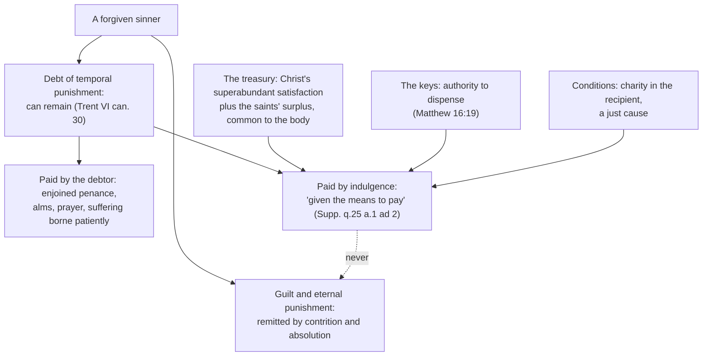

# Theology of Debt · Lesson 3.5: The Christian Jubilee and the treasury of the Church

> ⏱ ~15 min · Module 3: Sin as debt · Builds on: [3.4 Aquinas: satisfaction, merit and the debt of punishment](03-04-aquinas-satisfaction-and-the-debt-of-punishment.md), [1.3 The Jubilee](01-03-the-jubilee-the-land-is-mine.md), [3.2 The Fathers](03-02-the-fathers-alms-satisfaction-and-ransom.md) · Unlocks: [3.6 Luther, Trent and the reform of indulgences](03-06-luther-trent-and-the-reform-of-indulgences.md)

## Why this matters

On 22 February 1300 Boniface VIII granted "the most full" pardon to penitents who visited the Roman basilicas, and contemporaries called the year a *jubilee*. The word came from Leviticus 25, where the fiftieth year returns land and frees bondservants ([1.3](01-03-the-jubilee-the-land-is-mine.md)). In 1300 nobody's field went back to anyone. What was released was a **debt of punishment**. To explain how the Church could release it, thirteenth-century theologians had worked out the doctrine of a **treasury**: a common fund of Christ's and the saints' satisfactions that the Church dispenses. This lesson reads that doctrine as debt theology and marks its weight. Luther's attack on it, and Trent's reply, are [3.6](03-06-luther-trent-and-the-reform-of-indulgences.md).

## The idea

[3.4](03-04-aquinas-satisfaction-and-the-debt-of-punishment.md) split what sin leaves behind into two things. **Guilt** (*culpa*) is the turning away from God. The **debt of punishment** (*reatus poenae*) is what is still owed after the turning back. Forgiveness cancels the guilt, and with it the eternal punishment of mortal sin, but a [temporal punishment](../reference.md#temporal-punishment) can remain. A friend can forgive you for wrecking his car at once; the car still has to be fixed.

The early Church paid this remaining debt in penance, and penance came with a price list. Canons and penitentials set so many years of fasting for so many sins. Then came an exchange rate. The early medieval penitentials let a penitent **commute** a penance he could not perform into another he could. The eighth-century penitential attributed to Egbert of York, as the *Catholic Encyclopedia* (1912) reports it, allows a man who cannot fast a year on bread and water to give twenty-six solidi in alms instead. An Irish synod of 807 let a day's fast be "redeemed" by singing a psalter. Pilgrimage became the great commutation, and in 1095 the Council of Clermont let the armed journey to Jerusalem stand in place of all penance.

So practice came first. A debt measured in penances could be paid in another currency. The theologians then asked what the Church was drawing on when it accepted less than the tariff, or nothing but a visit and a prayer. Their answer was that it was drawing on a **surplus someone else had paid in**.

## Source

The Supplement was compiled after Aquinas's death from his early commentary on the *Sentences* (Book IV, d.20). Supplement q.25 a.1, "Whether an indulgence can remit any part of the punishment due for the satisfaction of sins?", from the body (English Dominican Province):

> The reason why they so avail is the oneness of the mystical body in which many have performed works of satisfaction exceeding the requirements of their debts ... These merits, then, are the common property of the whole Church.

Read the accounting. There is a **debt**, the punishment each member owes. There is an **overpayment**: saints whose satisfactions exceeded "the requirements of their debts," and above all Christ, whose efficacy "infinitely surpasses" the sacraments (same article). And there is a **common owner**. The surplus belongs to the body because the saints acted "for the whole Church in general," not for one beneficiary (the article cites Colossians 1:24). What makes a transfer possible is membership. This is [3.4](03-04-aquinas-satisfaction-and-the-debt-of-punishment.md)'s "one mystical person" (ST III q.48 a.2 ad 1, read in [`christology` 5.3](../../christology/lessons/05-03-satisfaction-anselm-and-aquinas.md)) extended from the Head to the members. One more premise completes it, again from the body: common property is distributed "according to the judgment of him who rules them all."

## The argument

The treasury argument, reconstructed from Supp. q.25 a.1:

1. **After contrition, absolution and confession, a debt of temporal punishment can remain** (body; Trent later defines this, Session VI, canon 30, speaking of a remaining "debt of temporal punishment to be discharged"). *In words:* forgiven is not the same as paid up.
2. **One member can satisfy for another** (the body cites Supp. q.13 a.2). *In words:* the debt is personal but not untransferable, because members of one body can carry each other's burdens.
3. **Christ's satisfaction is superabundant, and many saints satisfied beyond their own debts.** *In words:* the body's account is in surplus, and the surplus exceeds the whole debt of everyone now living (the article says so).
4. **That surplus was offered for the Church as a whole, so it is the Church's common property.**
5. **Common property is dispensed by the one who governs the community,** and this is the power of the keys (Matthew 16:19, cited in the body).
6. **Conditions:** the recipient must be joined to Christ by charity, and there must be a just cause tending to God's honour and the Church's good (a.2).
7. **∴ An indulgence validly remits temporal punishment "in the judgment of God," not only the penance a priest imposed.** Aquinas rejects the rival view, held by "some," that indulgences only lift canonical penalties. He argues that a remission valid only on earth would leave the penitent to pay more in Purgatory.

Two replies fix the limits. An indulgence never touches **guilt**, which only absolution removes (ad 3). And the penitent "is not, strictly speaking, absolved from the debt of punishment, but is given the means whereby he may pay it" (ad 2).

**How the Jubilee took it up.** Hugh of St Cher is usually credited with the first explicit statement of the treasury, around 1230. Alexander of Hales, Albert and Aquinas developed it. Boniface VIII's bull *Antiquorum habet fida relatio* (1300) granted the plenary remission to penitents who confessed and visited St Peter's and St Paul's. The bull never uses the word *jubilee* and envisages a celebration every hundred years. Clement VI's *Unigenitus* (27 January 1343) did two things. It taught the treasury in papal form: Christ shed not a drop but a torrent of blood and laid up an infinite treasure, entrusted to Peter and his successors to dispense for just causes. And it cut the interval to fifty years, bringing the Christian Jubilee onto the Levitical count for 1350. By the later fifteenth century the interval was twenty-five years. The Levitical release of land and persons had become a scheduled release of the debt of punishment.

**Mark the levels.** Use the [ladder](../../fundamental-theology/lessons/04-04-the-ladder-of-doctrinal-authority.md) (see [the levels in this course](../reference.md#the-levels-in-this-course)).
- *That temporal punishment can remain after forgiveness* is **defined**: Trent, Session VI, canon 30, with anathema.
- *That the Church has the power to grant indulgences and that they are useful* is **defined** in Session XXV, with anathema ([3.6](03-06-luther-trent-and-the-reform-of-indulgences.md) reads it).
- *The treasury as the explanation* is **authentic ordinary magisterium**: *Unigenitus*, Paul VI's *Indulgentiarum Doctrina* (1967) and CCC 1476–1477 teach it, and religious submission is owed. It is **not defined**. *Unigenitus* is a papal bull, not an ex cathedra definition, and Trent's decree on indulgences does not use the word "treasury." The manuals graded the treasury variously, and no rung above the third may be claimed for it.
- *The Supplement's mechanism*, with its surplus exceeding the debt of all the living and its common property dispensed by the ruler, is **scholastic theology**. Papal teaching adopted its core but not every step.
- *The Jubilee's form* (the interval, the basilicas, the conditions) is **discipline**. It is a changeable law, which is why a hundred years became fifty and then twenty-five, and it is not on the doctrinal ladder at all.

## The ledger

## Worked examples

**Example 1 (clean): Egbert's twenty-six solidi.** Run the ledger. The penitent's guilt was forgiven through contrition and reconciliation, and the commutation does not touch it. What the penitential re-prices is the **enjoined penance**, the Church's measure of his temporal debt: a year of bread and water becomes a sum of alms. Nothing in the exchange draws on the treasury. He still pays, in a different currency. Commutation is **self-payment re-denominated**, and an indulgence is **payment from the common fund**. The treasury doctrine was needed only once remissions exceeded anything the penitent himself paid. Notice too what no exchange can reach. Cummian's seventh-century penitential, in the same report, shortens a thief's penance only if he **makes restitution** to the man he robbed. A debt in [commutative justice](../reference.md#commutative-justice) owed to a neighbour is not a debt of punishment owed to God, and no bishop can commute it.

**Example 2 (where the model strains): is temporal punishment a bill or a wound?** The Catechism describes temporal punishment as purification from an "unhealthy attachment to creatures" and says it must not be conceived as "a kind of vengeance inflicted by God from without" (CCC 1472). A fine can be paid by anyone. A cure cannot be taken for someone else. On the medical reading, how can a saint's surplus pay what you owe?

The texts hold both idioms and do not force a choice. The Catechism places the transfer inside the [communion of saints](../reference.md#the-treasury-of-the-church): the holiness of one profits others (CCC 1474–1475). Supplement ad 4 has the indulgence working **through** the recipient's own love for the cause, which disposes him to grace, and it tells the penitent not to drop his penances, since people "are often more in debt than they think." The debt language says what is owed. The purification language says what paying it does to the one who pays. What the Church teaches is the fact of the treasury and of its application. It defines no mechanism for how purification and payment fit together, and a theologian may press the strain.

**The hard record.** It belongs in the lesson because the Church's own acts record it. The Council of Clovesho (747) condemned those who thought they could pay hired penitents to fast for them. Lateran IV (1215) capped bishops' indulgences because prelates were granting too many. Boniface IX (1392) condemned religious who took money from simple people by promising the pardon of every sin. Nicholas of Cusa, papal legate in Germany from 1450, condemned at a Magdeburg synod preachers who taught that indulgences remit guilt, misreading the popular tag *a culpa et a poena*. R. N. Swanson's study of late-medieval England shows indulgences woven into ordinary devotion and into the funding of hospitals, bridges and churches, with the pardoners' presentation often running well ahead of the theology. Indulgences as present practice (the *Enchiridion*, conditions, how they are gained) belong to [`sacraments-and-liturgy`](../../sacraments-and-liturgy/syllabus.md). Matthew 5:26, "thou shalt not go out from thence till thou repay the last farthing" (Douay-Rheims), was widely received as an image of this debt paid after death. That reading is the tradition's use of the verse, not a defined exegesis. Purgatory as doctrine is [`creation-grace-last-things`](../../creation-grace-last-things/syllabus.md).

## Watch out

- **You might think the treasury is dogma because *Unigenitus* is papal and the *Catholic Encyclopedia* says it is "dogmatically set forth" there.** A bull teaching a doctrine is not an ex cathedra definition, and the 1912 phrasing is not a magisterial grading. Trent defined the power and the usefulness of indulgences, not the treasury. Call it authentic teaching (rung 3). Calling it "just a scholastic theory" understates it just as badly.
- **You might think an indulgence forgives sins.** It never remits guilt (Supp. ad 3; CCC 1471 defines it as remission of temporal punishment for sins "whose guilt has already been forgiven"). The popular *a culpa et a poena* is exactly the error Cusa condemned.
- **You might think the Christian Jubilee continues the Levitical one.** It borrows the name, the number fifty (from 1343) and the idea of remission. The 1300 bull used none of these, and nothing institutional links it to the release of land.

## One-liner

> The Christian Jubilee releases a debt of punishment, not of land. It pays from a treasury of Christ's and the saints' surplus, a treasury that is authentically taught and not defined, and it never touches guilt.

## Problems

**P1 (🟢)** *(Exegetical.)* Supplement q.25 a.1, replies to Objections 1–3 (English Dominican Province). Objection 1 had argued that nothing can be remitted from punishment set "according to the measure of the sin"; Objection 2, that no inferior can absolve from a punishment God imposes.

> Reply to Objection 1. The remission which is granted by means of indulgences does not destroy the proportion between punishment and sin, since someone has spontaneously taken upon himself the punishment due for another's guilt, as explained above.
>
> Reply to Objection 2. He who gains an indulgence is not, strictly speaking, absolved from the debt of punishment, but is given the means whereby he may pay it.
>
> Reply to Objection 3. The effect of sacramental absolution is the removal of a man's guilt, an effect which is not produced by indulgences. But he who grants indulgences pays the debt of punishment which a man owes, out of the common stock of the Church's goods, as explained above.

(a) Is the debt of punishment **cancelled** or **paid**? Name the words that decide it, and say how that answers Objection 1. (b) What does an indulgence never do, and what does? (c) Whose goods make up the "common stock," and at what level does the Church teach that such a stock exists? **Two sentences per part.**

**P2 (🟡)** *(Exegetical.)* An **invented** case. In 1150 a man confesses that he stole a neighbour's ox, and is assigned seven years' penance. Unable to fast, he has it commuted to a pilgrimage to Rome and a gift of alms. He has not returned the ox. (a) Which of the three things he owes (guilt before God, temporal punishment, the ox) does the commutation touch, and which does it leave? (b) Is the commutation an indulgence in Supp. q.25 a.1's sense? Give the feature that decides it. (c) Supp. q.25 a.1 reports a view that indulgences lift only the Church's imposed penalties. Which position did the Church's later definition of an indulgence adopt, and which word in CCC 1471 shows it? **120 words or fewer in total.**

**P3 (🔴)** *(Exegetical.)* An **invented** parish-bulletin paragraph, not the words of any real person:

> "In the Middle Ages the Church simply sold the forgiveness of sins: pay the pardoner, and your sins were wiped away. The 'treasury of merit' was dreamed up afterwards to justify the trade. Trent quietly dropped the whole business, and today it survives only as a pious opinion."

(a) Name the distinction the first sentence erases, and one text from this lesson that states it. (b) What in the first sentence is historically true? Give two acts of the Church that record it. (c) Correct the second sentence's history without denying that practice came before theory. (d) Correct the third sentence's level claims: there are **two**, one about indulgences and one about the treasury. **150 words or fewer in total.**

Solutions

**P1** *(Exegetical.)*

**Must hit, strict (a):** **paid**, not cancelled. The deciding words are "not, strictly speaking, absolved from the debt ... but is given the means whereby he may pay it" (ad 2), and "pays the debt of punishment ... out of the common stock" (ad 3). That answers Objection 1: the proportion of punishment to sin is kept, because someone else "spontaneously" bore the punishment (ad 1). The measure is met, only by another payer.
**(b):** it never removes **guilt**; sacramental absolution does (ad 3).
**(c):** the satisfactions of **Christ and the saints**, above all Christ's superabundant satisfaction (the body: the saints' works "exceeding the requirements of their debts"; Christ's efficacy "infinitely" surpassing). That the treasury exists is **authentic ordinary magisterium** (*Unigenitus*, *Indulgentiarum Doctrina*, CCC 1476–1477), not defined.
**Wrong turns:** reading ad 2 as saying indulgences do nothing before God. The body says they hold "in the judgment of God." Calling the treasury defined because Trent defined indulgences.
**Model answer:** (a) Paid: the recipient is "given the means whereby he may pay it" and the grantor "pays the debt ... out of the common stock." So the proportion Objection 1 demands is kept, because another has freely borne the punishment. (b) An indulgence never removes guilt. Sacramental absolution does. (c) The stock is the satisfactions of Christ and of the saints, Christ's above all. The Church teaches it authentically (*Unigenitus*, *Indulgentiarum Doctrina*, CCC 1476–1477) but has not defined it.

**P2** *(Exegetical.)*

**Must hit, strict (a):** guilt is remitted by contrition and absolution, not by the commutation. The commutation touches only the **temporal punishment**, re-pricing the enjoined penance. The **ox** is untouched: [restitution](../reference.md#restitution) is owed in commutative justice to the neighbour, and penitentials conditioned relief on it (Cummian).
**(b):** **no**. He still pays, in another currency. An indulgence in q.25 a.1's sense applies **another's satisfaction from the common fund**.
**(c):** the Church adopted Aquinas's position that the remission holds before God. CCC 1471 says "remission **before God**."
**Wrong turns:** saying the pilgrimage "forgives the theft." Treating restitution as part of the penance that can be commuted away.
**Model answer:** Absolution took the guilt; the commutation re-prices only his temporal debt; the ox is still owed to his neighbour in justice, and no commutation can release it. It is not an indulgence, because he pays the debt himself in a new form rather than drawing on the treasury. Later teaching sided with Aquinas: CCC 1471 calls an indulgence a remission "before God," not merely of canonical penalty.

**P3** *(Exegetical.)*

**Must hit, strict (a):** **guilt vs temporal punishment**. Indulgences never remitted guilt (Supp. ad 3; CCC 1471; even Boniface's 1300 grant required penitence and confession).
**(b):** money was genuinely tied to indulgences as alms, and preachers abused this. Boniface IX (1392) condemned religious who took money by promising pardon of all sins. Cusa (legate from 1450) condemned preaching that indulgences remit guilt. Lateran IV (1215) capped excessive grants, and Clovesho condemned hired penitents. Any two.
**(c):** practice did come first: commutations, redemptions, the crusade indulgence. But the treasury was formulated in the thirteenth century (Hugh of St Cher, Alexander, Albert, Aquinas) from older roots: one member satisfying for another, the martyrs' intercession, Christ's superabundance. "Dreamed up to justify a trade" asserts a motive the record does not show.
**(d):** Trent did not drop indulgences. It **defined** the Church's power to grant them and their usefulness, with anathema, and reformed the abuses. The treasury is not a pious opinion but **authentic teaching** (*Unigenitus*, *Indulgentiarum Doctrina*, CCC 1476–1477), though not defined.
**Wrong turns:** denying any abuse, since the Church's own condemnations record it. Overcorrecting (d) by calling the treasury dogma.
**Model answer:** The paragraph erases guilt versus temporal punishment: an indulgence never forgave sin (Supp. q.25 a.1 ad 3; CCC 1471). What is true is that money and indulgences were entangled and abused. Boniface IX condemned sellers of false pardons in 1392, and Cusa condemned the claim that indulgences remit guilt. Practice did precede theory, but the treasury was worked out by thirteenth-century theologians from older ideas of shared satisfaction, not invented as a fig leaf. Trent defined the power and usefulness of indulgences while reforming abuses. The treasury is authentic papal teaching: neither a pious opinion nor a dogma.

## Flashback

**From Lesson [3.3](03-03-anselm-cur-deus-homo.md) (Anselm: *Cur Deus Homo*):** *(Exegetical.)* *Cur Deus Homo* II.19 (Deane, 1903), Anselm to Boso, after Boso grants that the Father must reward the Son's gift:

> He who rewards another either gives him something which he does not have, or else remits some rightful claim upon him. But anterior to the great offering of the Son, all things belonging to the Father were his, nor did he ever owe anything which could be forgiven him. ... Had the Son wished to give some one else what was due to him, could the Father rightfully prevent it, or refuse to give it to the other person?

(a) Name the two forms a reward can take, and say why neither can be given to the Son. (b) Why is the Son owed a reward at all? Name the earlier link in 3.3's chain that this depends on, and say what the Son does with his claim. (c) At what level does the Church teach this transfer of Christ's reward to "his brethren"? **Two sentences per part.**

Solution

**Must hit, strict:** **(a)** A reward either **gives what the recipient lacks** or **remits a claim against him**. The Son lacks nothing, since all the Father's goods are his, and owes nothing that could be forgiven. **(b)** His death was a gift **not owed** (II.11: no sin, so no debt of death), and so great that it exceeds all besides God (II.6); a gift freely given to God must be rewarded. The Son **assigns** his claim to others, as anyone may give away what is due to him, and the Father cannot rightfully refuse: the reward remits the debt of those "weighed down by so heavy a debt" (II.19), for whoever comes "aright". **(c)** The mechanism has **no magisterial act** behind it: it is Anselm's theology, the tradition's classic, not its dogma. What the Church teaches is that Christ made satisfaction for us to the Father (Trent VI ch. 7).

**Wrong turns:** answering (a) with "the Son is already rewarded by his exaltation": Anselm's point is that the Son, being God, can receive nothing. Reading the transfer as unconditional; Anselm adds "if he come aright". Promoting (c) to defined teaching because Trent speaks of satisfaction; Trent defines no mechanism.

**Model answer:** (a) To reward someone is to give him what he lacks or release him from what he owes, and the Son lacks nothing and owes nothing. (b) He is owed a reward because his death was unowed (II.11) and worth more than all besides God (II.6), and he may assign what is due to him, so it passes to his brethren as the remission of their debt. (c) Trent teaches that Christ made satisfaction to the Father; Anselm's account of a reward assigned to his brethren is theology, bound by no act of the Church.

## Connections

- **Backward:** [3.4](03-04-aquinas-satisfaction-and-the-debt-of-punishment.md) supplied guilt vs the debt of punishment and "one mystical person"; [3.2](03-02-the-fathers-alms-satisfaction-and-ransom.md) supplied alms as payment and Cyprian's martyrs' intercession; [1.3](01-03-the-jubilee-the-land-is-mine.md) supplied the Levitical fiftieth year whose name 1300 borrowed.
- **Forward:** [3.6](03-06-luther-trent-and-the-reform-of-indulgences.md) states Luther's Theses 56–62 against the treasury and reads what Trent defined and reformed; the Jubilee returns as a call for debt relief in [6.2](06-02-international-debt-and-the-jubilee-call.md). Practice is [`sacraments-and-liturgy`](../../sacraments-and-liturgy/syllabus.md); purgatory is [`creation-grace-last-things`](../../creation-grace-last-things/syllabus.md).
- **Sideways:** the debt thread reads the same fiftieth year as law in [`history-of-debt` 1.3](../../history-of-debt/lessons/01-03-release-laws-in-ancient-israel.md) and as a scheduled relief device in [`economics-of-debt`](../../economics-of-debt/syllabus.md); [`philosophy-of-debt`](../../philosophy-of-debt/syllabus.md) asks whether one person can pay another's debt of desert at all. Boniface's papacy and the Avignon popes are [`church-history` 5.1](../../church-history/lessons/05-01-papal-monarchy-innocent-iii-to-boniface-viii.md) and [5.4](../../church-history/lessons/05-04-avignon-the-great-schism-and-the-councils.md); the 1517 campaign is [6.1](../../church-history/lessons/06-01-the-late-medieval-church-and-luthers-protest.md).
